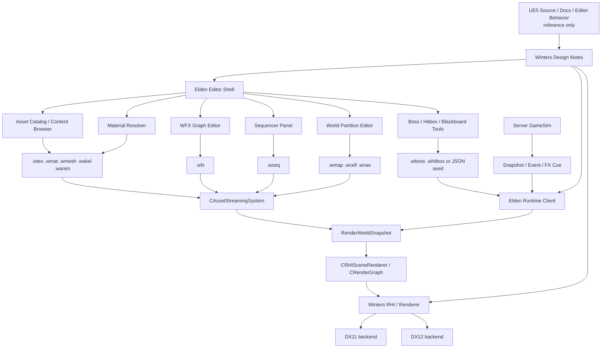

# UE5 Reference, DX12 RHI, Elden Editor Big Picture

작성일: 2026-06-04

상태: 상위 방향 고정 문서. 이후 실제 구현은 `/plan-rules` 형식의 세션 문서로 쪼갠다.

참고 기준:
- `.md/architecture/WINTERS_CODEBASE_COMPASS.md`
- `.md/plan/rhi/sessions/S13_LOL_TO_ELDEN_SHARED_RHI_RENDER_PIPELINE.md`
- `.md/EldenRing/00_ELDENRING_INDEX.md`
- `.md/EldenRing/01_CLIENT_SPLIT_ENGINE_BOUNDARY.md`
- `.md/EldenRing/02_ASSET_EXTRACTION_TO_WINTERS_BINARY_PIPELINE.md`
- `.md/EldenRing/03_ELDEN_CLIENT_RUNTIME_ARCHITECTURE.md`
- `.md/EldenRing/04_WORLD_PARTITIONING_STREAMING.md`
- `.md/EldenRing/05_NETWORK_PVP_COOP_RAID_SERVER_AUTH.md`
- `.md/EldenRing/06_FX_GRAPH_SEQUENCER_EDITOR.md`
- `.md/EldenRing/07_ASSET_LOADER_AND_STREAMING_RUNTIME.md`
- `.md/EldenRing/08_SESSION_ROADMAP.md`
- `.md/EldenRing/10_ASSET_PIPELINE_TOOLING.md`
- `.md/EldenRing/11_SHARED_RHI_RENDERING_ENTRY.md`
- `.md/plan/EldenRingEditor/01_DX12_IMGUI_EDITOR_BOOTSTRAP.md`부터 `07_BOSS_BLACKBOARD_HFSM_BT_TUNING.md`

## 핵심 결론

목표는 Unreal Engine을 Winters 안에 섞는 것이 아니다.

목표는 다음이다.

```text
UE5 source/reference
  -> 구조와 UX를 공부하는 기준점
  -> Winters 자체 RHI, asset, editor, FX, sequencer 설계에 반영
  -> 코드 복사 없이 Winters runtime contract로 재구현
```

Unreal급 editor, Niagara급 FX editor, Sequencer급 timeline, Asset Browser/Loader를 만들되 모든 산출물은 Winters 포맷과 Winters runtime을 통과해야 한다.

```text
Editor에서 만든 데이터
  -> .wtex / .wmat / .wmesh / .wskel / .wanim / .wmap / .wfx / .wseq
  -> Asset Streaming System
  -> RenderWorldSnapshot
  -> CRHISceneRenderer / CRenderGraph
  -> DX11 / DX12 backend
```

따라서 구현 순서는 “에디터 화면을 먼저 크게 만들기”가 아니라 “runtime contract를 먼저 작게 증명하고, editor가 그 contract를 편집하게 만들기”다.

## 현재 RHI 세션 상태

현재 그래픽 RHI 세션은 다음 ladder로 본다.

| Session | 상태 | 목표 |
|---|---|---|
| 00 | 완료 | 회전 컬러 큐브 |
| 01 | 완료 | depth가 정상인 3D 큐브와 camera projection |
| 02 | 진행 | texture와 directional light가 적용된 큐브 |
| 03 | 대기 | roughness/metallic 차이가 보이는 PBR material sphere |
| 04 | 대기 | 추출 static mesh가 material slot과 함께 렌더링 |
| 05 | 대기 | 다중 light를 Forward+ 경로로 처리하는 PBR scene |
| 06 | 대기 | TAA on/off 차이가 보이는 temporal resolve |
| 07 | 대기 | light를 받는 volumetric fog |
| 08 | 대기 | raster/compute GI debug view |
| 09 | 대기 | DXR 지원 GPU에서 RT shadow 또는 RT AO debug view |

이 ladder의 의미는 단순 렌더링 데모가 아니다.

| RHI 세션 | 이후 editor 기능과의 연결 |
|---|---|
| 02 texture + directional light | texture viewer, material preview, asset browser thumbnail의 최소 기반 |
| 03 PBR material sphere | material resolver, roughness/metallic channel 검증 |
| 04 static mesh + material slot | content browser에서 선택한 `.wmesh/.wmat` preview |
| 05 Forward+ PBR scene | editor viewport가 다중 light preview를 제공할 수 있는 기준 |
| 06 TAA | viewport 품질 옵션과 temporal debug panel 기준 |
| 07 volumetric fog | level/world preview에서 atmosphere/fog authoring의 기반 |
| 08 GI debug view | renderer debugging editor panel의 기반 |
| 09 RT shadow/AO | 고급 renderer debug mode와 GPU capability panel의 기반 |

Session 02가 닫히기 전에는 Niagara급 graph나 Sequencer timeline을 크게 벌리지 않는다. 지금은 texture, light, material, mesh가 editor preview에서 실제로 보이는 길을 먼저 닦는다.

## UE5 소스 사용 원칙

UE5 source는 reference depot이다.

허용:
- Niagara, Sequencer, AssetRegistry, ContentBrowser, WorldPartition, RenderGraph의 책임 분리 관찰
- editor UX, panel 구성, validation flow, asset dependency flow 학습
- 이름이 아니라 개념을 Winters식으로 재구성
- public documentation과 직접 실행한 UE editor behavior를 비교 기준으로 기록

금지:
- UE source code를 Winters에 복사
- UE module을 Winters runtime/editor에 직접 link
- UE asset/package/runtime type을 Winters asset contract 대신 사용
- Winters의 공용 엔진 경계를 깨면서 UE식 거대 object model을 그대로 이식

UE는 정답지가 아니라 benchmark다. Winters는 `WintersEngine.dll`과 자체 `.w*` 포맷을 중심으로 독립 구현한다.

## 제품 그림

최종 제품 경계는 다음이다.

```text
WintersEngine.dll
├── WintersLOL.exe 또는 현재 Client shell
│   └── MOBA runtime, LoL visual regression, server-authoritative gameplay 검증
├── WintersElden.exe 또는 현재 EldenRingClient staging
│   └── action RPG runtime, field test, asset probe, world partition 검증
└── EldenRingEditor 또는 Elden editor scene
    └── asset catalog, viewport, WFX graph, Sequencer, world partition tools
```

현재 작업 폴더에 `EldenRingClient/`와 `EldenRingEditor/` staging이 존재할 수 있다. 문서의 장기 명칭은 기존 EldenRing 계획처럼 `WintersElden.exe`를 사용하되, 세션 계획서에서는 실제 코드/프로젝트명을 확인한 뒤 현재 이름을 따른다.

엔진 계층 책임은 유지한다.

| 계층 | 소유 |
|---|---|
| Engine | window, frame loop, RHI, renderer, resource, editor/runtime 공통 서비스 |
| Client/EldenRingClient | scene, camera, input, presentation bridge, action RPG runtime |
| Server/Shared | gameplay truth, snapshot/event, boss/raid authority |
| Tools/Editor | import, convert, validate, authoring, preview, cook/export |

Editor는 runtime을 우회하지 않는다. Editor가 만든 데이터가 runtime에서 그대로 로드되어야 한다.

## 전체 아키텍처



## UE 기능과 Winters 대응표

| UE 기준 | Winters 목표 | 첫 증명 |
|---|---|---|
| RHI / RDG | `IRHIDevice`, `IRHICommandList`, `CRenderGraph`, `CRHISceneRenderer` | textured directional cube, static mesh draw |
| Content Browser / AssetRegistry | `CAssetCatalog`, asset manifest, dependency inspector | `.wmesh/.wmat/.wtex` 목록과 preview |
| Material Editor / Substrate | `CWintersMaterialResolver`, `.wmat`, PBR preview | roughness/metallic sphere, selected mesh material slot |
| Niagara | `.wfx` document, WFX graph metadata, bake to runtime emitter desc | burst billboard + texture binding + preview play/stop |
| Sequencer | `.wseq`, timeline tracks, sequence player | camera track scrub/play |
| World Partition | `.wmap/.wcell`, streaming source, cell state panel | fake camera 이동에 따른 cell visible/load count |
| Animation tools | `.wskel/.wanim`, action state, hitbox timeline | idle/run/attack/dodge preview |
| Gameplay debugger | server snapshot/event trace, boss blackboard, action state panel | target/distance/phase/action reason debug |
| Cook/package | `.winters` bundle | loose `.w*` fallback disabled in release-like config |

## 큰 단계

### Phase A. RHI visual foundation

목표:
- DX12 RHI가 clear/present를 넘어 texture, light, depth, PBR, static mesh를 안정적으로 그린다.
- LoL과 Elden이 renderer class hierarchy를 복제하지 않고 공용 RHI renderer를 사용한다.

완료 기준:
- Session 02 texture + directional light cube 통과
- Session 03 PBR material sphere 통과
- Session 04 extracted static mesh + material slot 통과
- `CRHISceneRenderer` 또는 동일 역할의 공용 renderer path가 DX12에서 entry를 가진다.

주의:
- build 통과를 위해 DX12 path를 legacy DX11 concrete type으로 되돌리지 않는다.
- Elden 전용 renderer를 만들지 않는다.
- Editor viewport는 이 기반 위에 올라간다.

### Phase B. Asset contract foundation

목표:
- Editor와 runtime이 같은 asset contract를 쓴다.
- `.wmesh/.wskel/.wanim`은 이미 진행 중인 converter 흐름을 따른다.
- texture/material은 `.wtex/.wmat` 방향으로 고정하되, 초기에는 PNG + JSON binding fallback을 허용한다.

우선 포맷:

| 포맷 | 역할 | 단계 |
|---|---|---|
| `.wmesh` | static/skinned mesh | P0 |
| `.wskel` | skeleton | P0 |
| `.wanim` | animation clip | P0 |
| `.wtex` | compressed texture + mip | P1 |
| `.wmat` | material parameter + texture binding | P1 |
| `.wmap/.wcell` | world partition metadata | P2 |
| `.wfx` | FX graph/runtime emitter | P2 |
| `.wseq` | sequencer tracks | P3 |
| `.winters` | packaged bundle | P3 |

완료 기준:
- selected static mesh가 material slot과 함께 preview된다.
- material resolver가 albedo/normal/roughness/metallic/emissive 후보를 분리해서 보여준다.
- asset loader는 handle/state를 노출하고 placeholder -> ready swap을 지원한다.

### Phase C. Editor shell and content browser

목표:
- DX12 ImGui editor shell을 먼저 안정화한다.
- Dockspace, viewport, asset browser, inspector, log/debug panels가 최소 기능을 가진다.

첫 패널:
- Viewport
- Content Browser
- Asset Inspector
- Material Resolver
- Asset Streaming
- RHI Debug
- World Partition

완료 기준:
- Editor가 DX12 backend에서 ImGui를 띄운다.
- resource root를 scan해서 `.w*`, PNG, JSON manifest를 분류한다.
- asset 선택 시 preview viewport에 static mesh 또는 texture가 보인다.

주의:
- Editor 전용 기능이 normal F5 runtime을 숨기거나 우회하면 안 된다.
- Engine public header에 DX12 concrete type을 노출하지 않는다.

### Phase D. Static mesh, material, and map assembly

목표:
- EldenRing 추출 static mesh 하나를 editor viewport에서 안정적으로 확인한다.
- Limgrave static catalog와 map assembly seed를 만든다.
- transform이 없는 map reference는 배치하지 않고 reference-only로 표시한다.

완료 기준:
- catalog에서 선택한 `.wmesh`가 viewport에 표시된다.
- material slot과 resolved texture channel이 inspector에 표시된다.
- map assembly panel은 `mapPieces`, `collisions`, `enemyIds`, `assetIds` 요약을 보여준다.
- exact transform parser가 없는 항목은 `MSB transform parser required` 상태로 남긴다.

### Phase E. World partition and streaming

목표:
- `World = grid cells + data layers + streaming sources + async asset loader` 구조를 증명한다.
- 처음에는 sync baseline을 허용하되, interface는 async loader로 넘어갈 수 있게 둔다.

완료 기준:
- fake camera/player source 위치에 따라 cell state가 바뀐다.
- cell state는 `Unloaded`, `Queued`, `LoadingMetadata`, `LoadingAssets`, `CreatingEntities`, `LoadedHidden`, `Visible`, `Unloading` 중 최소 subset으로 보인다.
- visible cell asset dependency가 Asset Streaming panel과 연결된다.
- transform 없는 reference는 draw call에 들어가지 않는다.

### Phase F. WFX graph editor

목표:
- Niagara 전체 복각이 아니라 Winters `.wfx` runtime document 위에 graph editor를 얹는다.
- 기존 FX cue path를 깨지 않는다.

첫 목표:

```text
Spawn -> Initialize -> Update -> Render
```

첫 노드:
- Burst
- InitPosition
- InitVelocity
- InitColor
- InitLifetime
- Age
- Gravity
- Drag
- SizeOverLife
- ColorOverLife
- BillboardRenderer
- MeshRenderer

완료 기준:
- graph metadata가 없는 기존 `.wfx`도 로드된다.
- graph metadata를 저장해도 runtime emitter desc가 같이 저장된다.
- editor preview는 play/stop/restart가 가능하다.
- gameplay FX는 여전히 server cue -> client visual path로 한 번만 재생된다.

### Phase G. Sequencer

목표:
- Unreal Sequencer급 전체 기능이 아니라, Elden runtime에서 실제 쓸 cutscene/timeline asset을 만든다.

첫 트랙:
- CameraTrack
- AnimTrack
- FxTrack
- EventTrack

완료 기준:
- camera track key를 찍고 scrub/play할 수 있다.
- sequence player가 `.wseq` 또는 JSON seed를 읽어 preview viewport에 적용한다.
- runtime에서는 sequence가 gameplay truth를 직접 판정하지 않는다.

### Phase H. Character, action combat, and hitbox timeline

목표:
- static mesh editor 다음에 skinned character/action runtime을 붙인다.
- 첫 세로 슬라이스는 idle/run/attack/dodge와 hitbox/hurtbox debug draw다.

완료 기준:
- `.wmesh/.wskel/.wanim` fast path로 캐릭터가 로드된다.
- bind pose 탈출, skinning 폭발 없음.
- action state가 `Idle/Move/Dodge/LightAttack/HitReact` 최소 subset을 가진다.
- hitbox window가 animation time에 맞춰 보이고 dummy enemy를 타격한다.

주의:
- 고본수 캐릭터가 막히면 static proxy 또는 bones 제한이 낮은 후보로 진행한다.
- 보스 AI나 FX를 캐릭터 animation 문제가 풀릴 때까지 기다릴 필요는 없지만, 실제 montage/FX mapping은 character path가 안정화된 뒤 붙인다.

### Phase I. Boss, raid, and server authority

목표:
- Elden action RPG의 포트폴리오 메시지는 client visual뿐 아니라 server authority까지 이어져야 한다.

원칙:

```text
Client Input
  -> GameCommand
  -> Server GameSim
  -> Snapshot/Event/FX Cue
  -> Client Visual
```

완료 기준:
- Boss AI는 client visual path에서 gameplay 결과를 직접 만들지 않는다.
- Boss blackboard/HFSM/BT decision은 GameCommand 후보로만 나간다.
- hitbox 판정, damage, phase transition은 server authority가 가진다.
- client는 animation, telegraph FX, UI, camera shake를 재생한다.

### Phase J. Packaging and public boundary

목표:
- 로컬 연구용 EldenRing 추출 에셋과 공개 가능한 Winters engine/tooling portfolio를 분리한다.

원칙:
- 원본 추출 에셋은 로컬/비공개 검증용이다.
- GitHub/public build에는 원본 EldenRing 에셋을 올리지 않는다.
- 공개 포트폴리오는 engine code, converter/tooling code, 구조 문서, 직접 만든 대체 asset, 시연 영상 중심으로 구성한다.
- release-like config에서는 loose FBX/PNG fallback을 끌 수 있어야 한다.

## `/plan-rules` 세션 운용 방식

이 문서는 큰그림이다. 실제 작업은 세션별 코드 지시서로 진행한다.

세션 문서 규칙:
- 시작 줄은 반드시 `Session - ...` 형식이다.
- 섹션은 `1. 반영해야 하는 코드`, `2. 검증`만 둔다.
- 새 파일은 전체 본문을 쓴다.
- 기존 파일은 정확한 기존 코드 anchor와 `아래에 추가`, `아래로 교체`, `삭제`만 쓴다.
- `.vcxproj/.filters` 변경은 사용자가 명시하지 않으면 검증의 `확인 필요`에만 둔다.
- 불확실하면 `CONFIRM_NEEDED`로 남기고, 다음 세션 전에 대상 파일을 더 inspect한다.

세션마다 확인할 것:
- 이번 변경이 gameplay truth인지 presentation인지 구분한다.
- 새 의존 방향이 Engine -> Client로 새지 않는지 확인한다.
- Client/Public 또는 Shared에 DX11/DX12 concrete type을 노출하지 않는지 확인한다.
- normal F5 runtime을 editor/lab path로 우회하지 않는지 확인한다.
- runtime asset contract 없이 editor UI만 커지지 않는지 확인한다.

## 제안 세션 순서

아래 순서는 상위 방향이다. 실제 `/plan-rules` 문서는 각 세션 직전에 코드 파일을 inspect한 뒤 작성한다.

### RHI ladder

| 순서 | 세션 | 완료 기준 |
|---|---|---|
| RHI-02 | Texture + directional light cube 마무리 | texture SRV/bind group, normal/light direction, camera projection 안정 |
| RHI-03 | PBR material sphere | roughness/metallic 차이가 한 화면에서 보임 |
| RHI-04 | Static WMesh + material slot | 추출 static mesh 1개가 material slot과 함께 보임 |
| RHI-05 | Forward+ PBR scene | 여러 light가 한 scene에서 처리됨 |
| RHI-06 | TAA toggle | on/off 차이와 debug panel 확인 |
| RHI-07 | Volumetric fog | directional light/fog interaction 확인 |
| RHI-08 | GI debug view | raster/compute GI debug visualization |
| RHI-09 | RT shadow/AO | DXR 지원 GPU에서 optional debug path |

### Editor/runtime ladder

| 순서 | 세션 | 완료 기준 |
|---|---|---|
| ED-01 | DX12 ImGui editor bootstrap | dockspace/debug overlay가 DX12 backend에서 표시 |
| ED-02 | Asset catalog root scan | `.w*`, PNG, JSON manifest가 tree/table로 표시 |
| ED-03 | Texture/material preview | selected texture와 material channel preview |
| ED-04 | Static WMesh preview | selected `.wmesh` viewport draw |
| ED-05 | Material resolver | albedo/normal/roughness/metallic/emissive matching |
| ED-06 | Asset handle/state registry | queued/loading/ready/failed 상태 panel |
| ED-07 | Map assembly seed | map reference와 transform 가능 여부 표시 |
| ED-08 | World partition seed | fake camera/source로 cell state 변화 |
| ED-09 | WFX graph minimum | burst billboard graph save/load/preview |
| ED-10 | Sequencer camera track | keyframe, scrub, play, save/load |
| ED-11 | Hitbox timeline | attack clip time에 hitbox window 표시 |
| ED-12 | Boss blackboard tool | server-authoritative decision debug/tuning 연결 |

### Runtime/gameplay ladder

| 순서 | 세션 | 완료 기준 |
|---|---|---|
| ER-01 | Elden client/runtime entry | field/probe scene 진입 |
| ER-02 | Character asset fast path | `.wmesh/.wskel/.wanim` 로드 |
| ER-03 | Third-person camera | spring arm, yaw/pitch, lock-on seed |
| ER-04 | Action state minimum | idle/move/dodge/light attack |
| ER-05 | Hitbox/hurtbox local smoke | dummy enemy 피격 |
| ER-06 | Streaming source runtime | player 이동으로 cell request |
| ER-07 | Server input/snapshot schema | Elden input command와 snapshot seed |
| ER-08 | Boss/Raid prototype | server phase/action authority |

## 게이트

각 게이트를 통과하기 전에는 다음 큰 범위로 넘어가지 않는다.

| Gate | 통과 기준 | 막히면 할 일 |
|---|---|---|
| G0 RHI visible | textured lit cube가 안정적으로 보임 | editor UI 확장 중단, RHI bind/texture/light부터 수정 |
| G1 PBR channel | roughness/metallic/material slot 차이가 보임 | material resolver 대량 적용 중단 |
| G2 Static asset | 추출 static mesh 1개가 `.wmesh/.wmat`로 표시 | world partition/map assembly 배치 중단 |
| G3 Editor shell | DX12 ImGui dockspace와 viewport 표시 | WFX/Sequencer panel 확장 중단 |
| G4 Asset catalog | asset list, selection, preview path 연결 | hot reload/streaming 확장 중단 |
| G5 Streaming state | handle state와 world cell state가 보임 | 대량 map/FX 로드 중단 |
| G6 WFX bake | graph -> runtime emitter desc bake | gameplay FX cue 연결 중단 |
| G7 Sequencer playback | camera track scrub/play | cinematic/gameplay callback 연결 중단 |
| G8 Character action | idle/run/attack/dodge와 hitbox smoke | boss montage/raid 연출 연결 중단 |
| G9 Server authority | input -> server sim -> snapshot/event 왕복 | client-only boss/gameplay 결과 생성 금지 |

## 주요 리스크와 대응

| 리스크 | 대응 |
|---|---|
| UE 소스 이식 욕심으로 범위 폭발 | UE는 reference only, Winters contract로 재구현 |
| Editor UI만 커지고 runtime 로드가 안 됨 | 모든 panel은 `.w*` 또는 JSON seed -> runtime preview를 완료 기준으로 둠 |
| DX11/DX12 renderer가 분기 복제됨 | LoL/Elden 모두 `RenderWorldSnapshot`과 공용 RHI renderer를 사용 |
| Client/Public에 backend concrete type 노출 | `IRHIDevice`, opaque handle, cpp-local backend state 유지 |
| 원본 EldenRing 에셋 배포 문제 | 로컬/비공개 검증용으로만 사용, 공개 빌드는 대체 에셋 |
| 고본수 character로 첫 smoke가 막힘 | static WMesh 또는 낮은 risk 후보로 먼저 renderer/asset path 검증 |
| World Partition이 과설계됨 | cell 1개, fake camera, JSON metadata부터 시작 |
| Niagara 전체 복각으로 지연 | `.wfx` graph minimum과 runtime emitter bake부터 시작 |
| Sequencer가 gameplay truth를 침범 | sequence는 presentation/timeline, gameplay 결과는 server/GameSim |
| 정상 LoL F5 flow가 깨짐 | LoL DX11 visual smoke와 relevant build를 계속 검증 |

## 검증 기본값

세션별로 달라질 수 있지만 기본 검증은 아래를 우선한다.

```powershell
git diff --check
```

RHI/Engine 변경:

```powershell
& 'C:\Program Files\Microsoft Visual Studio\18\Community\MSBuild\Current\Bin\MSBuild.exe' Winters.sln /t:Engine /m /p:Configuration=Debug /p:Platform=x64 /v:minimal
```

LoL Client 영향 변경:

```powershell
& 'C:\Program Files\Microsoft Visual Studio\18\Community\MSBuild\Current\Bin\MSBuild.exe' Winters.sln /t:Client /m /p:Configuration=Debug /p:Platform=x64 /v:minimal
```

DX12 Elden staging 변경:

```powershell
& 'C:\Program Files\Microsoft Visual Studio\18\Community\MSBuild\Current\Bin\MSBuild.exe' Winters.sln /t:EldenRingClient /m /p:Configuration=Debug-DX12 /p:Platform=x64 /v:minimal
```

Editor project 변경:

```powershell
& 'C:\Program Files\Microsoft Visual Studio\18\Community\MSBuild\Current\Bin\MSBuild.exe' Winters.sln /t:EldenRingEditor /m /p:Configuration=Debug-DX12 /p:Platform=x64 /v:minimal
```

Engine public header를 바꾼 세션:

```text
후속 동기화:
- `UpdateLib.bat` 실행 또는 빌드 전 SDK sync 필요 여부 확인.
```

## 성공 그림

중간 성공 그림:

```text
EldenRingEditor
  -> DX12 viewport
  -> Content Browser에서 .wmesh 선택
  -> Material Resolver가 texture channel 표시
  -> viewport에서 PBR material preview
  -> Asset Streaming panel에서 handle state 확인
  -> World Partition panel에서 cell 상태 확인
```

첫 강한 포트폴리오 그림:

```text
EldenRingClient / WintersElden
  -> 작은 field boot
  -> partitioned cell 1~3개 로드
  -> skinned character idle/run/attack/dodge
  -> hitbox debug
  -> WFX telegraph preview
  -> Sequencer camera intro
  -> server event로 FX cue 재생
```

최종 메시지:

```text
Winters는 자체 C++ 엔진 DLL, 자체 RHI, 자체 asset binary, 자체 editor tooling으로
MOBA와 action RPG runtime을 모두 구동한다.
UE5는 참고 기준이고, Winters는 독립 구현이다.
```
