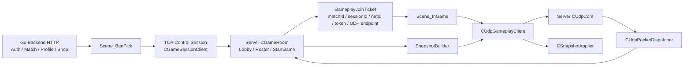

# TCP / UDP 이주 계획서 인덱스

> [!IMPORTANT]
> **Historical baseline.** 아래 본문을 현재 구현 상태로 사용하지 않는다. 최신 기준은 [2026-07-13 canonical implementation plan](../../plan/2026-07-13_UDP_JOB_SYSTEM_CHASE_LEV_FIBER_IMPLEMENTATION_PLAN.md)과 [S023 결과 보고서](../../build/2026-07-13_UDP_JOB_SYSTEM_CHASE_LEV_FIBER_RESULT.md)다.
> As-built delta: JobSystem Submit race, Chase-Lev deque, FiberFull 및 stress 구현은 완료되었고, UDP v3 generic vertical slice와 server hub/client facade가 구현되었다. main F5 통합과 최종 build 상태는 S023 결과 보고서를 따른다. 6주 Fiber mastery 프로그램은 미착수이며, 현재 상태는 production UDP cutover가 아니다.
> 2026-07-14 S031 추가: reliable lane의 고정 120ms RTO가 RFC 6298 적응형 RTO(SRTT/RTTVAR + Karn)로 대체되었고, 시드 고정 loss/reorder/dup chaos 검증이 `UdpLoopbackHarness`에 추가되었다 — [S031 결과](../../../Plan/S031_UDP_ADAPTIVE_RTO_CHAOS_HARNESS_RESULT_20260714.md). 보안(MAC/AEAD·ticket validator), pacing/congestion, Snapshot diet, cutover는 여전히 미완이다.
> 과거 UDP v2 수치인 **24 B header / 10 B fragment header / 1 MiB logical payload**는 historical design이다. 실제 v3 상수는 **40 B header / 16 B fragment header / 1,200 B datagram / 64 KiB logical payload**다.

> **상태 동기화 (2026-07-11 — HISTORICAL HYBRID PLAN)**: 현재 runtime의 lobby와 gameplay는 모두 TCP이며 UDP 송수신 구현은 0이다. 이 묶음의 `TCP Control + UDP Gameplay`는 2026-05-07 목표안이지 구현 완료 상태가 아니다. 사용자의 최신 목표인 **WintersServer 실시간 session 전체 UDP + Server Job/Fiber 통합**, 실제 5~22KB snapshot 측정, 수정된 이행 순서는 [2026-07-11 통합 감사](../../plan/2026-07-11_FULL_UDP_AND_SERVER_FIBER_INTEGRATION_AUDIT.md)를 우선한다.

작성일: 2026-05-07  
대상: Winters LoL 네트워크 구조 이주  
핵심 결정: **TCP는 BanPick + Backend 제어면(Control Plane), UDP는 InGame Gameplay 데이터면(Gameplay Plane)으로 분리한다.**

---

## 0. 최종 구조 한 줄 요약

현재 Winters는 TCP 세션 하나가 BanPick 로비와 InGame Command/Snapshot까지 모두 담당할 수 있는 형태로 MVP가 잡혀 있다. 이 문서 묶음의 목표는 그 구조를 다음처럼 분리하는 것이다.

```text
Go Backend HTTP
  - Auth / Matchmaking / Profile / Shop / Payment
  - 계정, 매칭, 구매, 인벤토리, 장착 스킨

TCP Control Session
  - BanPick / LobbyCommand / LobbyState / GameStart
  - 챔피언 선택, 슬롯 동기화, 방 생성, 게임 시작 신호
  - UDP Gameplay 접속 티켓 발급

UDP Gameplay Session
  - GameplayJoin / CommandBatch / Snapshot / Event
  - 이동, 스킬, 전투, 상태 복제, 예측, 보정
  - 신뢰성 채널, 델타, AOI, Lag Compensation, Prediction
```

---

## 1. 문서 구성

| 파일 | 역할 |
|---|---|
| `00_TCP_UDP_MIGRATION_INDEX.md` | 전체 결론, 현재 상태, 문서 지도 |
| `01_TCP_BANPICK_BACKEND_CONTROL_PLANE.md` | TCP BanPick + Go Backend 제어면 유지 계획 |
| `02_UDP_GAMEPLAY_TRANSPORT_MIGRATION.md` | UDP Gameplay 전송 계층 이주 계획 |
| `03_CROSSOVER_HANDSHAKE_AND_DATA_CONTRACT.md` | TCP GameStart에서 UDP GameplayJoin으로 넘어가는 계약 |
| `04_IMPLEMENTATION_SEQUENCE_AND_VERIFICATION.md` | 구현 순서, 검증 항목, 리스크 체크리스트 |
| `05_LOL_GAMEPLAY_AUTHORITY_COMPLETION_PLAN.md` | LoL식 서버 권위 Gameplay 완성 계획 |
| `06_ANIMATION_PROJECTILE_EFFECT_REPLICATION_PLAN.md` | 애니메이션, 투사체, 이펙트 동기화 상세 계획 |
| `07_TCP_UDP_FULL_SERVER_CLIENT_ROADMAP.md` | TCP/UDP 분리 기준의 서버-클라 완성 로드맵 |

---

## 2. 현재 코드 기준 핵심 사실

### 2.1 Shared 패킷

현재 공용 패킷 헤더는 `Shared/Network/PacketEnvelope.h`에 있다.

주요 타입:

```cpp
enum class ePacketType : uint16_t
{
    CommandBatch = 1,
    Snapshot = 2,
    Event = 3,

    Hello = 10,
    Heartbeat = 11,
    Disconnect = 12,

    LobbyCommand = 20,
    LobbyState = 21,
    GameStart = 22,
};
```

`PacketHeader`는 16바이트 고정 헤더이며, 현재 TCP에서는 length-prefixed frame처럼 사용된다. UDP M1에서는 이 헤더를 데이터그램 내부의 공용 envelope로 재사용할 수 있다. 단, TCP stream framing용 `TryExtractFrame`과 UDP datagram 해석은 분리해야 한다.

### 2.2 Server TCP 네트워크

현재 Server 쪽 TCP 네트워크는 다음 파일들이 중심이다.

```text
Server/Private/Network/IOCPCore.cpp
Server/Private/Network/Session.cpp
Server/Private/Network/Session_Manager.cpp
Server/Private/Network/PacketDispatcher.cpp
Server/Private/Network/FrameParser.cpp
```

현재 특징:

- `CIOCPCore`가 `SOCK_STREAM` / `AcceptEx` / `WSARecv` / `WSASend`를 사용한다.
- TCP accept 시점에 `g_pRoom->OnSessionJoin(sessionId)`가 호출된다.
- `CPacketDispatcher`는 TCP byte stream에서 `FrameParser`로 `PacketHeader` 단위 frame을 꺼내고, `CommandBatch`, `LobbyCommand`, `Hello`, `Heartbeat`를 라우팅한다.
- `CSession::TryAcceptSequence`는 sequence 중복과 과도한 future sequence를 막는다.
- `CSession_Manager::ForEach`는 session id 정렬 순서를 보장한다.

### 2.3 Server GameRoom

현재 `Server/Private/Game/GameRoom.cpp`는 BanPick와 gameplay를 모두 품고 있다.

중요 흐름:

- `OnSessionJoin`
  - lobby phase면 슬롯에 세션을 붙이고 `Hello`, `LobbyState`를 전송한다.
  - game phase면 이미 선택된 슬롯에 대해 `Hello`를 다시 보낸다.
- `OnLobbyCommand`
  - BanPick 슬롯 이동, 팀/챔피언 선택, 준비 상태 등을 처리한다.
- `TryStartGame`
  - 빈 슬롯을 bot으로 채운다.
  - roster를 잠근다.
  - ECS 챔피언을 spawn한다.
  - human session에 `Hello`를 보낸다.
  - `LobbyState`, `GameStart`를 broadcast한다.
- `OnCommandBatch`
  - gameplay command를 큐에 넣는다.
- `Tick`
  - fixed tick.
  - pending command를 `acceptedTick`, `sessionId`, `sequenceNum`으로 stable sort한다.
  - snapshot을 생성해 session별로 전송한다.

이 구조는 서버 권위 authoritative gameplay의 뼈대가 이미 있으므로, UDP 이주의 핵심은 GameRoom의 sim 자체를 갈아엎는 것이 아니라 **GameRoom의 입출력 transport를 분리**하는 것이다.

### 2.4 Client TCP 네트워크

현재 Client 쪽 TCP 흐름은 다음 파일들이 중심이다.

```text
Client/Private/Network/Client/ClientNetwork.cpp
Client/Private/Network/Client/GameSessionClient.cpp
Client/Private/Scene/Scene_BanPick.cpp
Client/Private/Scene/InGameNetworkBridge.cpp
Client/Private/Scene/InGamePlayerControlBridge.cpp
Client/Private/Network/Client/CommandSerializer.cpp
Client/Private/Network/Client/SnapshotApplier.cpp
```

현재 특징:

- `CClientNetwork`는 TCP socket 전용이다.
- `CGameSessionClient`는 BanPick에서 연결한 TCP session을 유지하고 InGame으로 넘긴다.
- `Scene_BanPick`은 `CGameSessionClient`로 `LobbyCommand`를 보낸다.
- `InGameNetworkBridge`는 공유 TCP session이 있으면 그 session으로 `Hello` / `Snapshot`을 받고, 없으면 자체 `CClientNetwork`를 생성해 localhost에 붙는다.
- `InGamePlayerControlBridge`는 network active 상태면 우클릭 이동을 `CommandBatch`로 보낸다.
- `CSnapshotApplier`는 `Hello`와 full `Snapshot` 적용을 이미 담당한다.

즉, Client 역시 gameplay 적용부는 재사용 가능하고, 이주 핵심은 `InGameNetworkBridge`의 transport를 TCP에서 UDP gameplay client로 갈아끼우는 것이다.

---

## 3. 기존 UDP 계획에서 유지할 것

기존 문서:

```text
.md/plan/sim/10_UDP_LOL_NETSTACK_MASTER_v2.md
.md/plan/sim/10_v2_M1_UDP_TRANSPORT.md
.md/plan/sim/12_BANPICK_ROOM_SYNC_PLAN.md
.md/plan/sim/13_LEGACY_CHAMPION_ECS_NETWORK_REFACTOR_PLAN.md
```

유지할 결정:

- M1은 UDP transport + Hello/Join + CommandBatch + full Snapshot만 구현한다.
- M1에서는 reliability, fragment, delta, crypto를 넣지 않는다.
- M2에서 3채널 reliability, ack, retransmit, fragment/reassembly를 넣는다.
- M3에서 SnapshotEnvelope full/delta, baseline ack, AOI를 넣는다.
- M4에서 Lag Compensation을 넣는다.
- M5에서 Client Prediction을 넣는다.
- M6에서 Replay Logger와 Determinism 검증을 넣는다.
- determinism guard는 M1부터 유지한다.
  - stable sort
  - `/fp:precise`
  - sim 경로에서 unordered iteration 금지
  - render/editor/fx/audio는 prediction sim subset에서 제외

---

## 4. 이번 업데이트에서 바뀌는 핵심 결정

기존 UDP M1 문서는 TCP 전체를 UDP로 바꾸는 관점이 강했다. 현재 BanPick TCP MVP가 완성된 상태에서는 다음처럼 수정한다.

### 4.1 `CGameSessionClient`는 UDP로 바꾸지 않는다

`CGameSessionClient`는 BanPick TCP control session 소유자로 유지한다.

이유:

- BanPick은 latency보다 신뢰성과 순서가 중요하다.
- LobbyCommand / LobbyState / GameStart는 TCP로 충분하다.
- Backend HTTP, BanPick TCP, InGame UDP가 역할별로 깔끔하게 분리된다.
- InGame에서 reconnect, 로딩, roster 전달을 제어하기 쉽다.

### 4.2 InGame gameplay 전용 UDP client를 새로 둔다

새 후보 이름:

```text
Client/Public/Network/Client/UdpGameplayClient.h
Client/Private/Network/Client/UdpGameplayClient.cpp
```

또는 Winters 컨벤션상 더 넓은 이름:

```text
Client/Public/Network/Client/GameplayNetworkClient.h
Client/Private/Network/Client/GameplayNetworkClient.cpp
```

권장: `CUdpGameplayClient`

이유:

- TCP control client와 이름이 명확히 분리된다.
- 나중에 KCP 또는 자체 reliable UDP가 들어와도 이 파일이 gameplay plane의 주 진입점임이 분명하다.

### 4.3 UDP Hello는 로비 입장용이 아니라 gameplay bind용이어야 한다

기존 UDP M1의 "sourceAddr 기반 세션 생성 + Hello"는 단독 UDP 데모에는 좋지만, 최종 구조에서는 TCP GameStart에서 이미 session, slot, champion, netId가 결정된다.

따라서 UDP M1의 첫 패킷은 다음 중 하나로 업데이트한다.

권장안:

```text
GameplayJoin -> GameplayJoinAck
```

대체안:

```text
Hello(payload: GameplayJoin) -> Hello(payload: GameplayJoinAck)
```

권장안이 더 좋다. `Hello`는 기존 TCP/초기 연결 의미가 섞여 있고, UDP gameplay bind는 보안 토큰과 match identity가 필요하기 때문이다.

### 4.4 GameRoom은 transport 구현체를 직접 알면 안 된다

현재 `GameRoom`은 `CSession_Manager::Instance().Find(sid)`를 통해 TCP session에 직접 전송한다. UDP를 붙이면 이 결합이 가장 먼저 문제 된다.

따라서 M1에서 바로 최소 facade를 둔다.

후보:

```cpp
class IGameplayTransport
{
public:
    virtual ~IGameplayTransport() = default;
    virtual bool_t SendToSession(u32_t sessionId, ePacketType type, const uint8_t* payload, uint32_t size) = 0;
    virtual bool_t IsGameplayReady(u32_t sessionId) const = 0;
};
```

M1 현실적인 선택:

- 처음에는 `GameRoom` 내부 send 지점을 `SendGameplayPacketToSession` 같은 private helper로 한 번 감싼다.
- TCP fallback과 UDP 전송을 그 helper에서 선택한다.
- M2/M3 전에 `IGameplayTransport`로 정식 분리한다.

---

## 5. 목표 아키텍처



---

## 6. Phase 요약

| Phase | 목표 | 결과 |
|---|---|---|
| A | 현재 TCP BanPick / Backend 구조 고정 | Control Plane 경계 확정 |
| B | TCP GameStart에 UDP 접속 티켓 추가 | InGame이 UDP endpoint와 token을 받음 |
| C | Server UDP M1 skeleton | UDP socket, recvfrom/sendto, session bind |
| D | Client UDP gameplay client 추가 | CommandBatch 송신, Snapshot 수신 |
| E | InGameNetworkBridge dual-plane 전환 | BanPick TCP 유지, Gameplay UDP 사용 |
| F | M1 smoke | localhost 1 client: Join -> CommandBatch -> full Snapshot |
| G | M2~M6 고도화 | reliability, delta, AOI, lag comp, prediction, replay |

---

## 7. 절대 지켜야 할 경계

### TCP Control Plane에 남길 것

- Backend HTTP API
- 로그인 / 프로필 / 스킨 / 상점 / 결제
- 매칭 큐
- BanPick 슬롯 / 챔피언 선택 / 준비 상태
- LobbyState broadcast
- GameStart
- UDP gameplay ticket 발급
- 로딩 실패 / 방 나가기 / reconnect 제어

### UDP Gameplay Plane으로 옮길 것

- 이동 입력
- 공격 / 스킬 입력
- 서버 authoritative sim command
- Snapshot full/delta
- 전투 이벤트
- buff/status/event replication
- AOI
- Lag Compensation
- Client Prediction / Reconciliation

### 당장 UDP로 옮기지 말 것

- Auth JWT 발급
- Shop / Payment / Profile
- Matchmaking HTTP
- BanPick LobbyState
- 채팅
- 큰 파일/asset 동기화
- replay 업로드

---

## 8. 리스크 요약

| 리스크 | 이유 | 대응 |
|---|---|---|
| GameRoom이 TCP Session_Manager에 직접 결합 | Snapshot 전송 지점이 TCP 전용 | helper/facade로 전송 경계 분리 |
| UDP에는 accept가 없음 | 기존 `OnSessionJoin`이 TCP accept에서 호출됨 | UDP `GameplayJoin` 성공 시 room에 bind 알림 |
| UDP sourceAddr만 믿으면 취약 | spoof/rebind/중복 접속 문제 | TCP GameStart ticket + token TTL |
| M1 full snapshot이 MTU 초과 가능 | fragment가 M2라서 M1은 작은 payload만 안전 | M1 smoke 범위 제한 + snapshot size logging |
| TCP와 UDP가 같은 sequence 규칙을 공유하기 어려움 | TCP stream seq와 UDP datagram seq 의미가 다름 | UDP header에 transport seq/channel 추가는 M2에서 |
| Prediction에 render state가 섞일 수 있음 | determinism 붕괴 | sim-only component allowlist |

---

## 9. 이번 문서 묶음의 결론

UDP 이주는 "TCP를 제거하는 작업"이 아니다. 지금 업데이트된 Winters 구조에서는 더 정확히 말해 **TCP가 잘하는 로비/백엔드/제어 흐름은 남기고, 프레임 단위 gameplay만 UDP로 독립시키는 작업**이다.

따라서 첫 구현 목표는 다음 하나로 압축된다.

```text
BanPick TCP GameStart가 UDP GameplayJoinTicket을 내려준다.
Scene_InGame은 TCP session을 유지한 채 UDP gameplay session을 새로 연다.
CommandBatch와 Snapshot만 UDP로 왕복시킨다.
```

이 선만 성공하면 M2부터 reliable UDP, delta snapshot, AOI, prediction을 순서대로 얹을 수 있다.

---

## 10. 2026-05-07 런타임 검증 추가 결론

방금 런타임 검증 기준으로 다음 항목은 아직 gameplay 동기화가 되어 있지 않다.

```text
Animation sync    : 미완성
Projectile sync   : 미완성
Effect sync       : 미완성
Skill authority   : 부분 준비, 실전 동기화 미완성
Minion authority  : Client/Engine 로컬 구현 존재, Server GameRoom 미연결
Tower authority   : Engine 시스템 존재, Server GameRoom 미연결
Damage authority  : Pipeline 존재, DamageQueue 실행 미완성
```

따라서 UDP 진행은 transport만 붙이는 작업으로 끝내면 안 된다. 이제 목표는 다음으로 확장한다.

```text
TCP Control Plane:
  Backend / Login / Matchmaking / BanPick / Lobby / GameStart / PostGame

UDP Gameplay Plane:
  Input / Skill / BasicAttack / Movement / Projectile / AnimationEvent /
  Snapshot / Damage / Health / Buff / Minion / Tower / Jungle / EffectTrigger

Client:
  입력 예측, 렌더링, 사운드, VFX 재생
  단, gameplay 결과의 최종 원천은 항상 Server

Server:
  모든 판정, HP, death, projectile hit, tower shot, minion wave, skill cast,
  cooldown, buff, animation state id, authoritative event 발행
```

상세 계획은 다음 세 문서에 추가로 정리했다.

- `05_LOL_GAMEPLAY_AUTHORITY_COMPLETION_PLAN.md`
- `06_ANIMATION_PROJECTILE_EFFECT_REPLICATION_PLAN.md`
- `07_TCP_UDP_FULL_SERVER_CLIENT_ROADMAP.md`
