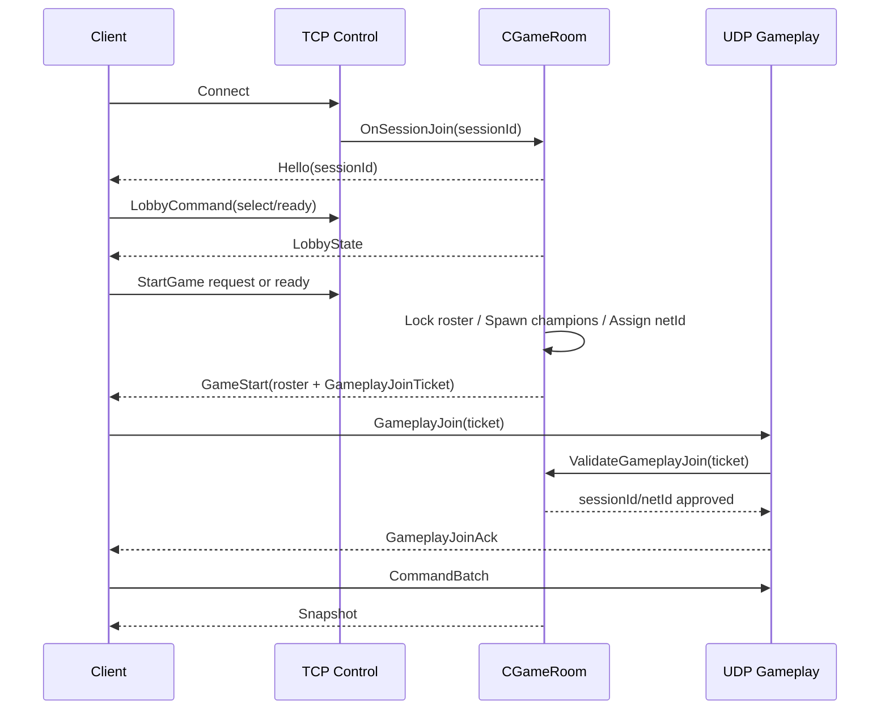

# TCP GameStart -> UDP GameplayJoin 계약

작성일: 2026-05-07  
대상: BanPick TCP에서 InGame UDP로 넘어가는 데이터 계약  
결론: **TCP GameStart는 UDP gameplay 접속권을 발급하고, UDP GameplayJoin은 그 접속권을 검증해 gameplay peer를 bind한다.**

---

## 1. 왜 이 계약이 필요한가

UDP에는 TCP accept가 없다. TCP에서는 연결이 성립되는 순간 서버가 session을 만들고 `OnSessionJoin`을 호출할 수 있었다.

하지만 UDP gameplay에서는 다음 정보가 이미 BanPick에서 결정되어 있어야 한다.

- 이 유저가 어떤 match에 속하는지
- 어떤 TCP session에서 온 유저인지
- 어떤 slot/team/champion인지
- 어떤 ECS entity/netId를 조종하는지
- UDP endpoint에 접속할 권한이 있는지

따라서 UDP는 "새 유저 입장"을 처리하면 안 된다. UDP는 **이미 TCP Control Plane에서 승인된 플레이어의 gameplay transport를 bind**해야 한다.

---

## 2. 전체 상태 흐름



---

## 3. TCP GameStart payload

### 3.1 필수 필드

`GameStart`에는 최소 다음 필드가 있어야 한다.

```text
matchId
roomId
localSessionId
localNetId
localSlotId
localTeam
localChampionId
localSkinId
udpHost
udpPort
gameplayToken
tokenExpireUnixMs
serverTick
commandRate
snapshotRate
roster[]
```

### 3.2 Roster entry

```text
slotId
sessionId
netId
team
championId
skinId
isBot
displayName
```

Bot은 `sessionId = 0` 또는 별도 sentinel을 쓴다. 단, `netId`는 반드시 있어야 한다. Snapshot에는 bot entity도 포함되기 때문이다.

### 3.3 GameplayJoinTicket

`GameStart` 안에 포함되는 ticket은 다음 의미를 갖는다.

```text
이 TCP session/sessionId/netId/player가
이 match/room의
이 UDP endpoint에
제한 시간 안에
gameplay peer로 bind할 수 있다.
```

필드 후보:

```text
matchId: u64
roomId: u32
sessionId: u32
netId: u32
slotId: u8
team: u8
championId: u16
skinId: u32
udpHost: string
udpPort: u16
token: string
expiresAtUnixMs: u64
issuedServerTick: u64
```

---

## 4. UDP GameplayJoin payload

새 schema 권장:

```text
Shared/Schemas/GameplayJoin.fbs
```

Packet type 후보:

```cpp
GameplayJoin = 30,
GameplayJoinAck = 31,
UdpAckOnly = 32,
```

`Hello`를 재사용하지 않는 편이 좋다. TCP `Hello`와 UDP gameplay bind는 의미가 다르기 때문이다.

### 4.1 GameplayJoin

필드 후보:

```text
matchId: u64
roomId: u32
sessionId: u32
netId: u32
token: string
clientStartUnixMs: u64
clientProtocolVersion: u16
```

검증:

- packet magic/version
- payload size
- matchId/roomId 존재
- sessionId가 TCP control room에 존재
- netId가 해당 session의 roster와 일치
- token 일치
- token 만료 전
- 이미 다른 remoteAddr에 bind되어 있지 않음

### 4.2 GameplayJoinAck

필드 후보:

```text
accepted: bool
reason: string
sessionId: u32
netId: u32
serverTick: u64
serverUnixMs: u64
snapshotRate: u16
commandRate: u16
maxPayloadBytes: u16
```

`accepted=false`일 때 reason 후보:

```text
InvalidToken
ExpiredToken
RoomNotFound
SessionNotFound
NetIdMismatch
AlreadyBound
ProtocolMismatch
ServerNotInGame
```

M1에서는 reason을 enum이 아니라 string으로 둬도 된다. 장기적으로는 enum이 낫다.

---

## 5. 서버 상태 머신

### 5.1 TCP Control Session 상태

```text
Disconnected
  -> Connected
  -> LobbyJoined
  -> BanPickReady
  -> GameStarting
  -> InGameControlAlive
  -> PostGame
```

TCP session은 InGame에서도 살아 있을 수 있다. 하지만 gameplay command/snapshot은 UDP가 담당한다.

### 5.2 UDP Gameplay Session 상태

```text
None
  -> TicketIssued
  -> JoinReceived
  -> Bound
  -> Active
  -> TimedOut
  -> Closed
```

상태 의미:

| 상태 | 의미 |
|---|---|
| `TicketIssued` | TCP GameStart에서 token 발급 완료 |
| `JoinReceived` | UDP GameplayJoin datagram 수신 |
| `Bound` | token 검증 후 sessionId와 sourceAddr 연결 |
| `Active` | CommandBatch/Snapshot 정상 왕복 |
| `TimedOut` | 일정 시간 input/heartbeat 없음 |
| `Closed` | 게임 종료 또는 명시 disconnect |

---

## 6. 클라이언트 상태 머신

```text
BanPickTcpConnected
  -> GameStartReceived
  -> InGameLoading
  -> UdpSocketOpen
  -> GameplayJoinSent
  -> GameplayJoinAcked
  -> GameplayActive
  -> Reconnecting or PostGame
```

`Scene_InGame`에서 필요한 상태:

```cpp
enum class eGameplayNetworkState
{
    Offline,
    WaitingForTicket,
    OpeningUdp,
    Joining,
    Active,
    Reconnecting,
    Failed,
};
```

M1에서는 UI를 작게라도 노출하면 디버깅이 쉬워진다.

ImGui 표시 후보:

```text
Gameplay Net
  Transport: UDP
  State: Active
  SessionId: 3
  NetId: 1003
  RTT: 0.7 ms
  Last Snapshot Tick: 1842
  Last Command Seq: 911
  Last Datagram Bytes: 348
```

---

## 7. PacketEnvelope 타입 확장

현재 타입:

```cpp
CommandBatch = 1,
Snapshot = 2,
Event = 3,
Hello = 10,
Heartbeat = 11,
Disconnect = 12,
LobbyCommand = 20,
LobbyState = 21,
GameStart = 22,
```

추가 후보:

```cpp
GameplayJoin = 30,
GameplayJoinAck = 31,
UdpAckOnly = 32,
TransportStats = 33,
```

주의:

- `CommandBatch`, `Snapshot`, `Event`는 TCP/UDP 둘 다 사용할 수 있는 semantic packet type으로 남긴다.
- transport reliability channel은 M2의 `UdpPacketHeader`에서 다룬다.
- Packet type enum은 gameplay semantic이고, UDP channel은 transport semantic이다.

---

## 8. FlatBuffers schema 계획

### 8.1 새 schema

```text
Shared/Schemas/GameplayJoin.fbs
```

초안:

```fbs
namespace Winters.Net;

table GameplayJoin {
  matchId:ulong;
  roomId:uint;
  sessionId:uint;
  netId:uint;
  token:string;
  clientStartUnixMs:ulong;
  protocolVersion:ushort;
}

table GameplayJoinAck {
  accepted:bool;
  reason:string;
  sessionId:uint;
  netId:uint;
  serverTick:ulong;
  serverUnixMs:ulong;
  snapshotRate:ushort;
  commandRate:ushort;
  maxPayloadBytes:ushort;
}

root_type GameplayJoin;
```

주의:

FlatBuffers 파일 하나에 root_type은 하나만 둘 수 있다. 실제로는 codegen 방식에 맞춰 `GameplayJoin.fbs`와 `GameplayJoinAck.fbs`를 분리하거나, 현재 repo의 schema 관례를 확인해 맞춘다.

### 8.2 GameStart schema 확장

`GameStart`에 다음 table을 추가하는 형태가 좋다.

```fbs
table GameplayJoinTicket {
  matchId:ulong;
  roomId:uint;
  sessionId:uint;
  netId:uint;
  slotId:ubyte;
  team:ubyte;
  championId:ushort;
  skinId:uint;
  udpHost:string;
  udpPort:ushort;
  token:string;
  expiresAtUnixMs:ulong;
  issuedServerTick:ulong;
}
```

`GameStart` 본문:

```fbs
table GameStart {
  roster:[RosterEntry];
  localNetId:uint;
  ticket:GameplayJoinTicket;
}
```

---

## 9. Token 정책

### 9.1 M1 최소 정책

```text
token length: 128-bit random hex 이상
TTL: 10초~30초
scope: matchId + roomId + sessionId + netId
single-use: 권장
```

M1은 localhost 개발이 많으므로 TTL을 너무 짧게 잡으면 디버깅이 불편하다. 추천:

```text
Debug: 60초
Release/Test: 15초
```

### 9.2 저장 위치

Server `CGameRoom` 내부:

```cpp
struct GameplayJoinTicketState
{
    u32_t sessionId;
    NetEntityId netId;
    string_t token;
    u64_t expiresAtUnixMs;
    bool_t consumed;
};
```

장기적으로는 room/session manager에 분리한다.

### 9.3 검증 후 처리

single-use라면:

```text
GameplayJoin 성공
  -> consumed = true
  -> sourceAddr bind
```

reconnect를 고려하면 single-use가 불편할 수 있다. M1에서는 single-use + reconnect 미지원이 단순하다. reconnect는 M3 이후 별도 token 재발급 흐름으로 다룬다.

---

## 10. Source Address Bind 정책

M1:

```text
첫 GameplayJoin이 온 remoteAddr를 sessionId에 bind한다.
이후 CommandBatch는 같은 remoteAddr만 허용한다.
```

예외:

- localhost 개발 중 port가 바뀌는 경우는 재접속으로 취급한다.
- NAT rebind는 M2/M3 이후 처리한다.

장기 rebind 후보:

```text
RebindRequest(token + lastAck + lastCommandSeq)
```

---

## 11. 장애 처리

### 11.1 UDP Join 실패

Client:

```text
Join retry 3회
실패 시 InGame network state Failed
TCP control로 GameplayJoinFailed 통지 가능
개발 모드에서는 TCP gameplay fallback 사용 가능
```

Server:

```text
invalid token 로그
expired token 로그
session/netId mismatch 로그
sourceAddr conflict 로그
```

### 11.2 TCP Control 끊김

InGame 중 TCP control이 끊겨도 UDP gameplay를 바로 끊을지는 정책 문제다.

M1 추천:

```text
TCP control disconnect -> 로그만 출력
UDP gameplay는 유지
```

장기:

```text
control reconnect window
post-game/report/surrender 경로 복구
```

### 11.3 UDP Gameplay 끊김

M1:

```text
last datagram receive가 3초 이상 없으면 warning
10초 이상 없으면 timeout
```

M2 이후:

```text
ack heartbeat
RTT/loss 측정
disconnect timeout
reconnect token
```

---

## 12. 서버 함수 계약

추가 후보:

```cpp
bool_t CGameRoom::BuildGameplayJoinTicket(u32_t sessionId, GameplayJoinTicket& outTicket);
bool_t CGameRoom::ValidateGameplayJoin(const GameplayJoinRequest& request, GameplayJoinResult& outResult);
void CGameRoom::OnGameplayTransportReady(u32_t sessionId);
void CGameRoom::OnGameplayTransportLost(u32_t sessionId);
```

주의:

- `ValidateGameplayJoin`은 sim tick state를 직접 변경하지 않는 편이 좋다.
- sourceAddr bind는 transport manager 책임이다.
- room은 "이 sessionId/netId가 유효한가"만 판단한다.

---

## 13. 클라이언트 context 계약

`Scene_BanPick`에서 `Scene_InGame`으로 넘기는 context에 다음이 필요하다.

```cpp
struct InGameNetworkContext
{
    bool_t bUseNetworkRoster = false;
    bool_t bUseUdpGameplay = false;
    GameplayJoinTicket Ticket = {};
    LobbyRosterCache Roster = {};
    NetEntityId LocalNetId = NULL_NET_ENTITY;
};
```

기존 context 이름과 실제 타입은 코드에 맞춰야 한다. 핵심은 `GameStart` 수신 결과가 InGame UDP 초기화에 직접 전달되어야 한다는 점이다.

---

## 14. 완료 기준

이 계약 문서 기준 완료 상태:

- `GameStart`가 UDP 접속 정보를 포함한다.
- Client가 `GameStart`만으로 UDP Join을 시도할 수 있다.
- UDP `GameplayJoin`은 TCP에서 승인된 session/netId만 bind한다.
- UDP는 `OnSessionJoin`을 호출하지 않는다.
- `OnGameplayTransportReady`와 `OnSessionJoin`의 의미가 분리된다.
- Snapshot/CommandBatch는 sessionId/netId 기반으로 기존 GameRoom sim에 들어간다.

이 계약이 깨끗하면 UDP transport 구현은 비교적 기계적인 작업이 된다. 반대로 이 계약이 흐리면 BanPick, GameRoom, InGame, Backend가 서로 물고 늘어져서 이후 M2/M3에서 비용이 커진다.
