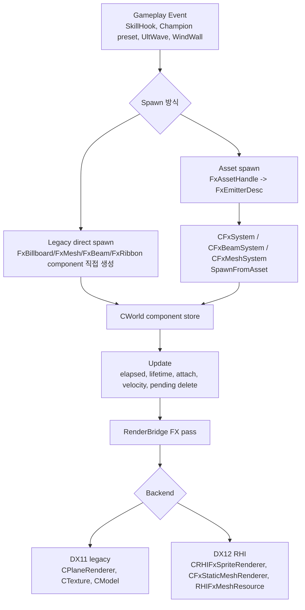
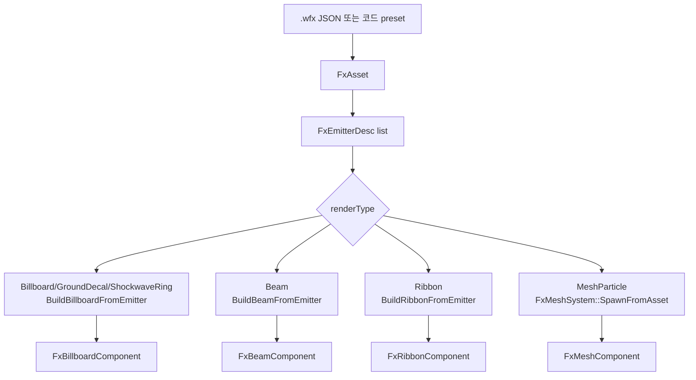
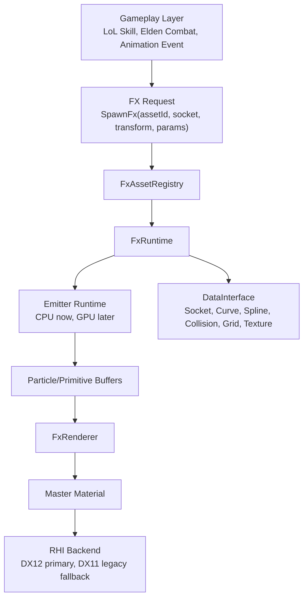
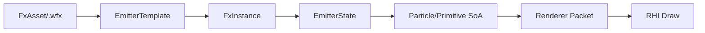

# FX Flow, LoL Goal, Elden Extension Master Plan

작성일: 2026-05-08

## 0. 목표 재정의

Winters FX의 1차 목표는 리그오브레전드 느낌의 스킬 FX를 실제 게임 씬에서 안정적으로 재생하는 것이다.

DX12 마이그레이션은 이 목표를 위한 수단이다.
최종적으로는 같은 FX 시스템이 WintersLOL과 WintersElden을 모두 감당해야 한다.

```txt
LoL:
  선명한 실루엣
  높은 채도
  HDR emission
  grayscale mask + stylized shader
  빠른 스킬 피드백
  명확한 피아 구분

Elden:
  무기 궤적
  먼지, 재, 안개, 피격 파편
  보스 장판과 telegraph
  어둡고 무거운 색감
  simple lit / 6-way smoke / volumetric 계열
  충돌, 지형, socket, animation event와 강하게 결합
```

따라서 FX 시스템은 "LoL 전용 이펙트 모음"이 아니라,
게임별 look만 다른 공용 runtime + material + renderer + authoring 체계가 되어야 한다.

## 1. 현재 코드베이스 FX 흐름

현재 FX는 네 가지 렌더 타입으로 나뉜다.

```txt
Billboard     -> FxBillboardComponent -> CFxSystem
Beam          -> FxBeamComponent      -> CFxBeamSystem
Ribbon        -> FxRibbonComponent    -> CFxBeamSystem
Static Mesh   -> FxMeshComponent      -> CFxMeshSystem + CFxStaticMeshRenderer
```

현재 핵심 파일:

```txt
Engine/Public/FX/FxAsset.h
Engine/Private/FX/FxAsset.cpp

Client/Public/GameObject/FX/FxBillboardComponent.h
Client/Public/GameObject/FX/FxBeamComponent.h
Client/Public/GameObject/FX/FxRibbonComponent.h
Client/Public/GameObject/FX/FxMeshComponent.h

Client/Public/GameObject/FX/FxSystem.h
Client/Private/GameObject/FX/FxSystem.cpp
Client/Public/GameObject/FX/FxBeamSystem.h
Client/Private/GameObject/FX/FxBeamSystem.cpp
Client/Public/GameObject/FX/FxMeshSystem.h
Client/Private/GameObject/FX/FxMeshSystem.cpp

Client/Public/GameObject/FX/LegacyFxAdapter.h
Client/Private/GameObject/FX/LegacyFxAdapter.cpp
Client/Public/GameObject/FX/FxLegacyAssetDumper.h
Client/Private/GameObject/FX/FxLegacyAssetDumper.cpp

Engine/Public/Renderer/RHIFxSpriteRenderer.h
Engine/Private/Renderer/RHIFxSpriteRenderer.cpp
Engine/Public/Renderer/FxStaticMeshRenderer.h
Engine/Private/Renderer/FxStaticMeshRenderer.cpp
Engine/Public/Renderer/RHIFxMeshResource.h
Engine/Private/Renderer/RHIFxMeshResource.cpp
```

### 1-1. 현재 실행 흐름



### 1-2. 현재 asset 흐름



`LegacyFxAdapter`는 현재 가장 중요한 과도기 장치다.
기존 챔피언 preset 코드를 바로 삭제하지 않고, 같은 데이터를 `FxAsset`으로 왕복시킬 수 있게 해준다.

```txt
legacy component -> FxAsset
FxAsset          -> legacy component
FxAsset          -> .wfx dump
```

이 구조는 앞으로 `.wfx`와 `.wmi`가 정식 asset이 될 때까지 유지한다.

## 2. 현재 강점과 부채

### 강점

- ECS component 기반이라 spawn/update/render 분리가 이미 되어 있다.
- `FxAsset`과 `CFxAssetRegistry`가 이미 존재한다.
- direct spawn과 asset spawn을 병행할 수 있다.
- billboard, beam, ribbon, mesh 네 타입이 이미 분리되어 있다.
- DX12에서 sprite/beam/ribbon/static mesh FX가 RHI 경로를 타기 시작했다.
- `strErodeTexturePath`가 추가되어 mask/erode 계열 shader로 갈 수 있다.
- mesh cache key가 FBX + diffuse + erode 조합이 되어 material variant 충돌을 피할 수 있다.

### 부채

- `FxEmitterDesc`, `FxMeshComponent`, `FxMeshDrawParams`에 material parameter가 흩어져 있다.
- billboard/beam/ribbon은 mesh보다 LoL-style material parameter가 덜 연결되어 있다.
- shader가 아직 "master material" 체계가 아니라 renderer 안 embedded shader 또는 legacy HLSL에 가깝다.
- depth mode가 `bDepthWrite` 수준이라 FX 의도를 표현하기 부족하다.
- `.wfx`와 `.wmi` 분리가 아직 정식 workflow가 아니다.
- runtime SoA particle system, graph node, data interface는 계획 단계다.
- Elden에 필요한 6-way smoke, volumetric, decals, collision query, socket/animation event 연동은 아직 본격 구현 전이다.

## 3. 문서 체계

앞으로 FX 문서는 세 층으로 본다.

### 개념 문서

```txt
.md/TODO/05-07/FX개념!/AAA_VFX_GRAYSCALE_AND_SHADER.md
```

역할:
- "텍스처는 색이 아니라 데이터"라는 원칙.
- grayscale/mask/flowmap/material parameter 기반 VFX 개념.
- LoL과 Elden 같은 서로 다른 look이 같은 구조를 공유하는 이유.

### 목표 재설정 문서

```txt
.md/TODO/05-07/FX개념!/LOL_STYLE_FX_DX12_MIGRATION_PLAN_2026_05_08.md
```

역할:
- DX12 마이그의 목적을 LoL-style FX 구현으로 고정.
- 전체 엔진 DX12 parity보다 FX 재생 루프를 우선.

### 실행 설계 문서

```txt
.md/TODO/05-07/FX개념!/FX_FLOW_LOL_ELDEN_MASTER_PLAN_2026_05_08.md
```

역할:
- 현재 코드 흐름 정리.
- LoL에서 Elden까지 이어지는 FX pipeline 설계.
- 어떤 순서로 legacy preset을 asset/runtime/editor/GPU로 승격할지 결정.

참조 계획:

```txt
.md/TODO/05-07/EffectTool/02_EFX0_LEGACY_BRIDGE_AND_ASSETIZATION.md
.md/TODO/05-07/EffectTool/03_EFX1_WFX_WMI_SCHEMA_AND_ROUNDTRIP.md
.md/TODO/05-07/EffectTool/04_EFX2_RUNTIME_SOA_AND_ECS_SYSTEMS.md
.md/TODO/05-07/EffectTool/05_EFX3_DX12_MASTER_MATERIAL_RENDERER.md
.md/TODO/05-07/EffectTool/06_EFX4_EDITOR_PREVIEW_AND_HOT_RELOAD.md
.md/TODO/05-07/EffectTool/07_EFX5_GPU_COMPUTE_DATA_INTERFACE_AND_ELDEN_PATH.md
.md/TODO/05-07/RHI/DX12_REMAINING_PLAN_AND_PROGRESS_2026_05_07.md
```

## 4. 목표 아키텍처

최종 구조는 아래처럼 간다.



핵심 분리:

```txt
FxAsset:
  어떤 emitter들이 있고 언제 어떤 render type을 쓸지 정의.

FxMaterialInstance:
  master shader에 넣을 parameter와 texture binding.

FxRuntime:
  lifetime, spawn, random, attach, simulation 담당.

FxRenderer:
  billboard, trail, beam, mesh, decal, volumetric을 draw call로 변환.

DataInterface:
  socket, animation event, collision, nav grid, curve, spline, texture sample 같은 외부 데이터 접근.
```

## 5. 공용 asset 모델

### 5-1. `.wfx`

FX 전체 graph/emitters/simulation/render type을 담는다.

예시:

```json
{
  "version": 1,
  "name": "LoL/Irelia/E_StunBeam",
  "emitters": [
    {
      "name": "BeamCore",
      "render_type": "Beam",
      "material_instance": "Client/Bin/Resource/FX/LoL/Irelia/MI_Irelia_E_Beam.wmi",
      "lifetime": 0.45,
      "width": 0.35,
      "blend_mode": "Additive"
    }
  ]
}
```

### 5-2. `.wmi`

Material instance다.
LoL과 Elden의 look 차이는 대부분 여기서 난다.

```json
{
  "version": 1,
  "master": "M_VFX_Trail",
  "textures": {
    "main": "Client/Bin/Resource/Texture/FX/Common/magic_brush_01.png",
    "erode": "Client/Bin/Resource/Texture/FX/Common/magic_erode_01.png",
    "noise": "Client/Bin/Resource/Texture/FX/Common/magic_noise_01.png"
  },
  "vectors": {
    "base_color": [0.05, 0.12, 0.35, 1.0],
    "emission_color": [0.4, 1.4, 5.0, 1.0],
    "edge_color": [2.5, 4.0, 6.0, 1.0],
    "rim_color": [0.8, 1.8, 3.0, 1.0]
  },
  "scalars": {
    "emission_intensity": 6.0,
    "contrast": 2.5,
    "edge_width": 0.05,
    "distort_strength": 0.02
  }
}
```

## 6. Material 계층

처음부터 node graph editor를 만들 필요는 없다.
master material 4개로 시작한다.

```txt
M_VFX_Particle_Generic:
  billboard, ground decal, shockwave, small sprite particle.

M_VFX_Trail:
  beam, ribbon, slash trail, sword arc, projectile trail.

M_VFX_Mesh_Stylized:
  static mesh FX, curved mesh, projectile mesh, magic blade, boss sign mesh.

M_VFX_Volumetric_Simple:
  Elden smoke, fog column, ash, dark aura. 1차는 fake volumetric mesh 또는 raymarch-lite.
```

LoL 우선 parameter:

```txt
BaseColor
EmissionColor
EdgeColor
RimColor
EmissionIntensity
Contrast
EdgeWidth
ErodeThreshold
ScrollSpeedA/B
DistortStrength
FresnelPower
MaterialRandom
```

Elden 추가 parameter:

```txt
AmbientColor
SunColor
LightDir
SmokeDensity
Absorption
SixWayLightingTexture
DepthFadeDistance
GroundContactFade
ImpactDebrisAmount
```

## 7. Runtime 흐름 v2

현재는 component가 곧 runtime data다.
v2에서는 asset/runtime/render data를 나눈다.



1차는 기존 component를 유지한다.
대신 `FxMaterialDesc`와 `FxDepthMode`부터 공통화한다.

2차에서 아래로 승격한다.

```txt
FxBillboardComponent -> FxSpriteEmitterRuntime
FxBeamComponent      -> FxTrailEmitterRuntime
FxRibbonComponent    -> FxTrailEmitterRuntime
FxMeshComponent      -> FxMeshEmitterRuntime
```

이 전환이 끝나면 Client champion code는 renderer 타입을 몰라도 된다.

```cpp
SpawnFx("LoL/Irelia/E_StunBeam", context);
SpawnFx("Elden/Boss/Telegraph_Ring", context);
```

## 8. LoL 적용 계획

LoL은 명확성, 반응성, 컬러 아이덴티티가 우선이다.

### LoL Stage 1. 대표 스킬 2개 고정

대상:

```txt
Irelia E Stun Beam
Ezreal Q Projectile
```

목표:
- 동일한 gameplay event에서 DX11 legacy와 DX12 RHI가 모두 스폰.
- DX12에서는 grayscale + erode + material parameter shader 사용.
- asset path 기반으로 조절 가능.

완료 기준:
- Debug-DX12에서 8초 smoke 유지.
- 대표 FX texture fallback 없음.
- material parameter 변경으로 색감 변화 확인.

### LoL Stage 2. Irelia FX 전체 승격

대상:

```txt
Q mark pulse
W hold aura
E sword1/sword2/beam
R ult wave
R end fan
```

작업:
- 기존 코드 preset을 `.wfx/.wmi`로 dump.
- asset spawn과 direct spawn을 병행 비교.
- 최종적으로 SkillHook은 asset id만 참조하게 이동.

### LoL Stage 3. 공용 champion FX library

공용 library:

```txt
FX/LoL/Common/Projectile_Arcane
FX/LoL/Common/Ground_Ring
FX/LoL/Common/Slash_Trail
FX/LoL/Common/Hit_Spark
FX/LoL/Common/Buff_Aura
```

챔피언별 차이는 `.wmi`로 낸다.

```txt
Irelia = blue/white blade magic
Ezreal = gold/arcane
Yasuo = wind/cyan
Annie = fire/orange
Zed = shadow/purple
```

## 9. Elden 적용 계획

Elden은 LoL보다 무겁고 물리적인 FX가 필요하다.
하지만 runtime은 공유한다.

### Elden Stage 1. 무기 궤적과 피격 FX

대상:

```txt
SwordArc_Light
SwordArc_Heavy
WeaponTrail_Bleed
Impact_Spark_Stone
Impact_Dust_Ground
```

필요 기능:
- socket 기반 trail 시작/끝점.
- animation event로 spawn/kill.
- ribbon point history.
- hit surface type에 따른 material instance 선택.

DataInterface:

```txt
FxDISocket
FxDIAnimationEvent
FxDICollisionQuery
FxDISurfaceType
```

### Elden Stage 2. 보스 telegraph와 장판

대상:

```txt
BossTelegraph_Ring
BossTelegraph_Cone
BossTelegraph_Line
BossAOE_DarkFlame
```

필요 기능:
- ground decal.
- depth read/no-write.
- grow duration.
- erode threshold over life.
- gameplay hitbox와 visual lifetime sync.

### Elden Stage 3. 연기, 재, 안개

대상:

```txt
SixWay_SmokeColumn
Ash_Fall
DarkMist_Aura
FireSmoke_Impact
```

필요 기능:
- simple lit smoke.
- 6-way lighting texture.
- soft particle.
- depth fade.
- GPU particle로 확장.

### Elden Stage 4. GPU compute

진입 조건:

```txt
LoL 대표 FX 안정화
Elden sword trail/telegraph 안정화
RHI Dispatch, UAV, indirect draw 준비
```

목표:

```txt
8192 particles
64 emitters
GPU update 1.5ms 이하
CPU fallback 동일 asset 가능
```

## 10. 구현 단계

### FX-A. 현재 흐름 문서화 완료

완료 기준:
- 이 문서 존재.
- 현재 code flow와 v2 목표 flow가 분리되어 설명됨.

### FX-B. 공통 material ABI

추가 후보:

```txt
Engine/Public/FX/FxMaterialDesc.h
Engine/Public/FX/FxDepthMode.h
Engine/Public/FX/FxTextureSlots.h
```

목표:
- billboard/beam/ribbon/mesh가 같은 material 구조를 사용.
- `FxEmitterDesc`는 material 값을 직접 무한히 늘리지 않고 `FxMaterialDesc`를 가진다.

### FX-C. `.wfx/.wmi` roundtrip

목표:
- `FxLegacyAssetDumper`가 `.wfx`와 `.wmi`를 분리 저장.
- `CFxAssetRegistry`가 `.wfx`를 로드하고 material instance path를 따라간다.
- 기존 champion preset은 `LegacyAndAssetParallel` 상태로 비교.

### FX-D. Master shader 분리

추가 후보:

```txt
Shaders/FX/Master/MasterCommon.hlsli
Shaders/FX/Master/M_VFX_Particle_Generic.hlsl
Shaders/FX/Master/M_VFX_Trail.hlsl
Shaders/FX/Master/M_VFX_Mesh_Stylized.hlsl
Shaders/FX/Master/M_VFX_Volumetric_Simple.hlsl
```

목표:
- renderer cpp embedded shader를 장기적으로 shader file로 이동.
- DX12 shader compile path에서 hot reload로 갈 수 있게 준비.

### FX-E. Renderer packet 통합

추가 후보:

```txt
Engine/Public/FX/FxRenderPacket.h
Engine/Public/FX/FxRenderQueue.h
Engine/Private/FX/FxRenderQueue.cpp
```

목표:
- 시스템이 직접 renderer를 호출하지 않고 render packet을 쌓는다.
- backend renderer는 packet을 받아 draw.
- RenderGraph 진입 준비.

### FX-F. Editor/Tuner

목표:
- ImGui에서 active FX material parameter 조절.
- `.wmi` 저장.
- shader/texture reload.
- LoL/Elden preset 비교.

### FX-G. DataInterface

목표:
- Elden을 위해 socket, curve, spline, collision, surface type을 FX graph에서 읽는다.
- LoL도 skill range, team color, target position에 활용 가능.

### FX-H. GPU path

목표:
- CPU runtime과 같은 asset을 GPU compute로 실행.
- GPU particle은 기능 추가이지 새 시스템이 아니다.

## 11. 완료 기준

### LoL FX 1차 완료

```txt
[ ] Irelia E beam DX12 표시
[ ] Ezreal Q projectile DX12 표시
[ ] grayscale + erode + material parameter shader 사용
[ ] asset spawn path 사용
[ ] DX11 legacy fallback 유지
[ ] Debug-DX12 Client smoke 8초 유지
```

### LoL FX 시스템 완료

```txt
[ ] Irelia 주요 스킬 asset화
[ ] Ezreal 주요 스킬 asset화
[ ] beam/ribbon/mesh/billboard material parameter 통합
[ ] ImGui material tuner
[ ] .wfx/.wmi roundtrip
```

### Elden FX 1차 완료

```txt
[ ] weapon trail socket 연동
[ ] hit impact surface type 분기
[ ] boss telegraph ground decal
[ ] simple smoke/ash particle
[ ] animation event spawn/kill
```

### 장기 완료

```txt
[ ] GPU compute particle
[ ] indirect draw
[ ] 6-way smoke
[ ] volumetric simple renderer
[ ] data interface runtime
[ ] editor preview/hot reload
```

## 12. 다음 액션

바로 다음 작업은 코드 기준으로 작게 끊는다.

1. `FxMaterialDesc.h` 추가.
2. `FxDepthMode.h` 추가.
3. `FxEmitterDesc`에 공통 material/depth 구조 연결.
4. `FxBillboardComponent`, `FxBeamComponent`, `FxRibbonComponent`, `FxMeshComponent`에 같은 material desc 적용.
5. `CFxSystem`, `CFxBeamSystem`, `CFxMeshSystem`의 draw param 채우기 통일.
6. `CRHIFxSpriteRenderer`, `CFxStaticMeshRenderer`가 같은 `CBFxParams` 변환 helper를 사용.
7. Irelia E 또는 Ezreal Q 하나를 `.wfx/.wmi` 대표 샘플로 고정.
8. Debug-DX12 Client smoke로 확인.

## 13. 결론

현재 FX 코드는 아직 완성형은 아니지만, 좋은 과도기 구조를 가지고 있다.

가장 중요한 방향은 다음이다.

```txt
Legacy preset을 보존한다.
Asset spawn을 병행한다.
Material parameter를 공통화한다.
Renderer를 RHI packet 기반으로 통합한다.
LoL에서 stylized grayscale FX를 먼저 완성한다.
Elden에서 socket, collision, smoke, telegraph, GPU particle로 확장한다.
```

이 순서면 LoL FX를 만들기 위해 진행한 DX12 마이그레이션이 Elden FX 기반까지 자연스럽게 이어진다.
