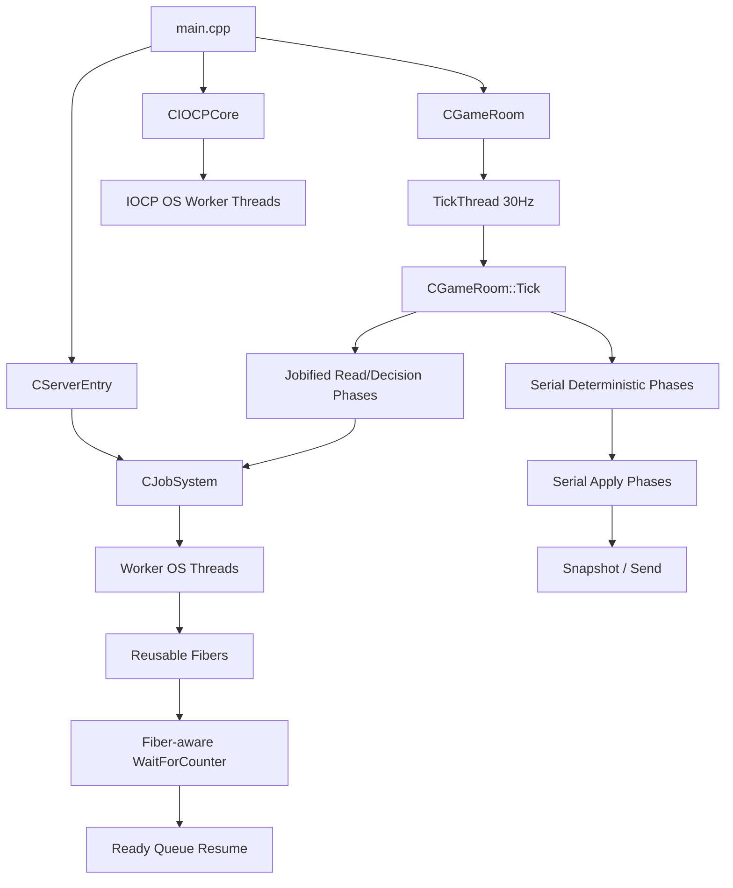

# Perfect Fiber Server Refactor Master

작성일: 2026-05-07  
목표: Server Fiber 적용을 "패치 따라치기"가 아니라, 직접 이해하고 단계별로 리팩터링할 수 있는 트랙으로 만든다.

---

## 0. 한 줄 결론

Server Fiber 적용의 핵심은 `GameRoom` tick을 무작정 병렬화하는 것이 아니다.

정답은 다음 순서다.

```text
1. Fiber 개념 이해
2. Engine CJobSystem 의 현재 위험 지점 보정
3. Server thread/lifetime 구조를 Fiber-safe 하게 정리
4. read-only 작업부터 jobify
5. write-heavy phase 는 Decision / Apply 로 쪼개기
6. WaitForCounter 가 Fiber yield 로 동작하는지 stress 로 검증
7. deterministic byte-identical gate 를 통과한 phase 만 병렬화
```

Fiber는 성능 기능이기 전에 **스케줄링 모델**이다.  
서버에서는 특히 결정성, 락 수명, IOCP thread 경계, ECS write 순서가 깨지면 성능보다 먼저 게임 상태가 망가진다.

---

## 1. 이 문서 묶음

| 문서 | 역할 |
|---|---|
| [10_PERFECT_FIBER_SERVER_MASTER.md](10_PERFECT_FIBER_SERVER_MASTER.md) | 전체 인덱스와 진행 원칙 |
| [11_FIBER_CONCEPTS_SERVER_DEEP_DIVE.md](11_FIBER_CONCEPTS_SERVER_DEEP_DIVE.md) | Fiber 개념, Win32 API, thread/fiber/job 관계 |
| [12_CURRENT_SERVER_CONCURRENCY_AUDIT.md](12_CURRENT_SERVER_CONCURRENCY_AUDIT.md) | 현재 Server 코드의 thread, lock, phase, IOCP 구조 감사 |
| [13_ENGINE_FIBER_PREREQUISITES_AND_FIXES.md](13_ENGINE_FIBER_PREREQUISITES_AND_FIXES.md) | Server 적용 전 Engine JobSystem 선결 수정 |
| [14_SERVER_FIBER_REFACTOR_STEPS.md](14_SERVER_FIBER_REFACTOR_STEPS.md) | 직접 적용 순서. Stage 0~8 |
| [15_SERVER_PHASE_JOBIFICATION_PLAYBOOK.md](15_SERVER_PHASE_JOBIFICATION_PLAYBOOK.md) | 각 GameRoom phase 를 어떻게 병렬화할지 판단하는 플레이북 |
| [16_VERIFICATION_STRESS_DEBUGGING.md](16_VERIFICATION_STRESS_DEBUGGING.md) | stress, smoke, byte-identical, deadlock 디버깅 |
| [17_PERSONAL_STUDY_CHECKPOINTS.md](17_PERSONAL_STUDY_CHECKPOINTS.md) | 직접 이해했는지 확인하는 학습 체크포인트 |

기존 `00~04_SERVER_*` 문서는 conservative server integration 계획이다. 이 새 묶음은 그 위에 올라가는 **완전 이해 + 직접 리팩터링용 마스터 트랙**이다.

---

## 2. 이번 트랙의 핵심 원칙

### 원칙 A. IOCP worker 는 Fiber 로 바꾸지 않는다

`CIOCPCore::WorkerLoop` 는 `GetQueuedCompletionStatus` 를 기다리는 OS thread 영역이다.  
여기에 Fiber yield 를 섞으면 IOCP completion entry 소비 모델이 꼬일 수 있다.

결정:

```text
IOCP worker thread = OS blocking thread 유지
GameRoom tick / simulation job = Fiber JobSystem 대상
```

### 원칙 B. Server tick thread 는 "submitter" 이고, worker thread 는 "executor" 다

`CGameRoom::TickThread()` 는 30Hz tick loop를 유지한다.  
이 thread 자체를 Fiber로 바꾸는 것은 학습용 shell로 가능하지만, 진짜 효과는 worker fiber가 `WaitForCounter`에서 yield할 때 나온다.

중요:

```text
Tick thread ConvertThreadToFiber = stage marker
Worker fiber yield WaitForCounter = 실제 Fiber JobSystem 가치
```

### 원칙 C. write-heavy phase 는 바로 병렬화하지 않는다

다음은 바로 병렬화 금지다.

```text
Phase_DrainCommands
Phase_ExecuteCommands
Phase_ServerMinionAI
Phase_ServerProjectiles
Phase_BroadcastEvents
```

이들은 `m_world`, `m_entityMap`, event queue, damage queue, component state 를 쓴다.  
먼저 `Decision`과 `Apply`를 분리해야 한다.

### 원칙 D. read-only 부터 시작한다

첫 병렬화 후보는 `Phase_BroadcastSnapshot` 이다.  
단, `CWorld`의 read-only 동시 접근이 확정되기 전에는 아래처럼 보수적으로 나눈다.

```text
직렬: entity snapshot DTO 수집
병렬: DTO -> FlatBuffer encode
직렬: Session Send
```

### 원칙 E. Counter 사용 규약을 절대 헷갈리지 않는다

현재 `CJobSystem::Submit(job, &counter)` 는 내부에서 counter를 `Increment()` 한다.

따라서 Server 코드는 이렇게 쓰면 안 된다.

```cpp
CJobCounter counter;
counter.Increment(inputs.size()); // 금지: Submit 이 또 Increment 한다.
for (...)
    pJob->Submit(job, &counter);
pJob->WaitForCounter(&counter);
```

정답:

```cpp
CJobCounter counter;
for (...)
    pJob->Submit(job, &counter);
pJob->WaitForCounter(&counter);
```

또는 엔진 API를 바꿀 경우에는 `SubmitAlreadyCounted` 같은 별도 이름으로 분리한다.

---

## 3. 최종 목표 구조



---

## 4. Stage Roadmap

| Stage | 목표 | 코드 위험도 | 학습 포인트 |
|---|---|---:|---|
| 0 | 현재 Server thread/lock 지도 확정 | 낮음 | IOCP와 GameRoom 경계 |
| 1 | Engine JobSystem export/counter/race 선결 수정 | 중간 | DLL 경계, Submit ownership |
| 2 | ServerEntry로 JobSystem lifetime 도입 | 낮음 | process singleton owner |
| 3 | TickThread Fiber shell | 낮음 | ConvertThreadToFiber lifecycle |
| 4 | Snapshot helper 분리 | 낮음 | 행동 보존 리팩터링 |
| 5 | Snapshot read DTO + encode 병렬화 | 중간 | read-only/encode split |
| 6 | Server phase classification | 낮음 | 어떤 작업이 병렬 가능한지 판단 |
| 7 | MinionAI Decision/Apply 2-pass | 높음 | deterministic parallel simulation |
| 8 | Fiber-yield WaitForCounter stress 통과 | 높음 | Fiber의 진짜 목적 |

---

## 5. 절대 금지

```text
금지 1. IOCP WorkerLoop 안에서 Fiber yield
금지 2. m_stateMutex 를 잡은 job 람다 submit 후, job 안에서 같은 mutex 재진입
금지 3. CWorld write 를 N job 에서 직접 수행
금지 4. counter 를 수동 Increment 한 뒤 Submit(job, &counter)
금지 5. Get_WorkerSlot 값을 yield 전후에 캐시해서 재사용
금지 6. pSession->Send 를 병렬화 안전하다고 가정
금지 7. "결과가 눈으로 비슷함"을 deterministic 검증으로 대체
```

---

## 6. Done Definition

완료는 "빌드됨"이 아니다. 다음을 모두 통과해야 한다.

```text
[ ] Engine Debug/Release build 통과
[ ] Server Debug/Release build 통과
[ ] 30s smoke 통과
[ ] 1 client snapshot byte-identical 통과
[ ] 8 session mock snapshot byte-identical 통과
[ ] 1만 fan-out job stress 통과
[ ] nested wait stress 통과
[ ] counter leak 0
[ ] fiber handle leak 0
[ ] IOCP code diff 0
[ ] write-heavy phase 병렬화 0 또는 Decision/Apply 증명 완료
```

---

## 7. 지금 바로 볼 문서 순서

1. [11_FIBER_CONCEPTS_SERVER_DEEP_DIVE.md](11_FIBER_CONCEPTS_SERVER_DEEP_DIVE.md)
2. [12_CURRENT_SERVER_CONCURRENCY_AUDIT.md](12_CURRENT_SERVER_CONCURRENCY_AUDIT.md)
3. [13_ENGINE_FIBER_PREREQUISITES_AND_FIXES.md](13_ENGINE_FIBER_PREREQUISITES_AND_FIXES.md)
4. [14_SERVER_FIBER_REFACTOR_STEPS.md](14_SERVER_FIBER_REFACTOR_STEPS.md)
5. [16_VERIFICATION_STRESS_DEBUGGING.md](16_VERIFICATION_STRESS_DEBUGGING.md)

---

## 8. 이 트랙의 태도

이번 작업은 "Fiber를 서버에 붙였다"가 아니라:

```text
내가 직접 thread, fiber, job, counter, wait, deterministic simulation 의 관계를 설명할 수 있다.
내가 직접 어떤 Server phase 가 병렬화 가능한지 판단할 수 있다.
내가 직접 deadlock / race / byte drift 를 재현하고 잡을 수 있다.
```

여기까지가 목표다.

