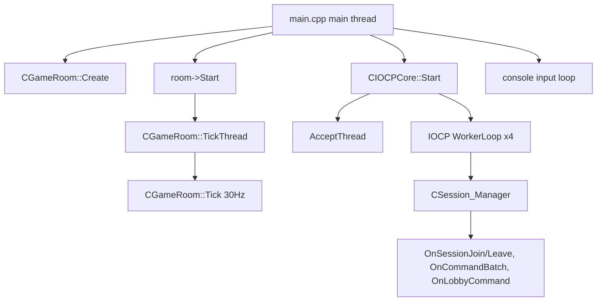
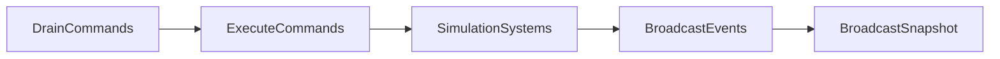

# Current Server Concurrency Audit

작성일: 2026-05-07  
목표: Server Fiber refactor 전에 현재 thread, lock, phase, shared state 구조를 확정한다.

---

## 1. Server thread 지도

현재 Server 주요 thread는 다음과 같다.



### main thread

파일: [Server/Private/main.cpp](../../../Server/Private/main.cpp)

역할:

```text
WSAStartup
GameRoom create/start
IOCP create/start
smoke sleep or console input
shutdown
```

Fiber 대상 아님.

### GameRoom tick thread

파일: [Server/Private/Game/GameRoom.cpp](../../../Server/Private/Game/GameRoom.cpp)

`CGameRoom::Start()`가 `std::thread(&CGameRoom::TickThread, this)`를 만든다.

역할:

```text
30Hz loop
Tick()
sleep_until(next)
jitter logging
```

Fiber shell 적용 후보.  
하지만 진짜 FiberFull 가치는 CJobSystem worker thread에서 나온다.

### IOCP accept / worker threads

파일: [Server/Private/Network/IOCPCore.cpp](../../../Server/Private/Network/IOCPCore.cpp)

역할:

```text
AcceptThread: accept
WorkerLoop: GetQueuedCompletionStatus
```

Fiber 대상 아님.  
IOCP는 OS blocking wait와 completion queue가 본체다.

### CJobSystem worker threads

파일:

```text
Engine/Public/Core/JobSystem.h
Engine/Private/Core/JobSystem.cpp
```

역할:

```text
Submit 된 simulation / encode / decision job 실행
ThreadOnly 또는 FiberShell/FiberFull 모드 실행
```

완전 Fiber의 실제 대상.

---

## 2. GameRoom shared state 지도

파일: [Server/Public/Game/GameRoom.h](../../../Server/Public/Game/GameRoom.h)

중요 shared state:

```cpp
std::mutex m_stateMutex;
CWorld m_world;
EntityIdMap m_entityMap;
DeterministicRng m_rng;
u64_t m_tickIndex;
std::vector<u32_t> m_sessionIds;
std::unordered_map<u32_t, EntityID> m_sessionToEntity;
std::unordered_map<u32_t, u8_t> m_sessionToSlot;
std::unordered_map<EntityID, u32_t> m_lastBroadcastActionSeq;
```

Fiber refactor에서 이들의 access mode를 반드시 분류한다.

| 상태 | 읽기 | 쓰기 | 병렬화 기본 방침 |
|---|---|---|---|
| `m_world` | Snapshot, query | Simulation, spawn, damage, destroy | 검증 전 병렬 read도 보수적 접근 |
| `m_entityMap` | Snapshot, event serialize | IssueNew, Bind, Unbind | read-only 구간만 병렬 가능 |
| `m_rng` | Snapshot state | command/sim 가능 | tick 시점 값 cache |
| `m_sessionIds` | snapshot target collect | join/leave | lock 안에서 직렬 collect |
| `m_sessionToEntity` | snapshot target collect | join/leave/spawn | lock 안에서 직렬 collect |
| `m_lastBroadcastActionSeq` | event dedupe | BroadcastEvents | 병렬화 금지 |

---

## 3. m_stateMutex 사용 지점

현재 `m_stateMutex`는 Tick 외에도 여러 callback에서 잡는다.

```text
CGameRoom::Tick
CGameRoom::OnLobbyCommand
CGameRoom::OnSessionJoin
CGameRoom::OnSessionLeave
CGameRoom::DebugSetHealthByNetId
```

따라서 검증 문구는 이렇게 잡아야 한다.

틀림:

```text
m_stateMutex 는 Tick 에서만 잡힌다.
```

맞음:

```text
Tick 이 m_stateMutex 를 잡고 있는 동안 job 람다 내부에서 m_stateMutex 를 다시 잡는 경로가 없어야 한다.
Network worker callback 은 Tick 중 m_stateMutex 에서 block 될 수 있지만, Tick 이 기다리는 job 이 Network worker callback 을 필요로 하면 안 된다.
```

Fiber-safe 원칙:

```text
WaitForCounter 로 yield 가능한 구간에는 같은 mutex 재진입 의존성을 만들지 않는다.
```

---

## 4. Tick phase 구조

파일: [Server/Private/Game/GameRoom.cpp](../../../Server/Private/Game/GameRoom.cpp)

현재 `Tick()` 흐름:

```cpp
void CGameRoom::Tick()
{
    std::lock_guard stateLock(m_stateMutex);

    ++m_tickIndex;
    m_visibleTickIndex.store(m_tickIndex, std::memory_order_relaxed);

    TickContext tc{ ... };

    Phase_DrainCommands(tc);
    Phase_ExecuteCommands(tc);
    Phase_SimulationSystems(tc);
    Phase_BroadcastEvents(tc);
    Phase_BroadcastSnapshot(tc);
}
```

현재 phase는 완전 직렬이다.



---

## 5. Phase access classification

### Phase_DrainCommands

Access:

```text
m_pendingCommands lock/swap
stable_sort
m_sessionToEntity read
m_pendingExecCommands write
```

병렬화:

```text
금지. 순서 결정 phase.
```

### Phase_ExecuteCommands

Access:

```text
m_pExecutor->ExecuteCommand(m_world, tc, cmd)
m_world write 가능
```

병렬화:

```text
금지. command order = deterministic contract.
```

### Phase_SimulationSystems

Access:

```text
CStatSystem
CBuffSystem
CSkillCooldownSystem
CMoveSystem
MinionWave
MinionAI
TurretAI
Projectiles
DamageQueue
DeathSystem
```

병렬화:

```text
sub-phase 별로 따로 판단.
바로 N job 으로 쪼개지 않는다.
```

### Phase_ServerMinionAI

Access:

```text
MinionState write
MinionComponent write
Transform write
Health read/write sync
DamageRequest enqueue
NetAnimation add/write
```

병렬화:

```text
직접 병렬화 금지.
Decision / Apply 로 분리 후 Decision 만 병렬화.
```

### Phase_ServerProjectiles

Access:

```text
TurretProjectile write
Transform write
m_entityMap IssueNew/Unbind 가능
EnqueueReplicatedEvent
EnqueueDamageRequest
m_world DestroyEntity
```

병렬화:

```text
직접 병렬화 금지.
Query / Resolve / Apply 로 분리해야 함.
```

### Phase_BroadcastEvents

Access:

```text
m_lastBroadcastActionSeq write
BroadcastEventPayload
ReplicatedEventComponent read
m_world DestroyEntity
m_entityMap Unbind 가능
```

병렬화:

```text
직접 병렬화 금지.
event serialize 일부만 추후 병렬 후보.
```

### Phase_BroadcastSnapshot

Access:

```text
m_sessionIds read
CSession_Manager::Find
m_sessionToEntity read
m_pSnapBuilder->Build
WrapEnvelope
pSession->Send
```

병렬화:

```text
1차 후보.
단 Send 직렬 유지.
CWorld read 검증 전에는 DTO collect / encode split 권장.
```

---

## 6. Session send model

파일:

```text
Server/Public/Network/Session.h
Server/Private/Network/Session.cpp
```

`CSession::Send`는 `m_sendMutex`를 잡고 queue에 push한다.  
즉 동시 호출 자체는 어느 정도 보호되어 있다.

그래도 Stage 1에서는 병렬 Send를 하지 않는다.

이유:

```text
network side effect 순서 관찰 가능
debug 난이도 증가
IOCP completion 과 섞임
성능 이득보다 리스크 큼
```

결정:

```text
Build/encode 병렬
Send 직렬
```

---

## 7. EntityIdMap model

파일: [Shared/GameSim/EntityIdMap.h](../../../Shared/GameSim/EntityIdMap.h)

`EntityIdMap`은 `unordered_map` 2개로 구성된다.

```cpp
std::unordered_map<NetEntityId, EntityID> m_NetToLocal;
std::unordered_map<EntityID, NetEntityId> m_LocalToNet;
NetEntityId m_NextNetId = 1;
```

Read:

```text
FromNet
ToNet
```

Write:

```text
IssueNew
Bind
Unbind
```

병렬 규칙:

```text
동일 tick phase 안 write 0 이 증명된 구간에서만 read 병렬 가능.
IssueNew/Unbind 와 병렬 read 금지.
```

---

## 8. CWorld read model

파일:

```text
Engine/Public/ECS/World.h
Engine/Public/ECS/ComponentStore.h
```

현재 `CWorld::GetComponent<T>`는 non-const다.

```cpp
template<typename T> T& GetComponent(EntityID e)
{
    return GetOrCreateStore<T>().Get(e);
}
```

`ForEach<T>`도 non-const store 접근이다.

따라서 병렬 read를 바로 "확정 안전"으로 두면 안 된다.

서버 Fiber 트랙의 안전한 중간 설계:

```text
1. Tick thread 에서 직렬로 SnapshotReadDTO vector 생성
2. DTO vector 를 N job 으로 FlatBuffer encode
3. output packet 을 직렬 Send
```

추후 개선:

```text
CWorld const read API 추가
ComponentStore const iteration 추가
snapshot build 를 world read 병렬로 확장
```

---

## 9. Audit commands

```powershell
# Server 의 JobSystem 직접 호출 현황
rg -n "Submit\(|WaitForCounter\(|Get_WorkerSlot|Get_WorkerIdx" Server/Public Server/Private

# m_stateMutex 사용 현황
rg -n "m_stateMutex|std::lock_guard stateLock|unique_lock.*state" Server/Public Server/Private

# world write API snapshot 경로 확인
rg -n "AddComponent|RemoveComponent|DestroyEntity|CreateEntity|IssueNew|Bind\(|Unbind\(" Server/Private/Game

# IOCP 변경 여부
git diff -- Server/Private/Network/IOCPCore.cpp Server/Public/Network/IOCPCore.h
```

---

## 10. Audit conclusion

현재 Server는 Fiber 적용 전 구조로는 나쁘지 않다.

좋은 점:

```text
GameRoom tick 이 이미 단일 thread / fixed 30Hz
phase 순서가 명확함
IOCP 와 simulation 경계가 분리되어 있음
Snapshot build 라는 좋은 read-heavy 후보가 있음
```

주의점:

```text
m_stateMutex 는 Tick 외 callback에서도 사용
CWorld const read API 부족
EntityIdMap read/write phase 구분 필요
counter API 오해 시 deadlock
write-heavy phase 가 많아서 Decision/Apply 필수
```

