# Damage Font Dungeons Comparison Plan

작성일: 2026-05-12

목표: `SR_MinecraftDungeons`에서 사용한 `CFontMgr + CDamageMgr` 구조를 기준으로 Winters의 데미지 폰트 표시를 바로 붙인다. 1차 목표는 실제 피해 이벤트가 발생하면 타겟 월드 위치 위에 숫자가 떠오르고 서서히 사라지는 것. 2차 목표는 AGENTS.md의 Phase C-2 방향처럼 `CFont_Manager`, `CTextRenderer`, `CDamageFontRenderer`, `DamageFontComponent`로 분리한다.

## 1. Dungeons 쪽 실제 구조

### 1.1 Engine Font Manager

파일:

- `C:/Users/user/Desktop/SR_MinecraftDungeons/SR_Minecraft_Dungeons/Engine/Header/CFont.h`
- `C:/Users/user/Desktop/SR_MinecraftDungeons/SR_Minecraft_Dungeons/Engine/Code/CFont.cpp`
- `C:/Users/user/Desktop/SR_MinecraftDungeons/SR_Minecraft_Dungeons/Engine/Header/CFontMgr.h`
- `C:/Users/user/Desktop/SR_MinecraftDungeons/SR_Minecraft_Dungeons/Engine/Code/CFontMgr.cpp`

구조:

```cpp
class CFont : public CBase
{
    LPDIRECT3DDEVICE9 m_pGraphicDev;
    LPD3DXSPRITE      m_pSprite;
    LPD3DXFONT        m_pFont;

    HRESULT Ready_Font(const _tchar* pFontType, const _uint& iWidth,
        const _uint& iHeight, const _uint& iWeight);
    void Render_Font(const _tchar* pString, const _vec2* pPos, D3DXCOLOR Color);
};

class CFontMgr : public CBase
{
    map<const _tchar*, CFont*> m_mapFont;

    HRESULT Ready_Font(LPDIRECT3DDEVICE9 pGraphicDev, const _tchar* pFontTag,
        const _tchar* pFontType, const _uint& iWidth,
        const _uint& iHeight, const _uint& iWeight);
    void Render_Font(const _tchar* pFontTag, const _tchar* pString,
        const _vec2* pPos, D3DXCOLOR Color);
};
```

핵심:

- `CFont`는 DX9 `D3DXCreateFontIndirect`, `D3DXCreateSprite`, `DrawTextW` 래퍼다.
- `CFontMgr`는 tag 기반 registry다.
- 폰트는 데미지 전용이 아니라 HUD, 대화, 점수 UI에서도 공용으로 쓴다.
- `CMainApp::Ready_DefaultSetting`에서 `minecraft.ttf`를 `AddFontResourceEx`로 등록하고 `Font_Minecraft` 태그를 만든다.

### 1.2 Client Damage Manager

파일:

- `C:/Users/user/Desktop/SR_MinecraftDungeons/SR_Minecraft_Dungeons/Client/Header/CDamageMgr.h`
- `C:/Users/user/Desktop/SR_MinecraftDungeons/SR_Minecraft_Dungeons/Client/Code/CDamageMgr.cpp`

구조:

```cpp
struct DAMAGE_TEXT
{
    _vec3  vWorldPos;
    _int   iDamage;
    _float fLifeTime;
    _float fOffsetY;
};

class CDamageMgr : public CBase
{
    list<DAMAGE_TEXT> m_listDamage;
    static constexpr _float m_fLifeTime = 1.5f;
    static constexpr _float m_fRisingSpeed = 40.f;

    void AddDamage(_vec3 vWorldPos, _int iDamage);
    _int Update(const _float& fTimeDelta);
    void Render();
    _vec2 WorldToScreen(const _vec3& vWorldPos);
};
```

흐름:

```cpp
// 몬스터/보스가 피격될 때
CDamageMgr::GetInstance()->AddDamage(vPos, iDamage);

// 매 프레임
CDamageMgr::GetInstance()->Update(fTimeDelta);
CDamageMgr::GetInstance()->Render();
```

렌더 동작:

1. `AddDamage`가 월드 위치, 피해량, 수명, Y 오프셋을 저장한다.
2. `Update`가 수명을 줄이고 `fOffsetY += risingSpeed * dt`로 위로 올린다.
3. `Render`가 `WorldToScreen`으로 화면 좌표를 얻고, `CFontMgr::Render_Font(L"Font_Minecraft", ...)`를 호출한다.
4. 알파는 `fLifeTime / m_fLifeTime`로 페이드아웃한다.

## 2. Winters 쪽 현재 상태

### 2.1 Engine UI Overlay가 이미 있음

파일:

- `C:/Users/user/Desktop/Winters/Engine/Public/Manager/UI/UI_Manager.h`
- `C:/Users/user/Desktop/Winters/Engine/Private/Manager/UI/UI_Manager.cpp`
- `C:/Users/user/Desktop/Winters/Engine/Include/GameInstance.h`
- `C:/Users/user/Desktop/Winters/Engine/Private/GameInstance.cpp`

현재 구조:

- `CUI_Manager::Render_Overlay(const Mat4& matVP)`가 매 프레임 호출된다.
- `Draw_HealthBars`, `Draw_ChampionHUD`가 이미 여기 붙어 있다.
- `UI_WorldToScreen` 헬퍼가 이미 있다.
- 주석으로 `Draw_DamageFloaters` hook이 이미 남아 있다.
- Client는 `CGameInstance::UI_*` forwarding만 사용한다.

현재 anchor:

```cpp
// Engine/Private/Manager/UI/UI_Manager.cpp
void CUI_Manager::Render_Overlay(const Mat4& matVP)
{
    if (!m_pWorld) return;
    ImDrawList* pDraw = ImGui::GetBackgroundDrawList();
    const DirectX::XMMATRIX mVP = matVP.ToXMMATRIX();

    if (m_bShowHealthBars) Draw_HealthBars(pDraw, mVP);
    // Phase B+: Draw_DamageFloaters / Draw_PlayerHUD ...

    ImDrawList* pFG = ImGui::GetForegroundDrawList();
    if (m_bShowChampionHUD) Draw_ChampionHUD(pFG);
}
```

### 2.2 DamageEvent에 필요한 데이터가 이미 있음

파일:

- `C:/Users/user/Desktop/Winters/Shared/Schemas/Event.fbs`
- `C:/Users/user/Desktop/Winters/Shared/GameSim/Systems/DamageQueueSystem.cpp`
- `C:/Users/user/Desktop/Winters/Shared/GameSim/Systems/ReplicatedEventSerializer.cpp`
- `C:/Users/user/Desktop/Winters/Client/Private/Network/Client/EventApplier.cpp`

현재 `DamageEvent`:

```fbs
table DamageEvent {
    sourceNet:uint;
    targetNet:uint;
    amount:float;
    type:ubyte;
    bWasCrit:bool;
    bKilled:bool;
    skillId:ushort;
}
```

서버/Shared 흐름:

```cpp
const DamageResult result = ApplyDamageRequest(world, tc, request);
if (result.finalAmount > 0.f && request.target != NULL_ENTITY)
{
    ReplicatedEventComponent event{};
    event.kind = eReplicatedEventKind::Damage;
    event.sourceEntity = request.source;
    event.targetEntity = request.target;
    event.amount = result.finalAmount;
    event.damageType = request.type;
    event.bWasCrit = result.bWasCrit;
    event.bKilled = result.bKilled;
    event.skillId = request.skillId;
    EnqueueReplicatedEvent(world, event);
}
```

Client 수신 지점:

```cpp
void CEventApplier::ApplyDamage(CWorld& world, EntityIdMap& entityMap,
    const Shared::Schema::DamageEvent* ev)
{
    const EntityID target = entityMap.FromNet(ev->targetNet());
    Vec3 pos{};
    if (world.HasComponent<TransformComponent>(target))
        pos = world.GetComponent<TransformComponent>(target).GetPosition();
    SpawnBillboard(world, pos, Vec3{}, kDamageTexture, 1.0f, 1.0f, 0.25f, target);
}
```

즉, 지금도 피해 이벤트 수신 시 타겟 위치를 찾고 있다. 여기서 `ev->amount()`, `ev->type()`, `ev->bWasCrit()`, `ev->bKilled()`를 그대로 데미지 폰트에 넘기면 된다.

## 3. 결론: Winters 1차는 ImGui 데미지 플로터가 가장 빠르다

Dungeons의 `CFontMgr`는 DX9 `D3DXFONT` 기반이라 Winters DX11에 그대로 복사할 수 없다. Winters에는 이미 ImGui overlay가 있고, HP bar/HUD도 `ImDrawList`로 그리고 있으므로 1차 데미지 폰트는 `CUI_Manager` 내부에 붙이는 것이 좋다.

1차:

- Engine `CUI_Manager`에 `DamageFloater` 목록과 `Push_DamageNumber` API 추가.
- `Render_Overlay`에서 `Draw_DamageFloaters` 호출.
- Client `CEventApplier::ApplyDamage`에서 `CGameInstance::UI_Push_DamageNumber(...)` 호출.
- Legacy/offline `Client/Private/GamePlay/Systems/Damage.cpp`에도 같은 hook 추가.

2차:

- AGENTS.md Phase C-2 그대로 `CFont`, `CFont_Manager`, `CTextRenderer`, `CDamageFontRenderer`를 추가.
- DirectXTK `SpriteBatch` + `SpriteFont` 또는 BMFont/SDF atlas로 ImGui 의존을 제거.
- `DamageFontComponent` 엔티티화 후 `DamageFontSystem`으로 update/render 분리.

## 4. 1차 구현 상세 계획

### DMG-FONT-1. Engine UI API 추가

파일:

- `C:/Users/user/Desktop/Winters/Engine/Public/Manager/UI/UI_Manager.h`
- `C:/Users/user/Desktop/Winters/Engine/Private/Manager/UI/UI_Manager.cpp`

추가 public API:

```cpp
void Push_DamageNumber(
    const Vec3& worldPos,
    f32_t amount,
    u8_t damageType,
    bool_t bWasCrit,
    bool_t bKilled);
```

추가 private 구조체:

```cpp
struct DamageFloater
{
    Vec3 worldPos{};
    f32_t amount = 0.f;
    f32_t age = 0.f;
    f32_t lifetime = 1.15f;
    f32_t risePixels = 54.f;
    f32_t xJitter = 0.f;
    u8_t damageType = 0;
    bool_t bWasCrit = false;
    bool_t bKilled = false;
};
```

추가 멤버:

```cpp
vector<DamageFloater> m_DamageFloaters;
bool_t m_bShowDamageFloaters = true;
f32_t  m_fDamageFloaterLife = 1.15f;
f32_t  m_fDamageFloaterRise = 54.f;
```

추가 private 함수:

```cpp
void Draw_DamageFloaters(ImDrawList* pDraw, const DirectX::XMMATRIX& mVP, f32_t dt);
```

### DMG-FONT-2. Render_Overlay에 호출 추가

anchor:

```cpp
if (m_bShowHealthBars) Draw_HealthBars(pDraw, mVP);
// Phase B+: Draw_DamageFloaters / Draw_PlayerHUD ...
```

교체 방향:

```cpp
if (m_bShowHealthBars)
    Draw_HealthBars(pDraw, mVP);
if (m_bShowDamageFloaters)
    Draw_DamageFloaters(pDraw, mVP, ImGui::GetIO().DeltaTime);
```

렌더 위치는 HP bar 이후, HUD 이전이 좋다. 데미지 폰트는 월드 오버레이라 background draw list에 그리되, HUD는 foreground draw list에 남긴다.

### DMG-FONT-3. Draw_DamageFloaters 구현

핵심 로직:

```cpp
void CUI_Manager::Draw_DamageFloaters(ImDrawList* pDraw,
    const DirectX::XMMATRIX& mVP, f32_t dt)
{
    for (DamageFloater& f : m_DamageFloaters)
    {
        f.age += dt;
    }

    m_DamageFloaters.erase(
        remove_if(m_DamageFloaters.begin(), m_DamageFloaters.end(),
            [](const DamageFloater& f) { return f.age >= f.lifetime; }),
        m_DamageFloaters.end());

    for (const DamageFloater& f : m_DamageFloaters)
    {
        ImVec2 s{};
        if (!UI_WorldToScreen(mVP, f.worldPos, s, m_iWinSizeX, m_iWinSizeY))
            continue;

        const f32_t t = f.age / f.lifetime;
        const f32_t alpha = 1.f - t;
        s.x += f.xJitter;
        s.y -= f.risePixels * t;

        char text[32]{};
        snprintf(text, sizeof(text), "%.0f", f.amount);

        const f32_t fontSize = f.bWasCrit ? 26.f : 20.f;
        const ImU32 col = UI_DamageColor(f.damageType, f.bWasCrit, f.bKilled, alpha);
        const ImVec2 textSize = ImGui::CalcTextSize(text);
        const ImVec2 pos(s.x - textSize.x * 0.5f, s.y - textSize.y * 0.5f);

        UI_DrawOutlinedText(pDraw, ImGui::GetFont(), fontSize, pos, col, text);
    }
}
```

주의:

- `ImGui::CalcTextSize`는 현재 font size 기준이라 crit 크기까지 정확히 재려면 `ImGui::GetFont()->CalcTextSizeA(fontSize, FLT_MAX, 0.f, text)`가 더 좋다.
- outline은 `AddText`를 4방향 검정색으로 먼저 찍고 본문을 찍으면 된다.
- 너무 많은 숫자가 쌓이면 `m_DamageFloaters.size() > 128`일 때 앞쪽부터 제거한다.

### DMG-FONT-4. GameInstance forwarding 추가

파일:

- `C:/Users/user/Desktop/Winters/Engine/Include/GameInstance.h`
- `C:/Users/user/Desktop/Winters/Engine/Private/GameInstance.cpp`

추가:

```cpp
void UI_Push_DamageNumber(const Vec3& worldPos, f32_t amount,
    u8_t damageType, bool_t bWasCrit, bool_t bKilled);
```

구현:

```cpp
void CGameInstance::UI_Push_DamageNumber(const Vec3& worldPos, f32_t amount,
    u8_t damageType, bool_t bWasCrit, bool_t bKilled)
{
    if (m_pUI_Manager)
        m_pUI_Manager->Push_DamageNumber(worldPos, amount, damageType, bWasCrit, bKilled);
}
```

### DMG-FONT-5. Network DamageEvent 연결

파일:

- `C:/Users/user/Desktop/Winters/Client/Private/Network/Client/EventApplier.cpp`

include 추가:

```cpp
#include "GameInstance.h"
```

anchor:

```cpp
SpawnBillboard(world, pos, Vec3{}, kDamageTexture, 1.0f, 1.0f, 0.25f, target);
```

추가 방향:

```cpp
Vec3 damageTextPos = pos;
damageTextPos.y += 2.1f;

CGameInstance::Get()->UI_Push_DamageNumber(
    damageTextPos,
    ev->amount(),
    ev->type(),
    ev->bWasCrit(),
    ev->bKilled());
```

기존 `SpawnBillboard(...kDamageTexture...)`는 1차에서 같이 둬도 된다. 숫자가 정상 출력되면 나중에 이 히트 PNG billboard는 제거하거나 hit spark 전용으로만 남긴다.

### DMG-FONT-6. Legacy/offline Damage.cpp 연결

파일:

- `C:/Users/user/Desktop/Winters/Client/Private/GamePlay/Systems/Damage.cpp`

현재 local/offline `ApplyDamage`도 있으므로 네트워크 없이 테스트할 때 숫자가 뜨게 같은 API를 호출한다.

주의:

- 네트워크 모드에서 local prediction과 server event가 둘 다 숫자를 만들면 중복 출력된다.
- 1차 방침은 `EventApplier::ApplyDamage`를 권위 경로로 삼고, legacy `ApplyDamage` hook은 offline/min scene 검증용으로만 사용한다.
- 중복이 보이면 `GameContext`나 network connection 상태로 legacy hook을 막는다.

### DMG-FONT-7. ImGui Tuner 추가

파일:

- `C:/Users/user/Desktop/Winters/Engine/Private/Manager/UI/UI_Manager.cpp`

`OnImGui_Tuner`에 추가:

```cpp
ImGui::Checkbox("Show Damage Floaters", &m_bShowDamageFloaters);
ImGui::SliderFloat("Damage Life", &m_fDamageFloaterLife, 0.3f, 2.0f);
ImGui::SliderFloat("Damage Rise Pixels", &m_fDamageFloaterRise, 10.f, 120.f);
if (ImGui::Button("Test Damage 123"))
{
    // local champion position을 찾고 Push_DamageNumber(pos + Vec3{0, 2.1f, 0}, 123.f, ...).
}
```

튜너는 필수다. 데미지 폰트는 카메라 높이, 챔피언 스케일, HP bar 위치와 같이 보면서 바로 조정해야 한다.

## 5. 색상/표현 규칙

1차 색상:

```cpp
Physical:  IM_COL32(255, 226, 174, alpha)
Magic:     IM_COL32(135, 205, 255, alpha)
True:      IM_COL32(245, 245, 245, alpha)
Crit:      IM_COL32(255, 166, 64, alpha), fontSize + 6
Killed:    IM_COL32(255, 80, 72, alpha), 살짝 더 오래
```

LoL 느낌을 내려면:

- 일반 피해는 흰색/크림색 계열.
- 치명타는 더 크고 주황색.
- 마법 피해는 파랑/보라 계열.
- true damage는 거의 흰색.
- text shadow/outline은 검정 180~220 alpha.
- 숫자는 타겟 머리 위에서 50~70px 상승 후 fade.

## 6. 2차 Font Manager 정식화 계획

AGENTS.md Phase C-2 기준:

- `CFont`: atlas texture + glyph UV dictionary.
- `CFont_Manager`: tag 기반 폰트 등록/조회.
- `CTextRenderer`: 2D screen text.
- `CDamageFontRenderer`: 3D world billboard number.
- `DamageFontComponent`: `{ text, pos, velocity, lifetime, scale, color }`.
- `DamageFontSystem`: 위치 상승, alpha 감쇠, camera billboard.

Winters DX11 후보:

### 후보 A. DirectXTK SpriteFont/SpriteBatch

장점:

- 이미 `DirectXTK.lib`, `SpriteBatch.h`, `SpriteFont.h`가 프로젝트에 있다.
- DX11 2D text에 빠르게 붙일 수 있다.

주의:

- `.spritefont` 또는 MakeSpriteFont 산출물이 필요하다.
- ImGui보다 엔진 렌더 state 관리가 까다롭다.

### 후보 B. BMFont/SDF atlas

장점:

- AGENTS.md와 가장 일치한다.
- 숫자 데미지 폰트, 한글 HUD, 아이콘 폰트까지 확장 가능하다.
- shader에서 outline/glow를 만들 수 있다.

주의:

- `.fnt` 파서, glyph atlas, vertex buffer batcher가 필요하다.
- 1차 즉시 표시에는 과하다.

결론:

- 지금은 ImGui `AddText`로 즉시 표시.
- Font Manager 정식화는 데미지 숫자 튜닝이 끝난 뒤 BMFont/SDF로 가는 것이 좋다.

## 7. 최종 파이프라인

```mermaid
flowchart LR
    A["DamageRequestComponent"] --> B["DamagePipeline::ApplyDamageRequest"]
    B --> C["DamageQueueSystem"]
    C --> D["ReplicatedEventComponent Damage"]
    D --> E["FlatBuffers DamageEvent"]
    E --> F["Client EventApplier::ApplyDamage"]
    F --> G["CGameInstance::UI_Push_DamageNumber"]
    G --> H["CUI_Manager::m_DamageFloaters"]
    H --> I["Render_Overlay"]
    I --> J["UI_WorldToScreen"]
    J --> K["ImDrawList::AddText outlined number"]
```



## 8. 구현 순서

1. `CUI_Manager`에 `DamageFloater` 구조체, 목록, 튜닝 멤버 추가.
2. `Push_DamageNumber` 구현.
3. `Draw_DamageFloaters` 구현.
4. `Render_Overlay`에서 HP bar 이후 호출.
5. `CGameInstance::UI_Push_DamageNumber` forwarding 추가.
6. `CEventApplier::ApplyDamage`에서 DamageEvent amount/type/crit/killed를 넘긴다.
7. legacy/offline `Damage.cpp`에도 같은 hook을 붙인다.
8. ImGui tuner에 show/life/rise/test button 추가.
9. Engine/Client/Server Debug x64 빌드.
10. 런타임에서 평타, 스킬, 미니언 처치, 챔피언 처치 숫자 확인.

## 9. 검증 체크리스트

- 평타 한 번에 숫자 하나만 뜬다.
- 서버 replicated DamageEvent 기준으로 `ev->amount()`와 같은 숫자가 표시된다.
- 미니언/챔피언 머리 위에서 시작한다.
- HP bar와 겹치면 `worldPos.y += 2.1f` 또는 `risePixels`를 조정한다.
- 카메라 뒤에 있는 대상은 표시되지 않는다.
- 치명타/마법/true damage 색상이 구분된다.
- 100개 이상 숫자가 떠도 프레임이 흔들리지 않는다.
- 네트워크 모드에서 local/offline hook과 중복 표시되지 않는다.

## 10. 이번 작업에서 건드리지 않을 것

- FlatBuffers schema 변경은 필요 없다. DamageEvent에 amount/type/crit/killed가 이미 있다.
- 서버 DamagePipeline 계산식은 이번 범위가 아니다.
- 정식 BMFont/SDF Font Manager는 2차 작업으로 미룬다.
- Damage billboard PNG 제거는 숫자 표시 확인 후 결정한다.
