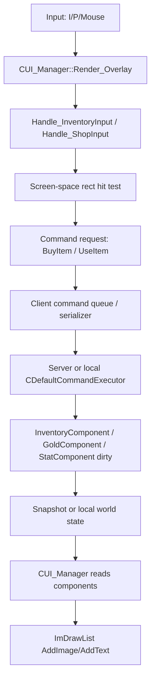

# Inventory UI Plan - Dungeons OOP to Winters ECS

Date: 2026-05-12

Goal: 던전스의 OOP UI/Inventory 구조를 Winters 방식으로 번역해서, 인게임 인벤토리 HUD와 상점 구매 흐름을 직접 구현할 수 있는 기준선을 잡는다.

## 0. 핵심 결론

던전스는 `CInventoryMgr`가 UI 객체들을 직접 소유하고, 각 UI 객체가 `CGameObject`를 상속해서 `Update/LateUpdate/Render`를 직접 수행한다.

Winters는 이 구조를 그대로 `CInventoryHUD : CUI` 식으로 복사하기보다 다음처럼 나누는 편이 맞다.

1. 실제 보유 아이템/골드/스탯 반영은 `Shared/GameSim`의 ECS component와 system이 책임진다.
2. 화면에 보이는 HUD/Inventory window/Shop window는 `Engine::CUI_Manager` 또는 그 아래의 얇은 panel helper가 그린다.
3. 클릭은 UI가 직접 상태를 바꾸지 않고 `GameCommand::BuyItem` / `UseItem` / `MoveItem` 같은 command로 연결한다.
4. UI는 command 결과로 바뀐 `InventoryComponent`, `GoldComponent`, `StatComponent`를 읽어서 다음 프레임에 다시 그린다.

즉, 던전스의 `CInventoryMgr` 하나가 하던 일을 Winters에서는 `Shared 데이터 + CommandExecutor + UI draw layer`로 쪼갠다.

## 1. 던전스 구조 요약

### 1.1 CUI

Reference:
- `C:\Users\user\Desktop\SR_MinecraftDungeons\SR_Minecraft_Dungeons\Client\Header\CUI.h`
- `C:\Users\user\Desktop\SR_MinecraftDungeons\SR_Minecraft_Dungeons\Client\Code\CUI.cpp`

Key anchors:
- `class CUI : public Engine::CGameObject`
- `CUI::Ready_GameObject` line 29
- `D3DXMatrixOrthoOffCenterLH` line 34, 101
- `CUI::Add_Child` line 39
- `CUI::Render_GameObject` line 89

역할:
- `CGameObject` 상속.
- `CRcTex`, `CTexture`, `CTransform` component를 들고 있음.
- 부모 UI의 위치/스케일을 자식 UI에 누적.
- 렌더 시 기존 view/proj를 백업하고 identity view + ortho projection으로 2D 이미지를 렌더.
- 자식 UI를 직접 `Render_GameObject()`로 호출.

던전스 감각으로 보면 `CUI`는 "2D 이미지 GameObject"다.

### 1.2 CUIInterface

Reference:
- `C:\Users\user\Desktop\SR_MinecraftDungeons\SR_Minecraft_Dungeons\Client\Header\CUIInterface.h`
- `C:\Users\user\Desktop\SR_MinecraftDungeons\SR_Minecraft_Dungeons\Client\Code\CUIInterface.cpp`

Key anchors:
- `class CUIInterface : public CGameObject`
- `GetAsyncKeyState(VK_LBUTTON)` line 25
- `IsMouseInRect` line 59
- `ScreenToClient` line 71
- `BeginUIRender` line 75
- `EndUIRender` line 103

역할:
- hover/click 상태를 직접 검사.
- `Hover`, `Clicked`, `Leave` virtual hook으로 파생 슬롯/버튼이 반응.
- UI render state를 직접 백업/복구.

던전스 감각으로 보면 `CUIInterface`는 "클릭 가능한 2D GameObject"다.

### 1.3 CInventoryMgr

Reference:
- `C:\Users\user\Desktop\SR_MinecraftDungeons\SR_Minecraft_Dungeons\Client\Header\CInventoryMgr.h`
- `C:\Users\user\Desktop\SR_MinecraftDungeons\SR_Minecraft_Dungeons\Client\Code\CInventoryMgr.cpp`

Key anchors:
- `CInventoryMgr::Ready_InventoryMgr` line 19
- `CInventoryMgr::Update_DoubleClickEquip` line 278
- `CInventoryMgr::Render_PlayerPreview` line 354

역할:
- Singleton manager.
- background, currency HUD, inventory slots, tab buttons, equip slots, item panels를 모두 직접 소유.
- `I` 키로 active toggle.
- active일 때만 모든 UI 객체를 update/late/render.
- slot 클릭, tab 전환, double click equip을 manager가 직접 판단.
- player preview는 viewport를 별도로 잡고, player transform을 임시 변경해서 실제 모델을 렌더한 뒤 원복.

던전스 감각으로 보면 `CInventoryMgr`는 "인벤토리 화면 전체를 소유한 OOP controller"다.

### 1.4 CInventorySlot

Reference:
- `C:\Users\user\Desktop\SR_MinecraftDungeons\SR_Minecraft_Dungeons\Client\Header\CInventorySlot.h`
- `C:\Users\user\Desktop\SR_MinecraftDungeons\SR_Minecraft_Dungeons\Client\Code\CInventorySlot.cpp`

Key anchors:
- `class CInventorySlot : public CUIInterface`
- `CInventorySlot::Render_GameObject` line 38
- `CInventorySlot::Clicked` line 96
- `GetTickCount` line 99
- `CInventorySlot::Calc_WorldMatrix` line 254
- `D3DXMatrixTransformation2D` line 262

역할:
- frame texture와 item texture를 따로 렌더.
- hover/click/default frame을 교체.
- double click을 자체 처리.
- `Calc_WorldMatrix`로 화면 픽셀 좌표를 NDC 변환해서 identity view/proj 위에 그림.

## 2. Winters 현재 UI 파이프라인

Reference:
- `Engine/Public/Manager/UI/UI_Manager.h`
- `Engine/Private/Manager/UI/UI_Manager.cpp`
- `Client/Private/Scene/InGameRenderBridge.cpp`

Key anchors:
- `CUI_Manager::Render_Overlay` line 176
- `Draw_ChampionHUD` line 388
- champion HUD item placeholder starts at `// Item slots.` line 707
- `UI_WorldToScreen` line 726
- `CInGameRenderBridge::Render` calls `UI_Render_Overlay` from the scene render tail.

현재 흐름:

```text
Scene_InGame render pass
  -> InGameRenderBridge::Render()
    -> world/model/fx render
    -> CGameInstance::UI_Render_Overlay(viewProjection)
      -> CUI_Manager::Render_Overlay(matVP)
        -> ImGui::GetBackgroundDrawList()
        -> Draw_HealthBars(world attached)
        -> Draw_DamageFloaters(world attached)
        -> ImGui::GetForegroundDrawList()
        -> Draw_ChampionHUD(screen fixed)
```

중요한 차이:
- 던전스는 UI도 `GameObject`로 렌더 큐에 들어간다.
- Winters의 현재 HUD는 ImGui drawlist에 바로 그리는 screen-space overlay다.
- 그래서 2D 아이콘/슬롯은 WVP 역행렬이 필요 없다.
- 월드 좌표 위에 붙는 체력바/데미지 폰트만 `UI_WorldToScreen(viewProjection, worldPos)`를 사용한다.

## 3. Dungeons to Winters 1:1 매핑

| Dungeons | 역할 | Winters 권장 위치 |
|---|---|---|
| `CUI` | 이미지 UI base object | `CUI_Manager` 내부 draw helper 또는 `CInventoryPanel` plain helper |
| `CUIInterface` | hover/click 가능한 UI base | `UiRect`, `UiHitResult`, `Handle_InventoryInput` |
| `CInventoryMgr` | 인벤토리 전체 controller/singleton | `CUI_Manager`의 inventory state + `Shared/GameSim` inventory component |
| `CInventorySlot` | 슬롯 UI + item data | `InventoryComponent::slots[i]` + `DrawInventorySlot(...)` |
| `ItemData` | client item info | `ItemDef` + `ItemCatalog` |
| `CEquipSlot` | 장비 slot | LoL 기준 6 item slots + trinket slot |
| `CTabButton` | sword/armor/bow tab | LoL에서는 추천/전체/공격/마법/방어/이동 tab 정도 |
| `CItemPanel` | item tooltip/detail | `Draw_ItemTooltip`, `Draw_ItemDetailPane` |
| `CFontMgr::Render_Font` | text render | ImGui text 또는 추후 `Font_Manager`/SDF text |
| `Render_PlayerPreview` | viewport model preview | 2차: render target preview pass. 1차에서는 생략 권장 |

## 4. Inventory 데이터 설계

### 4.1 Shared component

새 파일 후보:
- `Shared/GameSim/Components/InventoryComponent.h`
- `Shared/GameSim/Components/GoldComponent.h`

초안:

```cpp
struct InventorySlot
{
    u16_t itemId = 0;
    u8_t stacks = 0;
};

struct InventoryComponent
{
    static constexpr u8_t kItemSlotCount = 6;
    static constexpr u8_t kTrinketSlot = 6;
    static constexpr u8_t kSlotCount = 7;

    InventorySlot slots[kSlotCount]{};
};

struct GoldComponent
{
    u32_t gold = 500;
};
```

원칙:
- UI는 slot을 직접 소유하지 않는다. `InventoryComponent`를 읽어 그린다.
- 구매/판매/이동/사용은 반드시 command 또는 authoritative system을 통해 component를 변경한다.
- item stat이 바뀌면 `StatComponent::bDirty = true`로 표시하고 `CStatSystem`이 재계산한다.

### 4.2 Item catalog

현재 존재:
- `Shared/GameSim/Definitions/ItemDef.h`
- `ItemDef` anchor line 24

확장 후보:
- `Shared/GameSim/Definitions/ItemCatalog.h`
- `Shared/GameSim/Definitions/ItemCatalog.cpp`

필드 후보:

```cpp
enum class eItemTag : u8_t
{
    Damage,
    AttackSpeed,
    Crit,
    AbilityPower,
    Defense,
    Boots,
    Starter,
};

struct ItemDef
{
    u16_t itemId = 0;
    u16_t price = 0;
    u16_t sellPrice = 0;
    ItemStatModifier stats{};
    const char* displayName = nullptr;
    const char* description = nullptr;
    const wchar_t* iconPath = nullptr;
    eItemTag tag = eItemTag::Damage;
    bool_t stackable = false;
};
```

주의:
- 실제 게임 판정에 필요한 값은 `Shared/GameSim`.
- 아이콘 path는 client display 정보라서 `Shared`에 넣을지, client-side view catalog로 분리할지 결정 필요.
- 1차는 빠른 구현을 위해 `ItemDef.iconPath`로 두고, 네트워크/서버 분리 때 display catalog로 나눠도 된다.

## 5. UI 구현 방향

### 5.1 1차는 CUI 상속을 만들지 않는다

현재 Winters는 이미 ImGui DX11 backend가 있고, `CUI_Manager`에서 SRV를 `AddImage`로 그리는 흐름이 살아 있다.

따라서 1차 구현은 다음 구조가 가장 짧다.

```text
CUI_Manager
  - m_bShowInventory
  - m_iInventoryHoveredSlot
  - m_iInventorySelectedSlot
  - m_pSRV_InventoryFrameAtlas
  - unordered_map<u16_t, void*> m_ItemIconSRVs
  - Handle_InventoryInput()
  - Draw_InventoryWindow(ImDrawList*)
  - Draw_InventorySlot(ImDrawList*, slotRect, slotData)
  - Draw_ItemTooltip(ImDrawList*, itemDef)
```

추후 커지면:

```text
Engine/Public/Manager/UI/InventoryPanel.h
Engine/Private/Manager/UI/InventoryPanel.cpp

class CInventoryPanel final
{
    void Initialize(CUI_Manager* owner);
    void HandleInput(CWorld& world, EntityID player);
    void Draw(ImDrawList* draw, CWorld& world, EntityID player);
};
```

단, 신규 class를 만들 때 파일명은 `InventoryPanel.h`, class명은 `CInventoryPanel`로 한다.

### 5.2 Screen-space 좌표

던전스:

```text
screen pixel rect -> NDC/world matrix -> identity view/proj -> CRcTex render
```

Winters:

```text
screen pixel rect -> ImDrawList::AddImage/AddRect/AddText
```

즉, 슬롯 위치는 그냥 `ImVec2 pos`, `ImVec2 size`로 계산하면 된다.

월드 위에 붙는 UI만:

```text
world pos -> viewProjection -> NDC -> screen pixel
```

이미 `UI_WorldToScreen`이 존재한다.

### 5.3 Inverse WVP가 필요한 경우

필요한 경우:
- 마우스 화면 좌표를 월드 ray로 되돌릴 때.
- inventory preview에서 3D 모델을 별도 카메라/viewport/render target으로 렌더할 때.
- 3D 월드 공간에 실제 quad UI를 배치하고 싶을 때.

필요 없는 경우:
- HUD 슬롯, 아이콘, 골드 text, tooltip, item shop window.
- LoL식 하단 HUD.

## 6. 구현 단계

### Stage 1 - Data first

작업:
1. `InventoryComponent.h`, `GoldComponent.h` 추가.
2. champion spawn/default 생성 지점에 두 component를 붙인다.
3. `ItemCatalog`를 추가하고 5개 정도 샘플 아이템을 넣는다.
4. `StatSystem`에서 inventory item stats를 합산하도록 연결한다.

검증:
- debug log 또는 ImGui tuner에서 entity가 inventory/gold component를 갖는지 확인.
- 아이템을 수동으로 넣었을 때 HUD placeholder가 아이콘으로 바뀔 준비 완료.

### Stage 2 - HUD item slots 연결

작업 위치:
- `Engine/Private/Manager/UI/UI_Manager.cpp`
- `Draw_ChampionHUD` line 388
- 현재 item placeholder starts at line 707

작업:
1. player entity resolve helper를 둔다.
2. `InventoryComponent`를 읽는다.
3. 기존 6칸 placeholder 안쪽에 `itemId -> ItemCatalog -> icon SRV -> AddImage`로 아이콘을 그린다.
4. `stacks > 1`이면 우하단에 stack count를 그린다.
5. hover rect는 일단 HUD slot에서 tooltip만 띄운다.

검증:
- sample item을 슬롯 0에 넣고 하단 HUD에 아이콘이 뜨는지 확인.
- atlas slot frame이 깨지지 않는지 확인.

### Stage 3 - Inventory window shell

작업:
1. `I` 키로 inventory window toggle.
2. `P` shop과 동시에 열렸을 때 우선순위 결정: `P` shop, `I` inventory 둘 다 열 수 있게 하되 tooltip은 마지막 hover window 기준.
3. window background는 UI atlas 조립 또는 임시 rect로 시작.
4. slot grid는 6 item + trinket + optional stash grid로 구성.
5. hover/click/selected visual state 추가.

권장 좌표:
- LoL HUD와 충돌하지 않게 중앙 또는 우측.
- inventory는 `ImGui::GetForegroundDrawList()`에 그린다.
- tooltip은 가장 마지막에 그린다.

### Stage 4 - Click command 연결

이미 존재:
- `Shared/GameSim/Systems/ICommandExecutor.h`
  - `BuyItem = 5`
  - `UseItem = 6`
- `Shared/GameSim/Systems/CommandExecutor.cpp`
  - dispatch anchor line 864
  - `HandleBuyItem` anchor line 1307

작업:
1. item shop grid 클릭 시 `Request_BuyItem(itemId)`.
2. client command serializer에 `itemId`가 제대로 실리는지 확인.
3. `HandleBuyItem`에서 검증:
   - issuer alive.
   - item exists in `ItemCatalog`.
   - `GoldComponent.gold >= price`.
   - inventory has empty slot or stackable slot.
   - shop range 또는 fountain zone. 1차는 생략 가능.
4. 성공 시 gold 감소, slot 채움, stat dirty.
5. 실패 시 `ShopFeedbackComponent` 또는 local debug message.

### Stage 5 - Use item / drag move

작업:
1. HUD item slot 클릭 또는 숫자키로 `UseItem` command.
2. consumable/active item만 사용 가능.
3. drag/drop은 2차로 미룬다. 1차는 click-select + swap button 또는 double click 정도.

던전스 double click equip은 LoL식으로 바로 옮기면 어색하다.
LoL은 장착 슬롯이 곧 인벤토리라서 "double click equip"보다 "shop에서 구매 -> item slot에 들어감"이 핵심이다.

### Stage 6 - Player preview

던전스는 `Render_PlayerPreview`에서 viewport를 바꾸고 player transform을 임시 변경했다.

Winters에서는 1차에 생략 권장.

추후 구현 시 권장:
1. preview용 `RenderTarget` 생성.
2. preview camera + model renderer pass를 별도로 호출.
3. 실제 player entity transform은 건드리지 않는다.
4. render target SRV를 inventory window에 `AddImage`로 붙인다.

이 방식이 서버 권위/ECS와 충돌이 적다.

## 7. UI pipeline 상세도



## 8. Dungeons OOP와 Winters ECS의 사고방식 차이

### Dungeons

```text
Object owns components.
Manager owns object pointers.
Object update mutates itself.
Object render draws itself.
UI object can directly call player Equip/UnEquip.
```

장점:
- 눈에 보이는 구조가 직관적이다.
- `InventoryMgr -> Slot -> ItemPanel`처럼 따라가기 쉽다.

단점:
- UI가 게임 상태를 직접 바꾸기 쉽다.
- 서버 권위/리플레이/동기화로 넘어갈 때 UI와 로직이 섞인다.
- 같은 아이템 상태를 client/server에서 재사용하기 어렵다.

### Winters

```text
Entity is just an ID.
Component stores data.
System changes data.
UI reads data.
Input becomes command.
CommandExecutor validates and mutates data.
Render reads final state.
```

장점:
- 서버/클라가 같은 `Shared/GameSim` 규칙을 쓴다.
- 봇, 리플레이, 네트워크, 예측이 같은 command 흐름에 올라탄다.
- 인벤토리, 스탯, 데미지 공식, 스킬 레벨업이 서로 같은 ECS world를 통해 연결된다.

단점:
- 처음에는 "누가 들고 있고 누가 그리는지"가 덜 직관적이다.
- UI 객체 하나를 따라가는 대신 data flow를 따라가야 한다.

핵심 번역:
- 던전스의 "객체 포인터 따라가기" 대신 Winters에서는 "component와 command 흐름 따라가기"로 생각한다.

## 9. 1차 파일 작업 순서

1. `Shared/GameSim/Components/InventoryComponent.h`
2. `Shared/GameSim/Components/GoldComponent.h`
3. `Shared/GameSim/Definitions/ItemDef.h` 확장
4. `Shared/GameSim/Definitions/ItemCatalog.h/.cpp`
5. champion spawn/default 지점에 inventory/gold 부착
6. `Shared/GameSim/Systems/StatSystem.cpp` item stat 합산
7. `Engine/Public/Manager/UI/UI_Manager.h` inventory UI state와 helper 선언
8. `Engine/Private/Manager/UI/UI_Manager.cpp` HUD slot icon + inventory window
9. `Client/Private/Network/Client/CommandSerializer.cpp` buy/use helper 확인
10. `Shared/GameSim/Systems/CommandExecutor.cpp::HandleBuyItem`
11. snapshot/replication에 inventory/gold 포함

## 10. 최소 구현 목표

1. 게임 시작 시 player에게 `GoldComponent{500}`와 빈 `InventoryComponent`가 붙는다.
2. debug/sample로 itemId 1001을 slot 0에 넣으면 하단 HUD에 아이콘이 뜬다.
3. `I` 키로 inventory panel이 열리고 닫힌다.
4. `P` shop에서 아이템을 누르면 `BuyItem` command가 나간다.
5. executor가 gold를 깎고 item slot을 채운다.
6. 다음 프레임 HUD와 inventory panel이 같은 slot 상태를 보여준다.
7. item stat이 champion stat에 반영된다.

## 11. 빌드 검증

한꺼번에 검증할 때:

```powershell
$msbuild = "C:\Program Files\Microsoft Visual Studio\2022\Community\MSBuild\Current\Bin\amd64\MSBuild.exe"
$projects = @(
    "Engine\Include\Engine.vcxproj",
    "Client\Include\Client.vcxproj",
    "Server\Include\Server.vcxproj"
)
foreach ($project in $projects) {
    & $msbuild $project /p:Configuration=Debug /p:Platform=x64 /m
    if ($LASTEXITCODE -ne 0) { exit $LASTEXITCODE }
}
```

추가 체크:

```powershell
git diff --check
```

현재 알려진 별도 이슈:
- `Client/Private/GameObject/Champion/Garen/Garen_Registration.cpp:29` trailing whitespace는 기존 변경으로 보인다. 인벤토리 작업과 직접 관련 없다.

## 12. 구현 중 함정

1. `Client/Bin/Resource/...` 경로 문자열은 C++에서 `\U`, `\u` 이스케이프가 터질 수 있으므로 `/` 또는 `\\`를 쓴다.
2. UI 아이콘은 screen-space이므로 inverse WVP를 쓰지 않는다.
3. `CUI_Manager`가 `Shared/GameSim` component를 직접 변경하는 것은 debug를 제외하면 피한다.
4. shop UI와 backend `CShopClient`는 다른 기능이다. 인게임 아이템 상점은 `GameCommand::BuyItem`로 간다.
5. item stat을 적용한 뒤 `StatComponent::bDirty`를 세우지 않으면 HUD 수치와 전투 공식이 어긋난다.
6. snapshot/replication 전에는 local single-player에서만 보이는 상태일 수 있다.
7. preview 모델을 위해 실제 player transform을 임시 변경하는 방식은 Winters에서는 위험하다. render target preview로 분리한다.
