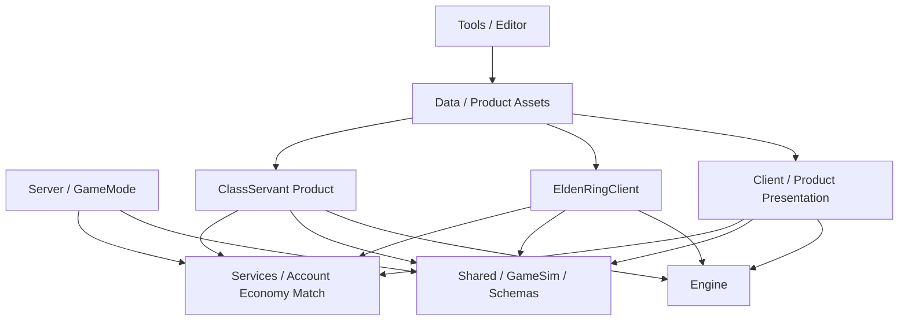

# Class & Servant Foundation Direction

작성일: 2026-06-22

## 한 줄 결론

Winters의 LoL 모작과 EldenRing 모작은 최종 제품이 아니라 `Class & Servant`를 출시하고 운영하기 위한 두 검증장이다. 따라서 LoL과 Elden은 게임별로 분리하되, Engine/Shared/Server/Services/Tools의 본질 경계는 공유해야 한다.

```text
LoL 모작      -> MOBA 공간, 팀전, 서버 권위 스킬, 미니언/타워/오브젝트 검증
Elden 모작    -> 3인칭 액션, 락온, 회피/패링, 보스/월드/스트리밍 검증
ClassServant -> Class + Servant Dual Agency 기반 PvPvE 라이브 게임
```

## 지금 구조를 쪼개도 되는가

맞다. 지금 LoL과 Elden 구조를 쪼개고, 개별 게임에 맞는 설계로 가는 것은 맞다.

단, 쪼개야 하는 것은 게임별 콘텐츠와 플레이 흐름이다. 쪼개면 안 되는 것은 Engine, 공통 asset runtime contract, 공통 network/session primitive, backend의 계정/결제/프로필 원장, 운영 로그 원칙이다.

```text
분리 대상:
- Scene flow
- input/camera/combat presentation
- champion/class/boss/servant/game mode rule
- product-specific data root
- product-specific server GameMode
- product-specific security validator

공유 대상:
- Engine runtime/render/resource/ECS/RHI
- Winters binary asset contract
- Shared schema와 deterministic GameSim 원칙
- Server network/session shell
- Services auth/profile/shop/payment/matchmaking/leaderboard shell
- Tools importer/converter/validator shell
```

## 왜 이렇게 가야 하는가

Class & Servant의 본질은 `Dual Agency`다. 플레이어는 `Class`와 `Servant`라는 두 의사결정 주체를 운용한다.

이 제품을 만들려면 LoL과 Elden에서 서로 다른 본질을 뽑아야 한다.

| 검증장 | 가져올 본질 | Class & Servant에서 쓰이는 곳 |
|---|---|---|
| LoL | 공간 지배, 라인/정글/오브젝트, 팀 전투, 판독성, 서버 권위 스킬 | `Class`의 전장 운영, Middle Ring 전투, 팀 목표 |
| Elden | 3인칭 액션, 락온, 회피/패링, 보스 패턴, 월드 스트리밍, 카타르시스 | `Servant`/보스/PvE 압력, Outer Ring, 액션 숙달 |
| Winters 고유 | 서버 권위 GameSim, Winters asset binary, Engine RHI, Tools pipeline | 실제 출시/운영 가능한 공통 기반 |

LoL 코드를 Elden에 섞으면 Elden이 LoL의 변형이 된다. Elden 코드를 LoL에 섞으면 LoL의 판독성과 서버 권위 흐름이 흐려진다. 두 검증장을 섞는 시점은 `ClassServant` 모듈에서만 허용한다.

## 현재 폴더 기준 판정

### `Engine/`

역할은 맞다. 계속 공통 실행 기반으로 둔다.

```text
Engine/
  window/frame loop
  ECS primitive
  RHI/render/resource
  asset loading runtime
  audio/input/profiler/editor hook
```

금지:

```text
Engine -> Client
Engine -> LoL
Engine -> Elden
Engine -> ClassServant
Engine -> Server gameplay rule
```

의심 기준:

```text
이 타입 이름에 Champion, Boss, Class, Servant, Lane, Tower, Dungeon이 들어가는가?
그렇다면 Engine이 아니라 게임별 모듈이다.
```

### `EngineSDK/`

Engine public header 동기화 산출물로만 본다. 설계 원본이 아니다.

```text
Engine public header 변경
  -> Engine 빌드
  -> UpdateLib.bat
  -> EngineSDK/inc 동기화
```

### `Shared/`

역할은 서버 권위 gameplay contract다.

현재 `Shared/GameSim`은 LoL 중심으로 커지고 있으므로 다음 방향은 `공통 원자`와 `제품별 규칙`을 분리하는 것이다.

```text
Shared/
  GameSim/
    Core/              // tick, world, deterministic utility
    Components/        // product-neutral runtime components
    Definitions/       // command/snapshot/event atom definitions
    Systems/           // 공통 시스템 또는 LoL에서 일반화된 시스템
    Champions/         // 현재 LoL 검증장. 장기적으로 WintersLOL 소유로 이동 후보
```

장기 방향:

```text
Shared/GameSim/Common/
Shared/GameSim/Products/WintersLOL/
Shared/GameSim/Products/WintersElden/
Shared/GameSim/Products/ClassServant/
```

단, 지금 바로 대규모 이동하지 않는다. 먼저 현재 LoL `SkillDef`, `ChampionDef`, `NetAnimationComponent` 같은 혼합 타입을 원자 단위로 정리한 뒤 이동해야 한다.

의심 기준:

```text
서버가 판정해야 하는가? -> Shared/GameSim 또는 Server
클라 연출만 필요한가? -> Client visual data
계정/소유/MMR인가? -> Services
```

### `Client/`

현재는 LoL 클라이언트와 공통 shell이 섞여 있다.

이미 `GameModule`, `GameSelect`, `ClientShell`이 생겼으므로 방향은 맞다. 다음 목표는 `Client/`를 공통 shell + LoL 검증장으로 명확히 읽히게 만드는 것이다.

```text
Client/
  Public/ClientShell/       // 선택된 product/session/launch state
  Public/GameModule/        // product module interface
  Public/Scene/             // GameSelect, 공통 scene
  Public/GameObject/        // 현재 LoL 검증장. 장기 이동 후보
  Public/GamePlay/          // 현재 LoL gameplay/presentation bridge. 장기 이동 후보
  Public/Manager/           // LoL manager가 섞여 있으면 module 소유로 이동 후보
```

중기 방향:

```text
Client/
  Public/ClientShell/
  Public/GameModule/
  Public/Scene/
  Private/ClientShell/
  Private/GameModule/
  Private/Scene/

Games/WintersLOL/Client/
  Champion/
  Scene/
  UI/
  Visual/
  Input/
```

지금 당장 할 일은 폴더 이동보다 소유권을 먼저 고정하는 것이다.

```text
LOLGameModule owns:
- LoL manager initialization
- LoL champion/skill registry
- LoL scene flow
- LoL UI/presentation bridge
```

### `EldenRingClient/`

별도 클라이언트로 존재하는 방향은 맞다.

Elden은 LoL `Scene_InGame`에 들어가면 안 된다. 현재처럼 `EldenRingClient`에서 `WintersEngine.dll`을 사용해 별도 세로 슬라이스를 증명하는 편이 안전하다.

```text
EldenRingClient/
  CEldenRingApp
  Elden asset probe
  Limgrave showcase
  RHI test renderer
```

다음 방향:

```text
EldenRingClient/Public/Scene/
EldenRingClient/Public/Camera/
EldenRingClient/Public/Character/
EldenRingClient/Public/Combat/
EldenRingClient/Public/World/
EldenRingClient/Public/Raid/
EldenRingClient/Public/UI/
```

의심 기준:

```text
이 기능이 LoL QWER/탑다운/미니언/타워에 기대는가?
그렇다면 EldenRingClient에 넣으면 안 된다.
```

### `EldenRingEditor/`

Editor는 runtime gameplay가 아니라 데이터 제작과 검증을 담당한다.

```text
EldenRingEditor/
  asset placement
  world partition editing
  material/mesh/animation validation
  pipeline debug
```

금지:

```text
Editor에서만 맞는 데이터를 runtime이 암묵적으로 기대하게 만들기
normal F5 runtime을 editor-only path로 우회하기
```

### `Server/`

방향은 공통 network/session/security shell 위에 제품별 GameMode를 올리는 것이다.

```text
Server/
  Public/Network/
  Public/Security/
  Public/Game/
  Private/Network/
  Private/Security/
  Private/Game/
```

다음 방향:

```text
Server/GameMode/
  IServerGameMode
  LOLGameMode
  EldenGameMode
  ClassServantGameMode
```

실제 권위 흐름:

```text
Client Input
  -> GameCommand
  -> Server GameMode
  -> Shared/GameSim
  -> Snapshot/Event
  -> Client Visual
```

의심 기준:

```text
서버가 Client visual hook을 알아야 하는가? -> 아니오
서버가 Engine renderer를 알아야 하는가? -> 아니오
서버가 product rule을 알아야 하는가? -> GameMode/validator 수준에서는 예
```

### `Services/`

현재 구조는 좋다. `auth`, `profile`, `shop`, `payment`, `matchmaking`, `leaderboard`는 Class & Servant 라이브 운영까지 이어지는 본질 축이다.

```text
Services/
  cmd/
    auth/
    profile/
    shop/
    payment/
    matchmaking/
    leaderboard/
  internal/
  pkg/
  migrations/
```

다음 방향은 서비스 분리가 아니라 `product_id` 축이다.

```text
account_id
product_id
season_id
match_id
order_id
item_def_id
inventory_item_id
rating_bucket
```

금지:

```text
lol_payment, elden_payment, classservant_payment 식으로 결제 서비스를 복제하기
프로필 한 row에 구매, MMR, 인벤토리, 매치 기록을 모두 넣기
```

운영 본질:

```text
Auth       -> 누가 접속했는가
Profile    -> 유저의 현재 상태는 무엇인가
Shop       -> 무엇을 팔 수 있는가
Payment    -> 돈의 진실은 무엇인가
Inventory  -> 무엇을 소유하는가
Matchmaking-> 어떤 경기로 보낼 것인가
Leaderboard-> 어떤 순위로 보여줄 것인가
AuditLog   -> 나중에 복구/조사할 수 있는가
```

### `Data/`

현재 `Data/LoL`은 존재하지만 Elden/ClassServant product root는 더 명확해져야 한다.

목표:

```text
Data/
  LoL/
  EldenRing/
  ClassServant/
  GameModes/
  Gameplay/
```

주의:

```text
Client/Bin/Resource는 runtime resource 해석 위치다.
Data는 source/cooked data의 소유권을 설명하는 위치다.
```

Elden 원본 추출물은 공개 배포 자산이 아니다. 최종 런타임은 Winters binary와 대체 가능 에셋 계약을 기준으로 해야 한다.

### `Tools/`

Tools는 협업 파이프라인의 핵심이다.

```text
Tools/
  ChampionData/          // LoL champion/skill data 검증
  EldenAssetPipeline/    // Elden asset 변환/검증
  WintersAssetConverter/ // 공통 Winters binary 변환
  SimLab/                // deterministic sim 검증
```

다음 방향:

```text
Tools/Common/
Tools/Products/WintersLOL/
Tools/Products/WintersElden/
Tools/Products/ClassServant/
```

단, 실제 폴더 이동은 도구 실행 경로와 산출물 경로를 먼저 정리한 뒤 진행한다.

## 의존성 북극성



금지 의존성:

```text
Engine -> Client
Engine -> Server
Engine -> Services
Shared/GameSim -> Engine
Shared/GameSim -> Client
Shared/GameSim -> Renderer/DX/ImGui
Server -> Client visual
Services -> Engine runtime
```

## 단일 EXE와 별도 EXE의 정리

현재 문서 사이에는 두 흐름이 공존한다.

```text
1. 단일 WintersGame.exe + GameSelect + GameModule
2. WintersLOL.exe / WintersElden.exe 별도 클라이언트
```

둘은 충돌하지 않는다. 본질은 패키징 방식이 아니라 소유권이다.

정리:

```text
개발 중:
- Client는 LoL 검증장 + GameSelect shell
- EldenRingClient는 별도 exe 세로 슬라이스
- ClassServant는 아직 제품 모듈/폴더 후보

중기:
- 공통 shell은 Client/GameModule로 유지
- LoL/Elden/ClassServant 코드는 제품별 폴더로 격리
- 빌드 산출물은 단일 런처 또는 별도 exe 중 출시 전략에 맞게 선택

변하지 않는 것:
- Engine은 게임을 모른다
- Server/GameSim이 gameplay truth를 소유한다
- Services가 계정/결제/소유/MMR truth를 소유한다
```

## 다음 방향

### 1. LoL 현재 구조를 본질 원자까지 정리한다

진행 중인 Champion/Skill refactor는 계속 맞다.

목표:

```text
SkillDef -> SkillTypes + SkillCommand + ChampionGameData + ChampionVisualData + VisualEventData
ChampionDef -> ChampionGameData + ChampionVisualData + spawn/loadout policy
SkillTable 삭제 방향
ChampionTable 삭제 방향
NetAnimationComponent -> ReplicatedPose + ReplicatedAction
ChampionGameData.summonerSpells -> SummonerSpellGameData
```

이 작업은 단순 LoL 청소가 아니다. ClassServant의 `ClassData`, `ServantData`, `BondRuleData`, `PossessionRuleData`를 안전하게 만들기 위한 훈련이다.

### 2. Product ownership audit을 한다

다음 grep/audit 목표:

```text
Client/GameObject    -> LoL 소유인지, 공통 presentation인지 판정
Client/GamePlay      -> LoL gameplay bridge인지, 공통 input shell인지 판정
Client/Manager       -> LoL manager인지, 공통 app manager인지 판정
Shared/GameSim       -> 공통 원자인지, LoL rule인지 판정
Server/Private/Game  -> 공통 server shell인지, LoL GameMode인지 판정
```

이름 변경보다 먼저 소유권 주석/문서/모듈 경계를 확정한다.

### 3. EldenRingClient는 LoL과 완전히 다른 세로 슬라이스로 키운다

다음 Elden 목표:

```text
EldenRingClient boots
  -> loads Winters binary asset
  -> third-person camera
  -> lock-on
  -> idle/run/attack/dodge
  -> hitbox/hurtbox debug
  -> small streaming field
```

LoL의 `Scene_InGame`, champion skill registry, QWER skill table을 재사용하지 않는다.

### 4. Server는 GameMode 분리를 준비한다

다음 Server 목표:

```text
IServerGameMode
LOLGameMode wraps current LoL GameSim path
EldenGameMode placeholder
ClassServantGameMode placeholder
```

중요:

```text
GameMode는 product rule을 안다.
Network/session shell은 product rule을 모른다.
```

### 5. Services는 product_id 축을 넣는다

다음 Backend 목표:

```text
auth: platform identity -> account_id
profile: account_id + product_id
shop: product_id + item_def_id
payment: order_id + account_id + product_id + immutable transaction
matchmaking: product_id + queue_type + rating bucket
leaderboard: product_id + season_id + rating/result projection
```

ClassServant 출시 운영을 생각하면, 이 축은 나중에 미루면 비싸다.

### 6. ClassServant는 마지막에 섞는다

ClassServant를 너무 빨리 만들면 LoL/Elden 미완성 코드를 한 곳에 합치는 폴더가 된다.

진입 조건:

```text
LoL: 서버 권위 5v5 한 판이 안정적으로 끝난다.
Elden: 3인칭 액션 세로 슬라이스가 Engine 위에서 돈다.
Services: product_id 기반 계정/프로필/매칭/결제 원장이 있다.
Tools: product별 data validation/cook이 가능하다.
```

그때 ClassServant 첫 구조:

```text
Games/ClassServant/
  Client/
    Scene/
    Class/
    Servant/
    Bond/
    Possession/
    Visual/
    UI/
  Server/
    ClassServantGameMode
    BondSystem
    PossessionSystem
    ObjectiveSystem
  Data/
    ClassData
    ServantData
    BondRuleData
    MapRuleData
```

## 최종 판정

지금 방향은 맞다.

하지만 기준은 이것이다.

```text
LoL과 Elden을 쪼개는 것은 맞다.
Engine과 운영 원장을 쪼개는 것은 틀리다.
ClassServant는 LoL 폴더와 Elden 폴더를 합치는 것이 아니다.
ClassServant는 LoL에서 검증한 MOBA 본질과 Elden에서 검증한 액션 본질을
공통 Engine/Shared/Server/Services/Tools 위에서 새 제품으로 조립하는 것이다.
```

다음 리팩터링은 폴더 이동이 아니라 소유권 고정부터 시작한다. 소유권이 선명해진 뒤에만 폴더를 옮긴다.
