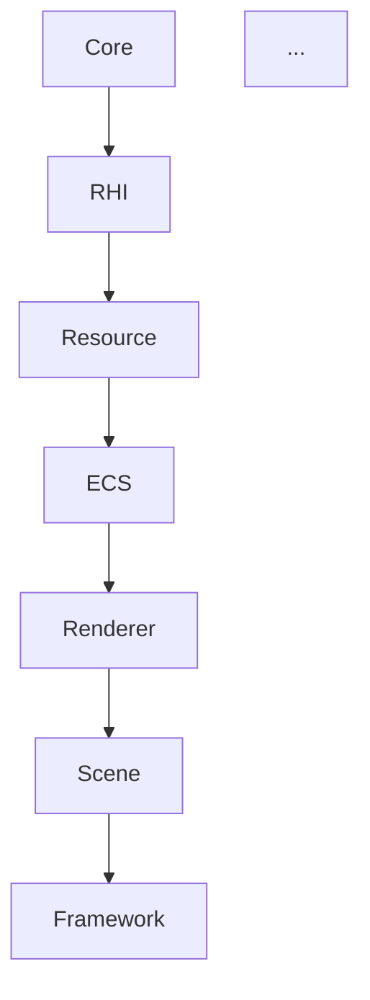

# Winters Codebase Compass System v1

> **작성일**: 2026-05-02
> **목적**: 1000+ 파일 / 100+ 챔프 / 60+ 모듈 도달 시점에서 AI (Claude/Codex) 와 사람 모두가 코드베이스를 **grep 없이** 탐색·작업할 수 있도록 모듈 단위 metadata 레이어 박제.
> **현 시점 가치**: Winters 가 아직 ~300 파일 / ~13 모듈 — Compass 미도입 시 1000 파일 도달 (Phase D Physics + Phase E 렌더링 + Phase F AI 봇 + 100 챔프 합산) 시점에서 AI 작업 효율 급격 저하 예상. **현 시점 박제 = 무료 보험**.
> **참조 사례**: UE5 (Build.cs + Module 격리), Unity (asmdef + package.json), CDPR REDengine (TweakDB + REDmod SDK)
> **반대 모델**: Encyclopedia (Grep 의존) — N=10K 파일에서 작동 불가
> **본 모델**: Compass (모듈별 manifest + 의존성 graph + AI bootstrap)

---

## §0. 한 줄 요약

**거대 코드베이스에서 AI 가 grep 으로 매번 탐색하면 context token 폭증 + hallucination. UE5/Unity 처럼 모듈별 manifest (Build.cs/asmdef) + 의존성 graph + AI bootstrap workflow 박제 = AI 가 읽을 곳을 몇 개로 좁혀 작업 직진. Winters 의 미래 1000 파일 / 60 모듈 도달 시점을 위해 현 시점 (300 파일 / 13 모듈) 에 5 components × Phase A~D 단계화로 박제.**

---

## §1. 개념 — Encyclopedia vs Compass

### 1-1. Encyclopedia 모델 (현 Winters / 일반 LLM agent)

```
[Task 입력]
   ↓
[AI: "어디 있지?"]
   ↓
Grep "ChampionDef" → 87 hits
Grep "SkillTable"  → 42 hits
Grep "FxPresets"   → 31 hits
   ↓
[AI: 후보 160 개 중 어떤 게 진짜 관련?]
   ↓
Read X.cpp (10000 lines)
Read Y.cpp (8000 lines)
Read Z.cpp (15000 lines)
   ↓
[Context token 80% 소진, task 자체 작업 시작도 못 함]
```

**한계** (N=10000 파일):
- Grep 결과가 1000+ hits → 후보 압축 자체가 task 보다 큰 작업
- AI 가 "관련 있어 보이는" 파일 위주로 Read → 실제 진입점 놓침
- 같은 task 두 번 받으면 같은 탐색 반복 (메모리 없음)

### 1-2. Compass 모델 (UE5 / Unity / 본 계획서)

```
[Task 입력] — "Yasuo 에 conditional Q 3타 추가"
   ↓
[AI: 최상위 MODULE_GRAPH.md Read]
   ↓
[matching: "스킬 추가" → 1) ChampionTable, 2) SkillTable,
                         3) Champions/{Yasuo}/, 4) Scene_InGame]
   ↓
[각 모듈의 _MODULE.md 4 개만 Read (총 ~1000 lines)]
   ↓
[진입점 명확 — Yasuo_Skills.cpp:42 PerformQ 함수]
   ↓
[Read 그 함수 + 직접 Edit]
```

**효과** (N=10000 파일):
- Grep 0~1회 (manifest 가 안 가르쳐주는 정보만)
- Read 4~6 파일 (manifest 3-4 + 실제 작업 파일 1-2)
- Context token 80% → 30%
- 같은 task 재방문 시 manifest 만 보고 즉시 진입

### 1-3. 핵심 비유

| 비유 | Encyclopedia | Compass |
|---|---|---|
| 도서관 | 모든 책 한 권씩 훑기 | 색인 카드 → 서가 번호 → 책 |
| 도시 | GPS 없이 모든 골목 답사 | 지하철 노선도 → 환승역 → 출구 |
| 코드 | Grep 전수 탐색 | Module graph → manifest → 진입점 |

**Compass 의 본질**: AI 의 시야를 좁히는 게 아니라 **어디를 봐야 하는지 가리키는 화살표 박제**. 시야 좁히기 = restriction (= 정보 손실), 화살표 박제 = guidance (= 정보 추가).

---

## §2. 거대 코드베이스 적용 사례 분석

### 2-1. Unreal Engine 5

UE5 Source 의 모듈 구조:
```
Engine/Source/
├── Runtime/                     ← 60+ 핵심 모듈
│   ├── Core/                    Core.Build.cs (의존성 0)
│   ├── CoreUObject/             CoreUObject.Build.cs → Core
│   ├── Engine/                  Engine.Build.cs → Core, CoreUObject, RHI, ...
│   ├── RHI/                     RHI.Build.cs → Core
│   ├── Renderer/                Renderer.Build.cs → RHI, RenderCore
│   ├── RenderCore/              RenderCore.Build.cs → RHI
│   ├── D3D12RHI/                Platform-specific RHI
│   ├── Slate/, SlateCore/, UMG/ UI 계층
│   ├── AIModule/                AI 시스템
│   ├── NavigationSystem/        Pathfinding
│   ├── Niagara/                 VFX
│   ├── Chaos/, ChaosSolverEngine/ Physics
│   ├── Animation/, AnimationCore/ Anim
│   └── ... (60+ 개)
├── Editor/                      에디터 전용 (Runtime 의존)
├── Programs/                    UE Header Tool 등 utility
└── ThirdParty/                  외부 의존성
```

**Compass 박제 형태 — `*.Build.cs`** (각 모듈에 1개):
```csharp
// 예: Engine/Source/Runtime/Renderer/Renderer.Build.cs
public class Renderer : ModuleRules
{
    public Renderer(ReadOnlyTargetRules Target) : base(Target)
    {
        PublicDependencyModuleNames.AddRange(new string[]
        {
            "RHI", "RenderCore", "Engine"
        });
        PrivateDependencyModuleNames.AddRange(new string[]
        {
            "Core", "CoreUObject", "ApplicationCore"
        });
        PrivateIncludePathModuleNames.AddRange(new string[]
        {
            "TargetPlatform"
        });
    }
}
```

**효과**:
- AI/사람이 "Renderer 에 X 추가" task 받으면 — Build.cs 1 파일만 읽고 의존하는 6 모듈 (의존받는 N 모듈) 즉시 파악
- IDE 가 자동으로 의존성 cycle 검출 + Public/Private 경계 강제
- 새 모듈 추가 시 Build.cs 작성 강제 → compass 자동 갱신

**한계 (UE5 가 아직 부족한 부분)**:
- Build.cs 는 컴파일 의존성만 — 책임/진입점/함정 같은 의미적 정보 없음
- 일부 모듈에 README.md 있지만 일관성 없음
- AI 친화 metadata 부재 — Epic 사내는 Confluence 등으로 보강

→ **본 Compass System 은 Build.cs + AI 친화 markdown 레이어**.

### 2-2. Unity

Unity 의 모듈 격리:
```
Packages/
├── com.unity.render-pipelines.universal/
│   ├── package.json              ← {"dependencies": {"com.unity.shadergraph": "14.0.7"}}
│   ├── Documentation~/           ← markdown 문서
│   ├── Runtime/
│   ├── Editor/
│   └── Tests/
└── ... (수십 개 package)

Assets/MyGame/
├── Scripts/
│   ├── Combat/
│   │   ├── Combat.asmdef         ← {"references": ["MyGame.Core"]}
│   │   └── *.cs
│   └── Core/
│       ├── Core.asmdef
│       └── *.cs
```

**Compass 박제 형태**:
- `package.json` — dependencies + version + display name + description
- `*.asmdef` — references / includePlatforms / autoReferenced / overrideReferences
- `Documentation~/` — markdown (npm convention)

**효과**:
- Package Manager UI 자체가 visual compass — 사람이 마우스로 의존성 그래프 탐색
- Assembly Definitions 가 컴파일 단위 격리 → cycle 자동 차단
- DOTS (ECS) 도입 후 — System / Component 단위 자연 분할 추가

**Unity 가 잘하는 점**:
- `Documentation~/` 폴더 convention — npm 패턴 차용으로 markdown 문서 위치 표준화
- IDE (Rider/VSCode) 가 asmdef 시각화

### 2-3. CD Projekt RED — REDengine 4 (제한된 공개 정보)

CDPR 의 외부 노출 시스템 (모드 SDK):
```
The Witcher 3 / Cyberpunk 2077 mod tools:
├── REDmod                        ← 공식 모드 시스템 (CP2077)
│   └── tweakdb_record.tweak      ← 게임 데이터 schema-as-compass
├── REDscript                     ← script extension framework
├── RED4ext                       ← native plugin loader
│   └── plugins/*.dll             ← 각 plugin 의 manifest
└── ArchiveXL                     ← asset packaging
```

**TweakDB — schema-as-compass**:
- 게임의 모든 statistic / item / NPC / weapon 이 TweakDB record 로 정의
- 각 record 가 자기 type / inheritance / fields 박제
- modder 가 "총기 데미지 변경" task 받으면 → TweakDB 의 `Items.Weapon` schema 만 보고 즉시 진입
- 게임 데이터 자체가 자기 구조의 compass

**제한된 정보**:
- CDPR 내부 코드 모듈 구조는 비공개
- 단 외부 SDK 가 compass 패턴이 잘 잡혔다는 것 = 내부도 비슷할 가능성 높음

### 2-4. 공통 패턴 5개 (Minimum Viable Compass)

| # | 패턴 | UE5 | Unity | CDPR | Winters 적용 |
|---|---|---|---|---|---|
| 1 | **Per-module manifest** | `*.Build.cs` | `*.asmdef` + `package.json` | `*.uplugin` 류 | `_MODULE.md` (markdown, AI 친화) |
| 2 | **Public/Private 경계** | `Public/`, `Private/` 폴더 | `internal` 키워드 | (비공개) | 이미 있음 (`Engine/Public`, `Engine/Private`) |
| 3 | **Plugin/Package 격리** | `Plugins/*.uplugin` | `Packages/com.X/` | `RED4ext plugins/` | 향후 `Extensions/{ChampionPack}/` |
| 4 | **Dependency 명시** | Build.cs 의 `Public/PrivateDependencyModuleNames` | asmdef `references` | TweakDB inheritance | `_MODULE.md` 의 `## Depends On` / `## Depended By` |
| 5 | **AI 친화 entry point** | (부재 — Confluence 보강) | `Documentation~/` | 모드 SDK 문서 | `_MODULE.md` 의 `## Entry Points` + `## Common Tasks` |

**Winters Compass = 위 5개를 markdown 단일 레이어에 통합**.

---

## §3. Winters Compass System 설계

### 3-1. 5 Components

#### Component 1 — Module Manifest (`_MODULE.md`)

각 폴더 (모듈 단위) 에 1 파일. 위치: 폴더 root.

**예시 — `Engine/Public/Renderer/_MODULE.md`**:
```markdown
# Renderer Module

## 책임 (Responsibility)
DX11 기반 mesh/skinned/UI 렌더링. RenderGraph (Phase 2) 진입 전까지는
직접 IA/PS bind 패턴.

## 진입점 (Entry Points)
- `CModelRenderer::Create(...)` — 챔프/미니언 instance 생성 시
- `CPlaneRenderer::Render(...)` — 지면 quad (AttackRange/FX 빌보드)
- `CFxSystem::Spawn(...)` — FxBillboard / FxMesh particle

## 의존 (Depends On)
- `RHI/` — DX11Device, DX11Pipeline, DX11Shader
- `Resource/` — CModel, CTexture, CAnimator
- `ECS/` — RenderComponent, TransformComponent

## 의존받음 (Depended By)
- `Client/Scene/Scene_InGame` (메시 렌더 호출)
- `Client/Manager/Champions/*` (챔프별 FxPresets)

## Common Tasks (AI 매핑)
- "신규 셰이더" → `Shaders/` 에 hlsl 추가 + `DX11Shader::Create(path)` 등록
- "FX 빌보드 추가" → `FxSystem::Spawn` + `FxBillboardComponent` 패턴 미러
- "신규 메시 타입" → `CModel::LoadModel` 분기 + RenderComponent flag 추가

## 함정 (Gotchas)
- Mesh3D.hlsl `clip(texColor.a - 0.05)` — alpha 0 영역 픽셀 버려짐
  (LoL render/*.png 함정, CLAUDE.md 박제)
- Skinned 정점 byte offset (76B layout) — POD 변경 시 IL 동시 갱신
- 셰이더 수정 후 OutDir 동기화 필수 (xcopy /D 가 hlsl 변경 감지 X)

## 외부 노출 API (DLL boundary)
- `WINTERS_ENGINE` 마크: ModelRenderer/PlaneRenderer/FxSystem
- 비노출: 내부 RHI 캐시, BlendStateCache 등 (CGameInstance::Get_* 게터 경유만)

## 핵심 파일 (Top 5 by importance)
1. `ModelRenderer.h/.cpp` — 인스턴스 생성 + Animate + Render 사이클
2. `FxSystem.h/.cpp` — particle spawn/update/render
3. `PlaneRenderer.h/.cpp` — 지면 quad
4. `BillboardSystem.cpp` — 카메라 facing 계산
5. (Phase 2) `RenderGraph.h/.cpp` — 미래

## 관련 계획서 / 문서
- `.md/plan/engine/RENDERGRAPH_PLAN.md` (Phase 2)
- `.md/architecture/WINTERS_GAMEPLAY_ARCHITECTURE.md §렌더`
```

**필수 섹션 (체크리스트)**:
- [x] 책임 1 단락
- [x] 진입점 (3-7개)
- [x] 의존 (모듈 이름들)
- [x] 의존받음 (역방향 추적)
- [x] Common Tasks (AI 매핑 — Task 표현 ↔ 진입 위치)
- [x] 함정 (CLAUDE.md gotcha 의 발췌)
- [x] 외부 노출 API
- [x] 핵심 파일 Top 5
- [x] 관련 계획서 링크

**비강제 (선택 섹션)**:
- 성능 특성 / 알려진 병목
- 미해결 TODO
- 외부 학습 자료

#### Component 2 — Module Graph (`MODULE_GRAPH.md`)

Top-level 단일 파일. 위치: `.md/architecture/MODULE_GRAPH.md`.

```markdown
# Winters Engine Module Graph

## 텍스트 DAG

Engine (의존성 낮은 → 높은 순):
  Core (Timer/Input/Allocator)
    ↓
  RHI (DX11 Device/Buffer/Shader)
    ↓
  Resource (Model/Texture/Animator/ResourceCache)
    ↓
  ECS (Entity/Component/System/World)
    ↓
  Renderer (ModelRenderer/FxSystem/PlaneRenderer)
    ↓
  Scene (IScene/Scene_Manager)
    ↓
  Framework (CEngineApp/IWintersApp)

Engine 옆가지:
  Manager → Sound (FMOD), UI, Navigation, Profiler
  AI (Phase F) → FSM/BT/GOAP/Utility
  Physics (Phase D) → Collision/Dynamics/PBD/CCD

Client:
  Scene_* → Manager/Champions/Minion → Network (Auth/Match/Shop)

Server:
  Network (IOCP) → Game (ServerWorld/AOI) → Security

## Mermaid 시각화 (선택)



## Cycle 검출
- 2026-05-02 기준: cycle 0 ✓
- 검출 도구: `Tools/CompassValidator.exe` (Phase B)
```

**갱신 의무**: 새 모듈 추가 시 + 의존성 변경 시 즉시 반영. CI 검증 (Phase B).

#### Component 3 — Entry Point Registry (`ENTRY_POINTS.md`)

"X 기능 추가하려면 Y 모듈의 Z 진입" 매핑. 위치: `.md/architecture/ENTRY_POINTS.md`.

```markdown
# Winters Entry Points — Task → Module 매핑

## 챔피언 추가
1. `ChampionTable.cpp` — eChampion enum + ChampionDef row
2. `SkillTable.cpp` — Q/W/E/R/BA SkillDef 5 row
3. `Champions/{Name}/{Name}_FxPresets.cpp` — FX 박제
4. `Champions/{Name}/{Name}_Skills.cpp` — castFrame hook
5. `Scene_InGame.cpp` — m_{Name} 멤버 + OnEnter 스폰
6. `BanPick.cpp` — 픽 버튼

→ 30분 워크플로 ([CHAMPION_WMESH_PIPELINE_GUIDE.md](.md/guide/CHAMPION_WMESH_PIPELINE_GUIDE.md))

## 신규 스킬 (기존 챔프)
1. `SkillTable.cpp` — 해당 챔프 row 의 fields 변경
2. `{Name}_Skills.cpp` — castFrame 시점 effect
3. `{Name}_FxPresets.cpp` — visual

## 신규 셰이더
1. `Shaders/{Name}.hlsl` — VS/PS/CS 코드
2. `DX11Shader::Create(path)` 등록 — caller 가 ResourceCache 경유
3. `Client.vcxproj` PostBuild xcopy 확인 (이미 자동)

## 네트워크 패킷 추가
1. `Shared/Schemas/*.fbs` — FlatBuffers schema
2. flatc 컴파일 → header 생성
3. Server `Game/PacketDispatcher.cpp` 핸들러 등록
4. Client `Network/ClientNetwork.cpp` 시리얼라이저 등록

## ECS 컴포넌트 추가
1. `ECS/Components/{Name}.h` — POD struct
2. `ECS/Components/{Name}.cpp` (필요 시) — 생성자 / 초기화
3. `ECS/World.h` — TypeID 등록
4. 사용 시스템의 `Get_AccessContract` reads/writes 갱신

## (Phase 2) RenderGraph 패스 추가
... 미래

## (Phase D) Physics 콘스트레인트 추가
... 미래
```

**현 시점에 50개 정도 매핑 박제 → 1000 파일 도달 시 200개로 증가 예상**.

#### Component 4 — AI Bootstrap Workflow (`AI_BOOTSTRAP.md`)

AI 가 새 task 받으면 따르는 표준 절차. 위치: `.md/architecture/AI_BOOTSTRAP.md`.

```markdown
# AI Bootstrap Workflow — Compass 사용 표준 절차

## Task 진입 5단계

1. **Task 분류**
   - "신규 챔프" / "신규 스킬" / "버그 수정" / "성능 최적화" / 기타
   - 분류 모호하면 사용자에게 1 문장 질문

2. **Entry Point Registry 조회**
   - `.md/architecture/ENTRY_POINTS.md` 의 매핑 확인
   - 후보 모듈 1-3개 식별

3. **Module Manifest 읽기**
   - 후보 모듈의 `_MODULE.md` Read
   - 진입점 + 함정 + 외부 노출 확인
   - Common Tasks 섹션에서 비슷한 task 패턴 차용

4. **진입점 코드 직접 Read**
   - manifest 의 진입점 함수 위치 (예: `Yasuo_Skills.cpp:42`) Read
   - 주변 컨텍스트 (±100 줄) 만 읽고 패턴 파악

5. **작업 시작**
   - Edit / Write 진행
   - Grep 은 manifest 가 안 가르쳐주는 정보만 (예: 특정 매크로 호출 사이트)
   - 작업 완료 후 manifest 갱신 필요한지 확인 (의존성 추가 / 진입점 추가 시)

## 금지 패턴 (Encyclopedia 회귀)

❌ Task 받자마자 `Grep "X"` (manifest 먼저 X)
❌ `Glob "**/*.cpp"` 후 무차별 Read
❌ Manifest 없이 "탐색" 만으로 1000 토큰+ 소비
❌ 같은 task 두 번째 받았는데 첫 번째와 동일 탐색 반복

## 권장 패턴

✓ MODULE_GRAPH 1회 read → 후보 좁히기
✓ 1-3 manifest read → 진입점 확정
✓ 진입점 코드 ±100 줄만 read → 패턴 파악
✓ Edit/Write 진행
✓ 작업 후 manifest 갱신 (의존성 변경 시)

## Grep 사용 가이드라인 (비상시만)

허용 케이스:
- 특정 매크로의 모든 호출 사이트 (`WINTERS_PROFILE_SCOPE` 등)
- 정규표현 패턴 검색 (예: TODO/FIXME)
- Manifest 가 stale 했을 가능성 검증

비허용 케이스:
- "X 클래스 위치 모름" (manifest 가 알려줌)
- "Y 함수 정의 위치 모름" (진입점 박제)
- "Z 모듈 의존성 모름" (MODULE_GRAPH 박제)
```

#### Component 5 — Validator (`Tools/CompassValidator/`)

CI 검증 도구. Phase B 도입.

```
검증 항목:
1. 모든 모듈 폴더에 _MODULE.md 존재
2. _MODULE.md 의 모든 필수 섹션 채워짐
3. MODULE_GRAPH.md 의 의존성과 _MODULE.md 의 ## Depends On 일치
4. 의존성 cycle 0
5. _MODULE.md 의 진입점 파일 경로 실재
6. ENTRY_POINTS.md 의 매핑 파일 경로 실재
7. _MODULE.md 의 ## Depended By 가 자동 계산값과 일치
```

CI 실패 시 PR 차단. 사람/AI 모두 manifest 갱신 강제.

### 3-2. `_MODULE.md` 템플릿 (복붙용)

```markdown
# {ModuleName} Module

## 책임 (Responsibility)
{1-2 단락. 이 모듈이 해결하는 문제 + 경계.}

## 진입점 (Entry Points)
- `{ClassName}::{Method}` — {언제 사용}
- ... (3-7개)

## 의존 (Depends On)
- `{Module}` — {왜}

## 의존받음 (Depended By)
- `{Module}` — {용도}

## Common Tasks (AI 매핑)
- "{Task 표현}" → {진입 위치 / 패턴}
- ... (3-10개)

## 함정 (Gotchas)
- {함정 1} — {증상 / 회피}
- ... (CLAUDE.md gotcha 발췌 + 모듈 특화)

## 외부 노출 API (DLL boundary)
- `WINTERS_ENGINE` 마크: {목록}
- 비노출: {목록}

## 핵심 파일 (Top 5 by importance)
1. `{File}` — {역할}
... (5개)

## 관련 계획서 / 문서
- `{path}` — {요약}
```

### 3-3. Module 수 견적 (현 13 → 미래 60+)

**현재 (2026-05-02)** — Engine 13 + Client 8 + Server 4 + Shared 1 + Tools 2 + Services 6 = **34 모듈**:

| 영역 | 모듈 수 | 예시 |
|---|---|---|
| Engine | 13 | Core / RHI / Renderer / Resource / ECS / Scene / ... (CLAUDE.md Engine 필터 표) |
| Client | 8 | MainApp / Scene / GameObject / Manager / Network / GameMode / AI / Defines |
| Server | 4 | Network / Game / Security / Shared |
| Shared | 1 | Schemas |
| Tools | 2 | AssetConverter / (향후 CompassValidator) |
| Services | 6 | auth / leaderboard / matchmaking / profile / payment / shop |
| **합계** | **34** | |

**미래 (Phase D-F 완료 시점)** — **60+ 모듈** 예상:

| 추가 영역 | 추가 모듈 수 | 예시 |
|---|---|---|
| Phase D Physics | +5 | Collision / Dynamics / PBD / CCD / Constraints |
| Phase E Renderer | +8 | BRDF / PBR / GI / PostFX / FFT / Ocean / PathTracer / TAA |
| Phase F AI | +10 | FSM / BT / GOAP / Utility / Blackboard / InfluenceMap / Pathfinding / MCTS / Imitation / RL |
| Champions × 100 | (모듈 X) | Champions/ 안 폴더 — 챔프 1개당 module 아님, 단일 Champions 모듈 |
| WintersElden 분리 | +5 | Action / Stamina / OpenWorld / Boss / Loot |
| WintersLOL 분리 | +3 | Lane / Jungle / Tower |
| 합계 | **+31** | |

**총 65+ 모듈** — UE5 의 Engine/Source/Runtime/ 60+ 와 비슷한 규모. 현 시점 박제 시 점진 확장 가능.

---

## §4. AI Bootstrap 워크플로 (상세)

### 4-1. 새 Task 진입 흐름 (예시 — "Yasuo 신규 스킬 추가")

```
[User] "Yasuo 에 스킬 6번 (Q 4타) 추가해줘"
   ↓
[AI Step 1: Task 분류]
   "신규 스킬 (기존 챔프)" 으로 분류
   ↓
[AI Step 2: Entry Point Registry]
   .md/architecture/ENTRY_POINTS.md Read
   "신규 스킬 (기존 챔프)" 항목:
     1. SkillTable.cpp 해당 row 변경
     2. {Name}_Skills.cpp castFrame
     3. {Name}_FxPresets.cpp visual
   → Yasuo 모듈 + SkillTable 모듈 후보
   ↓
[AI Step 3: Module Manifest]
   Champions/Yasuo/_MODULE.md Read (200 lines)
     진입점: PerformQ at Yasuo_Skills.cpp:42
     함정: stage2/3 conditional 처리는 Q 의 m_iQStack 변수
     관련: SkillTable 의 yasuo_q row 의 stage 필드
   SkillTable/_MODULE.md Read (150 lines)
     진입점: g_SkillTable 의 yasuo_q row
     함정: lockDuration × animPlaySpeed ≥ recoveryFrame/FPS
   ↓
[AI Step 4: 진입점 코드]
   Yasuo_Skills.cpp:42 ±100 줄 Read
   SkillTable.cpp 의 yasuo_q row Read
   ↓
[AI Step 5: 작업]
   stage 필드 추가 + PerformQ 안에 Q4 분기 추가
   FxPresets 에 Q4 visual 박제
   Edit 3개 파일
   ↓
[검증]
   manifest 갱신 필요한가?
     - Yasuo 모듈의 진입점 변경 X (PerformQ 함수 그대로)
     - 단 Common Tasks 에 "Q 4타 패턴" 추가 가능
   → manifest 마이너 갱신
   ↓
[완료]
   Read 5 파일 (manifest 2 + 코드 2 + ENTRY_POINTS 1)
   Grep 0회
   Context token: ~5K (vs Encyclopedia 30K+)
```

### 4-2. Encyclopedia → Compass 전환 시점에 자주 보이는 안티패턴

**안티패턴 1 — Manifest 무시하고 grep**:
```
❌ Task 받자마자 Grep "yasuo" → 87 hits → 무차별 Read
✓  ENTRY_POINTS Read → Champions/Yasuo/_MODULE.md Read → 진입점 직진
```

**안티패턴 2 — Manifest 만 읽고 코드 안 봄**:
```
❌ Manifest 만 읽고 "이 모듈은 X 한다" 고 가정
✓  Manifest 의 진입점 코드 직접 Read 후 패턴 확인
```

**안티패턴 3 — Manifest 갱신 누락**:
```
❌ 새 진입점 추가했는데 _MODULE.md 갱신 안 함 → 다음 task 에서 stale
✓  작업 끝 manifest 갱신 (Validator CI 가 강제)
```

### 4-3. CLAUDE.md 와의 통합

**CLAUDE.md 는 프로젝트 root README** = "Winters 가 뭐고 어떻게 작업하는지" 의 최상위.
**MODULE_GRAPH.md 는 모듈 구조 README** = "Winters 의 모듈이 뭐가 있고 어떻게 의존하는지".
**_MODULE.md 는 모듈별 README** = "이 모듈에서 뭘 어떻게 하는지".

3 단계 계층:
```
CLAUDE.md (프로젝트 — what & why)
  ↓
MODULE_GRAPH.md (구조 — where)
  ↓
_MODULE.md (모듈 — how)
  ↓
실제 코드 파일 (구현 — exact)
```

CLAUDE.md 가 너무 커지면 → MODULE_GRAPH + _MODULE 로 분산 (현 CLAUDE.md 1100+ 줄 — 일부 모듈별 정보를 _MODULE.md 로 이전 가능).

---

## §5. 적용 단계

### Phase A — 현 코드베이스 박제 (1주, 수동)

| Day | 작업 | 산출물 |
|---|---|---|
| 1 | Engine 13 모듈 _MODULE.md 박제 | 13 파일 |
| 2 | Client 8 모듈 _MODULE.md | 8 파일 |
| 3 | Server 4 + Shared 1 + Tools 2 + Services 6 _MODULE.md | 13 파일 |
| 4 | MODULE_GRAPH.md 작성 + 의존성 검증 (수동 cycle 검출) | 1 파일 |
| 5 | ENTRY_POINTS.md 작성 (현 50개 매핑) | 1 파일 |
| 6 | AI_BOOTSTRAP.md 작성 + 본 계획서 갱신 | 2 파일 |
| 7 | 1주 사용 후 회고 — 빠진 정보 / 부정확한 진입점 보강 | (수정 다수) |

**합격 기준**: 새 task ("Yasuo 신규 스킬") 받았을 때 Grep 0회 + Read ≤ 6 파일로 완료.

### Phase B — Validator + CI (3일)

| Day | 작업 | 산출물 |
|---|---|---|
| 1 | `Tools/CompassValidator/main.cpp` — 7 검증 항목 구현 | 신규 도구 |
| 2 | GitHub Actions 통합 (PR 시 자동 실행) | `.github/workflows/compass.yml` |
| 3 | 기존 _MODULE.md 회귀 검증 + Validator 자체 테스트 | (수정) |

**합격 기준**: PR 에서 _MODULE.md 누락 / 의존성 cycle / stale 진입점 자동 차단.

### Phase C — 새 모듈 추가 시 의무화 (지속)

새 모듈 추가 PR 의 체크리스트:
- [ ] 폴더에 `_MODULE.md` 박제
- [ ] `MODULE_GRAPH.md` 의 DAG 갱신
- [ ] 의존하는 기존 모듈의 `_MODULE.md` 의 `## Depended By` 갱신
- [ ] (해당 시) `ENTRY_POINTS.md` 새 매핑 추가
- [ ] Validator CI 통과

CLAUDE.md 의 "코딩 컨벤션" 섹션에 Compass 의무 박제.

### Phase D — 100 챔프 / 1000 파일 도달 시 효과 측정 (장기)

지표:
- Task 완료 시 평균 Read 파일 수 (목표: < 8)
- Task 완료 시 평균 Grep 호출 수 (목표: < 1)
- Context token 소비 (목표: 30% 이하)
- 같은 task 재방문 시 시간 단축 (목표: 50% +)

만약 효과 못 봄 → _MODULE.md 의 정보 부족 / Stale / AI workflow 미준수 진단.

---

## §6. 측정 지표

### 6-1. 정량 지표

| 지표 | 현 시점 | Phase A 후 | 1000 파일 도달 시 |
|---|---|---|---|
| Task 당 평균 Grep 호출 | 5-10 | < 2 | < 1 |
| Task 당 평균 Read 파일 | 10-20 | < 8 | < 8 |
| Task 당 Context token | 30-80K | 5-15K | 10-25K |
| Manifest 갱신 lag | N/A | < 1 PR | < 1 PR (CI 강제) |
| 신규 모듈 추가 → 진입 가능 시간 | N/A | < 30분 | < 30분 |

### 6-2. 정성 지표

- AI 가 같은 task 두 번째 받을 때 첫 번째와 다른 (더 빠른) 경로로 진입
- 새 팀원 (사람) 이 _MODULE.md 만 읽고 1일 내 코드 작업 시작 가능
- 모듈 간 의존성 cycle 0 유지
- CLAUDE.md 가 1500 줄 넘지 않음 (모듈별 정보는 _MODULE.md 로 분산)

---

## §7. 거대 코드베이스에서의 실제 적용 시나리오

### 시나리오 1 — UE5 규모 (60+ 모듈, 10K+ 파일)

**Task**: "Niagara FX 모듈에 GPU compute particle 새 emitter 추가"

**Encyclopedia 모델 (Compass 없음)**:
```
1. Grep "Niagara" → 1500 hits
2. Grep "Emitter" → 800 hits
3. Glob "**/Niagara/**/*.h" → 200 파일
4. Read 임의의 20 파일 → 진입점 못 찾음
5. 사용자에게 "어디서 시작?" 질문
[Context 80K token 소진, 작업 시작 X]
```

**Compass 모델 (본 계획서)**:
```
1. ENTRY_POINTS.md Read — "VFX Emitter 추가" → Niagara/Emitters/_MODULE.md
2. Niagara/Emitters/_MODULE.md Read (300 lines)
   진입점: UNiagaraEmitter::CreateNew() at Engine/Source/Runtime/Niagara/Public/NiagaraEmitter.h
   함정: GPU emitter 는 ComputeShader 별도 박제 필요
3. NiagaraEmitter.h ±200 줄 Read
4. 패턴 차용해 새 GPU emitter 클래스 작성
[Context 8K token, 작업 직진]
```

### 시나리오 2 — Unity 규모 (수십 package, 다양한 도메인)

**Task**: "URP 의 Custom Render Pass 에 SSR 추가"

**Compass 적용**:
```
1. ENTRY_POINTS — "URP 신규 패스" → Packages/com.unity.render-pipelines.universal/_MODULE.md
2. _MODULE.md 의 진입점: ScriptableRendererFeature 상속 패턴
3. 함정: RG (RenderGraph) API 사용 시 ResourceHandle lifecycle 주의
4. 진입점 코드 read + 작업
```

### 시나리오 3 — Winters 미래 (60+ 모듈)

**Task**: "엘든링 모드의 Boss 에 패시브 회복 추가"

**Compass 적용**:
```
1. ENTRY_POINTS — "엘든링 보스 패시브" → WintersElden/Boss/_MODULE.md
2. _MODULE.md 의 진입점: BossDef 의 PassiveTable + Skills/{BossName}_Passive.cpp
3. 함정: 패시브는 BuffSystem 경유 (직접 HP write X — Worker-Safety v3 패턴)
4. 진입점 코드 read + BuffComponent 추가
```

### 핵심 — Compass 가 잘 박제됐는지 자가 진단 5가지

1. **새 task 받았을 때 첫 번째 액션이 Grep 인가, Manifest Read 인가?**
   - Manifest Read = ✓
2. **Task 완료까지 Grep 호출 횟수?**
   - 0~1 = ✓, 5+ = compass 부족
3. **AI 가 같은 task 두 번째 받을 때 첫 번째보다 빠른가?**
   - Yes = ✓ (manifest 가 학습 보조)
4. **새 모듈 추가 PR 에서 _MODULE.md 누락 시 자동 차단되는가?**
   - Yes = ✓ (Validator 작동)
5. **MODULE_GRAPH 와 실제 의존성 일치하는가?**
   - Yes = ✓ (Validator + 정기 audit)

5 항목 모두 ✓ = Compass System healthy.

---

## §8. 한 줄 요약

**Encyclopedia (현 Winters / 일반 LLM agent) 는 N=10K 파일에서 작동 불가 — Grep 결과가 task 보다 큰 작업이 됨. UE5/Unity/CDPR 의 공통 패턴 5개 (per-module manifest / Public-Private 경계 / Plugin 격리 / dependency 명시 / AI 친화 entry point) 를 markdown 단일 레이어로 통합한 Compass System 을 Phase A (현 34 모듈 _MODULE.md 박제, 1주) → Phase B (Validator CI, 3일) → Phase C (새 모듈 의무화, 지속) → Phase D (1000 파일 도달 시 효과 측정) 4단계로 도입. AI 가 task 받으면 ENTRY_POINTS → _MODULE.md → 진입점 코드 ≤ 6 파일 read 로 작업 직진 (Grep 0~1회). 현 시점 박제 = 100 챔프 / 60 모듈 도달 시점 무료 보험.**
