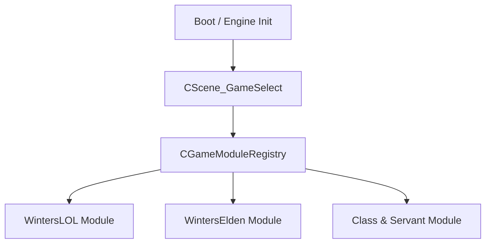
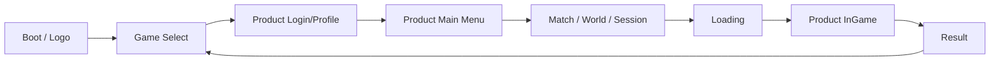
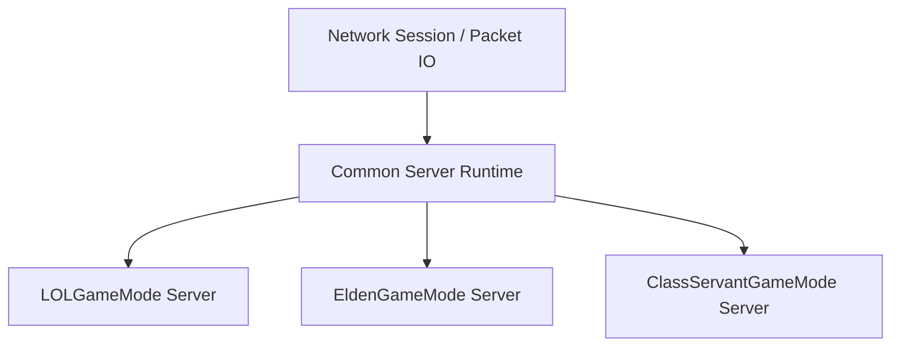

# Winters Engine — Multi-Game Architecture (Unified)

**STATUS**: ✅ **권위 통합 문서** (2026-05-04)
**통합 대상** (둘 다 deprecated):
- [`2026-05-04_GAME_SELECT_MULTI_GAME_PRODUCT_ARCHITECTURE.md`](../plan/engine/2026-05-04_GAME_SELECT_MULTI_GAME_PRODUCT_ARCHITECTURE.md) (Codex, 641 lines) — 코드베이스 실측 + IGameModule/GameLaunchConfig/eGameProduct 추상화 + product_id 축 + Compass
- [`WINTERS_MULTIGAME_VISION_v1.md`](WINTERS_MULTIGAME_VISION_v1.md) (rev 2, 본 통합본 베이스) — Phase 시간표 + Class & Servant 디자인 후보 + Engine 공유 매트릭스 + PITFALLS GATE
**선행**: NEXTGEN_FRAMEWORK_MASTER (rev 2) — ECS v2 / Fiber / Render Graph / GPU Driven 인프라
**관련 갱신**: CLAUDE.md L7-8 (단일 EXE 비전 정정 완료)
**용어**: **Class & Servant** (Servant = 시종/소환수, LoL 챔프 + Elden 소환수 결합 컨셉)

---

## §0. One-Line Direction

Winters Engine 은 하나의 엔진과 하나의 공통 클라이언트에서 `WintersLOL`, `WintersElden`, `Class & Servant` 를 선택 실행하는 **멀티 게임 플랫폼**으로 성장하고, LoL 과 Elden Ring 은 최종 제품 `Class & Servant` 를 만들기 위한 **양쪽 검증장**으로 운용한다.

핵심: **Game Select Scene 은 단순 메뉴가 아니라 `GameProductModule` 선택 지점**.

---

## §1. Current Codebase Reading

### 1.1 현재 시작 플로우

현재 클라이언트는 공통 부트 후 바로 LoL 플로우로 진입한다.

- [`Client/Private/CGameApp.cpp`](../../Client/Private/CGameApp.cpp:33)
  - `OnInit()` 에서 `CStructure_Manager`, `CJungle_Manager`, `CMinion_Manager` 초기화
  - 이후 `CScene_Loading::Create(eSceneID::BanPick, [](){ return CScene_BanPick::Create(); })` 로 BanPick 직행

→ 지금은 **`WintersLOL.exe` 에 가까운 형태**, 멀티 게임 클라이언트 구조 X.

### 1.2 현재 Scene 시스템

- [`Engine/Include/IScene.h`](../../Engine/Include/IScene.h) — `OnEnter / OnExit / OnUpdate / OnLateUpdate / OnRender / OnImGui` 보유
- [`Engine/Public/Scene/Scene_Manager.h`](../../Engine/Public/Scene/Scene_Manager.h) — `Change_Scene(uint32_t, unique_ptr<IScene>)` 지원
- [`Client/Public/Defines.h`](../../Client/Public/Defines.h:16) — `eSceneID` = `MainMenu/BanPick/Shop/MatchLoading/InGame/Editor/Result/SceneLoading/End` 9개. **`GameSelect` 미존재**.
- `Client/Private/Scene/Scene_Loading.cpp` — 다음 씬 factory 받아 로딩 후 `Change_Scene` 구조 — Game Select 도입 시 재사용 가능.

→ **결론**: Scene Manager 는 충분히 재사용. 문제는 Scene ID 와 시작 플로우가 LoL 전용으로 굳어진 것.

### 1.3 현재 Backend / Server 구조

- `Services/cmd` — auth / leaderboard / matchmaking / payment / profile / shop (6 service)
- `Services/internal` — service 별 도메인 로직
- `Services/pkg` — auth / cache / config / database / errors / messaging / middleware / response
- `Server/Private` — Game / Network / Security

→ **결론**: Backend / Server / Security 는 새로 갈아엎기보다 **`product_id` 축으로 확장**.

---

## §2. Product Vision

### 2.1 세 제품 축

| Product | 목적 | 성격 |
|---|---|---|
| `WintersLOL` | MOBA 시스템 실전 검증 | 챔피언 / 라인전 / 미니언 / 포탑 / 정글 / 매칭 / 상점 |
| `WintersElden` | 액션 RPG 시스템 실전 검증 | 락온 / 보스전 / 스태미나 / 회피 / 패링 / 월드/던전 / 협동/침입 |
| **`Class & Servant`** | **최종 출시 목표** | MOBA 전략성 + 소울라이크 액션성 + 서번트/클래스 조합 |

`WintersLOL` 과 `WintersElden` 은 서로 다른 모작이 아니라 **최종 제품의 양쪽 실험실**.

### 2.2 최종 게임: Class & Servant

`Class & Servant` 는 다음을 결합한다.

- **LoL 의 장점**: 5v5 팀 전략 / 라인·정글·오브젝트 운영 / 챔피언별 스킬 정체성 / 짧은 입력 + 높은 판독성 / 매치 기반 경쟁
- **Elden Ring 의 장점**: 정밀 근접 액션 / 보스전·패턴 학습 / 회피·패링·스태미나·경직 / 장비·빌드 커스터마이징 / 월드 탐험·던전 감각
- **Winters 고유 목표**:
  - 플레이어 = `Class`, 동반/소환/전술 AI = `Servant`
  - 전장은 MOBA처럼 운영, 교전은 소울라이크처럼 깊다
  - 서버 권위 + 고성능 ECS/Fiber/RenderGraph/GPU Driven 기반 대규모 PvPvE

### 2.3 Class & Servant 디자인 후보 3종 (잠정 — Phase C 진입 시 확정)

| # | 컨셉 | 핵심 |
|---|---|---|
| **A. 오픈월드 PvP MOBA** | Elden 거대 맵 + LoL 5v5 영지 전쟁 | 영지/요새/보스 점령. LoL 챔프 = Class. 보스 = Servant |
| **B. 액션 MOBA** | LoL 5v5 + Elden 회피·락온·콤보 | 컨트롤 진입 장벽 ↑, 숙련도 의미 ↑. 챔프 + 회피/패링 |
| **C. 신규 장르 (Class & Servant)** | Class (LoL 챔프 풀) + Servant (Elden 소환수) | PvE/PvP 하이브리드 — 보스 사냥 + 영지 PvP. **현 가설** |

선택 기준: Engine 검증 (Phase A+B) 후 사용자 / 시장 / 기술 검토 → 별도 비전 문서 (`.md/design/CLASS_SERVANT_DESIGN.md`).

---

## §3. Game Select Scene 의 역할

Game Select 는 단순 버튼 3개짜리 메뉴가 아니다. **GameProductModule 선택 지점**.



### Game Select 가 선택해야 하는 7 가지

1. 어떤 콘텐츠 루트를 쓸 것인가 (`Data/LoL/` vs `Data/Elden/` vs `Data/ClassServant/`)
2. 어떤 Scene Flow 를 쓸 것인가 (BanPick → InGame vs CharacterCreate → OpenWorld 등)
3. 어떤 Client 게임 시스템을 등록할 것인가 (Minion/Jungle/Structure vs Boss/Bonfire/Lockon 등)
4. 어떤 Backend namespace 를 쓸 것인가 (`/v1/lol/` vs `/v1/elden/`)
5. 어떤 Game Server target 에 접속할 것인가 (LoLGameMode 서버 vs EldenGameMode 서버)
6. 어떤 Security validator set 을 쓸 것인가 (cooldown/range vs stamina/iframe)
7. 어떤 에디터/튜닝 패널을 노출할 것인가

---

## §4. Core Abstractions

### 4.1 eGameProduct (신규 enum, Engine 공통)

**파일**: `Engine/Include/GameProduct.h` (신규 — Client/Server/Services/AntiCheat 공유)

```cpp
#pragma once
#include "WintersTypes.h"

enum class eGameProduct : u32_t
{
    None         = 0,
    WintersLOL,
    WintersElden,
    ClassServant,
};
```

### 4.2 GameLaunchConfig (Game Select 결과)

**파일**: `Client/Public/GameModule/GameLaunchConfig.h` (신규)

```cpp
#pragma once
#include "GameProduct.h"
#include <string>

struct GameLaunchConfig
{
    eGameProduct  eProduct = eGameProduct::None;
    std::wstring  strContentRoot;       // "Data/LoL/", "Data/Elden/"
    std::wstring  strServiceNamespace;  // "/v1/lol/", "/v1/elden/"
    std::wstring  strServerEndpoint;    // 게임 서버 IP:Port
    bool_t        bUseOnlineServices = false;
    bool_t        bUseEditorTools    = true;
};
```

초기에는 Client 내부 static config 로 시작 → 이후 런처/로그인/환경설정에서 내려받도록 확장.

### 4.3 IGameModule (게임 = 모듈 추상화)

**파일**: `Client/Public/GameModule/IGameModule.h` (신규)

```cpp
#pragma once
#include "GameProduct.h"
#include "GameLaunchConfig.h"
#include "IScene.h"
#include <memory>

class IGameModule
{
public:
    virtual ~IGameModule() = default;

    virtual eGameProduct GetProductID() const = 0;
    virtual const char*  GetDisplayName() const = 0;

    virtual bool_t       InitializeClient(const GameLaunchConfig& cfg) = 0;
    virtual void         ShutdownClient() = 0;

    virtual std::unique_ptr<IScene> CreateInitialScene() = 0;
    virtual std::unique_ptr<IScene> CreateMainMenuScene() = 0;
    virtual std::unique_ptr<IScene> CreateInGameScene() = 0;
};
```

**초기 구현**: 동일 EXE 안의 C++ class registry. DLL 분리는 추후 선택.

**구현 모듈**:
- `LOLGameModule` — `Client/Private/GameModule/LOL/LOLGameModule.cpp`
- `EldenGameModule` — `Client/Private/GameModule/Elden/EldenGameModule.cpp`
- `ClassServantGameModule` — `Client/Private/GameModule/ClassServant/` (placeholder)

---

## §5. Scene Flow

### 5.1 공통 플로우



처음 구현에서는 `Logo` 와 `Login` 생략, `GameSelect → Loading → ProductInitialScene` 가능.

### 5.2 WintersLOL Flow

```text
GameSelect
  → LOL MainMenu
  → Shop / Profile / Matchmaking
  → BanPick
  → MatchLoading
  → LOL InGame
  → Result
  → GameSelect
```

현재 코드의 `BanPick`, `MatchLoading`, `InGame` 은 이 플로우 아래로.

### 5.3 WintersElden Flow

```text
GameSelect
  → Elden MainMenu
  → CharacterSelect / ClassSelect
  → WorldSelect / CoopSession / InvasionQueue
  → Loading
  → Elden InGame
  → Bonfire / Death / BossResult
  → GameSelect
```

Elden 은 LoL 의 `BanPick` 재사용 X. **별도 씬**.

### 5.4 Class & Servant Flow

```text
GameSelect
  → ClassServant MainMenu
  → ClassSelect + ServantBinding
  → TeamFormation / DungeonContract / BattlefieldQueue
  → Loading
  → Hybrid InGame
  → Result / Reward / ServantGrowth
  → GameSelect
```

최종 목표 제품 플로우.

---

## §6. Directory Direction (2 단계 진화)

### 6.1 Stage 1 — 당장 적용 (저장소 흔들기 최소)

```text
Client/
  Public/
    GameModule/                    ★ 신규
      GameProduct.h
      GameLaunchConfig.h
      IGameModule.h
      GameModuleRegistry.h
    Scene/
      Scene_GameSelect.h           ★ 신규
  Private/
    GameModule/                    ★ 신규
      LOL/
        LOLGameModule.cpp
      Elden/
        EldenGameModule.cpp
      ClassServant/
        ClassServantGameModule.cpp
    Scene/
      Scene_GameSelect.cpp         ★ 신규
```

**중요**: 현재 LoL 코드 (Scene_BanPick / Scene_InGame / GameObject/Champion 등) **이동 X**. `LOLGameModule` 이 기존 `BanPick → InGame` 플로우를 wrap 만.

### 6.2 Stage 2 — 중기 (게임별 코드 거대화 시)

```text
Games/
  WintersLOL/
    Client/                  (LoL Scene + GameObject)
    Server/                  (LOLGameMode)
    Data/                    (맵 / 챔프 / 미니언)
  WintersElden/
    Client/
    Server/                  (EldenGameMode)
    Data/
  ClassServant/
    Client/
    Server/                  (ClassServantGameMode)
    Data/

Engine/                      공유 인프라 (ECS v2 / Fiber / RG / GPU Driven)
Shared/                      공통 데이터 스키마
Services/                    Backend Go service (product_id 축)
AntiCheat/                   커널 + 게임별 Validator
Tools/
Client/                      ← Stage 2 에서는 공통 런처/부트스트랩 (Game Select + Login 만)
```

이때 `Client/` 는 공통 런처 / 부트스트랩이 되고, 실제 게임 코드는 `Games/*` 로 이동.

---

## §7. Backend / Server / Security Architecture

### 7.1 Backend (공통 service + product_id 축)

공통 service 유지하되 모든 핵심 데이터에 `product_id` 축 추가.

| Service | 공통 | Product 별 확장 |
|---|---|---|
| Auth | 계정/토큰 | 제품 권한 / 접근 가능 여부 |
| Profile | 계정 프로필 | LOL 전적 / Elden 캐릭터 / ClassServant 성장 |
| Shop | 구매/상품 | 스킨 / 장비 / 서번트 / 배틀패스 |
| Payment | 결제 | 제품별 카탈로그 |
| Matchmaking | 큐 | 5v5 MOBA / Co-op 던전 / PvPvE 전장 |
| Leaderboard | 랭킹 | 티어 / 보스 타임어택 / 시즌 랭킹 |

**초기 구현**: URL prefix 분리.

```text
/v1/lol/...
/v1/elden/...
/v1/class-servant/...
```

DB 에는 최종적으로 `product_id` 컬럼.

### 7.2 Game Server (공통 Runtime + GameMode 분리)

Server 는 `GameRoom` 하나로 모든 게임 처리 X. 공통 네트워크/세션 위에 제품별 GameMode.



| Server Module | 책임 |
|---|---|
| `LOLGameMode` | 5v5 GameRoom / 라인·정글·포탑·미니언 / 스킬·투사체 검증 |
| `EldenGameMode` | 세션·월드 샤드 / 보스 AI 권위 / 스태미나·회피·패링·피격 검증 |
| `ClassServantGameMode` | PvPvE 전장 / 서번트 AI 권위 / 보스+라인+오브젝트 통합 |

**Multi-World**: 같은 Server process 안에 N 개 GameRoom (LoL 60 + Elden 멀티 던전 4 + ClassServant 매치 N) 동시. ECS v2 의 worldId + GameMode 분리.

```cpp
class IServerGameMode
{
public:
    virtual ~IServerGameMode() = default;
    virtual eGameProduct GetProductID() const = 0;
    virtual void Tick(f32_t fDeltaTime) = 0;
    virtual void HandlePacket(SessionID tSession, const PacketView& tPacket) = 0;
};
```

초기에는 기존 LoL GameRoom 을 `LOLGameMode` 가 감싸는 형태.

### 7.3 Security (공통 AntiCheat Core + 제품별 Validator Set)

| Product | Validator |
|---|---|
| LOL | cooldown / range / target / damage / fog-of-war / projectile / movement |
| Elden | stamina / invulnerability frame / hitbox timeline / boss phase / animation lock / movement |
| ClassServant | servant command / summon ownership / hybrid skill collision / objective economy / PvPvE authority |

**원칙**: 보안도 게임 규칙을 알아야 하므로 공통 엔진 보안만으로는 부족.

**구현**: `AntiCheat/Profiles/{lol,elden,classservant}_profile.json` (커널 드라이버 1개 공유 + 유저모드 룰 게임별).

---

## §8. Engine 공유 vs 게임별 매트릭스

| 항목 | 공유 (Engine) | 게임별 (Module) |
|---|---|---|
| ECS v2 | ✅ | — |
| Fiber JobSystem v2 | ✅ | — |
| Render Graph | ✅ | 게임별 Pass 라이브러리 (LoL 시야/타워 / Elden 보스 부위 파괴 / CS 미정) |
| GPU Driven | ✅ | 게임별 InstanceData 빌드 시스템 |
| RHI / RHIHandles | ✅ | — |
| Audio (FMOD) | ✅ | 게임별 사운드 뱅크 |
| Input | ✅ | 게임별 키바인딩 (LoL QWER 클릭 / Elden 락온+회피 / CS 미정) |
| Network UDP/KCP | ✅ (Sim-10 v2) | 게임별 패킷 스키마 (LoL ChampionSnapshot / Elden WorldChunkDelta) |
| Asset 변환 (.wmesh / .wanim) | ✅ | — |
| **Champion / Boss / Class** | ❌ | 게임별 |
| **Map / World / Dungeon** | ❌ | 게임별 |
| **AI (BT / GOAP / MCTS)** | ✅ 인프라 | 게임별 BT 빌더 |
| **Backend Service** | ✅ (공통 + product_id) | DB 레코드만 게임별 |
| **AntiCheat 룰** | ✅ 인프라 | 게임별 프로파일 |

**원칙**: **인프라/시스템 = Engine 공유**, **콘텐츠/도메인 로직 = 게임별 분리**.

---

## §9. Codebase Refactor Plan (GS-0 ~ GS-7)

### GS-0. Plan Freeze

- 본 통합 문서 기준으로 Game Select 방향 확정.
- `Class & Servant` 명칭 확정 전까지 코드명은 `ClassServant`.

### GS-1. Minimal Game Select Scene

**변경 파일**:
- `Client/Public/Defines.h` — `eSceneID::GameSelect` 추가
- `Client/Public/Scene/Scene_GameSelect.h` (신규)
- `Client/Private/Scene/Scene_GameSelect.cpp` (신규)
- `Client/Private/CGameApp.cpp` — 시작 플로우를 `Loading → BanPick` 에서 `GameSelect` 로 변경

**초기 UI 4 버튼**: `Winters League` / `Winters Elden` / `Class & Servant` / `Editor`.

**선택 시**:
- LOL → 기존 `Scene_Loading → BanPick`
- Elden → 임시 placeholder scene 또는 MainMenu
- ClassServant → 임시 placeholder scene 또는 MainMenu
- Editor → 기존 `Scene_Editor`

### GS-2. Product Config

**신규**:
- `Client/Public/GameModule/GameProduct.h`
- `Client/Public/GameModule/GameLaunchConfig.h`

Game Select 가 직접 `Change_Scene(BanPick)` 하지 않고 `GameLaunchConfig` 만든 뒤 module registry 에 넘김.

### GS-3. LOLGameModule Wrapper

현재 `CGameApp::OnInit()` 의 LoL 전용 초기화를 모듈로 이동:
- Structure Manager 초기화
- Jungle Manager 초기화
- Minion Manager 초기화
- Champion legacy registration
- `RegisterAllLegacy()`

→ Elden 선택 시 미니언/정글/챔피언 테이블 불필요하게 안 올라옴.

### GS-4. Elden Placeholder Module

콘텐츠 없어도 모듈 먼저 생성:
- Elden MainMenu placeholder
- Elden InGame placeholder
- 카메라/캐릭터/보스전 시스템 예정 슬롯

**중요**: Elden 을 LoL `Scene_InGame` 의 if 분기로 만들지 않는다.

### GS-5. Backend Product Namespace

**초기**:
- route prefix
- request 에 `product_id`
- profile/shop/matchmaking 응답에 product field

**중기**:
- DB schema 에 `product_id`
- product-specific matchmaking queue
- product-specific inventory/profile

### GS-6. Server GameMode Split

Server 에 제품별 GameMode 인터페이스. 초기에는 기존 LoL GameRoom 을 `LOLGameMode` 가 감싸는 형태.

### GS-7. Class & Servant Prototype

최종 제품용 시스템을 별도 모듈로 시작.

**첫 프로토타입**:
- 1 player class
- 1 servant AI
- 1 boss
- 1 lane/objective
- 1 PvE wave
- 1 PvP duel zone

목표: LoL 과 Elden 코드가 합쳐지는 게 아니라, 두 실험실에서 검증된 공통 엔진 시스템을 조합해 새 게임 모듈 생성.

---

## §10. Critical Rules

### 10.1 Engine 은 게임을 몰라야 한다

Engine 은 `LOL`, `Elden`, `ClassServant` 를 include 하지 않는다.

**Engine 이 제공할 것**: Scene Manager / ECS / JobSystem·Fiber / RHI·RenderGraph·GPU Driven / Resource·Asset / Physics / AI Framework / Network primitives / Audio / Profiler·Editor hooks.

**게임 모듈이 가질 것**: 챔피언·클래스·서번트 정의 / 스킬·아이템·상태이상 / 서버 룰 / 보안 검증 룰 / 씬 플로우 / 데이터 루트.

### 10.2 Game Select 는 if 지옥이 되면 안 된다

**금지**:
```cpp
if (product == LOL) { ... }
else if (product == Elden) { ... }
else if (product == ClassServant) { ... }
```

**허용**:
```cpp
IGameModule* pModule = CGameModuleRegistry::Get()->Find(eProduct);
pModule->InitializeClient(config);
CGameInstance::Get()->Change_Scene(sceneId, pModule->CreateInitialScene());
```

### 10.3 Scene_InGame 을 만능 씬으로 만들지 않는다

현재 [`Scene_InGame.cpp`](../../Client/Private/Scene/Scene_InGame.cpp) 는 LoL 프로토타입의 중심. Elden / ClassServant 까지 여기에 넣으면 유지보수 불가능.

**방향**:
- `CScene_LOLInGame`
- `CScene_EldenInGame`
- `CScene_ClassServantInGame`

단, 파일명 리네임은 나중에. 당장은 기존 `CScene_InGame` 을 LOL 전용으로 간주.

### 10.4 Manager 초기화는 Product Module 로 이동

`CGameApp` 은 엔진/공통 앱만 초기화.

| Product | 전용 매니저 |
|---|---|
| LoL | Minion / Jungle / Structure / Champion registry / Skill tables |
| Elden | Boss / Weapon·armor / Bonfire·world / Lock-on·action combat |
| ClassServant | Class / Servant / Contract·match·battlefield |

---

## §11. Phase 시간표

| Phase | 기간 | 내용 | 검증 |
|---|---|---|---|
| **A** | 2026-05~06 | WintersLOL 완성 — ECS v2 + Fiber + RG + GPU Driven 인프라 + LoL 챔프 16 + 5v5 + 시야/타워/AI/봇 + Server 권위 (Sim-10 v2 UDP) + Backend 8 service + AntiCheat | 5v5 매치 종료까지 안정적 |
| **B** | 2026-07~08 | WintersElden 진입 — Game Select Scene 신설 + Elden 분기 (TitleScreen / OpenWorld) + 보스 시스템 (B-12 메쉬 분리 / MeshDestructible / EquipmentSlot) + 오픈월드 청크 스트리밍 + Elden Backend (캐릭터 저장 / 블러드스테인) | 보스 1체 + 오픈월드 1 청크 안정적 |
| **C** | 2026-09~ | Class & Servant 디자인 + 출시 — `.md/design/CLASS_SERVANT_DESIGN.md` 박제 + 디자인 후보 3종 (§2.3) 중 선택 + 프로토타입 (GS-7) + Steam Early Access | Steam EA 출시 |

---

## §12. Recommended Next Step (가장 작은 안전한 첫 작업)

```
1. Defines.h L16 에 eSceneID::GameSelect 추가
2. CScene_GameSelect 박제 (Client/Public/Scene/)
3. Client/Public/GameModule/ 코어 추상화 박제 (eGameProduct + GameLaunchConfig + IGameModule)
4. LOLGameModule 박제 — 기존 Loading → BanPick 플로우 wrap
5. CGameApp::OnInit() 의 시작 씬을 BanPick → GameSelect 변경
6. Elden / ClassServant placeholder GameModule 박제
7. 빌드 + LoL 기존 동작 회귀 검증
```

이 단계는 게임 구조를 거의 건드리지 않으면서도 Winters Engine 의 방향성을 바꾼다.

그 다음에 `GameModuleRegistry` 를 붙이면 된다.

---

## §13. Compass for Future AI Work

대형 코드베이스에서 AI 에게 필요한 것은 **백과사전이 아니라 나침반**.

```text
Game Select 작업?
  → Client/Scene/Common
  → Client/GameModule
  → Product scene flow only

LOL 챔피언 작업?
  → Games/WintersLOL or Client/GameObject/Champion
  → LOLGameModule
  → LOL Server validators

Elden 보스 작업?
  → Games/WintersElden
  → EldenGameMode
  → ActionCombat / BossAI / HitboxTimeline

Class & Servant 작업?
  → Games/ClassServant
  → Class registry
  → Servant AI
  → Hybrid PvPvE GameMode

엔진 성능 작업?
  → Engine/ECS
  → Engine/JobSystem
  → Engine/Renderer/RHI
```

AI 가 모든 파일을 전수 탐색하지 않고도 **"어느 제품의 어느 계층을 만지는지" 먼저 판단** 하게 만드는 것이 목표.

---

## §14. PITFALLS GATE 통과

| GATE | 검증 |
|---|---|
| A 사실 수집 | §1 Codebase Reading — Defines.h L16 / CGameApp.cpp L33 / Scene_Loading 인용 |
| B TODO 0 | "미래" / "Phase C 진입 시 확정" 명시 — 현재 진입 항목 (GS-0~GS-2) TBD 0 |
| C 호출 경로 | CGameApp::OnInit / Scene_BanPick → 모두 LOLGameModule wrap (Stage 1) |
| D ECS 책임 | 각 게임 GameMode 별 CECSWorld (ECS v2 multi-world) |
| E 향후 자료형 | eGameProduct = u32_t (4G 게임 충분 — 실제 3개), eSceneID = int (충분) |
| F Scheduler | 게임별 ECS 시스템 등록 차이 — Engine Scheduler 가 GameModule 통해 등록 |
| G Owner Scope | Engine 공유, Game-specific = `Client/Public/GameModule/{LOL,Elden,CS}/` 분리 |
| H 인용 의미 + 행동 보존 | Phase A 의 모든 기존 Scene 동작 유지. Game Select 만 추가 |

---

## §15. CLAUDE.md / AGENTS.md 갱신 사항

### CLAUDE.md L7-8 정정 (완료 — 본 문서로 대체)
```diff
-WintersEngine.dll
-├── WintersLOL.exe      ← 첫 타겟
-└── WintersElden.exe    ← 두 번째 타겟
+WintersEngine.dll
+└── WintersGame.exe     ← 단일 클라
+    └── Scene_GameSelect → LoL / Elden / Class & Servant 분기
```

### CLAUDE.md L423-424 정정 (디렉토리)
- v1: `WintersLOL/Client/(MOBA EXE) Server/(IOCP) Data/` 별도 EXE
- 본 통합본: Stage 1 = `Client/Public/GameModule/{LOL,Elden,CS}/` 안에 분리, Stage 2 = `Games/WintersLOL/{Client,Server,Data}/` 통째 분리.

### 신규 §"Multi-Game Architecture" 카테고리 추가
- 비전: Class & Servant 최종 출시
- IGameModule 추상화
- Game Select Scene
- 게임별 GameMode / product_id 축 / Validator Set

---

## §16. Final Architecture Sentence

> **Winters Engine 은 하나의 엔진과 하나의 공통 클라이언트에서 `WintersLOL`, `WintersElden`, `Class & Servant` 를 선택 실행하는 멀티 게임 플랫폼으로 성장하고, LoL 과 Elden 은 최종 제품 `Class & Servant` 를 만들기 위한 양쪽 검증장으로 운용한다.**

---

**END OF UNIFIED MULTI-GAME ARCHITECTURE**
