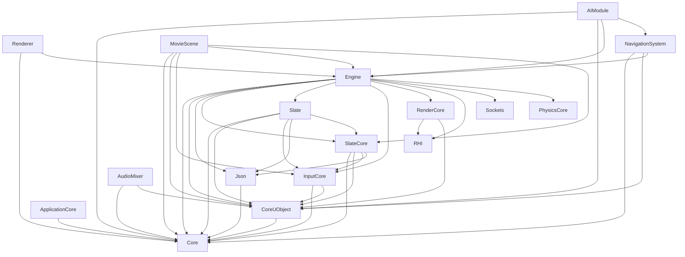

# UE5.7 Core Module Dependency Graph

**Source**: `C:/Program Files/Epic Games/UE_5.7/Engine/Source/Runtime/<module>/<module>.Build.cs`
**Date**: 2026-05-03
**Modules analyzed**: 17 / 18

**Not found**: Niagara

## 의존성 행렬

| 모듈 | Public Deps (필수) | Private Deps (구현) | Private Inc (헤더만) |
|---|---|---|---|
| **Core** | — | — | DerivedDataCache, TargetPlatform, Json, RSA |
| **CoreUObject** | Core, TraceLog, CorePreciseFP | AutoRTFM, Projects, Json | TargetPlatform |
| **Engine** | Core, CoreOnline, CoreUObject, FieldNotification, NetCore, ImageCore, Json, JsonUtilities ... | EditorAnalyticsSession, AnimationCore, AutoRTFM, AppFramework, BuildSettings, Networking, Landscape, UMG ... | DerivedDataCache, DesktopPlatform, DistributedBuildInterface, TargetPlatform, ImageWrapper ... |
| **RHI** | — | — | ProfileVisualizer |
| **RenderCore** | RHI, CoreUObject | Core, Projects, ApplicationCore, TraceLog, CookOnTheFly | Shaders, TargetPlatform |
| **Renderer** | Core, Engine | TargetPlatform, GeometryCore, NaniteUtilities, CoreUObject, ApplicationCore, RenderCore, ImageWriteQueue, RHI ... | HeadMountedDisplay, EyeTracker |
| **Slate** | Core, CoreUObject, InputCore, Json, SlateCore, ImageWrapper | TraceLog | — |
| **SlateCore** | Core, CoreUObject, DeveloperSettings, InputCore, Json, TraceLog | — | — |
| **InputCore** | Core, CoreUObject | — | — |
| **ApplicationCore** | Core | — | InputDevice, Analytics, SynthBenchmark, Launch, Media ... |
| **AIModule** | Core, CoreUObject, Engine, GameplayTags, GameplayTasks, NavigationSystem | AutoRTFM, RHI, RenderCore | — |
| **NavigationSystem** | Chaos, Core, CoreUObject, Engine, GeometryCollectionEngine | RHI, RenderCore | DerivedDataCache, TargetPlatform |
| **MovieScene** | Core, CoreUObject, InputCore, Engine, SlateCore, TimeManagement, UniversalObjectLocator | AutoRTFM | AutoRTFM, MovieSceneTracks, TargetPlatform, UniversalObjectLocator |
| **AudioMixer** | Core, CoreUObject, AudioLinkEngine | Engine, NonRealtimeAudioRenderer, AudioMixerCore, SignalProcessing, AudioPlatformConfiguration, SoundFieldRendering, AudioExtensions, AudioLinkCore ... | — |
| **PhysicsCore** | DeveloperSettings | Core, CoreUObject | — |
| **Json** | Core, RapidJSON | — | — |
| **Sockets** | — | Core, NetCommon | — |

## 의존받음 (Depended-By) — 핵심 모듈 기준

| 핵심 모듈 | 누가 의존 (분석 대상 12 안에서) | 외부 (전체 Runtime) |
|---|---|---|
| Core | AIModule, ApplicationCore, AudioMixer, CoreUObject, Engine, InputCore, Json, MovieScene, NavigationSystem, PhysicsCore, RenderCore, Renderer, Slate, SlateCore, Sockets | (전수 검증은 별도) |
| CoreUObject | AIModule, AudioMixer, Engine, InputCore, MovieScene, NavigationSystem, PhysicsCore, RenderCore, Renderer, Slate, SlateCore | (전수 검증은 별도) |
| Engine | AIModule, AudioMixer, MovieScene, NavigationSystem, Renderer | (전수 검증은 별도) |
| RHI | AIModule, Engine, NavigationSystem, RenderCore, Renderer | (전수 검증은 별도) |
| RenderCore | AIModule, Engine, NavigationSystem, Renderer | (전수 검증은 별도) |
| Renderer | — | (전수 검증은 별도) |
| Slate | Engine | (전수 검증은 별도) |
| SlateCore | Engine, MovieScene, Slate | (전수 검증은 별도) |
| InputCore | Engine, MovieScene, Slate, SlateCore | (전수 검증은 별도) |
| ApplicationCore | RenderCore, Renderer | (전수 검증은 별도) |
| AIModule | — | (전수 검증은 별도) |
| NavigationSystem | AIModule | (전수 검증은 별도) |
| MovieScene | — | (전수 검증은 별도) |
| AudioMixer | Engine | (전수 검증은 별도) |
| PhysicsCore | Engine | (전수 검증은 별도) |
| Json | CoreUObject, Engine, Slate, SlateCore | (전수 검증은 별도) |
| Sockets | Engine | (전수 검증은 별도) |

## Mermaid 의존성 시각화 (Public 만)

## 통계

| 모듈 | Public 수 | Private 수 | Build.cs 크기 (bytes) |
|---|---|---|---|
| AIModule | 6 | 3 | 1831 |
| ApplicationCore | 1 | 0 | 3266 |
| AudioMixer | 3 | 10 | 1170 |
| Core | 0 | 0 | 12011 |
| CoreUObject | 3 | 3 | 1516 |
| Engine | 39 | 33 | 12286 |
| InputCore | 2 | 0 | 575 |
| Json | 2 | 0 | 379 |
| MovieScene | 7 | 1 | 715 |
| NavigationSystem | 5 | 2 | 2539 |
| PhysicsCore | 1 | 2 | 683 |
| RHI | 0 | 0 | 2240 |
| RenderCore | 2 | 5 | 2301 |
| Renderer | 2 | 11 | 1571 |
| Slate | 6 | 1 | 2026 |
| SlateCore | 6 | 0 | 1349 |
| Sockets | 0 | 2 | 449 |

## Winters 청사진 시사점

### 1. Core 의 위치

UE5 Core 는 의존 0 — 모든 모듈의 base. Winters 의 `Engine/Public/Core/` 와 동일 역할.

### 2. CoreUObject 의 의미

UE5 의 CoreUObject = RTTI / 리플렉션 / GC 시스템. Winters 는 **이 레이어 미존재** — UObject 같은 reflection 시스템 없음.

→ Phase 4 (Beyond 100) 에서 Winters 도 ReflectionCore 같은 모듈 도입 검토. Lua 바인딩 / 에디터 / 직렬화 모두 base 됨.

### 3. Engine 모듈의 거대함

UE5 Engine 모듈 = 다른 모든 모듈의 의존을 받는 hub. Winters 의 분산 ECS 구조와 다름.
Winters 는 `Framework` + `Scene` + `ECS World` 가 분산해서 그 역할.

### 4. RHI → RenderCore → Renderer 3단계

UE5 의 렌더링 layer 분리:
- **RHI**: Render Hardware Interface (D3D11/12/Vulkan/Metal 추상)
- **RenderCore**: 공통 렌더링 primitives (셰이더 / 버퍼 관리)
- **Renderer**: 실제 렌더 패스 (Forward/Deferred/PBR)

Winters 는 현재 RHI + Renderer 만 — **RenderCore layer 도입** 권장 (셰이더 매니저 / 버퍼 캐시 분리).

### 5. 의존성 의 의미 — Public vs Private

- **PublicDependency** = 헤더 노출 (이 모듈을 의존하는 다른 모듈도 dep 의 헤더 사용 가능)
- **PrivateDependency** = 구현만 사용 (.cpp 안에서만)
- **PrivateIncludePathModuleNames** = 헤더는 보지만 link 는 안 함 (forward decl 패턴)

→ Winters 의 `_MODULE.md` 에 동일 3 분류 박제 권장.
