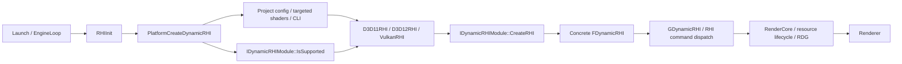
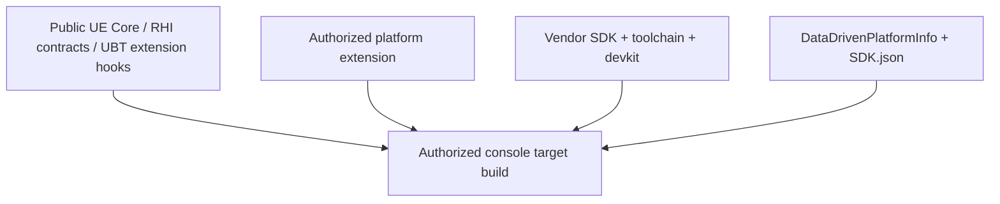
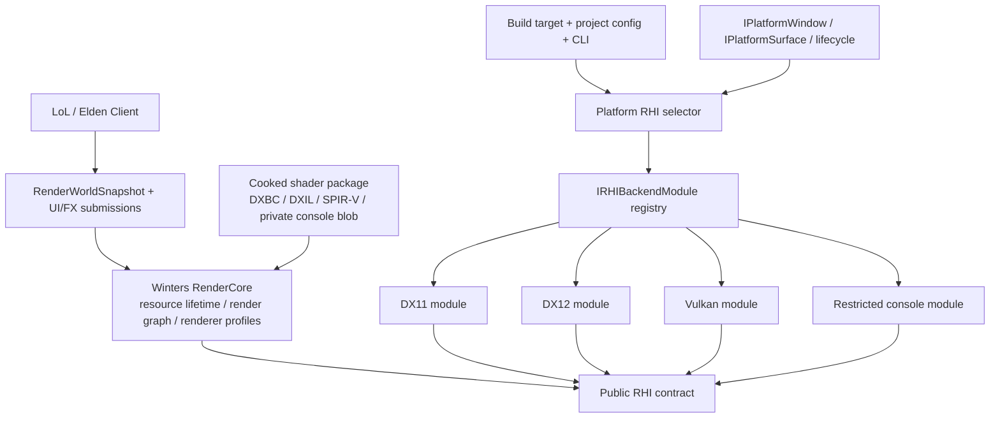

# Winters Unreal-style Multi-Backend RHI Architecture

Session - 바탕화면의 Unreal Engine 5.7.4 소스를 기준으로 Windows DX11/DX12, Vulkan, Android Mobile, Console Restricted 플랫폼 결합 구조를 감사하고 Winters Engine의 실제 멀티 백엔드 RHI 방향을 고정한다.

- 작성일: 2026-07-13
- 감사 대상 Unreal 소스: `C:/Users/user/Desktop/UnrealEngine/UnrealEngine`
- Unreal 버전: `Engine/Build/Build.version` 기준 5.7.4
- Winters 대상: `C:/Users/user/Desktop/Winters`
- 상태: 구조 감사 및 목표 아키텍처 확정. Vulkan/Mobile/Console 구현 완료 보고서가 아니다.
- 2026-07-15 동기화: UE의 Dynamic RHI 선택뿐 아니라 RDG의 선언 기반 배리어 유도까지 재확인하고, Winters의 실제 DX12 구현/스텁 경계와 Vulkan 선행 의존성을 다시 반영했다.
- 연계 문서:
  - `.md/architecture/WINTERS_CODEBASE_COMPASS.md`
  - `.md/plan/rhi/09_RHI_DX11_LEGACY_TO_DX12_VULKAN_MOBILE_CONSOLE_MASTER.md`
  - `.md/plan/rhi/sessions/S17_RHI_SCENE_RENDERER_CODEX_HANDOFF.md`
  - `.md/build/2026-06-23_S17_RHI_SCENE_RENDERER_SNAPSHOT_REPORT.md`
  - `.md/plan/2026-07-13_WINTERS_UNREAL_STYLE_MULTI_BACKEND_RHI_PLAN.md`
  - `.md/plan/2026-07-15_UNREAL_SYNCED_RHI_RENDER_GRAPH_DX12_VULKAN_PLAN.md`

## 0. 결론

Winters의 목표는 "DX11 코드를 인터페이스 뒤에 감춘다"에서 끝나면 안 된다. 다음 네 축을 분리해야 Unreal과 같은 확장성이 생긴다.

| 축 | 질문 | 예시 |
|---|---|---|
| RHI backend | GPU 명령을 어떤 API로 번역하는가? | DX11, DX12, Vulkan, 승인된 Console API |
| Feature level / shader platform | 어떤 셰이더와 기능 집합을 사용할 수 있는가? | DX11 SM5, DX12 SM6, Vulkan ES3.1, Vulkan SM5 |
| Renderer / render profile | 어떤 렌더링 알고리즘과 품질 예산을 사용하는가? | LoL Desktop, Mobile Forward, Mobile Deferred |
| Platform integration | 창·surface·lifecycle·입력·파일·패키징을 누가 담당하는가? | Win32, Android, Console private platform extension |

`Vulkan을 구현했다`와 `모바일 렌더러를 구현했다`는 같은 말이 아니다. `DX12 디바이스를 만들었다`와 `LoL이 DX12에서 정상 렌더된다`도 같은 말이 아니다.

최종 제품 정책은 다음으로 고정한다.

1. LoL의 정상 F5 제품 경로는 DX11을 기본 backend로 유지한다.
2. LoL의 renderer와 resource path는 backend-neutral RHI만 소비하도록 이관한다.
3. DX12와 Vulkan은 동일한 LoL render snapshot과 shader/material 계약을 실행해야 한다.
4. Android Vulkan은 같은 Vulkan core를 사용하되 별도 platform surface와 mobile render profile을 사용한다.
5. Console backend는 공개 저장소에 vendor API를 흉내 내지 않는다. 승인과 SDK가 확보된 뒤 Restricted platform extension으로만 결합한다.
6. 이식성의 증명은 enum의 존재가 아니라 동일 장면의 build, backend identity, RHI conformance, visual parity, lifecycle 검증으로 한다.

현재 Winters는 이 목표의 기반은 있으나 제품 전체가 RHI를 통과하는 상태는 아니다. DX11은 실제 제품 backend다. DX12는 device/swapchain/frame ring, buffer/texture upload, shader, PSO/root signature, descriptor-backed bind group, static scene draw까지 실제 구현되어 있지만 command-list `Dispatch`와 일반 resource transition이 아직 no-op이고 LoL 제품 parity는 미완료다. Vulkan, Metal, Xbox, PS5는 enum/capability/surface 자리만 있으며 실제 backend는 없다.

## 1. RHI의 본질

RHI는 모든 API를 가장 약한 공통분모로 평준화하는 래퍼가 아니다. 상위 renderer가 GPU 작업의 의도를 공통 언어로 표현하고, 각 backend가 이를 자신의 자원·동기화·제출 모델로 실현하는 경계다.

```text
Renderer intent
  "이 mesh/material을 이 pass에서 그린다"
        ↓
RHI contract
  buffer / texture / pipeline / bind group / command / barrier / submit
        ↓
Backend implementation
  DX11 immediate-context emulation
  DX12 command-list + descriptor + explicit-state implementation
  Vulkan command-buffer + descriptor-set + synchronization implementation
        ↓
Native GPU API
```

DX11은 상태를 즉시 바인딩하는 API이고 DX12/Vulkan은 command recording, resource state, descriptor lifetime, queue synchronization이 명시적인 API다. 따라서 공통 계약은 DX11 호출 모양을 복제하면 안 된다. 명시적 API의 수명과 동기화 모델을 기준으로 두고, DX11 backend가 필요한 부분을 no-op 또는 emulation으로 구현하는 편이 안전하다.

단, no-op은 "기능이 원래 불필요한 backend"에서만 허용한다. 미구현 함수를 기본 `nullptr` 또는 빈 handle로 조용히 반환하면 새로운 backend가 화면 일부를 누락해도 초기화 성공처럼 보인다. 필수 계약은 구현을 강제하고, 선택 기능은 capability와 명시적인 unsupported 결과로 나눠야 한다.

## 2. 로컬 Unreal 소스 감사 범위

바탕화면의 폴더는 단일 게임 `.uproject`가 아니라 Unreal Engine 전체 소스 checkout이다. 따라서 이번 감사가 증명하는 것은 UE 5.7.4 engine base의 backend 구성과 선택 구조다. 특정 게임 프로젝트가 `DefaultGraphicsRHI`나 targeted shader format을 어떻게 override했는지는 별도 `.uproject`/project config가 있어야 감사할 수 있다.

확인된 사실은 다음과 같다.

- `Engine/Source/Runtime/Windows/D3D11RHI`: 실제 D3D11 backend module
- `Engine/Source/Runtime/D3D12RHI`: 실제 D3D12 backend module
- `Engine/Source/Runtime/VulkanRHI`: Desktop/Android를 포함하는 실제 Vulkan backend module
- `Engine/Source/Runtime/Apple/MetalRHI`: Apple backend module
- `Engine/Source/Runtime/NullDrv`: 렌더 불가 프로세스용 Null RHI
- `Engine/Platforms`: 이 checkout에는 Android, IOS, VisionOS, Windows만 존재
- `Engine/Restricted`: 이 checkout에는 존재하지 않음
- UnrealEditor, Win64 RHI DLL, Android APK/intermediate도 이 checkout에는 없어 runtime 성공은 검증하지 않음

즉 "소스 구현이 있다"는 확인했지만 "이 PC에서 UE의 모든 backend를 빌드·실행했다"고 말해서는 안 된다.

## 3. Unreal의 RHI 설계 방식

### 3.1 전체 부팅 흐름



핵심 코드 경계는 다음과 같다.

- `Runtime/RHI/Public/DynamicRHI.h`
  - `FDynamicRHI`: 실제 runtime device/backend 인터페이스
  - `IDynamicRHIModule`: support probe와 backend factory
  - `PlatformCreateDynamicRHI()`: 플랫폼별 최종 선택 hook
- `Runtime/RHI/Private/DynamicRHI.cpp`
  - `GDynamicRHI` 소유
  - `RHIInit()`에서 platform selector 호출, backend init 및 context 검증
  - 종료 시 RHI thread flush, `Shutdown()`, backend 삭제
- `Runtime/RenderCore`
  - RHI 위에서 render resource의 init/release와 RDG 등 상위 렌더 수명을 관리

Unreal의 중요한 특징은 module과 device를 구분한다는 점이다.

```text
IDynamicRHIModule
  - 이 빌드에 module이 존재하는가?
  - 요청 feature level을 이 장치에서 지원하는가?
  - 지원한다면 concrete FDynamicRHI를 생성할 수 있는가?

FDynamicRHI
  - 생성된 device/context/queue/resource를 실제로 운용한다.
```

Winters도 이 두 역할을 `CEngineApp`의 switch 하나에 섞지 않아야 한다.

### 3.2 빌드 후보와 런타임 선택의 분리

Unreal은 다음 세 단계로 결정한다.

1. Build/Target가 포함 가능한 backend module 집합을 정한다.
2. Project config와 targeted shader formats가 사용할 수 있는 backend/shader artifact 집합을 정한다.
3. Runtime selector가 CLI, 사용자 선호, driver/adapter 지원 여부를 검사해 하나를 생성한다.

`Runtime/RHI/RHI.Build.cs`는 Windows 빌드에서 D3D11RHI, D3D12RHI, VulkanRHI를 동적 후보로 등록한다. 이것은 세 backend를 모두 동시에 실행한다는 뜻이 아니라, 최종 선택 가능한 module 집합에 넣는다는 뜻이다.

### 3.3 Windows DX11 / DX12 / Vulkan

`Runtime/RHI/Private/Windows/WindowsDynamicRHI.cpp`는 backend 이름을 `D3D11RHI`, `D3D12RHI`, `VulkanRHI` module에 매핑한다.

선택에 사용되는 대표 입력은 다음과 같다.

- `DefaultGraphicsRHI`
- `D3D11TargetedShaderFormats`
- `D3D12TargetedShaderFormats`
- `VulkanTargetedShaderFormats`
- CLI `-dx11`, `-dx12`, `-vulkan`
- backend module 존재 여부
- `IDynamicRHIModule::IsSupported(featureLevel)` 결과
- GPU adapter와 driver 조건

자동 선택과 명시적 강제는 다르게 취급한다. 자동 선택한 고급 backend가 실패하면 허용된 fallback을 시도할 수 있지만, 사용자가 `-dx12`처럼 강제한 backend가 실패하면 조용히 DX11로 바꾸지 않는 것이 진단 가능성과 신뢰성 면에서 낫다.

Winters의 `--rhi=dx12`도 같은 의미를 가져야 한다. 명시적으로 요청했는데 DX11로 fallback한 뒤 성공으로 기록하면 DX12 검증이 아니다.

### 3.4 D3D11RHI, D3D12RHI, VulkanRHI 내부

세 module은 모두 같은 `IDynamicRHIModule` factory 계약을 구현하고 서로 다른 `FDynamicRHI`를 만든다.

| backend | local module 위치 | 확인된 범위 |
|---|---|---|
| D3D11 | `Runtime/Windows/D3D11RHI` | adapter/device, viewport, resource, shader, command, state cache |
| D3D12 | `Runtime/D3D12RHI` | device/queue, command list, descriptor, barrier, residency, PSO, RT 계열 |
| Vulkan | `Runtime/VulkanRHI` | instance/device, queue, command buffer, descriptor, sync, pipeline, platform layer |

상위 `RenderCore`가 backend module 이름을 골라 생성하지 않는다. 선택 책임은 platform RHI bootstrap에 있고, renderer는 선택된 공통 RHI 계약을 소비한다.

다만 UE 5.7.4의 compile graph를 "backend가 RenderCore에 전혀 의존하지 않는다"고 설명하면 틀리다. D3D11/D3D12/Vulkan module은 private dependency로 RHICore/RenderCore를 일부 사용한다. 정확한 원칙은 다음이다.

> 상위 public 렌더 호출과 backend 선택 경계는 RHI abstraction으로 유지하며, Renderer/RenderCore가 D3D11RHI나 VulkanRHI concrete module을 직접 선택하거나 public API로 누출하지 않는다.

### 3.5 RDG에서 Winters가 가져올 최소 단위

`RenderCore/Public/RenderGraphBuilder.h`는 `AddPass`에 전달된 RDG parameter struct로부터 resource barrier와 lifetime을 유도하고, `Execute()`에서 graph compile, cull, execute를 수행한다고 명시한다. D3D12RHI는 transition을 command-list barrier batch에 모아 flush하고, VulkanRHI는 같은 상위 transition을 `VkDependencyInfo`와 `vkCmdPipelineBarrier2KHR`로 번역한다.

Winters가 지금 가져올 대상은 UE의 전체 allocator, task graph, async compute, pass merge가 아니다. 현재 단일 렌더 스레드와 `RenderWorldSnapshot`을 유지하면서 다음 최소 계약부터 만든다.

```text
RenderWorldSnapshot
  -> pass별 buffer/texture read/write + 요구 state 선언
  -> dependency 검증과 미사용 pass cull
  -> backend-neutral TransitionResource 방출
  -> DX11 no-op/emulation, DX12 barrier, 이후 Vulkan barrier 번역
```

이 순서가 중요한 이유는 새 backend마다 수동 배리어와 별도 renderer를 복제하지 않게 하기 위해서다. 첫 버전은 transient aliasing이나 병렬 실행을 성과로 주장하지 않고, 동일 snapshot pass의 의존성과 상태 전이를 한 원장으로 모으는 것만 합격 기준으로 둔다.

## 4. Unreal의 Android Vulkan과 Mobile 구성

### 4.1 같은 Vulkan core, 다른 platform layer

Android용 Vulkan은 별도의 축소판 renderer API가 아니다. 같은 `VulkanRHI` core에 Android platform layer를 결합한다.

```text
VulkanRHI common
  instance / physical device / logical device
  queue / command buffer / descriptor / pipeline / synchronization
        +
Vulkan Android platform
  libvulkan.so load
  ANativeWindow
  vkCreateAndroidSurfaceKHR
  suspend/resume/surface recreation
  Android frame pacing integration
```

Android build 설정의 대표 축은 다음과 같다.

- `bBuildForES31`: OpenGL ES3.1 shader/package 포함
- `bSupportsVulkan`: Vulkan mobile shader/package 포함
- `bSupportsVulkanSM5`: Android Vulkan desktop-quality SM5 path 포함

Runtime에서는 driver/library, module, packaged shader, project config, device profile/CVar를 함께 검사한다. Vulkan이 선택되면 `VulkanRHI`를 만들고, 조건이 맞지 않으면 설정에 따라 OpenGLDrv fallback을 사용한다.

### 4.2 Vulkan backend와 mobile renderer는 별도 축

Unreal의 조합은 다음처럼 전개된다.

```text
API backend       VulkanRHI
Feature level     ES3_1 또는 SM5
Shader platform   VULKAN_ES3_1_ANDROID 또는 VULKAN_SM5_ANDROID
Renderer          MobileSceneRenderer 또는 DeferredShadingSceneRenderer
```

ES3.1 mobile renderer 안에서도 `r.Mobile.ShadingPath`에 따라 mobile forward와 mobile deferred가 갈릴 수 있다. 따라서 `Android Vulkan = 무조건 mobile forward`도 정확하지 않다.

Winters가 배워야 하는 점은 backend 이름으로 renderer 기능을 결정하지 않는 것이다.

나쁜 예:

```text
if backend == Vulkan:
    disable SSAO, use mobile shader
```

권장 예:

```text
backend       = Vulkan
featureProfile = Mobile_ES31
renderProfile  = MobileForward
```

같은 Vulkan backend가 Windows Desktop/SM6, Android Mobile/ES3.1, Android Desktop/SM5를 서로 다른 cook 및 renderer profile로 실행할 수 있어야 한다.

## 5. Unreal Console / Restricted 감사

### 5.1 이 checkout에서 확인된 것과 확인할 수 없는 것

이 UE 5.7.4 checkout에는 PS5, Xbox console, Nintendo Switch용 target/toolchain/RHI/source extension이 없다. `Engine/Restricted`도 없고 sparse checkout도 아니다. 일부 SDL3 GDK sample, controller 조건문, Bink dependency 문자열은 존재하지만 이것은 UE console RHI 구현의 증거가 아니다.

확정할 수 있는 문장은 다음까지다.

> 현재 로컬 UE 5.7.4 checkout에는 console platform extension, toolchain, RHI backend, SDK config가 포함되어 있지 않다.

다음 문장은 근거가 없으므로 금지한다.

> Unreal Engine 전체에는 console RHI가 존재하지 않는다.

승인된 별도 portal, archive, repository 또는 entitlement의 실제 내용은 이 checkout 밖이므로 감사할 수 없다.

### 5.2 UBT가 Restricted extension을 받아들이는 방식

실제 console 콘텐츠는 없지만 UBT의 확장 결합점은 존재한다.

- `Engine/Platforms/<Platform>`의 platform extension source/config 탐색
- `Engine/Restricted/NotForLicensees`
- `Engine/Restricted/NoRedist`
- `Engine/Restricted/LimitedAccess`
- 위 Restricted root 아래의 `Platforms/<Platform>` 확장
- `DataDrivenPlatformInfo.ini`와 `<Platform>_SDK.json` 기반 platform/SDK 등록
- `UEBuildPlatformFactory` subclass를 찾아 build platform 등록
- 제한 module dependency가 비제한 binary로 새지 않도록 output/dependency 검사

개념적으로는 다음과 같다.



공개 RHI core만으로 console build가 생기는 것이 아니다. 승인된 platform code, vendor SDK/toolchain, target config, shader compiler/cook, packaging, devkit deployment가 함께 있어야 한다.

### 5.3 플랫폼사 접근 권한에 대한 판정

사용자의 이해는 본질적으로 맞지만 플랫폼별 공개 범위는 다르다.

| 플랫폼 | 공개적으로 가능한 것 | 실제 console 개발에 추가로 필요한 것 |
|---|---|---|
| PlayStation | PlayStation Partners 가입 안내와 Epic의 접근 절차 확인 | Sony developer 승인, 필요한 NDA/권한, Epic console entitlement, SDK/devkit |
| Nintendo Switch | Nintendo Developer Portal 등록 | Switch access 별도 신청/승인, NDA/TOS, SDK와 hardware, Epic developer-status 확인 |
| Xbox | 2026년 기준 GDK 문서와 공통 GDK의 상당 부분은 공개 | console용 GDKX/private resources, 권한이 필요한 자료, partner/ID@Xbox 경로, console hardware 및 배포 권한 |

공식 확인 링크:

- Epic console overview: <https://dev.epicgames.com/documentation/en-us/unreal-engine/consoles-development-in-unreal-engine>
- Epic PlayStation 5 access: <https://dev.epicgames.com/documentation/unreal-engine/development-for-playstation-5-in-unreal-engine?lang=en-US>
- PlayStation Partners: <https://partners.playstation.net/>
- Nintendo developer process: <https://developer.nintendo.com/the-process>
- Nintendo registration/Switch access: <https://developer.nintendo.com/register>
- Microsoft game development resources: <https://developer.microsoft.com/en-us/games/resources/>

Xbox는 "관련 API 문서를 한 줄도 볼 수 없다"는 과거식 설명은 현재 정확하지 않다. 공개 GDK와 문서 범위가 커졌다. 그러나 Microsoft 공식 resources 페이지도 key 표시 자료와 GDKX/private console 자료에는 authorization이 필요하다고 구분한다. 따라서 공개 GDK 설치 가능성과 실제 console target shipping 권한을 같은 것으로 보면 안 된다.

### 5.4 Winters Console backend의 올바른 경계

Winters 공개 tree에는 다음만 둔다.

```text
Engine/Public/RHI
  backend-neutral interface / descriptors / handles / capabilities

Engine/Public/Platform
  opaque surface / lifecycle / input-facing contract

Build metadata
  WINTERS_WITH_<PLATFORM> 기본 false
  private extension을 찾는 hook
```

승인 후 별도 Restricted/private tree에 둔다.

```text
Restricted/Platforms/<Console>/
  Build/
  Platform/
  RHI/
  ShaderCompiler/
  Packaging/
  Tests/
```

이 경계의 규칙은 다음과 같다.

1. vendor header, library path, API type, confidential define을 public RHI header에 넣지 않는다.
2. vendor SDK가 없으면 console module은 build 후보에 등록되지 않는다.
3. `eRHIBackend::PS5` 같은 enum이 있다고 PS5 지원으로 표기하지 않는다.
4. public CI는 core contract와 fake registration failure만 검사한다.
5. restricted CI만 실제 console compile, package, deploy, capture를 수행한다.
6. UE console backend 코드는 구조 학습용 reference로만 보고 Winters에 복사하지 않는다. 실제 구현은 접근 권한이 있는 환경에서 vendor SDK 계약에 맞춰 작성한다.

## 6. 현재 Winters RHI 감사

### 6.1 이미 존재하는 기반

| 영역 | 현재 상태 | 근거 |
|---|---|---|
| backend enum | DX11/DX12/Vulkan/Metal/Xbox/PS5 slot 존재 | `Engine/Public/RHI/RHITypes.h` |
| device contract | 공통 device/resource/pipeline/bind-group API 존재 | `Engine/Public/RHI/IRHIDevice.h` |
| command contract | 공통 command list 존재 | `Engine/Public/RHI/IRHICommandList.h` |
| opaque handles | generation handle/resource table 존재 | `Engine/Public/RHI/RHIHandles.h`, `CRHIResourceTable.h` |
| surface/platform 초안 | Win32/Android/iOS/Console surface enum과 lifecycle 존재 | `RHISurface.h`, `PlatformTypes.h` |
| DX11 backend | 실제 LoL 제품 backend | `Engine/Private/RHI/DX11/CDX11Device.*` |
| DX12 backend | device/swapchain/frame ring, upload, shader, PSO/root signature, descriptor-backed bind group, static scene draw 실제 구현. compute dispatch와 일반 buffer/texture transition은 no-op | `Engine/Private/RHI/DX12/DX12Device.*` |
| backend-neutral renderer slice | static mesh/material/texture snapshot renderer 존재 | `RenderWorldSnapshot.h`, `RHISceneRenderer.*` |
| DX11/DX12 smoke | 과거 생존 보고는 있으나 최신 S17의 DX12 명명 항목은 인자 불일치로 backend 증거가 아님 | `.md/build/2026-06-23_S17_RHI_RINGFIX_REPORT.md`, `Tools/Harness/Run-S17RhiValidation.ps1` |
| Render Graph | 구현 파일 없음. 기존 `RENDER_GRAPH_v2.md`는 현재 API와 모순되는 코드가 섞인 계획 문서 | `.md/plan/engine/RENDER_GRAPH_v2.md` |

이 기반은 포트폴리오 가치가 있다. 다만 아래 경계 때문에 아직 "UE-style multi-backend renderer" 완료 상태는 아니다.

### 6.2 현재 구조적 병목

#### A. backend module이 아니라 CEngineApp가 concrete device를 직접 생성한다

`Engine/Private/Framework/CEngineApp.cpp`가 DX11/DX12 header를 include하고 local lambda와 switch로 device를 만든다. support probe, build 후보, runtime selection, fallback 이유가 하나의 factory 계약으로 분리되어 있지 않다.

#### B. engine public shell에 DX11 concrete shader/pipeline가 노출된다

`Engine/Public/Framework/CEngineApp.h`가 `DX11Shader`, `DX11Pipeline`, `CBlendStateCache`를 public getter와 owner로 보유한다. 상위 renderer가 공통 pipeline handle이 아니라 DX11 object를 요구하므로 backend 교체가 막힌다.

#### C. non-DX11 path가 제품 bootstrap을 건너뛴다

`CEngineApp.cpp`는 `m_bDX11RuntimeEnabled`일 때만 resource cache와 shared shader/UI의 많은 경로를 초기화한다. DX12 device가 clear/present와 일부 RHI renderer를 실행해도 LoL 정상 장면 전체를 대체하지 못한다.

#### D. LoL renderer에 DX11 native type이 광범위하게 남아 있다

대표적으로 다음 구현들이 `ID3D11*`, `DX11Shader`, `DX11Pipeline`을 직접 사용한다.

- `ModelRenderer.cpp`
- `FogOfWarRenderer.cpp`
- `FxStaticMeshRenderer.cpp`
- `CubeRenderer.cpp`
- `CMaterialPBR.cpp`
- shared shader bootstrap in `CEngineApp.cpp`

#### E. RHI snapshot은 아직 static slice다

`ModelRenderer::AppendRenderSnapshotMeshes()`는 skeleton model을 명시적으로 제외한다. 현재 `RenderWorldSnapshot`에는 bone palette/skinned draw contract가 없다. LoL 챔피언 전체, 애니메이션, UI, FOW, SSAO, 대부분의 FX가 RHI-native parity를 달성하지 않았다.

#### F. shader와 texture input path가 Windows 전용이다

- `RHIShaderCompiler.cpp`: runtime `D3DCompile`/DXBC 경로
- `RHITextureLoader.cpp`: WIC/COM 경로
- `RHISceneRenderer.cpp`: generic renderer cpp 안에 `Windows.h`, DirectX math type, inline HLSL compile

Windows DX11/DX12 probe에는 충분하지만 Vulkan/Android/Console 공통 runtime 계약으로는 부족하다.

#### G. capability가 device query가 아니라 backend enum의 추정값이다

`RHI_MakeDefaultCapabilities()`는 backend 이름만 보고 bindless, async compute, VRS 등을 true로 둔다. 실제 adapter, driver, OS, feature level을 확인하지 않는다. 특히 아직 존재하지 않는 Console backend의 capability를 미리 true로 두는 것은 구현 증거가 아니다.

#### H. 기본 virtual no-op가 미구현을 숨길 수 있다

`IRHIDevice`의 일부 생성 함수가 기본으로 `nullptr` 또는 빈 handle을 반환한다. 새로운 backend가 method를 빼먹어도 compile이 통과할 수 있으므로 conformance gate가 없으면 부분 렌더 누락으로 이어진다.

#### I. 검증 harness의 DX12 이름과 실제 인자가 불일치한다

`Tools/Harness/Run-S17RhiValidation.ps1`의 `WintersElden_probe_dx12` 항목은 현재 `--rhi=dx12`를 넘기지 않는다. Elden client 기본값은 DX11이므로 이름만 DX12인 smoke가 될 수 있다. 이 문제를 고치기 전에는 최신 harness를 DX12 runtime 증거로 사용할 수 없다.

#### J. Render Graph 계획이 실제 RHI와 어긋난다

기존 `RENDER_GRAPH_v2.md`는 한 문서 안에서 pass가 ECS World를 직접 읽는 계약과 `RenderWorldSnapshot`만 읽는 계약을 동시에 적고, 현재 `IRHICommandList`/`RHISceneRenderer`가 제공하지 않는 API와 DXGI format을 공용 graph desc에 노출한다. 이 문서는 역사 자료로 두고, 실제 첫 구현은 snapshot-only, backend-neutral `eRHIResourceState`, 기존 frame command list 재사용, single-thread execute로 제한한다.

## 7. Winters 목표 아키텍처

### 7.1 전체 구조



### 7.2 Backend module 계약

Winters에는 Unreal의 `IDynamicRHIModule`에 대응하는 작은 factory/support 계층이 필요하다.

개념 책임:

```text
IRHIBackendModule
  GetBackendId()
  GetName()
  IsCompiledIn()
  ProbeSupport(surface, featureProfile) -> structured report
  CreateDevice(createDesc) -> IRHIDevice
```

`ProbeSupport`는 bool 하나가 아니라 최소한 다음을 보고해야 한다.

- module compiled 여부
- platform surface 호환 여부
- native API/loader 존재 여부
- adapter 발견 여부
- 요청 feature profile 지원 여부
- 필요한 shader package 존재 여부
- 실패 reason code와 사람이 읽을 message

이 factory는 `CEngineApp`에서 concrete device header를 제거하는 경계다. 처음에는 정적 registry여도 된다. Unreal의 module loader 전체를 복제할 필요는 없지만 module과 device의 역할 분리는 유지한다.

### 7.3 선택 정책

```text
Build target
  -> compiled backend candidates

Project/product config
  -> DefaultRHI
  -> TargetedRHI list
  -> TargetedShaderProfiles
  -> RenderProfile

Command line
  -> --rhi=dx11|dx12|vulkan|auto
  -> --feature-profile=...
  -> --render-profile=...

Runtime probe
  -> adapter/driver/surface/shader support

Selection result
  -> requested backend
  -> selected backend
  -> fallback 여부/이유
  -> selected feature/render profile
```

정책:

- LoL `Auto`는 당분간 DX11을 선택한다.
- `--rhi=dx11`은 DX11만 시도한다.
- `--rhi=dx12`는 DX12만 시도하고 실패 시 fail-closed 한다.
- `--rhi=vulkan`도 구현 후 같은 정책을 따른다.
- 자동 fallback은 명시된 candidate list 안에서만 허용한다.
- 모든 실행은 requested/selected backend, adapter, feature profile, render profile, fallback reason을 로그와 profiler metadata에 남긴다.

### 7.4 RenderCore 역할

Winters의 RenderCore는 거대한 UE RenderCore 복제품일 필요가 없다. 다음 공통 소유권만 분리하면 된다.

- render resource 생성/해제와 render-owner thread 규칙
- pipeline/material/shader artifact cache
- frame command submission과 frames-in-flight
- transient upload/resource lifetime
- render graph/pass ordering
- GPU marker/timestamp/counter
- device/surface lost 대응

LoL scene이나 champion 규칙은 이 계층에 들어오지 않는다. Client는 snapshot과 visual submission만 제공한다.

### 7.5 Renderer profile

첫 profile은 다음 두 개로 충분하다.

| profile | 목표 | backend |
|---|---|---|
| `LoLDesktop` | 현재 LoL 화면과 기능 parity | DX11 기본, 이후 DX12/Vulkan |
| `MobileForward` | tile GPU, bandwidth, overdraw 예산을 낮춘 경로 | Android Vulkan ES3.1 |

향후 필요할 때만 `MobileDeferred` 또는 고급 desktop profile을 추가한다. backend 수만큼 renderer를 복사하지 않는다.

### 7.6 Shader platform과 cook

Authoring source는 HLSL 우선으로 유지할 수 있다. 산출물은 backend/feature profile별로 분리한다.

| target | compiler/output |
|---|---|
| DX11 SM5 | FXC/D3DCompile -> DXBC |
| DX12 SM6 | DXC -> DXIL |
| Vulkan Desktop | DXC `-spirv` -> SPIR-V |
| Vulkan Android ES3.1 | mobile permutation -> SPIR-V |
| Console | 승인된 private compiler/toolchain -> private shader blob |

공통 shader manifest에는 다음을 넣는다.

- source/content hash
- entry point/stage
- feature profile
- backend shader format
- normalized binding reflection
- vertex layout signature
- permutation key
- compiler version

Runtime inline compile은 editor hot reload나 debug lab로 제한한다. shipping-like runtime은 cooked artifact만 로드한다.

### 7.7 Capability 정책

capability는 세 층으로 나눈다.

```text
Required contract
  모든 product backend가 반드시 구현해야 함

Optional capability
  device query로 확인 후 renderer가 대체 경로 선택

Render profile requirement
  특정 renderer profile을 실행하기 위한 capability 집합
```

예:

```text
LoLDesktop requires:
  sampled texture, depth target, alpha blending, skinned vertex path,
  dynamic constant/storage update, timestamp optional

MobileForward requires:
  tile-friendly render pass/load-store policy, ASTC/ETC2 artifact,
  surface suspend/resume, reduced texture/bone/FX budget
```

`RHI_MakeDefaultCapabilities(backend)`는 fallback seed 정도로 축소하고, 실제 device 생성 후 native query 결과로 덮어써야 한다.

## 8. 구현 순서와 합격 게이트

### P0. 선택과 증거를 정직하게 만든다

- backend module/factory와 structured probe 도입
- `CEngineApp`에서 DX11/DX12 concrete 생성 제거
- forced backend fail-closed
- S17 harness의 DX12 인자와 backend identity 검증 수정
- 실제 capability dump 저장
- Vulkan loader 존재와 Vulkan backend compiled-in 여부를 분리해 보고

합격:

- DX11/DX12 각 실행 로그가 requested/selected backend를 일치하게 보고한다.
- 존재하지 않는 Vulkan/Console 요청은 이유와 함께 실패한다.
- 이름만 DX12인 DX11 smoke가 없다.

### P1. LoL DX11 제품 경로를 RHI 제품 경로로 만든다

- `CEngineApp.h`의 DX11 shader/pipeline owner 제거
- static + skinned snapshot 계약
- material/texture/sampler cache 공통화
- UI, minimap, FOW, FX, SSAO/lighting pass를 RHI submission으로 이관
- legacy DX11 renderer는 기능별로 대체 확인 후 삭제

합격:

- 정상 LoL F5가 DX11에서 기존 roster/map/minion/champion/UI/FX를 숨기지 않고 동작한다.
- Client와 Engine public renderer header에 `ID3D11*`, `DX11Shader`, `DX11Pipeline` 노출이 0이다.
- skeleton 모델을 숨기는 임시 skip이 제거된다.

### P2. DX12 제품 parity

- 같은 snapshot, material, shader manifest를 DX12에서 실행
- descriptor/frame lifetime, upload, barrier, resize/device removal 안정화
- ImGui/UI와 normal LoL flow 연결
- pass 선언에서 유도된 buffer/texture state transition을 DX12 command list가 실제 barrier로 번역

합격:

- DX11/DX12 동일 scripted capture에서 장면 요소 누락 0
- pixel diff 허용치와 GPU validation error 0 기준 통과
- 30분 soak 및 resize/fullscreen 전환 통과

### P3. Shader cook와 Windows Vulkan

- DXC/SPIR-V artifact pipeline
- Vulkan module, Windows surface, VMA/allocator, synchronization, pipeline cache
- 같은 render graph transition 원장을 `VkDependencyInfo`/barrier2로 번역
- RHI conformance suite를 DX11/DX12/Vulkan에 공통 실행

합격:

- Windows Vulkan에서 LoLDesktop reference scene parity
- validation layer error 0
- shader binding/reflection mismatch 0

### P4. Android Vulkan / Mobile

- Android platform application/window/surface/lifecycle
- ARM64 toolchain과 package/deploy
- input, filesystem, asset package, audio의 platform path
- ASTC/ETC2, mobile shader permutation, thermal/dynamic-resolution 예산
- `MobileForward` renderer profile

합격:

- 실제 Android device에서 launch, suspend/resume, rotation/resize policy, surface loss/recreate 통과
- 대표 LoL lab scene이 정한 frame/memory/thermal budget 안에서 동작

### P5. Console Restricted extension

선행 조건:

- 플랫폼사 developer 승인
- 필요한 NDA와 Epic/vendor 권한
- SDK/toolchain/devkit 접근
- private repository와 restricted CI 보안 경계

구현:

- public RHI 계약 gap audit
- private platform/RHI/shader/package module
- certification requirement와 crash/GPU capture tooling

합격:

- 승인된 환경의 private CI compile/package
- devkit runtime, suspend/resume, save/storage, input, network platform requirement 검증
- vendor validation/certification gate 통과

## 9. 검증 체계

backend마다 같은 순서로 증명한다.

| 층 | 검증 |
|---|---|
| Module | compiled-in 목록, support probe, forced failure semantics |
| Device | adapter, capabilities, queue/swapchain, resize/loss |
| RHI conformance | buffer/texture/copy/readback/pipeline/binding/draw/barrier |
| Renderer parity | static, skinned, alpha, UI, FX, FOW, post-process |
| Product flow | LoL normal F5 roster/map/minion/champion/network presentation |
| Performance | CPU submit, GPU pass time, draw/dispatch, upload, descriptor use |
| Stability | long soak, repeated scene reload, suspend/resume, device/surface loss |

새 backend를 추가할 때마다 전용 데모 renderer를 새로 만드는 방식은 금지한다. 기존 `CRHISceneRenderer`와 product snapshot을 강화하고, 동일 conformance/capture scene을 모든 backend에서 실행한다.

## 10. 이력서·포트폴리오 표현 경계

### 현재 코드로 안전한 표현

> DX11 기반 LoL 클라이언트를 운용하면서 `IRHIDevice`, command list, opaque resource handle, pipeline/bind-group 계약과 backend-neutral render snapshot을 설계했고, DX12 backend의 device/resource/descriptor/frame command와 static scene draw path를 구현하고 있습니다. Unreal Engine 5.7.4의 Dynamic RHI와 RDG를 소스 수준에서 분석해 강제 backend 선택의 실패 의미와 선언 기반 resource transition을 Winters의 단계적 DX12·Vulkan 방향으로 정리했습니다.

### 아직 사용하면 안 되는 표현

- Vulkan backend 구현 완료
- Android Vulkan 지원 완료
- Xbox/PS5/Switch 대응 완료
- LoL DX11/DX12 완전 parity
- console API를 이용한 실제 devkit 검증 완료

### 단계 완료 후 표현 예시

- P1 완료: `DX11 제품 렌더 경로를 backend-neutral RHI로 이관`
- P2 완료: `DX11/DX12 동일 render snapshot의 기능·시각 parity 구축`
- P3 완료: `HLSL multi-target shader cook와 Windows Vulkan backend 검증`
- P4 완료: `Android Vulkan surface/lifecycle와 mobile render profile 구현`
- P5 완료: 권한과 공개 가능 범위 안에서만 console platform 결과 기재

## 11. 최종 원칙

1. Backend enum은 지원 증거가 아니다.
2. Backend, feature profile, renderer profile, platform을 분리한다.
3. Build 후보, cooked shader, runtime support probe를 모두 통과해야 backend를 선택한다.
4. 명시적으로 강제한 backend는 실패를 숨기지 않는다.
5. LoL DX11을 먼저 RHI의 완전한 reference product로 만든 뒤 DX12/Vulkan parity를 확장한다.
6. Mobile은 Vulkan surface만 붙이는 일이 아니라 renderer와 asset/performance profile을 함께 설계하는 일이다.
7. Console은 빈 class를 미리 만드는 일이 아니라 공개 contract를 깨끗하게 유지하고 승인 후 private extension을 결합하는 일이다.
8. 새 backend마다 새 renderer를 복제하지 않고 하나의 product snapshot과 conformance suite를 공유한다.
9. capability는 backend 이름이 아니라 실제 adapter/device query에서 나온다.
10. 포트폴리오에는 구현·빌드·runtime·visual parity 중 실제로 통과한 단계만 쓴다.
