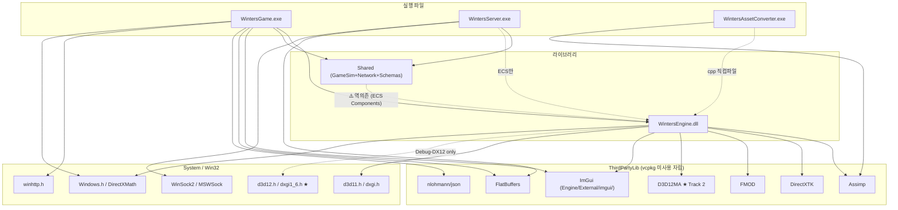
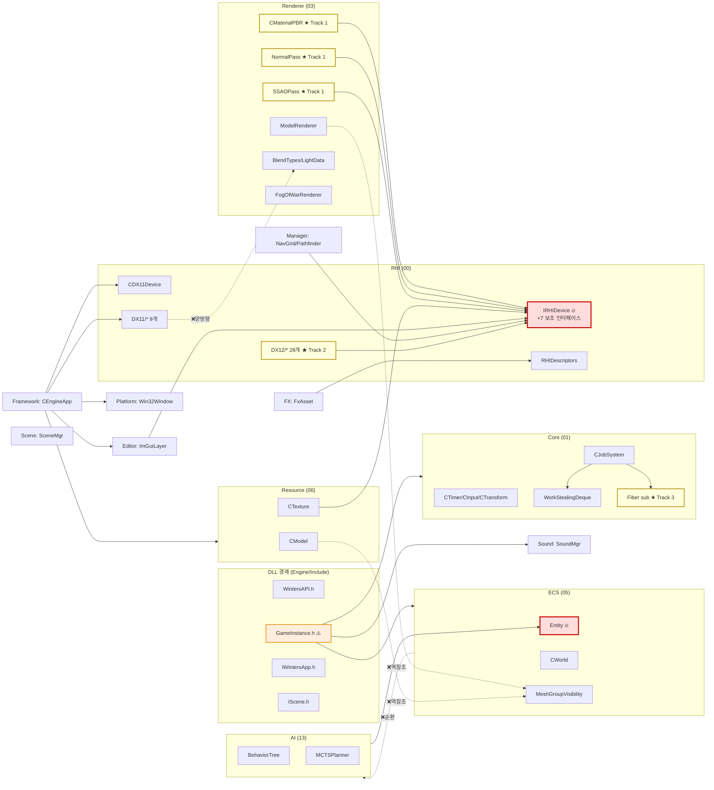

# Engine 의존성 그래프 박제 (2026-05-06 실측)

> 본 세션 (5/6) 의 #include 실측 기반 의존성 분석. CLAUDE.md §3 모듈 의존 방향 룰 검증 + Track 1/2/3 모듈 위치 + 위반 4건 + 핫스팟 노드.
> 추출 방법: `Engine/Public/{폴더}/**/*.h` Glob + `Grep "#include \"(폴더)/...` cross-folder edge.

---

## 1. 시스템 전체 (Apps + Lib + ThirdParty + System)



---

## 2. Engine 내부 모듈 의존성



---

## 3. 폴더별 헤더 카운트 + 핵심 클래스

| 폴더 | 헤더 수 | 핵심 클래스 / 헤더 |
|---|---|---|
| AI | 5 | BehaviorTree, MCTSPlanner, Blackboard, RLBridge |
| AssetFormat | 13 | WMeshFormat, WAnimLoader (Mesh/Anim/Common 3 sub) |
| Core | 13 | CTimer, CInput, CTransform, CJobSystem |
| Core/Fiber ★ | 3 | FiberTypes, Fiber, FiberPool |
| Core/JobSystem | 2 | WorkStealingDeque, JobDecl |
| Core/Profiler | 2 | CPUProfiler, ProfilerTypes |
| ECS | 30 | CWorld, ISystem, **CSystemSchedular** (오탈자, 정식 rename 보류), CCommandBuffer |
| Editor | 1 | CImGuiLayer |
| FX | 4 | FxAsset, ParticlePool, ParameterMap, DeterministicRandom |
| Framework | 1 | CEngineApp |
| Manager | 4 | CNavGrid, CPathfinder, CUI_Manager, CProfilerOverlay |
| Platform | 1 | CWin32Window |
| **RHI** | **18** | IRHIDevice + IRHIBindGroup + IRHIBindGroupLayout + IRHICommandList + IRHIPipelineState + IRHIQueue + IRHIRenderPass + IRHISwapChain (8 인터페이스) + RHIDescriptors + RHIHandles + RHITypes + CRHIResourceTable + ShaderCompiler + CDX11Device + IBuffer |
| RHI/DX11 | 9 | CDX11Device, BlendStateCache, DX11Pipeline/Shader/Buffer/... |
| **RHI/DX12 ★** | **28 (Private only)** | DX12Device, DX12Queue, DX12SwapChain, DX12CommandList, DX12PipelineState, DX12RenderPass, DX12BindGroup, DX12RootSignature, DX12DescriptorHeap, DX12MemoryAllocator, DX12ResourceBarrier, DX12Sampler, DX12Shader, DX12Texture, DX12Buffer |
| Renderer | 16 | CModelRenderer, CMaterialPBR, NormalPass, SSAOPass, RenderGraph, LightData, FogOfWarRenderer |
| Resource | 8 | CModel, CMesh, CSkeleton, CAnimator, CTexture, CResourceCache |
| Scene | 1 | CScene_Manager |
| Sound | 2 | CSound_Manager, SoundChannel |

> **codex 보정**: IRHI 보조 인터페이스 = **7개** (Device 제외하면 BindGroup/BindGroupLayout/CommandList/PipelineState/Queue/RenderPass/SwapChain). CLAUDE.md 의 "4 인터페이스" / "6 인터페이스" 둘 다 부정확.

---

## 4. 의존성 위반 (CLAUDE.md §3 룰: 낮은 번호 → 높은 번호 의존만 허용)

| 위반 유형 | 발생 위치 | 영향 |
|---|---|---|
| ❌ **순환** AI ↔ ECS | `AI/{Blackboard, BehaviorTree, MCTS, RLBridge}.h` → `ECS/Entity.h` <br/> `ECS/Systems/{BehaviorTreeSystem, MCTSSystem}.h:5` → `AI/*` | 모듈 번호 5 ↔ 13 정면 충돌. EntityID alias 분리 필요. **즉시 작업은 Stabilization-0 후로 미룸 (Architecture debt)** |
| ❌ **역참조** Renderer(03) → ECS(05) | `Renderer/ModelRenderer.h:5` → `ECS/Components/MeshGroupVisibilityComponent.h` | Track 1 W4 도입 추정 |
| ❌ **역참조** Resource(06) → ECS(05) | `Resource/Model.h:10` → `ECS/Components/MeshGroupVisibilityComponent.h` | 동일 |
| ❌ **양방향** RHI ↔ Renderer | `RHI/DX11/BlendStateCache.h:4` → `Renderer/BlendTypes.h` <br/> `RHI/DX11/DX11ConstantBuffer.h:9` → `Renderer/LightData.h` | RH-5 DX12 진입 시 `BlendTypes`/`LightData` 를 RHI 중립 위치로 이동 필요 |

**진성 순환 = 1건** (AI ↔ ECS), **단방향 역참조 = 3건**.

---

## 5. DLL 경계 (Engine/Include) 위반

| 공개 헤더 | 위반 여부 |
|---|---|
| WintersAPI/Types/Math/Paths/EngineConfig | ✅ 안전 |
| IWintersApp/IScene/ProfilerAPI/WintersEngine | ✅ 안전 |
| GameContext.h | ⚠️ Engine PCH 매크로 노출 (작은 위반) |
| **GameInstance.h** | ❌ **Public coupling 4건, 제거 난이도 상이** — `Sound/SoundChannel.h` (enum forward 검토 가능), `ECS/Systems/EntityBlueprint.h` (값 전달 → 정의 필요), `Manager/Profiler/ProfilerOverlay.h` (포인터 → forward 가능), `Core/Profiler/CPUProfiler.h` (포인터 → forward 가능) |

→ Tier-1/2 forwarding 게터 의도와 모순. **즉시 작업은 Hygiene follow-up 으로 충분** (codex 권장).

**`WINTERS_ENGINE` dllexport 표면적**: 30+ 클래스 (Renderer 8 + RHI 5 + Resource 1 + AI 3 + AssetFormat 1 + ECS 12+). 특히 ECS Systems 12개 export 는 보안/링크 시간 영향.

---

## 6. Track 1/2/3 신규 모듈 위치

| 트랙 | 모듈 | 위치 | 의존 | 사용처 |
|---|---|---|---|---|
| **Track 1** | `CMaterialPBR` | `Renderer/CMaterialPBR.h` | `IRHIDevice` only ✅ | `Renderer/CMaterialPBR.cpp:12` 내부에서 DX11 native handle 추출 ⚠️ |
| **Track 1** | `NormalPass` | `Renderer/NormalPass.h` | `IRHIDevice` only | `Renderer.cpp` + `Scene_InGame` |
| **Track 1** | `SSAOPass` | `Renderer/SSAOPass.h` | `IRHIDevice` only | 동일 |
| **Track 2** | `IRHIDevice` (8 메서드) | `RHI/IRHIDevice.h` | RHIDescriptors, RHITypes, IRHIQueue, IRHISwapChain | 14 헤더 (핫스팟) |
| **Track 2** | `IRHIBindGroup/Layout/CommandList/PipelineState/Queue/RenderPass/SwapChain` | `RHI/IRHI*.h` | RHIDescriptors/Handles/Types | RHI 내부 + Renderer |
| **Track 2** | `RHIDescriptors/Handles/Types` | `RHI/` | 자기 폐쇄 | RHI 내부 + Renderer/Resource |
| **Track 2** | `CRHIResourceTable`, `ShaderCompiler` | `RHI/` | Handles/Types | 박제 완료, caller 0 |
| **Track 2** ★ | `CDX12Device + 27 부속` | `Engine/Private/RHI/DX12/` | `IRHIDevice`, `IRHIBindGroup`, `IRHIPipelineState`, `IRHIRenderPass` + `D3D12MemAlloc.h` + `d3d12.h` + `dxgi1_6.h` | `WINTERS_RHI_BACKEND_DX12` 가드 (Engine `Debug-DX12` config) |
| **Track 3** | `FiberTypes/Fiber/FiberPool` | `Core/Fiber/` | Win32 only (외부 0) | `JobSystem.h:13` 가 FiberTypes include + `JobSystem.cpp:160-176, 253-284` 가 ConvertThreadToFiber/CreateFiber/SwitchToFiber/DeleteFiber 호출 |

> **codex 보정**: Track 1 caller 마이그 = "IRHI facade 통과 시작, DX11 native bridge 잔존" (`CMaterialPBR.cpp:12`, `Texture.cpp:12`, `ModelRenderer.h:28` 에서 DX11 native handle 추출). 완전 마이그 X.
>
> **Track 3 박제 깊이**: 헤더 3개는 빈 껍데기 (FiberTypes 19줄, Fiber 21줄, FiberPool 23줄). 단 `JobSystem.cpp` 에 FiberShell 실행 본체 박제. **CFiberPool 미사용 (매 job CreateFiber/DeleteFiber)**, **WaitForCounter Yield 없음**.

---

## 7. 핫스팟 노드 (의존 받는 빈도)

| 노드 | 의존 받음 | 영향 |
|---|---|---|
| `RHI/IRHIDevice.h` | **14 헤더** (Renderer 7 + Resource 4 + Editor 1 + Manager 1 + RHI 1) | 변경 시 빌드 영향 최대 |
| `ECS/Entity.h` | **14 헤더** (Systems + AI + Components 다수) | 동일 |
| `RHI/RHIDescriptors.h` | 6 헤더 | RHI 인터페이스 묶음 |
| `Renderer/BlendTypes.h` | 3 헤더 (RHI/DX11 양방향 발생) | RH-5 진입 전 이동 필요 |

---

## 8. 외부 모듈 핵심 발견

### Shared → Engine 역의존 (★ deterministic 원칙 위협)
```
Shared/GameSim/Components/HealthComponent.h:3    → ECS/Components/CoreComponents.h
Shared/GameSim/Components/ChampionComponent.h:3  → ECS/Components/GameplayComponents.h
Shared/GameSim/Systems/MoveSystem.cpp:10-11      → ECS/Components/TransformComponent.h, ECS/World.h
Shared/GameSim/Systems/ICommandExecutor.h:8      → ECS/Entity.h
```

### Client → DX11 누설 (W5 보류 사실 확인)
```
Client/Private/Scene/Scene_InGame.cpp:104        → RHI/CDX11Device.h
Client/Private/GameObject/FX/FxBeamSystem.cpp:6  → RHI/DX11/BlendStateCache.h
Client/Private/GameObject/FX/FxSystem.cpp:6      → RHI/DX11/BlendStateCache.h
```

### Transport Boundary ✅ 통과
`Server/Private/Game/`, `Server/Private/Security/`, `Shared/` 모두 `WSARecv/WSASend/recvfrom/sendto` **0 hit**. Session.cpp IOCP 레이어 격리.

### 챔프 12체 (codex 검증)
- 풀 박제 7체: Ezreal, Garen, Irelia, Kalista, Riven, Yasuo, Zed (1~3 cpp 부가)
- 표준 3-file 4체: Annie, Ashe, Fiora, Jax (FxPresets + Skills + Registration)
- 예외 1체: **Yone** (Skills + Registration + `Yone_MeshGroups.h` + `MeshGroupVisibilityComponent`, FxPresets 없음)
