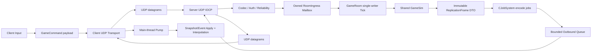

Session - Winters의 실시간 game transport를 완전 UDP로 이주하고 Server CPU job에 Engine JobSystem/Fiber를 안전하게 연결한다.

> [!IMPORTANT]
> **Historical baseline / as of 2026-07-11.** 아래 본문을 현재 구현 상태로 사용하지 않는다. 최신 기준은 [2026-07-13 canonical implementation plan](2026-07-13_UDP_JOB_SYSTEM_CHASE_LEV_FIBER_IMPLEMENTATION_PLAN.md)과 [S023 결과 보고서](../build/2026-07-13_UDP_JOB_SYSTEM_CHASE_LEV_FIBER_RESULT.md)다.
> As-built delta: JobSystem Submit race, Chase-Lev deque, FiberFull 및 stress 구현은 완료되었고, UDP v3 generic vertical slice와 server hub/client facade가 구현되었다. main F5 통합과 최종 build 상태는 S023 결과 보고서를 따른다. 6주 Fiber mastery 프로그램은 미착수이며, 현재 상태는 production UDP cutover가 아니다.
> 과거 UDP v2 수치인 **24 B header / 10 B fragment header / 1 MiB logical payload**는 historical design이다. 실제 v3 상수는 **40 B header / 16 B fragment header / 1,200 B datagram / 64 KiB logical payload**다.

검증 기준: 2026-07-11 현재 workspace. 이 문서는 과거 TCP/UDP·Server Fiber 계획을 삭제하지 않고, **현재 실행되는 코드**, **완전 UDP 목표**, **Server Fiber 목표**를 하나의 최신 기준으로 묶는다. 실제 구현은 아직 반영하지 않았으며, 아래 단계는 각 gate를 통과한 뒤 별도 세션에서 적용한다.

관련 Engine JobSystem의 상세 상태는 [2026-07-11 JobSystem · Chase-Lev · Fiber 상태 감사](2026-07-11_JOB_SYSTEM_CHASE_LEV_FIBER_STATE_AUDIT.md)를 함께 따른다.

## 0. 결론부터

### 0.1 현재 상태 판정

| 영역 | 현재 실제 상태 | 판정 |
|---|---|---|
| Backend Auth/Profile/Shop 등 | Client WinHTTP와 Go HTTP services | **HTTP/TCP 계열 유지 대상** |
| Client ↔ WintersServer lobby | `CClientNetwork` TCP socket | **TCP 활성** |
| Client ↔ WintersServer gameplay | 같은 TCP session으로 Command/Snapshot/Event | **TCP 활성** |
| Server socket | `SOCK_STREAM + IPPROTO_TCP + AcceptEx + IOCP` | **TCP 활성** |
| UDP 공용 계약 | 24B header, 3 channel enum, fragment header, reliability 선언 | **선언-only 골격** |
| UDP Client | `UdpClient.h`만 있고 구현 `.cpp`와 호출자 0 | **비활성** |
| UDP Server | socket/core/session/dispatcher 구현 0 | **미구현** |
| Server JobSystem | `CServerEntry`가 컴파일되지만 main 호출자 0 | **런타임 미연결** |
| Server Fiber | Engine FiberShell도 Server에서 mode 설정 호출자 0 | **미적용** |

따라서 “현재 TCP에 일부 UDP”라는 기억은 정확하지 않다.

> **현재 Winters의 lobby와 gameplay game-server transport는 모두 TCP다. UDP는 헤더와 API 선언만 존재하며 실행되는 UDP 데이터그램 경로는 없다.**

### 0.2 이 문서에서 말하는 “완전 UDP”의 범위

완전 UDP는 다음처럼 정의한다.

```text
유지:
  HTTPS/WinHTTP Backend
    Auth / Matchmaking / Profile / Shop / Payment / Leaderboard

UDP로 이주:
  Client <-> WintersServer 실시간 game session 전체
    handshake / lobby / ban-pick / game-start
    command / snapshot / event / heartbeat / reconnect
```

HTTP까지 UDP로 다시 만드는 것은 목표가 아니다. 그것은 게임 실시간 전송 최적화가 아니라 HTTP/TLS/인증 생태계를 다시 구현하는 별도 프로젝트다.

과거 문서의 목표는 `TCP Control + UDP Gameplay` hybrid였다. 이 문서는 사용자의 현재 요구에 맞춰 **WintersServer의 control과 gameplay를 하나의 UDP association으로 통합**하는 경우를 다룬다. 다만 production 최단 경로만 보면 hybrid나 QUIC가 더 안전할 수 있다는 의사결정 gate는 남긴다.

### 0.3 가장 먼저 칼질할 세 곳

1. `GameRoom -> CSession_Manager/CSession` 직접 의존을 끊는다.
2. IOCP completion thread가 `GameRoom` 상태를 직접 lock하지 않게 하고 owned ingress mailbox만 채우게 한다.
3. `m_stateMutex`를 잡은 채 simulation, snapshot build, send까지 하는 긴 임계구역을 `serial simulation -> immutable replication DTO -> parallel encode -> transport enqueue`로 자른다.

소켓을 먼저 `SOCK_DGRAM`으로 바꾸는 것은 올바른 첫 단계가 아니다. 지금 payload와 lifetime 구조 그대로 UDP로 옮기면 MTU, 순서, session identity, ownership 문제가 동시에 터진다.

## 1. CS적인 본질

### 1.1 TCP와 UDP는 “빠른 것/느린 것”의 구분이 아니다

TCP가 제공하는 핵심은 다음이다.

```text
connection identity
reliable byte stream
ordered delivery
duplicate suppression
flow/congestion control
retransmission
```

UDP가 제공하는 것은 훨씬 작다.

```text
source/destination port를 가진 독립 datagram 전달
message boundary 보존
checksum
```

UDP는 연결, 전달 성공, 순서, 중복 제거, 재전송, 혼잡 제어를 보장하지 않는다. 그러므로 TCP를 UDP로 바꾼다는 말의 본질은 다음과 같다.

> **OS가 대신 보장하던 정책을 application message의 성격별로 다시 설계한다.**

UDP의 장점은 신뢰성을 없애는 것이 아니라, **오래된 snapshot은 버리고 lobby/game-start/event는 재전송하는 식으로 서로 다른 정책을 한 TCP stream의 head-of-line에서 분리할 수 있다는 점**이다.

### 1.2 concurrency, parallelism, asynchrony는 서로 다르다

- concurrency: 여러 일이 진행 중인 상태다.
- parallelism: 여러 CPU core에서 실제로 동시에 실행되는 상태다.
- asynchrony: 작업 완료를 기다리는 동안 호출자를 점유하지 않는 구성 방식이다.

IOCP는 비동기 I/O completion 모델이다. Fiber는 user-mode stack continuation이다. JobSystem은 CPU work scheduling 모델이다. 세 개는 경쟁 관계가 아니다.

```text
IOCP: socket I/O가 끝났다는 사실을 전달
JobSystem: 실행 가능한 CPU work를 worker에 배분
Fiber: job이 dependency/async completion을 기다릴 때 stack을 보존하고 worker를 양보
```

### 1.3 IOCP는 thread-per-client의 반대 방향이다

현재 Server는 client마다 blocking recv thread를 만들지 않는다. accepted socket들을 completion port에 묶고 worker 4개가 completion packet을 소비한다.

```text
socket operation 게시
  -> kernel/network stack 진행
  -> completion packet
  -> GetQueuedCompletionStatus
  -> 아주 짧은 completion 처리
  -> 다음 operation 게시
```

UDP로 가면 per-client socket/accept가 사라지고 **한 bound UDP socket**으로 모든 peer의 datagram을 받는다. completion key만으로 client를 식별할 수 없으므로 `source endpoint + authenticated connectionId`가 필요하다.

### 1.4 Fiber는 network parallelism이 아니다

Fiber를 1,000개 만들어도 CPU가 1,000개 생기지 않는다. 실제 병렬도는 JobSystem OS worker 수에 제한된다.

Fiber의 가치는 다음 상황에 있다.

```text
Parent job
  -> child jobs submit
  -> child counter wait
  -> Parent stack만 Waiting
  -> worker OS thread는 다른 ready job 실행
```

현재 Winters FiberShell은 이 동작을 하지 않는다. job마다 Fiber를 만들고 한번 전환했다가 삭제할 뿐, `WaitForCounter`는 여전히 help-steal loop다. Server에 “동일 적용”한다는 첫 의미는 Fiber를 켜는 것이 아니라 **검증된 Engine JobSystem ThreadOnly backend를 Server CPU job에 연결하는 것**이다.

### 1.5 transport ACK와 gameplay ACK는 다르다

완전 UDP에서는 최소 세 종류의 ACK가 필요하다.

| ACK | 뜻 | 예시 |
|---|---|---|
| Transport ACK | datagram을 받음 | `ackSeq + ackBits` |
| Command ACK | command가 server에서 검증·실행/거절됨 | `lastExecutedCommandSeq`, reject reason |
| Baseline ACK | client가 snapshot을 완전히 조립·적용함 | `appliedSnapshotTick` |

Transport ACK를 받았다고 skill cast가 승인된 것이 아니다. Snapshot packet을 받았다고 delta baseline을 적용한 것도 아니다. 이 세 층을 섞으면 reconnect, loss, prediction reconciliation이 무너진다.

### 1.6 exactly-once는 wire가 아니라 idempotency로 만든다

네트워크에서 “정확히 한 번 전달”을 직접 보장하기는 어렵다. 실전 계약은 다음 조합이다.

```text
at-least-once delivery through retry
+ receiver-side duplicate suppression
+ command/event idempotency key
= gameplay effect at-most-once execution
```

현재 command에는 `sequenceNum`이 있어 기반이 있다. Event는 같은 tick에 여러 개가 동일 envelope sequence를 쓸 수 있으므로, UDP 이주에서는 `(serverTick, eventIndex)` 또는 단조 `eventId`가 필요하다.

## 2. 현재 Winters network 전체 구조

### 2.1 Client transport

활성 구현은 [ClientNetwork.cpp](../../Client/Private/Network/Client/ClientNetwork.cpp)다.

```text
CGameSessionClient::Connect
  -> CClientNetwork::Create
  -> socket(AF_INET, SOCK_STREAM, IPPROTO_TCP)
  -> connect
  -> TCP_NODELAY
  -> recv thread 시작

main/game thread Send
  -> blocking send loop

recv thread
  -> recv byte stream
  -> m_recvAccum에 append
  -> PacketHeader 기준 frame 복원
  -> pendingFrames queue

main frame PumpReceivedFrames
  -> callback
  -> Hello / LobbyState / GameStart / Snapshot / Event 적용
```

근거:

- DNS hint도 TCP다: `ClientNetwork.cpp:62-66`.
- socket 생성: `ClientNetwork.cpp:102-106`.
- blocking send loop: `ClientNetwork.cpp:163-181`.
- recv thread와 stream accumulation: `ClientNetwork.cpp:204-255`.
- worker → main-thread marshal: `ClientNetwork.cpp:191-201`.

좋은 경계도 있다. recv thread가 Client ECS/renderer를 직접 건드리지 않고, main thread의 `PumpReceivedFrames`에서 callback을 실행한다. UDP에서도 이 ownership은 유지해야 한다.

### 2.2 Lobby와 InGame이 같은 TCP session을 공유한다

[GameSessionClient.cpp](../../Client/Private/Network/Client/GameSessionClient.cpp)은 singleton facade로 TCP connection과 lobby context를 보존한다.

```text
Scene_BanPick / Scene_CustomMode
  -> CGameSessionClient TCP connect
  -> LobbyCommand send
  <- Hello / LobbyState / GameStart

Scene_InGame
  -> 기존 CGameSessionClient::GetNetwork 재사용
  -> 같은 TCP connection으로 CommandBatch send
  <- 같은 TCP connection으로 Snapshot/Event receive
```

[Scene_InGameNetwork.cpp](../../Client/Private/Scene/Scene_InGameNetwork.cpp)의 실제 분기:

- network roster + shared session이면 `CGameSessionClient::GetNetwork()`를 재사용한다: `497-501`.
- 그렇지 않으면 새 `CClientNetwork`를 만든다: `502-506`.
- `Hello/Snapshot/Event` callback은 `587-657`.
- shared TCP를 명시하는 로그도 `668-670`에 있다.
- 매 frame pump는 `694-705`다.

### 2.3 Client serializer와 transport가 결합돼 있다

[CommandSerializer.cpp](../../Client/Private/Network/Client/CommandSerializer.cpp)은 FlatBuffer 생성뿐 아니라 `WrapEnvelope`와 `CClientNetwork::Send`까지 담당한다.

```text
GameCommandWire
  -> CommandBatch FlatBuffer
  -> TCP PacketEnvelope
  -> CClientNetwork::Send
```

`CCommandSerializer`의 모든 public send 함수가 `CClientNetwork&`를 직접 받는다. 완전 UDP에서 serializer를 재사용하려면 `payload build`와 `delivery policy/send`를 분리해야 한다.

### 2.4 Server process와 thread 지도

[main.cpp](../../Server/Private/main.cpp)은 다음 순서다.

```text
WSAStartup
GameRoom create/start
PacketDispatcher room 등록
CIOCPCore(port 9000, workers 4) start
console/smoke wait
CIOCPCore shutdown
GameRoom stop
WSACleanup
```

실제 Server thread는 다음뿐이다.

```text
main thread
GameRoom tick thread x1
IOCP WorkerLoop x4
Server JobSystem workers x0
```

기존 일부 문서의 `AcceptThread`는 현재 사실이 아니다. [IOCPCore.cpp](../../Server/Private/Network/IOCPCore.cpp)은 worker 4개를 시작하고 `AcceptEx` context 4개를 pre-post한다. `AcceptLoop()`는 빈 함수이며 `m_acceptThread`를 시작하지 않는다.

### 2.5 Server TCP IOCP path

[IOCPCore.cpp](../../Server/Private/Network/IOCPCore.cpp)의 활성 path는 다음이다.

```text
WSASocketW(AF_INET, SOCK_STREAM, IPPROTO_TCP, WSA_FLAG_OVERLAPPED)
  -> bind
  -> listen
  -> IOCP associate
  -> AcceptEx x4 pre-post
  -> GetQueuedCompletionStatus workers
```

Accept completion:

```text
accepted socket
  -> TCP_NODELAY
  -> CSession_Manager::OnAccept
  -> accepted socket IOCP bind
  -> CSession::PostInitialRecv
  -> CGameRoom::OnSessionJoin
```

Recv completion:

```text
CSession::OnRecvComplete
  -> CFrameParser::Append/TryPop
  -> CPacketDispatcher
  -> FlatBuffers Verify
  -> GameRoom lobby/command route
```

Send completion:

```text
CSession send queue front 완료
  -> pop
  -> 다음 WSASend 게시
```

### 2.6 Session identity가 TCP connection에 묶여 있다

[Session_Manager.cpp](../../Server/Private/Network/Session_Manager.cpp)은 accept 때 단조 `sessionId`를 발급하고 `sessionId -> shared_ptr<CSession>`을 보관한다. [Session.h](../../Server/Public/Network/Session.h)은 per-client socket, recv/send OVERLAPPED, stream parser, send queue, controlled entity를 한 객체에 묶는다.

TCP에서는 `accept된 socket == 살아 있는 session`이라는 등식이 암묵적으로 성립한다. UDP에는 accept도 per-client socket도 없으므로 이 등식을 폐기해야 한다.

```text
잘못된 UDP identity:
  session = source ip:port

필요한 identity:
  authenticated connectionId + session generation
  current endpoint는 변경 가능한 routing address
```

NAT rebinding이나 reconnect를 고려하면 endpoint만 key로 삼을 수 없다.

### 2.7 GameRoom과 transport가 직접 결합돼 있다

현재 `GameRoom`은 application simulation object이면서 concrete TCP session lookup의 caller다.

직접 결합 지점:

- lobby/join/send: [GameRoomLobby.cpp](../../Server/Private/Game/GameRoomLobby.cpp) `73`, `288-343`.
- command validation용 session lookup: [GameRoomCommands.cpp](../../Server/Private/Game/GameRoomCommands.cpp) `35-53`.
- event/snapshot send: [GameRoomReplication.cpp](../../Server/Private/Game/GameRoomReplication.cpp) `54-75`, `124-170`.

특히 [CommandIngress.h](../../Server/Public/Game/CommandIngress.h)은 `AcceptCommandBatch(..., CSession& session)`으로 network session을 simulation ingress에 노출한다. sequence/abuse state를 transport/session-security 계층으로 옮기고 GameRoom에는 검증된 owned command만 넘겨야 한다.

### 2.8 현재 authority와 deterministic handoff

보존해야 하는 핵심 흐름은 이미 맞다.

```text
Client Input
  -> GameCommand
  -> Server CCommandIngress
  -> GameRoom fixed tick / Shared GameSim
  -> Snapshot + Event
  -> Client main-thread apply / interpolation / visual
```

[CommandIngress.cpp](../../Server/Private/Game/CommandIngress.cpp)은 command를 owned `PendingCommand`로 복사하고 mutex queue에 넣은 뒤, tick에서 `(acceptedTick, sessionId, sequenceNum)`으로 stable sort한다. 이 부분은 UDP/JobSystem 전환 뒤에도 유지해야 할 좋은 경계다.

### 2.9 현재 긴 lock 구간

[GameRoomTick.cpp](../../Server/Private/Game/GameRoomTick.cpp)의 `Tick()`은 `m_stateMutex`를 잡은 채 다음 전체를 실행한다.

```text
drain commands
bot AI
command execution
all simulation systems
lag-comp history
event collect/build/send
per-session full snapshot build/send
```

반면 IOCP thread의 join/leave/lobby callback도 같은 mutex를 잡는다. 따라서 snapshot encoding이 커지면 IOCP worker가 한 tick 전체를 기다릴 수 있다.

FiberFull에서 이 mutex를 들고 child job을 submit/wait하면 lock dependency에 따라 self-deadlock이 될 수 있다. Server Fiber 전에 이 구간을 잘라야 한다.

### 2.10 UDP와 무관하게 먼저 박제할 TCP debt

현재 baseline에는 UDP 전환 중 회귀 원인으로 섞일 수 있는 debt가 있다.

1. [Session.cpp](../../Server/Private/Network/Session.cpp)의 `OnSendComplete`는 completion `bytes`를 무시하고 queue front 전체를 완료 처리한다. TCP overlapped send의 partial completion을 이어 보내는 offset 계약이 없다.
2. Server `m_sendQueue`와 Client `m_pendingFrames`에는 byte/count/time hard cap이 없다. 느린 client가 full snapshot backlog를 만들 수 있다.
3. 일부 `CSession::OnDisconnect()` 경로는 socket만 닫고 manager/room unroute까지 일관되게 진행하지 않는다.
4. heartbeat, idle timeout, connection/session cap, packet rate limit이 없다.
5. `PacketFlag_Compressed/Encrypted`와 suspicion counter는 선언되지만 실제 enforcement가 없다.
6. IOCP shutdown은 active session socket과 outstanding accept/recv/send context를 명시적으로 모두 drain하는 registry가 없다.

이 항목을 모두 TCP에서 기능 확장할 필요는 없다. 다만 unit/integration baseline으로 재현하거나 UDP 구조에서 확실히 제거해야 “UDP 때문에 생긴 버그”와 구분할 수 있다.

## 3. wire/schema의 현재 상태

### 3.1 현재 TCP envelope

[PacketEnvelope.h](../../Shared/Network/PacketEnvelope.h)의 실제 16B header 순서는 다음이다.

```cpp
struct PacketHeader
{
    uint16_t magic;
    uint16_t version;
    uint16_t type;
    uint16_t flags;
    uint32_t payloadSize;
    uint32_t sequence;
};
```

TCP에서는 byte stream에 message boundary가 없으므로 `payloadSize`를 이용해 frame을 복원한다. UDP에서는 datagram 자체가 boundary이므로 `CFrameParser`가 필요 없다.

현재 header는 packed/native integer를 `memcpy`한다. Windows x64끼리는 작동하지만, network byte order나 explicit little-endian codec이 없어 “wire stable” 계약으로는 약하다. 새 UDP codec은 struct memory image를 그대로 보내지 말고 field 단위 encode/decode와 bounds check를 가져야 한다.

### 3.2 죽어 있는 두 번째 packet 정의

[PacketDef.h](../../Shared/Network/PacketDef.h)은 별도의 `PacketType`, 또 다른 `PacketHeader`, 고정 `PlayerState[100]`를 정의하지만 include/caller가 0이다. 활성 FlatBuffers/PacketEnvelope path와 다른 legacy 계약이므로 UDP 전환 중 제거 또는 archive 대상이다.

### 3.3 UDP 골격

[UdpPacketHeader.h](../../Shared/Network/UdpPacketHeader.h):

```text
24B header
version 2
ReliableOrdered
ReliableUnordered
UnreliableSequenced
channelSeq / ackSeq / ackBitfield
1200-byte constant
```

[UdpFragmentHeader.h](../../Shared/Network/UdpFragmentHeader.h)은 10B fragment metadata를 정의한다. [UdpReliabilityChannel.h](../../Shared/Network/UdpReliabilityChannel.h)은 sequence, receive mask, reliable pending queue API를 선언한다.

그러나 다음은 없다.

```text
CUdpReliabilityChannel method definitions
RTO/RTT estimator
ordered receive buffer
fragment reassembly
reassembly limits/timeouts
connectionId/session generation
handshake/cookie/authentication
congestion window/pacing
UDP Server socket/core
CUdpClient implementation/caller
network emulation tests
```

즉 이것은 구현된 reliability layer가 아니라 이름과 layout의 초안이다.

### 3.4 현재 packet type 분류

`ePacketType`은 다음을 담는다.

```text
Gameplay: CommandBatch / Snapshot / Event
Session:  Hello / Heartbeat / Disconnect
Lobby:    LobbyCommand / LobbyState / GameStart
```

완전 UDP에서는 type만으로 부족하다. type마다 delivery policy, sequence space, priority, max size를 명시한 policy table이 필요하다.

## 4. 실제 payload 측정이 바꾸는 마이그레이션 순서

### 4.1 저장된 replay 4개 측정

`Shared/Replay/ReplayFormat.h` 계약으로 `Replay/*.wrpl` record header를 직접 파싱했다.

| replay | snapshot 수 | snapshot min | p50 | p95 | max | 평균 |
|---|---:|---:|---:|---:|---:|---:|
| `room1_tick1_798.wrpl` | 798 | 6,432 B | 12,568 B | 14,120 B | 14,168 B | 10,853.4 B |
| `room1_tick1_1602.wrpl` | 1,602 | 5,432 B | 11,320 B | 18,624 B | 20,024 B | 12,410.7 B |
| `room1_tick1_1681.wrpl` | 1,681 | 5,432 B | 12,688 B | 18,624 B | 20,008 B | 12,603.7 B |
| `room1_tick1_1786.wrpl` | 1,786 | 8,768 B | 16,256 B | 19,792 B | 22,104 B | 15,415.8 B |

**모든 저장 snapshot이 1,200B를 초과한다.**

최신 replay 평균은 30Hz에서 client 1명당 약 `451.6 KiB/s` payload다. 5명에게 같은 규모로 보내면 snapshot payload만 약 `2.2 MiB/s`이며 UDP/IP/app header, ACK, event, retransmit은 포함하지 않은 수치다.

1200B를 UDP payload 전체 budget으로 잡고 `24B UDP header + 10B fragment + 16B auth tag`를 빼면 fragment data는 약 1,150B다. 최신 replay는 평균 약 13.8개, 최대 20개 application fragment가 필요하다.

### 4.2 기존 “M1은 fragment 없이 full snapshot”은 현재 roster에서 불가능

과거 M1 문서의 다음 조합은 실제 capture와 모순된다.

```text
one datagram = one full Snapshot
datagram <= 1200B
fragment는 M2
```

localhost의 아주 작은 empty-world packet만으로는 보일 수 있지만 현재 5v5/미니언/구조물 snapshot은 들어가지 않는다.

따라서 실전 순서는 다음 중 하나여야 한다.

1. UDP 첫 gameplay snapshot 전에 delta/AOI/field 분리를 해 payload를 줄인다.
2. 첫 UDP vertical slice부터 bounded application fragmentation/reassembly를 함께 넣는다.

권장 방향은 둘 다다. fragment는 rare oversized message의 안전망으로 구현하고, steady-state snapshot 자체는 delta/AOI/quantization으로 줄인다.

### 4.3 Snapshot schema가 debug telemetry까지 운반한다

[Snapshot.fbs](../../Shared/Schemas/Snapshot.fbs)의 `EntitySnapshot`은 gameplay/render에 필요한 state뿐 아니라 다수 AI debug scalar와 `aiDebugTrace` vector까지 가진다. [SnapshotBuilder.cpp](../../Server/Private/Game/SnapshotBuilder.cpp)은 모든 network entity를 순회하고 이 값을 full snapshot에 넣는다.

칼질 방향:

```text
production SnapshotCore:
  transform / pose / action / hp / essential gameplay state

low-rate ReliableState:
  inventory / rank / cooldown definition-like state

dev-only DebugTelemetry:
  AI scores / trace rows / tuning state
```

debug telemetry를 production 30Hz snapshot에서 떼는 것이 UDP 이전의 가장 큰 payload 절감 후보다.

### 4.4 현재는 AOI/fog filtering이 없다

`SnapshotBuilder`는 network entity를 전부 수집한다. visibility component 일부를 serialize하지만 recipient team/vision에 따라 entity를 제외하지 않는다.

AOI는 bandwidth 최적화만이 아니다.

> **보이지 않아야 하는 적의 위치를 client에 보내면 renderer에서 숨겨도 cheat client는 읽을 수 있다.**

delta/AOI 단계는 authoritative vision/fog 정책과 함께 가야 한다.

## 5. 유지할 것, 교체할 것, 삭제할 것

### 5.1 그대로 유지할 핵심

| 영역 | 유지 이유 |
|---|---|
| `Shared/GameSim` authority | transport와 무관한 gameplay truth |
| FlatBuffers payload verify | malformed/schema drift 방어 |
| `GameCommandWire`와 command schema | transport-neutral command 의미 |
| `CCommandIngress` owned copy + deterministic sort | IO thread → tick handoff의 좋은 기반 |
| `CSnapshotApplier` / `CEventApplier` | payload 적용부는 transport-neutral에 가깝다 |
| Client main-thread `PumpReceivedFrames` ownership | ECS/render thread safety |
| `SessionBinding` | application session ↔ controlled entity mapping |
| replay/state-hash 방향 | TCP/UDP/Fiber parity oracle |

### 5.2 추상화 후 교체할 것

| 현재 | 목표 | 이유 |
|---|---|---|
| `CClientNetwork` TCP concrete | `IClientTransport` + UDP implementation | serializer/scene가 socket type을 모르게 함 |
| `CIOCPCore` TCP accept core | `CUdpIocpCore` | 한 UDP socket + recvfrom/sendto completion |
| `CSession` per-socket | `CUdpPeer`/connection state | endpoint, connectionId, channel state 분리 |
| `CSession_Manager` | peer/connection registry | app session과 transport association 분리 |
| `CPacketDispatcher` stream frame dispatcher | datagram codec + policy + room router | header/auth/channel 검증 선행 |
| GameRoom direct `CSession::Send` | outbound gateway/queue | simulation과 transport lifetime 분리 |
| `AcceptCommandBatch(..., CSession&)` | validated owned command ingress | network type이 Game layer로 새지 않음 |
| TCP recv accumulation queue | channel별 bounded receive lanes | snapshot coalescing, reliable control 보존 |

새 이름은 구현 세션에서 현재 naming convention에 맞춰 확정한다. 이 문서에서의 이름은 ownership을 설명하기 위한 방향명이다.

### 5.3 완전 cutover 후 삭제할 것

```text
Server TCP AcceptEx/listen path
Server per-client TCP socket/recv/send contexts
CFrameParser stream accumulation
Client TCP connect/send/recv path
legacy Shared/Network/PacketDef.h
unused AcceptLoop/m_acceptThread
```

단, rollback 기간에는 TCP/UDP를 `ITransport` 뒤에서 함께 빌드할 수 있다. 삭제 gate는 UDP parity/soak 통과 후다. 정상 F5에서 영구적으로 두 transport를 동시에 돌리는 구조는 만들지 않는다.

## 6. 목표 UDP architecture



핵심 ownership:

```text
IOCP worker owns completion context only.
Peer registry owns connection/reliability/security state.
GameRoom tick owns lobby/world/session-binding mutation.
Job workers own immutable DTO -> bytes output only.
Client main thread owns ECS/render application.
```

### 6.1 transport-neutral application boundary

`ePacketType`과 delivery policy를 TCP envelope에서 분리한다.

개념적 send contract:

```text
Send(sessionId, packetType, deliveryPolicy, immutablePayload)
```

GameRoom은 socket, sockaddr, `WSASendTo`, reliability queue를 모른다. Transport는 `sessionId`를 current `connectionId/endpoint`로 해석한다.

### 6.2 UDP header 계약

현재 24B header는 출발점일 뿐이다. 최소적으로 다음 개념이 필요하다.

```text
magic / protocol version
connectionId
session generation or epoch
packet type
logical channel/stream
flags
packet sequence
message/channel sequence
ack sequence + ack bits
payload length
authentication tag or protected body
```

규칙:

- datagram length와 header payload length는 정확히 같아야 한다.
- unknown type/channel/flag 조합은 FlatBuffer parse 전에 버린다.
- byte order를 명시한다.
- UDP header 안에 TCP `PacketEnvelope`를 다시 넣어 double header로 만들지 않는다.
- `ePacketType`은 transport-neutral header로 추출하고 TCP envelope는 legacy adapter로 남긴다.
- sequence wrap은 serial-number arithmetic으로 비교한다.

`packetSeq`와 `messageSeq`를 분리해야 한다. Fragment 각각은 전송/ACK되는 datagram이므로 독립 packet number가 필요하고, fragment를 모두 모은 reliable message의 delivery order에는 별도 message sequence가 필요하다. 현재 `channelSeq` 하나를 두 역할에 겸용하면 retransmit·fragment·ordered delivery의 의미가 충돌한다.

### 6.3 handshake와 anti-amplification

TCP는 3-way handshake와 accept가 source spoofing 비용을 올려준다. UDP는 첫 datagram만 보고 큰 response나 session allocation을 하면 amplification 공격점이 된다.

권장 handshake:

```text
ClientHello(clientNonce, protocol/data hash, room intent)
  -> ServerRetry(stateless cookie, short TTL)
ClientConnect(cookie, match/auth token)
  -> ServerAccept(connectionId, sessionId, serverNonce, negotiated limits)
ClientConfirm
  -> Connected
```

원칙:

- cookie 검증 전 큰 memory/session을 할당하지 않는다.
- response bytes는 검증 전 request bytes보다 과도하게 크지 않게 한다.
- `IsConnected`는 UDP `connect()` 호출이 아니라 application handshake 완료를 뜻한다.
- reconnect token으로 기존 human slot/session generation을 reclaim한다.
- authenticated packet만 NAT rebinding을 허용한다.
- stale generation packet은 폐기한다.

Backend matchmaking이 준비된 production path는 HTTPS match ticket을 쓴다. localhost smoke는 명시적 dev ticket provider를 사용하고 production과 같은 state machine을 통과한다.

### 6.4 channel과 delivery policy

현재 3 enum만으로는 unrelated reliable traffic이 서로 막힐 수 있다. 최소 다음 logical sequence space를 권장한다.

| logical lane | 초기 정책 | packet |
|---|---|---|
| Control | Reliable Ordered | Hello/Connect, LobbyCommand, LobbyState, GameStart, Disconnect |
| GameplayCommand | Reliable Ordered | Cast, Attack, Buy, UseItem, Recall, Flash, LevelSkill |
| Move/Input | 초기 Reliable Ordered, 후속 Unreliable Sequenced + resend/coalesce 검토 | Move/continuous input |
| GameplayEvent | Reliable Ordered | ActionStart, Damage, Death, Projectile/FX cue |
| Snapshot | Unreliable Sequenced | full/delta state |
| Telemetry | Unreliable or low-rate reliable | dev-only metrics |

현재 Move는 한번의 right-click command다. 아무 보강 없이 unreliable로 보내면 packet loss 한 번으로 이동 자체가 사라진다. 다음 중 하나가 마련되기 전에는 command를 reliable로 둔다.

```text
latest intent periodic resend
server semantic ack까지 resend
input-state stream
```

### 6.5 reliability state machine

필수 상태:

```text
per-lane send sequence
receive window + duplicate mask
ordered pending buffer
unacked packet/message table
RTT estimator
RTO with backoff
retransmit count/limit
send window / congestion budget
ACK-only scheduling
```

수신 시 단순 `seq <= last` drop으로 ReliableOrdered를 만들 수 없다. `seq=11`이 먼저 왔고 `10`이 늦게 오면 11을 buffer하고 10부터 deliver해야 한다. 반대로 Snapshot lane은 11을 즉시 적용하고 늦은 10을 버린다.

### 6.6 MTU, fragmentation, snapshot delta

초기 규칙:

```text
UDP/IP fragmentation에 기대지 않는다.
application UDP payload 전체 <= 1200B를 보수적 시작값으로 둔다.
각 datagram은 독립적으로 bounds/auth 검증 가능해야 한다.
```

Application fragmentation에는 다음이 필요하다.

```text
messageId + generation
fragment index/count
total message size
per-peer in-flight byte/message cap
duplicate fragment suppression
timeout/eviction
fragment count/size bounds
complete 후 한 번만 FlatBuffer Verify
```

Snapshot은 다음 단계로 줄인다.

1. AI debug trace와 low-frequency state를 분리한다.
2. entity field change mask와 quantization을 도입한다.
3. client가 적용한 baseline tick을 ACK한다.
4. server는 ACK된 baseline에서만 delta를 만든다.
5. baseline timeout/miss에는 full resync를 보낸다.
6. team vision/AOI로 recipient에게 허용된 entity만 보낸다.
7. 가능하면 entity chunk가 독립 적용 가능하도록 설계하고 despawn contract를 분리한다.

완전한 snapshot을 14~20 fragment로 매 tick 조립하는 구조는 loss가 조금만 있어도 complete-frame 확률이 급격히 떨어진다. Fragment는 압축 설계의 대체물이 아니다.

### 6.7 congestion control과 pacing

UDP라서 마음대로 line-rate send해도 되는 것이 아니다. Per-peer aggregate traffic에 다음이 필요하다.

```text
send byte/packet budget
pacing queue
loss/RTT 기반 budget 감소
retransmit 우선순위와 상한
snapshot supersede drop
reliable control starvation 방지
queue byte/time cap
overload disconnect/circuit breaker
```

우선순위 예:

```text
handshake/control
critical command ack/event
snapshot delta
telemetry/debug
```

### 6.8 client receive queue

현재 하나의 `pendingFrames` vector에 모든 frame을 쌓는다. UDP에서는 lane별 정책이 필요하다.

```text
Reliable Control/Event:
  bounded ordered queue, overflow는 connection failure로 처리

Snapshot:
  newest complete tick만 유지, 오래된 pending snapshot supersede

Fragment:
  bounded reassembly table, deadline 후 폐기
```

네트워크가 렌더보다 빨라 backlog가 쌓이면 “모두 적용”하는 것이 정확하지 않다. Snapshot은 최신 상태를 남겨 latency spiral을 막아야 한다.

현재 [SnapshotApplier.cpp](../../Client/Private/Network/Client/SnapshotApplier.cpp)은 TCP 순서를 전제로 수신 snapshot을 바로 적용하고, full snapshot에 없는 entity를 stale로 제거한다. UDP에서는 다음 gate가 선행돼야 한다.

```text
fragment 완전 조립 전 OnSnapshot 호출 금지
wrap-safe serverTick <= lastAppliedCompleteTick drop
delta에는 added/changed/removed를 명시
baseline mismatch는 partial apply가 아니라 full resync
```

현재 interpolation도 여러 snapshot을 시간순으로 보관하는 jitter buffer가 아니라 한 start/target 사이의 고정 smoothing에 가깝다. UDP loss/jitter에 대응하려면 2~3개 이상의 complete snapshot, render delay, 제한된 extrapolation, teleport threshold를 가진 tick/time 기반 buffer가 필요하다.

Event와 Snapshot을 다른 lane으로 보내면 TCP가 주던 cross-type order도 사라진다. `event.serverTick`, referenced entity, snapshot tick을 기준으로 event를 잠시 보류하거나 snapshot의 action state로 복구하는 정책이 필요하다. `Hello`/association 확정 전 gameplay payload도 적용하지 않는다.

### 6.9 room ingress mailbox와 single-writer

IOCP worker는 다음까지만 한다.

```text
completion context 회수
header/auth/channel 검증
reliability/reassembly
FlatBuffer verify
owned immutable message 생성
RoomIngress enqueue
next WSARecvFrom repost
```

GameRoom tick은 다음 ingress를 phase check보다 먼저 drain한다.

```text
SessionJoin
SessionLeave
LobbyCommand
GameCommandBatch
Reconnect/Timeout
```

중요: 현재 `Tick()`은 `!IsInGamePhase()`면 즉시 return한다. Lobby mailbox를 만들고도 그 return 뒤에서 drain하면 game start에 영원히 도달하지 못한다.

single-writer 전환 후 join/lobby/world/session-binding mutation은 tick thread만 한다. IOCP worker가 `m_stateMutex`를 직접 잡지 않는다.

### 6.10 outbound buffer lifetime

Overlapped `WSASendTo`가 완료될 때까지 payload, destination, OVERLAPPED context가 살아 있어야 한다.

권장 ownership:

```text
UdpSendContext
  OVERLAPPED
  sockaddr_storage destination
  immutable/ref-counted packet buffer
  peer/generation id
```

Snapshot bytes를 session 수만큼 무조건 복사하지 않는다. 공통 payload는 immutable shared buffer로 공유하고, per-session metadata/delta가 필요한 경우만 별도 encode한다.

### 6.11 shutdown protocol

단순 `close socket -> containers clear`로 끝내지 않는다.

```text
1. new handshake/ingress/job admission 중단
2. UDP receive admission 중단
3. Room tick stop 요청 및 현재 tick/job join
4. outbound admission 중단
5. outstanding IO cancel/close 후 completion drain
6. peer/room/context destruction
7. JobSystem outstanding counter/waiter 0 확인 후 shutdown
8. Fiber pool/root 정리
9. WSACleanup
```

Transport의 `StopIngress`와 `DrainAndShutdown`을 분리하면 room이 마지막 outbound를 안전하게 넘길 수 있다.

## 7. Windows/Visual Studio 구현 연결

### 7.1 현재 toolchain

Engine/Client/Server project는 다음 기준이다.

```text
Windows SDK 10
MSVC v143
C++20
x64 Debug/Release
/MDd or /MD
```

[Server.vcxproj](../../Server/Include/Server.vcxproj)은 이미 `ws2_32.lib`, `Mswsock.lib`, Engine project reference, EngineSDK include를 가진다. UDP/Fiber를 위해 새 linker architecture를 만들 필요는 없다. 새 `.h/.cpp`는 실제 owning `.vcxproj/.filters`에 등록해야 한다.

### 7.2 Server UDP IOCP의 Win32 순서

```text
WSAStartup
WSASocketW(AF_INET/AF_INET6, SOCK_DGRAM, IPPROTO_UDP,
           ..., WSA_FLAG_OVERLAPPED)
setsockopt(SO_EXCLUSIVEADDRUSE)
bind
CreateIoCompletionPort(socket -> port)
N개의 UdpRecvContext로 WSARecvFrom pre-post
worker: GetQueuedCompletionStatus 또는 GQCSEx
completion 처리 후 같은 context를 reset/repost
WSASendTo는 send별 독립 context 사용
shutdown에서 socket close/cancel completion drain
```

`WSARecvFrom`의 `sockaddr`, `fromLen`, `OVERLAPPED`는 completion까지 살아 있어야 하며, 동시에 outstanding인 I/O마다 별도 `OVERLAPPED`가 필요하다. stack local address를 넘기면 안 된다.

한 UDP socket에 여러 receive를 게시하면 completion 처리가 서로 다른 IOCP worker에서 끝날 수 있다. 동일 peer의 application delivery order는 completion 순서를 믿지 말고 channel sequence/peer strand로 복원해야 한다.

### 7.3 Client 구현

Client는 socket 하나뿐이므로 처음부터 IOCP를 강제할 이유는 없다. 현재 ownership을 유지한 다음 구조가 단순하다.

```text
main thread:
  handshake state update / send enqueue / Pump

recv worker:
  recvfrom or WSARecvFrom
  server endpoint/auth 확인
  reliability/reassembly
  lane별 pending queue

main thread Pump:
  control/event ordered apply
  newest snapshot apply
```

UDP `connect()`를 사용하면 default peer 설정과 다른 source datagram filtering에는 도움이 되지만, application session이 연결됐다는 증거는 아니다. `ServerAccept/Confirm`이 끝나야 connected 상태다.

### 7.4 Windows-specific failure handling

필수 처리:

```text
WSA_IO_PENDING = 정상 async 시작
WSAEMSGSIZE = datagram truncation/송신 크기 위반
WSAECONNRESET on UDP = 이전 send의 ICMP Port Unreachable 가능
WSA_OPERATION_ABORTED = shutdown/cancel 경로
GQCS false + overlapped non-null = 실패 completion도 context 회수 필요
```

### 7.5 header include와 DLL 경계

- `WinSock2.h`는 `Windows.h`보다 먼저 include한다.
- Shared wire types는 Engine/DX/UI 타입을 include하지 않는다.
- `Shared/GameSim`은 Engine JobSystem을 include하지 않는다.
- Server가 Engine `CJobSystem`을 쓰는 것은 Server project의 Engine dependency 안에서만 한다.
- Engine public header를 바꾸면 `UpdateLib.bat`으로 EngineSDK를 동기화한다.

## 8. Server JobSystem/Fiber 통합

### 8.1 현재 `CServerEntry`는 연결하면 안 되는 stub

[ServerEntry.cpp](../../Server/Private/Game/ServerEntry.cpp)의 현재 동작:

```text
Initialize:
  initialized flag true
  CJobSystem::Initialize로 worker 시작
  mode 설정 안 함
  false 반환

Shutdown: empty
Get_JobSystem: nullptr
Get_ExecutionMode: default enum
IsInitialized: false
```

따라서 지금 `main`에 단순 연결하면 worker를 시작한 뒤 initialize 실패 분기로 들어간다. 먼저 stub을 완성해야 한다.

[ServerEntry.h](../../Server/Public/Game/ServerEntry.h)의 `bEnableFiberShell=true` 기본값도 안전하지 않다. production 기본은 `ThreadOnly`, FiberShell은 명시적 lab option이어야 한다.

### 8.2 현재 Engine mode의 정확한 의미

| mode | 현재 의미 | Server 사용 판정 |
|---|---|---|
| ThreadOnly | worker + Chase-Lev/global queue + help-steal wait | baseline 후보 |
| FiberShell | job마다 Create/Switch/Delete, wait는 help-steal | lab-only |
| FiberPool | enum/실행 구현 없음 | 미구현 |
| FiberFull | waiter/ready/yield/resume 없음 | 미구현 |

Server에서 JobSystem을 사용하기 전에 Engine 감사 문서의 전용 stress, shutdown, deque slot, counter/exception 위험을 먼저 닫는다.

### 8.3 IOCP worker를 Fiber로 바꾸지 않는다

다음은 OS thread가 맡는다.

```text
GetQueuedCompletionStatus(INFINITE)
UDP completion context 회수
짧은 codec/auth/reliability 처리
mailbox enqueue
recv repost
```

다음이 JobSystem/Fiber 대상이다.

```text
immutable snapshot DTO encode
delta/AOI pure query
compression/encryption work packet
read-only decision phase
Decision -> sorted serial Apply가 가능한 AI work
```

IOCP가 이미 I/O 대기를 비동기로 처리한다. `fiber-per-session`, `fiber-per-recv`, IOCP completion 안의 직접 `SwitchToFiber`는 필요 없다.

### 8.4 TickThread를 ConvertThreadToFiber하는 것만으로는 가치가 없다

현재 tick thread는 30Hz `sleep_until` loop다. thread를 root fiber로 변환해도 전환할 다른 fiber가 없고 `sleep_until`은 여전히 OS thread를 block한다.

따라서 TickThread Fiber shell은 mainline stage가 아니라 Win32 API 학습 lab으로만 둔다. 실제 가치는 JobSystem worker의 dependency wait가 FiberFull에서 suspend될 때 생긴다.

### 8.5 첫 jobification은 snapshot DTO pipeline

기존 `CSnapshotBuilder::Build`를 여러 worker가 같은 `CWorld&`에 대해 동시에 부르는 것은 첫 단계가 아니다.

현재 builder는 non-const World API를 사용하고 static debug counter도 가진다. 권장 pipeline:

```text
Tick thread / serial:
  CWorld + EntityIdMap
    -> ReplicationFrameDTO 한 번 수집

JobSystem ThreadOnly:
  immutable DTO + recipient view/baseline
    -> payload bytes

Tick/outbound serial:
  sessionId 정렬 순서로 result 수집
  transport outbound queue에 enqueue
```

이 구조는 UDP delta/AOI와 Server JobSystem의 공통 선결이다. 네트워크와 Fiber를 별도 기능으로 만들지 않고 **immutable replication boundary**에서 만난다.

### 8.6 simulation phase jobification 규칙

바로 병렬화하지 않을 것:

```text
command execution
entity create/destroy
EntityIdMap bind/unbind
damage/event apply
session binding/lobby mutation
network send/completion object mutation
```

가능한 방향:

```text
parallel read/decision
  -> entityId/sessionId를 포함한 immutable result
  -> deterministic sort
  -> serial apply
```

결정성 gate는 같은 replay/input/seed에 대해 state hash와 Snapshot/Event payload parity다.

### 8.7 FiberFull scheduler의 최소 상태

```text
Free -> Ready -> Running -> Waiting
          ^          |
          +----------+ counter/async completion
Running -> Free on completion
Any -> Retiring on shutdown
```

필수 구성:

```text
reusable Fiber pool
root scheduler fiber per worker
CounterState lifetime/generation
lost-wakeup 없는 waiter registration
ready queue or per-worker inbox
resume exactly once
shutdown/cancel protocol
exception-safe counter completion/root return
profiler identity
```

raw stack `CJobCounter*`만 wait map key로 쓰면 counter 0 전환과 waiter 등록 사이 lost wakeup, stack address 재사용 ABA, lifetime 문제가 생긴다.

### 8.8 초기 FiberFull은 pinning

처음에는 waiting Fiber를 시작한 worker로 돌려보내는 pinned model이 안전하다.

```text
다른 worker가 counter 완료
  -> Fiber를 직접 Switch하지 않음
  -> origin worker MPSC inbox/global ready handoff
  -> origin worker scheduler root가 resume
```

다른 worker가 origin worker의 Chase-Lev bottom에 직접 Push하면 과거 single-owner 위반을 되살린다. owner가 drain하는 MPSC inbox 또는 올바른 MPMC ready queue가 필요하다.

Fiber migration을 나중에 허용한다면:

- worker index는 현재 OS thread TLS다.
- persistent job/fiber state는 FLS 또는 explicit `FiberContext`에 둔다.
- `hReturnFiber`는 creation-time root가 아니라 current scheduler root여야 한다.
- mutex/COM/allocator/profiler thread affinity를 감사한다.
- yield safe point에서 lock depth 0을 강제한다.

### 8.9 IOCP completion await와 Fiber는 마지막 단계

DB/file/backend await를 synchronous-looking Fiber 코드로 표현할 실제 필요가 측정될 때만 연결한다.

```text
Fiber:
  waiter 등록
  completion 선도착 재확인
  Running -> Waiting CAS
  scheduler root yield

IOCP worker:
  Pending -> Completed CAS
  ready handoff
  worker wake
  직접 SwitchToFiber 금지
```

completion-before-yield, cancel-vs-complete, double completion, socket close, shutdown waiter를 모두 테스트해야 한다. Gameplay UDP recv 자체에는 이 복잡도가 필요 없다.

### 8.10 lock/yield 금지 규약

```text
m_stateMutex를 든 채 child job wait 금지
CSession/peer send mutex 안에서 Fiber wait 금지
Job Fiber 안에서 GQCS/blocking socket/sleep_until 금지
lock을 든 채 migratable Fiber yield 금지
Fiber entry에서 예외 탈출/return 금지
pool 고갈 시 suspend 가능한 job의 임의 inline fallback 금지
```

## 9. 통합 이행 순서

네트워크 transport와 scheduler backend를 같은 patch에서 바꾸지 않는다. 공통 경계만 먼저 만들고 각 축을 독립 gate로 올린다.

### Stage 0 — TCP baseline과 측정 고정

반영:

- 현재 TCP 1/5 client replay와 packet size histogram을 기록한다.
- tick, snapshot build/bytes, event bytes, command RTT, send queue 지표를 추가한다.
- deterministic replay/state hash oracle를 고정한다.
- JobSystem 전용 ThreadOnly stress를 만든다.

종료 gate:

```text
Server/Client Debug x64 build
5-client TCP smoke
30Hz tick budget capture
replay/state hash 재현
JobSystem 10K/nested/overflow/shutdown stress
```

### Stage 1 — transport-neutral boundary와 RoomIngress

반영:

- type/policy를 TCP envelope에서 분리한다.
- GameRoom outbound interface를 만든다.
- join/leave/lobby/command를 owned RoomIngress로 통일한다.
- GameRoom이 `CSession_Manager/CSession`을 직접 include하지 않게 한다.
- 아직 TCP adapter로 기존 동작을 유지한다.

종료 gate:

```text
TCP packet/state/replay parity
IOCP worker가 m_stateMutex 직접 획득하지 않음
GameRoom/CommandIngress에서 concrete Session include 0
```

### Stage 2 — immutable replication DTO와 payload diet

반영:

- world read를 한 번의 serial DTO collect로 모은다.
- AI debug telemetry를 production snapshot에서 분리한다.
- per-tick/per-session duplicate encode를 측정하고 제거한다.
- snapshot size histogram을 profiler JSON에 기록한다.

종료 gate:

```text
snapshot/event semantic parity
latest replay roster에서 payload 감소 증명
DTO encode가 CWorld/EntityIdMap을 참조하지 않음
```

### Stage 3 — UDP core + secure association + reliable control vertical slice

반영:

- Server UDP IOCP receive/send contexts.
- Client UDP transport state machine.
- cookie/ticket/connectionId/generation.
- Control Reliable Ordered lane.
- Hello/LobbyCommand/LobbyState/GameStart를 UDP로 왕복한다.
- Gameplay는 아직 TCP fallback으로 비교 가능하되 정상 F5 transport는 명시적으로 하나만 선택한다.

종료 gate:

```text
loss/dup/reorder injector 아래 lobby start 성공
spoofed/stale/expired cookie drop
no allocation before cookie validation
reconnect slot reclaim
```

### Stage 4 — gameplay command/event UDP

반영:

- command/event logical lanes와 independent sequence spaces.
- ordered buffering, ACK, RTT/RTO, retry, backoff.
- application command ACK/reject.
- unique eventId와 client dedup.

종료 gate:

```text
1/3/5% loss + reorder + duplicate에서 command at-most-once effect
critical event single playback
TCP vs UDP replay/state parity
```

### Stage 5 — snapshot UDP, delta/AOI/fragment

반영:

- Unreliable Sequenced snapshot lane.
- bounded reassembly.
- baseline ACK/full resync.
- delta/change mask/quantization.
- authoritative vision/AOI.
- client newest-snapshot coalescing.

종료 gate:

```text
모든 datagram <= negotiated 1200B budget
reassembly memory/time bound
baseline loss 후 자동 full resync
hidden enemy data wire 미포함
loss/jitter에서 interpolation 안정
```

### Stage 6 — pacing/congestion/security와 TCP game path 삭제

반영:

- per-peer pacing/send budget/circuit breaker.
- AEAD 또는 검증된 secure transport 결정 반영.
- timeout/NAT rebinding/reconnect hardening.
- full game UDP F5가 기본이 된 뒤 TCP game transport 삭제.

종료 gate:

```text
10분/1시간 soak
bounded queue/memory
loss 증가 시 send rate 감소
TCP game socket/import/caller 0
HTTPS Backend 정상
```

### Stage 7 — Server JobSystem ThreadOnly 연결

반영:

- `CServerEntry` stub 완성.
- default ThreadOnly, explicit CLI mode.
- main lifetime/shutdown 연결.
- 아직 gameplay behavior jobification 없음.

종료 gate:

```text
Server worker 생성/종료 정확성
double init/shutdown/reinit test
outstanding jobs 0 shutdown
ThreadOnly server smoke parity
```

### Stage 8 — replication encode jobification

반영:

- immutable DTO encode/delta/AOI jobs.
- sessionId 정렬 결과 merge.
- encode 결과만 outbound queue로 전달.

종료 gate:

```text
serial vs jobified byte/state parity
worker 1/2/default parity
5-client Tick.Total p99 budget
IOCP completion drain/backpressure 정상
```

### Stage 9 — FiberShell lab

반영:

- `--job-mode=fiber-shell` explicit opt-in.
- TickThread 변환 없음.
- created/switched/deleted/failure counters.

종료 gate:

```text
default-off
ThreadOnly parity
exception 이후 worker 생존
성능 기능으로 채택하지 않음
```

### Stage 10 — Engine FiberFull 후 Server opt-in

반영:

- Engine에서 pool/waiter/ready/resume/shutdown 완성.
- pinned resume부터 시작.
- nested dependency wait가 실제 profiler 병목일 때 Server mode 추가.

종료 gate:

```text
lost-wakeup exhaustive stress
resume exactly once
TLS/FLS sentinel
shutdown 중 waiting Fiber
ThreadOnly/FiberFull byte/state parity
tick p99 또는 worker utilization 개선 증명
```

### 운영 배분

이 계획은 바닥 작업만 길어지지 않도록 각 주기 시간의 최소 30%를 관찰 가능한 end-to-end 산출물에 둔다.

```text
70% floor:
  parser/reliability/stress/parity/security/cleanup

30% ceiling:
  1-client UDP lobby capture
  5-client UDP gameplay demo
  loss-injection profiler capture
  IOCP x JobSystem architecture 기술 글/면접 자산
```

## 10. 검증과 계측

### 10.1 network profiler scope/counter

최소 JSON scope:

```text
Network.UDP.RecvDatagrams
Network.UDP.SendDatagrams
Network.UDP.RecvBytes
Network.UDP.SendBytes
Network.UDP.InvalidHeader
Network.UDP.InvalidAuth
Network.UDP.UnknownConnection
Network.UDP.Duplicate
Network.UDP.OutOfOrder
Network.UDP.EstimatedLossPct
Network.UDP.RttMs.P50/P95/P99
Network.UDP.RtoMs
Network.UDP.Retransmit
Network.UDP.PacingDelayMs
Network.UDP.SendQueueBytes
Network.UDP.ReassemblyBytes
Network.UDP.ReassemblyTimeout
Network.Snapshot.PayloadBytes.P50/P95/P99
Network.Snapshot.DatagramsPerTick.P50/P95/P99
Network.Snapshot.SupersededDrop
Network.Snapshot.FullResync
Network.Command.Accepted/Rejected/Duplicate
```

### 10.2 Job/Fiber profiler scope/counter

```text
Server.Tick.Total
Server.Tick.Simulation
Server.Tick.ReplicationCollect
Server.Tick.ReplicationEncode
Job.Submitted/Executed/Stolen
Job.CounterWaitUs
Fiber.Created/Deleted/Switches
Fiber.Ready/Waiting
Fiber.PoolUsed/HighWater
Fiber.ReadyLatencyUs
Fiber.OriginWorker/CurrentWorker
Fiber.YieldReason
```

### 10.3 초기 budget gate

| 항목 | 초기 gate |
|---|---|
| fixed tick | 33.333ms deadline, 5-client 10분 capture에서 deadline miss 0 |
| `Server.Tick.Total` | p99 <= 25ms, max < 33.333ms |
| UDP datagram | negotiated app UDP payload <= 1200B |
| steady delta | p95 <= 4 datagrams/recipient/tick를 1차 목표로 측정 |
| queue age | reliable/control p99가 1 tick budget을 넘지 않음 |
| memory | reassembly/unacked/outbound 모두 per-peer hard cap |
| parity | 동일 input/seed의 state hash 일치, deterministic packet의 byte parity |

Bandwidth budget은 payload diet Stage 2와 5-client capture 뒤 확정한다. 현재 수치 자체가 baseline이며 “UDP니까 빨라졌다”는 추정은 성과로 세지 않는다.

### 10.4 unit/property tests

```text
sequence wrap-around
ACK bitfield edge
duplicate/out-of-order/gap
ReliableOrdered delivery
UnreliableSequenced supersede
RTO/backoff
fragment duplicate/missing/timeout/overflow
malformed header/length/type/channel
cookie expiry/spoof/replay
generation/reconnect/NAT rebind
command/event idempotency
baseline ACK/full resync
```

### 10.5 integration/chaos matrix

```text
client: 1 / 5 / 10
loss: 0 / 1 / 3 / 5 / 10%
duplicate: 0 / 1 / 5%
reorder window: 0 / 2 / 8 packets
jitter: 0 / 20 / 80ms
pause spike: 250 / 1000ms
reconnect: same endpoint / new source port
shutdown: idle / send pending / fragment pending / Fiber waiting
```

Virtual network injector는 deterministic seed를 기록해 같은 failure를 replay할 수 있어야 한다.

### 10.6 build/runtime commands

```powershell
& 'C:\Program Files\Microsoft Visual Studio\2022\Community\MSBuild\Current\Bin\MSBuild.exe' Engine\Include\Engine.vcxproj /m /t:Build /p:Configuration=Debug /p:Platform=x64 /nologo /v:minimal
& 'C:\Program Files\Microsoft Visual Studio\2022\Community\MSBuild\Current\Bin\MSBuild.exe' Server\Include\Server.vcxproj /m /t:Build /p:Configuration=Debug /p:Platform=x64 /nologo /v:minimal
& 'C:\Program Files\Microsoft Visual Studio\2022\Community\MSBuild\Current\Bin\MSBuild.exe' Client\Include\Client.vcxproj /m /t:Build /p:Configuration=Debug /p:Platform=x64 /nologo /v:minimal
git diff --check
```

필요 신규 harness target:

```text
UdpProtocolTests
UdpLoopbackHarness
NetworkChaosProxy or in-process emulator
JobSystemStress
ServerDeterminismHarness
```

## 11. 위험 우선순위

### P0 — 먼저 막을 것

1. 5~22KB full snapshot을 fragment 없는 UDP로 보내는 계획.
2. source endpoint만 session identity로 사용하는 것.
3. cookie/auth 전 session allocation 또는 큰 response.
4. ReliableOrdered에서 단순 `seq <= last` drop을 사용하는 것.
5. IOCP worker가 GameRoom state를 직접 mutate/lock하는 구조.
6. `m_stateMutex`를 들고 Fiber wait하는 구조.
7. 현재 `CServerEntry` stub을 그대로 main에 연결하는 것.
8. UDP cutover와 Fiber backend 전환을 한 patch에서 하는 것.

### P1 — alpha 전

1. event unique id/dedup 부재.
2. debug telemetry가 30Hz production snapshot에 포함됨.
3. AOI/fog filter 부재로 hidden state 전송.
4. congestion/pacing/queue cap 부재.
5. header byte order/authentication 부재.
6. baseline ACK와 transport ACK 혼동.
7. external/tick thread가 suspend 가능한 Fiber job을 help-execute하는 정책 미정.
8. JobSystem shutdown/counter/exception/deque stress 부재.

### P2 — production hardening

```text
IPv6/sockaddr_storage
key rotation/AEAD
NAT rebinding policy
PMTU discovery/fallback
GQCSEx batching/RIO 검토
multi-room sharding
cross-region latency/clock sync
operational metrics/alerting
```

## 12. 선택지와 권고

| 선택 | 장점 | 비용/위험 | 이 문서의 판정 |
|---|---|---|---|
| TCP Control + custom UDP Gameplay | 점진적이고 lobby reliability를 재구현하지 않음 | dual session/ticket 운영 | 가장 안전한 incremental fallback |
| custom UDP 전체 game session | 학습/제어/포트폴리오 가치 최대 | reliability/security/congestion 전체 책임 | 사용자의 현재 목표, 단계적 구현 필요 |
| QUIC streams + DATAGRAM | UDP 기반 단일 secure association, reliable/unreliable 공존 | MsQuic 의존성과 다른 API/학습 범위 | production off-ramp로 반드시 비교 |

권고:

> **학습/엔진 포트폴리오 목표라면 custom UDP를 구현하되, Stage 3 전 QUIC spike를 짧게 수행해 “직접 구현할 이유”를 수치와 서사로 남긴다. Product 일정이 우선이면 MsQuic/검증된 transport를 선택한다.**

## 13. 기존 문서와의 관계

다음 문서는 역사/세부 아이디어로 보존하되, 현재 상태와 순서는 이 문서를 우선한다.

| 기존 문서 | 현재 해석 |
|---|---|
| `00_TCP_UDP_MIGRATION_INDEX.md` | TCP control + UDP gameplay 목표의 historical index |
| `02_UDP_GAMEPLAY_TRANSPORT_MIGRATION.md` | hybrid gameplay plane 계획, 현재 구현 상태 아님 |
| `07_TCP_UDP_FULL_SERVER_CLIENT_ROADMAP.md` | hybrid 완성상 로드맵 |
| `10_UDP_LOL_NETSTACK_MASTER_v2.md` | custom UDP 아이디어 원본, “server sketch/M1 full snapshot” 전제 stale |
| `10_v2_M1_UDP_TRANSPORT.md` | 현재 snapshot 크기에서는 M1 순서 superseded |
| Server Fiber `00~17` | 설계 자료. runtime 적용 결과가 아님 |

특히 Server Fiber 문서의 `AcceptThread`, TickThread shell mainline, existing `BuildForSession`, SnapshotBuilder 동시 호출 안전 가정은 현재 코드와 맞지 않는다.

## 14. 구현 handoff 완료 정의

완전 UDP + Server Fiber가 “완료”됐다고 말하려면 모두 만족해야 한다.

```text
[ ] WintersServer game traffic의 TCP socket/caller/import 0
[ ] HTTPS Backend 정상
[ ] UDP secure association/reconnect/timeout 동작
[ ] channel별 reliability/order/supersede 정책 test 통과
[ ] 모든 datagram negotiated MTU budget 준수
[ ] delta/AOI/full-resync 동작
[ ] hidden enemy data wire 미포함
[ ] 5-client loss/jitter/duplicate/reorder soak 통과
[ ] TCP baseline과 authoritative state/replay parity
[ ] Server default ThreadOnly JobSystem 정상 lifetime
[ ] replication DTO jobification parity와 tick budget 통과
[ ] FiberShell default-off lab 통과
[ ] FiberFull은 Engine stress와 Server parity/성능 증명 후에만 opt-in
[ ] IOCP worker는 Fiber가 아니고 GameRoom을 직접 mutate하지 않음
[ ] shutdown에서 outstanding IO/job/fiber/waiter 0
```

## 15. 1차 구현 세션의 정확한 절단점

첫 구현은 UDP socket을 만들지 않는다. 다음 행동 보존 refactor까지만 한다.

```text
1. packet type + delivery policy를 transport-neutral contract로 추출
2. GameRoom outbound gateway 도입
3. join/leave/lobby/command owned RoomIngress 도입
4. GameRoom/CommandIngress의 CSession concrete dependency 제거
5. TCP adapter로 기존 smoke/replay parity
6. Snapshot payload histogram 계측
```

이 gate가 통과하면 UDP와 Fiber 두 축 모두 같은 깨끗한 경계 위에서 시작할 수 있다.

## 16. 이번 감사에서 수행한 검증

```text
Static code search:
  Winters game code의 SOCK_DGRAM/IPPROTO_UDP/WSARecvFrom/WSASendTo 호출 0
  CUdpClient method definition/caller 0
  CUdpReliabilityChannel method definition/caller 0

Replay binary audit:
  Replay 4개의 5,867개 snapshot record 직접 파싱
  모든 snapshot > 1,200B
  전체 관찰 범위 5,432~22,104B

Build:
  Server Debug x64 PASS
  Client Debug x64 PASS
  SharedBoundary PASS
  기존 DLL interface warning(C4251/C4275 등)은 남음

Runtime:
  WintersServer --smoke-seconds=2 PASS
  0.0.0.0:9000 TCP IOCP listen, worker=4 확인

Binary import:
  Server EXE: WSASocketW / WSARecv / WSASend /
              CreateIoCompletionPort / GetQueuedCompletionStatus 확인
  WSARecvFrom / WSASendTo import 없음
```

첫 Server build 시 동시 dirty 작업으로 `StatusEffectSystem.cpp`가 해당 object 생성 뒤 갱신되어 일시적인 `TickForcedMotions` link 불일치가 있었고, 현재 source timestamp가 반영된 재빌드는 성공했다. 이 문서 작업은 network/Job/Fiber runtime code를 변경하지 않았다.

## 17. Primary references

- Microsoft Learn, [WSARecvFrom](https://learn.microsoft.com/en-us/windows/win32/api/winsock2/nf-winsock2-wsarecvfrom)
- Microsoft Learn, [WSASendTo](https://learn.microsoft.com/en-us/windows/win32/api/winsock2/nf-winsock2-wsasendto)
- Microsoft Learn, [I/O Completion Ports](https://learn.microsoft.com/en-us/windows/win32/fileio/i-o-completion-ports)
- Microsoft Learn, [GetQueuedCompletionStatus](https://learn.microsoft.com/en-us/windows/win32/api/ioapiset/nf-ioapiset-getqueuedcompletionstatus)
- Microsoft Learn, [Windows Fibers](https://learn.microsoft.com/en-us/windows/win32/procthread/fibers)
- RFC 8085, [UDP Usage Guidelines](https://www.rfc-editor.org/rfc/rfc8085.html)
- RFC 9221, [An Unreliable Datagram Extension to QUIC](https://www.rfc-editor.org/rfc/rfc9221.html)
