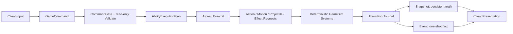

Session - 챔피언 투사체·공격·대시·스택·표식 디테일을 서버 권위의 데이터 주도 공용 구조로 설계한다.

# Winters 챔피언 투사체·공격·대시·상태 디테일 아키텍처

작성일: 2026-07-12

상태: 구현 전 설계 기준 및 단계별 이관 가이드

적용 범위: LoL `Shared/GameSim`, Server, Client presentation, Data/Tools/SimLab

비적용 범위: Elden 전투 규칙, 렌더러/RHI 상세, 실제 라이브 LoL 수치 복제

## 0. 한 줄 결론

투사체와 대시는 `Engine`의 렌더 오브젝트나 챔피언별 update loop로 관리하지 않는다. `Shared/GameSim`이 결정론적 gameplay 의미와 수명을 소유하고, Server가 월드 질의와 데이터 팩을 주입하며, Client는 Snapshot/Event를 받아 시각화만 한다.

목표 흐름은 다음 하나다.

```text
Client intent
-> GameCommand
-> read-only Validate + AbilityExecutionPlan
-> atomic Commit
-> Action / Motion / Projectile / Effect requests
-> deterministic GameSim systems
-> DamageResolved / HitConfirmed / StateChanged journal
-> Snapshot(current truth) + Event(one-shot fact)
-> Client animation / FX / UI
```

챔피언 디테일은 다음 네 층으로 나눈다.

| 층 | 소유하는 것 | 예시 |
|---|---|---|
| 데이터 | 수치와 명시적 정책 | 속도, 사거리, 관통 수, 벽 통과 두께, 스택 최대치 |
| 공용 typed primitive | 반복되는 gameplay 동작 | 투사체 sweep, 대시, 피해, 상태, 스택, 표식, 순찰 |
| 챔피언 모듈 | 새로운 관계와 수명 또는 복합 공식 | 칼리스타 Rend, 제드 죽음의 표식, 야스오 Q variant |
| 엔진 불변식 | 콘텐츠가 바꾸면 안 되는 안전 규칙 | 한 위치 writer, stable ordering, entity generation, stale action 차단 |

범용 시스템은 `Yasuo`, `Kalista`, `Zed`라는 이름을 몰라야 한다. 반대로 복잡한 챔피언 규칙을 숫자 파라미터 16개나 거대한 범용 스크립트에 억지로 밀어 넣지도 않는다.

## 1. 설계 성공 기준

다음 조건을 모두 만족해야 완료다.

1. 투사체의 소멸, 관통, 재타격, 사거리, 수명, 지형 충돌, 동적 장막 차단을 데이터와 공용 정책으로 설명할 수 있다.
2. 야스오 W 같은 장막은 Client FX가 아니라 서버 월드의 권위 차단체다.
3. 원거리 기본 공격도 `ImpactDelivery=Projectile`이면 실제 서버 투사체를 생성해 장막과 충돌한다.
4. 대시·블링크·넉백·끌어오기·복귀는 finite Motion proposal로 만들고, 한 entity당 단일 `PositionAuthorityArbiter`만 최종 위치를 쓴다.
5. 벽 통과 여부는 호출한 helper의 우연이 아니라 `TerrainTraversalPolicy`와 벽 두께/착지 정책으로 결정된다.
6. 공격은 command 승인, windup, impact, recovery를 분리하고 stale action generation이 impact를 만들지 못한다.
7. 야스오/요네 Q처럼 여러 대상을 맞혀도 시전당 한 번만 발동하는 반응을 `OncePerExecution`으로 표현한다.
8. 칼리스타 창은 `source-target`별 서버 스택이고, Client는 스택 수를 시각화할 뿐 HP나 스택을 직접 바꾸지 않는다.
9. 제드 R은 실제 확정 피해를 지정된 기준으로 누적하며, lethal 표시는 서버 예측 상태를 시각화한다.
10. 진행 중 투사체, Motion, 스택, 표식, 장막은 late join/reconnect Snapshot으로 복원된다.
11. 기획자는 JSON/에디터에서 값과 허용 정책을 바꾸고 validate/cook/SimLab을 통과할 수 있다.
12. 신규 공용 경로가 검증되면 기존 champion/client/server 중복 경로를 실제로 삭제한다.

## 2. 현재 코드 증거와 구조 부채

아래는 문서 작성 시점의 dirty worktree를 읽기 전용으로 감사한 결과다. 이미 진행 중인 사용자 변경은 이 문서에서 수정하지 않는다.

| 영역 | 현재 근거 | 현재 한계 |
|---|---|---|
| 스킬 투사체 상태 | `Shared/GameSim/Components/SkillProjectileComponent.h:13` | 속도·거리·반경·피해와 64개 hit ledger는 있으나 typed 정책/definition identity가 없다. |
| 투사체 종류 | `Shared/GameSim/Components/ProjectileKindComponent.h:5` | `u16 enum + switch`가 콘텐츠 identity와 정책을 동시에 떠안는다. |
| 서버 이동/충돌 | `Server/Private/Game/GameRoomProjectiles.cpp:232-577` | Tornado만 관통, 미니언 탄환만 별도 지형 정책, Lee Sin/Sylas/Yasuo 분기가 서버 루프에 있다. |
| hit 탐색 | `Server/Private/Game/ServerProjectileAuthority.cpp:53` | 매 projectile마다 mobile unit 전체를 훑고 kind 특례로 target을 필터링한다. |
| 네트워크 | `Shared/Schemas/Snapshot.fbs:73-78`, `Shared/Schemas/Event.fbs:46-68`, `Server/Private/Game/SnapshotBuilder.cpp:379-390` | current projectile와 Spawn/Hit 뼈대는 있으나 stable `DefinitionKey`, direction/velocity, blocked/expired reason이 없고 skill projectile targetNet도 채워지지 않는다. |
| replication identity | `Shared/GameSim/Replication/EntityIdMap.h:11-54` | raw `EntityID <-> NetEntityId`만 있고 generation 발급/bind/unbind 계약이 없다. |
| projectile visual owner | `Client/Public/Network/Client/EventApplier.h:89`, `Client/Private/Network/Client/EventApplier.cpp:678-736` | EventApplier만 projectile visual map을 소유해 Snapshot mid-flight 복원과 같은 registry를 쓸 수 없다. |
| event identity | `Server/Private/Game/GameRoomReplication.cpp:54-104` | 한 tick의 여러 Event envelope가 같은 `tickIndex` sequence를 써 piercing contact별 exactly-once identity가 없다. |
| Client visual | `Client/Private/GameObject/Projectile/ProjectileVisualCatalog.cpp:49` | `projectileKind` switch로 cue를 고르며 데이터 팩과 분리되어 있다. |
| 야스오 장막 | `Shared/GameSim/Champions/Yasuo/YasuoGameSim.cpp:398-401` | 서버 W는 로그뿐이다. 실제 장막 충돌은 Client 시각 시스템에만 있다. |
| 원거리 BA | `Shared/GameSim/Systems/Combat/CombatActionSystem.cpp:240-303` | impact tick에 직접 `DamageRequest`를 만들기 때문에 장막이 막을 실제 missile이 없다. |
| 공격 사거리 | `CommandExecutor.cpp:2690-2737`, `AttackChaseSystem.cpp:251-374` | source/target radius와 chase/nav segment 재사용은 좋지만 impact 시 사거리 재검사 정책이 없다. |
| BA 타이밍 | `CommandExecutor.cpp:2801-2802` | `uImpactTick`과 `uEndTick`이 같아 authored windup과 recovery가 분리되지 않는다. |
| 이동 질의 | `ICommandExecutor.h:15-31` | point/segment/clamp/path/height만 있고 obstacle entry/exit, normal, wall thickness가 없다. |
| 대시 | 각 `*GameSim.cpp`와 `SkillCooldownSystem.cpp:63-160` | 9개 이상의 champion loop가 lerp/clamp/arrival를 복제하고 칼리스타 대시는 cooldown system이 위치를 쓴다. |
| 도착 보정 | `Shared/GameSim/Systems/Move/DashArrival.h:11` | 일반 이동용 nearest reachable 보정을 재사용해 스킬별 최대 보정 거리나 near/far side 계약이 없다. |
| 강제 이동 | `StatusEffectSystem.cpp`, `KalistaGameSim.cpp`, `YoneGameSim.cpp` | airborne, carry, return이 각자 직접 Transform을 쓰고 wall policy가 일관되지 않다. |
| 순찰 | `WaypointPatrolComponent.h`, `WaypointPatrolSystem.cpp` | 공용 PingPong/Loop/nav path가 이미 있으나 칼리스타 W가 별도 `fmod` 왕복을 구현한다. |
| 상태 이상 | `GameplayComponents.h:383-469`, `StatusEffectSystem.cpp` | capability/이속/수명에는 적합하지만 임의 스택 payload, expiry callback, 누적 피해 원장은 없다. |
| 훅 | `GameplayHookRegistry.h:9-25` | `void HookFn`이라 validation 실패와 execution plan을 원자적으로 반환할 수 없다. |
| 칼리스타 E | `KalistaGameSim.cpp:135-198` | 서버 창 스택 없이 범위 안 적에게 stun만 적용한다. |
| 칼리스타 Q/W 배선 | `KalistaGameSim.cpp:935-946`, `CommandExecutor.cpp:1164-1167,1430-1435` | Q 서버 훅이 없고 W 등록 variant와 executor 조회 variant가 달라 W 본문이 정상 command에서 호출되지 않을 수 있다. |
| 칼리스타 legacy | `Client/Private/GameObject/Champion/Kalista/KalistaRendSystem.cpp:18-125`, `Client/Private/GameObject/Champion/Kalista/KalistaProjectileSystem.cpp:21-123` | Client가 스택과 HP를 직접 바꾸는 local-only truth다. |
| 야스오 Q | `YasuoGameSim.cpp:526-549`, `GameRoomProjectiles.cpp:491-514` | 일반 Q hit 스택은 있으나 관통과 시전당 1회 proc이 분리되지 않았고 Snapshot에 스택이 없다. |
| 요네 Q | `YoneGameSim.cpp:427-460` | 선분 피해만 있고 Q stack/3타 state가 없다. |
| 제드 R | `ZedGameSim.cpp:636-727,845-908` | 뒤 이동·3초 표식·pop은 있으나 현재 pop은 `missingHealth * ratio`뿐이며 누적 피해와 lethal state가 없다. |
| 확정 피해 초크포인트 | `DamageQueueSystem.cpp:316-335` | `DamageResult.finalAmount`를 얻지만 내부 gameplay reaction journal로 전달하지 않는다. |

현재 재사용해야 할 기반도 명확하다.

- `GameplayDefinitionPack`, `GameplayDefinitionQuery`, `DefinitionKey`와 ServerPrivate/ClientPublic 분리
- `TickContext`의 fixed tick, entity map, walkability/lag compensation 주입 경계
- `DamageRequest -> DamageResult`, `StatusEffectSystem`, `GameplayStateQuery`
- `ActionStateComponent.sequence`와 `CombatActionComponent.uOwnerActionSequence`의 stale action 차단
- `WaypointPatrolComponent`, `MoveTargetComponent`, `MoveSystem`
- Projectile Snapshot, Spawn/Hit Event, `FxCuePlayer`/WFX 경로
- practice typed command와 session-only override 경로

## 3. 계층별 소유권

| 계층 | 반드시 소유 | 소유하면 안 되는 것 |
|---|---|---|
| Engine | ECS/공간질의/NavGrid/충돌 primitive, renderer, resource, FX renderer | LoL 투사체 관통 규칙, 야스오 장막 의미, 칼리스타 스택 |
| Shared/GameSim | gameplay definition 타입, action/motion/projectile/state/damage 계약, 결정론 시스템 | Engine/DX/UI/ImGui 타입, asset path |
| Server | ServerPrivate pack 주입, 권위 tick, Engine 공간질의 adapter, Snapshot/Event 송신 | Client FX, champion visual asset |
| Client | input, 약한 presentation prediction, interpolation, animation/FX/UI/debug | HP/스택/피해/명중/최종 위치 truth |
| Tools/Editor | JSON 편집, schema validate, cook, preview, scenario 생성 | normal F5 서버 경로 우회, runtime JSON 파싱 |



`ProjectileSystem`과 `MotionSystem`은 Shared/GameSim에 둔다. 다만 static terrain sweep의 실제 NavGrid/geometry 구현은 Server adapter가 `TickContext`에 주입한다. 이 구조가 Shared의 Engine include 금지와 서버 권위를 동시에 지킨다.

## 4. 공통 실행 transaction

### 4.1 Validation과 Commit을 분리한다

현재처럼 cooldown/action을 먼저 소비하고 `void` champion hook이 나중에 실패하는 구조를 확장하지 않는다.

```text
BuildExecutionPlan (read-only)
  - capability, target, range, sight, terrain, resource, cooldown 검사
  - action timeline 확정
  - motion endpoint 해결
  - spawn/effect request 준비

CommitExecutionPlan (single commit)
  - mana/cooldown/action generation 적용
  - queued move policy 적용
  - typed request enqueue
  - commit 실패 시 gameplay mutation 0
```

`Capacity` reject enum만으로 원자성이 생기지는 않는다. plan build 뒤 `TryReserveExecutionResources` 단계가 필요한 status/relation slot, bounded request queue, projectile/motion slot과 entity handle을 전부 사전 예약한다. 예약 성공 뒤 Commit은 실패하지 않는 연산만 수행한다. 예약 실패는 gameplay mutation 없이 release하고 reject한다. Debug에서 Commit 중 불가능한 실패가 나면 invariant failure로 가시화하며 부분 성공으로 계속하지 않는다.

목표 계약의 핵심 형태는 다음과 같다. 이름과 용량은 구현 슬라이스에서 현재 ECS 제약에 맞춰 확정한다.

```cpp
enum class ExecutionRejectReason : u8_t
{
    None,
    StateBlocked,
    InvalidTarget,
    OutOfRange,
    TerrainBlocked,
    InvalidLanding,
    ResourceMissing,
    Cooldown,
    Capacity,
    DefinitionMissing,
};

struct GameplayExecutionId
{
    EntityHandle hOwner{};
    u32_t uActionSequence = 0u;
    u16_t uAtomIndex = 0u;
};

struct GameplayAttribution
{
    EntityHandle hEmitter{};
    EntityHandle hCreditOwner{};
    eTeam eSourceTeam = eTeam::Neutral;
    DefinitionKey uAbilityKey = kInvalidDefinitionKey;
    u32_t uActionSequence = 0u;
};
```

`hEmitter`와 `hCreditOwner`를 분리해야 제드 그림자가 쏜 Q도 제드 R 누적과 kill credit에 정확히 귀속된다. 복제/빙의/탈취 스킬도 base champion 이름이 아니라 실제 `AbilityKey + attribution`으로 동작한다.

process-local 장기/지연 참조는 raw `EntityID`가 아니라 기존 `EntityHandle` 또는 동등한 `id+generation`을 저장하고 매 사용 시 `CWorld::TryResolveEntity` 계열로 resolve한다. wire에는 process-local handle을 보내지 않고 `NetEntityId + replication spawn generation`을 사용한다. projectile, motion, hit ledger, blocker, relation, delayed transition 모두 같은 규칙을 따른다.

현재 `EntityIdMap`은 raw `EntityID <-> NetEntityId`만 저장하고 generation owner가 없다. projectile마다 임의 generation을 붙여 이 문제를 가리지 말고 공용 replication identity부터 확장한다.

```cpp
struct NetEntityRef
{
    NetEntityId uNetId = NULL_NET_ENTITY;
    u32_t uReplicationGeneration = 0u;
};
```

- `EntityIdMap`이 net id별 replication generation 발급과 local `EntityHandle` binding을 소유한다.
- `0` generation은 invalid다. 같은 net id를 새 entity에 bind할 때 generation을 증가시키며, 현재처럼 match 동안 net id를 재사용하지 않더라도 계약은 동일하다.
- Client의 동일 `(netId, generation)` bind는 idempotent, 더 새 generation은 이전 local handle/visual을 invalidation, 더 오래된 generation은 reject한다.
- `Unbind(NetEntityRef)`는 generation까지 일치할 때만 제거한다. 늦게 온 old despawn이 새 entity를 지우면 안 된다.
- `projectileStateGeneration`, action sequence, relation generation은 각각 gameplay 상태 갱신용이며 entity lifetime generation을 대체하지 않는다.

현재 `DamageRequest`에는 이 execution/attribution이 없고 `DamageResult`도 최종 HP 감소만 제공한다. 목표 damage contract는 다음 정보를 end-to-end로 보존한다.

```text
DamageRequest:
  GameplayExecutionId, GameplayAttribution, DefinitionKey,
  DamageTags, EffectInputSamplingPolicy, immutable sampled payload

DamageResult:
  rawBeforeMitigation, postMitigationDamage, shieldAbsorbed,
  finalHealthLoss, overkillOrClampedAmount, outcomeFlags, killed
```

이 확장이 먼저 있어야 제드 그림자 attribution, 실제 피해 누적, health floor/shield 구분, OncePerExecution reaction이 구현 가능하다.

### 4.2 시스템 flush 순서

같은 tick의 결과 순서를 아래처럼 고정한다.

```text
1. command accept + execution plan commit
2. action impact requests
3. active motion step
4. projectile/shape contact collection
5. primary effect + damage/status commit
6. DamageResolved / HitConfirmed reaction
7. counter/stack/mark update
8. due timed effects and detonation requests
9. bounded secondary effect/damage commit
10. death/lifetime cleanup
11. transition journal -> Snapshot/Event
```

공통 수명은 `[startTick, endTick)`으로 정의한다. `endTick == currentTick`인 CC와 장막은 command/collision query에서 이미 비활성이다. due entry는 tick 시작에 표시하되 실제 제거 callback은 정해진 phase에서 한 번 실행한다.

제드 accumulator처럼 trigger tick의 primary damage를 포함해야 하는 state는 `includeTriggerTickDamage`를 명시한다. 이 경우 relation은 command/collision 상태로는 만료됐더라도 primary `DamageResolved` receipt를 받은 뒤 8단계에서 detonate한다. 이 순서면 trigger tick의 마지막 피해를 포함하고, detonation은 2차 bounded flush에서 처리할 수 있다. detonation request에는 `NoReaccumulate` tag를 넣어 자기 피해를 다시 표식에 누적하지 않는다.

1차 피해가 HP를 0으로 만들면 `HealthComponent.bIsDead` 또는 별도 `Dying` truth를 즉시 세운다. 이후 같은 tick의 primary/secondary target gate는 이를 보고 피해/상태를 거절하며, score/death credit은 generation당 한 번만 적용한다. 시각 death cleanup이 10단계까지 남아 있는 것과 gameplay targetability를 혼동하지 않는다.

## 5. 투사체 아키텍처

### 5.1 투사체 definition이 답해야 하는 질문

| 범주 | 필수 질문 |
|---|---|
| Identity | 어떤 stable `DefinitionKey`인가, 어느 ability/action에서 나왔는가 |
| Flight | 1차 지원 Linear/Homing 중 무엇인가 |
| Target loss | 대상 사망/untargetable 시 소멸, 직진, 재타겟 중 무엇인가 |
| Lifetime | 최대 이동 거리와 hard lifetime은 얼마인가 |
| Collision | 반경/높이, target kind/team mask는 무엇인가 |
| Terrain | 지형 첫 접촉 소멸, 정지, 무시 중 무엇인가 |
| Dynamic blocker | 어떤 blocker category에 막히며 막힐 때 어떻게 되는가 |
| Unit hit | 첫 hit 소멸 또는 관통 중 무엇인가 |
| Multi-hit | 최대 unique hit, 대상별 hit 수, rehit cooldown은 얼마인가 |
| Payload | hit/block/expire 시 어떤 typed effect program을 실행하는가 |
| Source lifetime | 발사자 사망 뒤 유지/소멸 중 무엇인가 |
| Replication | late join과 one-shot cue에 필요한 상태/사건은 무엇인가 |

### 5.2 목표 C++ definition

```cpp
enum class ProjectileFlightMode : u8_t
{
    Linear,
    Homing,
};

enum class ProjectileTargetLossPolicy : u8_t
{
    Expire,
    ContinueStraight,
};

enum class ProjectileTerrainPolicy : u8_t
{
    StopAtFirstBarrier,
    DestroyAtFirstBarrier,
    IgnoreStaticTerrain,
};

enum class ProjectileUnitHitPolicy : u8_t
{
    Destroy,
    Pierce,
};

enum class ProjectileBlockResponse : u8_t
{
    Destroy,
    Stop,
};

enum class ProjectileBlockabilityPolicy : u8_t
{
    Blockable,
    Unblockable,
};

enum class ProjectileCollisionSelectionPolicy : u8_t
{
    FirstEligible,
    IntendedTargetOnly,
};

enum class EffectInputSamplingPolicy : u8_t
{
    Commit,
    Launch,
    Hit,
};

struct ProjectileFlightSpec
{
    ProjectileFlightMode eMode = ProjectileFlightMode::Linear;
    ProjectileTargetLossPolicy eTargetLoss = ProjectileTargetLossPolicy::Expire;
    f32_t fSpeed = 0.f;
    f32_t fTurnRateRadiansPerSec = 0.f;
    f32_t fMaxTravelDistance = 0.f;
    u32_t uMaxLifetimeTicks = 0u;
};

struct ProjectileCollisionSpec
{
    ProjectileTerrainPolicy eTerrainPolicy =
        ProjectileTerrainPolicy::DestroyAtFirstBarrier;
    ProjectileUnitHitPolicy eUnitHitPolicy = ProjectileUnitHitPolicy::Destroy;
    ProjectileBlockResponse eBlockResponse = ProjectileBlockResponse::Destroy;
    ProjectileBlockabilityPolicy eBlockability =
        ProjectileBlockabilityPolicy::Blockable;
    ProjectileCollisionSelectionPolicy eSelection =
        ProjectileCollisionSelectionPolicy::FirstEligible;
    f32_t fRadius = 0.5f;
    f32_t fMinHeight = -1000.f;
    f32_t fMaxHeight = 1000.f;
    f32_t fDamageMultiplierPerPierce = 1.f;
    u32_t uTargetKindMask = 0u;
    u32_t uTargetRelationMask = 0u;
    u32_t uInteractionMask = 0u;
    u8_t uMaxUniqueHits = 1u;
    u8_t uMaxHitsPerTarget = 1u;
    u16_t uRehitCooldownTicks = 0u;
    u16_t uSourceIgnoreTicks = 1u;
    f32_t fSourceIgnoreDistance = 0.f;
    bool_t bRequireTargetable = true;
};

struct ProjectileGameplayDef
{
    DefinitionKey uKey = kInvalidDefinitionKey;
    ProjectileDefId DefId{};
    ProjectileFlightSpec Flight{};
    ProjectileCollisionSpec Collision{};
    DefinitionKey uOnHitProgramKey = kInvalidDefinitionKey;
    DefinitionKey uOnBlockProgramKey = kInvalidDefinitionKey;
    DefinitionKey uOnExpireProgramKey = kInvalidDefinitionKey;
    EffectInputSamplingPolicy eInputSampling = EffectInputSamplingPolicy::Launch;
    bool_t bPersistAfterSourceDeath = true;
};
```

`ProjectileDefId`는 pack-local dense id이고 wire/save에는 쓰지 않는다. wire와 Client visual lookup에는 stable `DefinitionKey`를 쓴다.

`uInteractionMask`는 `YasuoWindWall` 같은 챔피언 이름 bit가 아니다. authoring string tag를 cook해 만든 generic category mask다. 예를 들면 `LinearMissile`, `TargetedMissile`, `BasicAttackMissile`, `ChampionSkillMissile`이다. blockability는 tag 조합으로 추론하지 않고 `eBlockability`가 명시한다.

1차 구현은 `Linear/Homing + Destroy/Pierce + Destroy/Stop block response`만 지원한다. Ballistic, Return, Attach, Bounce, Reflect는 실제 champion vertical slice가 생길 때 attribution, trajectory, ledger, replication, test 계약을 함께 추가한다. 알 수 없는 enum을 Linear/Destroy로 조용히 fallback하지 않는다.

### 5.3 runtime state

```cpp
struct ProjectileHitLedgerEntry
{
    EntityHandle hTarget{};
    u64_t uNextAllowedTick = 0u;
    u8_t uHitCount = 0u;
    u32_t uAppliedAtomMask = 0u;
};

struct SampledEffectInputs
{
    f32_t Values[kMaxSampledEffectInputs]{};
    u8_t uCount = 0u;
};

struct ProjectileStateComponent
{
    ProjectileDefId DefId{};
    DefinitionKey uDefinitionKey = kInvalidDefinitionKey;
    GameplayExecutionId Execution{};
    GameplayAttribution Attribution{};
    EntityHandle hTarget{};
    Vec3 vOrigin{};
    Vec3 vDirection{ 0.f, 0.f, 1.f };
    f32_t fTraveledDistance = 0.f;
    u64_t uSpawnTick = 0u;
    u64_t uExpireTick = 0u;
    u32_t uGeneration = 0u;
    u32_t uAppliedOnceAtomMask = 0u;
    SampledEffectInputs SampledInputs{};
};

struct ProjectileHitLedgerComponent
{
    ProjectileHitLedgerEntry Hits[kMaxProjectileLedgerEntries]{};
    u8_t uHitEntryCount = 0u;
};
```

projectile entity의 `TransformComponent`가 현재 위치의 canonical truth이고 `ProjectileSystem`만 이를 쓴다. `ProjectileStateComponent`에 현재 위치 사본을 두지 않는다. `vOrigin`, direction, sampled inputs는 trajectory/late join/effect 계산용 immutable 또는 단일-writer 상태다. Pierce/rehit profile에만 optional `ProjectileHitLedgerComponent`를 붙인다.

profile의 `uMaxUniqueHits`가 fixed runtime cap보다 크면 cook이 실패해야 한다. live projectile가 ledger cap에 닿았을 때 조용히 의미를 바꾸면 안 된다. source-death 뒤에도 유지되는 projectile은 hit 시 source component를 다시 읽어야 하는 input policy를 사용할 수 없으며, 필요한 값이 launch payload에 캡처됐는지 cooker가 검증한다. BA on-hit/crit RNG를 Commit/Launch/Hit 중 어느 tick에 소비하는지도 definition과 SimLab으로 고정한다.

### 5.4 collision과 CCD 순서

빠른 투사체는 현재 위치의 점 충돌이 아니라 `previous -> next` swept circle/capsule로 검사한다.

한 step의 후보는 다음 순서로 처리한다.

1. remaining travel/lifetime을 적용해 정확한 end를 계산한다.
2. static terrain barrier span을 구한다.
3. active `ProjectileBlockerComponent` 후보를 구한다.
4. target unit swept hit 후보를 구한다.
5. TOI를 quantize하고 `(TOI, collision priority, resolved stable entity sort key)`로 정렬한다. sort key에는 handle generation을 포함한다.
6. 동일 TOI에서는 `StaticBarrier -> DynamicProjectileBlocker -> Unit -> RangeEnd` 순서로 처리한다.
7. unit hit policy가 Pierce면 ledger를 갱신하고 같은 segment의 다음 후보를 계속 처리한다.
8. gameplay effect는 inline HP mutation이 아니라 typed request queue로 보낸다.

float equality에 직접 의존하지 않도록 TOI는 Q16 또는 동일한 고정 양자화 규칙을 사용한다. 같은 seed와 command stream은 같은 첫 충돌과 같은 hit 순서를 만들어야 한다.

unit과 blocker도 tick 사이에 움직이므로 projectile chord 대 현재 target 점만 검사하지 않는다. tick 시작의 previous pose와 current proposal을 사용한 relative-motion sweep을 수행한다. Homing이 한 tick에 크게 선회하면 bounded chord subdivision 또는 conservative swept volume을 사용한다.

spawn 시에는 다음을 별도로 처리한다.

- emitter/self는 `uSourceIgnoreTicks` 또는 `fSourceIgnoreDistance` 안에서 제외한다.
- spawn point가 static wall/blocker 안이면 `SpawnBlocked`로 실패시키고 projectile/effect resource commit 정책을 plan에서 결정한다. 임의로 벽 밖으로 teleport시키지 않는다.
- intended-target-only missile은 경로의 다른 unit을 target 후보로 바꾸지 않는다.
- first-eligible missile은 `uTargetKindMask + uTargetRelationMask`로 self/ally/enemy/neutral을 필터링한다.
- contact 직전에 alive, handle generation, team relation, targetable/invulnerable 정책을 다시 검증한다.

### 5.5 소멸과 관통은 hit 반응과 proc 횟수와 별개다

다음을 서로 다른 필드로 둔다.

```text
ProjectileUnitHitPolicy = Pierce
uMaxUniqueHits = 8
uMaxHitsPerTarget = 1
EffectApplicationScope(Damage) = OncePerTargetPerExecution
EffectApplicationScope(AddQStack) = OncePerExecution
```

이렇게 해야 야스오/요네 Q가 여러 대상을 맞혀 피해는 대상별로 주되 Q stack은 시전당 한 번만 얻는다. 현재처럼 첫 대상에서 projectile을 없애 proc 1회를 간접 보장하지 않는다.

### 5.6 사거리와 수명

`fMaxTravelDistance`와 `uMaxLifetimeTicks`를 둘 다 둔다.

- Linear은 실제 이동한 누적 거리로 range를 소비한다.
- Homing은 곡선 추적 거리로 range를 소비하며 직선 caster-target 거리로 되돌아가지 않는다.
- hard lifetime은 0속도/원운동/target jitter 같은 비정상 영속을 막는다.
- 발사 뒤 caster가 이동해도 origin과 travel budget은 변하지 않는다.
- target을 잃었을 때의 처리도 profile에 명시한다.
- expire reason은 `RangeExpired`, `LifetimeExpired`, `TargetLost`, `SourceInvalid`, `StaticBlocked`, `DynamicBlocked`, `HitLimit`로 구분한다.

현재의 target 없는 `ProjectileHit` 하나로 모든 종료를 표현하지 않는다. 종료 reason이 있어야 Client cue와 QA 로그가 의미를 잃지 않는다.

## 6. 야스오 바람 장막과 동적 투사체 차단체

바람 장막은 서버 월드 entity다.

```cpp
enum class ProjectileBlockerShape : u8_t
{
    Segment,
    Capsule,
    Box,
};

struct ProjectileBlockerComponent
{
    DefinitionKey uDefinitionKey = kInvalidDefinitionKey;
    GameplayExecutionId Execution{};
    EntityHandle hOwner{};
    eTeam eOwnerTeam = eTeam::Neutral;
    ProjectileBlockerShape eShape = ProjectileBlockerShape::Segment;
    f32_t fHalfWidth = 0.f;
    f32_t fHalfDepth = 0.f;
    f32_t fMinHeight = -1000.f;
    f32_t fMaxHeight = 1000.f;
    u32_t uIncludeInteractionMask = 0u;
    u32_t uExcludeInteractionMask = 0u;
    u32_t uBlockedSourceRelationMask = 0u;
    u64_t uEndTick = 0u;
};
```

blocker entity의 `TransformComponent`가 center/facing의 canonical truth다. blocker component에 world center/forward 사본을 두지 않는다.

처리 규칙:

- projectile의 `eBlockability == Unblockable`이면 mask와 무관하게 통과한다.
- 그 외에는 projectile category가 include mask와 교차하고 exclude mask와는 교차하지 않아야 한다. exclude가 우선한다.
- self/ally/enemy/neutral source 관계는 `uBlockedSourceRelationMask`로 판정한다. allied 통과를 별도 bool이나 champion 이름으로 추론하지 않는다.
- exact same TOI의 unit보다 blocker가 먼저 처리된다.
- block 시 `ProjectileBlocked` transition을 남기고 1차 지원 block response인 파괴/정지 중 하나를 적용한다.
- Client는 장막 WFX와 block impact FX를 재생하지만 collision을 판정하지 않는다.
- 장막 자체는 Snapshot으로 수명/위치/방향을 복원하고, block impact는 Event로 한 번 재생한다.

광선, 즉시 선분 판정, 지면 장판을 무조건 projectile로 만들지 않는다. 이들은 `ShapeHitRequest` 또는 `AreaEffect`이고 장막 차단 여부가 필요하면 별도의 `InteractionMask` 정책을 명시한다.

## 7. 공격 판정과 보정

### 7.1 기본 공격도 공통 action timeline을 사용한다

```text
Accepted
-> Windup
-> ImpactDelivery
-> Recovery
-> End
```

`uImpactTick = start + windupTicks`, `uEndTick = impact + recoveryTicks`로 분리한다. 공속은 서버가 두 구간을 authoring policy에 따라 scale하고 Client animation speed는 복제 공속/action ticks에 맞춘다.

`ImpactDelivery`는 다음 중 하나다.

| 종류 | impact tick 결과 |
|---|---|
| MeleeTarget | target/reach/LOS 정책 재검사 후 DamageRequest |
| Projectile | gameplay launch origin에서 권위 ProjectileState 생성 |
| InstantShape | line/cone/circle query 후 hit requests |

원거리 champion/minion/turret BA가 장막에 막혀야 하면 반드시 `Projectile` delivery를 사용한다.

권위 launch origin은 source Transform/facing/gameplay radius와 ServerPrivate authored gameplay offset으로 계산한다. Shared/Server가 FBX bone이나 muzzle socket을 조회하면 안 된다. ClientPublic muzzle bone/FBX offset은 visual tracer 시작점만 맞추고 server projectile trajectory에 빠르게 converge/adopt한다. gameplay collision sweep은 권위 launch origin부터 시작한다.

### 7.2 사거리 정의

표면 간 도달 거리로 한 곳에서 계산한다.

```text
surfaceDistance = max(0, centerDistance - sourceGameplayRadius - targetGameplayRadius)
inRange = surfaceDistance <= authoredRange
```

현재 `attackRange + sourceRadius + targetRadius` 방식과 의미상 같지만, `CombatReachQuery`라는 이름의 공용 query로 모아 command accept, chase, impact가 같은 계산을 사용하게 한다.

공격 LOS와 이동 walkability는 같은 개념이 아니다.

- 이동: agent radius가 통과 가능한 경로인가
- melee reach: 공격 shape와 static combat barrier가 닿는가
- projectile: projectile radius/height와 terrain policy가 통과하는가

초기 NavGrid adapter는 재사용하되 API와 debug reason을 분리한다.

### 7.3 승인 시점과 impact 시점 정책

공격 definition이 다음을 명시한다.

```cpp
enum class RangeRecheckPolicy : u8_t
{
    StartOnly,
    StartAndImpact,
    UntilProjectileLaunch,
};

enum class TargetLockPolicy : u8_t
{
    CancelIfInvalid,
    KeepLastPosition,
    RetargetNearest,
};
```

권장 기본값:

- melee: `StartAndImpact`
- ranged BA: accept/windup까지 range와 target을 검사하고 projectile launch 뒤에는 projectile target-loss policy가 소유
- hitscan: impact tick에 historical/current policy를 명시
- action owner sequence가 바뀌면 무조건 stale impact 취소
- caster가 이동할 때 cancel/queue/lock은 `CombatActionMovePolicy`로 명시

### 7.4 chase

기존 `AttackChaseComponent/System`을 재사용하되 다음을 보정한다.

- chase 중 사거리/반경이 바뀌면 definition/stat에서 다시 계산하고 시작 때 저장한 값만 믿지 않는다.
- target이 벽 뒤에 있으면 stop range 0으로 path를 찾되 공격 accept는 clear combat segment가 있어야 한다.
- skill chase도 basic attack과 같은 typed target/reach query를 사용한다.
- `AttackChaseSystem`이 새 path를 만든 tick에 이동을 시작할지 다음 tick에 시작할지 phase를 명시하고 SimLab hash로 고정한다.

### 7.5 lag compensation

현재 `ILagCompensationQuery` 경계를 확장해 command accept에만 제한적으로 사용한다.

- command의 `clientTick`을 서버 허용 rewind window로 clamp한다.
- historical position, gameplay radius, alive/targetable generation을 조회한다.
- resource/cooldown/CC는 현재 서버 state를 사용한다.
- projectile flight는 과거로 되감아 즉시 맞히지 않는다. 서버 spawn tick부터 권위 이동한다.
- Client는 시각을 server tick에 맞춰 fast-forward할 수 있지만 collision 결과를 만들지 않는다.
- rewind 결과와 current impact policy를 debug evidence에 함께 남긴다.

## 8. 공용 Motion과 대시/블링크 보정

### 8.1 대시와 블링크를 구분한다

| Motion | 시간 경과 | 중간 충돌 | 대표 endpoint 의미 |
|---|---|---|---|
| Dash | 있음 | sweep 필요 | 방향/대상까지 이동 |
| Blink | 즉시 또는 1 tick | 중간 경로 무시 가능 | 유효 endpoint로 순간 이동 |
| Knockback/Pull | 있음 | 강제 이동 우선순위 | 외력 방향 또는 gather point |
| ReturnToAnchor | 있음/즉시 | 별도 정책 | 생성 당시 anchor 복귀 |
| CarryAttach | owner 추종 | attachment provider | 칼리스타 R carry 등 |
| Patrol | 지속 | locomotion intent | waypoint 반복 |

`ActiveMotionComponent`는 시작과 끝이 있는 Dash/Blink/Knockback/Pull/Return만 소유한다. Patrol은 기존 `WaypointPatrol -> MoveTarget` locomotion intent로, CarryAttach는 별도 attachment position provider로 유지한다. 최종 위치는 모든 provider 위의 `PositionAuthorityArbiter` 한 곳만 쓴다. `eSkillActionMovePolicy::ForcedMotion`은 입력 잠금만 표현한다.

### 8.2 목표 Motion contract

```cpp
enum class MotionKind : u8_t
{
    Dash,
    Blink,
    Knockback,
    Pull,
    ReturnToAnchor,
};

enum class TerrainTraversalPolicy : u8_t
{
    BlockAtBarrier,
    BlinkToValidEndpoint,
    CrossBarrierUpToThickness,
    IgnoreTerrainToGuaranteedAnchor,
};

enum class MotionLandingPolicy : u8_t
{
    ExactOrReject,
    StopBeforeBarrier,
    NearestAlongOriginalPath,
    ResolveBeyondFirstBarrier,
    ReturnToStartOnFailure,
};

enum class MotionUnitCollisionPolicy : u8_t
{
    IgnoreUnits,
    StopAtFirstUnit,
    NotifyAndContinue,
};

struct MotionGameplayDef
{
    DefinitionKey uKey = kInvalidDefinitionKey;
    MotionKind eKind = MotionKind::Dash;
    TerrainTraversalPolicy eTerrainPolicy =
        TerrainTraversalPolicy::BlockAtBarrier;
    MotionLandingPolicy eLandingPolicy = MotionLandingPolicy::StopBeforeBarrier;
    MotionUnitCollisionPolicy eUnitPolicy = MotionUnitCollisionPolicy::IgnoreUnits;
    f32_t fMaxDistance = 0.f;
    u32_t uDurationTicks = 0u;
    f32_t fMaxPerBarrierThickness = 0.f;
    f32_t fMaxTotalBlockedThickness = 0.f;
    f32_t fLandingClearance = 0.f;
    f32_t fMaxEndpointCorrection = 0.f;
    u8_t uMaxBarrierCount = 1u;
    bool_t bInterruptible = true;
};

struct ActiveMotionComponent
{
    DefinitionKey uDefinitionKey = kInvalidDefinitionKey;
    GameplayExecutionId Execution{};
    EntityHandle hTarget{};
    Vec3 vStart{};
    Vec3 vDesiredEnd{};
    Vec3 vResolvedEnd{};
    u64_t uStartTick = 0u;
    u64_t uEndTick = 0u;
    u32_t uGeneration = 0u;
};
```

챔피언 모듈은 `MotionRequest`를 만들고 `MotionResolver`가 endpoint를 확정한다. finite motion, attachment, forced motion, locomotion provider는 candidate position과 authority claim을 제출하고 `PositionAuthorityArbiter`만 Transform을 쓴다. champion Tick이 직접 Transform을 lerp하지 않는다.

### 8.3 static combat collision query

현재 `IWalkableQuery`는 wall thickness를 답할 수 없다. Shared에 Engine-free 결과형 interface를 추가한다.

```cpp
struct CombatBarrierSpan
{
    EntityHandle hObstacle{};
    u64_t uObstacleStableKey = 0ull;
    f32_t fEntryDistance = 0.f;
    f32_t fExitDistance = 0.f;
    Vec3 vEntryPoint{};
    Vec3 vExitPoint{};
    Vec3 vEntryNormal{};
    Vec3 vExitNormal{};
    u32_t uLayerMask = 0u;
    bool_t bHasFarSideExit = false;
};

struct CombatSweepResult
{
    CombatBarrierSpan Spans[kMaxCombatBarrierSpans]{};
    u8_t uSpanCount = 0u;
    bool_t bOutOfBounds = false;
};

struct ICombatCollisionQuery
{
    virtual ~ICombatCollisionQuery() = default;
    virtual bool_t SweepStaticCapsuleXZ(
        const Vec3& vFrom,
        const Vec3& vTo,
        f32_t fRadius,
        u32_t uLayerMask,
        CombatSweepResult& OutResult) const = 0;
};
```

동적 장애물은 `hObstacle`, entity가 아닌 static terrain은 NavGrid cell/edge 또는 collision primitive에서 만든 `uObstacleStableKey`로 식별한다. 둘 중 하나는 반드시 유효해야 하며 같은 거리의 span tie-break와 디버그 캡처에 사용한다.

Server는 1차로 현재 0.5 world-unit NavGrid를 agent radius만큼 inflate한 뒤 ordered cell scan으로 blocked span을 만든다. 장기적으로 높이/재질이 필요한 projectile은 combat collision geometry adapter로 교체하되 Shared 정책은 유지한다.

### 8.4 벽 두께 판정 알고리즘

`CrossBarrierUpToThickness`는 다음 순서를 고정한다.

1. caster gameplay radius로 collision field를 inflate한다.
2. start-to-desiredEnd sweep에서 ordered blocked spans를 얻는다.
3. 모든 span의 `exitDistance - entryDistance`를 world unit 두께로 계산한다.
4. 각 두께를 동일 quantization으로 반올림해 `fMaxPerBarrierThickness`와 비교하고, 합계를 `fMaxTotalBlockedThickness`와 비교한다.
5. far-side exit가 없는 map edge/벽 내부 span은 cross 후보가 아니다.
6. 각 far side에 `fLandingClearance`만큼 walkable 공간이 있는지 검사한다.
7. endpoint가 wall 내부라면 landing policy에 따라 far side 검색 또는 cast reject를 선택한다.
8. `uMaxBarrierCount`보다 많은 벽을 한 번에 넘지 않는다.
9. resolved endpoint가 desired endpoint에서 `fMaxEndpointCorrection`보다 멀면 reject한다.

벽 통과 불가 dash는 첫 entry 전의 마지막 유효 지점에서 멈춘다. 전역 nearest walkable 셀을 찾으면 벽 반대편으로 튈 수 있으므로 arrival correction은 반드시 원래 motion corridor와 side에 제한한다.

### 8.5 위치 authority와 interrupt matrix

`PositionAuthorityClass`는 `Attachment`, `ForcedMotion`, `AbilityMotion`, `Locomotion`으로 나누고 current claim과 incoming claim의 `interrupt matrix`가 교체/대기/거절을 결정한다. guaranteed anchor return도 champion 이름이나 고정 최상위 if가 아니라 해당 definition의 authority class와 interrupt policy로 표현한다.

arbiter 적용 대상은 **GameSim이 권위를 가진 mobile actor**다. network Server world와 local smoke의 authority world에는 적용하지만, projectile entity의 kinematics, static blocker, network Client의 Snapshot/interpolation, Client predicted/visual entity는 적용하지 않는다. projectile 위치는 `ProjectileSystem`, Client 표현 위치는 Snapshot/presentation registry가 각자 소유한다.

동일 class/priority 충돌은 `(commitTick, actionSequence, source handle)`의 stable tie-break로 결정한다. Death/entity invalidation은 proposal 경쟁이 아니라 모든 claim을 무효화하는 lifetime gate다.

한 tick에 두 시스템이 Transform을 쓰지 않는다. 각 provider는 position proposal만 만들고 arbiter가 선택한 하나만 적용한다. 완료/차단/중단 결과는 `MotionTransition`으로 champion module과 replication에 전달한다. migration 중에는 ActiveMotion/authority claim 보유 entity에 legacy `MoveSystem`, `StatusEffectSystem`, champion Tick이 직접 Transform을 쓰려 하면 Debug assert/counter가 발생해야 한다.

다만 첫날부터 assert를 켜면 아직 proposal로 바뀌지 않은 writer가 모두 깨진다. cutover는 다음 순서를 지킨다.

1. `Server/Private/Game/GameRoomTick.cpp`와 local-smoke scheduler의 실제 update 순서 및 Transform writer를 계측한다.
2. 기존 writer를 `LegacyPositionProposalAdapter` 또는 정식 provider로 감싸되 기존 결과를 아직 적용한다.
3. arbiter shadow mode가 같은 tick의 모든 proposal을 받아 선택 결과와 기존 최종 위치 차이를 기록한다.
4. 대표 roster에서 차이와 미등록 writer가 0이면 arbiter 한 곳만 최종 적용하도록 전환한다.
5. 그 뒤에만 authority actor의 direct Transform write assert/counter를 enforcement로 올린다.

### 8.6 보정과 Client 표현

Motion Snapshot에는 최소 다음이 필요하다.

```text
motionSequence, definitionKey, kind, startTick, endTick,
start, desiredEnd, resolvedEnd, generation, completion/interruption reason
```

Client는 이 상태로 curve를 재생하고 Snapshot 오차를 보정한다. 칼리스타/야스오마다 별도 local dash transform loop를 유지하지 않는다. 초기 버전은 서버 표현 단일 소스를 우선하고, 이후 local predicted motion을 넣을 때는 `command sequence + motion sequence`로 서버 motion을 adopt해야 한다.

## 9. 상태이상, 스택, 표식, 누적기의 분리

모든 것을 `StatusEffectComponent`에 넣지 않는다.

| runtime family | 의미 | 예시 |
|---|---|---|
| StatusEffect | capability/stat modifier와 수명 | stun, slow, airborne, untargetable |
| Counter | 자기 자신이 가진 작은 상태 | 야스오/요네 Q stack |
| SourceTargetStack | source-target 관계별 stack | 칼리스타가 대상에게 꽂은 창 |
| TimedAccumulator | source-target 관계와 누적 값/trigger | 제드 죽음의 표식 |
| Relationship | 두 entity의 장기 계약/소유 | 칼리스타 oathsworn |

`StatusEffect`의 `StackMagnitude` enum만 확장해 모든 payload를 넣으면 expiry callback, source별 다중 instance, Snapshot, champion formula가 다시 뒤엉킨다.

### 9.1 확정 결과 journal

```cpp
struct HitConfirmedTransition
{
    GameplayExecutionId Execution{};
    GameplayAttribution Attribution{};
    EntityHandle hTarget{};
    DefinitionKey uDeliveryKey = kInvalidDefinitionKey;
    u64_t uTick = 0u;
    bool_t bContactAccepted = false;
    bool_t bDamageRequestIssued = false;
    bool_t bStatusApplied = false;
};

struct DamageResolvedTransition
{
    GameplayExecutionId Execution{};
    GameplayAttribution Attribution{};
    EntityHandle hTarget{};
    f32_t fRawBeforeMitigation = 0.f;
    f32_t fPostMitigationDamage = 0.f;
    f32_t fShieldAbsorbed = 0.f;
    f32_t fFinalHealthLoss = 0.f;
    f32_t fOverkillOrClampedAmount = 0.f;
    u32_t uDamageTags = 0u;
    u32_t uOutcomeFlags = 0u;
    u64_t uTick = 0u;
    bool_t bKilled = false;
};
```

`HitConfirmed`는 collision overlap이 아니라 target validation을 통과하고 최소 하나의 gameplay payload가 commit된 뒤에만 발생한다. 피해가 shield에 전부 흡수되어 최종 HP 감소가 0이어도 유효 contact일 수 있으므로 `HitConfirmed`와 damage outcome을 합치지 않는다.

`uOutcomeFlags`는 target invalid, immune, invulnerable, friendly rejected, shielded, health-floor clamped, killed 같은 결과를 분리한다. 각 proc은 `ContactAccepted`, `DamageRequestIssued`, `PostMitigationDamagePositive`, `HealthLossPositive` 중 무엇을 요구하는지 definition/module이 명시한다. `DamageResolved`는 `CDamageQueueSystem`의 `ApplyDamageRequest` 직후 생성한다.

### 9.2 proc scope

```cpp
enum class EffectApplicationScope : u8_t
{
    EveryHit,
    OncePerTargetPerExecution,
    OncePerExecution,
    FirstHitOnly,
};
```

무기한 전역 `PerExecutionTriggerGate`를 두지 않는다.

- projectile/delivery 자체의 `uAppliedOnceAtomMask`가 OncePerExecution receipt를 수명 끝까지 보존한다.
- per-target ledger entry의 `uAppliedAtomMask`가 OncePerTarget receipt를 보존한다.
- delayed shape처럼 별도 delivery entity가 있는 경우에만 bounded `ExecutionReceiptComponent`를 붙이고 모든 delayed delivery가 끝나면 제거한다.
- action sequence wrap과 owner 재사용은 `EntityHandle + action sequence + atom index`로 구분한다.
- receipt cap과 atom bit 수는 cooker가 검증하고 live eviction은 금지한다.

이렇게 projectile가 action 종료 뒤 적중해도 receipt가 남으며, projectile 관통 여부와 stack proc 횟수가 분리된다.

### 9.3 관계형 상태

관계 하나를 ECS entity로 표현하면 source가 다른 두 칼리스타의 창이나 두 제드의 표식을 자연스럽게 분리할 수 있다.

```cpp
struct GameplayRelationComponent
{
    DefinitionKey uDefinitionKey = kInvalidDefinitionKey;
    EntityHandle hSource{};
    EntityHandle hTarget{};
    u32_t uGeneration = 0u;
};

struct StackRelationComponent
{
    u16_t uStackCount = 0u;
    u16_t uMaxStacks = 0u;
    u64_t uExpireTick = 0u;
};

struct DamageAccumulatorRelationComponent
{
    f32_t fAccumulatedRawDamage = 0.f;
    f32_t fAccumulatedFinalHealthLoss = 0.f;
    u64_t uTriggerTick = 0u;
    bool_t bPredictedLethal = false;
};
```

relation은 `(DefinitionKey, source handle, target handle, application generation)` unique key로 deterministic upsert한다. 같은 tick의 중복 relation entity 생성을 허용하지 않는다.

모든 relation을 source/target death나 cleanse에서 똑같이 지우지 않는다. definition이 다음 정책을 명시하고 공용 lifetime system은 그 정책을 실행한다.

```text
SourceDeathPolicy: Keep | Remove | Trigger
TargetDeathPolicy: Remove | Trigger | Transfer
CleanseCategoryMask
FormTransferPolicy: KeepOnOwner | TransferWithForm | Remove
ExpiryPolicy: Remove | TriggerThenRemove
```

매 tick handle resolve에 실패하면 stale 참조로 정리한다. champion module은 생성 조건, 공식, consume/trigger 결과를 소유한다.

## 10. typed effect program과 챔피언 모듈 경계

authoring graph가 필요해도 runtime에서 임의 Lua/문자열 스크립트를 실행하지 않는다. graph는 fixed typed opcode 배열로 cook한다.

```cpp
enum class EffectAtomKind : u8_t
{
    DealDamage,
    ApplyStatus,
    AddCounter,
    ConsumeCounter,
    AddTargetStack,
    ConsumeTargetStack,
    StartMotion,
    SpawnProjectile,
    SpawnBlocker,
    SpawnSummon,
    EmitCue,
};
```

공용 atom 조합으로 설명되는 스킬은 data로 끝낸다. 다음처럼 새로운 장기 상태/상호 참조/복합 공식이 필요할 때만 champion C++ module이 execution plan 또는 reaction을 만든다.

- 제드 표식이 damage journal을 구독하고 3초 후 detonate
- 칼리스타 source-target 창 원장과 E 다중 target consume
- 비에고 form ownership, 사일러스 탈취, 칼리스타 계약

챔피언 모듈도 HP/Transform을 직접 쓰지 않고 `DamageRequest`, `MotionRequest`, `StateRequest`, `CueRequest`를 만든다.

## 11. 챔피언별 설계 레시피

### 11.1 칼리스타 BA/Q 창과 E Rend

#### 적중

1. BA 또는 Q의 서버 projectile/attack hit가 확정된다.
2. `HitConfirmedTransition`의 `AbilityKey`, credit owner, target을 검사한다.
3. 칼리스타 모듈이 `state.kalista.rend_spear` source-target relation을 생성/증가한다.
4. 동일 execution의 같은 atom은 `OncePerTargetPerExecution`으로 한 번만 증가한다.
5. Snapshot에 source, target, stack count, remaining/flags를 담는다.
6. Client는 stack change Event로 즉시 창 FBX를 붙이고 Snapshot으로 late join을 복원한다.

gameplay stack과 visual spear entity 수를 1:1로 강제하지 않는다. gameplay는 충분한 cap을 가지되 Client는 예를 들어 첫 N개만 개별 FBX로 보이고 이후는 intensity/cluster 표현으로 합칠 수 있다. 시각 cap은 gameplay cap을 바꾸지 않는다.

#### E

E cast 시 caster가 소유한 active spear relation 중 range/targetability 정책을 통과한 대상만 수집한다. 다른 칼리스타 source의 stack은 소비하지 않는다.

기본 피해 구조는 다음 typed formula로 authoring한다.

```text
stackCount == 0 -> 대상 아님
stackCount >= 1 -> BaseDamage
                 + FirstSpearDamage
                 + AdditionalSpearDamage * (stackCount - 1)
                 + authored AD/AP terms
```

각 target의 damage atom과 relation consume atom을 같은 effect transaction에 예약한다. `DamageRequest` enqueue 성공은 실제 damage commit이 아니므로 즉시 stack을 지우지 않는다. consume 조건을 `ValidContact`, `DamageRequestAccepted`, `PostMitigationDamagePositive`, `HealthLossPositive` 중 하나로 data에 명시하고, 해당 `HitConfirmed/DamageResolved` reaction에서 deterministic하게 consume하거나 사전 예약된 atomic batch로 함께 commit한다. slow/stun/kill reset 같은 세부 정책도 별도 atom/챔피언 reaction으로 명시한다.

현재 `Client/Private/GameObject/Champion/Kalista/KalistaRendSystem.cpp`와 `KalistaProjectileSystem.cpp`의 HP/stack writer는 network authority 경로에서 삭제 대상이다. 붙은 창/폭발 FX 생성 함수만 ClientPublic visual definition/cue 쪽으로 재사용한다.

### 11.2 칼리스타 W 원혼 경로

새 전용 이동 loop를 만들지 않고 기존 `WaypointPatrolComponent/System`을 사용한다.

```text
W command direction/ground target
-> RouteResolver
-> TryBuildMovePath
-> bounded waypoint list
-> WaypointPatrolComponent(PingPong or Loop)
-> MoveTargetComponent
-> MoveSystem
```

authoring 필드:

```text
routeMode: DirectionDistance | GroundTargetPath | AuthoredRelativePoints
patrolMode: PingPong | Loop
maxRouteDistance
moveSpeed
arriveRadius
turnPauseTicks
routeFailurePolicy: Reject | Shorten | StayAtOrigin
sightRange / coneHalfAngle / revealDuration
```

기본 원혼은 `{origin, resolvedEnd}` 두 점 PingPong으로 표현한다. 복잡한 곡선이 필요하면 최대 8개 relative points 또는 nav path waypoint를 사용한다. 막힌 endpoint를 원래 값으로 유지하지 않는다.

이관 전에 W hook variant를 하나로 맞춘다. 현재 executor가 조회하는 `W_CastFrame`과 칼리스타 모듈이 등록한 `W_OnCastAccepted` 불일치를 그대로 둔 채 path만 고치면 기능이 호출되지 않는 상태를 튜닝하게 된다.

현재 generic MoveSystem이 `StatComponent.moveSpeed`를 전제로 하므로 sensor/summon용 `LocomotionSpeedComponent` 또는 공용 speed provider를 먼저 추가한다. 칼리스타 전용 예외를 MoveSystem에 넣지 않는다.

### 11.3 칼리스타 패시브 대시

BA/Q action recovery에 붙는 conditional follow-up으로 유지하되 실제 이동은 MotionSystem으로 옮긴다.

```text
attack/Q committed
-> passive dash input window armed with action sequence
-> player Move command supplies direction
-> recovery transition validates same generation
-> MotionRequest(motion.kalista.passive)
-> server MotionSystem
-> Snapshot/Motion presentation
```

stage2 skill로 왜곡하지 않는다. wall crossing, distance, duration, interrupt, arrival는 `MotionGameplayDef`가 소유한다.

### 11.4 야스오 Q와 W

Q counter definition:

```text
key: state.yasuo.q_stack
maxStacks: 2
refreshWindow: authored stackWindow
grantTrigger: HitConfirmed
grantScope: OncePerExecution
consumePolicy: selected Q variant의 commit 시점
```

일반 Q가 여러 대상을 관통해도 피해는 각 target에 적용하고 counter는 첫 confirmed hit 한 번만 증가한다. EQ 원형 Q도 같은 execution gate를 사용한다. 3타 variant는 plan build 시 counter를 읽고 commit에서 정확히 한 번 소비한다.

W는 `projectile_blocker.yasuo.wind_wall` entity를 생성한다. 크기, duration, blocked category mask는 data다. Client WFX는 blocker Snapshot과 cue를 표현한다.

### 11.5 요네 Q

요네도 같은 Counter/PerExecutionTriggerGate를 사용한다.

```text
normal Q -> line hit targets마다 damage
at least one confirmed gameplay hit -> Q counter +1 exactly once
counter == 2 at plan build -> third-Q variant
third-Q commit -> counter consume + MotionRequest + airborne payload
```

요네 전용 component에 또 `qStackTimer`를 복사하지 않는다. variant가 다른 결과를 만들 때만 Yone module이 plan을 조립한다.

### 11.6 제드 R

#### cast와 뒤 위치

현재처럼 target facing 반대편을 preferred point로 계산하되 직접 `Transform::SetPosition`하지 않는다.

```text
preferredBehind = targetPosition
                - targetForward * (sourceRadius + targetRadius + authoredGap)

MotionRequest:
  kind = Blink
  terrain = BlinkToValidEndpoint
  landing = nearest valid candidate around preferredBehind
  maxEndpointCorrection = authored value
```

valid candidate가 없으면 명시적으로 reject하거나 start로 돌아간다. cooldown/action을 소비한 뒤 조용히 잘못된 위치를 쓰지 않는다.

#### 표식과 누적 피해

R commit은 `state.zed.death_mark` relation을 target에 붙인다.

```text
source = Zed credit owner
target = marked champion
triggerTick = currentTick + 3 seconds quantized ticks
generation = this R action sequence
```

`DamageResolvedTransition` 중 다음 조건만 누적한다.

- credit owner가 mark source와 같다.
- target이 marked target과 같다.
- tick이 mark active window 안이다.
- damage tag가 `NoMarkAccumulate`가 아니다.
- 그림자 emitter라도 credit owner가 Zed면 포함한다.

데이터가 다음 basis를 명시해야 한다.

```cpp
enum class DamageAccumulationBasis : u8_t
{
    RawBeforeMitigation,
    FinalHealthLoss,
};
```

`RawBeforeMitigation`은 detonation 때 물리 저항을 다시 적용하는 공식에 적합하다. `FinalHealthLoss`를 문자 그대로 비율 피해로 쓰려면 해당 항에 mitigation을 재적용할지 별도 명시해야 한다. 서로 다른 계산 공간을 암묵적으로 더하지 않도록 cooker가 검증한다.

요구사항 기준 목표 공식은 다음 항을 조합할 수 있어야 한다.

```text
Detonation = BaseByRank
           + TotalAdRatio * sourceTotalAD
           + BonusAdRatio * sourceBonusAD
           + MissingHealthRatio * targetMissingHealthAtPop
           + RecordedDamageRatio * accumulatedDamage
```

정확한 계수, damage basis, damage type은 기획 확정 항목이다.

#### lethal 표창 FBX

Client가 HP만 보고 독자 계산하지 않는다. 서버가 같은 side-effect-free damage preview를 사용해 `bPredictedLethal`을 갱신한다.

```text
mark amount or target HP/shield/resistance/health-floor changes
-> PreviewDetonationDamage(no RNG, no mutation)
-> compare with current effective survivability
-> false -> true: StateChanged(lethal-ready)
-> true -> false: StateChanged(lethal-cleared)
-> ClientPublic visual def가 표창 FBX/WFX를 attach/remove
```

이 표시는 현재 상태 기준 예측 힌트이지 미래 heal/shield를 보장하는 kill truth가 아니다. 실제 사망은 3초 후 DamagePipeline 결과만 결정한다.

## 12. 데이터 authoring과 cook 구조

### 12.1 목표 파일 배치

```text
Data/LoL/ServerPrivate/Gameplay/
  ProjectileGameplayDefs.json
  MotionGameplayDefs.json
  EffectProgramDefs.json
  GameplayStateDefs.json
  SkillGameplayDefs.json

Data/LoL/ClientPublic/Visual/
  ProjectileVisualDefs.json
  MotionVisualDefs.json
  GameplayStateVisualDefs.json

Data/LoL/SharedContract/
  DefinitionManifest.json
```

실제 gameplay 값은 ServerPrivate에만 cook한다. ClientPublic에는 asset/cue/animation/attachment/yaw/scale만 둔다. SharedContract manifest가 같은 stable key와 pack hash 정합을 검증한다.

`SkillGameplayDef`는 projectile/motion/effect/state key를 참조한다. 동일 projectile profile을 BA, minion, turret, champion skill이 재사용할 수 있으므로 top-level definition이 타당하다. 단 한 skill만 쓰는 profile도 명시적 key를 가지게 해 debug/replication/visual lookup을 안정시킨다.

현재 `SkillEffectSpec/eSkillEffectParamId`에도 Range, Speed, DashDistance/Duration, TornadoSpeed/Radius/Damage가 있으므로 새 definition과 장기 병행하면 안 된다. 각 vertical slice는 legacy scalar를 새 key reference로 옮기고 reader count가 0이 된 param/JSON/generated field를 삭제한다. 같은 의미의 값이 `SkillEffectSpec`과 Projectile/Motion definition 양쪽에 있으면 cooker가 실패한다.

### 12.2 projectile JSON 구조 예시

아래 수치는 구조 예시이며 실제 튜닝값이 아니다.

```json
{
  "key": "projectile.yasuo.q3",
  "flight": {
    "mode": "Linear",
    "speed": 18.0,
    "maxTravelDistance": 27.0,
    "maxLifetimeSec": 1.5,
    "targetLossPolicy": "ContinueStraight"
  },
  "collision": {
    "radius": 2.25,
    "targetKinds": ["Champion", "Minion", "Monster"],
    "terrainPolicy": "DestroyAtFirstBarrier",
    "unitHitPolicy": "Pierce",
    "collisionSelection": "FirstEligible",
    "targetRelations": ["Enemy", "Neutral"],
    "blockability": "Blockable",
    "maxUniqueHits": 64,
    "maxHitsPerTarget": 1,
    "interactionTags": ["LinearMissile", "ChampionSkillMissile"]
  },
  "programs": {
    "onHit": "effect.yasuo.q3.hit",
    "onBlock": "effect.projectile.blocked",
    "onExpire": "effect.projectile.expire"
  },
  "inputSampling": "Launch"
}
```

### 12.3 motion JSON 구조 예시

```json
{
  "key": "motion.kalista.passive",
  "kind": "Dash",
  "durationSec": 0.22,
  "maxDistance": 2.5,
  "terrainPolicy": "BlockAtBarrier",
  "landingPolicy": "NearestAlongOriginalPath",
  "maxEndpointCorrection": 0.75,
  "unitCollisionPolicy": "IgnoreUnits",
  "interruptible": true
}
```

벽을 넘는 dash라면 다음 필드가 추가된다.

```json
{
  "terrainPolicy": "CrossBarrierUpToThickness",
  "maxPerBarrierThickness": 2.5,
  "maxTotalBlockedThickness": 2.5,
  "landingClearance": 0.75,
  "maxBarrierCount": 1,
  "landingPolicy": "ResolveBeyondFirstBarrier"
}
```

### 12.4 state JSON 구조 예시

```json
{
  "key": "state.yasuo.q_stack",
  "kind": "Counter",
  "maxStacks": 2,
  "durationSec": 6.0,
  "refreshPolicy": "RefreshOnAdd",
  "replication": "OwnerAndObservers"
}
```

### 12.5 cooker/validator 필수 규칙

- speed, distance, lifetime 중 projectile 종료를 보장하는 값이 하나도 없으면 실패
- Pierce인데 `maxUniqueHits == 0` 또는 runtime ledger cap 초과면 실패
- `maxHitsPerTarget > 1`인데 rehit policy가 없으면 실패
- Homing인데 target-loss policy가 없으면 실패
- blocker category string이 manifest에 없으면 실패
- CrossBarrier인데 per-barrier/total thickness, landing clearance/correction이 없으면 실패
- OncePerExecution atom인데 action/execution identity가 없는 delivery면 실패
- client visual key가 누락되면 개발 cook에서 경고/실패 정책을 명시
- ServerPrivate 값이 Client generated pack으로 새지 않는지 boundary 검사
- seconds를 30 Hz tick으로 quantize한 실제 값과 오차를 출력
- key 중복, hash collision, source-target relation capacity 초과 가능성을 검사
- 같은 gameplay 값이 legacy `SkillEffectSpec`과 새 typed definition 양쪽에 있으면 실패
- source-death persist projectile가 hit-time source stat을 요구하거나 launch payload가 부족하면 실패
- generated file은 직접 편집하지 않고 source JSON을 고친다.

runtime frame code는 JSON 문자열을 읽지 않고 immutable pack/dense id만 조회한다.

## 13. 개발자·디자이너·기획자 workflow

### 13.1 역할별 편집 경계

| 역할 | 편집 대상 | 확인 결과 |
|---|---|---|
| 기획자 | gameplay JSON/향후 property panel | 사거리, 벽/관통/스택/공식 정책과 damage curve |
| VFX/애니 디자이너 | ClientPublic visual JSON, WFX, FBX attachment | spawn/hit/block/expire/state visuals |
| 개발자 | typed definition/system/champion module | 새로운 primitive와 결정론/성능/replication |
| QA | scenario fixture와 expected transition | same-seed, boundary, late join, visual once |

### 13.2 에디터/툴 최소 기능

1차는 새 대형 에디터보다 schema-aware CLI와 읽기 쉬운 오류를 먼저 만든다.

```text
[ProjectileDef] projectile.yasuo.q3.collision.maxUniqueHits=80
exceeds runtime ledger cap=64
```

중기 property panel은 다음 preview를 제공한다.

- projectile travel time/range/CCD path와 blocker 교차점
- Pierce 순서와 per-target damage falloff
- attack windup/impact/recovery timeline
- dash desired/resolved endpoint, blocked span, wall thickness, correction distance
- Kalista E stack별 damage table
- Zed R 누적 basis별 detonation graph와 lethal state
- W patrol waypoints/nav path/vision cone

practice tuning은 기존 typed debug command를 확장해 서버의 session-only overlay를 바꾼다. 승인 값은 반드시 JSON/sheet -> validate -> cook -> SimLab/build로 되돌린다.

## 14. Snapshot/Event와 Client presentation

### 14.1 Snapshot과 Event 분리

| 내용 | Snapshot | Event |
|---|---:|---:|
| projectile 현재 위치/def/source/target/travel/lifetime | O | spawn은 O |
| projectile hit/block/expire | 현재 존재 여부만 | O |
| active Motion start/end/tick/generation | O | start/end/correction cue O |
| active 장막 위치/방향/expiry | O | cast/block impact O |
| counter/stack/mark 현재 값과 expiry | O | apply/change/consume/expire O |
| Zed lethal-ready flag | O | false/true edge cue O |
| damage | HP는 O | DamageEvent O |

### 14.2 wire migration

현재 `projectileKind:ushort`는 compatibility field로 유지하고 다음 상태를 추가한다. 아래 목록은 의미 계약이며 실제 FlatBuffers 필드는 **기존 필드 사이가 아니라 각 table의 맨 끝에만** append한다.

```text
projectileDefinitionKey:uint
projectileStateGeneration:uint
entityReplicationGeneration:uint
projectileEmitterNet:uint
projectileEmitterReplicationGeneration:uint
projectileCreditOwnerNet:uint
projectileCreditOwnerReplicationGeneration:uint
projectileOwnerReplicationGeneration:uint
projectileTargetReplicationGeneration:uint
projectileFlightMode:ubyte
projectilePhase:ubyte
projectileOriginX/Y/Z:float
projectileDirX/Y/Z:float
projectileVelocityX/Y/Z:float
projectileSpawnTick:ulong
projectileExpireTick:ulong
projectileTraveledDistance:float
projectileTerminationReason:ubyte
```

`entityReplicationGeneration`은 projectile 전용 값이 아니라 모든 `EntitySnapshot`이 공유하는 `NetEntityRef`의 generation이다. `EntitySnapshot`에서는 현재 마지막 필드인 `forcedMotionRemainingSec` 뒤에만 추가한다. 기존 `projectileTargetNet`은 실제 target을 채우고, legacy `projectileOwnerNet`은 compatibility 기간에 credit owner로 고정한다. 새 emitter/credit owner/target 각각에 replication generation을 함께 보낸다. entity 현재 위치는 기존 `posX/Y/Z`를 canonical 값으로 재사용한다. Linear은 direction/speed로, Homing은 direction/velocity/target/phase로 late join 상태를 충분히 복원해야 한다.

`ProjectileSpawnEvent`는 현재 마지막 `maxDist` 뒤에 다음을 append한다.

```text
definitionKey, entityReplicationGeneration, projectileStateGeneration,
emitterNet + emitterReplicationGeneration,
creditOwnerNet + creditOwnerReplicationGeneration,
targetNet + targetReplicationGeneration,
flightMode, phase, spawnTick, expireTick
```

기존 `ownerNet`은 compatibility 기간의 credit owner다. Homing target을 Event 경로에서도 식별할 수 있도록 기존 Spawn table에 없던 `targetNet`을 반드시 generation과 쌍으로 추가한다.

`ProjectileHitEvent`는 현재 마지막 `bDestroyed` 뒤에 `definitionKey`, entity/state generation, `emitterNet + generation`, `creditOwnerNet + generation`, 기존 `targetNet`에 대응하는 target generation, `contactOrdinal`, `terminationReason`, `blockerNet + blockerReplicationGeneration`을 append한다. Pierce projectile의 각 accepted contact는 projectile state generation과 별개인 monotonic `contactOrdinal`을 가진다. `EventPacket`에는 현재 마지막 `killFeed` 뒤에 monotonic `transitionSequence`를 append해 Client가 bounded dedupe window로 one-shot cue를 정확히 한 번 적용하게 한다. 새 event table이나 field가 필요해도 각 table의 현재 마지막 필드 뒤에만 붙이고, 새 `EventKind` 값은 현재 `EffectTrigger = 19` 뒤에만 추가하며 기존 번호를 바꾸지 않는다.

`Hello.dataBuildHash`는 gameplay data pack 정합용이지 schema capability가 아니다. 현재 Hello는 Server -> Client 단방향이라 여기에 bit를 추가하는 것만으로는 capability 협상이 되지 않는다. 이번 `NetEntityRef + ProjectileDefinition` 필수 wire cutover는 `Shared/Network/PacketEnvelope.h`의 `kPacketVersion`을 올려 Server/Client를 lockstep으로 차단한다. `Hello` 맨 끝의 `serverProtocolFeatureMask`는 `EntityRefGenerationV1`, `ProjectileDefinitionV1`, `GameplayStateSnapshotV1` 서버 기능의 진단/검증용으로만 사용하며, Client는 필수 bit 누락 시 연결을 종료한다. 향후 mixed-version 배포가 정말 필요할 때만 C2S join/capability 응답을 별도 설계한다.

신규 Client는 version/feature가 맞는 연결에서 key를 우선하고 legacy kind는 전환 기간에만 쓴다. old-reader/new-writer와 new-reader/old-writer schema fixture, C++/Go generated code 재생성 diff, packet version mismatch rejection을 통과한 뒤에만 legacy enum switch를 제거한다.

active gameplay state는 per-champion snapshot field를 계속 추가하지 말고 bounded repeated `GameplayStateSnapshot`으로 보낸다.

```text
definitionKey, sourceNet, targetNet, generation,
sourceReplicationGeneration, targetReplicationGeneration,
stackCount, expireTick, presentationFlags
```

비밀 gameplay 수치나 Zed 누적 원액을 모두 Client에 보낼 필요는 없다. Client에 필요한 stack count, remaining, lethal-ready 같은 presentation state만 복제한다.

### 14.3 Client single-source

- scene/network-view 수명의 `ProjectilePresentationRegistry` 하나를 `CSnapshotApplier`와 `CEventApplier` 양쪽에 주입한다. 현재 `CEventApplier::m_projectileVisualEntities`의 단독 ownership을 이 registry로 이관한다.
- registry key는 projectile `NetEntityRef`이며 visual `EntityHandle` 목록, definition key, 마지막 state generation, 마지막 contact ordinal, 마지막 transition sequence를 bounded하게 보존한다.
- server Spawn Event와 Snapshot mid-flight state는 같은 `UpsertOrAdopt`를 호출해 visual entity를 만들거나 predicted visual을 adopt한다. 둘이 각각 visual을 생성하지 않는다.
- Hit/Pierce contact는 `(NetEntityRef, contactOrdinal)`, Block/Expire는 `(NetEntityRef, stateGeneration, terminationReason)`, packet 재전송은 `transitionSequence`로 dedupe한다.
- terminate Event는 즉시 visual을 정리한다. full Snapshot의 authoritative absence/tombstone도 정리할 수 있지만 delta Snapshot의 단순 누락을 despawn으로 해석하지 않는다.
- Snapshot late join은 visual state를 재구성하지만 과거 one-shot cue를 다시 재생하지 않는다.
- network authority에서 `KalistaProjectileSystem`, `KalistaRendSystem`, `YasuoProjectileSystem`, client structure damage system이 HP/stack truth를 만들지 않는다.
- asset path, scale, body/projectile yaw correction은 ClientPublic visual def가 소유한다.

## 15. 목표 코드 배치

정확한 파일 분할은 첫 구현 계획에서 기존 anchors와 `.vcxproj` 소유를 다시 확인한다. 목표 ownership은 다음과 같다.

```text
Shared/GameSim/Definitions/
  ProjectileGameplayDef.h
  MotionGameplayDef.h
  EffectProgramDef.h
  GameplayStateDef.h

Shared/GameSim/Components/
  ProjectileStateComponent.h
  ProjectileBlockerComponent.h
  ActiveMotionComponent.h
  GameplayRelationComponent.h

Shared/GameSim/Transitions/
  GameplayTransitionJournal.h

Shared/GameSim/Systems/
  Projectile/ProjectileSystem.{h,cpp}
  Motion/MotionSystem.{h,cpp}
  PositionAuthority/PositionAuthorityArbiter.{h,cpp}
  Effect/EffectProgramSystem.{h,cpp}
  GameplayState/GameplayRelationSystem.{h,cpp}

기존 damage contract 확장:
  Shared/GameSim/Components/DamageRequestComponent.h
  Shared/GameSim/Systems/Damage/DamagePipeline.{h,cpp}
  Shared/GameSim/Systems/Damage/DamageQueueSystem.cpp

기존 replication 경로 확장:
  Shared/GameSim/Replication/EntityIdMap.h
  Shared/Network/PacketEnvelope.h
  Shared/Schemas/Hello.fbs
  Shared/Schemas/Snapshot.fbs
  Shared/Schemas/Event.fbs
  Shared/GameSim/Systems/ReplicatedEventSerializer/ReplicatedEventSerializer.{h,cpp}
  Server/Private/Game/SnapshotBuilder.cpp
  Client/Public/Network/Client/SnapshotApplier.h
  Client/Public/Network/Client/EventApplier.h
  Client/Private/Network/Client/SnapshotApplier.cpp
  Client/Private/Network/Client/EventApplier.cpp
  Client/Public/Network/Client/ProjectilePresentationRegistry.h
  Client/Private/Network/Client/ProjectilePresentationRegistry.cpp

Server world adapter:
  Server/Private/Game/CombatCollisionAuthority.{h,cpp}
  Server/Private/Game/GameRoomTick.cpp

authority/local lab phase wiring:
  Client/Private/Scene/Scene_InGameLifecycle.cpp
  Tools/SimLab/main.cpp

기존 cooker 산출물 확장:
  Server/Private/Data/Generated/LoLGameplayDefinitions.generated.cpp
  Client/Private/Data/Generated/LoLVisualDefinitions.generated.cpp

```

새 `GameplayReplicationAdapter`나 projectile/motion/state별 generated `.cpp`를 병렬로 만들지 않는다. 현재 SnapshotBuilder/serializer/applier와 두 generated definition 파일을 확장해 replication·data owner를 하나로 유지한다.

Shared public header는 `Shared/GameSim/Core/Ecs/*` 또는 `Core/World/World.h`를 사용하고 Engine `ECS/*`, renderer, UI, DX 타입을 include하지 않는다.

## 16. 단계별 이관과 기존 경로 삭제

새 시스템과 기존 시스템을 오래 병행하지 않는다. 각 단계는 한 vertical slice와 삭제 gate를 함께 가진다.

### Phase 0 - 현행 박제

- 현재 projectile/dash/attack same-seed hash와 대표 scenario를 추가한다.
- normal server pipeline에서 실제로 실행되는 reader/writer를 계측한다.
- local-only smoke와 network authority를 명시적으로 구분한다.

삭제 없음. 이 단계는 기준선이다.

### Phase 1 - DefinitionKey와 typed data

- Projectile/Motion/State/Effect definition과 pack lookup을 추가한다.
- `EntityIdMap`의 generic `NetEntityRef` generation과 protocol feature negotiation을 먼저 추가한다.
- `SkillGameplayDef`가 새 definition key를 참조하게 하고 기존 두 generated definition 파일을 cooker로 갱신한다.
- 기존 `eProjectileKind`를 compatibility adapter로 변환한다.
- Client visual catalog switch를 key 기반 generated lookup으로 바꾼다.
- vertical slice마다 `SkillEffectSpec/eSkillEffectParamId`의 동일 의미 scalar reader를 계측하고 새 key reader로 한 번에 전환한다.

삭제 gate:

- 신규 key reader가 normal roster에서 100% 사용되고 fallback 0이면 `ProjectileVisualCatalog` kind switch를 제거한다.
- 이관한 의미의 legacy param reader가 0이면 해당 `SkillEffectSpec` field, enum param, source JSON, generated field를 같은 slice에서 삭제한다. compatibility가 필요한 wire `projectileKind`와 gameplay scalar 중복을 혼동하지 않는다.
- cooker의 duplicate-owner 검사가 동일 gameplay 값의 legacy/new 양쪽 저장을 실패시키는지 fixture로 증명한다.

### Phase 2 - 권위 ProjectileSystem 수직 슬라이스

- Linear destroy, Linear pierce, Homing destroy 세 profile을 구현한다.
- Zed Q 또는 Yasuo Q3, 미니언 ranged 한 종류를 새 경로로 옮긴다.
- CCD, range/lifetime, hit ledger, termination reason을 검증한다.

삭제 gate:

- 이관한 kind의 `GameRoomProjectiles.cpp` champion/kind 분기를 삭제한다.
- `ServerProjectileAuthority`는 공간질의/DTO adapter만 남기거나 reader 0이면 제거한다.

### Phase 3 - 장막과 원거리 BA

- generic `ProjectileBlockerComponent`와 Yasuo W vertical slice를 구현한다.
- champion/minion/turret ranged BA를 data delivery projectile로 전환한다.
- block snapshot/event와 visual cue를 연결한다.

삭제 gate:

- network authority에서 Client WindWall collision과 Client HP/stack writer의 reader/writer count가 0인지 먼저 확인한다.
- `StructureProjectileSystem`과 Client WindWall legacy gameplay 경로가 local-only smoke에서 아직 truth를 만들면 즉시 삭제하지 않는다. 새 Shared Projectile/Blocker 경로를 local smoke에도 연결한 뒤 동일 fixture가 통과할 때 legacy gameplay writer를 삭제하고 visual helper만 cue 경로로 옮긴다. Kalista legacy 제거는 spear relation까지 준비되는 Phase 5에서 수행한다.
- network와 local smoke 양쪽의 새 reader가 100%, legacy fallback이 0인 것이 삭제 조건이다.

### Phase 4 - 공용 MotionSystem

- 모든 Transform writer를 먼저 목록화하고 `Attachment / ForcedMotion / AbilityMotion / Locomotion` claim으로 매핑한다.
- `GameRoomTick.cpp`, `Scene_InGameLifecycle.cpp`의 local authority scheduler, `Tools/SimLab/main.cpp`에 proposal 수집/apply phase를 같은 순서로 배선한다.
- `PositionAuthorityArbiter`를 shadow mode로 먼저 설치하고 모든 기존 writer가 proposal/legacy adapter로 등록된 뒤 enforcement를 켠다. 새 MotionSystem도 Transform을 직접 쓰지 않고 proposal만 제출한다.
- wall-block dash 하나와 thickness-cross dash 하나를 먼저 이관한다.
- Zed behind-target blink, Yone anchor return을 서로 다른 policy로 검증한다.
- Motion Snapshot/Client presentation을 연결한다.

삭제 gate:

- 이관 champion의 private dash component/tick loop 삭제
- 마지막 이관 후 `DashArrival.h`, `KalistaPassiveDashComponent`, `SkillCooldownSystem`의 칼리스타 위치 writer, `MoveSystem`의 칼리스타 특례 삭제
- local smoke가 새 arbiter/Motion provider를 실제 scheduler에 등록하고 동일 dash fixture를 통과한 뒤 champion별 Client local dash transform loop 삭제
- authority claim이 있는 entity에 대한 직접 Transform write count가 정상 F5와 SimLab에서 0

### Phase 5 - Hit/State journal과 챔피언 디테일

- 먼저 `DamageRequest/Result`에 execution, attribution, tag, raw/post-mitigation/shield/health-loss 결과를 end-to-end로 보존하고 `DamageResolved`, `HitConfirmed` journal을 추가한다.
- delivery-local receipt로 OncePerExecution/OncePerTarget gate를 추가한다.
- 야스오/요네 Q counter, 칼리스타 spear/E, 제드 R accumulator/lethal state를 이관한다.
- generic GameplayState Snapshot을 연결한다.

삭제 gate:

- `YasuoStateComponent.qStackCount/qStackTimer`를 generic counter로 대체 후 제거
- `ZedDeathMarkComponent`의 legacy missing-health-only path 제거
- network와 local smoke가 모두 새 Shared spear/relation/projectile path를 등록하고 동일 E/Q/BA fixture를 통과한 뒤 Client `KalistaRendSystem`/`KalistaProjectileSystem` gameplay path 제거

### Phase 6 - 원혼과 authoring UX

- 칼리스타 W를 `WaypointPatrolComponent/System`으로 이관하고 route data/preview를 추가한다.
- summon/sensor locomotion speed provider를 공용화한다.
- practice override와 debug inspector를 typed definition으로 확장한다.

삭제 gate:

- local smoke scheduler도 Shared `WaypointPatrolSystem -> MoveSystem/authority proposal` 경로를 실행하고 동일 route fixture를 통과한 뒤 `KalistaSentinelComponent.start/end/patrolSpeed`와 `fmod` 직접 Transform loop 제거
- Client hardcoded sentinel gameplay 수치 제거

## 17. 바닥/천장 배분과 권장 마감

각 phase 시간은 `바닥 70% : 천장 30%`로 고정한다.

- 바닥 70%: definition, 결정론, boundary, Snapshot, SimLab, 삭제 gate
- 천장 30%: 실제 3-client에서 보이는 champion vertical slice, 캡처, 외부 피드백

첫 외부 마감 제안은 2026-07-19이다. 산출물은 “야스오 W가 blockable Zed Q와 원거리 BA를 서버에서 막고 세 Client가 같은 block FX를 한 번 보는 30~60초 영상”이다. 다만 다른 세션의 handoff와 baseline build 확보가 늦어지면 무리하게 겹쳐 구현하지 않고, 안전한 구현 시작일로부터 7일 뒤로 마감을 다시 고정한다. 전체 프레임워크 완성 뒤 공개하지 말고 가장 위험한 상호작용을 먼저 환전한다.

## 18. 검증 설계

### 18.0 transaction, tick order, handle lifetime

```text
T1  relation/request/projectile capacity 예약 실패 -> mana/cooldown/action/state mutation 0
T2  예약 성공 뒤 Commit -> 부분 성공/중간 실패 0
T3  [startTick, endTick) exact boundary -> endTick command/collision 비활성
T4  trigger tick primary damage 포함 -> detonation 1회, NoReaccumulate
T5  같은 tick lethal primary 뒤 secondary target reject, death/credit 1회
T6  source/target entity slot 재사용 -> stale handle resolve/receipt/relation 적용 0
T7  shield-only, health-floor clamp, overkill -> DamageResult 각 basis 분리
T8  EntityIdMap same/new/old generation bind와 generation-matched unbind
```

### 18.1 projectile SimLab

```text
P1  첫 unit hit Destroy -> damage 1회, entity 제거, Hit reason
P2  3 target Pierce -> 거리순 3회, 동일 target 재hit 0
P3  high-speed CCD -> 얇은 target 관통 누락 0
P4  exact range boundary -> epsilon 전/후 deterministic expire
P5  static wall before unit -> damage 0, StaticBlocked
P6  dynamic blocker before unit -> damage 0, blocker event 1
P7  allied blocker pass / enemy blocker stop
P8  unblockable category pass
P9  Homing target death -> profile별 Expire/ContinueStraight
P10 source death -> profile별 persist/expire
P11 ledger cap validation -> cook 실패, runtime silent change 0
P12 same TOI -> collision priority + stable handle/static obstacle key tie-break 동일
P13 moving target opposite-direction relative CCD -> hit 누락 0
P14 moving blocker와 projectile 교차 -> server/client block 결과 동일
P15 t=0 source overlap은 ignore, wall/blocker 내부 spawn은 SpawnBlocked
P16 Homing 급선회 chord subdivision 경계에서 터널링 0
P17 Commit/Launch/Hit input sampling과 source death 뒤 값 재평가 여부 고정
```

### 18.2 Motion/대시 SimLab

```text
M1  0.5/1.0/2.5 벽 두께의 경계값
M2  CrossMaxThickness == thickness 통과, epsilon 초과 실패
M3  no-cross dash는 near side 마지막 유효 지점
M4  endpoint가 wall 내부일 때 policy별 reject/resolve
M5  far-side landing clearance 부족 시 reject
M6  여러 벽과 maxBarrierCount
M7  실제 SpatialAgent radius별 결과
M8  dash 중 stun/airborne/new motion 우선순위
M9  Yone guaranteed anchor return
M10 Zed behind-target valid/invalid candidate
M11 Flash blink는 중간 벽 두께가 아니라 endpoint policy 적용
M12 same-seed motion hash 동일
M13 authority claim 중 legacy direct Transform write -> Debug assert/counter
M14 shadow mode 선택 위치와 legacy 최종 위치 차이 0 뒤 enforcement 전환
```

### 18.3 공격 SimLab

```text
A1 out-of-range -> chase, freeze 0
A2 blocked combat segment -> repath, attack accept 0
A3 windup 전에 damage/projectile 0
A4 impact tick에 melee damage 또는 projectile 정확히 1
A5 action generation 교체 -> stale impact 0
A6 target이 windup 중 range 이탈 -> profile별 cancel/launch
A7 ranged projectile launch 뒤 target range 이탈 -> projectile policy
A8 attack speed 변경 시 windup/recovery/Client animation 정합
A9 lag rewind window 밖 command clamp/reject
```

### 18.4 챔피언 SimLab

```text
C1 Kalista BA confirmed hit -> source-target spear +1
C2 Kalista Q confirmed hit -> spear +1, miss -> +0
C3 두 Kalista의 동일 target stack 분리
C4 Kalista E stack 1/N damage table와 consume
C5 Kalista W 2점 PingPong, 다중 waypoint, blocked route failure
C6 Yasuo Q가 N targets를 맞혀도 counter +1
C7 Yasuo Q miss -> counter +0, expiry/consume
C8 Yasuo W blockable/unblockable projectile
C9 Yone Q N targets -> counter +1, third-Q consume
C10 Zed R source/shadow damage attribution 누적
C11 Zed R detonation이 자기 자신을 재누적하지 않음
C12 lethal-ready false/true/false transition과 FBX attach/remove 1회
C13 source/target death, cleanse, form swap, entity reuse cleanup
```

### 18.5 네트워크/LAN

```text
N1 server spawn -> clients visual exactly once
N2 hit/block/expire event exactly once
N3 projectile mid-flight late join 복원
N4 dash 중 late join start/end/progress 복원
N5 active Wind Wall late join 복원
N6 Kalista stack/Yasuo counter/Zed mark+lethal flag late join 복원
N7 Client local HP/stack writer 0
N8 data build hash mismatch는 접속 로그로 가시화
N9 old-reader/new-writer, new-reader/old-writer FlatBuffers fixture 통과
N10 net id 재사용 + replication generation 변경 시 stale visual/state adopt 0
N11 Snapshot mid-flight와 Spawn Event 순서가 바뀌어도 visual registry entity 1개
N12 Pierce contact ordinal/transition sequence 중복 packet -> cue/damage presentation 1회
N13 dataBuildHash와 protocol feature/version mismatch가 서로 다른 reason으로 거절
```

### 18.6 빌드/검증 명령

```text
powershell -ExecutionPolicy Bypass -File Tools/Harness/Check-SharedBoundary.ps1
cmd /c Shared\Schemas\run_codegen.bat
python Tools/LoLData/Build-LoLDefinitionPack.py --check
MSBuild Shared/GameSim/Include/GameSim.vcxproj /t:Build /p:Configuration=Debug /p:Platform=x64 /m:1 /nr:false /v:minimal
MSBuild Tools/SimLab/SimLab.vcxproj /t:Build /p:Configuration=Debug /p:Platform=x64 /m:1 /nr:false /v:minimal
Tools/Bin/Debug/SimLab.exe 1800 42
MSBuild Server/Include/Server.vcxproj /t:Build /p:Configuration=Debug /p:Platform=x64 /m:1 /nr:false /v:minimal
MSBuild Client/Include/Client.vcxproj /t:Build /p:Configuration=Debug /p:Platform=x64 /m:1 /nr:false /v:minimal
git diff --check
```

새 `.h/.cpp`는 legacy target의 owning `.vcxproj/.filters` 포함 여부를 확인한다. Engine public header를 실제 변경하는 단계에서는 `UpdateLib.bat` 동기화가 필요하다. 본 설계의 Shared interface는 가능하면 Engine public API를 늘리지 않고 Server adapter에서 현재 NavGrid를 사용한다.

## 19. 디버그/관측성

증상 튜닝 전에 다음을 inspectable overlay와 bounded trace로 노출한다.

### Projectile inspector

```text
entity/net id, definitionKey, execution/action sequence,
source/emitter/credit owner, current/next position,
traveled/max distance, remaining ticks,
candidate TOI list, selected collision, ledger entries,
termination/block reason
```

### Motion inspector

```text
motion key/generation/priority,
start/desired/resolved endpoint,
barrier entry/exit/thickness,
landing clearance/correction distance/side,
current owner and interrupt reason
```

### Attack inspector

```text
start/impact/end tick, rewind tick,
current/historical surface distance,
range/LOS/recheck policy,
chase path/current waypoint,
action generation and cancel reason
```

### State inspector

```text
definitionKey, source/target/generation,
stack/max/expiry, accumulated raw/final damage,
lethal preview inputs/result, consume/cleanup reason
```

Shared diagnostics는 `WintersOutputAIDebugStringA` 경로를 사용하고, Server failure는 bounded `std::cerr`/서버 진단 경로를 사용한다. routine tick 로그를 상시 남기지 않는다.

## 20. 성능과 결정론 가드

- projectile broadphase는 전체 world scan 대신 deterministic spatial candidate query로 이관한다.
- 후보 결과는 spatial query 반환 순서를 믿지 않고 stable entity handle key 또는 static obstacle key로 정렬한다.
- runtime component는 fixed-cap POD를 우선하고 frame 중 heap allocation을 피한다.
- seconds authoring은 cook 또는 plan commit에서 fixed ticks로 양자화한다.
- action/motion/projectile/state generation으로 entity ID 재사용과 stale callback을 차단한다.
- reaction/secondary damage wave는 bounded 횟수로 제한해 재귀 폭발을 막는다.
- profiler scope 후보: `GameSim.Projectile.Step`, `GameSim.Motion.Step`, `GameSim.Reaction.Flush`.
- 정상 5v5 active projectile 수와 candidate 수 baseline을 먼저 측정한 뒤 frame budget을 확정한다. 측정 전 임의 목표 수치를 성공 기준으로 박지 않는다.

## 21. 금지 패턴

- `ProjectileSystem` 안에 `if (champion == Yasuo/Zed/...)` 추가
- projectile enum 값으로 관통/피해 타입/장막 차단을 추론
- Client projectile나 FX hook이 HP/stack/최종 위치 수정
- 장막 mesh와 projectile mesh overlap을 Client에서 gameplay 판정
- 새 MotionSystem을 추가하고 champion dash loop도 계속 위치 writer로 유지
- nearest walkable을 무제한 검색해 원래 벽의 반대편으로 snap
- 대시와 블링크를 같은 `SetPosition` helper로 처리
- `StatusEffectComponent` 하나에 CC, Kalista stack, Zed accumulator를 모두 넣기
- 다중 target hit를 막아 OncePerCast proc을 우회
- mark pop을 현재 HP만 보는 Client 공식으로 계산
- canonical JSON 대신 practice override를 release data로 저장
- Event만으로 active stack/mark/projectile late join truth 복원
- generated pack/EngineSDK 파일 직접 편집

## 22. CONFIRM_NEEDED - 구현 전 기획 결정

구조와 무관한 실제 콘텐츠 선택은 추측으로 고정하지 않는다.

1. 각 projectile이 장막에 막히는지, allied projectile은 통과하는지, block 시 파괴/정지/반사인지
2. Zed Q, Yasuo Q, Kalista Q 등 각 projectile의 관통 수와 damage falloff
3. 각 dash의 `BlockAtBarrier / CrossUpToThickness / Blink` 분류와 최대 벽 두께
4. target dash가 cast 시점 위치, 실시간 target 추적, target 뒤 고정 중 무엇을 쓰는지
5. impact 시 사거리/LOS 재검사 정책
6. 칼리스타 창 최대 stack, expiry, E의 첫/추가 창 공식과 consume/kill reset 정책
7. 칼리스타 W의 기본 route mode, waypoint 수, 적 발견 시 stop/return/expire 정책
8. 야스오/요네 3타 counter 소비 시점과 miss 시 처리
9. 제드 R의 정확한 base/AD/missing-health/recorded-damage 계수
10. 제드 누적 basis가 raw damage인지 final health loss인지, detonation에서 mitigation을 어떻게 적용하는지
11. lethal-ready가 shield/health floor/예정 heal까지 어느 범위로 보는지
12. visual spear/mark/execute-ready FBX의 ClientPublic asset key와 최대 동시 표현 수

이 항목은 data row와 SimLab expected result로 확정한다. 공용 시스템의 if문으로 숨기지 않는다.

## 23. 병렬 세션 안전 경계와 구현 시작 조건

이 문서 작성은 새 Markdown 파일 하나만 추가하므로 다른 소스 세션과 병행해도 된다. 실제 구현은 현재 진행 중인 세션이 변경을 handoff한 뒤 시작한다. 특히 다음 파일/계약은 병렬 소유하지 않는다.

```text
Shared/Schemas/Snapshot.fbs, Event.fbs와 generated schema
Shared/Schemas/Hello.fbs, EntityIdMap, PacketEnvelope version/feature contract
SkillEffectSpec/eSkillEffectParamId와 gameplay definition cooker/generated pack
DamageRequestComponent, DamagePipeline, DamageQueueSystem
CommandExecutor/CombatActionSystem의 action timeline
GameRoomProjectiles/ServerProjectileAuthority
Transform writer, Move/Status/Champion motion systems
GameRoomTick, Scene_InGameLifecycle, SimLab phase wiring
SnapshotApplier/EventApplier와 ProjectilePresentationRegistry
Shared/Server/Client .vcxproj와 .filters
```

구현 시작 전 preflight:

1. 다른 세션의 작업이 commit 또는 명시적 handoff diff로 고정됐는지 확인한다.
2. `git status --short`와 위 고위험 파일의 diff를 읽어 새 baseline ownership을 기록한다.
3. 기존 변경을 reset/revert하지 않고, 새 코드가 기대한 anchor와 reader/writer 수를 다시 감사한다.
4. Shared/SimLab/Server/Client 관련 baseline build와 data check 결과를 확보한다.
5. 첫 phase와 파일 owner를 한 세션으로 지정한다. schema, generated pack, position authority에는 integration owner를 각각 한 명만 둔다.

동시 진행이 꼭 필요하면 “한 세션은 schema, 다른 세션은 같은 schema reader”처럼 계약 양쪽을 나누지 않는다. 이미 고정된 interface를 기준으로 서로 다른 champion fixture 또는 Client visual asset mapping처럼 파일과 truth owner가 분리된 작업만 병렬화한다. 병합 순서는 `contract/data -> Shared primitive -> Server adapter -> replication -> Client presentation -> legacy deletion`으로 한 integration owner가 검증한다.

## 24. 구현 handoff 완료 조건

각 phase handoff에는 다음 증거를 함께 남긴다.

```text
- 변경한 definition/system/champion module 목록
- 제거한 legacy reader/writer 목록
- fallback/read counter 0 증거
- same-seed hash와 seed+1 sensitivity
- projectile/motion/state inspector 캡처
- Server accept/result trace
- Snapshot/Event 적용 trace
- 실제 Client visual 캡처
- build/boundary/data check 결과
- 남은 CONFIRM_NEEDED와 소유자
```

이 문서는 전체 구현을 한 번에 요구하는 명세가 아니다. 공용 기반 하나를 만들 때마다 실제 champion vertical slice와 기존 경로 삭제를 동시에 끝내기 위한 북극성이다.
