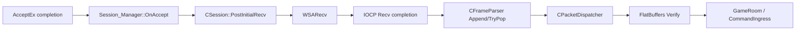
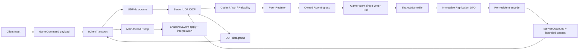

Session - 현재 TCP 기반 Winters 실시간 서버를 증거로 박제하고, 서버 권위를 보존한 UDP 목표 구조와 단계별 이행 기준을 확정한다.

> [!IMPORTANT]
> **Historical baseline / as of 2026-07-12.** 아래 본문을 현재 구현 상태로 사용하지 않는다. 최신 기준은 [2026-07-13 canonical implementation plan](2026-07-13_UDP_JOB_SYSTEM_CHASE_LEV_FIBER_IMPLEMENTATION_PLAN.md)과 [S023 결과 보고서](../build/2026-07-13_UDP_JOB_SYSTEM_CHASE_LEV_FIBER_RESULT.md)다.
> As-built delta: JobSystem Submit race, Chase-Lev deque, FiberFull 및 stress 구현은 완료되었고, UDP v3 generic vertical slice와 server hub/client facade가 구현되었다. main F5 통합과 최종 build 상태는 S023 결과 보고서를 따른다. 6주 Fiber mastery 프로그램은 미착수이며, 현재 상태는 production UDP cutover가 아니다.
> 과거 UDP v2 수치인 **24 B header / 10 B fragment header / 1 MiB logical payload**는 historical design이다. 실제 v3 상수는 **40 B header / 16 B fragment header / 1,200 B datagram / 64 KiB logical payload**다.

# Winters TCP 현황 및 UDP 마이그레이션 설계

작성 기준: 2026-07-12 현재 dirty working tree

이 문서는 다음 세 가지를 분리한다.

1. 지금 실제로 실행되는 코드
2. UDP 전환 뒤 도달할 목표 구조
3. 두 구조 사이를 안전하게 건너는 단계와 검증 gate

이번 문서 작업은 runtime source를 변경하지 않는다. 기존에 수정 중인 TCP/UDP/Fiber 문서는 사용자 작업으로 보존하며, 특히 [2026-07-11 통합 감사](2026-07-11_FULL_UDP_AND_SERVER_FIBER_INTEGRATION_AUDIT.md)는 상세 근거 문서로 계승한다.

---

## 0. 결론

### 0.1 현재 상태

| 영역 | 현재 실행 상태 | 판정 |
|---|---|---|
| Client ↔ WintersServer 로비 | `CClientNetwork` TCP | 활성 |
| Client ↔ WintersServer 게임플레이 | 같은 TCP session의 `Command/Snapshot/Event` | 활성 |
| Server socket | `SOCK_STREAM + IPPROTO_TCP + AcceptEx + IOCP` | 활성 |
| Backend Auth/Profile/Shop/Payment 등 | Client WinHTTP + Go HTTP server | TCP/HTTP 유지 |
| Shared UDP header/fragment/reliability | header와 API 선언 | 실행 불가 골격 |
| Client UDP | `UdpClient.h` 선언만 존재 | 구현·호출자 0 |
| Server UDP | socket/core/peer/dispatcher 없음 | 미구현 |
| Snapshot delta/AOI | schema placeholder 일부만 존재 | 미구현 |
| UDP reliability/security/congestion | 없음 | 미구현 |

핵심 판정은 단순하다.

> 현재 Winters의 로비와 인게임 game-server traffic은 전부 TCP다. UDP는 일부 선언만 있고, 실제 datagram을 송수신하는 경로는 하나도 없다.

### 0.2 목표와 이행 방식

이 문서의 기본 목표는 다음과 같다.

```text
유지:
  HTTPS/HTTP Backend
    Auth / Profile / Matchmaking / Shop / Payment / Leaderboard

최종 전환 후보:
  Client <-> WintersServer 실시간 game session
    association / lobby / loading / command / snapshot / event / reconnect
```

최종 목표는 game-server full UDP association으로 설계하되, 실제 이행은 TCP adapter와 UDP adapter를 나란히 검증하는 단계적 방식으로 한다. 정상 F5에서 같은 command를 두 transport로 동시에 권위 실행하지 않는다.

제품 출시 속도가 우선이면 `TCP control + UDP gameplay`에서 멈추는 것이 더 안전하다. custom full UDP는 학습·엔진 포트폴리오 가치가 크지만, 신뢰성·보안·혼잡 제어를 애플리케이션이 모두 소유해야 한다. 이 선택은 UDP secure association 구현 전에 다시 판정한다.

### 0.3 가장 먼저 할 일

UDP socket부터 만들지 않는다.

1. GameRoom과 concrete TCP session의 결합을 끊고 TCP parity를 유지한다.
2. 현재 TCP payload·queue·tick baseline을 fresh capture로 고정한다.
3. 30Hz full Snapshot에서 AI debug telemetry를 분리하고 delta/AOI 기반으로 payload를 줄인다.
4. 그 뒤 UDP codec/reliability/association을 독립 harness에서 검증한다.

---

## 1. 현재 Server 구성

### 1.1 프로세스와 thread

진입점은 [Server/Private/main.cpp](../../Server/Private/main.cpp)다.

```text
Main console thread
├── CGameRoom tick thread x1
│   └── 33,333us fixed period, 약 30Hz
└── CIOCPCore worker x4
    └── Accept / Recv / Send completion 처리
```

시작 흐름:

```text
WSAStartup
-> CGameRoom::Create(roomId=1)
-> room Register / Start
-> CIOCPCore::Create(port=9000, workers=4)
-> TCP listen
```

종료 흐름:

```text
CIOCPCore::Shutdown
-> CGameRoom::Stop
-> WSACleanup
```

현재 `CServerEntry`, Engine JobSystem, Fiber는 이 실행 경로에 연결돼 있지 않다. UDP 마이그레이션과 Job/Fiber 전환을 같은 patch로 묶지 않는다.

### 1.2 TCP IOCP

핵심 파일:

- [IOCPCore.h](../../Server/Public/Network/IOCPCore.h)
- [IOCPCore.cpp](../../Server/Private/Network/IOCPCore.cpp)
- [Session.h](../../Server/Public/Network/Session.h)
- [Session.cpp](../../Server/Private/Network/Session.cpp)
- [Session_Manager.h](../../Server/Public/Network/Session_Manager.h)
- [Session_Manager.cpp](../../Server/Private/Network/Session_Manager.cpp)

현재 IOCP 구성:

```text
WSASocketW(AF_INET, SOCK_STREAM, IPPROTO_TCP, WSA_FLAG_OVERLAPPED)
-> SO_EXCLUSIVEADDRUSE
-> bind(0.0.0.0:9000)
-> listen(SOMAXCONN)
-> CreateIoCompletionPort
-> AcceptEx context 4개 pre-post
-> GetQueuedCompletionStatus worker 4개
```

accepted socket에는 `TCP_NODELAY`를 켠다. 이는 Nagle batching을 줄일 뿐 TCP retransmission과 stream head-of-line blocking을 없애지 않는다.

`m_acceptThread`와 `AcceptLoop()`는 선언돼 있지만 실행되지 않고 함수도 비어 있다. accept completion은 IOCP worker가 처리한다.

### 1.3 Session identity와 수명

TCP accept 때 `CSession_Manager`가 단조 증가 `sessionId`를 발급한다.

```text
accepted TCP socket
== transport connection
== current session identity
== lobby/gameplay route key
```

`CSession`은 다음을 함께 소유한다.

- client socket
- recv/send `OVERLAPPED` context
- TCP stream parser
- FIFO send queue
- application command sequence gate
- closing/pending-I/O lifetime count

실제 champion 제어권은 `CSession::m_controlledEntity`가 아니라 [SessionBinding](../../Server/Public/Game/SessionBinding.h)의 `sessionId -> EntityID`가 담당한다.

중요한 현재 보안 부채가 있다. late reconnect는 인증 ticket 없이 disconnected human slot을 찾아 새 TCP session을 붙일 수 있다. UDP에서는 source endpoint spoof와 NAT rebinding이 추가되므로 이 동작을 그대로 옮기면 안 된다. reconnect token과 session generation이 선행돼야 한다.

### 1.4 TCP receive path



[PacketEnvelope.h](../../Shared/Network/PacketEnvelope.h)의 활성 TCP header는 16B다.

```cpp
struct PacketHeader
{
    uint16_t magic;
    uint16_t version;
    uint16_t type;
    uint16_t flags;
    uint32_t payloadSize;
    uint32_t sequence;
};
```

TCP는 byte stream이므로 한 application frame이 여러 `recv`에 나뉘거나 여러 frame이 한 `recv`에 합쳐질 수 있다. [FrameParser.cpp](../../Server/Private/Network/FrameParser.cpp)가 `payloadSize`로 경계를 복원한다.

현재 제한:

- frame payload: 최대 64KiB
- per-session recv buffer: 8KiB
- parser accumulator: 최대 256KiB
- header: packed native integer image를 `memcpy`
- explicit byte-order codec: 없음

### 1.5 TCP packet dispatch

현재 inbound 처리:

| Packet | 처리 |
|---|---|
| `CommandBatch` | FlatBuffers verify 후 command ingress |
| `LobbyCommand` | FlatBuffers verify 후 lobby authority |
| `Hello` | server inbound handler no-op |
| `Heartbeat` | no-op |
| `Disconnect` | 전용 case가 없어 unknown 취급 |
| unknown | suspicion count 증가 |

`PacketFlag_Compressed`와 `PacketFlag_Encrypted`는 선언만 있고 구현되지 않았다. suspicion threshold도 실제 disconnect enforcement에 연결돼 있지 않다.

### 1.6 Server authority 경로

보존해야 할 핵심은 이미 올바르다.

```mermaid
flowchart LR
    Input["Client Input"] --> Wire["GameCommandWire"]
    Wire --> Batch["FlatBuffer CommandBatch"]
    Batch --> Tcp["TCP Session"]
    Tcp --> Ingress["CCommandIngress owned copy"]
    Ingress --> Tick["30Hz GameRoom Tick"]
    Tick --> Exec["CDefaultCommandExecutor"]
    Exec --> Sim["Shared/GameSim"]
    Sim --> Rep["Snapshot / Event"]
    Rep --> Visual["Client Visual"]
```



[CommandIngress.cpp](../../Server/Private/Game/CommandIngress.cpp)의 좋은 점:

- network worker가 가진 FlatBuffer pointer를 장기 보존하지 않는다.
- `GameCommandWire`로 즉시 복사한다.
- mutex-protected owned queue로 tick thread에 넘긴다.
- 같은 session의 pending Move는 newest intent로 coalesce한다.
- tick에서 `acceptedTick, sessionId, sequenceNum` 순으로 stable sort한다.

이 경계는 UDP에서도 유지한다.

현재 `CSession::TryAcceptSequence`는 plain monotonic 비교와 60 gap 제한만 가진다. wrap-safe하지 않고 reorder buffer가 없으므로 UDP ReliableOrdered 구현으로 재사용하면 안 된다.

### 1.7 Tick과 lock ownership

[GameRoomTick.cpp](../../Server/Private/Game/GameRoomTick.cpp)의 `Tick()`은 `m_stateMutex`를 잡은 채 다음 전체를 수행한다.

```text
command drain
-> bot command
-> command execute
-> all GameSim systems
-> lag history
-> Event build + send enqueue
-> replay full Snapshot build
-> session별 full Snapshot build + send enqueue
```

반면 IOCP worker의 join, leave, lobby callback도 같은 mutex를 잡는다. Snapshot build가 길어지면 IOCP worker가 한 tick 전체를 기다린다.

목표 구조에서는 IOCP worker가 room/world를 직접 mutate하거나 `m_stateMutex`를 잡지 않는다. owned `RoomIngress`만 채우고, tick thread가 single writer로 drain한다.

### 1.8 TCP send path

[Session.cpp](../../Server/Private/Network/Session.cpp)은 session별 `deque<vector<u8_t>>`를 두고 한 번에 한 `WSASend`를 게시한다.

현재 TCP로 나가는 실시간 packet:

- `Hello`
- `LobbyState`
- `GameStart`
- `Event`
- `Snapshot`

GameRoom의 concrete 결합 지점:

- [GameRoomLobby.cpp](../../Server/Private/Game/GameRoomLobby.cpp)
- [GameRoomReplication.cpp](../../Server/Private/Game/GameRoomReplication.cpp)
- [GameRoomCommands.cpp](../../Server/Private/Game/GameRoomCommands.cpp)
- [CommandIngress.h](../../Server/Public/Game/CommandIngress.h)

현재 send 부채:

1. `OnSendComplete(bytes)`가 partial TCP send byte 수를 무시하고 queue front 전체를 완료 처리한다.
2. send queue에 byte/count/age hard cap이 없다.
3. broadcast caller가 send 실패를 대부분 소비하지 않는다.
4. heartbeat, idle timeout, connection cap, packet rate limit이 없다.
5. 일부 hard error 경로는 manager unroute 없이 socket만 닫을 수 있다.
6. shutdown에서 outstanding accept/recv/send를 명시적으로 모두 drain하는 registry가 없다.

이 항목은 UDP 성능 개선과 별개로 baseline에서 재현·계측해야 한다.

---

## 2. 현재 Client 구성

### 2.1 하나의 TCP connection이 로비부터 인게임까지 이어진다

핵심 파일:

- [ClientNetwork.h](../../Client/Public/Network/Client/ClientNetwork.h)
- [ClientNetwork.cpp](../../Client/Private/Network/Client/ClientNetwork.cpp)
- [GameSessionClient.h](../../Client/Public/Network/Client/GameSessionClient.h)
- [GameSessionClient.cpp](../../Client/Private/Network/Client/GameSessionClient.cpp)
- [Scene_InGameNetwork.cpp](../../Client/Private/Scene/Scene_InGameNetwork.cpp)

```text
BanPick / CustomMode
-> CGameSessionClient::Connect
-> CClientNetwork TCP connect(127.0.0.1:9000)
-> LobbyCommand / LobbyState / GameStart
-> MatchLoading에서도 Pump
-> InGame이 같은 CClientNetwork 재사용
-> Command / Snapshot / Event
```

network roster가 없는 direct-connect branch도 있지만 정상 server-authoritative F5가 아니라 legacy/local smoke 성격이다. UDP 정상 경로로 승격하지 않는다.

### 2.2 Client send

`CClientNetwork::Send`는 main thread에서 blocking `send` loop를 돈다. `CCommandSerializer`는 다음 책임을 한 곳에 묶고 있다.

```text
intent
-> GameCommandWire
-> FlatBuffer CommandBatch
-> TCP WrapEnvelope
-> CClientNetwork::Send
```

모든 public `Send*`가 concrete `CClientNetwork&`를 받는다. Scene과 UI에도 이 concrete type이 노출된다.

또한 prediction callback은 실제 socket send 결과보다 먼저 호출되고 `net.Send` 결과가 버려진다. UDP에서는 아래 상태를 분리해야 한다.

```text
payload build 성공
transport queue admission 성공
socket submit 성공
transport ACK
server semantic ACK / reject
```

### 2.3 Client receive와 main-thread ownership

```text
recv worker
-> TCP recv
-> stream accumulator
-> owned pendingFrames

main/game thread
-> PumpReceivedFrames
-> Hello / Snapshot / Event callback
-> ECS / renderer / UI apply
```

worker가 ECS와 renderer를 직접 건드리지 않고 main thread에서 apply하는 ownership은 UDP에서도 유지한다.

현재 `pendingFrames`에는 count/bytes/age cap이 없다. 모든 Snapshot을 순서대로 적용하므로 render가 network를 못 따라가면 오래된 Snapshot을 계속 처리하는 latency spiral이 생길 수 있다.

### 2.4 Snapshot/Event가 TCP 순서를 전제로 하는 지점

[SnapshotApplier.cpp](../../Client/Private/Network/Client/SnapshotApplier.cpp):

- old/duplicate `serverTick` drop gate가 없다.
- 수신 tick을 즉시 last tick으로 덮는다.
- full Snapshot에 없는 entity를 stale/despawn으로 처리한다.
- `deltaBaseTick` 적용 경로가 없다.

따라서 UDP reorder 상태에서 오래된 Snapshot이 늦게 오면 위치·HP·action이 과거로 돌아가고 새 entity가 제거될 수 있다.

[EventApplier.cpp](../../Client/Private/Network/Client/EventApplier.cpp):

- ActionStart, 일부 ProjectileSpawn/Effect/KillFeed에는 부분 dedup이 있다.
- Damage, ProjectileHit, 일부 Flash/world-text 경로는 일반적인 stable event ID가 없다.
- reliable retransmit duplicate가 application까지 도달하면 FX/UI가 중복 재생될 수 있다.

또한 TCP 한 stream은 Event와 Snapshot 사이의 전역 순서를 제공한다. UDP lane을 분리하면 아직 생성되지 않은 entity를 참조하는 Event가 Snapshot보다 먼저 도착할 수 있다.

### 2.5 Prediction/interpolation의 현재 수준

현재 network-authoritative client는 완전한 positional prediction/replay를 하지 않는다.

- local navigation system은 replicated champion에 대해 비활성이다.
- 이동 시 local yaw 보호와 target 기록은 있다.
- Snapshot `lastAckedCommandSeq`로 pending record를 prune한다.
- pending input replay와 full positional reconciliation은 없다.
- interpolation은 대략 0.06초의 current-to-target smoothing이며 snapshot history/jitter buffer가 아니다.

UDP loss/jitter 대응용 tick-based interpolation buffer는 transport parity 이후 별도 단계로 둔다.

---

## 3. TCP가 존재하는 영역

| 영역 | 파일/심볼 | TCP 의존 성격 | UDP 이행 |
|---|---|---|---|
| Client socket | `ClientNetwork.cpp` | `SOCK_STREAM/connect/send/recv/TCP_NODELAY` | 교체 |
| Client session facade | `GameSessionClient` | concrete `CClientNetwork` 소유 | interface 뒤 유지 |
| Client command | `CommandSerializer` | envelope + concrete send | payload/send 분리 |
| Client scene/UI | `Scene_InGame*`, tuner/debug panel | `CClientNetwork*` 노출 | interface로 축소 |
| TCP framing | `PacketEnvelope.h`, `FrameParser` | byte-stream frame 복원 | TCP adapter에만 유지 |
| Server socket | `CIOCPCore` | listen/AcceptEx/per-socket IOCP | UDP core로 교체 |
| Server peer | `CSession`, `CSession_Manager` | socket == session | peer association 분리 |
| Server dispatch | `CPacketDispatcher` | Parsed TCP frame 입력 | datagram codec 뒤 재사용/분리 |
| GameRoom output | `GameRoomLobby/Replication` | session lookup + send | outbound interface |
| Command gate | `CommandIngress(..., CSession&)` | network session type 누출 | pure sequence gate/owned ingress |
| Backend | `CHttpClient`, `Services/cmd/*` | HTTP over TCP | 유지 |

---

## 4. 현재 UDP 준비 상태

### 4.1 존재하는 골격

| 파일 | 현재 내용 |
|---|---|
| [UdpPacketHeader.h](../../Shared/Network/UdpPacketHeader.h) | 24B header, v2, 3 channel, seq/ack/ackBits, 1200 상수 |
| [UdpFragmentHeader.h](../../Shared/Network/UdpFragmentHeader.h) | 10B fragment metadata |
| [UdpReliabilityChannel.h](../../Shared/Network/UdpReliabilityChannel.h) | reliability API 선언 |
| [UdpClient.h](../../Client/Private/Network/Client/UdpClient.h) | socket/thread/callback class 선언 |
| [SeqMath.h](../../Shared/Network/SeqMath.h) | wrap-aware 비교 helper |

### 4.2 없는 것

- `CUdpClient` method definition과 caller
- `CUdpReliabilityChannel` method definition과 caller
- Server UDP socket/core/peer/registry/dispatcher
- connection ID와 session generation
- handshake/cookie/ticket/authentication
- datagram packet sequence와 logical message sequence의 분리
- reliable ordered receive buffer
- RTT/RTO/backoff/retry limit
- fragmentation/reassembly와 memory/time cap
- pacing/congestion control
- ACK-only scheduler
- reconnect/NAT rebinding policy
- loss/duplicate/reorder test harness
- transport metrics

즉 기존 파일은 호환성을 지켜야 할 배포 protocol이 아니라 초안이다. 구현 전에 wire v3를 확정하고 replace하는 편이 안전하다.

### 4.3 죽은 packet 정의

[PacketDef.h](../../Shared/Network/PacketDef.h)은 활성 FlatBuffers path와 별개의 `PacketHeader`, 20 TPS, fixed `PlayerState[100]`을 정의하지만 include/caller가 없다. 현재 tick은 30Hz다. 외부 소비자 0을 한 번 더 확인한 뒤 retire 대상이다.

---

## 5. Payload 실측

저장된 네 replay의 record header를 [ReplayFormat.h](../../Shared/Replay/ReplayFormat.h) 계약으로 직접 파싱했다.

| Replay | Snapshot 수 | min | p50 | p95 | max | 평균 |
|---|---:|---:|---:|---:|---:|---:|
| `room1_tick1_798.wrpl` | 798 | 6,432B | 12,568B | 14,120B | 14,168B | 10,853.4B |
| `room1_tick1_1602.wrpl` | 1,602 | 5,432B | 11,320B | 18,624B | 20,024B | 12,410.7B |
| `room1_tick1_1681.wrpl` | 1,681 | 5,432B | 12,688B | 18,624B | 20,008B | 12,603.7B |
| `room1_tick1_1786.wrpl` | 1,786 | 8,768B | 16,256B | 19,792B | 22,104B | 15,415.8B |

전체 5,867개 Snapshot이 1,200B를 초과한다.

최신 replay 평균은 30Hz 기준 recipient 한 명당 약 451.6KiB/s다. 다섯 명이면 Snapshot payload만 약 2.2MiB/s이며 IP/UDP/custom header, Event, ACK, retransmit은 빠진 수치다.

같은 replay의 Event payload는 72~128B다. 현재 UDP 병목은 Event가 아니라 full Snapshot이다.

현재 schema와 builder가 dirty 상태이므로 위 replay는 fresh current capture가 아니라 과거 capture이자 하한이다. UDP 구현 전에 1-client/5-client fresh histogram을 다시 기록한다.

현재 `.wrpl`은 Snapshot/Event output만 기록하며 command/input trace와 authoritative state hash가 없다. 따라서 payload 크기와 output 회귀를 보는 자료로는 유효하지만, 같은 input을 TCP/UDP에 재생해 gameplay truth가 같음을 증명하는 canonical parity oracle은 아니다. Stage 0에서 transport-neutral command trace와 tick/checkpoint state hash를 별도로 추가한다.

### 5.1 왜 full Snapshot fragmentation만으로 해결되지 않는가

1200B를 전체 UDP payload budget으로 보고 header/auth/fragment metadata를 빼면 한 datagram의 실제 fragment data는 약 1.1KiB다. 최신 평균 Snapshot은 약 14개, 최대는 약 20개 application fragment가 필요하다.

독립 packet loss를 단순 가정한 설명용 계산:

| fragment 수 | packet loss | full frame incomplete 확률 |
|---:|---:|---:|
| 14 | 1% | 약 13% |
| 14 | 5% | 약 51% |
| 20 | 5% | 약 64% |

조각 하나가 없으면 전체 full Snapshot을 적용하지 못한다. 따라서 fragmentation은 rare oversized message의 안전망이지 payload diet의 대체물이 아니다.

### 5.2 Snapshot이 큰 이유

[Snapshot.fbs](../../Shared/Schemas/Snapshot.fbs)와 [SnapshotBuilder.cpp](../../Server/Private/Game/SnapshotBuilder.cpp)는 다음을 30Hz entity row에 함께 넣는다.

- transform, pose, action, HP/mana
- cooldown, inventory, stats
- AI scores와 다수 debug scalar
- AI decision trace vector
- 모든 net-bound entity

recipient team/vision 기반 AOI/FOW wire filter도 없다.

---

## 6. 네트워크 CS 핵심

### 6.1 TCP와 UDP의 차이는 빠름/느림이 아니다

TCP가 제공하는 것:

```text
connection establishment
reliable byte stream
ordered delivery
duplicate suppression
retransmission
flow control
congestion control
```

UDP가 제공하는 것:

```text
source/destination port
independent datagram boundary
checksum
best-effort delivery
```

UDP migration의 본질은 TCP가 OS에서 제공하던 정책을 application message 성격별로 다시 설계하는 것이다.

UDP의 이점은 신뢰성을 없애는 데 있지 않다. 오래된 Snapshot은 버리고, command와 GameStart는 재전송하며, 서로 다른 lane이 한 TCP stream의 loss 때문에 함께 막히지 않도록 정책을 분리하는 데 있다.

### 6.2 TCP head-of-line과 TCP_NODELAY

TCP는 stream 순서를 지킨다. 앞선 segment가 손실되면 뒤의 Snapshot/Event bytes가 이미 도착했어도 application에는 먼저 전달할 수 없다. 이것이 transport head-of-line이다.

`TCP_NODELAY`는 작은 write의 Nagle 지연을 줄이지만 손실 retransmission, ordered byte stream, congestion control을 제거하지 않는다.

### 6.3 Datagram boundary와 framing

TCP는 message boundary가 없어 `PacketHeader.payloadSize`와 accumulator가 필요하다.

UDP는 한 `recvfrom/WSARecvFrom` completion이 한 datagram boundary를 제공한다. 대신 datagram이 너무 크면 IP fragmentation 또는 truncation 위험이 있으며, connection identity와 delivery policy는 application이 만든다.

### 6.4 IOCP는 protocol이 아니다

IOCP는 asynchronous I/O completion을 worker pool에 전달하는 Windows 실행 모델이다. TCP와 UDP 모두 사용할 수 있다.

```text
TCP: AcceptEx + WSARecv/WSASend
UDP: WSARecvFrom/WSASendTo
```

Microsoft 문서상 completion packet은 queue에 FIFO로 들어가도 여러 worker가 dequeue·처리하는 관찰 순서는 달라질 수 있다. UDP application order는 IOCP completion 순서가 아니라 sequence와 lane state로 복원한다.

### 6.5 세 종류의 ACK

| ACK | 의미 | Winters 예 |
|---|---|---|
| Transport ACK | datagram 수신 여부 | `packetSeq + ackBits` |
| Command ACK | command가 sim ingress/execution/reject 중 어디까지 갔는지 | application command result |
| Baseline ACK | complete Snapshot을 client가 적용했는지 | `appliedSnapshotTick` |

현재 Snapshot의 `lastAckedCommandSeq`는 `Phase_DrainCommands`에서 executor 결과 전에 갱신된다. 이름과 달리 gameplay 성공 ACK가 아니라 sim ingress queued에 가깝다. transport ACK나 delta baseline ACK로 재사용하지 않는다.

### 6.6 exactly-once와 idempotency

wire가 exactly-once를 마법처럼 보장하는 것이 아니다.

```text
retry로 at-least-once 전달
+ receiver duplicate suppression
+ stable command/event idempotency key
= gameplay effect at-most-once 실행
```

현재 Event는 같은 tick의 여러 packet이 동일 envelope sequence를 공유할 수 있다. UDP 전환 전에 단조 `eventId` 또는 `serverTick + eventIndex`를 추가한다.

### 6.7 ordering은 lane마다 다르다

- ReliableOrdered: gap을 buffer하고 앞 message부터 전달
- ReliableUnordered: 중복은 제거하되 도착 즉시 전달
- UnreliableSequenced: 더 최신 message가 오면 이전 것은 폐기
- Unreliable: 순서·재전송 없이 즉시 전달

현재 `seq <= last` drop은 ReliableOrdered가 아니다. 11이 먼저 오면 11을 보류하고 10부터 내보낼 reorder buffer가 필요하다.

### 6.8 MTU와 fragmentation

IP fragmentation은 fragment 하나의 손실이 원 packet 전체 손실로 이어지고 NAT/firewall에서 drop될 수 있다. 초기 budget은 IPv4/IPv6/tunnel 여유를 위해 application이 `sendto`에 넘기는 전체 UDP payload를 1,200B 이하로 둔다.

Application fragmentation은 다음을 가져야 한다.

- message ID와 generation
- fragment index/count와 total size
- duplicate suppression
- per-peer in-flight byte/message cap
- timeout/eviction
- complete 후 한 번만 FlatBuffers verify/apply

### 6.9 flow control, congestion control, backpressure

UDP는 line rate로 보낼 수 있다고 해서 그렇게 보내도 되는 protocol이 아니다.

- congestion control: path가 감당할 수 있는 send rate를 조절
- pacing: burst를 시간에 분산
- backpressure: downstream queue가 찰 때 producer를 제한
- flow control: receiver가 감당 가능한 in-flight 양을 제한

Snapshot은 queue가 밀리면 오래된 것을 버리고 최신 것으로 supersede한다. Reliable control은 drop하지 않되 byte/age cap을 넘으면 명시적으로 connection을 실패시킨다.

### 6.10 server authority, prediction, interpolation

- server authority: gameplay truth owner
- prediction: command 결과를 임시로 예상
- reconciliation: semantic ACK/Snapshot으로 예상과 truth를 합침
- interpolation: 이미 받은 server state 사이를 render time에 부드럽게 표시
- lag compensation: server가 제한된 과거 상태를 조회해 hit를 판정

UDP는 이 기능을 자동으로 제공하지 않는다. transport parity와 snapshot jitter buffer를 먼저 만들고, full positional prediction은 별도 기능으로 진행한다.

---

## 7. 목표 아키텍처



### 7.1 ownership

```text
IOCP worker:
  completion context, header/auth/reliability/reassembly

Peer registry:
  connectionId, generation, endpoint, lane state, limits

GameRoom tick:
  lobby/world/session-binding mutation, authoritative GameSim

Encode worker:
  immutable DTO -> bytes only

Client main thread:
  ECS/render/UI apply
```

GameRoom은 socket, `sockaddr`, `WSASendTo`, retry queue를 모른다.

### 7.2 transport-neutral application contract

개념적 outbound:

```text
Send(
  recipientSessionId,
  packetType,
  deliveryPolicy,
  applicationSequence,
  immutablePayload)
```

TCP adapter는 기존 `PacketEnvelope`로 감싼다. UDP adapter는 UDP header/lane/auth/fragments로 encode한다. FlatBuffers payload 의미와 Shared/GameSim truth는 transport와 독립이다.

### 7.3 logical identity

```text
application sessionId:
  lobby slot과 controlled entity identity

transport connectionId:
  UDP association routing identity

session generation:
  reconnect 전 stale datagram 무효화

endpoint:
  현재 IP:port, authenticated rebinding으로 변경 가능
```

source endpoint만 session key로 사용하지 않는다.

---

## 8. UDP wire와 association

### 8.1 현재 24B header를 그대로 구현하지 않는다

현재 header에는 connection identity, generation, auth, datagram sequence와 logical message sequence 분리가 없다.

권장 v3 base header의 논리 field:

| Field | 목적 |
|---|---|
| magic/version/headerBytes | protocol 식별·확장 |
| connectionId | association routing |
| sessionGeneration | stale connection 차단 |
| packetSeq | datagram loss/ACK |
| ackSeq/ackBits | 반대 방향 datagram ACK |
| messageSeq | lane별 ordered/sequenced delivery |
| packetType/lane/flags | application policy |
| payloadBytes | exact datagram bounds |

fragment extension:

| Field | 목적 |
|---|---|
| fragmentIndex | 조각 번호 |
| fragmentCount | 총 조각 수 |
| messageBytes | 완성 message 크기 |

규칙:

- packet sequence와 message sequence를 분리한다.
- header는 raw packed struct image로 보내지 않고 field-by-field encode/decode한다.
- byte order를 명시한다.
- UDP header 안에 TCP `PacketEnvelope`를 다시 넣지 않는다.
- custom header와 payload/auth tag를 포함한 전체 UDP payload가 1,200B 이하여야 한다.
- unknown type/lane/flag와 length mismatch는 FlatBuffer parse 전에 drop한다.

### 8.2 secure association

권장 handshake:

```text
ClientHello(clientNonce, protocol/data hash, room intent)
-> ServerRetry(stateless cookie, short TTL)

ClientConnect(cookie, match/dev ticket)
-> ServerAccept(connectionId, sessionId, generation, limits)

ClientConfirm
-> Connected
-> RoomIngress::SessionJoin
```

원칙:

- cookie 검증 전 peer/session/world memory를 크게 할당하지 않는다.
- 검증 전 큰 response를 보내지 않는다.
- UDP `connect()` 성공은 application connected가 아니다.
- production은 Backend가 발급한 match/reconnect ticket을 사용한다.
- localhost smoke도 같은 state machine과 명시적 dev ticket provider를 탄다.
- ServerAccept 전에 MsQuic/DTLS 또는 검증된 crypto library를 선택하고 key establishment 계약을 확정한다.
- handshake 이후 모든 datagram은 AEAD 또는 MAC으로 header와 payload를 인증한다.
- nonce/replay key는 connection ID, generation, key phase, packet sequence와 충돌 없이 결합한다.
- per-peer replay window 밖 packet과 auth failure packet은 world/room ingress 전에 버린다.
- authenticated newer packet만 NAT rebinding을 허용한다.
- stale generation과 replay packet은 폐기한다.
- homegrown encryption을 임의로 만들지 않는다. production 목표면 MsQuic/DTLS/검증된 crypto library spike를 먼저 한다.

### 8.3 lane 정책

초기 정책:

| Lane | Delivery | Packet |
|---|---|---|
| Control | ReliableOrdered | association, Hello, GameStart, Disconnect |
| Lobby | ReliableOrdered | LobbyCommand/LobbyState |
| GameplayCommand | ReliableOrdered | Attack/Skill/Buy/Item/Recall/Flash/Level |
| Move | ReliableOrdered 우선 | 현재 one-shot right-click Move |
| GameplayEvent | ReliableOrdered 우선 | Action/Damage/Projectile/FX/Kill |
| Snapshot | UnreliableSequenced | full/delta state |
| Telemetry | low-priority Unreliable | dev-only metrics |

Move는 현재 continuous input stream이 아니라 one-shot command다. packet 하나를 잃으면 이동 자체가 사라지므로 다음 중 하나가 생기기 전에는 unreliable로 바꾸지 않는다.

- latest intent periodic resend
- semantic ACK까지 retry
- input-state stream

Event를 ReliableUnordered로 완화하는 것도 모든 Event에 stable event ID와 dependency policy가 생긴 뒤에 한다.

### 8.4 reliability state

per peer/lane:

- send message sequence
- receive duplicate window
- ordered pending buffer
- unacked datagram/message table
- RTT estimator
- RTO/backoff/retry cap
- ACK-only scheduling
- reliable byte/window cap
- pacing/congestion budget

Transport retransmit가 application duplicate 실행으로 이어지지 않게 delivery 직전에 한 번 더 duplicate suppression을 적용한다.

---

## 9. Snapshot/Event 설계

### 9.1 payload diet 순서

```text
1. DebugTelemetry 분리
2. low-frequency state 분리
3. change mask와 quantization
4. ACK된 baseline 기반 delta
5. authoritative vision/AOI
6. bounded application fragmentation
```

권장 payload 구분:

| Payload | 주기/정책 | 내용 |
|---|---|---|
| SnapshotCore | 30Hz UnreliableSequenced | transform, pose/action, HP, essential state |
| ReliableState | change-driven Reliable | inventory, rank, rare persistent state |
| DebugTelemetry | opt-in 2~5Hz low priority | AI scores, trace, tuning |

### 9.2 delta baseline

- client는 complete Snapshot을 적용한 뒤 `appliedSnapshotTick`을 보낸다.
- server는 ACK된 baseline에서만 delta를 만든다.
- sent-but-unacked Snapshot을 baseline으로 삼지 않는다.
- baseline miss나 history eviction 시 current full resync를 보낸다.
- old full Snapshot을 재전송하지 않는다.
- delta는 `added / changed / removed`를 명시한다.

### 9.3 AOI와 FOW

현재 Snapshot은 모든 net-bound entity를 직렬화한다. renderer에서 hidden enemy를 숨기는 것만으로는 보안이 아니다. wire에 위치가 있으면 modified client가 읽을 수 있다.

recipient team의 authoritative vision과 AOI를 server에서 적용한다. 이 때문에 최종 Snapshot encode는 per-recipient가 될 수 있지만, world read는 한 번의 immutable replication DTO collect로 공유한다.

### 9.4 목표 크기

초기 gate:

- 모든 UDP datagram <= 1,200B
- steady Snapshot p95 <= recipient당 4 datagrams/tick
- fragment reassembly bytes/time/count hard cap
- debug telemetry가 production 30Hz Snapshot에 없음

현재 최신 p95 19,792B에서 이 gate에 도달하려면 단순 header 절감이 아니라 구조적 payload diet가 필요하다.

### 9.5 Client Snapshot gate

```text
datagram auth/reliability
-> fragment complete
-> FlatBuffers verify
-> baseline available
-> serverTick > lastAppliedCompleteTick
-> main-thread apply
```

Snapshot receive queue는 newest complete tick만 남긴다. Control/Event queue와 reassembly table은 별도의 cap을 가진다.

### 9.6 Event와 Snapshot cross-lane

- 모든 Event에 `eventId`와 `serverTick`을 둔다.
- referenced entity가 아직 없으면 bounded deferred queue에 잠시 보관한다.
- entity bind 후 재시도한다.
- deadline 뒤에는 명시적 drop counter를 남긴다.
- Snapshot의 replicated action/state가 중요한 visual recovery source가 된다.

---

## 10. Server UDP IOCP 설계

```text
WSASocketW(AF_INET/AF_INET6, SOCK_DGRAM, IPPROTO_UDP, WSA_FLAG_OVERLAPPED)
-> bind
-> CreateIoCompletionPort
-> N개의 WSARecvFrom context pre-post
-> GQCS worker
-> decode/auth/reliability/reassembly
-> RoomIngress enqueue
-> context reset/repost
```

각 outstanding receive는 별도의 `OVERLAPPED`, buffer, `sockaddr_storage`, address length를 소유한다. Microsoft 문서상 `lpFrom/lpFromlen`과 `OVERLAPPED`는 completion까지 유효해야 하므로 stack local을 넘기지 않는다.

각 `WSASendTo`도 completion까지 destination, packet buffer, `OVERLAPPED`를 소유하는 독립 send context를 가진다.

IOCP worker는 다음까지만 수행한다.

```text
completion 회수
-> bounds/header/auth 검증
-> peer/lane reliability
-> fragment reassembly
-> FlatBuffers verify
-> owned ingress enqueue
-> receive repost
```

world/lobby/session binding mutation은 tick thread가 수행한다.

---

## 11. Queue, pacing, shutdown

### 11.1 Server outbound

우선순위:

```text
handshake/control
critical command result/event
snapshot
telemetry/debug
```

정책:

- unsent old Snapshot은 newer Snapshot으로 supersede
- reliable queue는 byte/count/age cap
- reliable overflow는 silent drop이 아니라 overload disconnect/circuit breaker
- loss/RTT가 악화되면 aggregate send budget 감소
- retransmit가 fresh control을 굶기지 않게 priority cap

### 11.2 Client inbound

| Queue | 정책 |
|---|---|
| Control/Event | bounded ordered, overflow는 connection failure |
| Snapshot | newest complete tick coalescing |
| Fragment | bounded reassembly, deadline eviction |
| Telemetry | low priority drop 허용 |

### 11.3 shutdown

```text
1. new handshake/ingress admission 중단
2. receive admission 중단
3. room tick의 current work 종료
4. outbound admission 중단
5. socket cancel/close와 completion drain
6. peer/room/context 파괴
7. outstanding I/O 0 확인
8. WSACleanup
```

close 후 context container를 즉시 clear하지 않는다.

---

## 12. 이행 계획과 gate

### Stage 0 - TCP baseline

반영:

- partial send, disconnect, queue growth reproducer
- TCP packet/queue/tick metrics
- fresh 1-client/5-client replay와 payload histogram
- canonical command/input trace와 deterministic state hash harness
- Snapshot/Event transport-neutral semantic comparator
- 10분 5-client authoritative smoke

종료:

```text
Server/Client Debug x64
normal roster/map/minion/UI/FX 유지
30Hz deadline capture
Snapshot/Event/Command byte/rate histogram
output replay baseline
canonical command trace + state hash baseline
```

### Stage 1 - transport-neutral boundary

반영:

- packet type를 TCP envelope에서 분리
- GameRoom outbound interface
- CommandIngress의 concrete `CSession` 의존 제거
- TCP adapter로 byte/behavior parity
- 후속 slice에서 owned RoomIngress로 join/leave/lobby/command single-writer 전환

종료:

```text
GameRoom replication/lobby에 CSession_Manager lookup 0
CommandIngress에 CSession include 0
TCP packet bytes + semantic output + state hash parity
```

첫 코드-preview는 [Phase 0/1 계획서](2026-07-12_TCP_UDP_MIGRATION_PHASE0_PHASE1_PLAN.md)에 별도로 둔다.

### Stage 2 - replication DTO와 payload diet

반영:

- serial immutable DTO collect
- AI debug telemetry 분리
- SnapshotCore/ReliableState 분리
- size/rate histogram
- AOI/FOW policy 테스트

종료:

```text
DTO encode가 CWorld/EntityIdMap을 참조하지 않음
hidden enemy wire data 0
fresh capture에서 payload 감소 증명
```

### Stage 3 - protocol harness와 기술 선택

반영:

- explicit header codec
- seq/ACK/reorder/reliability/fragment tests
- deterministic loss/dup/reorder/jitter injector
- custom UDP와 MsQuic/QUIC DATAGRAM spike 비교
- per-peer aggregate send budget, pacing, retransmit cap

종료:

```text
sequence wrap property tests
bounded reassembly
ReliableOrdered gap delivery
queue/RTO/retry cap
non-loopback 전 최소 pacing/backpressure 동작
Stage 4에서 사용할 key establishment와 packet authentication 방식 확정
custom UDP를 계속할 이유를 수치로 기록
```

### Stage 4 - secure association/control

반영:

- Server UDP IOCP
- Client UDP transport
- cookie/ticket/connectionId/generation
- verified key establishment와 per-datagram AEAD/MAC
- nonce/key phase/replay window/auth-failure rate limit
- Control/Lobby ReliableOrdered
- reconnect/rebind/timeout

종료:

```text
loss/dup/reorder에서 lobby/loading 성공
cookie 전 큰 allocation/response 없음
post-handshake unauthenticated datagram ingress 0
duplicate nonce/replay-window 밖 packet drop
auth 실패 endpoint로 NAT rebinding 금지
stale generation drop
authenticated slot reclaim
```

### Stage 5 - command/event UDP

반영:

- independent command/event lane
- transport ACK와 semantic ACK 분리
- command reject result
- global event ID와 dedup
- bounded deferred Event

종료:

```text
1/3/5% loss + duplicate/reorder
command gameplay effect at-most-once
critical FX/UI single playback
canonical command trace의 TCP/UDP state hash parity
```

### Stage 6 - Snapshot UDP

반영:

- UnreliableSequenced newest-only
- delta baseline ACK/full resync
- AOI/FOW
- quantization/chunking
- bounded fragmentation/reassembly
- Stage 3에서 만든 aggregate pacing/send budget과 Snapshot supersede 활성
- tick-based interpolation buffer

종료:

```text
all datagrams <= 1200B
steady Snapshot p95 <= 4 datagrams/recipient/tick
baseline loss 후 자동 full resync
loss 증가 시 send budget 감소
reliable control이 Snapshot/retransmit에 굶지 않음
loss/jitter에서 stale state 회귀와 latency spiral 없음
```

### Stage 7 - congestion hardening, soak, cutover

반영:

- measured loss/RTT 기반 congestion tuning과 circuit breaker
- 10분/1시간 soak
- UDP default, TCP explicit rollback
- gate 통과 후 game TCP path와 dead skeleton retire

종료:

```text
bounded queue/memory
loss 증가 시 send rate 감소
shutdown outstanding I/O 0
WintersServer game TCP caller 0
Backend HTTP 정상
```

---

## 13. 운영 배분과 제안 마감

각 주기 시간은 다음처럼 배분한다.

```text
70% floor:
  correctness / parser / reliability / parity / security / soak

30% ceiling:
  end-to-end capture / demo / 기술 글 / 외부 피드백
```

1인 전담 기준 제안 milestone:

| 날짜 | floor gate | 30% ceiling 산출물 |
|---|---|---|
| 2026-07-19 | Stage 0/1 TCP parity | 현재 구조와 절단 전후 capture |
| 2026-07-26 | UDP protocol harness | loss/reorder visual demo |
| 2026-08-02 | secure 1-client association | lobby/loading 왕복 영상 |
| 2026-08-09 | command/event parity | packet-loss combat demo |
| 2026-08-23 | 5-client Snapshot UDP | profiler + chaos demo |
| 2026-08-30 | cutover decision | IOCP/UDP 기술 글 또는 발표 자료 |

날짜는 품질 gate를 낮추는 deadline이 아니다. 2026-08-23까지 full cutover가 불가능해도 loss-injected 5-client vertical slice를 외부 산출물로 고정한다.

---

## 14. 계측과 검증

### 14.1 TCP baseline counter

```text
Network.TCP.RecvBytes
Network.TCP.SendBytes
Network.TCP.RecvFrames
Network.TCP.SendFrames
Network.TCP.SendQueueBytes
Network.TCP.SendQueueAgeMs
Network.TCP.PartialSend
Network.TCP.DisconnectReason

Server.Tick.Total
Server.Tick.Simulation
Server.Tick.ReplicationBuild
Server.Tick.ReplicationSendEnqueue

Network.Snapshot.PayloadBytes.P50/P95/P99
Network.Event.PayloadBytes.P50/P95/P99
Network.Command.PayloadBytes.P50/P95/P99
```

### 14.2 UDP counter

```text
Network.UDP.RecvDatagrams
Network.UDP.SendDatagrams
Network.UDP.RecvBytes
Network.UDP.SendBytes
Network.UDP.InvalidHeader
Network.UDP.InvalidAuth
Network.UDP.UnknownConnection
Network.UDP.Duplicate
Network.UDP.OutOfOrder
Network.UDP.EstimatedLossPct
Network.UDP.RttMs.P50/P95/P99
Network.UDP.RtoMs
Network.UDP.Retransmit
Network.UDP.PacingDelayMs
Network.UDP.SendQueueBytes
Network.UDP.ReassemblyBytes
Network.UDP.ReassemblyTimeout

Network.Snapshot.DatagramsPerTick.P50/P95/P99
Network.Snapshot.SupersededDrop
Network.Snapshot.FullResync
Network.Event.Deferred
Network.Event.DuplicateDrop
Network.Command.Queued/Executed/Rejected/Duplicate
```

### 14.3 초기 budget

| 항목 | Gate |
|---|---|
| fixed tick | 33.333ms deadline |
| `Server.Tick.Total` | 5-client 10분 p99 <= 25ms, deadline miss 0 |
| UDP payload | 모든 datagram <= 1,200B |
| Snapshot | steady p95 <= 4 datagrams/recipient/tick |
| queue | count/bytes/age hard cap |
| reassembly | per-peer count/bytes/time hard cap |
| parity | canonical command trace 재생의 authoritative state hash와 semantic output 일치 |
| FOW | hidden enemy truth wire 전송 0 |

Bandwidth 절대 목표는 fresh Stage 0 capture 뒤 확정한다.

### 14.4 chaos matrix

```text
client: 1 / 5 / 10
loss: 0 / 1 / 3 / 5 / 10%
duplicate: 0 / 1 / 5%
reorder window: 0 / 2 / 8 packets
jitter: 0 / 20 / 80ms
RTT: 0 / 50 / 100 / 200ms
pause spike: 250 / 1000ms
reconnect: same endpoint / new source port
shutdown: idle / send pending / fragment pending
```

network injector는 deterministic seed를 기록한다.

---

## 15. 유지/교체/retire

### 유지

- Shared/GameSim authority
- GameCommandWire와 FlatBuffers payload meaning
- CommandIngress owned copy + deterministic sort
- SessionBinding과 EntityIdMap
- SnapshotApplier/EventApplier의 gameplay/presentation apply 부분
- recv worker -> main-thread Pump ownership
- output replay + 신규 command trace/state hash parity harness

### 보강 후 유지

- CGameSessionClient facade
- SnapshotApplier: complete/newest/baseline gate 추가
- EventApplier: global event ID/deferred apply 추가
- interpolation: tick history/jitter buffer 추가

### 교체

- concrete CClientNetwork API
- TCP AcceptEx/per-client session transport
- GameRoom direct session lookup/send
- CommandIngress의 CSession 노출
- unbounded send/receive queues
- socket/source endpoint 기반 identity

### 최종 cutover 후 retire

- Client TCP game connect/send/recv/accumulator
- Server TCP AcceptEx/FrameParser/per-socket CSession
- PacketEnvelope 사용처가 0이면 TCP envelope
- dead PacketDef.h
- empty AcceptLoop/m_acceptThread
- 최종 wire와 맞지 않는 declaration-only UDP skeleton

---

## 16. 결정이 더 필요한 항목

| 항목 | 현재 권고 | 확정 시점 |
|---|---|---|
| hybrid vs full UDP | full UDP 목표, hybrid rollout | Stage 3 전 |
| custom UDP vs MsQuic | 둘 다 짧은 spike 후 결정 | Stage 3 |
| 1200 의미 | custom header/auth 포함 전체 UDP payload | wire v3 확정 |
| command ACK 의미 | queued/executed/rejected를 분리 | Stage 5 schema |
| packet authentication | 검증된 transport/crypto와 key/nonce/replay 계약 | Stage 3 종료, Stage 4 필수 |
| IPv6 | `sockaddr_storage`로 설계, smoke 환경은 IPv4부터 | UDP core |
| max peer/room | 현재 5-client gate, 10-client chaos | capacity capture 후 |
| Snapshot quantization | payload histogram과 시각 오차로 결정 | Stage 2 |
| fresh payload | 반드시 재측정 | Stage 0 |

---

## 17. P0 금지 사항

1. 5~22KiB full Snapshot을 fragment/delta 없이 UDP로 보내지 않는다.
2. source IP:port를 session identity로 사용하지 않는다.
3. cookie/ticket 검증 전 session을 할당하거나 큰 response를 보내지 않는다.
4. handshake cookie만으로 이후 datagram이 인증됐다고 보지 않는다.
5. 현재 `seq <= last` gate를 UDP ReliableOrdered로 재사용하지 않는다.
6. GameRoom의 TCP 결합을 concrete UDP manager 결합으로 바꾸기만 하지 않는다.
7. incomplete/old Snapshot을 `SnapshotApplier`에 넘기지 않는다.
8. stable event ID 없이 reliable retransmit Event를 중복 apply하지 않는다.
9. IOCP completion 순서를 application order로 믿지 않는다.
10. unbounded send/reliable/reassembly queue를 만들지 않는다.
11. UDP cutover와 JobSystem/Fiber backend 전환을 한 patch에서 하지 않는다.
12. normal F5 roster/map/minion/UI/FX를 숨겨 성능 숫자를 만들지 않는다.

---

## 18. 근거와 참고

코드 근거:

- [2026-07-11 통합 감사](2026-07-11_FULL_UDP_AND_SERVER_FIBER_INTEGRATION_AUDIT.md)
- [기존 TCP/UDP migration index](../TODO/05-07/00_TCP_UDP_MIGRATION_INDEX.md)
- [기존 hybrid UDP 계획](../TODO/05-07/02_UDP_GAMEPLAY_TRANSPORT_MIGRATION.md)
- [기존 full server/client roadmap](../TODO/05-07/07_TCP_UDP_FULL_SERVER_CLIENT_ROADMAP.md)

Primary references:

- Microsoft Learn, [I/O Completion Ports](https://learn.microsoft.com/en-us/windows/win32/fileio/i-o-completion-ports)
- Microsoft Learn, [WSARecvFrom](https://learn.microsoft.com/en-us/windows/win32/api/winsock2/nf-winsock2-wsarecvfrom)
- Microsoft Learn, [WSASendTo](https://learn.microsoft.com/en-us/windows/win32/api/winsock2/nf-winsock2-wsasendto)
- IETF RFC 8085, [UDP Usage Guidelines](https://www.rfc-editor.org/rfc/rfc8085.html)
- IETF RFC 9221, [QUIC DATAGRAM](https://www.rfc-editor.org/rfc/rfc9221.html)

RFC 8085의 핵심 요구는 UDP application도 aggregate traffic에 congestion control을 적용하고 IP fragmentation을 피하며, 필요하다면 reliability·duplicate suppression·ordering을 application에서 구현해야 한다는 것이다. Windows IOCP 문서는 completion queue의 FIFO와 worker 처리 순서를 같은 것으로 가정하면 안 되며, overlapped `WSARecvFrom/WSASendTo`의 context와 address/buffer lifetime을 completion까지 유지해야 함을 명시한다.
