Session - Winters의 현재 TCP-only 서버를 근거로 TCP Control Plane과 UDP Gameplay Plane의 목표 구조를 확정한다.

> [!IMPORTANT]
> **Historical baseline / as of 2026-07-12.** 아래 본문을 현재 구현 상태로 사용하지 않는다. 최신 기준은 [2026-07-13 canonical implementation plan](2026-07-13_UDP_JOB_SYSTEM_CHASE_LEV_FIBER_IMPLEMENTATION_PLAN.md)과 [S023 결과 보고서](../build/2026-07-13_UDP_JOB_SYSTEM_CHASE_LEV_FIBER_RESULT.md)다.
> As-built delta: JobSystem Submit race, Chase-Lev deque, FiberFull 및 stress 구현은 완료되었고, UDP v3 generic vertical slice와 server hub/client facade가 구현되었다. main F5 통합과 최종 build 상태는 S023 결과 보고서를 따른다. 6주 Fiber mastery 프로그램은 미착수이며, 현재 상태는 production UDP cutover가 아니다.
> 과거 UDP v2 수치인 **24 B header / 10 B fragment header / 1 MiB logical payload**는 historical design이다. 실제 v3 상수는 **40 B header / 16 B fragment header / 1,200 B datagram / 64 KiB logical payload**다.

검증 기준: 2026-07-12 현재 working tree. 이 문서는 구현 결과가 아니라 현재 코드 감사와 목표 설계다. 기존 dirty 파일은 수정하지 않았으며, 실제 변경 지시는 동명의 단계별 구현 계획 문서를 따른다.

## 0. 결론

현재 Winters에서 실행되는 Client ↔ `WintersServer` 통신은 로비부터 인게임까지 전부 TCP다. UDP는 공용 헤더와 클래스 선언만 있고, 실제 socket 생성·송수신·호출자는 없다.

이번 마이그레이션의 권장 목표는 다음 hybrid 구조다.

```text
Backend HTTP/TCP
  Auth / Matchmaking / Profile / Shop / Payment / Leaderboard

WintersServer TCP Control Plane
  LobbyCommand / LobbyState / Hello / GameStart
  방·슬롯·챔피언·로딩·UDP gameplay ticket

WintersServer UDP Gameplay Plane
  Gameplay association / heartbeat
  CommandBatch / Event / Snapshot
  reliability lane / delta / AOI / pacing / reconnect
```

핵심 판단은 세 가지다.

1. TCP socket을 바로 `SOCK_DGRAM`으로 바꾸지 않는다. 먼저 GameRoom과 concrete TCP session의 결합을 끊는다.
2. 현재 5~22KB full Snapshot을 그대로 UDP로 조각내는 것을 완료 상태로 보지 않는다. payload diet, delta, AOI와 bounded fragmentation이 함께 필요하다.
3. 로비까지 custom UDP로 옮기는 “전체 realtime UDP”는 gameplay UDP가 loss/reorder/soak gate를 통과한 뒤의 별도 결정으로 둔다.

## 1. 서버 제품군과 마이그레이션 범위

Winters에는 네트워크 관점에서 서로 다른 두 서버군이 있다.

| 서버군 | 현재 구현 | 소유 데이터 | UDP 마이그레이션 |
|---|---|---|---|
| C++ `WintersServer` | TCP 9000, IOCP, GameRoom, GameSim | 실시간 방·명령·게임 truth·복제 | 대상 |
| Go `Services` | HTTP 8081~8086, PostgreSQL/Redis/Kafka | 계정·매칭·프로필·결제·상점·랭킹 | 대상 아님 |

Go 서비스 포트는 [config.go](../../Services/pkg/config/config.go)의 `AuthPort`~`ShopPort`에 있고, 각 `cmd/*/main.go`는 `http.Server.ListenAndServe`를 사용한다. Client도 [CHttpClient.cpp](../../Client/Private/Network/Backend/CHttpClient.cpp)에서 WinHTTP를 사용한다.

주의할 현재 사실:

- Client URL은 `http://127.0.0.1:*`이고 `WinHttpOpenRequest` secure flag도 없다. 현재 구현을 “HTTPS 완료”라고 부르면 안 된다.
- 이 HTTP 보안 강화는 필요하지만 UDP gameplay 이주와는 별도 작업이다.
- Matchmaking 응답에는 아직 game endpoint와 짧은 수명의 gameplay ticket 계약이 없다.
- Engine 외부 Tracy socket은 profiler 자체 통신이며 Winters gameplay transport 범위에서 제외한다.

## 2. 현재 C++ 서버 구성

### 2.1 프로세스와 스레드

[main.cpp](../../Server/Private/main.cpp)의 활성 bootstrap은 다음과 같다.

```text
main thread
  WSAStartup
  CGameRoom(roomId=1) 생성·등록·시작
  CIOCPCore(port=9000, workerCount=4) 시작
  console 또는 --smoke-seconds lifetime
  IOCP shutdown -> room stop -> WSACleanup

child threads
  GameRoom tick thread x1
  IOCP WorkerLoop x4
```

현재 배포 토폴로지는 사실상 `process 1개 + room 1개 + TCP port 1개`다. `CPacketDispatcher`의 route map만 여러 room을 표현할 수 있을 뿐, accept와 disconnect가 전역 `g_pRoom`을 직접 호출하므로 bootstrap만의 문제가 아니라 구조적으로 single-room에 hardwire돼 있다. Stage 1B에서 `g_pRoom`을 제거하고 route owner가 room-specific `RoomIngress`를 선택하게 해야 한다.

위의 `IOCP shutdown -> room stop`은 현재 실행 순서를 기록한 것이지 안전한 종료 계약이 아니다. [CIOCPCore::Shutdown](../../Server/Private/Network/IOCPCore.cpp)은 listen socket과 worker/IOCP handle을 먼저 닫지만, `CSession_Manager`의 accepted socket과 outstanding receive/send를 명시적으로 close/cancel/drain하지 않는다. 이때 GameRoom tick은 아직 살아 있어 worker 종료 뒤에도 새 `CSession::Send`를 게시할 수 있고, session singleton의 socket 수명이 `WSACleanup` 이후까지 남을 수 있다. UDP 작업 전에 종료 순서를 `room ingress/outbound quiesce -> accepted sessions close/cancel -> completion drain -> IOCP handle close -> WSACleanup`으로 고정해야 한다.

종료 상태는 `Running -> Quiescing -> Draining -> Stopped`로 명시한다. Quiescing에서 accept/repost와 room outbound를 막고, Draining에서는 worker가 Accept/Recv/Send completion과 callback까지 계속 처리한다. accept context와 session pending I/O가 모두 0이 된 뒤에만 worker sentinel, join, IOCP close를 수행한다. drain timeout은 fatal diagnostic/test failure이지 outstanding `OVERLAPPED`를 남긴 채 handle/context를 강제 해제할 권한이 아니다.

[Server.vcxproj](../../Server/Include/Server.vcxproj)은 C++20, `/fp:precise`, `ws2_32.lib`, `Mswsock.lib`를 사용하고 Engine과 GameSim project를 참조한다. Server의 orchestration은 Engine ECS/world primitive와 Shared/GameSim authority를 함께 소비하며, Shared/GameSim의 Engine adapter 절단은 아직 진행 중인 물리 경계다. UDP core는 Server가 소유하고 Shared protocol code에는 WinSock/Engine/DX 타입을 넣지 않는다.

[GameRoomTick.cpp](../../Server/Private/Game/GameRoomTick.cpp)의 tick 주기는 33,333us이며 실제 authority tick은 30Hz다. [DeterministicTime.h](../../Shared/GameSim/Core/Determinism/DeterministicTime.h)도 30Hz를 정의한다. [PacketDef.h](../../Shared/Network/PacketDef.h)의 20 TPS는 미사용 legacy 값이다.

`CServerEntry`는 실제 entry가 아니다. 프로젝트에는 컴파일되지만 main 호출자가 없고, `Initialize`는 worker를 시작한 뒤 false를 반환하며 getter와 shutdown도 미완성이다. 현재 서버 설명이나 UDP 작업에 JobSystem/Fiber가 이미 연결됐다고 기록하면 안 된다.

### 2.2 authority 흐름

```mermaid
flowchart LR
    Input["Client input"] --> Serializer["CommandSerializer + FlatBuffers"]
    Serializer --> TCP["TCP byte stream"]
    TCP --> IOCP["Server IOCP worker"]
    IOCP --> Parser["FrameParser + FlatBuffers Verify"]
    Parser --> Ingress["CommandIngress owned queue"]
    Ingress --> Tick["30 Hz GameRoom single tick"]
    Tick --> Sim["Shared GameSim authority"]
    Sim --> Event["Event payload"]
    Sim --> Snapshot["Full Snapshot payload"]
    Event --> Send["Session TCP send queue"]
    Snapshot --> Send
    Send --> Pump["Client recv worker -> main-thread Pump"]
    Pump --> Visual["Snapshot/Event apply + visual"]
```



보존해야 할 고정 경계는 다음이다.

```text
Client Input -> GameCommand -> Server GameSim -> Snapshot/Event -> Client Visual
```

UDP는 이 authority 방향을 바꾸는 기능이 아니다. GameSim 결과가 Client로 이동하는 transport 정책만 바꾼다.

### 2.3 현재 tick 임계구역

`CGameRoom::Tick()`은 `m_stateMutex`를 잡은 채 다음을 모두 수행한다.

```text
command drain
bot AI / command execution
all simulation systems
lag compensation history
event collect + encode + send enqueue
replay full Snapshot encode 1회
session별 full Snapshot encode + send enqueue
```

5 client라면 tick당 replay 포함 최소 6회의 world traversal/FlatBuffer snapshot encode가 일어난다. Join/Leave/LobbyCommand도 IOCP worker에서 같은 mutex를 잡는다. 따라서 UDP socket보다 먼저 다음 절단이 필요하다.

```text
IOCP completion
  -> immutable RoomIngress enqueue only

GameRoom tick / lock 안
  -> single-writer mutation
  -> immutable ReplicationFrame 수집 1회

lock 밖
  -> recipient별 delta/AOI encode
  -> bounded outbound queue
```

## 3. TCP가 존재하는 정확한 영역

### 3.1 Server raw TCP

| 파일 | 활성 책임 |
|---|---|
| [main.cpp](../../Server/Private/main.cpp) | WSA lifetime, TCP core 9000/4 시작 |
| [IOCPCore.cpp](../../Server/Private/Network/IOCPCore.cpp) | `SOCK_STREAM`, `IPPROTO_TCP`, bind/listen, AcceptEx, IOCP completion |
| [Session.cpp](../../Server/Private/Network/Session.cpp) | per-socket `WSARecv`, `WSASend`, send deque, close |
| [Session_Manager.cpp](../../Server/Private/Network/Session_Manager.cpp) | accepted socket 기반 session id와 lifetime |
| [FrameParser.cpp](../../Server/Private/Network/FrameParser.cpp) | TCP byte stream을 message frame으로 복원 |
| [PacketDispatcher.cpp](../../Server/Private/Network/PacketDispatcher.cpp) | type route, FlatBuffers verify, room 호출 |

실제 accept는 별도 accept thread가 아니다. IOCP worker 4개가 미리 게시된 AcceptEx context 4개를 함께 처리한다. `AcceptLoop()`와 `m_acceptThread`는 미사용이다.

현재 접속 수명 부채도 TCP baseline에 포함한다.

- Accept 직후 application 인증 없이 단조 `sessionId`를 발급하고 room join을 호출한다.
- `GetAcceptExSockaddrs` 함수 포인터는 가져오지만 실제 peer address를 추출·보존하지 않는다.
- `Heartbeat` 처리는 no-op이고 idle timeout, rate limit, session cap이 없다.
- `IsSuspicious()`는 정의돼 있지만 disconnect나 throttling으로 이어지는 caller가 없다.
- send queue는 byte/count/age cap이 없고 completion의 partial byte 수를 처리하지 않는다.
- `CCommandIngress::m_pendingCommands`에도 global/per-session count cap이 없다. Lobby에서는 `Tick()`이 command drain 전에 조기 return하므로, game 시작 전 `CommandBatch` spam이 무한 누적될 수 있다.

### 3.2 Client raw TCP

| 파일 | 활성 책임 |
|---|---|
| [ClientNetwork.cpp](../../Client/Private/Network/Client/ClientNetwork.cpp) | TCP DNS hint, blocking connect/send, recv thread, stream accumulation |
| [GameSessionClient.cpp](../../Client/Private/Network/Client/GameSessionClient.cpp) | lobby TCP session과 roster context 보존 |
| [CommandSerializer.cpp](../../Client/Private/Network/Client/CommandSerializer.cpp) | payload build뿐 아니라 TCP envelope와 concrete send까지 수행 |
| [Scene_InGameNetwork.cpp](../../Client/Private/Scene/Scene_InGameNetwork.cpp) | BanPick TCP 재사용, Hello/Snapshot/Event main-thread apply |

Client send는 main/game thread의 blocking loop다. receive만 전용 thread로 격리되며, 받은 frame은 `PumpReceivedFrames`에서 main thread callback으로 전달된다. 이 receive ownership은 UDP에서도 유지한다.

기본 endpoint는 `127.0.0.1:9000`이고 host/port command-line override만 있다. transport/capability 선택은 없다. Network roster가 있으면 BanPick TCP를 재사용하고, 없으면 InGame이 별도 TCP connection을 만드는 fallback도 남아 있다. 이행 중에는 protocol을 조용히 추측하지 말고 명시적 transport mode와 handshake capability를 사용한다.

### 3.3 TCP에 실리는 application message

현재 단일 TCP connection과 단일 FIFO send queue에 다음이 모두 섞인다.

| 방향 | packet |
|---|---|
| C2S | `LobbyCommand`, `CommandBatch` |
| S2C | `LobbyState`, `GameStart`, `Hello`, `Event`, `Snapshot` |
| 미사용/no-op | `Heartbeat` sender·timeout·state effect 없음, `Disconnect` active handler 없음 |

큰 Snapshot backlog가 생기면 같은 stream 뒤의 Event/Control도 기다린다. `TCP_NODELAY`는 작은 packet 지연을 줄일 수 있지만, 한 stream의 순서 보장 때문에 생기는 cross-message head-of-line을 제거하지 못한다.

## 4. wire와 payload의 현재 상태

### 4.1 활성 TCP envelope

[PacketEnvelope.h](../../Shared/Network/PacketEnvelope.h)의 활성 header는 16B다.

```cpp
struct PacketHeader
{
    uint16_t magic;
    uint16_t version;
    uint16_t type;
    uint16_t flags;
    uint32_t payloadSize;
    uint32_t sequence;
};
```

TCP는 message boundary가 없으므로 `payloadSize`로 stream frame을 복원한다. 현재 header는 packed native integer memory image를 `memcpy`하므로 Windows little-endian 환경에는 맞지만 명시적 wire endian codec은 아니다.

outer `sequence`의 의미도 transport sequence가 아니다.

| packet | 현재 `sequence` 의미 |
|---|---|
| `CommandBatch` | command sequence |
| `Snapshot`, `Event` | server tick |
| `LobbyCommand` | lobby send sequence |
| `LobbyState`, `Hello`, `GameStart` | lobby revision |

같은 tick의 여러 Event가 같은 outer sequence를 쓴다. UDP packet sequence와 이 application identity를 같은 필드로 합치면 안 된다.

### 4.2 죽은 두 번째 protocol

[PacketDef.h](../../Shared/Network/PacketDef.h)은 또 다른 global `PacketHeader`, 고정 `PlayerState[100]`, 20 TPS, 4096B 상수를 정의하지만 include/caller가 없다. 활성 FlatBuffers path와 충돌 가능한 legacy 계약이므로 cutover 전 삭제 또는 명시적 archive 대상으로 둔다.

### 4.3 UDP 선언 골격

| 파일 | 있는 것 | 없는 것 |
|---|---|---|
| [UdpPacketHeader.h](../../Shared/Network/UdpPacketHeader.h) | 24B, 3 delivery 속성, seq/ack bits, 1200 상수 | connection id, generation, auth, semantic lane, codec |
| [UdpFragmentHeader.h](../../Shared/Network/UdpFragmentHeader.h) | message/index/count/size 10B | total bound, timeout, integrity, reassembly 구현 |
| [SeqMath.h](../../Shared/Network/SeqMath.h) | wrap 비교 helper | runtime caller와 half-range 계약 테스트 |
| [UdpReliabilityChannel.h](../../Shared/Network/UdpReliabilityChannel.h) | method 선언 | 모든 method 정의, RTT/RTO, ordered buffer, caps |
| [UdpClient.h](../../Client/Private/Network/Client/UdpClient.h) | Client API 선언, header는 `<ClInclude>` 등록 | `.cpp`, caller, `<ClCompile>` runtime 구현 |

Client/Server/Shared game code에서 `SOCK_DGRAM`, `IPPROTO_UDP`, `WSARecvFrom`, `WSASendTo` 호출은 0건이다. ENet/KCP/RakNet/GameNetworkingSockets 같은 transport 의존성도 없다.

### 4.4 Snapshot 실측

`Shared/Replay/ReplayFormat.h` 기준으로 `Replay/*.wrpl` 4개를 다시 파싱했다.

| replay | snapshots | min | p50 | p95 | max | average |
|---|---:|---:|---:|---:|---:|---:|
| `room1_tick1_798` | 798 | 6,432 | 12,568 | 14,120 | 14,168 | 10,853.4 |
| `room1_tick1_1602` | 1,602 | 5,432 | 11,320 | 18,624 | 20,024 | 12,410.7 |
| `room1_tick1_1681` | 1,681 | 5,432 | 12,688 | 18,624 | 20,008 | 12,603.7 |
| `room1_tick1_1786` | 1,786 | 8,768 | 16,256 | 19,792 | 22,104 | 15,415.8 |

Event는 72~128B다. 최신 replay의 full Snapshot은 30Hz에서 recipient당 약 451.6KiB/s, 약 3.70Mbit/s다. 5 client면 application payload만 약 18.5Mbit/s다.

1200B를 “UDP datagram 전체” budget으로 두고 새 header, auth tag, fragment metadata를 빼면 실데이터는 약 1.1KB다. 최신 replay의 p50~max Snapshot은 약 15~20개 fragment가 필요하다. 독립 손실률 5%에서 15개 fragment가 모두 도착할 확률은 약 46%다.

결론:

> Fragmentation은 oversized message의 안전망이지 Snapshot 압축 설계의 대체물이 아니다.

## 5. 네트워크 CS 관점의 핵심 개념

### 5.1 TCP와 UDP의 본질

TCP가 제공하는 것은 reliable ordered byte stream이다.

```text
connection identity
ordered byte stream
retransmission / duplicate suppression
flow control / congestion control
```

UDP가 제공하는 것은 독립 datagram 전달과 message boundary다.

```text
source/destination address + port
datagram boundary
checksum
```

UDP는 “자동으로 빠른 TCP”가 아니다. UDP 이주의 본질은 OS가 모든 message에 동일하게 적용하던 reliability/order 정책을 application message별로 다시 설계하는 것이다.

### 5.2 Head-of-line과 최신성

- Lobby/GameStart는 늦더라도 순서대로 반드시 도착해야 한다.
- Skill/Attack command와 critical Event도 유실되면 안 된다.
- Snapshot은 오래된 packet을 재전송하는 것보다 최신 complete state를 적용하는 편이 낫다.

UDP의 가치는 이 세 traffic을 별도 lane과 queue로 분리하는 데 있다.

### 5.3 네 종류의 ACK

| ACK | 의미 | Winters 예시 |
|---|---|---|
| Transport ACK | datagram을 받음 | `ackSeq + ackBits` |
| Message ACK | fragmented reliable message를 완전히 조립·검증·ingress enqueue함 | `(lane, messageSeq)` |
| Command ACK | command를 처리·수락·거절함 | processed seq + result/reason |
| Baseline ACK | Snapshot을 완전히 조립·적용함 | `appliedSnapshotTick` |

현재 `lastAckedCommandSeq`는 command가 ingress에서 drain됐다는 의미에 가깝고 executor 성공을 뜻하지 않는다. 위 네 ACK를 같은 숫자로 취급하면 prediction, retry, fragmentation, delta baseline이 모두 잘못된다. Packet ACK는 RTT/혼잡 신호일 뿐 reliable application message 완료를 뜻하지 않는다.

### 5.4 exactly-once의 실제 의미

네트워크가 gameplay effect의 exactly-once를 직접 만들어 주는 것이 아니다.

```text
at-least-once retry
+ receiver duplicate suppression
+ application idempotency key
= effect at-most-once execution
```

Command에는 `sequenceNum` 기반이 있지만 Event 전체에 고유한 id가 없다. UDP Event 전환 전에 `eventId` 또는 `(serverTick, eventOrdinal)`과 bounded client dedup cache가 필요하다.

### 5.5 MTU와 IP fragmentation

- IP fragmentation에 기대지 않는다.
- 초기 negotiated UDP datagram budget은 1200B로 둔다.
- header의 `payloadSize`가 아니라 UDP datagram 전체 길이가 budget 이하여야 한다.
- reassembly는 peer별 message 수, byte 수, fragment 수, age에 hard cap을 둔다.
- `UnreliableSequenced` Snapshot assembly만 timeout/age/byte cap으로 조용히 폐기할 수 있다. 단순히 newer Snapshot의 첫 fragment가 왔다는 이유로 이전 assembly를 지우지 않는다. peer당 작은 bounded K(초기 2~3)개의 concurrent assembly만 유지하고, newer **complete message**가 생겼을 때 older complete/pending을 coalesce한다.
- `ReliableOrdered` fragmented message는 receiver가 조립·검증·ingress enqueue 후 `MessageAck`를 보낼 때까지 sender가 원본을 보유한다. 이미 packet-ACK한 fragment를 receiver가 조용히 evict하지 않으며, reassembly cap/deadline 초과는 해당 association generation을 실패시켜 reconnect/resync한다.

### 5.6 IOCP와 UDP

TCP IOCP:

```text
listen socket + accepted socket per client
accepted socket가 session identity를 암묵적으로 제공
session당 recv 1개로 같은 stream이 직렬 처리됨
```

UDP IOCP:

```text
bound UDP socket 1개
여러 WSARecvFrom context pre-post
source endpoint와 datagram이 completion으로 도착
accept/per-client socket 없음
```

여러 receive를 게시하면 같은 peer의 datagram도 서로 다른 worker에서 역순 완료될 수 있다. completion 순서를 application order로 믿지 말고 packet sequence와 peer-owned lane state로 복원해야 한다.

mutable `PeerState`의 endpoint/generation, ACK window, reassembly, reliable send map, RTT/RTO, pacer와 timer는 peer별 단일 직렬화 경계에서만 변경한다. 초기 구현은 peer-local mutex 하나를 사용하고 IOCP completion, client/server transport timer, outbound enqueue가 모두 같은 경계를 거친다. lock 안에서는 header/auth/state transition만 수행하고 GameRoom callback, FlatBuffers decode, `WSASendTo`는 하지 않는다. queued work는 expected generation/epoch를 들고 stale work를 drop한다.

### 5.7 backpressure와 congestion

UDP는 OS TCP congestion control을 우회하므로 application이 send rate를 제한해야 한다.

```text
per-peer byte/packet budget
pacing queue
RTT/loss 기반 감속
retransmit cap
reliable control reserve
stale Snapshot supersede drop
queue byte/count/age hard cap
overload disconnect/circuit breaker
```

## 6. 목표 architecture 결정

### 6.1 이번 문서의 기본 결정: hybrid

| plane | transport | 남길 packet |
|---|---|---|
| Backend | HTTP/TCP, production에서는 TLS 별도 강화 | Auth/Match/Profile/Shop/Payment/Leaderboard |
| Game Control | TCP | LobbyCommand/LobbyState/Hello/GameStart/room leave/reconnect control/gameplay ticket |
| Gameplay | UDP | association/heartbeat/CommandBatch/Event/Snapshot |

이 선택은 로비의 낮은 빈도·강한 순서 요구를 재구현하지 않으면서, Snapshot이 만드는 cross-type HOL을 제거한다.

### 6.2 선택 가능한 후속 종착점

| 선택 | 장점 | 위험 | 권고 |
|---|---|---|---|
| TCP Control + custom UDP Gameplay | 점진적, 실패 격리 쉬움 | TCP/UDP association 관리 | 현재 기본안 |
| custom UDP 전체 realtime session | 학습·제어 가치 큼 | control reliability/security까지 직접 소유 | Stage 6 이후 재결정 |
| QUIC stream + datagram | secure association과 reliable/unreliable 공존 | 새 의존성·API | production off-ramp 비교 |

전체 UDP를 선택해도 Stage 0~6의 boundary/reliability/snapshot 작업은 그대로 필요하다. 다만 game TCP를 전혀 열지 않는 full-UDP 목표라면 Stage 3의 bootstrap ticket은 TCP Control이 아니라 Backend matchmaking HTTP(S)가 발급해야 한다. 검증이 끝난 Stage 7에서는 LobbyCommand/LobbyState/Hello/GameStart뿐 아니라 leave/reconnect 등 **모든 game control**을 UDP Reliable Control lane으로 옮기고 game TCP listener/session 경로를 명시적으로 폐기한다.

### 6.3 transport-neutral application boundary

```mermaid
flowchart LR
    AppIn["GameCommand / Lobby message"] --> Semantics["Packet type + lane/delivery semantics"]
    Semantics --> Route["Runtime route policy: mode + peer readiness"]
    Route --> ClientTransport["Client transport interface"]
    ClientTransport --> TCPControl["TCP Control"]
    ClientTransport --> UDPGame["UDP Gameplay"]
    UDPGame --> UdpIocp["Server UDP IOCP"]
    TCPControl --> TcpIocp["Server TCP IOCP"]
    UdpIocp --> Verify["Codec / auth / reliability"]
    TcpIocp --> Verify
    Verify --> Mailbox["Owned RoomIngress mailbox"]
    Mailbox --> Room["GameRoom single writer"]
    Room --> Replication["Immutable ReplicationFrame"]
    Replication --> Outbound["Outbound gateway + bounded queues"]
    Outbound --> TCPControl
    Outbound --> UDPGame
```



소유권 규칙:

```text
IOCP worker: completion context, transport validation, mailbox enqueue만 소유
Peer registry: connection/reliability/security/endpoint state 소유
GameRoom tick: lobby/world/session binding mutation의 유일 writer
Encode worker: immutable DTO -> bytes만 소유
Client transport worker: socket send/recv, ACK/RTO/retransmit/pacing/heartbeat clock 소유
Client main thread: ECS/render apply 소유
```

Client main/render thread는 command를 outbound mailbox에 넣고 decoded frame을 pump할 뿐이다. UDP reliability timer와 heartbeat를 frame update에 두면 render stall 때 association과 retransmit도 함께 멈추므로 금지한다.

GameRoom은 socket, sockaddr, `WSASendTo`, ACK window를 몰라야 한다. 목표 구조의 Transport는 stable `roomMemberId`를 current TCP/UDP connection generation과 endpoint로 해석한다. 현재 코드의 `sessionId`는 아직 이 application identity가 아니다.

lane/reliability 의미와 실제 transport route는 한 constexpr 표에 합치지 않는다. `ResolvePacketSemantics(type)`는 Reliable Ordered/Unreliable Sequenced와 semantic lane만 정하고, `ResolvePacketRoute(type, gameTransportMode, peerReadiness)`는 `tcp|udp|shadow`, hybrid/full-UDP, association readiness를 보고 런타임에 TCP/UDP/drop을 결정한다. 그래야 TCP baseline, hybrid cutover, full-UDP가 공용 packet 의미를 바꾸지 않고 공존한다.

outbound gateway는 단순 `bool` 실패를 broadcast caller가 버리는 경계가 되어서는 안 된다. 최소 `Queued / NoAssociation / QueueFull / Closing / TransportError`를 구분하고 transport 구현이 반환 전에 bounded 진단·counter와 connection 정책을 적용한다. Reliable Control/Event의 QueueFull은 침묵 drop하지 않고 overload disconnect 또는 resync로 승격하며, Snapshot QueueFull만 newest-complete coalescing 정책으로 drop할 수 있다. 실제 WinSock 실패는 Server 정책대로 WSA code를 기록하고 해당 connection을 닫는다.

## 7. packet과 lane 정책

초기 cutover 정책은 보수적으로 둔다.

| semantic lane | delivery | 초기 packet | 이유 |
|---|---|---|---|
| TCP Control | reliable ordered stream | LobbyCommand/LobbyState/Hello/GameStart | 현재 안정 경로 유지 |
| UDP Association | Reliable Ordered | connect/accept/confirm/resync control | gameplay association 수명 전이 |
| UDP Heartbeat | Unreliable Sequenced | heartbeat/keepalive | 주기적 최신 liveness만 필요, 다음 heartbeat가 이전 것을 대체 |
| UDP Command | Reliable Ordered | 모든 `CommandBatch` | 유실된 click/skill 방지 |
| UDP Event | Reliable Ordered | Damage/Death/Action/Projectile/FX cue | single-source visual과 causal order |
| UDP Snapshot | Unreliable Sequenced | Full/Delta Snapshot | latest complete state 우선 |
| UDP Telemetry | Unreliable 또는 low-rate reliable | dev-only metrics | gameplay traffic 보호 |

현재 Move는 한 번의 우클릭 command다. 아무 보강 없이 unreliable로 보내면 packet 하나의 유실로 이동 의도 자체가 사라진다. 다음 중 하나를 구현하기 전에는 모든 Command를 Reliable Ordered로 둔다.

```text
latest input intent periodic resend
server semantic ACK까지 resend
Move 전용 sequence space와 input-state stream
```

## 8. TCP에서 UDP로 넘어가는 association

### 8.1 identity 분리

현재 `sessionId`는 [Session_Manager.cpp](../../Server/Private/Network/Session_Manager.cpp)가 TCP accept마다 발급하는 socket-lifetime transport id다. disconnect 시 즉시 `OnSessionLeave/Unroute`되고 reconnect는 새 값을 받으므로, 그대로 stable player/room identity라고 간주하면 안 된다.

목표 identity는 다음처럼 분리한다.

```text
roomMemberId
  match ticket이 부여하는 stable room seat/player application identity

tcpConnectionId + tcpGeneration
  TCP Control connection lifetime

udpConnectionId + udpGeneration
  UDP Gameplay association lifetime

roomBindingEpoch
  roomMemberId가 현재 TCP/UDP generation에 결합된 application membership 세대

endpoint
  현재 UDP routing address, 인증된 NAT rebinding으로 바뀔 수 있음
```

source IP:port만 session key로 사용하지 않는다. endpoint 변경은 인증된 packet 이후에만 허용한다.

plane 수명 규칙:

- UDP timeout만 발생하면 gameplay input/replication을 suspend하고 bounded reconnect grace와 FullResync를 적용한다. TCP Control이 살아 있다는 이유만으로 stale UDP generation을 재사용하지 않는다.
- TCP Control만 끊기고 UDP가 인증된 상태면 즉시 room leave하지 않고 control reconnect grace에 들어간다. 새 TCP connection은 account/match ticket으로 같은 `roomMemberId`에 재결합한다.
- 명시적 leave, membership revoke, 또는 두 plane의 grace 만료가 room leave를 발생시킨다.
- 어느 plane이 재연결되든 generation을 올리고 이전 generation의 packet/endpoint를 거부한다.
- ingress와 disconnect work는 expected `roomBindingEpoch`를 들고, 오래된 TCP/UDP completion이 새 binding을 leave시키지 못하게 한다.

### 8.2 hybrid handshake

1. TCP Control이 room/session/slot을 확정한다.
2. TCP로 짧은 TTL의 one-time gameplay ticket과 UDP endpoint를 보낸다.
3. UDP는 별도 handshake를 수행한다.

```text
ClientHello(clientNonce, protocol/data hash, ticket id)
  -> CookieChallenge(stateless cookie, expiry)
ClientFinish(ticket, cookie, clientNonce)
  -> ServerAccept(udpConnectionId, udpGeneration, roomMemberId, limits)
ClientConfirm
  -> GameplayReady
TCP Control receives GameplayReady result
```

이 절차는 hybrid 기본안이다. 선택적 full-UDP에서는 1~2단계를 Backend matchmaking의 짧은 TTL one-time ticket/endpoint 응답으로 대체하고, UDP `ClientHello`부터 같은 cookie와 association state machine을 사용한다. game TCP가 없는 구성에서 TCP-issued ticket을 전제로 두지 않는다.

규칙:

- cookie 검증 전 peer/session memory와 큰 response를 할당하지 않는다.
- Backend/account 또는 현재 인증된 TCP Control이 match ticket을 검증해 `roomMemberId`에 attach한 뒤에만 gameplay ticket을 발급한다. 현재처럼 인증 없는 TCP accept 직후 room join한 id를 신뢰 사슬의 시작으로 쓰지 않는다.
- 기존 [Hello.fbs](../../Shared/Schemas/Hello.fbs)는 S2C room identity이므로 UDP C2S connect packet으로 재사용하지 않는다.
- ticket은 roomId, roomMemberId, account/match membership, expiry, protocol/data hash, nonce를 묶는다.
- localhost는 dev ticket provider를 쓸 수 있지만 동일 state machine을 통과한다.
- `IsConnected`는 UDP `connect()` 호출이 아니라 application handshake 완료를 뜻한다.
- silent TCP fallback을 금지하고 `--game-transport=tcp|udp|shadow`처럼 lab mode를 명시한다. `shadow`는 decode/metric 비교만 하고 gameplay를 이중 실행하지 않는다.
- duplicate `ClientFinish`와 재전송된 one-time ticket은 새 peer를 중복 생성하지 않고 동일 pending/accepted association으로 수렴한다. 유실된 `ServerAccept`/`ClientConfirm`도 idempotent retry로 복구한다.

## 9. UDP wire와 reliability 설계

### 9.1 header가 표현해야 할 개념

현재 24B header를 그대로 확정하지 않는다. 최소 필드는 다음과 같다.

```text
magic / version / headerBytes
connectionId / generation
semantic lane / delivery flags / packet type
payloadBytes
global packetSeq
per-lane messageSeq
ackLargest + bounded ACK ranges 또는 증명된 충분한 ACK window
fragmentIndex / fragmentCount / fragmentOffset / totalMessageBytes
authentication tag 또는 protected body
```

`packetSeq`와 `messageSeq`는 다르다.

- 최초 전송과 각 재전송 datagram은 새 `packetSeq`를 가진다.
- 하나의 application message fragment들은 같은 `messageSeq`를 쓰며 logical identity는 `(generation, lane, messageSeq, fragmentIndex)`다.
- Reliable Ordered delivery는 완전 조립된 `messageSeq` 순서로 수행한다.
- ACK-only packet은 ACK-eliciting이 아니다. Snapshot packet burst가 Reliable Control/Command ACK 이력을 밀어내지 않도록 ACK range/window가 `maxInFlight + reorderWindow`를 덮는지 증명한다.

새 codec은 packed struct image를 그대로 보내지 않고 field 단위 endian encode/decode와 bounds check를 수행한다. Fragment allocation 전에 count, offset, total bytes, overlap과 peer별 최대치를 검증한다. AEAD를 붙일 때 nonce는 direction/generation/packetSeq 조합으로 유일하게 하고 ACK/header도 authenticated associated data에 포함한다.

### 9.2 receive state

```text
global receive window + duplicate mask
per-lane next deliver messageSeq
ordered pending map
bounded fragment reassembly table
last authenticated receive time
```

`seq <= last` drop으로 Reliable Ordered를 구현하지 않는다. 11이 먼저 오면 보관하고 10을 받은 뒤 10, 11 순으로 deliver한다. Snapshot lane의 supersede 판단은 fragment가 아니라 **완전 조립된 message** 단위다. Snapshot 11이 완성되면 늦게 완성된 10을 버리되, 11의 첫 fragment만 왔을 때 아직 조립 중인 10을 즉시 폐기해서는 안 된다.

[SeqMath.h](../../Shared/Network/SeqMath.h)는 출발점일 뿐이다. `0` 예약 여부, 정확히 half-range인 `0x80000000`, wrap 직전/직후를 property test로 먼저 확정한다.

### 9.3 send state

```text
unacked reliable datagrams/messages
RTT sample / SRTT / RTTVAR / RTO
retry count + exponential backoff
send window / pacing budget
ACK-only deadline
queue byte/count/age caps
```

초기 RTO와 retry 수는 virtual-clock test가 가능하도록 설정값으로 두고 capture 후 조정한다. 무한 재전송은 금지한다. 그러나 `ReliableOrdered` retry expiry는 message drop/skip이 아니다. retry budget을 소진하면 이후 ordered delivery와 신규 gameplay send를 중지하고 association을 `Closing/Failed`로 전이한 뒤 generation을 올려 reconnect한다. Snapshot은 FullResync하고, 결과가 불명확한 in-flight Control/Command는 application 실패로 반환한다. silent coalesce/drop은 Unreliable/Supersedable lane에만 허용한다.

### 9.4 security

Handshake token만으로 이후 datagram 변조·주입을 막을 수 없다. production에서는 검증된 library의 AEAD 또는 secure transport를 선택한다. 자체 암호 알고리즘은 만들지 않는다.

Crypto dependency가 확정되기 전 UDP vertical slice는 localhost/dev-only이고 production-ready로 표시하지 않는다.

## 10. Snapshot 재설계

### 10.1 현재 문제

[Snapshot.fbs](../../Shared/Schemas/Snapshot.fbs)에는 transform/pose/HP뿐 아니라 inventory, stats, cooldown, score와 수십 개 AI debug scalar/trace가 같은 30Hz entity table에 있다. [SnapshotBuilder.cpp](../../Server/Private/Game/SnapshotBuilder.cpp)은 netId가 있는 모든 Transform entity를 전송하며 recipient AOI/FOW filtering이 없다.

Client [SnapshotApplier.cpp](../../Client/Private/Network/Client/SnapshotApplier.cpp)은 stale tick guard 없이 `m_lastServerTick`을 덮고, full Snapshot에 없는 일부 entity를 삭제 의미로 해석한다. 이 동작에 delta/AOI packet을 그대로 넣으면 entity를 잘못 제거한다.

### 10.2 payload 분리

```text
SnapshotCore, 30Hz or adaptive
  transform / pose / action / HP·mana / essential state / projectile

ReliableState, on-change or low-rate
  inventory / rank / cooldown definition-like state / scoreboard

DebugTelemetry, opt-in low-rate
  AI score / scan range / trace / tuning state
```

### 10.3 Full/Delta 계약

```text
SnapshotEnvelope
  mode: Full | Delta
  serverTick
  baselineTick
  added entities
  changed entities + field mask
  removed netIds
  recipient view revision
```

규칙:

- Client가 완전히 조립·검증·적용한 tick만 Baseline ACK한다.
- Server는 ACK된 baseline으로만 delta를 만든다.
- baseline miss/expiry는 partial apply가 아니라 FullResync를 요청한다.
- stale complete tick은 wrap-safe 비교로 폐기한다.
- incomplete fragment를 `OnSnapshot`에 넘기지 않는다.
- Client queue는 모든 Snapshot을 적용하지 않고 newest complete snapshot을 coalesce한다.
- AOI enter/leave와 authoritative despawn을 별도 의미로 표현한다.

### 10.4 AOI/FOW는 보안 경계다

renderer에서 적을 숨기는 것만으로는 충분하지 않다. 보이지 않아야 할 적 위치를 wire로 보내면 cheat client가 읽을 수 있다. recipient team/vision을 기준으로 serialization 전에 entity를 제외해야 한다.

steady-state 1차 목표:

```text
all UDP datagrams <= negotiated 1200B
Snapshot p95 <= 4 datagrams / recipient / tick
FullResync만 bounded fragmentation 허용
```

이 수치는 Stage 2 capture에서 조정하되, 현재 14~20 fragment full Snapshot을 정상 상태로 승인하지 않는다.

## 11. Event와 cross-lane causality

현재 Server는 Event를 먼저 enqueue하고 Snapshot을 뒤에 enqueue하지만 UDP lane 사이 도착 순서는 뒤집힐 수 있다.

필수 계약:

- 모든 Event에 monotonic `eventId` 또는 `(serverTick, eventOrdinal)`을 넣는다.
- Client는 bounded dedup cache로 retry에 따른 FX/UI 중복 재생을 막는다.
- referenced entity가 아직 없으면 Event를 짧게 tick staging하거나 Snapshot action state로 복구한다.
- 같은 entity에 강한 causal dependency가 있는 Event는 Event lane에서 ordered 처리한다.
- Event가 유실돼도 persistent truth는 Snapshot으로 복원되고, 일회성 presentation은 reliable Event로 한 번만 재생된다.

## 12. 단계별 이행

### Stage 0 - TCP baseline 고정

반영:

- Server partial `WSASend` offset 처리와 queue cap을 재현·수정한다.
- 현재 종료 수명주기를 `room/outbound quiesce -> sessions close/cancel -> completions drain -> IOCP close -> WSACleanup`으로 수정하고 pending I/O 0을 증명한다.
- Lobby phase의 `CommandBatch`를 명시적으로 reject하고 `CommandIngress`에 global/per-session count cap을 둔다.
- packet/snapshot/event byte histogram, send queue bytes/age, tick scope를 추가한다.
- 고정 serialized command script와 replay/state hash 기준을 만든다.
- 1/5 client TCP capture를 남긴다.

종료 gate:

```text
Server/Client Debug x64 build
5-client TCP smoke
30Hz 10-minute capture
replay/state hash baseline
partial send / slow consumer test
pre-game CommandBatch spam에서 ingress bound 유지
shutdown pending receive/send completion drain
```

### Stage 1 - transport-neutral boundary

반영:

- packet type과 delivery policy를 TCP envelope에서 분리한다.
- Client serializer를 payload build와 send로 분리한다.
- Server GameRoom outbound gateway를 만든다.
- Join/Leave/Lobby/Command를 owned `RoomIngress`로 통일한다.
- GameRoom tick은 `IsInGamePhase()` 조기 return보다 먼저 `RoomIngress`를 drain하고, phase에 맞지 않는 command를 bounded reject한다.
- accept/disconnect의 전역 `g_pRoom` 호출을 제거하고 route owner가 `roomId -> RoomIngress`를 해석한다.
- command sequence guard를 `CSession` concrete dependency에서 분리한다.
- command replay/dedup key를 목표 `(roomMemberId, commandStreamGeneration)`로 정의한다. 현재 TCP-only adapter가 임시로 `(sessionId, 1)`을 쓰더라도 Stage 1B에서 stable member id에 재결합하고, generation 증가 시 sequence를 새로 시작하며 old-generation command를 drop한다.
- TCP adapter로 기존 동작을 유지한다.

종료 gate:

```text
TCP payload/replay/state parity
GameRoom/CommandIngress concrete CSession include 0
IOCP worker의 GameRoom world/lobby 직접 mutation 0
```

### Stage 2 - immutable replication DTO와 payload diet

반영:

- world에서 immutable replication DTO를 한 번만 수집한다.
- lock 밖에서 recipient encode가 가능하게 한다.
- DebugTelemetry를 30Hz Snapshot에서 분리한다.
- Full/Delta/removed/AOI schema를 확정한다.
- Snapshot size 목표를 profiler JSON으로 증명한다.

종료 gate:

```text
DTO가 CWorld/EntityIdMap을 참조하지 않음
Snapshot semantic parity
latest replay보다 payload 감소
hidden enemy wire data 0
```

### Stage 3 - pure protocol tests와 UDP association

반영:

- platform-neutral codec/reliability/reassembly를 virtual clock으로 구현한다.
- Server UDP IOCP 한 socket과 독립 recv/send context를 구현한다.
- Client transport worker가 socket send/recv, ACK-only deadline, RTO/retransmit, pacing과 heartbeat clock을 소유하고 main thread는 outbound enqueue/decoded-frame Pump만 수행한다.
- peer-local serialization, 초기 rate cap/pacing과 max in-flight bound를 association 단계부터 적용한다.
- hybrid에서는 TCP-issued ticket, full-UDP에서는 Backend matchmaking-issued ticket을 사용해 stateless cookie와 connection id/generation handshake를 연결한다.

종료 gate:

```text
loss/dup/reorder에서 association 성공
cookie 이전 allocation/큰 response 0
expired/stale generation drop
same/new source port reconnect test
render/main-thread 1초 stall 중 heartbeat/RTO clock 지속
peer state data race 0 / max in-flight bound 유지
```

### Stage 4 - Command/Event UDP vertical slice

반영:

- 모든 CommandBatch를 Reliable Ordered lane으로 보낸다.
- application command processed/result ACK를 분리한다.
- Event id/dedup/tick staging을 추가한다.
- TCP와 UDP를 명시적 mode로 비교하되 한 match에서 두 번 실행하지 않는다.
- adaptive congestion이 완성되기 전 UDP mode는 loopback/deterministic lab 전용으로 제한한다.

종료 gate:

```text
1/3/5% loss + duplicate + reorder에서 command effect at-most-once
critical Event visual single playback
TCP/UDP authoritative replay/state parity
```

### Stage 5 - Snapshot UDP

반영:

- Unreliable Sequenced Snapshot lane을 연결한다.
- Full/Delta baseline ACK와 FullResync를 연결한다.
- bounded reassembly와 newest-complete coalescing을 연결한다.
- tick-based interpolation/jitter buffer를 보강한다.
- adaptive congestion이 완성되기 전 Snapshot UDP는 loopback/deterministic lab 전용으로 제한한다.

종료 gate:

```text
all datagrams <= negotiated MTU
reassembly memory/time bound
baseline loss 후 자동 FullResync
loss/jitter에서 stale rollback과 entity 오삭제 0
```

### Stage 6 - hybrid cutover와 hardening

반영:

- per-peer pacing/congestion/queue circuit breaker를 적용한다.
- authenticated datagram과 NAT rebinding policy를 확정한다.
- 정상 F5에서 Command/Event/Snapshot TCP 경로를 제거한다.
- TCP Control과 Backend HTTP는 유지한다.

종료 gate:

```text
5-client 10-minute / 1-hour soak
bounded memory and queue age
loss 증가 시 send rate 감소
TCP에는 control packet만 존재
UDP에는 gameplay packet만 존재
```

### Stage 7 - 선택적 전체 realtime UDP

Gameplay UDP가 안정화되고 목표가 custom full-UDP 학습/포트폴리오로 확정된 경우에만 LobbyCommand/LobbyState/Hello/GameStart/leave/reconnect를 포함한 모든 game control을 UDP Reliable Control lane으로 옮긴다. Bootstrap ticket은 Backend matchmaking이 발급하고, 정상 F5에서 game TCP listener·accepted session·fallback send 경로가 0임을 확인한 뒤 game TCP를 폐기한다. Product 일정이 우선이면 QUIC spike와 비용을 비교한 뒤 결정한다.

## 13. 검증·계측 계약

### 13.1 profiler scope/counter

```text
Server.Tick.Total
Server.Tick.Simulation
Server.Tick.ReplicationCollect
Server.Tick.ReplicationEncode

Network.TCP.SendQueueBytes/Age
Network.UDP.RecvDatagrams/SendDatagrams
Network.UDP.RecvBytes/SendBytes
Network.UDP.InvalidHeader/InvalidAuth/UnknownConnection
Network.UDP.Duplicate/OutOfOrder/EstimatedLossPct
Network.UDP.RttMs.P50/P95/P99
Network.UDP.RtoMs/Retransmit/PacingDelayMs
Network.UDP.SendQueueBytes/ReassemblyBytes/ReassemblyTimeout

Network.Snapshot.PayloadBytes.P50/P95/P99
Network.Snapshot.DatagramsPerTick.P50/P95/P99
Network.Snapshot.SupersededDrop/FullResync
Network.Command.Accepted/Rejected/Duplicate
Network.Event.DuplicateDrop
```

### 13.2 초기 performance gate

| 항목 | 초기 gate |
|---|---|
| fixed tick | 33.333ms deadline, 5-client 10분에서 miss 0 |
| `Server.Tick.Total` | p99 <= 25ms, max < 33.333ms |
| UDP datagram | negotiated 전체 길이 <= 1200B |
| steady Snapshot | p95 <= 4 datagrams/recipient/tick 목표 |
| queue | byte/count/age hard cap, reliable control starvation 0 |
| parity | 동일 input/seed의 authoritative state hash 일치 |

### 13.3 unit/property tests

```text
sequence wrap / half-range / zero reservation
ACK bitfield edges
duplicate / out-of-order / gap
ReliableOrdered buffering
UnreliableSequenced supersede
RTO / backoff / retry expiry
fragment missing / duplicate / timeout / overflow
packet ACK 후 reliable assembly cap/deadline failure
MessageAck loss / duplicate / retry expiry generation reset
malformed header / size / type / lane
cookie expiry / replay / spoof
generation / reconnect / NAT rebind
stale roomBindingEpoch disconnect completion
command and event idempotency
baseline ACK / mismatch / FullResync
shutdown with pending receive/send/reassembly
```

### 13.4 integration/chaos matrix

```text
clients: 1 / 5 / 10
loss: 0 / 1 / 3 / 5 / 10%
duplicate: 0 / 1 / 5%
reorder window: 0 / 2 / 8 packets
jitter: 0 / 20 / 80ms
pause spike: 250 / 1000ms
reconnect: same endpoint / changed source port
shutdown: idle / send pending / fragment pending
```

`--smoke-seconds`는 client 없이 lobby에서 tick이 조기 return하므로 socket startup/shutdown만 증명한다. SimLab도 transport를 우회한다. 별도 `UdpProtocolTests`, `UdpLoopbackHarness`, deterministic network emulator와 fixed command script가 필요하다.

## 14. 현재 부채와 위험 우선순위

### P0 - UDP 시작 전에 닫거나 baseline으로 고정

1. `CSession::OnSendComplete`가 completion bytes를 무시하는 partial-send 결함.
2. Server send queue, Client pending frame queue, CommandIngress/향후 RoomIngress에 hard cap이 없음.
3. Lobby에서 command drain 전 조기 return하여 pre-game command가 무한 누적될 수 있음.
4. room보다 IOCP worker를 먼저 종료하고 accepted sessions/outstanding I/O를 drain하지 않는 수명주기.
5. 5~22KB full Snapshot을 fragment 없는 UDP로 옮기는 계획.
6. endpoint를 session identity로 사용하는 계획.
7. command/event/application id와 transport sequence를 합치는 계획.
8. IOCP worker가 GameRoom state를 직접 mutate/lock하는 구조.
9. 현재 `CServerEntry` stub을 UDP/JobSystem mainline에 연결하는 것.
10. packet ACK만 받은 reliable fragment 원본을 버리거나 receiver가 assembly를 silent evict하는 계약.
11. 여러 IOCP/timer path가 동일 peer reliability state를 직렬화 없이 mutate하는 구조.

### P1 - gameplay cutover 전

1. unique Event id와 packet-level dedup 부재.
2. stale Snapshot tick guard와 Full/Delta discriminator 부재.
3. AI debug telemetry의 30Hz Snapshot 포함.
4. AOI/FOW filter 부재.
5. pacing/congestion/rate/queue cap 부재.
6. header endian/authentication 부재.
7. heartbeat/idle timeout/reconnect generation 부재.

### P2 - production hardening

```text
IPv6 / sockaddr_storage
AEAD dependency와 key rotation
PMTU discovery/fallback
multi-room sharding
GQCSEx batching 또는 RIO 검토
regional latency와 operational alerting
```

## 15. 운영 배분과 외부 마감 제안

각 주기 시간의 최소 30%는 관찰 가능한 end-to-end 결과에 고정한다.

```text
70% floor
  boundary / reliability / parity / security / chaos / cleanup

30% ceiling
  1-client UDP association capture
  loss-injected Command/Event demo
  5-client UDP gameplay 영상
  TCP vs UDP profiler 비교와 네트워크 기술 글
```

제안 마감:

| 날짜 | 외부에서 볼 수 있는 결과 |
|---|---|
| 2026-07-17 | TCP baseline + transport boundary diff/capture |
| 2026-07-24 | TCP ticket 기반 UDP association loopback demo |
| 2026-07-31 | Command/Event UDP loss-injection demo |
| 2026-08-07 | 5-client Snapshot UDP profiler capture와 기술 글 초안 |

마감은 품질 gate를 낮추기 위한 것이 아니라, boundary 정비만 반복되고 실제 UDP 왕복이 미뤄지는 것을 막기 위한 것이다.

## 16. 기존 문서와의 관계

| 문서 | 현재 해석 |
|---|---|
| `.md/TODO/05-07/00_TCP_UDP_MIGRATION_INDEX.md` | historical hybrid 방향, 일부 file/상태 stale |
| `.md/TODO/05-07/02_UDP_GAMEPLAY_TRANSPORT_MIGRATION.md` | gameplay plane 아이디어 원본 |
| `.md/plan/sim/10_UDP_LOL_NETSTACK_MASTER_v2.md` | reliability/delta 장기 아이디어 |
| `.md/plan/sim/10_v2_M1_UDP_TRANSPORT.md` | full Snapshot 단일 datagram 전제가 현재 실측과 충돌 |
| `2026-07-11_FULL_UDP_AND_SERVER_FIBER_INTEGRATION_AUDIT.md` | 전체 realtime UDP 선택지와 Fiber 감사, 현재 사실 근거로 유지 |
| 이 문서 | 2026-07-12 권장 hybrid 범위와 network-only 목표 설계 |
| [2026-07-12_TCP_BASELINE_STAGE_0_PLAN.md](2026-07-12_TCP_BASELINE_STAGE_0_PLAN.md) | 첫 실행 순서. partial send/cap/shutdown의 complete code 확정 전 `CONFIRM_NEEDED` 적용 금지 |
| [2026-07-12_UDP_MIGRATION_STAGE_1A_TRANSPORT_BOUNDARY_PLAN.md](2026-07-12_UDP_MIGRATION_STAGE_1A_TRANSPORT_BOUNDARY_PLAN.md) | Stage 0 통과 뒤 재감사·재베이스할 transport boundary 목표 초안 |

기존 문서를 삭제하지 않는다. 이후 구현 결과가 생기면 이 문서에 사실 목록을 계속 붙이지 말고, 단계별 result 문서와 profiler capture를 남긴다.

## 17. 완료 정의

Hybrid 마이그레이션 완료는 다음을 모두 만족해야 한다.

```text
[ ] Backend HTTP/TCP와 Lobby TCP 정상
[ ] gameplay ticket과 UDP secure association 동작
[ ] Command/Event/Snapshot이 정상 F5에서 UDP만 사용
[ ] channel별 reliability/order/supersede property test 통과
[ ] unique Event id와 client dedup 동작
[ ] 모든 datagram negotiated MTU 이하
[ ] delta/AOI/FullResync와 hidden-state filter 동작
[ ] 5-client loss/jitter/duplicate/reorder soak 통과
[ ] TCP baseline과 authoritative state/replay parity
[ ] IOCP worker는 GameRoom world/lobby를 직접 mutate하지 않음
[ ] send/reassembly/receive queue가 byte/count/age cap을 가짐
[ ] shutdown에서 outstanding IO/reassembly 0
[ ] profiler capture와 5-client 시연 산출물 공개 가능
```
