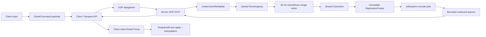

Session - S023에서 Winters의 TCP 게임 세션을 UDP 기반으로 전환하고, JobSystem Submit race·Chase-Lev deque·Fiber scheduler를 실제 코드와 검증 수치로 닫는다.

> **As-built 동기화 — 2026-07-13 / Status: Handoff**
>
> 이 계획의 실행 범위는 구현·빌드·자동 smoke까지 끝났다. 아래 §2~§13의 설계 본문은 왜 이런 구조를 택했는지 보존하는 기록이며, `현재`, `기존`, `목표`, `구현 계획`이라는 표현이 아래 표와 충돌하면 이 상단 delta와 [최종 결과 보고서](../build/2026-07-13_UDP_JOB_SYSTEM_CHASE_LEV_FIBER_RESULT.md)가 정본이다.

| 계획 시작 시 판단 | 2026-07-13 as-built 판정 |
|---|---|
| TCP-only, UDP socket path 없음 | TCP 기본/rollback을 유지하면서 UDP·dual feature-gated runtime, 실제 Client/Server socket, F5 Hello/Lobby smoke 완료 |
| Submit publication/lifetime race | immutable heap `WorkItem*`, publish 전 counter, 실패 rollback, admission/shutdown 경계, exception completion 구현·stress 완료 |
| Chase-Lev last-item 불변식 미검증 | 최종 size-1 Pop/Steal 직접 경쟁 100,000회 PASS, owner 59,659 / thief 40,341 / 위반 0 |
| Fiber shell과 help-wait만 존재 | `ThreadOnly`·`FiberShell`·pooled `FiberFull`, origin-pinned resume와 FLS 구현·stress 완료 |
| Server JobSystem worker 0/미연결 | Server CLI·`CServerEntry` lifecycle·startup probe 연결 완료; GameRoom workload jobification과 speedup은 미완료 |
| 개별 target 통합 대기 | `Winters.sln` Debug x64 `/m:1` 전체 PASS |
| S022와 교차 build 위험 | source-freeze/build barrier 적용, Jax 다섯 3-byte POD padding 결정론 수정, S022 71/71과 통합 build PASS |
| 완전 UDP 전환 목표 | 책임 이전과 runtime vertical slice는 완료; MAC/AEAD·pacing/congestion·Snapshot diet·WAN soak가 없어 production cutover는 미완료 |
| 최종 transport P1 감사 | UDP activation 거절 peer 정리, reliable backpressure fail-closed, TCP bounded/partial send, manager teardown, transport-before-room shutdown 보정 뒤 전체 solution/smoke 재검증 PASS |
| Fiber 6주 프로그램 | runtime 구현과 별개로 미착수 |

# 0. 문서의 역할

이 문서는 다음 네 가지를 하나의 실행 순서로 묶는다.

1. 현재 Winters 코드와 과거 문서의 상태를 같은 사실로 맞춘다.
2. JobSystem의 Submit race와 Chase-Lev deque의 C++ memory model 위반을 제거한다.
3. 기다리는 job이 OS thread를 점유하지 않는 Fiber 실행 모드를 구현한다.
4. 실시간 게임 세션을 TCP stream에서 UDP datagram + application semantics로 옮긴다.

상세 감사 근거는 다음 두 문서가 담당한다.

- [JobSystem·Chase-Lev·Fiber 상태 감사](./2026-07-11_JOB_SYSTEM_CHASE_LEV_FIBER_STATE_AUDIT.md)
- [Full UDP·Server Fiber 통합 감사](./2026-07-11_FULL_UDP_AND_SERVER_FIBER_INTEGRATION_AUDIT.md)

이 문서의 완료 결과와 실제 수치는 다음 결과 보고서에 고정한다.

- [S023 결과 보고서](../build/2026-07-13_UDP_JOB_SYSTEM_CHASE_LEV_FIBER_RESULT.md)
- [Replay payload 측정 JSON](../build/2026-07-13_NETWORK_REPLAY_PAYLOAD_MEASUREMENT.json)

# 1. 현재 판단과 완료 정의

## 1.1 현재 판단

계획 시작 시 게임 네트워크 runtime은 TCP-only였고 UDP는 헤더와 선언 일부만 있었다. 이 시작 상태는 이제 과거 기록이다.

현재 Server는 `--net-transport=tcp|udp|dual`로 transport를 선택한다. 기본은 TCP이며, UDP/dual은 Debug ticket gate가 필요한 feature-gated 수직 슬라이스다.

```text
TCP CSession ---------------------+
                                  +-> logical session / ServerSessionHub
UDP v3 / IOCP / connectionId -----+   -> bounded owned-frame ingress
                                      -> 30 Hz serial GameRoom tick
                                      -> transport-neutral SendFrame
```

현재 JobSystem은 Server startup/shutdown에 실제 연결되어 있고 `ThreadOnly`, `FiberShell`, `FiberFull`을 선택할 수 있다. `FiberFull` counter wait는 worker당 64개 pooled fiber를 suspend하고 origin worker에서 resume한다. 다만 authoritative GameRoom은 계속 serial single-writer이며 immutable replication DTO jobification과 실측 speedup은 후속 범위다.

## 1.2 이번 세션의 완료 정의

이번 세션은 다음을 모두 만족해야 완료다.

- Submit 중 worker가 dequeue해도 job storage가 완전히 publish되어 있다.
- enqueue 실패, job exception, shutdown 중에도 counter가 영원히 남지 않는다.
- Chase-Lev bottom은 owner worker만 변경하고 thief는 top 경쟁만 수행한다.
- non-trivial callable을 ring slot에서 동시에 읽고 쓰는 C++ data race가 없다.
- Fiber mode에서 counter wait가 worker OS thread를 block하지 않고 root fiber로 yield한다.
- waiter 등록과 counter zero 사이에 lost wakeup이 없다.
- fiber resume은 정확히 한 번이며 origin worker ownership을 위반하지 않는다.
- UDP header는 native packed memory image가 아니라 명시적 byte-order codec을 통과한다.
- UDP server/client socket path가 실제로 `SOCK_DGRAM`, `WSARecvFrom`/`WSASendTo`를 사용한다.
- 적어도 handshake/control 수직 슬라이스가 loopback에서 검증된다.
- duplicate, reorder, ack, oversize/truncation, shutdown 경로가 자동 probe로 검증된다.
- TCP는 UDP parity gate 전까지 rollback 가능한 feature gate로 남고, 기본 경로가 무엇인지 명시된다.
- S022 PyTorch/IL 작업을 덮어쓰지 않고 통합 빌드가 같은 checkout에서 통과한다.

“헤더가 생겼다”, “socket이 열린다”, “Fiber API가 컴파일된다”만으로 완료라고 부르지 않는다.

이 완료 정의는 feature-gated runtime 범위에서 모두 충족했다. Production 기본 UDP 전환은 별도 상위 gate이며 post-handshake 보안, RTT/pacing/congestion, AOI/delta/quantization, reconnect/event identity, WAN chaos soak를 완료하기 전에는 충족으로 판정하지 않는다.

# 2. CS 관점의 본질

## 2.1 TCP에서 UDP로 옮긴다는 뜻

TCP와 UDP의 차이는 API 이름이 아니라 책임의 위치다.

TCP가 kernel/transport layer에서 제공하던 것은 대략 다음이다.

- 연결 상태
- 순서 보장
- 손실 재전송
- 중복 제거
- byte-stream 흐름 제어
- 혼잡 제어
- 큰 write를 여러 segment로 나누고 다시 stream으로 조립

UDP는 message boundary와 checksum이 있는 datagram 전달만 제공한다. 도착, 순서, 중복, peer identity, replay 방어, pacing, 큰 메시지 조립은 application이 결정해야 한다.

따라서 완전 UDP migration은 다음 변화다.

```text
기존:
  Game packet semantics
  + TCP가 제공하는 연결/순서/재전송/혼잡 제어

목표:
  Game packet semantics
  + Winters가 명시적으로 선택한 channel별 순서/신뢰성
  + Winters connection identity
  + Winters fragmentation/reassembly
  + Winters pacing/congestion/security
```

UDP의 장점은 모든 packet을 불신뢰하게 만드는 데 있지 않다. Snapshot은 오래된 것을 재전송하지 않고 최신 완성본을 선택할 수 있고, Lobby/GameStart/Event는 재전송·순서 보장을 유지할 수 있다는 선택권이 핵심이다.

## 2.2 packet sequence와 message sequence

fragmentation이 들어가면 두 sequence를 분리해야 한다.

- `packetSeq`: 개별 datagram/fragment의 전송, ACK, RTT, loss를 식별한다.
- `messageSeq`: reassembly가 끝난 logical message의 ordered delivery를 식별한다.

하나의 큰 Snapshot이 14개 fragment로 나뉘면 packet sequence는 14개지만 message sequence는 하나다. 이를 섞으면 한 fragment ACK를 전체 message ACK로 오인하거나, fragment 도착 순서를 application message 순서로 오인하게 된다.

## 2.3 세 종류의 ACK

게임 UDP에는 ACK라는 이름의 서로 다른 사실이 존재한다.

| ACK | 의미 | 소유 계층 |
|---|---|---|
| Transport ACK | datagram을 받았다 | UDP reliability |
| Command semantic ACK | command를 authoritative tick에서 accept/reject했다 | GameRoom/CommandIngress |
| Snapshot baseline ACK | 이 완성 Snapshot을 client가 delta base로 보유한다 | replication |

Transport ACK를 받았다고 공격 명령이 실행된 것은 아니다. Snapshot packet을 받았다고 reassembly와 schema verify가 끝난 것도 아니다. 세 ACK를 분리해야 exactly-once effect와 delta baseline이 설명 가능해진다.

## 2.4 JobSystem의 본질

JobSystem은 “thread를 많이 만드는 도구”가 아니다.

```text
논리적 작업(Job)
-> worker pool에 분배
-> dependency/counter로 완료를 표현
-> 가능한 worker가 실행
-> 결과를 deterministic ownership boundary로 합류
```

병렬 실행의 안전성은 함수 호출 수가 아니라 다음 네 가지가 결정한다.

1. job storage가 enqueue 전에 완전히 생성되었는가
2. queue publish 이후 consumer가 같은 object를 안전하게 읽는가
3. 완료 counter가 성공/실패/취소 모든 경로에서 정확히 한 번 감소하는가
4. shutdown이 신규 submit, 남은 job, worker 종료 순서를 명시하는가

## 2.5 Submit race의 본질

위험한 순서는 다음과 같다.

```text
Producer: queue에 slot/index publish
Consumer: slot을 pop하고 callable 실행
Producer: callable/counter/context 기록 완료
```

queue atomic 자체가 올바르더라도 payload가 publish 이전에 완성되지 않으면 consumer는 반쯤 생성된 `std::function`을 읽는다. 이것은 단순 logical bug가 아니라 C++ object lifetime/data race 문제다.

안전한 원칙은 다음이다.

```text
1. immutable WorkItem node 완전 생성
2. release publish
3. consumer acquire
4. 정확히 한 owner가 node 실행/파괴
```

enqueue 실패 시에도 생성한 node와 증가시킨 counter를 rollback해야 한다.

## 2.6 Chase-Lev deque의 본질

Chase-Lev work-stealing deque는 비대칭이다.

- owner worker만 bottom에서 `Push`/`Pop`한다.
- thief worker는 top에서 `Steal`한다.
- 마지막 한 item에서는 owner pop과 thief steal이 CAS로 경쟁한다.
- top은 경쟁하므로 atomic이다.
- bottom은 owner-only라는 불변식이 성능과 정확성의 전제다.

가장 어려운 순간은 size 1이다.

```text
top == bottom - 1

owner: 마지막 item Pop 시도
thief: 같은 item Steal 시도
-> top CAS 승자만 item 소유
-> 패자는 empty 처리
```

deque 알고리즘이 맞아도 `std::function` 같은 non-trivial object를 fixed ring slot에 직접 두고 thief/owner가 동시에 읽고 덮어쓰면 C++ lifetime이 깨질 수 있다. ring에는 atomic pointer/handle을 두고 실제 WorkItem lifetime을 별도로 소유하는 방식이 안전하다.

## 2.7 Fiber의 본질

Fiber는 parallelism이 아니다. 같은 OS thread에서 여러 실행 stack을 cooperative하게 교체하는 scheduling primitive다.

```text
Worker thread
  root fiber
    -> job fiber A 실행
       -> Counter가 아직 0이 아니면 waiter 등록
       -> root fiber로 yield
    -> 다른 ready job/fiber 실행
    -> Counter 완료 알림
    -> fiber A를 ready queue에 넣음
    -> 같은 worker가 fiber A resume
```

Fiber를 쓰는 이유는 “job A가 의존성을 기다리는 동안 worker thread 전체를 놀리지 않기 위해서”다.

Fiber가 해결하지 않는 것:

- CPU core 수 증가
- data race 자동 제거
- blocking socket을 자동 async I/O로 변환
- lock을 잡은 채 yield해도 안전하게 만들기
- GameSim 결정론 자동 보장

## 2.8 IOCP, JobSystem, Fiber의 관계

세 도구의 역할은 다르다.

| 도구 | 해결하는 문제 | Winters 소유권 |
|---|---|---|
| IOCP | 많은 asynchronous Windows I/O completion | Network transport |
| JobSystem | CPU work의 pool 분배와 stealing | Engine generic runtime |
| Fiber | job dependency wait 중 worker thread 재사용 | Job scheduler execution mode |

UDP recv를 Fiber로 감싸는 것이 목표가 아니다. IOCP worker는 completion을 짧게 decode/route하고 반환한다. CPU가 비싼 Snapshot encode 같은 작업을 JobSystem에 넘기며, 그 job이 다른 job dependency를 기다릴 때만 Fiber가 의미가 있다.

# 3. 현재 Winters 코드 증거

## 3.1 Network

| 증거 | 현재 사실 |
|---|---|
| `Client/Private/Network/Client/ClientNetwork.cpp` | `SOCK_STREAM`, `IPPROTO_TCP`, `connect`, stream recv pump |
| `Server/Private/Network/IOCPCore.cpp` | `SOCK_STREAM`, `listen`, `AcceptEx`, IOCP TCP completion |
| `Server/Private/Network/Session.cpp` | per-TCP-socket receive/send context와 queue |
| `Server/Private/Network/FrameParser.cpp` | TCP stream accumulation과 frame extraction |
| `Shared/Network/UdpPacketHeader.h` | UDP header 골격만 존재 |
| `Shared/Network/UdpReliabilityChannel.h` | 선언만 있고 runtime caller 없음 |
| `Client/Private/Network/Client/UdpClient.h` | 선언만 있고 implementation/caller 없음 |

기존 권위 흐름은 보존한다.

```text
Client Input
-> GameCommand
-> Server GameSim
-> Snapshot/Event
-> Client Visual
```

Transport는 이 흐름을 운반할 뿐 gameplay truth가 되지 않는다.

## 3.2 Server concurrency

현재 Server는 30 Hz GameRoom tick thread와 IOCP workers를 사용한다. GameRoom tick은 큰 `m_stateMutex` 범위 안에서 command drain, simulation, event 수집, full snapshot build/send까지 수행한다.

Fiber/Job을 붙이기 전에 분리할 경계는 다음이다.

```text
IOCP completion
-> verified immutable RoomIngress
-> GameRoom single writer
-> immutable ReplicationFrame DTO
-> parallel encode jobs
-> deterministic sessionId ordered merge
-> bounded outbound queue
```

GameSim world mutation 자체는 우선 serial single-writer로 유지한다. parallel decision을 도입하더라도 `Decision -> entityId sorted Apply`로 결정론적 합류를 둔다.

# 4. 실측 기준선

`Tools/Harness/MeasureReplayNetworkPayload.py`가 `Replay/*.wrpl`의 고정 header만 읽어 schema와 무관하게 payload를 측정한다.

측정 조건:

```text
tick rate: 30 Hz
application datagram budget: 1,200 B
UDP transport header: 40 B (v3 codec)
fragment header: 16 B
authentication tag: 0 B (현재 localhost 수직 슬라이스)
fragment data budget: 1,144 B
percentile: nearest-rank
```

| Replay | Snapshot 수 | 평균 | p95 | 최대 | 30 Hz/client | 평균 datagram | p95 datagram | 최대 datagram |
|---|---:|---:|---:|---:|---:|---:|---:|---:|
| `room1_tick1_798.wrpl` | 798 | 10,853.4 B | 14,120 B | 14,168 B | 318.0 KiB/s | 9.82 | 13 | 13 |
| `room1_tick1_1602.wrpl` | 1,602 | 12,410.7 B | 18,624 B | 20,024 B | 363.6 KiB/s | 11.19 | 17 | 18 |
| `room1_tick1_1681.wrpl` | 1,681 | 12,603.7 B | 18,624 B | 20,008 B | 369.2 KiB/s | 11.37 | 17 | 18 |
| `room1_tick1_1786.wrpl` | 1,786 | 15,415.8 B | 19,808 B | 22,104 B | 451.6 KiB/s | 13.84 | 18 | 20 |

모든 저장 Snapshot이 1,200 B보다 크다. 따라서 `one full Snapshot = one datagram`은 현재 roster에서 불가능하다.

최신 replay를 full snapshot 30 Hz로 5 client에게 그대로 보내면 Snapshot payload만 약 2.2 MiB/s다. IP/UDP header, application header, ACK, Event, 재전송은 포함하지 않은 값이다.

현재 40 B packet header + 16 B fragment header wire를 포함하면 최신 replay는 약 `474.34 KiB/s/client`, 5 client에서 약 `2.316 MiB/s`다. 모든 datagram에 ACK-only 하나를 즉시 돌려보내는 단순 정책은 client uplink에 약 `16.22 KiB/s`를 더하므로 delayed/piggyback ACK가 필요하다.

현재 auth tag가 0인 것은 완료된 보안 설계가 아니라 localhost 수직 슬라이스의 한계다. production cutover 전에는 인증/암호화 계층을 넣고 그 overhead로 MTU 수치를 다시 측정한다.

결론:

- bounded fragmentation은 첫 실제 Snapshot UDP 단계부터 필요하다.
- steady-state 성능은 fragmentation에 기대지 않고 delta/AOI/quantization/debug 분리로 줄여야 한다.
- 목표 p95를 4 datagram 이하로 두면 현재 19,808 B p95에서 약 4,600 B 이하로 76% 이상 줄여야 한다.

# 5. 목표 구조



소유권 불변식:

```text
IOCP worker:
  OVERLAPPED context와 datagram validation만 소유

Peer registry:
  connectionId, endpoint generation, channel/ACK/reassembly/security state 소유

GameRoom tick:
  lobby/session binding/world mutation의 단일 writer

Job worker:
  immutable DTO를 bytes로 encode하는 임시 소유권

Client receive worker:
  datagram decode/reassembly와 bounded message queue만 소유

Client main thread:
  ECS/render state apply 소유
```

# 6. UDP protocol 계획

## 6.1 scope

완전 UDP의 범위는 Client와 Winters Server 사이의 실시간 game session 전체다.

- handshake
- lobby/BanPick/GameStart/control
- gameplay commands
- Snapshot/Event
- heartbeat/timeout
- reconnect/session resume

Auth/Profile/Shop/Payment/Matchmaking의 HTTPS/WinHTTP backend는 별도 control/backend domain으로 유지한다. 이것을 custom UDP로 바꾸는 것은 이번 migration이 아니다.

## 6.2 wire header

필수 논리 필드:

```text
magic/version
connectionId
connection generation/epoch
packet type
logical channel
flags
packet sequence
message sequence
ack sequence
ack bitfield
payload length
authentication protection
```

native `#pragma pack` struct를 그대로 network에 memcpy하지 않는다. codec이 정수별 byte order와 bounds를 명시하고 decode가 header 전체를 검증한 뒤에만 payload에 접근한다.

## 6.3 handshake

```text
ClientHello(nonce, protocol/data hash, requested room)
-> Server Retry(stateless cookie)
-> ClientConnect(cookie, auth/match ticket)
-> ServerAccept(connectionId, generation, sessionId, limits)
-> ClientConfirm
```

Cookie 검증 전에는 peer object, 큰 buffer, 큰 response를 할당하지 않는다. connectionId가 primary identity이고 endpoint는 인증된 packet에 의해 NAT rebinding 가능하다. generation은 이전 connection의 지연 datagram을 거부한다.

## 6.4 channel policy

| Channel | 초기 policy | 이유 |
|---|---|---|
| Control | ReliableOrdered | handshake, lobby, GameStart, disconnect |
| GameplayCommand | ReliableOrdered | authoritative input loss 방지 |
| GameplayEvent | ReliableOrdered | one-shot effect/event 보존 |
| Snapshot | UnreliableSequenced | 오래된 state 재전송보다 최신 state 선호 |
| Telemetry | LowPriority/Unreliable | gameplay를 밀어내지 않음 |

Move를 즉시 unreliable로 분리하지 않는다. 현재 command sequence가 모든 command type에 공통이면 높은 Move sequence가 지연된 낮은 Attack을 stale 처리할 수 있다. command 종류별 독립 sequence/semantic ACK를 만든 뒤 Move latest-intent lane으로 이동한다.

## 6.5 bounded reliability

필수 구성:

- receive window와 modular sequence 비교
- duplicate suppression
- ordered message gap buffer
- ACK/ACK-only packet
- RTT estimator와 bounded RTO/backoff
- retry cap과 connection failure
- per-peer send budget/pacing
- reliable queue hard cap
- snapshot latest-complete coalescing

UDP application은 network congestion에 무제한 traffic을 보내면 안 된다. RFC 8085 원칙에 맞춰 congestion/pacing을 protocol의 필수 기능으로 본다.

## 6.6 fragmentation/reassembly

reassembly key:

```text
(connectionId, generation, channel, messageSeq)
```

필수 제한:

- negotiated maximum message bytes
- maximum fragments per message
- maximum concurrent reassemblies per peer
- total reassembly bytes per peer/global
- timeout
- duplicate fragment 처리
- conflicting fragment metadata 거부
- complete 후 한 번만 schema verify/deliver

부분 Snapshot을 `SnapshotApplier`에 절대 넘기지 않는다.

## 6.7 snapshot diet

우선순위:

1. 30 Hz production state에서 AI debug trace/telemetry 분리
2. recipient team vision/AOI filtering
3. quantization과 change mask
4. acknowledged baseline 기반 delta
5. baseline miss 시 full resync
6. low-rate reliable state와 high-rate transform 분리

AOI/fog는 bandwidth와 보안 둘 다의 요구다. 보이지 않는 적의 위치를 client에 보내고 render에서 숨기면 cheat client는 읽을 수 있다.

# 7. JobSystem·Chase-Lev 구현 계획

## 7.1 publication/lifetime

목표 순서:

```text
Create immutable WorkItem node
-> increment/attach counter
-> release-publish node handle to owner deque/injection queue
-> acquire-consume
-> invoke under exception boundary
-> complete counter exactly once
-> destroy node exactly once
```

enqueue 실패:

```text
publish 실패
-> counter rollback
-> node destroy
-> caller에 명시적 failure/exception
```

job callable exception:

```text
catch at scheduler boundary
-> diagnostics/exception state record
-> counter complete
-> worker loop 생존
```

## 7.2 deque ownership

- worker TLS에는 worker index뿐 아니라 owning JobSystem identity를 둔다.
- 같은 thread에서 다른 JobSystem instance에 submit할 때 foreign bottom push를 금지한다.
- 외부 producer와 foreign worker는 bounded injection queue로 들어간다.
- local worker만 자기 deque bottom에 push/pop한다.
- thief는 다른 deque top만 steal한다.

## 7.3 shutdown state machine

```text
Stopped
-> Running
-> Draining
-> Stopping
-> Stopped
```

- `Draining` 이후 external submit 거부
- 이미 accepted된 job은 drain 또는 명시적 cancel completion
- worker wake
- fiber waiter/ready 상태 정리
- worker join
- queue/node/fiber/counter leak 0 확인

# 8. Fiber 구현 계획

## 8.1 실행 모드

```text
ThreadOnly:
  production-safe 기본

FiberShell:
  Fiber API/stack/profiler 학습 및 진단 모드

FiberFull:
  pooled fiber + counter wait suspend/resume
```

기본값은 `ThreadOnly`다. `FiberFull`은 명시적 Server option/CLI와 stress gate를 통과한 경우에만 켠다.

## 8.2 worker 구조

각 worker:

- thread를 root fiber로 convert
- origin worker에 고정된 fiber pool
- ready queue/inbox
- current fiber/job context
- waiter completion notification drain
- shutdown bookkeeping

## 8.3 lost wakeup 방지

안전한 wait protocol:

```text
1. counter가 0인지 확인
2. waiter를 counter generation에 등록
3. 같은 generation counter를 다시 확인
4. 이미 0이면 등록 취소/ready 유지
5. 아니면 root fiber로 yield
6. zero transition이 waiter를 정확히 한 번 ready enqueue
```

Counter object 재사용 시 generation이 없으면 이전 wait의 늦은 wake가 새 wait를 깨울 수 있다. generation과 lifetime ownership이 필요하다.

## 8.4 pinning

초기 FiberFull은 origin worker pinning을 사용한다.

- 다른 worker가 counter zero를 만들 수 있다.
- completion worker가 대상 worker deque bottom을 직접 조작하지 않는다.
- 대상 origin worker의 MPSC ready inbox에 fiber id를 넣는다.
- 실제 `SwitchToFiber`는 origin worker에서만 수행한다.

Windows TLS는 thread-local이지 fiber-local이 아니다. yield를 넘어 유지해야 하는 current job/fiber state는 explicit context 또는 FLS에 둔다. lock을 잡은 채 yield하지 않는다.

# 9. Server 통합 순서

## Stage 0: 동시 세션 barrier와 기준선

- S022 owned file과 S023 owned file을 분리한다.
- 같은 checkout의 MSBuild는 한 번에 하나만 실행한다.
- S022가 write를 멈추고 handoff/report를 고정할 때까지 `main.cpp`, `GameRoom*`, Snapshot/F9 교차 파일은 읽기 전용이다.
- replay payload, 현재 TCP imports, JobSystem baseline을 저장한다.

## Stage 1: JobSystem race와 deque

- WorkItem lifetime과 publish 순서를 수정한다.
- owner/foreign submit 경계를 고정한다.
- exception/counter/shutdown을 닫는다.
- race stress를 먼저 통과시킨다.

## Stage 2: FiberFull scheduler

- pooled fiber와 root fiber를 만든다.
- Counter waiter registration/wakeup을 구현한다.
- origin-worker ready inbox와 resume을 구현한다.
- ThreadOnly parity와 shutdown stress를 통과시킨다.

## Stage 3: UDP contract/codec

- packet type과 delivery policy를 TCP envelope에서 분리한다.
- endian-safe header codec을 구현한다.
- sequence/ack/reliability/reassembly unit probe를 만든다.

## Stage 4: UDP Windows transport vertical slice

Server:

```text
WSASocketW(AF_INET/AF_INET6, SOCK_DGRAM, IPPROTO_UDP, WSA_FLAG_OVERLAPPED)
-> bind
-> CreateIoCompletionPort
-> pre-post N WSARecvFrom contexts
-> GetQueuedCompletionStatus
-> decode/route
-> pooled WSASendTo contexts
```

각 receive context는 completion까지 다음 storage를 소유한다.

- `OVERLAPPED`
- receive buffer
- `sockaddr_storage`
- address length
- flags

동시에 outstanding인 operation마다 별도 `OVERLAPPED`를 사용한다. stack address/length를 넘기지 않는다.

Client는 첫 단계에서 dedicated recv worker + main-thread Pump를 유지할 수 있다. Client까지 IOCP로 바꾸는 것은 필수 조건이 아니다.

## Stage 5: handshake/control parity

- stateless Retry cookie
- connectionId/generation registry
- Hello/Lobby/GameStart reliable ordered
- heartbeat/idle timeout
- duplicate/reorder/invalid cookie probe

## Stage 6: gameplay command/event

- serializer가 concrete TCP class가 아니라 transport API를 사용한다.
- command는 owned payload로 network thread에서 GameRoom ingress로 넘긴다.
- Event에 stable event identity/dedupe를 둔다.
- TCP와 동일 command/state hash를 비교한다.

## Stage 7: Snapshot

- bounded fragmentation/reassembly
- stale tick reject
- latest-complete queue
- jitter buffer와 render delay
- delta baseline ACK/full resync
- AOI/fog/debug telemetry 분리

## Stage 8: Server replication jobification

```text
serial authoritative World
-> immutable ReplicationFrame DTO
-> recipient/partition encode jobs
-> sessionId sorted deterministic merge
-> outbound transport queue
```

Job worker가 GameRoom world, live `CSession`, socket, ECS mutable component를 참조하지 않게 한다.

## Stage 9: cutover

- UDP soak/chaos/security/pacing gate 통과
- 정상 F5 default를 UDP로 전환
- rollback window 후 TCP game-session path 제거
- backend HTTPS는 유지

# 10. 검증 계획

## 10.1 Job/Deque/Fiber probe

시나리오:

- multi-producer submit
- worker local nested submit
- all workers stealing
- size-1 pop/steal race 반복
- bounded queue overflow
- callable exception
- counter wait와 zero race
- counter reuse generation
- FiberFull suspend/resume
- multi-JobSystem same thread
- shutdown during active workload

필수 지표:

```text
submitted == accepted + rejected
accepted == executed + explicitly_cancelled
counter final == 0
duplicate execution == 0
lost execution == 0
fiber created == fiber destroyed or retained pool capacity
waiting fibers after shutdown == 0
cross-origin resume == 0
```

## 10.2 UDP probe

- codec golden bytes와 malformed length
- sequence wrap-around
- ACK bitfield
- duplicate/reorder/loss injection
- reliable retry/RTO cap
- oversize and `WSAEMSGSIZE`
- fragment duplicate/missing/timeout/conflict
- invalid cookie/unknown connection/generation
- authenticated endpoint rebinding
- queue/reassembly memory cap
- shutdown with outstanding overlapped I/O

## 10.3 빌드/경계

```text
python -m py_compile Tools/Harness/MeasureReplayNetworkPayload.py
python Tools/Harness/MeasureReplayNetworkPayload.py Replay/*.wrpl
powershell -ExecutionPolicy Bypass -File Tools/Harness/Check-SharedBoundary.ps1
msbuild Engine/Include/Engine.vcxproj /m /p:Configuration=Debug /p:Platform=x64
msbuild Shared/GameSim/Include/GameSim.vcxproj /m /p:Configuration=Debug /p:Platform=x64
msbuild Server/Include/Server.vcxproj /m /p:Configuration=Debug /p:Platform=x64
msbuild Client/Include/Client.vcxproj /m /p:Configuration=Debug /p:Platform=x64
git diff --check -- <S023 scoped paths>
```

실제 MSBuild 경로는 설치된 VS toolchain discovery 결과를 사용한다. S022와 동시에 root solution build를 실행하지 않는다.

## 10.4 성능 gate

초기 gate:

- 30 Hz tick budget: 33.333 ms
- `Tick.Total` p99 <= 25 ms, max < 33.333 ms
- negotiated datagram <= 1,200 B
- steady delta Snapshot p95 목표 <= 4 datagram
- reliable/outbound/reassembly/job/fiber queue 모두 bounded
- ThreadOnly와 FiberFull state hash parity
- TCP와 UDP authoritative state hash parity
- deterministic payload mode에서 동일 input/definition의 bytes parity

이 수치는 첫 localhost 성공을 production 성능으로 오인하지 않기 위한 gate다. 실제 LAN loss/reorder와 5-client soak 결과로 갱신한다.

# 11. 확장성과 구조의 유연함

## 11.1 transport 유연성

GameRoom이 `CSession`/socket을 직접 알지 않으면 같은 application packet을 다음 backend에 태울 수 있다.

- custom UDP
- TCP rollback transport
- QUIC stream + DATAGRAM
- replay capture transport
- deterministic network simulator

유연함은 추상화 수가 아니라 소유권과 policy가 명시되어 생긴다.

## 11.2 execution 유연성

동일 Job graph를 `ThreadOnly`와 `FiberFull`에서 실행하고 결과 hash가 같아야 한다. Fiber는 gameplay API에 새어 나오지 않고 scheduler policy로 남는다.

## 11.3 simulation 유연성

Shared/GameSim은 Engine JobSystem/Fiber나 Winsock을 include하지 않는다. Server가 immutable input/output adapter로 parallelize한다. 이 경계 덕분에 SimLab, replay, Python/IL corpus, Server runtime이 같은 gameplay truth를 공유한다.

## 11.4 ML/IL과의 경계

S022의 PyTorch BC는 다음 domain이다.

```text
GameSim measured corpus
-> offline Python/PyTorch training
-> versioned immutable artifact
-> Server shadow inference
-> Snapshot/F9 debug comparison
```

S023은 다음 domain이다.

```text
transport
job scheduling
fiber wait/resume
replication encode execution
```

둘은 `GameRoom`, Snapshot debug wire, Server entry에서만 만난다. S022 완료 전 이 교차 파일을 동시에 수정하지 않고, handoff 뒤 한 owner가 integration한다.

다음 세션부터는 Active packet을 시작할 때 Codex worktree를 생성하고 다음 원칙을 쓴다.

- ML session은 Tools/AIResearch/ChampionAI/Snapshot debug seam을 소유한다.
- Runtime session은 Engine Core/Shared Network/Server Network를 소유한다.
- generated schema와 `.vcxproj`는 한 packet만 소유한다.
- 전체 build는 merge/integration owner만 실행한다.

현재 live dirty tree를 작업 중간에 worktree로 이동하면 모든 기존 세션의 미커밋 변경이 섞일 수 있으므로 이번에는 path ownership + build barrier가 더 안전하다.

# 12. 위험과 중단 조건

- S022 owned file의 timestamp가 다시 바뀌면 교차 integration과 root build를 중단한다.
- UDP path가 authentication/pacing 없이 외부 bind되는 상태라면 localhost feature gate로 제한한다.
- FiberFull에서 cross-worker resume 또는 lost wake가 한 번이라도 나오면 production default로 켜지 않는다.
- GameSim state hash가 ThreadOnly/FiberFull 또는 TCP/UDP에서 달라지면 성능 튜닝을 중단하고 ownership/order 원인을 먼저 해결한다.
- queue cap을 추가하지 못한 reliable/reassembly path는 soak 완료로 주장하지 않는다.
- unrelated dirty 변경 때문에 build가 실패하면 S023 회귀와 외부 회귀를 object/source timestamp와 scoped build로 분리한다.

# 13. 70:30 산출물 배분

바닥 70%:

- race-free scheduler와 자동 probe
- UDP codec/socket/loopback vertical slice
- Client/Server 빌드와 boundary 검증
- 수치 측정 JSON과 as-built report

천장 30%:

- packet capture로 UDP handshake를 눈으로 보여 주는 자료
- loss/reorder에서 Fiber/Network profiler 비교
- JobSystem·Chase-Lev·Fiber·UDP의 연결을 설명하는 기술 글/면접 자산
- 5-client demo와 p99 그래프

이번 세션 결과 보고서와 재현 가능한 probe는 이해를 공개 가능한 출력으로 환전하는 첫 산출물이다.

# 14. handoff 체크리스트

- [x] S022가 source freeze 뒤 [결과 report](../build/2026-07-13_S022_PYTORCH_BC_SHADOW_POLICY_REPORT.md)를 고정했다.
- [x] S023 변경 파일이 work packet 범위와 일치한다.
- [x] Job/Deque/Fiber stress가 반복 통과했다.
- [x] UDP codec/ordered/lane ACK/reassembly/live loopback probe가 통과했다.
- [x] replay payload JSON이 재생성 가능하다.
- [x] Engine public header 변경 후 EngineSDK sync가 의도대로 수행됐다.
- [x] Shared boundary와 project XML 검증이 통과했다.
- [x] GameSim/SimLab/Server/Client Debug x64를 `/m:1`로 순차 통과했다.
- [x] `Winters.sln` Debug x64 `/m:1` 전체가 통과했다.
- [x] 기존 S022 Python 71/71과 deterministic shadow 검증이 회귀하지 않았다.
- [x] scoped `git diff --check`가 통과했다.
- [x] 결과 보고서가 vertical slice 완료와 production cutover 미완료를 분리했다.
- [x] TCP 기본, UDP feature gate, Fiber 기본 `ThreadOnly`를 정확히 기록했다.

# 15. 참고 원문

- Microsoft, `WSARecvFrom`: https://learn.microsoft.com/en-us/windows/win32/api/winsock2/nf-winsock2-wsarecvfrom
- Microsoft, I/O completion ports: https://learn.microsoft.com/en-us/windows/win32/fileio/i-o-completion-ports
- Microsoft, Fibers: https://learn.microsoft.com/en-us/windows/win32/procthread/fibers
- RFC 8085, UDP Usage Guidelines: https://www.rfc-editor.org/rfc/rfc8085.html
- RFC 9221, QUIC DATAGRAM: https://www.rfc-editor.org/rfc/rfc9221.html
