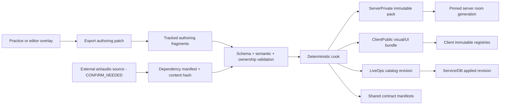

Session - Winters Engine의 gameplay·visual·UI·resource·outgame 데이터를 단일 진실원과 검증된 live-service 승격 구조로 전면 이관한다.

# Winters Full Data Structure Cutover Analysis

작성일: 2026-07-14
성격: 현재 코드 전수 감사 + 목표 아키텍처 + 무회귀 이관 순서
범위: LoL GameSim/Server/Client, WFX/UI/PostFx/resource, Account/GameMode/Shop/Backend contract
비범위: 이 문서 자체는 구현 패치가 아니다. 값 변경과 기능 추가는 각 수직 슬라이스에서 별도로 승인·검증한다.

문서 순서:

1. 현재 판정과 수치
2. gameplay/visual/UI/resource/outgame의 실제 truth 흐름
3. 목표 ownership·pack·revision 계약
4. M0~M8 전면 이관 순서
5. 검증과 zero-reader 삭제 게이트
6. 협업 경계와 70/30 지원 일정

## 0. 결론

현재 Winters에는 Data-Driven의 **핵심 뼈대**가 이미 있다.

- `ServerPrivate / ClientPublic / SharedContract` 구분
- JSON 정규화와 generated immutable C++ pack
- `TickContext::pDefinitions`를 통한 서버 권위 gameplay query
- stable `DefinitionKey`
- tracked WFX authoring과 일부 Client visual pack
- Account economy JSON의 서비스 측 fail-fast validation

그러나 현재 실행 결과를 기준으로는 완전한 Data 구조가 아니다. 실질적으로 다음 진실원이 동시에 존재한다.

```text
1. ServerPrivate full definition pack
2. Shared legacy ChampionGameData pack/DB/default
3. Client SkillTable/Registration/Tuning/FxPreset 수기 값
4. ignored Client/Bin/Resource와 C++ fallback
5. DB migration SQL 및 런타임 DB state
6. Practice/ImGui session override
```

따라서 지금 상태의 정확한 표현은 다음과 같다.

> **Data-Driven 기반은 작동하지만, source ownership과 promotion pipeline을 완전히 컷오버하지 못한 과도기다.**

가장 먼저 고쳐야 하는 것은 데이터를 더 추가하는 일이 아니라, 현재의 거짓 완료 판정을 없애고 `Authoring -> Validate -> Cook -> Manifest/Hash -> Immutable Runtime -> Rollback`의 한 방향 흐름을 강제하는 일이다.

또한 “완전 Data”는 모든 숫자를 JSON으로 옮긴다는 뜻이 아니다.

- 콘텐츠·챔피언·모드·시즌·리전마다 바뀌는 선택과 수치: Data
- 추적, 충돌, 상태 전이, 보간, 자료구조, 수치 안정성 epsilon: C++ 알고리즘
- 런타임 사용자 상태와 거래 기록: DB state
- 비밀번호·JWT secret·서비스 endpoint: 운영 config/secret
- 디자이너 실험값: session overlay

이 경계를 먼저 분류해야 “JSON은 늘었지만 진실원은 더 많아지는” 역효과를 막을 수 있다.

## 1. 2026-07-14 현재 스냅샷

이 수치는 다른 Claude/Codex 세션의 dirty change를 포함한 현재 워크스페이스 스냅샷이다. commit된 기준선과 동일하다고 가정하면 안 된다.

| 항목 | 현재 값 | 의미 |
|---|---:|---|
| `Data/` 전체 파일 | 137 | WFX 120, JSON 14, map runtime 후보 2, README 1 |
| full gameplay pack | champion 17 / skill 85 / summoner 1 | pack 생성·freshness는 작동 |
| SkillEffect record | 51 / 85 | 34개 skill은 effect record가 없음 |
| effect param | 230 | generic param bag은 있으나 skill별 required set 없음 |
| Client visual definition | champion 17 / skill 85 | model asset record는 7개뿐 |
| WFX | 120 | parse 오류 0, cue 중복 0, tracked 112, untracked 8 |
| runtime resource | 127,079 | `Client/Bin/Resource`에 존재, git tracked 0 |
| full gameplay hash | `0xB6EEDF6E` | champion/summoner/spawn/skill-effect 범위 |
| legacy champion hash | `0x3A6CDBF9` | 별도 generator가 만든 다른 데이터셋 |

현재 공식 legacy audit raw count는 다음과 같다.

| 목표 | raw count | 판정 |
|---|---:|---|
| P3 skill hardcode | 0 | **거짓 green**. 직접 리터럴과 fallback 인자를 놓침 |
| P4 visual authority leak | 0 | **불충분**. visual-yaw helper와 Client legacy reader를 놓침 |
| P5 AI | 234 | 실제 owner와 false positive 혼재 |
| P6 object/wave | 31 | 실제 owner와 도구/심볼 hit 혼재 |
| P7 network identity | 685 | 정상 내부 enum 사용까지 포함한 proxy |
| P8 legacy owner | 195 | 선언·프로젝트 등록·실제 reader가 섞인 proxy |

선별한 gameplay/server/client 표면에는 `constexpr` 후보가 259개, 61개 파일에 있다. 모두 Data 후보는 아니지만 P3=0과 양립할 수 없다는 점만으로도 현재 감사 정규식이 완료 증명이 아님을 보여 준다.

`Build-LoLDefinitionPack.py --check`와 기존 Verify가 PASS한다는 것은 **현재 generator 출력이 입력과 일치하고 빌드가 된다는 뜻**이다. 전체 Data 컷오버가 끝났다는 뜻은 아니다.

## 2. 현재 데이터가 실제로 어떻게 흐르는가

### 2.1 Gameplay: full pack은 있으나 legacy와 client 사본이 공존

정상 경로는 실제 코드에 착지해 있다.

```text
Data authoring
  -> Build-LoLDefinitionPack.py
  -> Server/Private/Data/Generated/LoLGameplayDefinitions.generated.cpp
  -> ServerData::GetLoLGameplayDefinitionPack()
  -> GameRoom TickContext::pDefinitions
  -> GameplayDefinitionQuery / StatSystem / entity components
```

근거:

- `Shared/GameSim/Systems/CommandExecutor/ICommandExecutor.h`: `TickContext::pDefinitions`
- `Server/Private/Game/GameRoomTick.cpp`: 서버 tick에 full pack 주입
- `Server/Private/Game/GameRoomSpawn.cpp`: pack 기반 definition/loadout component 부착
- `Shared/GameSim/Systems/Stat/StatSystem.cpp`: dense def id를 pack으로 resolve

하지만 miss 경로가 fail-closed가 아니다.

- `GameplayDefinitionQuery.cpp`는 range/cooldown/action lock/stage/passive dash miss 시 `ChampionGameDataDB`로 폴백한다.
- `GameRoomSpawn.cpp`와 `StatSystem.cpp`에도 legacy/fabricated stat 폴백이 있다.
- `CommandExecutor.cpp`에는 hook/pack 실패 시 range와 damage를 만들어 주는 범용 fallback skill damage가 있다.
- `ChampionStatsDef`, `ChampionGameplayDef` 타입 기본값 자체가 600 HP, 55 AD, 5.5 range 같은 의미 있는 balance 값을 보유한다.

즉 pack 레코드를 지워도 cook/load가 실패하지 않고 다른 값으로 계속 실행될 수 있다. 이 상태에서는 “Data가 권위”라고 할 수 없다.

### 2.2 Kalista BA/Q는 현재 혼합 구조의 가장 명확한 증거

현재 Kalista Q core data에는 cooldown 8, range 16.5가 있으나 effect params는 비어 있다.

실제 서버 projectile 값은 `Shared/GameSim/Champions/Kalista/KalistaGameSim.cpp`가 소유한다.

| 값 | 현재 owner |
|---|---|
| BA speed 30, hit radius 0.6 | Server C++ literal |
| Q speed 27, hit radius 0.6, base damage 70 | Server C++ literal |
| Q range 16.5 | Data query, miss 시 C++ 16.5 fallback |
| BA/Q mesh, texture, scale, trail | WFX/Client visual |
| authoritative 이동 speed/lifetime | server projectile event; WFX 값이 아님 |

따라서 WFX Tuner로 BA/Q의 `scale`, 색, 재질, trail은 조정할 수 있지만 실제 이동 속도·판정 반경·피해·사거리는 WFX의 권한이 아니다. WFX `velocity/lifetime`은 preview 기본값으로만 취급해야 한다.

Kalista R/결속도 같은 패턴이다.

- Oathsworn item 3599, slot index 5, bind range
- R fallback range, bot delay 3초, launch distance
- ritual/bind/launch timing과 policy

이 값들은 typed ServerPrivate policy로 옮기고, 대상 선택·pull·launch·homing 알고리즘만 C++에 남겨야 한다.

### 2.3 생성 파이프라인이 두 개이고 source와 output이 섞여 있음

현재 `champions.json` 하나에서 두 generator가 파생된다.

```text
Tools/ChampionData/build_champion_game_data.py
  -> Shared/GameSim/Generated/ChampionGameData.generated.*

Tools/LoLData/Build-LoLDefinitionPack.py
  -> Server full gameplay generated C++
  -> Client visual generated C++
  -> 여러 normalized JSON과 manifest
```

full generator는 legacy generator 모듈까지 import한다. 더 큰 문제는 다음 파일들을 입력으로 읽은 후 **같은 경로에 다시 정규화 출력**한다는 점이다.

- `SummonerSpellGameplayDefs.json`
- `SpawnObjectGameplayDefs.json`
- `SkillEffectGameplayDefs.json`
- `ChampionVisualDefs.json`
- `ObjectVisualDefs.json`
- `ChampionAssetVisualDefs.json`

반면 `ChampionGameplayDefs.json`, `SkillGameplayDefs.json`은 명백한 generated view다. 현재 디렉터리만 보고는 사람이 고칠 원본과 파생물이 구분되지 않는다.

legacy generated는 GameSim static library에 들어가고 Client가 GameSim을 링크한다. 그 결과 ServerPrivate이어야 할 stats/cooldown/range 값이 Client binary에도 포함된다.

### 2.4 hash/handshake가 실제 full pack을 검증하지 않음

현재 full gameplay pack과 SharedContract manifest hash는 `0xB6EEDF6E`다. 그러나 서버 Hello는 `ChampionGameDataDB::GetBuildHash()`가 반환하는 legacy champion-only hash `0x3A6CDBF9`를 보낸다. Client도 동일 legacy hash와 비교하고 mismatch를 접속 거부가 아닌 로그로만 남긴다.

결과적으로 SkillEffect, SpawnObject, Summoner가 달라도 현재 접속 handshake로 검출되지 않는다.

기존 문서에서 D-6a 또는 hash 전송을 완료로 표시한 항목이 있다면 의미를 좁혀야 한다. 완료된 것은 legacy champion hash의 전송·비교이고, full ServerPrivate pack enforcement와 public contract compatibility gate는 미완료다.

또한 full gameplay hash 범위에 다음은 없다.

- AI, item, reward, wave, game rule
- ClientPublic visual JSON
- WFX
- HUD/UI/PostFx
- runtime asset dependency

하나의 hash로 모든 것을 섞을 필요는 없지만, visibility와 배포 단위별 manifest/hash는 각각 있어야 한다.

### 2.5 Client visual: 일부 pack + 수기 table/registration/preset의 3중 구조

정상적인 ClientPublic authoring도 있다.

- `Data/LoL/ClientPublic/Visual/ChampionVisualDefs.json`
- `ChampionAssetVisualDefs.json`
- `ObjectVisualDefs.json`
- generated `LoLVisualDefinitions.generated.cpp`

그러나 다음 수기 경로가 아직 주 권한 또는 fallback이다.

- `Client/Private/GameObject/SkillTable.cpp`
- champion별 `_Registration.cpp`
- `SkillRegistry.cpp`
- `ChampionTable.cpp`
- `ProjectileVisualCatalog.cpp`
- champion별 `*_Tuning.h`, `*FxPresets.cpp`
- `RenderDebug.cpp`의 PostFx preset

실제 drift도 존재한다. 예를 들어 server core data와 client registration cooldown/range가 다른 챔피언이 있고, Irelia server/client basic attack range도 불일치한다. 이는 단순 중복 가능성이 아니라 이미 관측된 중복 owner 문제다.

### 2.6 WFX: authoring 데이터이지만 production cook은 아님

WFX 120개는 JSON으로 유효하며 Tuner가 tracked `Data/LoL/FX` 파일을 저장할 때는 실제 authoring 수정으로 볼 수 있다. 그러나 현재 runtime은 cooked index를 읽지 않고 workspace의 `Data/LoL/FX`를 재귀 순회해 mutable registry에 직접 등록한다.

추가 문제:

- 120개 모두 내부 asset path에 `Client/Bin/Resource/...` root가 들어 있다.
- 8개가 아직 untracked이며 Kalista 신규 WFX 3개도 포함된다.
- projectile kind -> cue/yaw route는 `ProjectileVisualCatalog.cpp` switch다.
- Irelia R wedge는 배치 수치·timing·asset path가 C++ procedural preset에 섞여 있다.

목표는 WFX를 없애는 것이 아니다. WFX를 tracked authoring으로 유지하되 content-relative dependency로 정규화하고 deterministic index/pack으로 cook해야 한다.

### 2.7 HUD/UI/resource: 현재 가장 재현성이 낮은 영역

`Client/Bin/Resource`에는 현재 127,079개 파일이 있으나 git tracked 파일은 0개다. 이는 runtime content root를 source repo에 넣지 않는 의도된 정책이다. 문제는 source depot/manifest/cook 없이 일부 변경이 이 ignored runtime root에만 존재한다는 점이다.

현재 아래 변경은 새 checkout에서 자동 재현되지 않는다.

- `UI/hud_atlas_manifest.json`
- `UI/hud_irelia_layout.json`
- itemshop atlas/manifest
- Kalista item 3599 icon

XP bar는 ignored atlas manifest, ignored layout JSON, C++ fallback이 중복 owner다. HUD Save의 “runtime and source resources”도 실제로는 executable 옆 `Resource`를 다시 가리키며 tracked source가 아니다. 파일명도 실제 `hud_irelia_layout.json`과 저장 경로의 `actor_hud_layout.json`이 다르다.

올바른 정책은 다음이다.

```text
tracked UI authoring + external art depot manifest
  -> atlas/layout/dependency validation
  -> content cook
  -> Client/Bin/Resource runtime output
```

`Client/Bin/Resource`는 계속 output-only로 유지해야 한다. 12만 개 asset을 무작정 git에 넣는 해결은 적절하지 않다.

### 2.8 Outgame/LiveOps: 작동하는 기능은 있으나 콘텐츠 승격 단위가 없음

좋은 출발점:

- `Data/Account/AccountEconomyPolicy.json`은 Auth service가 직접 읽고 schema/currency/balance를 fail-fast 검증한다.
- Shop/Auth/Profile/Match 등의 client-service 흐름과 DB migration이 존재한다.
- `product_key`, `content_key` 같은 안정 식별자가 storefront DB에 있다.
- purchase는 wallet row lock, inventory, wallet transaction을 한 DB transaction으로 처리하는 기반이 있다.

현재 결손:

- `AccountEconomyPolicy.json`과 신규 outgame 코드 일부는 현재 untracked/dirty다.
- account policy의 starting balance는 ID 가입 경로만 사용한다. 일반 가입은 wallet 0을 넣고, policy의 `currencyCode`도 실제 wallet 생성에는 전달되지 않아 `RP` literal이 repository/migration/Client에 중복된다.
- storefront 17개 champion 상품과 50 RP 가격은 `000008...up.sql`의 `INSERT`가 콘텐츠 원본이다.
- schema migration과 live catalog 콘텐츠가 한 파일에 섞여 있고, down migration은 verified backup 복구만 지시한다.
- seed는 `ON CONFLICT DO NOTHING`이어서 기존 DB에서는 가격을 바꿔 migration을 재실행해도 업데이트되지 않는다.
- Storefront의 “consistent snapshot”은 wallet과 상품을 별도 pool query로 읽어 실제 DB snapshot transaction이 아니다.
- purchase request idempotency key와 outbox가 없고, `ItemPurchasedEvent.Price`는 채워지지 않아 이벤트 가격이 0이다.
- `Data/GameModes/gameMode.json`은 Client만 읽으며 실패 시 같은 세 모드를 C++ `LoadDefaults()`로 다시 만든다.
- GameMode loader는 root `version`을 검증하지 않고 누락 field를 inline default로 보정한다.
- Matchmaking은 mode/ruleset/queue revision을 공유하지 않고 `service.go`의 단일 queue key, `matchSize = 2`, MMR range 값으로 동작한다. 따라서 Client mode catalog가 서버 매칭 정책의 진실원이 아니다.
- queue join request는 mode/queue key 없이 빈 body를 보내고, 현재 메인 Play 흐름도 matchmaking 대신 local module로 들어간다.
- Client HTTP JSON reader는 다수의 `.value(..., fallback)`로 contract drift를 조용히 흡수한다.
- backend API의 DB/Go `i64` balance/price가 Client shell에서 `i32`로 축소된다.
- `Scene_Shop.cpp`는 `contentKey -> eChampion` 17개 수기 표를 다시 보유한다.
- Meta Shop은 catalog revision/hash가 아니라 item count 중심으로 변경을 감지해 동일 개수 교체 시 stale mapping 위험이 있다.
- `ClientShellDataStore.cpp`의 offline RP/상품/친구 fixture와 offline purchase mutation이 production snapshot path 옆에 공존한다.
- backend service URL도 Client C++ loopback literal이다. 이는 catalog data가 아니라 environment config로 분리해야 한다.
- 인게임 item 34개 목록은 `ItemDef.h`, `LoLUIContentRegistry.cpp`, catalog generator에 복제돼 있다.
- Services에는 현재 `_test.go`와 Go/C++ backend contract schema가 없다.
- DB current row는 런타임 상태이지 versioned authoring revision이 아니다.

따라서 아웃게임은 “DB에 데이터가 있다” 단계이지, 기획자가 승인된 catalog revision을 검증·예약 배포·롤백하는 LiveOps pipeline 단계는 아니다.

여기서 세 종류의 진실을 섞지 않는 것이 중요하다.

```text
Catalog/Queue definition  = versioned immutable LiveOps revision
Active catalog pointer    = 현재 리전이 노출할 승인 revision
Wallet/Entitlement/Ledger = transactional DB runtime truth
```

catalog rollback은 active pointer를 이전 revision으로 되돌리는 작업이다. 이미 발생한 구매, wallet ledger, entitlement를 함께 되감으면 안 된다. offline fixture도 명시적 local-smoke adapter로 격리하고 production fallback으로 사용하지 않는다.

### 2.9 Tuner/Practice override는 canonical source가 아님

`ChampionTuner`는 서버 명령을 통해 bounded practice override를 적용하므로 server-authority 경계는 좋다. 그러나 저장되는 practice JSON은 scratch preset이다. `AttackSpeedLab`과 PostFx ImGui 값도 각각 local config/session memory다.

최종 규칙은 다음이어야 한다.

```text
Preview/Practice override
  -> diff 확인
  -> tracked authoring patch export
  -> validate/cook/test/review
  -> 승인된 revision 승격
```

override가 canonical pack을 직접 바꾸거나 일반 multiplayer room에 들어가면 세 번째 진실원이 된다.

## 3. 목표 정의: 완전한 Data 구조의 계약

### 3.1 한 방향 파이프라인



핵심은 source를 runtime이 직접 읽는 것이 아니라, 검증된 revision을 runtime이 소비한다는 점이다.

### 3.2 최종 소유권

| 계층 | 소유하는 것 | 소유하면 안 되는 것 |
|---|---|---|
| SharedContract | stable key, schema/compat version, public manifest identity | private balance, asset path |
| ServerPrivate authoring | stats, damage, projectile, status, motion, item, reward, wave, AI, rules | model, texture, UI style |
| ClientPublic authoring | model, animation key, visual timing, cue route, WFX, UI, PostFx, non-authoritative hint | damage/range/speed truth |
| LiveOps authoring | game mode, catalog, offer, schedule, region/locale policy | DB transaction state, secret |
| C++ | generic algorithm, state transition, collision, interpolation, safety invariant | content별 선택값과 tuning |
| DB | account/inventory/purchase/runtime state, applied revision | 사람이 직접 고치는 canonical catalog |
| Runtime resource | cooked bundle/cache | tracked authoring |
| Overlay | practice/editor session experiment | normal match canonical truth |

### 3.3 권장 물리 구조

경로 이름 자체보다 역할 분리가 우선이지만, 전면 컷오버의 기준 구조는 다음이 적절하다.

현재 `Data/README.md`의 “기존 폴더명과 구조 유지”는 진행 중 세션의 무분별한 path churn을 막는 안전 규칙이다. 아래 트리는 목표 역할을 보여 주는 제안이며 M1 승인 전 즉시 대량 이동하지 않는다. 기존 경로 안에서 같은 역할 분리를 먼저 만들 수 있고, 실제 path migration이 필요하면 `Data/README.md`, cooker, CI를 한 slice에서 함께 갱신한다.

```text
Data/
  LoL/
    SharedContract/
      Schemas/
      Manifests/
    ServerPrivate/
      Authoring/
        Champions/<champion-key>.json
        Items/
        Rewards/
        Rules/
        AI/<champion-key>.json
        Maps/<map-key>/
    ClientPublic/
      Authoring/
        Champions/<champion-key>.json
        ProjectileVisuals/
        UI/
        Render/PostFxProfiles.json
    FX/Champions/**/*.wfx
  LiveOps/
    Account/
    GameModes/
    Storefront/
    RegionOverrides/
  AssetDependencies/
    source_manifest.json

Intermediate/DataCook/<profile>/
  normalized inspection JSON
  dependency graph
  parity reports

Server/Private/Data/Generated/
Client/Private/Data/Generated/
Shared/.../GeneratedContract/
Client/Bin/Resource/                 # cooked runtime output only
```

`Data/Gameplay/ChampionGameData/champions.json`의 stable key는 유지한다. 최종적으로 ServerPrivate champion fragment로 논리적 소유권을 옮기되, 물리 경로 변경 여부는 M1에서 확정한다. 중앙 giant JSON을 챔피언별 fragment로 나누면 여러 세션이 같은 파일과 generated C++를 동시에 고치는 충돌도 줄어든다.

### 3.4 pack과 revision은 하나가 아니라 배포 경계별로 분리

| Manifest/pack | 소비자 | 필수 identity |
|---|---|---|
| SharedContract | server/client/service | protocol/schema/DefinitionKey compatibility hash |
| ServerRuleset | server/SimLab | ruleset id, content revision, full private hash |
| ClientVisual | client | bundle id, visual hash, asset dependency hash |
| LiveOpsCatalog | service/DB/client response | catalog revision, parent revision, effective time, region |
| RuntimeMap | server/client 각 소유 pack | map key, collision/nav revision, visual bundle dependency |

Client가 ServerPrivate 값을 가질 필요는 없다. Client는 public contract compatibility를 검증하고, server ruleset hash는 room/replay/diagnostic에 기록한다. ServerPrivate hash와 ClientPublic hash를 같은 값으로 비교해서는 안 된다.

LiveOpsCatalog도 DB row 전체를 source로 간주하지 않는다. immutable catalog revision을 publish한 뒤 region별 active pointer만 원자적으로 전환하며, wallet/entitlement/ledger는 별도의 transaction truth로 유지한다.

### 3.5 schema 규칙

generic `param id + float` bag은 초기 이관에는 유용하지만 최종 계약으로 충분하지 않다.

```text
ProjectileSpec
DamageSpec
StatusSpec
MotionSpec
ActionPolicySpec
SummonSpec
ChampionSpecialPolicy
```

같은 typed atom 또는 policy별 required-field schema가 필요하다.

- `required`: 누락 시 cook 실패
- `optional`: default는 schema/cooker 한 곳에서만 정의
- unknown field, duplicate key, invalid enum, NaN/Inf, 단위/범위 위반: cook 실패
- runtime `Resolve(..., 70.f)` 금지
- runtime required miss: room/load 시작 실패와 명시적 진단
- 안전 epsilon, identity 0/1, container capacity 등 algorithm constant는 allowlist로 코드에 유지

### 3.6 revision 규칙

각 승인된 revision은 최소 다음 의미를 가져야 한다.

```text
schemaVersion       데이터 모양/loader 호환
compatibilityVersion wire/runtime 호환 경계
contentRevision     승인된 콘텐츠 revision
buildHash           normalized 실제 내용 fingerprint
parentRevision      rollback 기준
effectiveAt         LiveOps 예약 적용 시각
region/locale       적용 범위
dependencies        필요한 visual/map/asset bundle
```

일반 room은 시작 시 ServerRuleset generation을 pin한다. 진행 중 room을 제자리 mutate하지 않는다. 새 revision은 새 room부터 적용한다.

### 3.7 LiveOps product와 offer, player state를 분리

현재 `shop_items` 하나가 stable product와 특정 가격 offer를 동시에 나타낸다. 최종 구조에서는 다음 수명이 달라야 한다.

```text
Product
  stable productKey, contentKey, entitlement type

CatalogRevision / Offer
  immutable catalogRevision + contentHash + parentRevision
  offerKey, productKey, currency, price,
  schedule, region, sort, localization key

ActiveCatalog
  unique(environment, region) -> immutable revision

Player truth
  entitlement + acquisition provenance
  unique(userId, idempotencyKey) purchase result
  wallet ledger snapshot:
    offerKey, catalogRevision, price, currency, balanceAfter
  same-transaction outbox event
```

Git authoring은 “무엇을 배포하려 했는가”, DB catalog revision은 “현재 무엇을 서비스하는가”, player DB/ledger는 “유저가 무엇을 보유하고 어떤 거래가 발생했는가”를 각각 증명한다.

## 4. 전체 칼질 순서

한 번에 모든 파일을 옮기는 big-bang은 권장하지 않는다. **최종 경계는 전면적으로 고정하되, 실행은 작은 vertical slice로 한다.** 그래야 값 이관 오차, algorithm 회귀, network 호환 문제, legacy 삭제 문제를 분리할 수 있다.

### M0. 감사 신뢰성 복구와 기준선 고정

가장 먼저 완료 판정 장치를 고친다.

- owner literal, runtime reader, fallback bridge, generated output을 별도 count
- direct assignment, resolver nonzero fallback, `if <= 0 then literal`, formula, nonzero component default, champion/slot policy switch 탐지
- P7은 전체 `eChampion`이 아니라 wire boundary legacy identity만 측정
- P8은 파일명 hit가 아니라 실제 runtime call reader 측정
- 정상 roster/mode별 pack miss/legacy/fabricated/fallback damage bounded counter
- 알려진 Kalista `30/27/0.6/70/16.5`가 audit 회귀 fixture에 반드시 검출

종료 조건:

- P3/P4를 신뢰 가능한 규칙으로 재판정
- current false positive/negative baseline 저장
- `Verify PASS`와 `Migration complete`를 별도 상태로 표시

### M1. source/generated/cook 경계 통일

- full generator의 legacy import 제거
- normalizer를 독립 모듈로 분리
- authoring input을 generator가 절대 rewrite하지 않음
- normalized JSON/parity는 `Intermediate` 또는 build evidence로 이동
- one cook entry point로 Server/Client/Contract manifest 생성
- deterministic sort와 byte-identical cook 보장
- central JSON을 champion/domain fragment로 분해
- generated output은 integrator 한 명만 재생성

종료 조건:

- 같은 입력을 두 번 cook한 output/hash가 byte-identical
- source tree diff가 cook 전후 동일
- generated 수기 수정 감지
- visibility dependency scan PASS

지원 일정에는 M1 전체를 넣지 않는다. 먼저 `M1-min`으로 Storefront에 필요한 schema, immutable revision table, active pointer, read-only publisher/rollback contract만 세운다. full LoL generator 통합과 champion fragment 분해는 이후 M1 본 작업으로 이어 간다.

### M2-A1. 지원용 첫 수직 슬라이스: read-only Storefront Catalog revision

아웃게임 공고와 가장 직접적으로 맞닿는 첫 결과물이다.

```text
Data/LiveOps/Storefront/<revision>.json
  -> schema/semantic/reference validation
  -> dry-run diff
  -> immutable revision publish
  -> region active pointer atomic switch
  -> DB applied_revision 기록
  -> Shop API catalogRevision/etag 응답
  -> Client strict typed parse/cache
  -> parentRevision rollback
```

현재 SQL migration의 17개 champion 상품 seed를 versioned catalog authoring으로 옮긴다. DB migration은 column/index/schema만 소유하고 상품·가격·노출 순서·활성 기간은 catalog revision이 소유한다.

최소 데모:

1. 기획 JSON에서 한 상품 가격/노출 순서 변경
2. validator와 dry-run diff
3. staging service에 apply
4. Client Shop에 revision과 변경 반영
5. active pointer를 이전 revision으로 rollback
6. 두 Client가 같은 revision/hash를 관측

이 슬라이스 하나로 UI, request/response, stable content key, 배포, rollback을 보여 줄 수 있다. 지원 제출은 다음 구매 무결성 단계에 종속시키지 않는다.

### M2-A2. 구매 무결성과 event delivery

Storefront A1 이후 별도 slice로 닫는다.

- 구매 command: `offerKey + expectedCatalogRevision + idempotencyKey`
- `(userId, idempotencyKey)` unique result
- entitlement, wallet, ledger, outbox를 한 transaction으로 처리
- ledger에 offerKey/catalogRevision/price/currency/balanceAfter snapshot 저장
- Storefront는 단일 SQL 또는 read-only snapshot transaction
- 같은 idempotency key의 동시·재시도에서 차감/entitlement/ledger/outbox 정확히 1건
- catalog rollback 뒤에도 이미 발생한 wallet/entitlement/ledger 보존

### M2-B. Engine Data 경계 증명: Kalista BA/Q

`ProjectileGameplaySpec`을 도입해 다음을 ServerPrivate Data로 옮긴다.

- BA: speed 30, radius 0.6, TargetHoming, target-loss policy
- Q: speed 27, radius 0.6, damage 70, range 16.5, Linear, FirstCollision

C++에는 homing direction 계산, collision query, damage request, server tick ordering만 남긴다.

ClientPublic/WFX에는 mesh, texture, scale, color, material, trail만 둔다.

종료 조건:

- `KalistaGameSim.cpp`의 해당 value owner와 range fallback 0
- required field 삭제 mutation이 cook 실패
- gameplay JSON만 바꾸면 server 결과가 바뀌고 WFX는 불변
- WFX scale만 바꾸면 gameplay hash/SimLab 결과는 불변
- server + 4 client가 같은 room revision을 관측

### M3. Server gameplay vertical sweep

Kalista 프로토콜을 한 skill/policy 단위로 반복한다.

권장 순서:

1. champion skill projectile/damage/status/motion/summon
2. action move policy와 authoritative timing
3. champion special policy: Oathsworn/FateCall 등
4. item/ward/game rule
5. reward/XP
6. AI profile/combo/skill-rank
7. minion combat/wave schedule/path tuning/map placement

wave timing, minion combat, path tuning, placement는 서로 다른 atom으로 유지한다. AI는 계속 `GameCommand`만 생산한다.

### M4. Client visual/UI/content cook

1. ClientVisual manifest/hash 추가
2. WFX의 rooted path 120개를 content-relative path로 변환
3. deterministic WFX index/pack 생성; normal runtime의 workspace 재귀 순회 제거
4. projectile kind -> visual cue route를 ClientPublic Data로 이관
5. champion FxPreset를 generic visual recipe executor + Data recipe로 분리
6. Irelia R은 generic `WedgePolyline` executor만 C++에 남기고 blade cue/count/endpoints/timing/scale을 recipe로 이관
7. HUD layout/atlas/item/champion UI를 tracked authoring으로 복구
8. PostFx profile을 ClientPublic Data로 이관

외부 art 원본 저장소는 현재 코드만으로 확정할 수 없어 `CONFIRM_NEEDED`다. Perforce/content depot/별도 asset repository 중 실제 운영 owner를 먼저 정하고, 코드 repo에는 source manifest, dependency hash, cook recipe를 추적한다.

### M5. Outgame mode/API contract 마감

- GameMode catalog를 Client 단독 파일이 아니라 Matchmaking/Client가 공유하는 revision contract로 승격
- mode/ruleset/queue/team size/availability의 C++ fallback 제거
- storefront `contentKey`는 SharedContract generated lookup으로 해석하고 `Scene_Shop.cpp`의 champion 수기 표 제거
- offline RP/상품/친구 fixture를 명시적 local-smoke adapter로 격리
- service endpoint는 environment config로 옮기고 content catalog와 분리
- HTTP JSON 응답에 schema/catalog revision 추가
- required response field를 inline `.value(default)`로 조용히 대체하지 않음
- backward compatibility가 필요한 field만 명시적 version adapter로 처리
- region/locale/schedule override와 base catalog merge를 cook/apply 시점에 검증

운영 config와 secret은 이 Data tree로 옮기지 않는다.

### M6. identity와 handshake rollout

1. SharedContract/schema capability version 추가
2. full public contract hash와 room ruleset revision 전달
3. wire에 `DefinitionKey`를 append하고 legacy id와 dual-write
4. 신규 reader는 key 우선, 둘 다 있으면 cross-check
5. 신/구 server-client mixed-version matrix
6. 모든 지원 client가 key reader가 된 뒤 legacy writer 중단

dense `ChampionDefId/SkillDefId`는 pack-local이며 wire/save로 보내지 않는다.

### M7. zero-reader 삭제

다음 세 조건을 모두 만족한 owner만 작은 삭제 slice로 제거한다.

```text
static runtime reader count == 0
normal roster/mode runtime fallback count == 0
build + deterministic test + server/client smoke == PASS
```

삭제 대상:

- `ChampionGameDataDB`와 Shared legacy generated pack
- `ChampionStatsRegistry`
- value-owning `ChampionRuntimeDefaults`
- `SkillTable`, `ChampionTable`, gameplay 절반의 `_Registration.cpp`
- `SkillDefGameDataAdapter`와 client gameplay atom 사본
- `ServerMinionTuning` balance owner
- AI constexpr profile/combo
- `RewardRegistry::LoadDefaultSummonersRift` 값
- `CItemRegistry` 수기 item table
- `ProjectileVisualCatalog` switch
- C++ HUD fallback/catalog
- runtime workspace WFX scan
- PostFx hardcoded preset
- storefront content SQL seed

### M8. Tuner promotion과 제한된 hot reload

ownership 컷오버가 끝난 후에만 정식 promote 경로를 연다.

```text
basePackHash + DefinitionKey + typedFieldId + value + overlayRevision
```

- Practice overlay는 session-local
- 일반 multiplayer room에 금지
- Save는 scratch preset
- Promote는 authoring patch 생성
- validate/cook/test/review 후 승인 revision
- Server pack reload는 새 room부터
- Client visual hot reload는 generation-safe registry에서만
- Release에는 watcher/editor command 영향 0

## 5. 검증 게이트

### 5.1 기존 명령

```powershell
python Tools/LoLData/Build-LoLDefinitionPack.py --root . --check
powershell -ExecutionPolicy Bypass -File Tools/LoLData/Collect-LoLLegacyDataAudit.ps1
powershell -ExecutionPolicy Bypass -File Tools/LoLData/Get-LoLDataDrivenGoalStatus.ps1
powershell -ExecutionPolicy Bypass -File Tools/LoLData/Verify-LoLDataDrivenPipeline.ps1
```

기존 Verify는 freshness/build/determinism 회귀 게이트로 유지하되, 완료 판정은 강화된 audit/coverage/fallback 게이트와 함께 해야 한다.

주의: 위 네 명령이 모두 read-only인 것은 아니다.

- `Build-LoLDefinitionPack.py --check`와 OutputPath 없는 legacy audit는 현재 shared worktree에서도 read-only로 사용할 수 있다.
- `Get-LoLDataDrivenGoalStatus.ps1`는 기본적으로 날짜별 `.md/TODO` 파일을 쓴다.
- `Export-LoLChampionVisualTimingSeed.ps1`는 Data source와 parity report를 쓴다.
- full Verify는 이 writer들을 호출하므로 dirty 공유 worktree에서 비파괴 진단 명령으로 취급하면 안 된다.

M0에서 각 writer에 `-Check` 또는 명시적 temporary `-OutputRoot`를 추가한다. 그 전까지 full Verify와 mutation test는 isolated worktree에서 실행하고, report는 `Intermediate/Verify/<run-id>` 같은 임시 경로로 보낸다. gate는 실행 전후 authoring source hash가 동일한지도 검사한다.

### 5.2 새 필수 게이트

| Gate | 실패 조건 |
|---|---|
| Schema | missing required, unknown field, invalid enum/unit/range |
| Reference | missing DefinitionKey/cue/asset/mode/product dependency |
| Deterministic cook | 같은 source에서 byte/hash가 다름 |
| Source immutability | cooker가 authoring 파일을 수정 |
| Visibility | Client link map에 private/legacy value symbol, Server에 Client visual dependency |
| Coverage | skill/policy별 required atom 미충족 |
| Ownership | known literal/fallback/legacy reader 비증가 또는 slice 종료 후 비0 |
| Runtime fallback | normal roster/mode에서 pack miss/legacy/fabricated counter 비0 |
| Hash mutation | source 한 값 변경에도 해당 manifest hash가 안 바뀜 |
| Behavior parity | 순수 컷오버에서 same-seed hash 변화 |
| Visual independence | WFX/UI 변경이 gameplay hash/result를 변경 |
| LiveOps apply | dry-run/apply 재실행이 비멱등, transaction 일부 적용 |
| Rollback | parent revision 복구 또는 재시작 후 상태 불일치 |
| Multiplayer | 1 server + 4 clients가 다른 room/contract revision 관측 |

Visibility 종료 조건은 실행 가능한 binary/link gate로 둔다.

- Client linker map 또는 `dumpbin /symbols` 결과에서 `ChampionGameDataGenerated`, `ChampionGameDataDB` value owner symbol 0
- ServerPrivate generated pack compile/link 대상은 Server와 SimLab만
- Client는 GameSim 알고리즘을 링크할 수 있지만 legacy generated value object는 link되지 않음
- Server link/map 및 include scan에서 ClientPublic visual/WFX/UI dependency 0

PR fast gate, slice gate, nightly/release gate를 분리한다.

- PR: schema, reference, deterministic cook, boundary, targeted test
- slice: full build, SimLab parity, runtime fallback 0, targeted smoke
- nightly/release: 전 champion/bot/wave, 1S4C, reconnect/join-in-progress, mixed-version, Debug/Release, asset dependency closure

LiveOps slice에는 별도 ephemeral PostgreSQL을 사용한 schema migration/publish/rollback, Go API contract fixture, C++ parser fixture, idempotency concurrency, transaction 중간 실패와 outbox 재전송 failure-injection test를 둔다.

## 6. 협업과 충돌 방지

현재 worktree에는 다른 세션의 대량 dirty change가 있다. 특히 현재 generator는 여러 source-like JSON과 generated C++를 동시에 다시 쓰므로 협업 중 무심코 실행하면 충돌 면적이 크다.

| 역할 | 독점 범위 |
|---|---|
| Schema/Cooker owner | definition types, generator, manifest/version rule |
| Gameplay slice owner | 한 champion/skill/policy fragment와 GameSim reader |
| Visual owner | ClientPublic/WFX/UI/PostFx; gameplay 값 수정 금지 |
| LiveOps owner | catalog/mode schema, apply/rollback/service contract |
| Network owner | `.fbs`, codegen, handshake, dual read/write |
| QA/Gate owner | audit, mutation, parity, fallback telemetry, canary |
| Integrator | generated output 단일 재생성 및 최종 merge |

병합 순서:

```text
schema -> cooker -> authoring fragment -> reader -> verification -> zero-reader deletion
```

generated C++와 monolithic JSON을 여러 세션이 각각 재생성하지 않는다. 각 slice는 source fragment와 reader를 소유하고, integrator가 source가 모인 뒤 한 번 cook한다.

## 7. 70/30 실행 예산과 지원 일정

전면 구조 정리만 계속하면 제출 가능한 결과가 늦어진다. 다음 예산을 고정한다.

### 구조 70

- 15: 감사 신뢰성, fallback telemetry, 기준선
- 15: source/generated/cooker/manifest 통일
- 20: typed schema, reader 전환, zero-reader 삭제
- 10: identity/hash/room pinning
- 10: CI, asset dependency, rollback/협업 gate

### 결과물 30

- 20: M2-A1 Storefront Catalog revision + two-client apply/rollback demo
- 5: 현재/목표 architecture와 거짓-green 진단 증거
- 5: 60~90초 capture, publish/rollback log, before/after evidence

지원용 외부 마감은 다음처럼 잡는 것이 안전하다.

- 2026-07-15: M0 audit baseline과 M1-min contract/schema 고정
- 2026-07-16: M2-A1 immutable revision publish + active pointer + dry-run
- 2026-07-17: two-client revision 반영 + rollback + 증거 capture
- 2026-07-18: Notion/경력기술서에 공개 가능한 v0.1 반영
- 2026-07-20 이전: 지원 제출

M2-A2 구매 idempotency/outbox와 M2-B Kalista BA/Q Data 컷오버는 제출 필수조건이 아니다. 이 둘과 전면 M3~M8은 제출 이후에도 이어갈 수 있으며, 지원을 전체 리팩터링 종료에 종속시키지 않는다.

## 8. 포트폴리오에서 보여 줄 핵심 서사

단순히 “JSON으로 뺐다”가 아니라 다음 문제 해결 서사를 사용한다.

```text
문제
  immutable pack은 있었지만 legacy fallback, client 사본, SQL seed,
  ignored runtime resource 때문에 실제 truth가 2~5개였다.

진단
  기존 CI의 거짓 green을 mutation fixture와 runtime fallback telemetry로 발견했다.

해결
  authoring/cook/runtime/overlay를 분리하고 ServerPrivate, ClientPublic,
  LiveOps revision을 각각 hash·pin·rollback 가능한 배포 단위로 만들었다.

증명
  기획 데이터만 바꿔 Storefront와 Kalista gameplay를 반영하고,
  WFX 변경은 gameplay 결과를 바꾸지 않으며,
  1S4C가 동일 revision을 관측하고 이전 revision으로 rollback했다.
```

면접용 한 문장:

> “Winters에서 JSON 파일을 늘리는 데 그치지 않고, 레거시 fallback 때문에 생기는 다중 진실을 찾아 authoring·검증·cook·배포 hash·rollback까지 한 방향으로 닫았습니다. 같은 구조를 오래된 라이브 클라이언트의 상점·인벤토리·이벤트 콘텐츠에도 적용할 수 있습니다.”

## 9. 최종 완료 정의

완료는 파일 개수나 audit 숫자 하나가 아니라 아래 상태다.

- 각 tunable field에 owner, visibility, type, unit, required/default, revision이 있음
- authoring source가 cook 과정에서 수정되지 않음
- required data miss가 legacy/0/호출부 literal로 대체되지 않음
- normal runtime은 authoring JSON 디렉터리를 순회하지 않고 immutable pack/bundle만 소비
- ServerPrivate 값은 Client binary에 없고 ClientPublic visual은 server truth에 없음
- Client/Bin/Resource는 cook output이며 source manifest로 dependency closure를 재현 가능
- GameMode/Storefront는 Client C++ fallback이나 SQL content seed가 아닌 승인 revision을 사용
- room/service가 active revision을 pin하고 log/replay에 남김
- overlay는 canonical source로 promote되는 명시적 절차를 가짐
- legacy owner는 static reader 0 + runtime fallback 0 후 삭제됨
- deterministic cook, build, SimLab, 1S4C, reconnect, rollback gate가 모두 PASS

이 기준에서 현재 Winters는 **기반 구축은 성공했지만 ownership 컷오버와 production promotion pipeline은 아직 미완료**다. 다음 첫 작업은 새로운 데이터 필드를 무작정 추가하는 것이 아니라 M0 감사 신뢰성 복구와 M1-min 계약 확정이다. 첫 공개 결과물은 M2-A1 Storefront, 그 다음 Engine ownership 증거는 M2-B Kalista가 적합하다.
