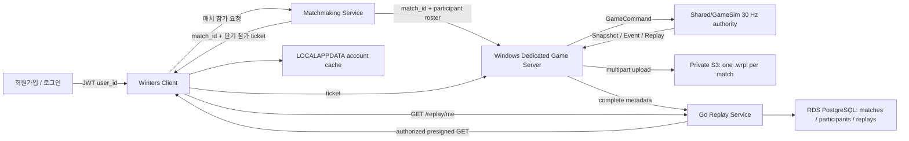

Session - AWS 백엔드·계정별 리플레이 라이브러리·부하 검증 포트폴리오 전환 계획 (2026-07-15)

> 목적: 현재 로컬 `Go + PostgreSQL + Redis + Kafka + Docker`, Windows IOCP 게임 서버, `.wrpl` 리플레이를 실제 서비스에 가까운 AWS 구조로 연결한다. 회원 계정은 자기 경기의 리플레이만 조회·다운로드하고, 원본 리플레이는 매치당 한 번만 저장한다. 이 문서는 구현 순서와 완료 게이트를 고정하는 상위 계획서이며, 아직 구현된 기능을 뜻하지 않는다.
>
> 범위: `Services/`, `Server/`, `Client/`, `Shared/Replay/`, Docker, AWS IaC, 관측성, HTTP/게임 서버/리플레이 부하 검증, 포트폴리오 산출물.
>
> 운영 예산 원칙: AWS 실험·자격증 공부·문서화 같은 ceiling work는 전체 작업시간의 최대 30%로 제한한다. 나머지 70% 이상은 계정→매치→리플레이의 실제 동작, 자동 검증, 측정 리포트라는 외부 산출물에 사용한다. 비용이 계속 발생하는 리소스는 기본적으로 `dev`에서 축소 또는 정지 가능해야 한다.
>
> 표기: `[현재]`는 코드에서 확인한 사실, `[목표]`는 구현할 상태, `CONFIRM_NEEDED`는 비용·보안·제품정책 또는 전체 코드 본문 확정 전에 별도 구현 계획과 추가 검사가 필요한 항목이다.

# 1. 반영해야 하는 코드

## 1.1 먼저 고정할 결론

리플레이 저장 경로와 소유권은 같은 개념이 아니다. 경로는 환경별 저장 위치이고, 소유권은 데이터베이스가 증명해야 한다.

| 구분 | 책임 | 최종 형태 |
| --- | --- | --- |
| 매치 원본 | Server + Shared/GameSim 결과 | 매치당 `.wrpl` 한 개 |
| 서버 임시 경로 | 게임 서버 로컬 디스크 | 업로드 완료 전 spool, 재시도 후 삭제 |
| 영구 원본 | 비공개 Amazon S3 | `match_id/replay_id` 기준 object 한 개 |
| 접근 권한 | PostgreSQL | `match_participants(match_id, user_id)` 관계 |
| 계정별 표시 | Replay API | JWT의 `user_id`로 참가 매치만 조회 |
| 클라이언트 저장 | 사용자 PC 캐시 | `%LOCALAPPDATA%/Winters/ReplayCache/<user_id>/<replay_id>.wrpl` |
| 개발자 수동 파일 | 저장소의 `Replay/*.wrpl` | `로컬/디버그` 탭으로만 분리 노출 |

S3에서 `users/<user_id>/...` 같은 폴더를 10명에게 각각 만들고 원본을 복사하지 않는다. 현재 측정 리플레이가 약 1.42GB이므로 10인 매치에서 계정별 원본 복제는 저장량과 업로드/삭제 작업을 최대 10배로 만든다. S3 prefix는 권한 경계도 아니다. 원본은 아래처럼 매치 중심의 불투명 key 한 개만 둔다.

```text
replays/v1/2026/07/15/<replay_id>.wrpl
```

사용자 A와 B가 같은 매치에 참가했다면 둘 다 같은 `replay_id`를 조회하지만, 다운로드 권한은 각각 `match_participants` 행으로 판정한다. “내 리플레이에서 숨기기”는 S3 삭제가 아니라 사용자별 라이브러리 상태만 바꾼다.



## 1.2 현재 코드에서 끊겨 있는 지점

### 1.2.1 클라이언트 표시와 로컬 기록

- `[현재]` `Client/Private/Scene/Scene_MyInfo.cpp`의 `OnEnter`와 리플레이 새로고침은 `CReplayLibrary::ListLocalReplays()`를 호출한다. 이 함수는 로그인 계정과 관계없이 `Replay/*.wrpl` 전체를 열거한다.
- `[현재]` `Client/Private/Replay/LocalMatchRecord.cpp`는 모든 계정의 로컬 전적을 `Replay/LocalMatchHistory.jsonl` 하나에 append하고 전부 다시 읽는다.
- `[현재]` `Client/Private/Scene/Scene_InGame.cpp`의 `SaveEndOfMatchArtifacts`는 display name만 기록하고 `user_id`와 실제 `match_id`를 기록하지 않는다.
- `[현재]` 백엔드 `/profile/me/history`는 JWT의 `user_id`로 필터링되지만, MyInfo 화면이 이 결과 뒤에 전역 로컬 기록을 다시 붙여서 계정 경계를 섞는다.

### 1.2.2 매치 ID와 서버 계정 식별

- `[현재]` `Services/internal/matchmaking/service.go`는 매치 성사 시 UUID `matchID`를 생성한다.
- `[현재]` `Services/internal/profile/handler.go`의 `ReportMyMatch`는 클라이언트 결과 신고를 받을 때 다시 `uuid.New()`를 호출한다. 따라서 매치메이킹의 ID와 전적 ID가 다르다.
- `[현재]` 게임 서버는 백엔드 `user_id`와 `match_id`가 포함된 신뢰 가능한 배정 정보를 받지 않는다. 클라이언트가 임의로 주장하는 계정 ID를 그대로 믿어서는 안 된다.
- `[목표]` 하나의 `match_id`가 매치메이킹 → 참가 ticket → 게임 서버 room/session → 게임 종료 이벤트 → 전적 → 리플레이까지 변경 없이 흐른다.

### 1.2.3 리플레이 파일과 메모리

- `[현재]` `Server/Private/Game/ReplayRecorder.cpp`의 `MakeDefaultPath`는 `Replay/room<room>_tick<first>_<last>.wrpl`을 만든다. 이 이름에는 계정 또는 백엔드 매치 ID가 없다.
- `[현재]` `CReplayRecorder::SaveToFile`은 OS 임시 spool을 완성한 뒤 로컬 publish 경로로 복사하고 원자적으로 교체한다. 이 spool/publish 과정은 업로드 장애 복구용으로 유지할 가치가 있다.
- `[현재]` `Client/Private/Replay/ReplayPlayer.cpp::LoadFromFile`은 모든 record payload를 `m_Records`에 적재한다. 1GB 이상 리플레이를 서비스 다운로드 경로에 그대로 연결하기 전에 스트리밍 재생 구조가 필요하다.
- `[목표]` `.wrpl` 포맷은 계정 중립·매치 중심으로 유지한다. 계정 소유권을 파일 header나 파일명에 중복 기록하지 않고 DB 관계로 관리한다.

### 1.2.4 로컬 Docker와 AWS 사이

- `[현재]` `Services/docker-compose.yml`은 PostgreSQL, Redis, Kafka만 띄운다. auth/profile/shop/matchmaking Go 프로세스는 컨테이너 대상이 아니다.
- `[현재]` `Services/pkg/config/config.go::DSN`은 항상 `sslmode=disable`이고 production secret 기본값도 코드 fallback으로 존재한다.
- `[현재]` 각 서비스의 DB pool 기본값은 20이므로 ECS task 수를 늘릴 때 `서비스 수 × task 수 × pool max`가 RDS 연결 한도를 넘을 수 있다.
- `[목표]` Go HTTP 서비스는 Linux container로 ECR/ECS Fargate에, PostgreSQL은 RDS, Redis는 ElastiCache, replay object는 S3에 둔다. Windows 게임 서버는 첫 단계에서 같은 ECS Fargate에 억지로 넣지 않고 EC2 또는 Amazon GameLift Servers 경로를 사용한다.

## 1.3 목표 데이터 모델

### 1.3.1 단일 진실 원천

```text
users.user_id
  └─ match_participants.user_id
       └─ match_participants.match_id
            ├─ matches.id
            ├─ match_history.match_id
            └─ replays.match_id ── replays.object_key ── S3 object
```

`replay_participants`라는 별도 테이블을 다시 만들지 않는다. 참가자 진실은 `match_participants` 한 곳에 두고, replay 접근은 `replays JOIN match_participants`로 판정한다. 사용자별 숨김/다운로드 상태만 `replay_user_library`에 둔다.

### 1.3.2 새 migration

새 파일: `Services/migrations/000009_create_matches_and_replays.up.sql`

```sql
CREATE TABLE matches (
    id UUID PRIMARY KEY,
    status VARCHAR(16) NOT NULL DEFAULT 'created'
        CHECK (status IN ('created', 'allocated', 'running', 'completed', 'aborted')),
    game_session_id TEXT,
    created_at TIMESTAMPTZ NOT NULL DEFAULT NOW(),
    started_at TIMESTAMPTZ,
    completed_at TIMESTAMPTZ
);

CREATE TABLE match_participants (
    match_id UUID NOT NULL REFERENCES matches(id) ON DELETE CASCADE,
    user_id UUID NOT NULL REFERENCES users(id) ON DELETE CASCADE,
    team SMALLINT,
    slot SMALLINT,
    champion_key TEXT,
    result VARCHAR(16)
        CHECK (result IS NULL OR result IN ('win', 'loss', 'draw', 'aborted')),
    joined_at TIMESTAMPTZ,
    PRIMARY KEY (match_id, user_id),
    UNIQUE (match_id, slot)
);

CREATE INDEX idx_match_participants_user_match
    ON match_participants(user_id, match_id);

CREATE TABLE replays (
    id UUID PRIMARY KEY,
    match_id UUID NOT NULL UNIQUE REFERENCES matches(id) ON DELETE CASCADE,
    status VARCHAR(16) NOT NULL DEFAULT 'uploading'
        CHECK (status IN ('uploading', 'ready', 'failed', 'expired', 'deleted')),
    object_key TEXT NOT NULL UNIQUE,
    upload_id TEXT,
    size_bytes BIGINT
        CHECK (size_bytes IS NULL OR size_bytes >= 0),
    checksum_sha256 CHAR(64),
    format_version SMALLINT NOT NULL,
    tick_rate INTEGER NOT NULL CHECK (tick_rate > 0),
    record_count BIGINT NOT NULL DEFAULT 0 CHECK (record_count >= 0),
    snapshot_count BIGINT NOT NULL DEFAULT 0 CHECK (snapshot_count >= 0),
    event_count BIGINT NOT NULL DEFAULT 0 CHECK (event_count >= 0),
    command_count BIGINT NOT NULL DEFAULT 0 CHECK (command_count >= 0),
    first_tick BIGINT NOT NULL DEFAULT 0 CHECK (first_tick >= 0),
    last_tick BIGINT NOT NULL DEFAULT 0 CHECK (last_tick >= first_tick),
    created_at TIMESTAMPTZ NOT NULL DEFAULT NOW(),
    ready_at TIMESTAMPTZ,
    expires_at TIMESTAMPTZ
);

CREATE INDEX idx_replays_status_created
    ON replays(status, created_at DESC);

CREATE TABLE replay_user_library (
    replay_id UUID NOT NULL REFERENCES replays(id) ON DELETE CASCADE,
    user_id UUID NOT NULL REFERENCES users(id) ON DELETE CASCADE,
    hidden_at TIMESTAMPTZ,
    last_downloaded_at TIMESTAMPTZ,
    keep_until TIMESTAMPTZ,
    PRIMARY KEY (replay_id, user_id)
);

CREATE INDEX idx_replay_user_library_user
    ON replay_user_library(user_id, replay_id);
```

새 파일: `Services/migrations/000009_create_matches_and_replays.down.sql`

```sql
DROP TABLE IF EXISTS replay_user_library;
DROP TABLE IF EXISTS replays;
DROP TABLE IF EXISTS match_participants;
DROP TABLE IF EXISTS matches;
```

`CONFIRM_NEEDED`: `match_history.match_id`의 기존 개발 데이터와 중복 행을 검사한 다음, 후속 migration에서 `UNIQUE(user_id, match_id)`와 `matches(id)` FK를 추가한다. 현재 클라이언트 self-report가 매번 새 UUID를 생성하므로 이 제약을 이번 migration에 즉시 넣으면 과거 데이터 의미를 잘못 고정할 수 있다.

## 1.4 단계 A — 즉시 가능한 로컬 계정 분리

이 단계는 AWS 없이도 MyInfo의 혼합 표시를 바로 끊는다. 다만 로컬 분리는 보안의 최종 근거가 아니며, 로그인 계정의 cloud library는 단계 D에서 Replay API 결과로 교체한다.

### `Client/Public/Replay/LocalMatchRecord.h`

기존 `struct LocalMatchRecord` 전체를 아래로 교체:

```cpp
struct LocalMatchRecord
{
	std::string strUserID{};
	std::string strDisplayName{};
	std::string strMatchID{};
	std::string strResult{};   // "victory" | "defeat" | "aborted"
	u64_t uEndTick = 0;
};
```

기존 함수 선언 2개를 아래로 교체:

```cpp
bool_t AppendLocalMatchRecord(
	const std::string& strUserID,
	const LocalMatchRecord& record);

std::vector<std::string> LoadLocalMatchRecordSummaries(
	const std::string& strUserID);
```

### `Client/Private/Replay/LocalMatchRecord.cpp`

기존 `kLocalMatchHistoryPath`와 전역 `Replay` 디렉터리 사용을 삭제하고, 아래 책임을 갖는 helper를 익명 namespace에 추가한다.

```cpp
std::filesystem::path ResolveAccountDataRoot();
std::filesystem::path ResolveLocalMatchHistoryPath(const std::string& strUserID);
bool_t IsSafeAccountKey(const std::string& strUserID);
```

- `ResolveAccountDataRoot`는 `SHGetKnownFolderPath(FOLDERID_LocalAppData, ...)`로 `%LOCALAPPDATA%/Winters`를 구한다.
- `IsSafeAccountKey`는 backend UUID 또는 literal `offline`만 허용하고 path traversal을 거부한다.
- append JSON에는 `user_id`, `display_name`, `match_id`, `result`, `end_tick`, `utc`를 기록한다.
- loader는 요청된 계정 경로 하나만 읽는다.
- 기존 `Replay/LocalMatchHistory.jsonl`은 자동 병합하지 않는다. 개발자가 필요할 때만 별도 `Legacy Local` 보기에서 읽는다.

`CONFIRM_NEEDED`: 위 세 helper와 Win32 resource lifetime을 포함한 `.cpp` 전체 본문은 Windows known-folder API include/link 상태를 검사한 단계 A 구현 계획서에서 완성한다.

### `Client/Public/Replay/ReplayLibrary.h`

기존 `ReplayListItem` 전체를 아래로 교체:

```cpp
struct ReplayListItem
{
	std::string replayID;
	std::string matchID;
	wstring_t localPath;
	std::string displayName;
	uint64_t fileSizeBytes = 0;
	bool_t bDownloaded = false;
	bool_t bLocalDebug = false;
};
```

기존 `CReplayLibrary` public 선언을 아래로 교체:

```cpp
class CReplayLibrary final
{
public:
	static wstring_t GetAccountReplayCacheDirectory(const std::string& strUserID);
	static std::vector<ReplayListItem> ListAccountReplayCache(
		const std::string& strUserID);
	static std::vector<ReplayListItem> ListLocalDebugReplays();
};
```

### `Client/Private/Replay/ReplayLibrary.cpp`

기존 `GetReplayDirectory`와 `ListLocalReplays`를 위 인터페이스 구현으로 교체한다.

- `ListAccountReplayCache`는 `%LOCALAPPDATA%/Winters/ReplayCache/<safe-user-id>/`만 열거한다.
- 파일명은 `<replay-id>.wrpl`이어야 하며 `.part`는 표시하지 않는다.
- `ListLocalDebugReplays`만 저장소 실행경로의 `Replay/*.wrpl`을 읽는다.
- authenticated cloud 목록과 debug 목록을 한 vector에 합치지 않는다.

`CONFIRM_NEEDED`: known-folder helper를 `LocalMatchRecord.cpp`와 중복 만들지 않도록 기존 Client utility 위치를 검사한다. 공용 helper가 이미 없다면 단일 새 utility가 필요하며, 새 파일 전체 본문을 단계 A 구현 계획서에 포함한다.

### `Client/Private/Scene/Scene_InGame.cpp`

기존 `CScene_InGame::SaveEndOfMatchArtifacts` 안의 `LocalMatchRecord` 구성부를 아래 책임으로 교체:

```cpp
Winters::LocalMatchRecord record{};
record.strUserID = CClientShellSession::Instance().GetUserID();
record.strDisplayName = CClientShellSession::Instance().GetDisplayName();
record.strMatchID = CClientShellSession::Instance().GetMatchID();
record.strResult = pResultLabel ? pResultLabel : "unknown";
record.uEndTick = m_pSnapshotApplier
	? m_pSnapshotApplier->GetLastAppliedServerTick()
	: 0ull;
Winters::AppendLocalMatchRecord(record.strUserID, record);
```

`CONFIRM_NEEDED`: 현재 `CClientShellSession`에는 `GetMatchID()`가 없으므로 단계 B의 identity bridge와 함께 추가한다. 단계 A만 먼저 적용할 때는 빈 `match_id`를 허용하되, cloud 업로드/전적 권한에는 사용하지 않는다.

### `Client/Public/Scene/Scene_MyInfo.h`, `Client/Private/Scene/Scene_MyInfo.cpp`

다음 UI 상태를 분리한다.

```text
내 전적       = /profile/me/history (로그인) 또는 현재 account local history (offline)
내 리플레이   = /replay/me 결과 + 현재 계정 cache 상태
로컬/디버그   = Replay/*.wrpl, 명시적으로 탭을 열었을 때만 표시
```

- `OnEnter`에서 전역 `ListLocalReplays()` 호출을 제거한다.
- authenticated 상태에서는 `RequestReplayLibrary()`를 호출한다.
- offline 상태에서는 `ListAccountReplayCache("offline")`만 표시한다.
- “재생”은 다운로드 완료 파일만 연다. 미다운로드 항목은 “다운로드” 버튼을 표시한다.
- 다운로드 중 progress, checksum 실패, URL 만료, 디스크 부족 오류를 표시한다.

## 1.5 단계 B — 계정→매치→게임 서버 신뢰 연결

AWS/S3보다 이 단계가 먼저다. `user_id`를 클라이언트 입력값으로 믿지 않고, backend가 만든 짧은 수명의 매치 참가 ticket을 서버가 검증한다.

### `Services/internal/matchmaking/service.go`

기존 `createMatch`에서 Redis status와 Kafka event만 기록하는 흐름을 아래 트랜잭션으로 교체한다.

```text
1. UUID match_id 생성
2. matches(status=created) insert
3. match_participants에 매치된 user_id 전부 insert
4. 게임 세션 배정 요청
5. user마다 match_id/user_id/game_session_id/expiry가 묶인 단기 ticket 발급
6. Redis status에는 match_id, endpoint, ticket을 구조화하여 저장
7. DB commit 후 MatchCreated event 발행
```

Kafka 발행 실패와 DB commit 사이에는 outbox pattern을 사용한다. “DB에는 매치가 있는데 event가 유실된 상태”를 허용하지 않는다.

`CONFIRM_NEEDED`: 새 `match_outbox` migration, ticket signer, repository 분리 파일의 전체 본문은 다음을 검사한 별도 단계 B 계획에서 작성한다.

- 현재 TCP/UDP handshake 중 어느 경로가 production 기본인지.
- `UdpIocpCore`의 opaque ticket validator를 `bool`이 아니라 resolved identity로 확장할 정확한 경계.
- TCP에서도 동일 ticket을 받도록 `Shared/Schemas`를 확장할지, transport-neutral `ServerSessionHub`에서 먼저 통합할지.
- 로컬 전용 debug 접속을 별도 flag로 유지할지.

### `Services/internal/matchmaking/model.go`

기존 `MatchStatus`를 아래 계약으로 확장:

```go
type MatchStatus struct {
	Status        string `json:"status"`
	MatchID       string `json:"match_id,omitempty"`
	GameSessionID string `json:"game_session_id,omitempty"`
	Host          string `json:"host,omitempty"`
	Port          int    `json:"port,omitempty"`
	Transport     string `json:"transport,omitempty"`
	PlayerTicket  string `json:"player_ticket,omitempty"`
	ExpiresAt     string `json:"expires_at,omitempty"`
}
```

### `ClientShellSession`과 네트워크 연결

- `Client/Public/ClientShell/ClientShellSession.h`에 authenticated account와 별도로 `match_id`, `game_session_id`, `player_ticket`, expiry를 보관한다.
- match ticket은 로그에 원문을 쓰지 않고 매치 종료/로그아웃 시 제거한다.
- Client는 TCP/UDP 연결 때 ticket만 전달하며 `user_id`를 신뢰 정보로 따로 주장하지 않는다.
- Server validator는 ticket으로 `match_id`, `user_id`, `game_session_id`를 복원하고 만료·서명·session 일치를 검사한다.
- `CGameRoom`은 참가자 roster를 소유하되 게임 결과의 진실은 계속 Shared/Server GameSim에 둔다.

### `Services/internal/profile/handler.go`

기존 `POST /profile/me/matches` self-report 경로는 단계 B 완료 후 삭제한다. 개발 중에는 명시적 dev flag 아래에서만 허용하고 response에 `dev_only=true`를 표시한다.

게임 종료는 Server가 `MatchCompleted`를 한 번 발행하고, profile consumer가 `(user_id, match_id)` idempotency key로 전적/MMR/RP를 반영한다. 클라이언트 승패 문자열은 보상이나 전적의 권위 데이터가 아니다.

## 1.6 단계 C — Go Replay Service와 S3 multipart 업로드

### API 계약

| 호출자 | 메서드/경로 | 책임 |
| --- | --- | --- |
| Game Server | `POST /internal/replays/uploads` | match/roster 권한 확인, replay row 생성, multipart 시작 |
| Game Server | `POST /internal/replays/{replay_id}/parts` | 필요한 part 번호의 presigned PUT URL 발급 |
| Game Server | `POST /internal/replays/{replay_id}/complete` | ETag/checksum/size 검증 후 multipart 완료 및 ready 전환 |
| Game Server | `POST /internal/replays/{replay_id}/abort` | 실패 upload 중단 및 failed 전환 |
| Client | `GET /replay/me?cursor=...` | JWT 사용자의 참가 replay만 페이지 조회 |
| Client | `GET /replay/{replay_id}` | 참가 권한 확인 후 metadata 조회 |
| Client | `POST /replay/{replay_id}/download` | 참가 권한 확인 후 짧은 만료의 presigned GET 발급 |
| Client | `DELETE /replay/{replay_id}/me` | 원본 삭제가 아니라 내 목록에서 숨김 |

응답 예시:

```json
{
  "data": {
    "replay_id": "8e20...",
    "match_id": "94c1...",
    "status": "ready",
    "size_bytes": 1524713390,
    "checksum_sha256": "...",
    "format_version": 2,
    "tick_rate": 30,
    "created_at": "2026-07-15T12:00:00Z",
    "expires_at": "2026-08-14T12:00:00Z",
    "downloaded": false
  }
}
```

### 전송 원칙

- 1.42GB body를 Go Replay Service가 받아 다시 S3로 proxy하지 않는다. 그러면 앱 task network와 memory/timeout이 데이터 크기에 묶인다.
- Replay Service는 권한·metadata·presign을 담당하고 실제 part PUT/GET은 Game Server/Client와 S3 사이에서 흐른다.
- 기본 part size는 64MiB로 시작하되 마지막 part를 제외한 S3 최소 part 크기와 최대 part 개수 조건을 계산으로 보장한다.
- 업로드 완료 전 로컬 spool을 삭제하지 않는다. complete 성공과 S3 `HeadObject`의 size/checksum 확인 뒤에만 삭제한다.
- 중단된 multipart upload는 S3 lifecycle의 abort rule과 service reconciliation job 두 겹으로 정리한다.

### 설정 변경

`Services/pkg/config/config.go`의 `Config`에 아래 그룹을 추가한다.

```go
type ReplayConfig struct {
	Port                 string
	Bucket               string
	Region               string
	ObjectPrefix         string
	UploadURLTTL         time.Duration
	DownloadURLTTL       time.Duration
	MultipartPartBytes   int64
	DefaultRetentionDays int
	InternalTokenSecret  string
}
```

- `Config`에는 `Replay ReplayConfig`를 둔다.
- production에서는 JWT/S3/internal secret의 fallback을 허용하지 않고 누락 시 fail-fast한다.
- DB SSL mode를 환경변수로 분리하고 RDS production은 TLS를 강제한다.
- service 시작 log에 bucket name은 가능하지만 secret, access token, presigned URL은 기록하지 않는다.

### 새 Go package와 binary

`CONFIRM_NEEDED` — 새 파일 전체 본문은 단계 C 구현 계획서에서 확정한다.

```text
Services/cmd/replay/main.go
Services/internal/replay/model.go
Services/internal/replay/repository.go
Services/internal/replay/service.go
Services/internal/replay/handler.go
Services/internal/replay/storage.go
Services/internal/replay/s3_storage.go
Services/internal/replay/handler_test.go
Services/internal/replay/repository_test.go
```

확정 전에 다음을 검사한다.

- `go.mod`의 Go version과 AWS SDK for Go v2 module 버전.
- local test용 MinIO/LocalStack 중 어느 하나를 추가할지. 포트폴리오 일관성을 위해 MinIO를 우선 검토한다.
- internal endpoint 인증을 전용 단기 service JWT로 할지 AWS IAM/SigV4로 할지. GameLift/EC2 role과 local 개발을 모두 만족하는 최소 설계를 고른다.
- cursor pagination의 정렬 key를 `(created_at, replay_id)`로 고정한다.

## 1.7 단계 C-2 — Windows Game Server 업로더

`CReplayRecorder`는 기록과 로컬 파일 seal까지만 담당한다. 네트워크 업로드를 recorder 내부에 넣지 않는다.

### `Server/Public/Game/ReplayRecorder.h`, `Server/Private/Game/ReplayRecorder.cpp`

- `MakeDefaultPath()`를 `MakeSpoolPublishPath(const std::string& strMatchID)`로 교체하고, 경로 root는 server config에서 받는다.
- 최종 파일명은 `<match-id>_<replay-id>.wrpl`이 아니라 upload 시작 전에는 `<match-id>.wrpl.pending`으로 충분하다. canonical ID와 object key는 Replay Service가 발급한다.
- `SaveToFile`은 sealed replay metadata를 반환하도록 결과 구조를 추가한다.

```cpp
struct ReplayArtifact
{
	wstring_t path{};
	u64_t sizeBytes = 0;
	u32_t formatVersion = 0;
	u32_t tickRate = 0;
	u32_t recordCount = 0;
	u32_t snapshotCount = 0;
	u32_t eventCount = 0;
	u32_t commandCount = 0;
	u64_t firstTick = 0;
	u64_t lastTick = 0;
	std::string checksumSHA256{};
};
```

### 새 업로드 계층

`CONFIRM_NEEDED` — 새 파일 전체 본문은 WinHTTP streaming PUT, SHA-256 provider, server shutdown/retry lifetime을 검사한 단계 C-2 구현 계획서에서 확정한다.

```text
Server/Public/Backend/ReplayUploadClient.h
Server/Private/Backend/ReplayUploadClient.cpp
Server/Public/Game/ReplayUploadQueue.h
Server/Private/Game/ReplayUploadQueue.cpp
```

책임은 다음과 같다.

- `ReplayUploadClient`: control API JSON 호출과 presigned part PUT만 담당.
- `ReplayUploadQueue`: GameRoom 종료와 분리된 background job, bounded concurrency, exponential backoff, process shutdown drain.
- 한 part만 memory에 둔다. 전체 replay를 `std::vector` 또는 `std::string`으로 만들지 않는다.
- 완료 전 실패하면 `.pending`과 작은 sidecar metadata를 남겨 다음 기동 때 재시도한다.
- bounded `OutputDebugStringA/W`와 JSON structured log에 replay_id/match_id/part/status/latency를 남기되 ticket/URL은 제외한다.

### `Server/Private/Game/GameRoomReplication.cpp`

기존 `FinalizeReplayRecorder`의 성공 분기를 아래 순서로 바꾼다.

```text
1. authoritative match 종료 latch 확인
2. recorder seal/publish
3. ReplayArtifact 생성
4. trusted match_id + participant roster와 함께 upload queue enqueue
5. enqueue 성공 여부를 room 종료와 분리하여 기록
6. upload complete 뒤 local artifact 삭제
```

리플레이 업로드 실패 때문에 30Hz GameRoom tick 또는 room 종료가 block되면 안 된다.

## 1.8 단계 D — Client cloud library, 다운로드, 스트리밍 재생

### Replay API client

`CONFIRM_NEEDED` — 새 파일 전체 본문은 기존 `ProfileClient` JSON/async pattern과 `CClientShellBackendService` lifetime을 그대로 따르는 단계 D 구현 계획서에서 확정한다.

```text
Client/Public/Network/Backend/ReplayClient.h
Client/Private/Network/Backend/ReplayClient.cpp
```

필요 모델:

```cpp
struct ReplayMetadata
{
	string replayID;
	string matchID;
	string status;
	u64_t sizeBytes = 0;
	string checksumSHA256;
	i32_t formatVersion = 0;
	i32_t tickRate = 0;
	string createdAt;
	string expiresAt;
	bool_t bDownloaded = false;
};
```

`CClientShellBackendService`는 Profile/Shop/Match client와 같은 수명으로 Replay client를 만들고 auth token을 전달한다. callback이 scene 파괴 후 raw `this`를 참조하지 않도록 기존 async lifetime 규칙을 지킨다.

### `Client/Public/Network/Backend/CHttpClient.h`, `Client/Private/Network/Backend/CHttpClient.cpp`

현재 `HttpResponse.body`는 전체 response를 `string`에 누적한다. replay download에는 사용하지 않는다. 아래 별도 streaming API를 추가한다.

```cpp
struct HttpDownloadResult
{
	i32_t statusCode = 0;
	bool_t success = false;
	wstring_t temporaryPath{};
	u64_t bytesWritten = 0;
	string error{};
};

using HttpDownloadProgress = function<void(u64_t, u64_t)>;
using HttpDownloadCallback = function<void(const HttpDownloadResult&)>;
```

```cpp
void AsyncDownloadToFile(
	const string& absoluteURL,
	const wstring_t& temporaryPath,
	HttpDownloadProgress progress,
	HttpDownloadCallback callback);
```

- absolute presigned URL의 HTTPS scheme, host, port, query를 손실 없이 parsing한다.
- 1MiB 이하 bounded buffer로 파일에 순차 기록한다.
- 성공 전 `<replay-id>.wrpl.part`에 쓰고, size/SHA-256/format header 검증 후 `.wrpl`로 원자 rename한다.
- URL 만료 시 Replay API에서 새 URL을 한 번 재발급한다. 무한 재시도하지 않는다.
- 계정이 바뀌면 진행 중 callback이 다른 계정 UI에 반영되지 않도록 request generation을 비교한다.

### `Client/Public/Replay/ReplayPlayer.h`, `Client/Private/Replay/ReplayPlayer.cpp`

기존 `ReplayRecord { header, payload vector }` 전량 적재를 삭제하고 아래 index로 교체한다.

```cpp
struct ReplayRecordIndex
{
	Winters::Replay::ReplayRecordHeader header{};
	u64_t payloadOffset = 0;
};
```

- load 시 header와 record header만 scan하여 offset index를 만든다.
- payload는 적용할 tick group만 seek/read/verify한다.
- snapshot → event 순서의 기존 authoritative playback 계약을 유지한다.
- command journal validation은 scan 또는 on-demand 중 한 곳에서 반드시 유지한다.
- v2 파일 포맷 변경 없이 1차 스트리밍 재생을 완성한다.
- 원격 S3 range streaming/seek는 2차 범위다. 첫 포트폴리오 완료 조건은 “다운로드 후 로컬 스트리밍 재생”이다.

## 1.9 단계 E — Docker와 AWS 배치

### 로컬 container parity

auth/profile/shop/matchmaking/replay를 동일 multi-stage Go Dockerfile의 서로 다른 build target 또는 build arg로 만든다. image는 non-root, read-only root filesystem, health endpoint, graceful shutdown을 만족해야 한다.

`CONFIRM_NEEDED` — 아래 새 파일은 Go build context와 `Data/Account/AccountEconomyPolicy.json` runtime 주입 방식을 확정한 Docker 구현 계획서에서 전체 본문을 작성한다.

```text
Services/Dockerfile
Services/.dockerignore
Services/docker-compose.apps.yml
Services/docker-compose.replay.yml
```

`Services/docker-compose.yml`의 PostgreSQL/Redis/Kafka는 local dependency profile로 유지한다. MinIO를 선택하면 replay profile에서만 기동한다. 앱 compose에는 health dependency와 각 service 환경변수를 명시한다.

### AWS 서비스 매핑

| 현재 구성 | AWS 1차 | 이유 |
| --- | --- | --- |
| Go auth/profile/shop/matchmaking/replay | ECR + ECS Fargate | Linux container 배포/스케일 단위 |
| public HTTP ingress | ALB + ACM HTTPS | path routing, health check, TLS 종료 |
| PostgreSQL | RDS PostgreSQL private subnet | 영속 관계 데이터와 backup |
| Redis | ElastiCache for Redis/Valkey private subnet | queue/status/cache |
| `.wrpl` | private S3 | 대용량 object, lifecycle, presigned access |
| secret/env | Secrets Manager + task role | image/repo에 secret 비저장 |
| log/metric/alarm | CloudWatch | task/RDS/ALB/replay/game metric |
| Windows dedicated game server | EC2 staging → GameLift Servers | long-lived UDP/TCP game session, fleet/session 배정 |

Go API는 ECS Fargate에 적합하지만, 현재 Windows IOCP 게임 서버는 30Hz 상태ful session과 UDP/TCP port, room/process 수명주기가 있으므로 동일 ALB/Fargate 웹 서비스처럼 취급하지 않는다. Amazon GameLift Servers 도입은 Server SDK callback, process readiness, game session/player session 검증을 연결하는 별도 단계로 둔다.

### 네트워크와 IAM

```text
Public subnet: ALB only
Private app subnet: ECS tasks
Private data subnet: RDS, ElastiCache
Private game subnet/fleet: Game server
S3: public access block + bucket policy + gateway endpoint 검토
```

- Client는 S3 credential을 받지 않는다. 권한 확인 후 발급된 짧은 presigned GET만 사용한다.
- ECS task execution role과 application task role을 분리한다.
- Replay service role만 replay prefix의 multipart create/complete/abort/presign에 필요한 권한을 갖는다.
- Game server가 presigned PUT을 쓰는 설계에서는 S3 permanent credential이 없다.
- bucket은 public access block, encryption, versioning 정책을 명시한다.
- lifecycle은 `uploading` 정리, ready object 보관, 만료/보존 예외를 구분한다.

### IaC

`CONFIRM_NEEDED` — 새 Terraform 파일 전체 본문은 AWS account/region/domain/월 ceiling budget과 Kafka 선택을 받은 뒤 IaC 구현 계획서에서 확정한다.

```text
infra/terraform/modules/network/
infra/terraform/modules/ecr/
infra/terraform/modules/ecs_service/
infra/terraform/modules/rds/
infra/terraform/modules/redis/
infra/terraform/modules/replay_bucket/
infra/terraform/modules/observability/
infra/terraform/environments/dev/
infra/terraform/environments/staging/
```

`CONFIRM_NEEDED — Kafka`: 현재 코드가 `kafka-go`에 의존하지만, dev/staging에서 Amazon MSK를 상시 유지할지, SNS/SQS/EventBridge + outbox로 교체할지는 비용과 코드 변경량을 함께 결정해야 한다. 결정 전에는 “production-ready Kafka”라고 포트폴리오에 쓰지 않는다.

## 1.10 단계 F — CI/CD, 관측성, 보안

### CI/CD

```text
PR: gofmt/go test/go vet + C++ affected build + migration lint + Terraform fmt/validate + secret scan
main tag: Docker build → ECR push → ECS task definition revision → staging deploy
post deploy: health/smoke/migration compatibility/replay authorization test
failure: previous ECS task definition rollback
```

GitHub Actions에서 static AWS access key를 저장하지 않고 OIDC role federation을 사용한다. production deploy와 destructive Terraform apply는 manual approval을 둔다.

`CONFIRM_NEEDED` — workflow와 Terraform 새 파일의 전체 본문은 실제 remote repository/default branch/ECR naming을 확인한 CI/CD 구현 계획서에서 작성한다.

### 최소 metric

| 계층 | metric/log |
| --- | --- |
| ALB/API | request count, p50/p95/p99, 4xx/5xx, target response time |
| ECS | running task, restart, CPU, memory, deploy failure |
| RDS | connections, CPU, free storage, query latency, locks |
| Redis | memory, eviction, connection, command latency |
| Replay control plane | upload initiated/completed/failed, presign latency, auth denied |
| Replay data plane | part bytes/time, checksum mismatch, retry, orphan multipart |
| Game server | active rooms/players, tick p50/p95/p99/max, deadline miss, snapshot bytes, replay spool bytes |

CloudWatch alarm은 “CPU가 높다”만 보지 않고 사용자 영향과 연결한다. 예: API 5xx, p95 latency, replay complete failure, game tick deadline miss, RDS connection saturation.

## 1.11 단계 G — 부하 테스트 범위와 정직한 수치

### 테스트를 세 계층으로 분리

1. HTTP control plane: auth/profile/shop/matchmaking/replay metadata API.
2. Replay data plane: server multipart upload, client S3 download, checksum/캐시/재생.
3. Game data plane: 외부 headless client가 실제 TCP/UDP로 연결해 명령과 snapshot/event를 주고받는 CCU.

이 셋의 RPS/throughput/CCU를 한 숫자로 합치지 않는다.

### 현재 말할 수 있는 baseline

- 10 bot, 54,000 tick(30 simulation minutes)에서 tick p99 약 3.44~3.55ms, peak 약 53MiB, replay 약 1.42GB인 단일 room 계열 측정이 있다.
- process-isolated 1/2/4/8 actor preflight에서 8 actor aggregate 약 6,002 ticks/s를 본 적이 있지만, 실제 networked multi-room CCU 증명은 아니다.
- UDP 보고서에서 client payload 약 451.6KiB/s, 5 client bidirectional 약 2.506MiB/s, snapshot p95 19,808B가 관측됐고 4 datagram 이하를 위한 약 76.9% 축소 목표가 남아 있다.

따라서 포트폴리오에는 현재 상태를 “80 CCU 지원”처럼 쓰지 않는다. 아래 gate를 통과한 최대 단계만 쓴다.

### HTTP 단계

```text
smoke: 1 VU / 1분
ramp 1: 10 VU / 5분
ramp 2: 25 VU / 10분
ramp 3: 50 VU / 10분
ramp 4: 100 VU / 15분
optional: 200 VU / 15분 (100 VU gate 통과 뒤)
```

첫 목표는 `p95 < 200ms`, `http_req_failed < 1%`, 무결성 오류 0, RDS connection saturation 없음이다. 최종 RPS는 미리 약속하지 않고 실제 도달 수치를 기록한다. auth login만 반복해 DB/암호 hashing을 과장하거나, health endpoint만 때려 전체 서비스 성능처럼 쓰지 않는다.

### Replay 단계

- control API는 10/25/50/100 VU로 list/presign 권한을 측정한다.
- data plane은 64MiB, 256MiB 합성 파일로 1/2/4/8 동시 multipart upload와 download를 측정한다.
- 실제 1.42GB `.wrpl` 한 개는 end-to-end integrity/download/playback 검증으로 사용한다.
- app service RPS와 S3 byte throughput을 분리해 기록한다. presigned URL 사용 시 file bytes가 ALB/ECS를 통과하지 않는 것이 정상이다.
- checksum mismatch 0, orphan multipart 0, URL 만료 후 권한 재검증, 다른 계정 download 403을 필수 gate로 둔다.

### Game CCU 단계

```text
10 CCU → 20 CCU → 40 CCU → 80 CCU
각 단계: 외부 프로세스/머신의 실제 handshake, command ingress, snapshot/event 수신
각 단계: 30분 soak + 2분 join burst + disconnect/reconnect
```

통과 조건:

- 30Hz deadline miss 0.
- tick p99 목표 8ms 이하, max 33.33ms 미만.
- command reject/drop 이유별 count와 snapshot fragmentation/bandwidth를 기록.
- replay 기록과 upload를 켠 상태로 측정.
- CPU/RAM/network와 room/process 수를 함께 기록.

목표 8ms는 현재 single-room p99 대비 headroom을 확보하기 위한 1차 기준이다. 실패하면 숨기지 않고 snapshot 크기, multi-room 경합, upload I/O, DB/API와 분리하여 병목을 보고한다.

### 새 부하 도구

`CONFIRM_NEEDED` — 아래 새 파일 전체 본문은 실제 endpoint payload, test account seed/cleanup, headless transport path를 확인한 부하 테스트 계획서에서 작성한다.

```text
Services/loadtest/k6/auth_profile_shop.js
Services/loadtest/k6/matchmaking.js
Services/loadtest/k6/replay_control.js
Services/loadtest/k6/replay_data.js
Tools/NetworkLoadClient/
```

## 1.12 단계 H — 포트폴리오 산출물과 자격증 연결

포트폴리오의 중심은 AWS 서비스 이름 나열이 아니라 아래 문제→설계→검증 서사다.

```text
문제:
  모든 로컬 replay가 모든 profile에 보임
  match_id가 matchmaking/history/server replay 사이에서 끊김
  1.42GB replay의 전체 memory load와 서비스 proxy가 위험함

결정:
  S3 원본 1개 + PostgreSQL participant ACL + presigned multipart/GET
  계정별 local cache + debug replay 분리
  authoritative server completion + idempotent consumer

증명:
  cross-account 403
  object 1개
  checksum 일치
  bounded memory playback
  HTTP/Replay/Game 부하 수치와 비용
  IaC/CI/CD/CloudWatch alarm/rollback
```

필수 산출물:

- AWS 아키텍처 diagram과 trust boundary.
- Terraform module/환경 구조와 `plan` 결과.
- 배포/rollback runbook.
- 계정 A/B replay authorization 통합 테스트 영상 또는 캡처.
- S3 object 1개와 두 사용자 library row를 보여주는 증거.
- k6 report, Game CCU report, replay throughput/memory report.
- 비용 ceiling과 test 후 resource teardown 기록.
- 장애 사례 한 건 이상: 예를 들어 multipart complete 실패 → 재시도 → 정상 수렴.

자격증은 구현을 대신하지 않는다. 현재 프로젝트와 가장 잘 맞는 순서는 다음과 같다.

1. AWS Certified Solutions Architect - Associate: VPC, IAM, ECS, RDS, S3, resiliency, 성능, 비용 설계의 폭을 검증한다.
2. AWS Certified Developer - Associate: AWS 서비스 기반 개발, 인증/보안, 배포, 관측/트러블슈팅을 보강한다.
3. AWS Certified CloudOps Engineer - Associate: 실제 운영, 로그/모니터링, 장애복구, 자동화, 네트워크를 더 깊게 검증한다.

이 프로젝트는 SAA 공부의 사례가 아니라, SAA의 secure/resilient/high-performing/cost-optimized 판단을 실제 코드와 측정으로 증명하는 사례로 만든다.

## 1.13 실행 순서와 완료 정의

| 순서 | 구현 slice | 완료 정의 |
| --- | --- | --- |
| 1 | 로컬 account cache/debug 분리 | 계정 전환 시 다른 local history/replay가 MyInfo에 섞이지 않음 |
| 2 | match identity/ticket bridge | 하나의 match_id가 backend→client→server→event에 유지됨 |
| 3 | authoritative match completion | client self-report 없이 전적이 idempotent하게 생성됨 |
| 4 | replay DB/API + local object store | 계정 A/B ACL과 원본 1개 모델이 로컬 통합 테스트를 통과 |
| 5 | server multipart uploader | 1.42GB replay를 bounded memory로 업로드하고 재시도 가능 |
| 6 | client library/download/cache | 자기 replay만 조회, `.part`→검증→atomic publish |
| 7 | streaming ReplayPlayer | 1.42GB를 전체 memory 적재 없이 재생 |
| 8 | Docker app parity | auth/profile/shop/matchmaking/replay가 compose에서 health 통과 |
| 9 | AWS dev IaC | ECS/RDS/Redis/S3/ALB/Secrets/CloudWatch가 Terraform으로 재현됨 |
| 10 | EC2/GameLift staging | 실제 player session과 match_id가 game server에 배정됨 |
| 11 | 부하/장애/비용 검증 | 최대 통과 단계와 실패 병목을 보고서로 고정 |
| 12 | 포트폴리오 정리 | diagram, code, test, metrics, tradeoff, teardown 증거 공개 가능 |

다음 slice로 넘어가기 전에 현재 slice의 자동 테스트와 증거 파일을 커밋 가능한 상태로 만든다. AWS 리소스를 먼저 만들고 identity bridge를 나중에 미루지 않는다.

# 2. 검증

## 2.1 정적 검사

```powershell
git diff --check
rg -n "Replay/LocalMatchHistory.jsonl|ListLocalReplays\(" Client
rg -n "uuid.New\(\)" Services/internal/profile Services/internal/matchmaking
rg -n "sslmode=disable|change-in-production" Services
rg -n "Replay/room|MakeDefaultPath" Server Client
```

완료 시 기대:

- authenticated MyInfo 경로에서 전역 `Replay/*.wrpl` 열거가 제거되어 있다.
- production config가 dev secret fallback 또는 `sslmode=disable`로 조용히 기동하지 않는다.
- profile self-report가 새 match UUID를 만들지 않는다.
- server replay publish가 trusted `match_id`와 연결된다.

## 2.2 Go 단위·통합 테스트

```powershell
Set-Location C:\Users\user\Desktop\Winters\Services
go test ./...
go vet ./...
```

필수 테스트 case:

- user A와 B가 같은 match participant이면 동일 replay metadata를 조회한다.
- 참가하지 않은 user C는 metadata/download 모두 403이다.
- 만료/변조 ticket은 game session 입장이 거부된다.
- `complete` 두 번 호출은 object/전적을 중복 생성하지 않는다.
- S3 complete 성공 전 replay status는 `ready`가 아니다.
- DB commit 후 event 발행 실패는 outbox retry로 회복한다.
- 숨기기는 `replay_user_library.hidden_at`만 바꾸고 canonical object를 삭제하지 않는다.
- pagination에서 같은 timestamp가 있어도 누락/중복이 없다.

## 2.3 migration 검증

```powershell
Set-Location C:\Users\user\Desktop\Winters\Services
docker compose up -d postgres redis kafka
migrate -path migrations -database $env:WINTERS_TEST_DATABASE_URL up
migrate -path migrations -database $env:WINTERS_TEST_DATABASE_URL down 1
migrate -path migrations -database $env:WINTERS_TEST_DATABASE_URL up 1
```

확인:

- FK/unique/check constraint가 예상대로 실패한다.
- 기존 000001~000008 데이터 위에 migration이 적용된다.
- down/up round trip 후 schema가 동일하다.
- 새 파일을 추가한 단계에서는 관련 `.vcxproj`/CMake/source list 포함 여부를 별도 확인한다. 계획 문서에 project XML 수정안을 미리 복제하지 않는다.

## 2.4 로컬 end-to-end

```text
1. 계정 A, B, C 생성
2. A/B 매치 성사 → 하나의 match_id 확인
3. Server가 ticket으로 A/B만 수락
4. 매치 종료 → authoritative MatchCompleted 1회
5. .wrpl seal → multipart local object store upload → ready
6. A/B /replay/me에는 같은 replay_id 표시
7. C /replay/me에는 미표시, 직접 download 요청은 403
8. A 다운로드 → account cache .part → checksum → .wrpl
9. B 다운로드 없이도 A cache가 B profile 화면에 나타나지 않음
10. Legacy Replay/*.wrpl은 Local/Debug 탭에서만 표시
```

## 2.5 C++ build와 replay 회귀

```powershell
msbuild C:\Users\user\Desktop\Winters\Winters.sln /m /t:Shared,Server,Client /p:Configuration=Debug /p:Platform=x64
```

필수 검증:

- 기존 v2 `.wrpl`을 계속 연다.
- corrupt header/payload/trailing bytes/non-monotonic tick 방어가 유지된다.
- snapshot을 event보다 먼저 적용하는 같은-tick 규칙이 유지된다.
- 1.42GB file open 시 replay subsystem의 추가 resident memory가 256MiB 이하인 것을 capture한다. 실패하면 수치를 숨기지 않고 index/payload cache를 조정한다.
- download 중 client 종료, 계정 전환, URL 만료, disk full, checksum mismatch에서 `.part`가 정식 파일로 승격되지 않는다.
- server shutdown 중 upload job은 bounded drain 후 재시도 sidecar를 남긴다.

## 2.6 AWS 보안·운영 검증

```text
Terraform plan: public IP가 ALB 외 app/data resource에 없음
IAM policy simulation: Client credential 없음, Replay role least privilege
S3: Block Public Access, encryption, lifecycle, incomplete multipart abort
RDS: private subnet, TLS, backup/restore rehearsal
Secrets: image/log/task definition plaintext에 secret 없음
ALB: HTTPS redirect, health check, 4xx/5xx alarm
ECS: task replacement/rollback smoke
```

presigned URL 원문을 log/portfolio screenshot에 노출하지 않는다. URL 만료 전에도 참가 권한이 철회될 수 있다는 특성 때문에 download URL TTL은 짧게 유지하고, 민감한 영구 공유 링크처럼 사용하지 않는다.

## 2.7 부하·장애 검증

HTTP, replay, game test는 1.11의 단계표를 따른다. 각 report에 반드시 아래를 기록한다.

```text
git commit / build id
환경(local/AWS, instance/task count, region)
DB/Redis pool 설정
test duration, VU/CCU, request mix
p50/p95/p99/max, error/drop/deadline miss
CPU/RAM/network/storage/RDS connections
replay recording/upload on/off
실패 지점과 다음 병목
예상/실제 비용 및 teardown 시각
```

장애 주입:

- upload part 중 네트워크 단절.
- complete 직전 process 종료.
- Replay service 5xx.
- expired presigned URL.
- RDS connection pressure.
- Redis restart 중 matchmaking status 복구.
- Game server 종료 후 room/replay reconciliation.

## 2.8 최종 인수 조건

- [ ] 계정 A는 B만 참가한 replay를 list/download할 수 없다.
- [ ] 한 매치의 canonical S3 object는 하나뿐이다.
- [ ] 동일 `match_id`가 matchmaking, server, history, replay metadata에 존재한다.
- [ ] 클라이언트 self-report가 MMR/RP/replay 권한의 진실 원천이 아니다.
- [ ] 1.42GB replay가 전체 메모리 적재 없이 업로드·다운로드·재생된다.
- [ ] local cache는 계정별이고 저장소 `Replay/`는 debug 전용이다.
- [ ] auth/profile/shop/matchmaking/replay container가 local compose와 ECS staging에서 동일 health contract를 가진다.
- [ ] Terraform으로 dev 환경 생성/변경/teardown이 재현된다.
- [ ] 최대 HTTP VU, replay throughput, game CCU를 실제 report로만 주장한다.
- [ ] CloudWatch alarm, rollback, backup/restore, orphan upload 정리를 한 번 이상 검증한다.
- [ ] 포트폴리오가 문제·설계·보안·비용·측정·실패/개선을 함께 설명한다.
