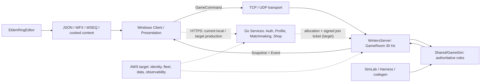
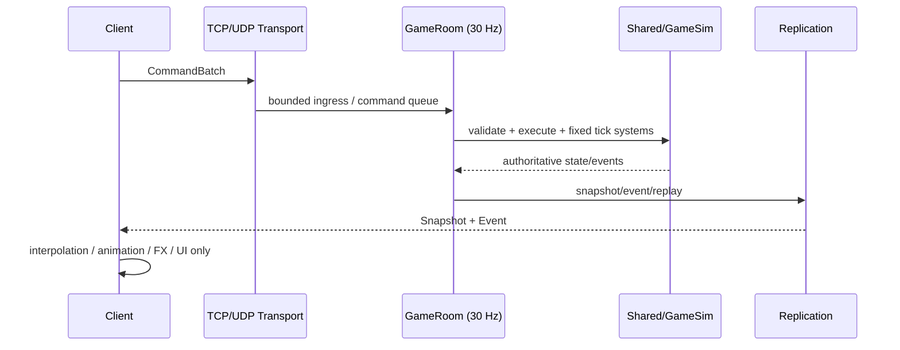
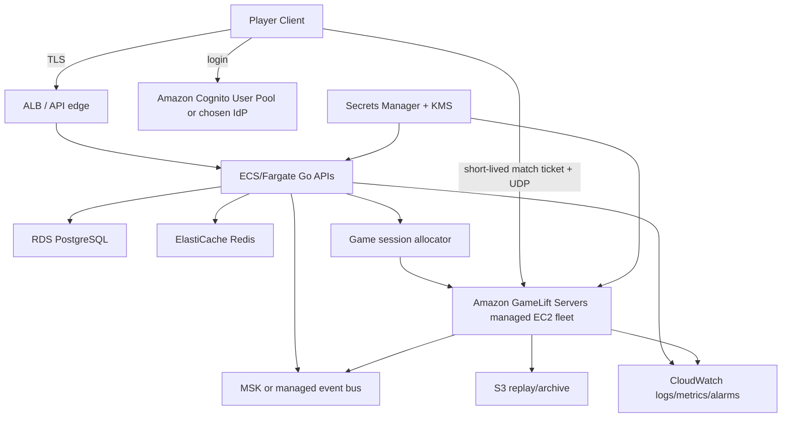

Session - Winters 전체 스택 이해 및 출시 준비 기준선 (2026-07-15)

> 목적: Engine App에서 시작해 한 프레임, 렌더/RHI, 서버 권위 GameSim, Go Backend, EldenRingEditor, AWS 운영 인프라, 팀 협업과 출시 게이트까지를 하나의 사고 모델로 연결한다.
>
> 조사 범위: 2026-07-15 현재 작업 트리의 소스와 기존 검증 도구를 읽기 전용으로 조사했다. C++/Go/데이터/인프라 코드는 수정하지 않았고, 사용자가 클라이언트·서버를 실행 중인 상태이므로 빌드와 런타임 실행도 하지 않았다.
>
> 표기: **[현재]**는 소스에 실제로 있는 것, **[목표]**는 출시를 위해 설계해야 하는 것, **[CONFIRM_NEEDED]**는 제품·비용·플랫폼 결정이 필요한 것이다. 계획 문서나 로드맵의 미래 항목을 현재 구현으로 읽지 않는다.

# 0. 먼저 결론: Winters를 한 문장으로 이해하기

Winters는 **Windows DX11 레거시 렌더러로 실제 게임을 그리는 Engine/Client**, **30 Hz 고정 틱으로 게임 결과를 확정하는 Server + Shared/GameSim**, **로컬 개발용 Go 서비스와 Docker Compose**, 그리고 **월드 문서·FX·시퀀서를 다루기 시작한 CMake 기반 EldenRingEditor**를 이미 갖춘 프로젝트다. 그러나 이것이 곧바로 출시 가능한 제품이라는 뜻은 아니다. 현재 빠진 핵심은 다음 네 개의 연결부다.

1. 인증된 유저가 매칭되어 특정 Dedicated Game Server에 안전하게 입장하는 control plane.
2. DX11 정상 게임 경로를 유지하면서 RHI/DX12/render graph/GPU-driven으로 이관하는 렌더 제품화 경로.
3. AWS IaC, 환경 분리, secrets, 관측성, CI/CD, 롤백을 포함한 운영 기반.
4. 테스트·리플레이·부하·보안·상점/결제의 출시 게이트.

따라서 이 문서의 목표는 “이미 있는 것을 과장하지 않고, 다음 결정을 팀이 같은 언어로 내리게 하는 기준”이다.

# 1. 전체 지도와 소유권



## 1.1 모듈별 책임

| 경계 | 현재 책임 | 절대 소유하면 안 되는 것 |
| --- | --- | --- |
| `Engine/` | 창, 프레임 루프, RHI, 리소스, ECS/JobSystem, UI/사운드 등의 범용 런타임 | LoL/Elden 챔피언 규칙, 서버 권위 결과 |
| `Client/` | 입력, 약한 예측, snapshot 보간, 씬/애니메이션/FX/UI, 로컬 shell | HP·쿨다운·피해·승패의 최종 판정 |
| `Shared/GameSim/` | 서버에서 재사용되는 순수 게임 규칙, ECS 컴포넌트·시스템, 스킬·상태·피해 계약 | Engine/DX/UI/ImGui/클라이언트 렌더 타입 |
| `Server/` | 세션·전송 ingress, GameRoom tick, 명령 검증, GameSim 실행, snapshot/event/replay | Client 시각 표현 또는 상점 UI |
| `Services/` | 계정·프로필·매칭·상점·영수증·라이브 운영의 control plane | 인게임 위치·피해·승패 판정의 진실 원천 |
| `EldenRingEditor/` | 문서 기반 월드/FX/시퀀스 authoring과 검증 | 런타임 서버 권위 판정 |
| `Tools/` | SimLab, Harness, schema/data codegen, 재현/검증 | 런타임의 별도 진실 원천 |

이 의존성 규칙은 프로젝트의 가장 중요한 불변식이다.

```text
Client Input → GameCommand → Server GameSim → Snapshot/Event → Client Visual
```

클라이언트가 보기 좋게 보정해도 서버 판정을 덮어쓰면 안 되고, 서버가 FX를 직접 그리려 해도 안 된다. 서버는 결과와 cue를 만들고, 클라이언트는 한 번만 표현한다.

## 1.2 소스의 진실 원천

- 레거시 Engine/Client/Server/GameSim의 기본 빌드 spine은 `Winters.sln`과 각 `.vcxproj`이다.
- Root `CMakeLists.txt`는 Engine과 `EldenRingClient`, `EldenRingEditor`를 묶는다. `CMakePresets.json`의 현재 build preset은 Engine/Elden 계열을 제공한다.
- `EngineSDK/`, `out/`, profiler/replay 산출물은 생성물이다. 소스와 generator를 고치고 산출물을 직접 진실 원천으로 삼지 않는다.
- FlatBuffers schema는 `Shared/Schemas/`가 원본이며, schema 변경은 codegen과 wire contract 검증을 함께 해야 한다.
- 런타임 리소스의 기준 root는 `Client/Bin/Resource`다. 구성별 임시 `Resource` 복사본을 새 표준으로 만들지 않는다.

# 2. Engine App부터 보는 실제 부팅과 한 프레임

## 2.1 부팅 경로

정상 Client는 `Client/Private/main.cpp:23-111`에서 옵션을 읽고 기본 RHI를 DX11로 선택한 뒤 `WintersRun(&gameApp, config)`을 호출한다. `--rhi=dx11`, `--rhi=dx12`, `--rhi=null`은 실험/선택 진입점이지 모든 backend가 제품 수준이라는 표시는 아니다.

```text
Client/main.cpp
  → WintersRun()                                      Engine/Private/WintersEngine.cpp:33-52
  → CGameInstance::Initialize_Engine()                Engine/Private/GameInstance.cpp:118-154
  → CEngineApp::Initialize()
      → Window
      → requested RHI device (실패 시 DX11 fallback)
      → GameApp / Scene 초기화
  → CEngineApp::Run()
  → Shutdown
```

`CGameInstance` 초기화에는 timer, scene manager, sound, UI, blueprint, job system, FX registry가 들어간다. `CEngineApp`은 DX11일 때에만 ResourceCache, shared shader/pipeline, UI, BlendStateCache의 레거시 bootstrap을 추가로 초기화한다(`Engine/Private/Framework/CEngineApp.cpp:203-258`). 이 조건이 DX12가 아직 full client 제품 경로가 아닌 이유의 하나다.

## 2.2 프레임의 실제 순서

`CEngineApp::Run` (`Engine/Private/Framework/CEngineApp.cpp:278-400`)을 다음 의사 코드로 기억하면 된다.

```cpp
while (running)
{
    Window.PumpMessages();
    Timer.UpdateDelta();
    CGameInstance::Tick_Engine();     // Sound 등 Engine 서비스 tick
    Update(delta);                    // Scene Update → LateUpdate
    Render();                          // BeginFrame → Scene → ImGui/UI → EndFrame/Present
    Input.EndFrame();
    ApplyFrameLimiter();
}
```

실제 `Render` wrapper는 `CEngineApp.cpp:420-550`에 있으며 아래 순서다.

1. `IRHIDevice::BeginFrame(clear)`.
2. DX11 정상 경로에서 ImGui frame 시작.
3. `SceneManager::Render()`.
4. Scene/App ImGui, debug draw, profiler overlay, cursor/UI.
5. `IRHIDevice::EndFrame()`와 Present.

F3는 profiler overlay, F12는 profiler JSON capture를 사용하는 현재 관측 진입점이다(`CEngineApp.cpp:322-393`). DX11에는 `GPU::FrameUs` query도 있다(`Engine/Private/RHI/DX11/CDX11Device.cpp:915-953`).

## 2.3 InGame 프레임은 서버 판정을 다시 계산하지 않는다

`Client/Private/Scene/Scene_InGame.cpp:839-932`의 `OnUpdate`는 수신한 snapshot/event를 Client presentation ECS에 반영하고, 로컬 네비게이션·FOW·입력·보간을 갱신한다. 중요한 순서는 다음과 같다.

```text
network pump / replay
  → ECS·player·nav·FOW 상태 동기화
  → ECS scheduler
  → FOW texture GPU upload
  → snapshot interpolation
  → map surface projection / targeting / input
```

즉 “내 화면에서 공격이 맞아 보인다”는 클라이언트 표현이고, “실제로 피해가 들어간다”는 Server/GameSim 결과다. 온라인 버그를 고칠 때에는 Client visual과 Server authoritative path를 둘 다 확인해야 한다.

### 현재 관측 가능한 한계

- 네트워크 보간 대상은 챔피언·미니언 중심이다(`Client/Private/Scene/Scene_InGameNetwork.cpp:849-943`). 정글·구조물이 동일 보간 table에 들어간다는 근거는 현재 없다.
- tiny-change 판정이 X/Z만 비교하므로 Y만 변하는 airborne 표현은 보간을 건너뛸 수 있다(`Scene_InGameNetwork.cpp:896-903`). 이는 서버 에어본 판정과 별개의 presentation 결함 후보이다.
- Engine JobSystem은 모든 시스템을 자동 병렬화하지 않는다. 접근 선언이 충돌하지 않는 system batch만 job으로 보내며, D3D11 immediate-context draw submission은 render owner에서 직렬로 수행한다.

# 3. 렌더링, RHI, GPU-driven을 정확히 구분하기

## 3.1 오늘 실제로 화면을 그리는 경로

**[현재] 정상 LoL F5 경로는 DX11 legacy direct-context renderer다.** `Client/Private/Scene/Scene_InGameRender.cpp:331-751`가 사실상의 수동 render graph 역할을 한다.

| 순서 | 현재 pass/표현 |
| --- | --- |
| 1 | DX11 normal/depth 및 SSAO (`:363-426`) |
| 2 | Map (`:428-464`) |
| 3 | Champion (`:466-538`) |
| 4 | Structure, Jungle, Minion, Bush, ambient props (`:540-588`) |
| 5 | Contact shadow (`:590-608`) |
| 6 | Viego soul 등 투명 객체의 CPU distance sort (`:610-673`) |
| 7 | FOW overlay (`:675-689`) |
| 8 | Debug, attack range, FX mesh/beam/sprite (`:691-706`) |
| 9 | DX11 PostFX (`:708-714`) |
| 10 | UI/minimap/screen overlay (`:716-750`) |

이 구조는 나쁜 것이 아니라 현재 제품을 실제로 그리는 경로다. 다만 pass 의존성·리소스 수명·barrier·성능 예산이 Scene 코드에 분산되어 있어, RenderGraph가 제공하는 전역 최적화와 자동 검증은 아직 없다.

## 3.2 RHI가 현재 제공하는 것과 제공하지 않는 것

| 항목 | 현재 판정 | 근거 |
| --- | --- | --- |
| Backend abstraction | 존재 | `IRHIDevice`, typed handle, command list 계약 |
| DX11 | 실제 제품 렌더의 기반 | `CDX11Device`, legacy resource/renderer path |
| DX12 | swapchain/fence/primitive smoke 수준 | `Engine/Private/RHI/DX12/DX12Device.cpp` |
| `CRHISceneRenderer` | static mesh subset 비교/lab | `Engine/Private/Renderer/RHISceneRenderer.cpp:398-497` |
| `--rhi-scene-only` | 정상 F5를 대체하지 않는 실험 switch | `Scene_InGameRender.cpp:324-358` |
| RenderGraph DAG | 현재 정상 경로에는 없음 | Scene이 직접 pass 순서를 호출 |
| Compute dispatch | 미구현 | DX11/DX12 `Dispatch`가 no-op |
| Indirect draw | 미구현 | `DrawIndexedIndirect` interface default no-op, backend override 없음 |
| GPU scene / GPU culling | 현재 source 경로 없음 | `GPUScene.h`, `GPUDrivenPipeline.h` 부재 |

`CRHISceneRenderer`는 snapshot item마다 bind/constant buffer를 갱신해 `instanceCount=1`로 draw한다. animation/skeleton, material batch, instance batch, indirect draw를 포함하지 않는다. 따라서 이를 “RHI migration proof”라고 부를 수는 있어도 “RHI로 전환 완료” 또는 “GPU-driven renderer”라고 부르면 안 된다.

## 3.3 GPU-driven의 본질

GPU-driven은 단순히 GPU에서 draw를 호출한다는 말이 아니다. 보통 다음의 ownership 이전을 뜻한다.

```text
Game thread: renderable snapshot 추출
  → GPU: instance data / bounds / material ID 업로드
  → GPU compute: frustum/occlusion/LOD culling
  → GPU: visible instance list + indirect argument buffer 생성
  → RHI: DrawIndexedIndirect / ExecuteIndirect
  → GPU: material/mesh batch 렌더
```

현재 Winters에는 CPU frustum culling(`Engine/Private/Resource/Model.cpp:741-815`)과 CPU material-range merge(`Model.cpp:567-635`)는 있다. 그러나 compute shader, UAV/structured/indirect argument resource, dispatch, indirect execution, GPU scene, visible-instance counter가 없다. 즉 **CPU culling은 구현되어 있지만 GPU-driven은 구현되지 않았다.**

## 3.4 올바른 렌더 이관 순서

GPU-driven을 먼저 붙이는 것은 위험하다. 아래 순서가 제품을 망가뜨리지 않는 순서다.

1. **DX11 정상 장면 parity를 기준선으로 고정한다.** map/champion/minion/structure/FX/UI를 숨겨 성능 수치를 만들지 않는다.
2. **공용 `RenderWorldSnapshot` 추출을 완성한다.** 현재 static subset에서 시작하되 animation·FOW·FX·UI의 소유자와 제외 사유를 명시한다.
3. **RHI resource 계약을 완성한다.** render target, SRV/UAV/DSV, structured/raw/indirect buffer, compute shader, state/barrier, upload lifetime이 필요하다.
4. **DX11과 DX12 모두에서 `Dispatch`와 indirect draw를 실제 구현한다.** command API의 no-op은 기능 미구현을 숨기므로 validation에서 실패하게 해야 한다.
5. **RenderGraph를 도입한다.** 기존 pass를 한 번에 재작성하지 말고 depth/normal → opaque → transparent → post → UI 순으로 이관한다.
6. **CPU culling baseline을 계측한 뒤 GPU culling을 넣는다.** visible instance 수, indirect draw 수, CPU/GPU frame time, VRAM, correctness capture를 게이트로 둔다.
7. **DX12 full client parity를 독립 release gate로 둔다.** 지금은 DX12를 supported shipping backend로 표기하지 않는다.

관련 이미 존재하는 validation 진입점은 `Tools/Harness/Run-S17RhiValidation.ps1`와 profiler capture다. 결과 파일만 보지 말고 정상 DX11 장면과 같은 입력·같은 capture 조건을 보존한다.

# 4. Server-authoritative simulation: 실제 게임의 진실 원천

## 4.1 권위 흐름



**[현재]** `Shared/GameSim/Core/Determinism/DeterministicTime.h:7-19`은 30 Hz 고정 시간 계약을 갖고, `Server/Private/Game/GameRoomTick.cpp:78-155`가 약 33,333 µs 주기로 room tick을 실행한다.

한 tick의 순서는 소스가 말하는 진실이다.

```text
Drain ingress → room lock
  → status effect / forced motion tick
  → command drain
  → server bot AI
  → command execute
  → simulation systems
  → lag history / game end
  → event + snapshot + replay
```

`GameRoomTick.cpp:255-299`의 simulation systems에는 buff, stat, cooldown, recall, gold, movement, jungle AI, attack chase, minion, structure, projectile, damage queue, death/respawn이 들어간다. 인게임 결과는 이 시퀀스에서만 확정되어야 한다.

## 4.2 명령, snapshot, event, replay의 역할

- **Command**: Client가 의도를 보낸다. ingress는 Move를 coalesce하고 `acceptedTick`, `sessionId`, `sequenceNum`으로 안정 정렬한다(`Server/Private/Game/CommandIngress.cpp:17-119`, `GameRoomCommands.cpp:1281-1308`).
- **Simulation**: Server가 targetable, cooldown, range, 상태 이상, 피해, 이동, 투사체, 사망을 판정한다.
- **Event**: “무엇이 발생했다”는 단발 cue다. FX/사운드/월드 텍스트는 event/cue를 소비한다.
- **Snapshot**: “현재 권위 상태는 무엇인가”라는 정기 state다. Client는 이를 보간해 표시한다.
- **Replay**: command/snapshot/event를 로컬 `.wrpl`로 기록한다(`Server/Private/Game/ReplayRecorder.cpp:24-36,183-311`). 현재 object storage와 match metadata 연결은 없다.

이 분리는 상태 이상에도 동일하게 적용된다. 예를 들어 stun/airborne은 server `StatusEffectComponent`와 forced-motion에 들어가고, server query가 move/attack/cast를 거절한다. snapshot은 aggregate 상태와 이동 정보를 복제하며, client는 이를 보고 표현한다. Client가 먼저 “기절을 확정”하면 치트와 desync 경로가 된다.

## 4.3 네트워크 경계: 좋은 부분과 출시 blocker

**좋은 현재 구조:** UDP는 `ServerSessionHub`의 bounded ingress에 transport event를 넣고, room tick owner가 `DrainIngress` 중 join/frame/leave를 적용한다(`Server/Private/Network/ServerSessionHub.cpp:233-347,704-838`). 이는 IO thread가 게임 월드를 직접 바꾸지 않는 올바른 방향이다.

**출시 blocker:** TCP accept/disconnect는 IOCP worker에서 `g_pRoom->OnSessionJoin()`과 `OnSessionLeave()`를 직접 호출한다(`Server/Private/Network/IOCPCore.cpp:254-264`, `Session_Manager.cpp:47-68`). TCP receive/lobby도 worker 경로에서 room/lobby authority를 바꾼다.

뮤텍스가 있으므로 즉시 race라고 단정할 수는 없다. 하지만 room state의 소유자가 tick thread와 IOCP worker 두 곳이 되며, TCP/UDP의 ordering, replay 재현성, disconnect 시점이 달라진다. **[목표] TCP도 `IOCP callback → bounded ingress event → GameRoom::Tick()의 DrainIngress()`로 통일한다.** IOCP는 socket/frame transport까지만 소유한다.

## 4.4 보안·접속 계약의 현재 상태

- Packet envelope와 FlatBuffers Command/Snapshot/Event/Lobby/Hello schema는 존재한다(`Shared/Network/PacketEnvelope.h`, `Shared/Schemas/`).
- UDP는 fragmentation/ACK/reassembly 구조를 가진다.
- 그러나 실제 연결 validator는 debug empty-ticket 허용 경로이고(`Server/Private/main.cpp:219-238,650-656`), 서버 본인도 post-handshake MAC/AEAD/pacing이 미완료라고 출력한다(`:722-731`). envelope의 encrypted/compressed flag만으로 encryption이 구현된 것은 아니다.
- 현재 server process는 `CGameRoom::Create(1)` 한 개를 생성한다(`Server/Private/main.cpp:634-646`). multi-room allocator/fleet model은 아직 없다.

**[목표 접속 계약]**

```text
Auth → Matchmaking → Allocator
  → matchId/accountId/team/seat/expiry/nonce를 담은 서명된 short-lived join ticket
  → Client UDP handshake가 ticket 제출
  → Game Server가 issuer/key/expiry/single-use/room assignment를 검증
  → 성공 후에만 logical session과 lobby seat 생성
```

일반 API JWT를 game server에 그대로 전달하기보다, 한 번 쓰고 빨리 만료되는 match-scoped ticket을 만든다.

## 4.5 확장 전 이해해야 할 제약

- Snapshot은 매 tick 세션별 전체 transform 집합을 만들고 보낸다(`GameRoomReplication.cpp:127-190`, `SnapshotBuilder.cpp:65-102`). 현재 interest management, AOI, delta baseline, compression이 확인되지 않는다.
- lag compensation은 최근 200 ms/최대 6 tick history와 투사체 swept collision 보정이다. Client input의 RTT rewind hit validation은 현재 `0`이다. 이를 완전한 rewind 판정이라고 부르지 않는다.
- `Tools/SimLab`, `Tools/Harness/Run-ServerProjectileAuthorityContractProbe.ps1`, `Run-UdpF5SessionSmoke.ps1`, replay contract probe 등은 좋은 출발점이다. deterministic이라는 주장은 seed/replay byte/state equivalence test가 통과할 때에만 한다.

# 5. Go Backend: 현재 local control plane과 제품 control plane의 차이

## 5.1 현재 실제 구성

`Services/`는 Go 기반 auth, leaderboard, matchmaking, profile, payment, shop을 가진다. Go module은 PostgreSQL/Redis/Kafka/JWT를 사용하며, `Services/docker-compose.yml`는 Postgres, Redis, Kafka를 로컬 개발용으로 띄운다.

| 영역 | 현재 구현 | 출시 판단 |
| --- | --- | --- |
| Auth | bcrypt + HS256 access/refresh JWT | 기본 secret fallback, issuer/audience/key rotation 부재로 production 불가 |
| Profile | account/profile와 결과 반영 endpoint | client self-report로 win/loss/MMR/RP를 변경할 수 있어 production 불가 |
| Matchmaking | Redis ZSET 2인 queue, 1초 matcher, Kafka event | game endpoint/room/seat/ticket allocation 없음 |
| Shop/Payment | DB·Kafka·mock payment gateway | real gateway, outbox/idempotency/security boundary 필요 |
| Client integration | loopback URL과 HTTP shell | local bootstrap용이며 authenticated join과 연결되지 않음 |

정확한 현재 위험은 소스에 드러나 있다.

- `Services/pkg/config/config.go:56-107`: localhost, dev password, JWT fallback secret, `sslmode=disable` 경로.
- `Services/pkg/database/postgres.go:13-40`: TLS 없는 DB connection string.
- `Client/Private/ClientShell/ClientShellBackendService.cpp:7-35`: `127.0.0.1:8083/8084/8086` 하드코딩.
- `Client/Private/Network/Backend/CHttpClient.cpp:30-66,203-220`: HTTPS scheme을 실질적 transport security로 반영하지 않는 현재 HTTP 경로.
- `Services/internal/profile/handler.go:70-122`: client self-report가 dev-stage 임시임을 명시하며 result/MMR/RP를 갱신.
- `Services/internal/payment/gateway_mock.go:8-17`: always-success mock gateway.
- `Client/Private/Network/Backend/MatchClient.cpp:35-39` vs `Services/internal/matchmaking/handler.go:19-24`: leave HTTP method가 POST/DELETE로 불일치.

이것들은 결함을 숨기는 것이 아니라 **로컬 vertical slice가 아직 출시 control plane이 아님을 보여 주는 증거**다.

## 5.2 제품 control plane의 최소 계약

```text
Identity/Auth
  → Profile/Entitlement
  → Matchmaking (durable queue + match record)
  → Allocator (server fleet / room 선택)
  → signed match join ticket
  → Dedicated Game Server
  → authoritative MatchCompleted event
  → outbox / idempotent consumers
  → profile, leaderboard, replay index, analytics
```

핵심 원칙은 `Game Server가 결과를 발행하고 Services가 영속화한다`이다. Client가 `/result: win`을 보내는 구조는 dev-only로 격리하거나 제거해야 한다.

출시용 result contract에는 최소한 `matchId`, `participantId`, `server build/content version`, `result digest`, `emittedAt`, idempotency key가 있어야 한다. DB는 match/participant uniqueness를 강제하고 consumer는 at-least-once delivery를 견딜 수 있어야 한다. Kafka publish가 DB transaction 뒤에 단순 로그만 남는 현재 흐름은 transactional outbox 또는 동등한 durable retry 설계로 바꾼다.

# 6. EldenRingEditor: 실제 범위와 성장 방향

## 6.1 현재 에디터는 무엇인가

`EldenRingEditor/CMakeLists.txt`는 Windows executable `WintersEldenRingEditor`를 만들고 `Winters::Engine`에 링크한다. `EldenRingEditor/Private/main.cpp`는 기본 DX12와 `--rhi=dx12/dx11/null`을 지원해 `WintersRun`으로 들어간다.

`EldenRingEditorScene`은 현재 다음의 **문서/검증 기반 authoring slice**를 가지고 있다.

- `CWorldCellDocument`: world-cell JSON load/save.
- `CEditorTransaction`: command stack과 undo/redo.
- placement/outliner/details transform UI.
- `.wfx.json` FX graph validation/compile.
- `.wseq.json` sequencer validation.
- world partition source probe와 boss hitbox geometry probe.
- ImGui dock space (`EldenRingEditorScene.cpp:490-493`).

이것은 실제로 존재하는 시작점이다. 반대로 `OnUpdate`/`OnRender`은 비어 있고(`:142-145`), viewport는 “Preview pending”이며(`:516`), model preview/ray-pick/gizmo와 asset catalog scan/drag-drop은 아직 deferred다. 따라서 현재 에디터를 full Unreal급 authoring tool이라고 표현하면 안 된다.

## 6.2 에디터 제품화의 순서

1. **문서 계약을 잠근다.** `.wcell`, `.wfx`, `.wseq`의 schema/version/validation error를 명시한다.
2. **preview를 runtime과 같은 renderer contract에 올린다.** Editor 전용 fake renderer를 만들지 않고, cooked asset/scene preview가 Client와 같은 RHI/content path를 소비하게 한다.
3. **transaction과 asset database를 연결한다.** 변경→undo/redo→save→validate→cook의 chain을 단일 명령으로 추적 가능하게 한다.
4. **world partition과 streaming validation을 자동화한다.** cell boundary, reference, nav, collision, size budget을 CI에서 검사한다.
5. **publish gate를 만든다.** validation이 통과한 immutable content manifest만 build/release가 참조하게 한다.

Elden 계열 CMake target은 legacy `Winters.sln` 흐름과 별도이므로 CI에서 둘을 의도적으로 분리하거나 통합 matrix로 명시해야 한다. 어느 쪽도 “F5에서 한 번 켜짐”만으로 content tool release-ready가 되지는 않는다.

# 7. AWS Backend Infra: 현재 사실과 목표 설계를 분리한다

## 7.1 현재 사실

정적 파일 조사에서 `Services/docker-compose.yml` 외에 Dockerfile, Terraform, CDK, Pulumi, CloudFormation, Kubernetes/Helm, GitHub Actions, Jenkins, GitLab CI 구성은 찾지 못했다. 따라서 **AWS 인프라는 아직 구현되어 있지 않다.** 로컬 Docker Compose와 cloud production environment를 같은 것으로 취급하지 않는다.

## 7.2 권장 목표 토폴로지

아래는 **[목표]**다. AWS 계정·권한·비용을 실제로 바꾸는 작업은 이 문서 범위에 포함하지 않는다.



### 권장 구성과 이유

| 필요 | 초기 권장 | 이유 / 주의점 |
| --- | --- | --- |
| Identity | Cognito User Pool 또는 기존 Auth를 OIDC-compatible IdP로 교체 | User Pool은 auth/authorization과 JWT 발급에 적합하다. game server에는 API JWT 대신 match ticket을 전달한다. |
| Stateless Go API | ECR + ECS Fargate + ALB | auth/profile/matchmaking/shop은 HTTP stateless에 가깝다. 서비스 discovery, config, health check를 loopback 상수에서 분리한다. |
| Dedicated game server | Amazon GameLift Servers managed EC2 fleet 우선 | C++ Windows dedicated server의 session/fleet lifecycle에 맞는 첫 선택이다. container 전환은 Linux/container packaging과 운영 경험이 생긴 뒤에 결정한다. |
| SQL | RDS PostgreSQL Multi-AZ부터 검토 | 현 Postgres schema/migration을 가장 적게 바꾸는 경로다. Aurora는 scale/cost 요구가 확정된 뒤 선택한다. |
| Cache | ElastiCache Redis | 현재 Redis match queue/cache의 운영형 대응이다. Redis가 authoritative match result DB가 되면 안 된다. |
| Event | **[CONFIRM_NEEDED]** MSK 또는 더 단순한 managed queue/event bus | 현재 서비스가 Kafka API를 쓰므로 MSK가 migration은 쉽다. 초기 규모에 비해 과하면 event contract를 단순화한다. |
| Artifact/replay | S3 (+ CloudFront는 public content가 필요할 때) | replay/archive, manifest, immutable build artifact 보존. 추출/권리 미확인 source asset은 절대 배포하지 않는다. |
| Secret | Secrets Manager + KMS | fallback secret/compose password를 production artifact에서 제거하고 rotation/audit를 만든다. |
| Observability | CloudWatch logs/metrics/alarms, 이후 OpenTelemetry | room tick, packet loss, join failure, API error, queue time, DB latency, business event를 같은 correlation ID로 본다. |
| IaC | CDK **또는** Terraform 중 하나를 팀 표준으로 선택 | 두 IaC를 섞지 않는다. dev/staging/prod를 같은 module과 reviewable change로 관리한다. |

AWS 제품 근거는 다음 공식 문서를 기준으로 확인한다: [Cognito User Pools](https://docs.aws.amazon.com/cognito/latest/developerguide/cognito-user-pools.html), [Cognito authentication](https://docs.aws.amazon.com/cognito/latest/developerguide/cognito-how-to-authenticate.html), [Amazon GameLift Servers fleet](https://docs.aws.amazon.com/gameliftservers/latest/developerguide/fleets-creating.html), [AWS Well-Architected Framework](https://docs.aws.amazon.com/wellarchitected/latest/framework/welcome.html).

## 7.3 AWS를 만들기 전에 고정할 결정

아래는 코드로 답할 수 없는 제품 결정을 숨기지 않고 명시한다.

1. **[CONFIRM_NEEDED] 출시 플랫폼/스토어:** Windows only인지, Steam/Epic인지, console을 목표로 하는지.
2. **[CONFIRM_NEEDED] region/SLO:** 한국 우선인지, RTT 목표, 동시 접속/방 수, maintenance window.
3. **[CONFIRM_NEEDED] authoritative server packaging:** Windows VM/managed EC2 우선인지, Linux container migration을 투자할지.
4. **[CONFIRM_NEEDED] 결제/법무:** 실제 payment provider, 환불·세금·개인정보·연령/국가 정책.
5. **[CONFIRM_NEEDED] deployment policy:** canary/blue-green 범위, DB migration rollback 원칙, version compatibility window.

결정 후 가장 먼저 repository에 들어가야 할 것은 AWS 콘솔의 수동 클릭 기록이 아니라 `infra/`의 versioned IaC, environment manifest, CI validation, secret reference contract다.

# 8. 출시 가능 상태의 정의와 우선순위

## 8.1 지금 “출시 가능”이라고 말할 수 없는 이유

| 축 | 현재 근거 | 출시 exit condition |
| --- | --- | --- |
| Build | solution/CMake와 수동 harness 존재 | clean agent에서 pinned toolchain으로 reproducible Debug/Release artifact, schema/codegen drift check |
| Rendering | DX11 normal path 존재, RHI migration 중 | DX11 capture/regression, device-loss/error behavior, performance budget; DX12는 별도 parity 통과 전 optional/lab |
| GameSim | 30 Hz server authority와 replay/harness 존재 | deterministic/replay regression, command fuzz, soak, authoritative result signing |
| Transport/security | UDP/TCP scaffold 존재 | all ingress room-owned, signed single-use ticket, TLS/API auth, UDP MAC/AEAD/pacing/replay protection, rate limit |
| Backend | local Go + Compose 존재 | no dev fallback/secrets, TLS, migrations, allocation, outbox/idempotency, server-issued results |
| Commerce | mock route 존재 | real provider, idempotency/scoping, audit/reconciliation/refund path |
| AWS/operations | cloud IaC/CI 없음 | IaC-reviewed dev/staging/prod, dashboards/alerts/runbooks, backup/restore, rollback drill |
| Content/editor | document authoring slice 존재 | schema validation/cook/manifest, content compatibility, editor smoke and publish gate |

이 표의 모든 exit condition이 통과되기 전에는 “internal vertical slice” 또는 “staging candidate”라고 표현한다. 그 정직함이 릴리스 사고를 줄인다.

## 8.2 P0~P4 출시 작업 순서

### P0 — 권위와 보안 경계 (먼저)

1. TCP를 UDP와 동일한 room-owned ingress로 통일한다.
2. Debug empty ticket을 release artifact에서 제거하고 signed, expiring, single-use match ticket을 만든다.
3. Client self-reported result 및 mock payment를 production route에서 제거/격리한다.
4. production config는 required secret이 없으면 fail-fast하고, TLS/issuer/audience/key rotation을 적용한다.
5. Client service URL은 signed bootstrap/config 또는 environment-aware discovery로 바꾼다.

### P1 — control plane 수직 슬라이스

```text
로그인 → 매칭 → allocator → dedicated server reservation
→ signed ticket → UDP join → game → server MatchCompleted
→ outbox → profile/leaderboard/replay index
```

이 흐름이 staging에서 한 번이라도 끝까지 자동 검증되기 전에는 상점, 랭크, live ops 확장을 우선하지 않는다.

### P2 — 운영과 관측

- tick duration, command queue depth, snapshot bytes, RTT/loss, room occupancy, allocation failure, queue time, API p95, DB/Redis/Kafka error, business result counter를 지표화한다.
- build ID, content manifest ID, match ID, account ID의 correlation을 logs/traces/events에 넣는다.
- load/soak, disconnect/reconnect, duplicate event, packet fuzz, outage/restore, migration rollback drill을 runbook과 함께 자동화한다.

### P3 — 렌더 제품화

DX11 release path의 performance/capture gate를 먼저 만든 뒤 RHI parity, RenderGraph, DX12, GPU-driven을 단계적으로 진행한다. GPU-driven은 CPU culling baseline보다 실제로 이득이 있고 visual parity가 증명될 때만 켠다.

### P4 — 콘텐츠/에디터/협업 확장

Editor에서 asset을 author → validate → cook → manifest publish 하는 chain을 만든다. 팀은 외부 source asset의 권리·배포 허용 범위를 명시하고, build가 승인된 cooked output만 소비하게 한다.

# 9. 팀 프로젝트에 녹이는 협업 운영 모델

## 9.1 PR 한 개의 소유권 질문

PR을 열기 전 다음에 답할 수 있어야 한다.

1. 이 변경의 **진실 원천**은 Engine, Shared/GameSim, Server, Client, Services, Data/Tool 중 어디인가?
2. 결과를 확정하는 owner는 누구인가? Client가 아니라 Server여야 하는가?
3. packet/schema/data pack/editor document/version은 함께 바뀌는가?
4. 어떤 harness, replay, smoke, capture가 이 변경을 증명하는가?
5. 어떤 feature flag 또는 rollback으로 안전하게 되돌릴 수 있는가?

모듈 경계를 지키는 작은 변경이 “편의상 Client에서 먼저 판정”하는 빠른 변경보다 장기적으로 훨씬 빠르다.

## 9.2 역할별 review matrix

| 변경 종류 | 반드시 보는 사람/게이트 |
| --- | --- |
| `Shared/GameSim`·skill·status·damage | gameplay owner + server owner + deterministic/SimLab/replay evidence |
| packet/schema/snapshot | server + client + codegen/wire contract gate |
| Engine/RHI/render | engine owner + visual capture + DX11 baseline + profiler budget |
| Backend/API/database | backend owner + migration + auth/contract/integration test |
| Editor/content | tools/content owner + schema validation + cook/manifest check |
| AWS/IaC/security | infra owner + least privilege + environment plan + rollback/runbook review |

`AGENTS.md`, `.claude/gotchas.md`, `.md/architecture/WINTERS_CODEBASE_COMPASS.md`, `CLAUDE_Legacy.md`를 진입 전 읽는 규칙을 유지한다. 세부 사실은 code/build file가 답하고, 문서는 원칙·결정·안내를 보관한다.

## 9.3 CI의 최소 matrix

```text
PR
  1. format/static checks
  2. FlatBuffers/data codegen drift check
  3. Winters.sln Debug x64 build
  4. Engine/Elden CMake target build (Editor target은 명시적으로 포함)
  5. Shared boundary + SimLab deterministic/replay tests
  6. TCP/UDP contract and server authority smoke
  7. Go unit/integration/API contract tests
  8. asset/editor validation
  9. artifact manifest + SBOM/vulnerability scan

staging deploy
  10. migration plan + smoke match
  11. allocated game-server join/result path
  12. load/soak + dashboard/alert verification
```

현재 `Tools/Harness`의 `Run-BotAiValidation.ps1`, `RunGameRoomBotMatchSoak.ps1`, `RunUdpF5SessionSmoke.ps1`, `RunReplayCommandContractProbe.ps1`, `RunProjectileReplicationWireContractProbe.ps1`, `Run-S17RhiValidation.ps1` 등은 이 matrix의 출발점이다. 아직 없는 CI 정의와 cloud deploy job은 새로 설계해야 한다.

# 10. 12주 권장 학습·구현 로드맵

이 범위는 한 번에 “완벽하게” 끝낼 수 없다. 조사만 계속하지 않도록 각 milestone에서 설계/조사는 시간의 30% 이내로 제한하고, 반드시 실행 가능한 산출물(테스트, capture, IaC plan, runbook)으로 환전한다. 아래 날짜는 외부 마감이 없는 현재 상황에서 제안하는 2주 단위 목표다.

| 기간 | 학습 초점 | 반드시 남길 산출물 |
| --- | --- | --- |
| 1–2주 | Client `main` → `CEngineApp::Run` → `Scene_InGame`을 debugger/profiler로 한 프레임 추적 | annotated frame trace, DX11 capture baseline, component ownership map |
| 3–4주 | Command → GameRoom tick → GameSim → Snapshot/Event → Client apply를 한 스킬/투사체로 끝까지 추적 | replay/SimLab case와 packet timeline |
| 5–6주 | TCP/UDP ingress 통일, match ticket contract, server-issued result 설계 | protocol ADR, contract tests, staging vertical-slice design |
| 7–8주 | Go services config/migration/outbox/allocator contract, IaC bootstrap | reviewed `infra/` plan, dev/staging environment, secret/config contract |
| 9–10주 | DX11 performance gate, RHI parity backlog, editor cook/manifest workflow | capture/perf dashboard, renderer ADR, editor publish validation |
| 11–12주 | fleet allocation, soak/load/incident/rollback rehearsal | staging release candidate, runbooks, go/no-go scorecard |

각 2주 block의 마지막 날에는 “다음 조사”가 아니라 `demo + evidence + decision`을 해야 한다. 3회 연속으로 한 트랙의 바닥 작업만 했다면, 우선순위/예산을 다시 평가하고 실제 출시 수직 슬라이스를 막는 항목으로 돌아간다.

# 11. 스스로 코드베이스를 완전히 이해하는 읽기 순서

1. **앱 한 프레임:** `Client/Private/main.cpp` → `Engine/Private/WintersEngine.cpp` → `CEngineApp.cpp` → `GameInstance.cpp` → `Scene_InGame.cpp`/`Scene_InGameRender.cpp`.
2. **게임 한 명령:** `Shared/Schemas/Command.fbs` → transport ingress → `GameRoomTick.cpp`/`GameRoomCommands.cpp` → 한 champion GameSim → `Snapshot.fbs`/`Event.fbs` → Client snapshot/event applier.
3. **한 renderable:** content loader → Model/Mesh → DX11 normal render path → profiler/capture. 이때 `--rhi-scene-only`는 비교 lab이지 기본 경로가 아님을 기억한다.
4. **한 backend 요청:** `ClientShellBackendService` → `CHttpClient` → Go handler/service/repository → Compose Postgres/Redis/Kafka. 이어서 “어떻게 allocator와 game server ticket으로 연결할지”를 설계한다.
5. **한 editor 문서:** `EldenRingEditorScene` → `WorldCellDocument`/`EditorTransaction` → validate/cook/manifest의 목표 chain.
6. **한 출시:** clean build → content manifest → IaC plan → staging deploy → match → result/replay → metrics/alert → rollback drill.

이 순서로 debugger, logs, profiler, replay를 함께 보면 “파일을 많이 읽는 것”이 아니라 각 시스템이 **언제 누구의 데이터를 소유하는지** 이해하게 된다.

# 12. 검증과 인수인계 체크리스트

코드를 바꾸기 전과 후에는 작업 범위에 맞춰 다음을 선택해 실행한다. 현재 사용자가 client/server를 실행 중인 경우에는 먼저 실행 권한과 중단 가능 시점을 확인한다.

```powershell
# Legacy solution
msbuild Winters.sln /m /p:Configuration=Debug /p:Platform=x64

# CMake Engine/Elden path
cmake --preset msvc-ninja
cmake --build --preset engine-debug
cmake --build out/build/msvc-ninja --config Debug --target WintersEldenRingEditor

# Shared/GameSim smoke examples (실제 script 옵션 확인 후 실행)
Tools\Bin\SimLab.exe <tickCount> <seed>
Tools\Harness\Run-UdpF5SessionSmoke.ps1
Tools\Harness\Run-GameRoomBotMatchSoak.ps1
Tools\Harness\Run-ReplayCommandContractProbe.ps1
Tools\Harness\Run-S17RhiValidation.ps1
```

인수인계에는 최소한 다음을 남긴다.

- commit/build ID, content manifest ID, schema version.
- 어떤 정상 DX11 capture/SimLab seed/replay/harness가 통과했는지.
- deployment environment, DB migration, rollback point.
- dashboard URL, alert owner, on-call escalation, known risk.
- 현재 구현과 다음 목표를 혼동하지 않도록 “지원됨 / lab / planned” 상태표.

# 13. 이 문서가 가리키는 기존 기준 문서

- `.md/architecture/WINTERS_CODEBASE_COMPASS.md` — 모듈 경계와 active architecture.
- `.md/architecture/WINTERS_HANDOFF_GUIDE.md` — build/run/handoff의 실무 진입점.
- `.md/architecture/WINTERS_UNREAL_STYLE_MULTI_BACKEND_RHI_ARCHITECTURE.md` — RHI 현황과 multi-backend 목표.
- `.md/architecture/WINTERS_ENGINE_INTEGRATION_REVIEW.md` — Engine/GameSim/Backend/Build의 기존 심층 review.
- `.md/architecture/WINTERS_ROOT_TRUTH_BASELINE.md` — source/derived ownership.
- `.md/plan/backend/00_BACKEND_PLAN_INDEX.md` — backend 계획 묶음.
- `.md/plan/EldenRingEditor/` — editor 기능별 계획.

## 최종 판정

Winters는 “엔진을 처음부터 다시 만들어야 하는 상태”가 아니다. Server-authoritative GameSim, 실제 DX11 게임 렌더, RHI 기반, SimLab/Harness/replay, local Go services, editor authoring slice라는 좋은 토대가 있다. 그러나 출시가 가능한 상태도 아니다. 다음 성공의 기준은 기능 목록이 아니라 다음 한 문장이다.

> 로그인한 사용자가 검증 가능한 매치 ticket으로 배정된 server에 입장하고, 서버가 확정한 결과가 안전하게 영속화되며, 동일 build/content를 재현·관측·롤백할 수 있다.

그 수직 슬라이스를 staging에서 증명한 뒤에만 fleet 확장, DX12, GPU-driven, 상점, 대규모 editor 기능을 안전하게 넓힌다.
