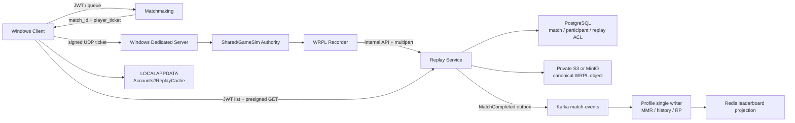

Session - AWS Backend / Account Replay Library 구현·검증 결과 보고서 (2026-07-16~17)

> 결론: Winters의 계정, 매치 생명주기, Windows 권위 서버, replay 생성, Go Replay API, PostgreSQL 참여자 ACL, MinIO/S3 객체, Client 계정별 다운로드 캐시를 하나의 흐름으로 연결했다. 로컬 구현·통합·부하·대용량 파일·Docker·Terraform·GitHub CI 검증을 완료했다. 실제 AWS 계정 생성, `terraform apply`, ECR push, ECS/RDS 배포는 비용과 권한이 필요한 별도 단계로 보류한다.

# 1. 최종 범위와 상태

| 범위 | 상태 | 근거 |
| --- | --- | --- |
| 계정별 local profile/replay 분리 | 완료 | `%LOCALAPPDATA%\Winters\Accounts\<user_id>` |
| Matchmaking → signed ticket → Windows Server | 완료 | 실제 API ticket으로 Release UDP handshake PASS |
| Server replay → Replay API → MinIO | 완료 | WRPL v2 multipart upload, SHA-256 일치 |
| 참여자별 replay library/ACL | 완료 | 참여자 2명 조회, outsider 목록 0건·직접 접근 403 |
| C++ Client replay 다운로드/캐시 | 완료 | ReplayClientSmoke Release PASS |
| MatchCompleted → Profile/Leaderboard | 완료 | MMR 1025/975, 전적·KDA·Redis rank 일치 |
| Docker image/Compose | 완료 | application image 8개 build PASS |
| Terraform/CI 정의 | 완료 | fmt/init/validate, YAML, actionlint PASS |
| HTTP 부하 검증 | 완료 | 합계 1,000 RPS 60초, 59,996건, error/drop 0 |
| 실제 AWS 계정 배포 | 보류 | 계정·권한·비용 승인 후 수행 |

# 2. 최종 구조



권위 흐름은 `Client Input → GameCommand → Server GameSim → Snapshot/Event → Client Visual`을 유지한다. Client가 match 결과나 replay 권한을 self-report하는 경로는 제거했다.

# 3. Replay 저장 경로와 계정 분리

## 3.1 로컬 경로

```text
%LOCALAPPDATA%\Winters\Accounts\<user_id>\MatchHistory.jsonl
%LOCALAPPDATA%\Winters\Accounts\<user_id>\ReplayCache\<match_id>_<replay_id>.wrpl
Replay\*.wrpl  # 명시적인 로컬 개발·디버그 replay
```

- 계정 전환 시 다른 계정의 history/cache가 MyInfo에 노출되지 않는다.
- 다운로드는 `.part` 임시 파일로 받은 뒤 size, SHA-256, WRPL header를 검증하고 atomic rename한다.
- Local Debug replay와 Cloud/Account Cache replay를 UI에서 구분한다.

## 3.2 서비스와 S3 경로

```text
object key: replays/<match_id>/<replay_id>.wrpl
DB: matches → match_participants → replays → replay_user_library
```

한 match의 canonical object는 하나다. 사용자마다 대용량 파일을 복제하지 않고 참여자별 `replay_user_library` 행만 둔다. 숨기기는 사용자의 `hidden_at`만 바꾸며 다른 참여자의 library와 원본 object를 삭제하지 않는다.

Client에는 S3 장기 자격 증명을 제공하지 않는다. Replay API가 JWT와 참여자 ACL을 확인한 뒤 짧은 TTL의 presigned GET을 발급한다. 따라서 ECS/ALB가 1~3GB 파일을 byte proxy하지 않는다.

# 4. 구현 증거

## 4.1 Go Backend

- `Services/pkg/matchticket`: HMAC-SHA256 ticket 발급·검증·만료·변조 테스트.
- `Services/internal/matchmaking`: match/participant/outbox transaction과 player별 ticket.
- `Services/internal/replay`: multipart reserve/presign/complete/abort, list/get/download/hide, match completion.
- migration 000009/000010: match, participant, replay, library, outbox, idempotency 제약.
- `Services/internal/profile`: MatchCompleted idempotent transaction, history/MMR/RP 반영, Redis leaderboard projection.
- `Services/cmd/migrate`: embedded migration, PostgreSQL advisory lock, transaction, ledger.

## 4.2 Windows Server와 Client

- Server UDP handshake가 `user_id`, `match_id`, `game_session_id`, 만료, HMAC을 검증한다.
- Server replay upload queue는 bounded buffer, SHA-256, multipart, 재시도 가능한 sidecar를 사용한다.
- Client ReplayClient는 JWT library 조회, presigned streaming download, checksum/header 검증, 계정별 cache publish를 수행한다.
- ReplayPlayer는 전체 payload를 RAM에 적재하지 않고 record header와 file offset index, 단일 scratch buffer만 유지한다.

## 4.3 Docker와 AWS 기반

- Go multi-stage/distroless non-root Dockerfile.
- PostgreSQL, Redis, Kafka, MinIO, migration job, 7개 Go service Compose.
- `kafka-init`이 `match-events`, `payment-events`, `player-events`를 application 시작 전에 생성한다.
- 개발 MinIO의 내부 endpoint와 Windows Client용 public presign endpoint를 분리한다.
- Terraform: 2-AZ VPC, private ECS/RDS/Redis/MSK, ALB, ECR, S3, IAM task role, Secrets Manager, CloudWatch, Budget.
- 실제 AWS에서는 static S3 key/custom endpoint를 금지하고 ECS task role credential chain을 사용한다.

# 5. 전체 코드 리뷰에서 발견하고 수정한 항목

| 항목 | 원인 | 수정 |
| --- | --- | --- |
| MatchCompleted outbox 미발행 | publisher가 MatchCreated만 허용 | 저장된 event type 전체 발행 |
| Kafka publish 오류 | Writer topic과 Message topic 동시 지정 | Writer topic만 사용 |
| Profile consumer 기동 경쟁 | topic 생성 전에 consumer 시작 | `kafka-init` 완료를 app dependency로 지정 |
| MMR ±25 중복 반영 가능성 | Profile과 Leaderboard가 DB를 동시에 갱신 | Profile을 단일 DB writer로 지정 |
| Redis projection 복구 누락 | DB commit 후 Redis 실패 시 duplicate 즉시 종료 | duplicate 재처리에서도 DB MMR을 Redis와 재동기화 |
| MinIO presigned URL 접근 실패 | URL host가 Compose DNS `minio` | internal/public S3 endpoint 분리 |
| 로컬 게임 할당 host 부정확 | Compose가 `host.docker.internal` 반환 | Windows Client 기준 `127.0.0.1` 반환 |
| Client match self-report | authoritative 결과를 Client가 신고 | self-report API와 Client 호출 제거 |
| UDP smoke의 실제 API ticket 검증 불가 | helper가 자체 ticket만 발급 | `-ticket`으로 pre-issued ticket 검증 지원 |
| C++ 빌드 오류 | 신규 GameSim direct include 누락 | 필요한 header를 소유 cpp/h에 직접 include |
| replay 임시 파일 이름 불명확 | `.download` 사용 | 미완료 의미가 명확한 `.part` 사용 |

# 6. 최종 검증

## 6.1 정적 검사와 빌드

| 검증 | 결과 |
| --- | --- |
| `gofmt -l .` | PASS, 출력 0 |
| `go test ./...` / `go vet ./...` | PASS |
| Linux container `go test -race ./...` | PASS |
| JSON/WFX parse | PASS, 27 files |
| vcxproj/filters XML parse | PASS, 10 files |
| Python AST parse | PASS, 3 files |
| LoL definition pack `--check` | PASS, hash `0x8E9EF70F` |
| Champion data `--check` | PASS, hash `0x9D6886A7` |
| high-confidence secret scan | PASS |
| actionlint / workflow YAML parse | PASS, 2 workflows |
| Terraform 1.9.8 fmt/init/validate | PASS |
| GameSim Release x64 | PASS |
| Server Release x64 | PASS |
| Client Release x64 | PASS |
| ReplayClientSmoke Release x64 | PASS |
| WintersLoLEditor Debug CMake build | PASS |
| Shared dependency boundary | PASS |

기존 Engine DLL export C4275 경고는 남아 있으나 이번 변경의 compile/link 오류는 없다. 사용자 F5 Debug Server가 실행 중이므로 해당 프로세스를 중단하거나 잠긴 Debug 산출물을 덮어쓰지 않고 Release target으로 검증했다.

## 6.2 Docker/Compose

- application image 8개(auth, leaderboard, matchmaking, profile, payment, shop, replay, migrate) build PASS.
- Kafka init topic 3개 생성 PASS.
- migration 재실행과 ledger 10건 유지 PASS.
- PostgreSQL/Redis/Kafka/MinIO health PASS.
- auth/leaderboard/matchmaking/profile/payment/replay health PASS.
- 사용자 F5 Debug Server PID 47644가 host 8086을 점유 중이어서 Shop Compose의 8086 publish는 보류했다. 동일 Shop image는 host 18086 → container 8086으로 별도 실행하여 health PASS 후 제거했다. 사용자 프로세스는 중단하지 않았다.

## 6.3 실제 최종 E2E

사용 fixture:

```text
Replay/room1_tick1_145.wrpl
size: 2,011,376 bytes
format: WRPL v2
records: 157 (snapshot 145, event 0, command 12)
SHA-256: 35ebdfcb161fa653e5ab97505a3d7f20ba5dadfd0e63a16751a82fe4807da90a
```

통과 순서:

1. 사용자 3명 가입 및 profile 생성.
2. 사용자 A/B matchmaking, 동일 match ID와 서로 다른 signed player ticket 수신.
3. `game_session_id = match_id`로 Release UDP Server 할당.
4. API가 발급한 실제 ticket으로 UDP handshake PASS.
5. WRPL multipart upload, MinIO object ready.
6. A/B library 각 1건, outsider library 0건.
7. outsider metadata 직접 접근 HTTP 403.
8. presigned download SHA-256 일치.
9. ReplayClientSmoke Release가 계정별 ReplayCache 다운로드·검증 PASS.
10. MatchCompleted 후 Profile MMR 1025/975, win/loss/KDA/history 반영.
11. Profile DB와 Redis leaderboard rank가 1025/975로 일치하고 재처리 후 중복 증가 없음.
12. 테스트 계정, match, outbox, replay DB 행, Redis key, MinIO object, local cache 정리.

대표 evidence:

```text
E2E_RESULT=PASS users=3
match=055750c9-4d2d-4f7f-ac60-7874849e2a7e
replay=f0533951-f503-4219-bc60-20bcdc159a37
profile_mmr=1025/975

PROJECTION_E2E=PASS
match=7477cc8d-f816-4636-9c75-a79b478633ee
profile=1025/975 leaderboard=1025/975 db=975,1025
```

# 7. 대용량 replay와 부하

## 7.1 ReplayPlayer memory

| 파일 | records | elapsed | peak working set | 결과 |
| --- | ---: | ---: | ---: | --- |
| 2,011,376 bytes | 소형 sample | 0.361s | 40.6 MiB | PASS |
| 2,956,571,952 bytes | 125,349 | 95.052s | 179.0 MiB | PASS |

2.96GB 파일을 전체 검증하면서 256MiB gate 아래를 유지했다.

## 7.2 HTTP endpoint별 peak

auth/profile/replay/shop 각각 50, 100, 250, 500, 1,000 RPS를 검증했다. 1,000 RPS에서 error와 drop은 0이었다. 2,000 RPS 목표는 application 오류가 아니라 local pacer가 약 1,817~1,855 RPS만 생성해 95% schedule gate를 충족하지 못했으므로 성공으로 주장하지 않는다.

## 7.3 60초 통합 soak

| endpoint | 완료 요청 | schedule | p95 | p99 | error/drop |
| --- | ---: | ---: | ---: | ---: | ---: |
| auth | 14,999 | 99.993% | 2.184ms | 2.610ms | 0 / 0 |
| profile | 14,999 | 99.993% | 1.113ms | 1.578ms | 0 / 0 |
| replay | 14,999 | 99.993% | 1.635ms | 1.751ms | 0 / 0 |
| shop | 14,999 | 99.993% | 4.372ms | 4.860ms | 0 / 0 |

합계 59,996건, error 0, drop 0이다. 이 수치는 HTTP account/control plane 증거이며 30Hz 게임 snapshot bandwidth나 CCU 증거로 바꾸어 말하지 않는다.

# 8. Git 분리와 GitHub CI

작업 브랜치: `codex/2026-07-16-replay-backend-worktree`

| commit | 역할 |
| --- | --- |
| `ed6a996` | Engine/RHI/LoLEditor tooling |
| `e34207b` | data-driven champion/GameSim |
| `586f61a` | authoritative account/replay pipeline |
| `4f4b6c1` | Docker/AWS Terraform/GitHub Actions |
| `eea1092` | codex branch push CI trigger |
| `1e5fddb` | clean checkout CI 재현성 수정 |

GitHub Actions green run: `https://github.com/tnestyle70/Winters_Engine/actions/runs/29511448710`

- secrets: PASS
- terraform: PASS
- go(format, unit tests, vet, migration idempotency): PASS
- cpp(Server Debug x64, ReplayClientSmoke): PASS
- containers(all service images): PASS

첫 run `29511130161`은 clean checkout에서 두 가지 재현성 문제를 발견했다. Base64URL signature의 마지막 문자만 바꾸던 tamper test를 실제 decoded byte가 반드시 달라지도록 수정했고, `[Dd]ebug/` ignore 규칙에 가려져 있던 `Shared/GameSim/Core/Debug/SimDebugOutput.h`를 필수 source로 추적했다. 수정 커밋 `1e5fddb`를 push한 뒤 최신 run의 모든 job이 green으로 완료됐다.

PR 자동 생성은 연결된 GitHub integration의 write 권한 부족(HTTP 403)과 in-app browser 미로그인으로 수행하지 못했다. 브랜치 push CI를 명시적으로 허용해 검증 실행 자체는 완료 경로를 확보했다. PR 생성 링크는 `https://github.com/tnestyle70/Winters_Engine/pull/new/codex/2026-07-16-replay-backend-worktree`이다.

# 9. AWS 적용과 자격증 연결

현재 저장소는 다음 실무 범위를 증명한다.

- ECR image와 ECS Fargate task/service.
- ALB, private subnet, security group, RDS, Redis, S3 trust boundary.
- task execution role과 application task role 분리.
- private bucket, multipart/presigned URL, Client 무자격 증명.
- migration-first deploy, immutable SHA tag, circuit breaker, alarm, budget.
- GitHub OIDC 기반 배포와 secret preflight.

자격증과 연결하면 다음과 같다.

- Solutions Architect - Associate: VPC/ALB/ECS/RDS/Redis/S3/IAM, 가용성·복구·비용 trade-off.
- Developer - Associate: Go AWS SDK, task role, multipart/presign, Secrets, CI/CD.
- CloudOps Engineer - Associate: 배포·관측·network/security·backup/rollback·비용 운영.

자격증은 Go나 Docker 문법만 검증하지 않는다. AWS 서비스를 안전하고 복원 가능하며 비용 효율적으로 선택·연결·운영하는 판단 범위를 검증한다. 이 저장소의 코드와 E2E는 자격증의 breadth를 보완하는 hands-on depth 증거다.

# 10. 실제 AWS 단계에서 필요한 사용자 입력

1. AWS account와 GitHub OIDC deploy role ARN.
2. region(기본 제안 `ap-northeast-2`).
3. 비용 ceiling과 Budget 알림 email.
4. MSK 사용 여부 또는 기존 private TLS broker.
5. domain/ACM certificate와 Windows game-server public endpoint.
6. remote Terraform state S3 bucket과 lock 방식.

입력이 준비되면 `infra/aws/README.md` 순서로 plan review → apply → migration → scale-up → smoke → evidence capture → 필요 시 destroy를 수행한다.

# 11. 최종 판정

로컬 기준 account replay architecture는 application path까지 구현·검증됐다. 포트폴리오 표현은 다음처럼 정리할 수 있다.

> Windows IOCP 권위 서버가 생성한 replay를 match당 하나의 private S3 object로 저장하고, PostgreSQL participant ACL과 짧은 presigned URL로 계정별 조회·다운로드를 제공했다. 2.96GB bounded-memory 재생, 실제 signed UDP ticket, Docker Compose E2E, 합계 1,000 RPS 60초 HTTP 부하와 GitHub Actions를 검증했으며, 실제 AWS 배포는 비용 승인 이후 단계로 분리했다.

남은 기술 작업은 실제 AWS 계정이 제공된 뒤의 staging apply와 원격 smoke뿐이다. 로컬 코드, 데이터 정리, Docker image, Compose dependency, E2E, 부하, Terraform 정의, Git push와 GitHub CI는 이번 세션의 완료 범위다.
