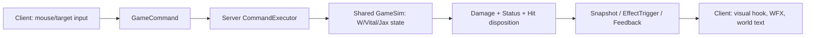

Session - Fiora Vital/Riposte와 Jax Counter Strike를 서버 권위 hit-payload·상태 복제 경계에 맞춰 정리한다.

이 문서는 2026-07-16 읽기 전용 전수조사 결과와 수정 계획서다. 이번 세션에서는 C++/JSON/WFX/스키마를 수정하거나 빌드하지 않았다. 이미 사용자가 실행 중인 클라이언트·서버와 기존 dirty worktree도 건드리지 않는다.

확정된 요구는 다음과 같다.

- 피오라 W는 마우스 방향을 고정한 1.5초 동안 피해와 상태 이상을 막고, 그 사이 받은 **Stun/Airborne 계열** 제어를 감지하면 release 적중 대상에게 stun을 준다. 감지하지 못했으면 slow를 준다.
- 피오라 Passive는 적 챔피언이 유효 거리 안에 있을 때 서버가 vital 하나를 만들고, 피오라의 BA/Q 실제 타격 궤적이 vital을 관통할 때만 추가 피해와 소멸을 처리한다.
- 피오라 R은 8초 동안 네 방향 vital을 유지한다. 네 개를 모두 파괴하면 고정된 heal zone, 하나라도 남긴 채 끝나면 고정된 ring만 남긴다.
- 잭스 E는 챔피언·미니언·정글몹의 BasicAttack 전체 payload를 회피하지만, 포탑/구조물 공격은 회피하지 않는다. 실제 회피 때만 서버 feedback을 통해 `회피!`를 띄운다.

아직 수치가 주어지지 않은 Passive 획득 거리·재생성 주기·vital 추가 피해·R vital당 피해·heal zone 회복량/반경은 `CONFIRM_NEEDED`다. 이 값은 코드로 추측해 넣지 않고 data authoring에서 확정한다. 반면 W cast 1.5초와 R mark 8초는 요청과 기존 data에 모두 존재하므로 계획의 고정값이다.

# 1. 반영해야 하는 코드

## 1-1. 현재 결론과 반드시 지켜야 할 권위 경계

현재 구현은 일부 시각 효과와 타이머만 있고, 요청한 게임 규칙은 서버 판정으로 연결되어 있지 않다.

| 항목 | 현재 코드 사실 | 문제 | 목표 소유자 |
|---|---|---|---|
| Fiora Passive | 서버 상태·vital 판정·복제 없음 | 텍스처만으로는 표식/추가 피해가 생기지 않음 | Shared GameSim / Server snapshot |
| Fiora R | `OnR`가 즉시 80 피해와 8초 타이머만 설정 | 4방향, 파괴 누적, 완료/실패, 실제 heal 없음 | Shared GameSim / Server snapshot |
| Fiora W | 0.75초 내부 플래그 + 즉시 champion 1명 slow | 1.5초 release, 피해 무효, CC 감지, stun 모두 없음 | Shared GameSim / Server event |
| Jax E | E2 damage/stun은 있음, E1 dodge flag를 쓰지 않음 | BA 피해/on-hit/CC가 그대로 들어감 | Damage hit resolver |
| 공격 분류 | `BasicAttack`/`Skill` enum은 있으나 소비하지 않음 | minion/turret/direct skill producer가 불일치 | Shared Damage pipeline |
| `회피!` | feedback → EventApplier → UI world text는 존재 | 서버가 Dodge feedback을 발행하지 않음 | Server feedback queue |

온라인 경로는 아래 하나만 게임 결과를 소유해야 한다. 클라이언트의 `Fiora_Skills.cpp` legacy local gameplay은 offline smoke 호환 코드이며, 온라인 피해/CC/vital 판정에 다시 연결하면 안 된다.



공격 한 번의 의미도 세 축으로 고정한다. 이것이 BA/스턴/슬로우를 한 enum에 섞지 않는 이유다.

```text
delivery class : BasicAttack | Skill | Item | Rune | StructureAttack
damage school  : Physical | Magic | True
hit payload    : Damage + 0..N { Slow, Stun, Airborne, on-hit stack, ... }
```

예를 들어 애쉬 BA는 `BasicAttack + Physical + Slow payload`, 잭스 E2는 `Skill + Physical + Stun payload`, 포탑은 `StructureAttack + Physical + damage-only`다. `DamageFlag_OnHit`은 proc 허용 플래그일 뿐 BasicAttack 식별자가 아니므로 회피 조건으로 쓰지 않는다.

## 1-2. 공통 hit disposition — 잭스 회피와 피오라 W를 한 판정 경계에 둔다

### 1-2-1. `Shared/GameSim/Components/DamageRequestComponent.h`

현재 `eDamageSourceKind`는 `Unknown/BasicAttack/Skill/Item/Rune`까지만 있고, 포탑 피해도 `Unknown`으로 흘러간다. 값의 기존 순서를 바꾸지 않고 맨 끝에 `StructureAttack`을 append한다.

기존 코드:

```cpp
enum class eDamageSourceKind : uint8_t
{
    Unknown = 0,
    BasicAttack = 1,
    Skill = 2,
    Item = 3,
    Rune = 4,
};
```

아래로 교체:

```cpp
enum class eDamageSourceKind : uint8_t
{
    Unknown = 0,
    BasicAttack = 1,
    Skill = 2,
    Item = 3,
    Rune = 4,
    StructureAttack = 5,
};
```

`BasicAttack`은 champion/minion/jungle actor가 내는 BA라는 delivery class이고, actor 종류는 이미 source entity의 component로 알 수 있으므로 `MinionBasicAttack`, `JungleBasicAttack`처럼 세 enum으로 쪼개지 않는다. 반대로 포탑·억제기·넥서스처럼 구조물 자체가 주는 공격은 `StructureAttack`으로 명시해야 잭스 E가 막지 않는다.

### 1-2-2. `Shared/GameSim/Systems/Damage/DamagePipeline.h`

`DamagePipeline`의 결과는 현재 HP 변화량만 갖는다. 투사체와 근접 공격이 같은 순수 판정을 재사용하도록 다음 public contract를 `DamageResult` 위에 추가한다.

기존 코드:

```cpp
struct DamageResult
{
    f32_t finalAmount = 0.f;
    bool_t bWasCrit = false;
    bool_t bWasShielded = false;
    bool_t bKilled = false;
};
```

아래로 교체:

```cpp
enum class eHitDisposition : u8_t
{
    Apply = 0,
    DodgedBasicAttack,
    ParriedRiposte,
};

struct DamageResult
{
    f32_t finalAmount = 0.f;
    bool_t bWasCrit = false;
    bool_t bWasShielded = false;
    bool_t bKilled = false;
    eHitDisposition eDisposition = eHitDisposition::Apply;
};

eHitDisposition ResolveIncomingHitDisposition(
    CWorld& world,
    const DamageRequest& request);
void EmitHitDispositionFeedback(
    CWorld& world,
    const TickContext& tc,
    const DamageRequest& request,
    eHitDisposition disposition);
```

`ResolveIncomingHitDisposition`은 순수 query다. HP, status, on-hit stack, FX를 바꾸지 않는다. 따라서 투사체 충돌 전과 `ApplyDamageRequest` 내부에서 같은 답을 얻을 수 있다. `EmitHitDispositionFeedback`만 서버 event를 만들며, `DodgedBasicAttack`일 때만 `GameplayFeedback::WorldTextFeedbackKind::Dodge`를 enqueue한다. Fiora W의 parry에는 `회피!`를 재사용하지 않는다.

### 1-2-3. `Shared/GameSim/Systems/Damage/DamagePipeline.cpp`

현재 `ApplyDamageRequest`는 target validity → resistance/shield → HP 감소만 수행한다(`339` 근처). `kGameplayStateDodgesBasicAttacksFlag`와 `FioraSimComponent::bRiposteActive`를 전혀 읽지 않는다.

`DamageResult result{};` 바로 아래, target/team validity를 통과한 뒤 resistance 계산 전에 아래의 경계를 넣는다.

아래에 추가:

```cpp
const eHitDisposition disposition = ResolveIncomingHitDisposition(world, req);
result.eDisposition = disposition;
if (disposition != eHitDisposition::Apply)
    return result;
```

`ResolveIncomingHitDisposition`의 정책은 다음으로 제한한다.

```cpp
eHitDisposition ResolveIncomingHitDisposition(
    CWorld& world,
    const DamageRequest& request)
{
    if (FioraGameSim::TryInterceptIncomingDamage(world, request))
        return eHitDisposition::ParriedRiposte;

    if (request.eSourceKind == eDamageSourceKind::BasicAttack &&
        GameplayStateQuery::HasState(
            world,
            request.target,
            kGameplayStateDodgesBasicAttacksFlag))
    {
        return eHitDisposition::DodgedBasicAttack;
    }

    return eHitDisposition::Apply;
}
```

순서는 피오라 W의 전 피해 무효가 먼저, 잭스 BA 회피가 다음이다. 서로 다른 champion에게 걸리는 상태이므로 실제 충돌은 없지만, policy를 한 곳에 고정한다. `Unknown`은 migration 완료 전까지 **회피하지 않는 fail-closed**로 둔다. Unknown을 BA로 추정하면 포탑이나 잘못 분류된 스킬이 회피되어 게임 규칙을 깨기 때문이다. Debug에서는 source/target/skillId별 bounded `OutputDebugStringA` 경고를 남겨 producer migration을 끝낸다.

### 1-2-4. `Server/Private/Game/GameRoomProjectiles.cpp`

이 파일의 일반 충돌 경로는 현재 다음 순서다.

```text
onHitStatus 적용 → Kalista Rend stack 적용 → DamageRequest 작성/queue
```

따라서 DamagePipeline에서 HP만 0으로 만들면, 잭스가 애쉬 BA의 slow와 칼리스타 Rend stack을 맞은 뒤 숫자 피해만 피하는 버그가 생긴다. `662` 근처 비관통 경로와 `879` 근처 관통 경로 모두에서 **상태/proc 전에** request를 만들고 eligibility를 확인해야 한다.

기존 코드:

```cpp
if (projectile.bApplyOnHitStatus)
{
    GameplayStatus::ApplyStatusEffect(
        m_world,
        projectile.targetEntity,
        projectile.onHitStatus,
        tc);
}

// Kalista Rend stack
// DamageRequest build/enqueue
```

아래로 교체:

```cpp
DamageRequest eligibilityRequest =
    CServerProjectileAuthority::BuildSkillProjectileDamageRequest(
        projectile,
        resolvedTarget,
        projectile.damageType);
const eHitDisposition disposition =
    ResolveIncomingHitDisposition(m_world, eligibilityRequest);
if (disposition != eHitDisposition::Apply)
{
    EmitHitDispositionFeedback(m_world, tc, eligibilityRequest, disposition);
    EnqueueProjectileContact(
        resolvedTarget,
        hitPosition,
        ProjectileContactReason::UnitHit,
        !bPiercingProjectile);
    // visual contact는 남기되 status, Rend/proc, damage는 모두 건너뛴다.
    // 비관통 branch는 기존 DestroyEntity+continue를, 관통 branch는
    // 기존 hit-ledger 갱신 후 다음 target loop를 그대로 사용한다.
}

// 이 아래에서만 onHitStatus, champion-specific on-hit proc,
// Ashe/Ezreal request specialization, EnqueueDamageRequest를 수행한다.
```

위 block의 마지막 줄은 실제 두 branch의 destroy/pierce 정책이 다르므로 그대로 복사하지 않는다. 비관통 branch는 기존처럼 projectile을 destroy하고, 관통 branch는 hit ledger만 소비하고 다음 target을 계속 검사한다. 핵심은 **BasicAttack의 전체 payload를 같은 disposition으로 skip**하는 것이다.

`FioraGameSim::TryInterceptIncomingStatus`도 `GameplayStatus::TryApplyStatusEffect` 내부에서 호출한다. 이는 projectile 외 direct status source도 W 중에는 적용되지 않게 한다. 호출 위치는 `StatusEffectSystem.cpp`의 `ApplyStatusEffectInternal` 직전이다.

```cpp
if (FioraGameSim::TryInterceptIncomingStatus(world, target, desc))
    return false;
```

이 interception은 `InterruptActionsForCrowdControl`보다 먼저여야 한다. 그렇지 않으면 W가 stun을 기록했는데도 피오라의 W action이 먼저 끊긴다. hard CC 판정은 현재 상태 정의에 맞춰 `kGameplayStateStunnedFlag | kGameplayStateAirborneFlag`만 사용한다. Slow는 차단되지만 `bRiposteCaughtHardCC`를 켜지 않는다.

### 1-2-5. `Shared/GameSim/Systems/Damage/DamageQueueSystem.cpp`

현재 `finalAmount > 0`일 때만 Damage event를 만든다. 그 바로 앞에 disposition feedback을 넣되, HP가 0인 일반 miss/shield에는 text를 만들지 않는다.

기존 코드:

```cpp
const DamageResult result = ApplyDamageRequest(world, tc, request);
if (bYasuoPassiveShieldReady && result.bWasShielded)
    EnqueueYasuoPassiveShieldVisual(world, tc, request.target);

if (result.finalAmount > 0.f && request.target != NULL_ENTITY)
```

아래로 교체:

```cpp
const DamageResult result = ApplyDamageRequest(world, tc, request);
if (result.eDisposition != eHitDisposition::Apply)
    EmitHitDispositionFeedback(world, tc, request, result.eDisposition);

if (bYasuoPassiveShieldReady && result.bWasShielded)
    EnqueueYasuoPassiveShieldVisual(world, tc, request.target);

if (result.finalAmount > 0.f && request.target != NULL_ENTITY)
```

투사체 경로는 request를 queue에 넣지 않고 자신이 feedback을 한 번 발행하므로, queue와 projectile 중 하나만 feedback을 만든다는 ownership을 유지한다.

## 1-3. producer 분류 정규화와 잭스 E

### 1-3-1. `Server/Private/Game/GameRoomUnitAI.cpp`

현재 근접 미니언 request(`490` 근처)는 `eSourceKind`를 채우지 않아 `Unknown`이고, 원거리 미니언 projectile(`465` 근처)은 `SkillProjectileComponent`의 기본 `Skill`을 그대로 쓴다. 둘 다 BA다.

근접 미니언의 아래 기존 코드 바로 아래에 추가:

```cpp
request.iSourceSlot = static_cast<u8_t>(eSkillSlot::BasicAttack);
request.eSourceKind = eDamageSourceKind::BasicAttack;
```

원거리 미니언의 `projectile.damage = state.attackDamage;` 바로 아래에 추가:

```cpp
projectile.sourceSlot = static_cast<u8_t>(eSkillSlot::BasicAttack);
projectile.damageSourceKind = eDamageSourceKind::BasicAttack;
```

`SkillProjectileComponent`의 기본값은 `Skill`로 유지한다. 기본값 자체를 BA로 바꾸면 실제 champion skill projectile이 잭스 E에 회피되는 역회귀가 생긴다.

### 1-3-2. `Server/Private/Game/ServerProjectileAuthority.cpp`

현재 `BuildTurretDamageRequest`는 `skillId`만 채우고 source kind가 `Unknown`이다. `request.skillId = kStructureProjectileKind;` 바로 아래에 추가한다.

```cpp
request.eSourceKind = eDamageSourceKind::StructureAttack;
request.flags = DamageFlag_None;
```

`Shared/GameSim/Systems/Turret/StructureProjectileSystem.cpp`의 legacy direct-HP path도 별도 점검 대상이다. 정상 server room에서 이 경로가 살아 있다면 DamagePipeline을 우회하므로, 직접 HP 차감 대신 동일한 `StructureAttack` request를 enqueue하게 바꾼다. 정상 live path가 아니라면 `GameRoom`에서 사용하지 않는 것을 test로 고정한다. 어느 경우에도 포탑 공격을 `BasicAttack`으로 분류하지 않는다.

### 1-3-3. champion direct skill helper 전체 migration

`CombatActionSystem.cpp:299`의 일반 champion/jungle BA는 이미 `BasicAttack`을 명시한다. 반면 Fiora/Jax/Irelia/Annie/Yasuo/Yone/Zed/Viego/LeeSin/Kindred 등의 direct damage helper 중 다수는 `Unknown`을 남긴다. 예를 들어 Fiora `EnqueuePhysicalDamage`는 현재 `DamageFlag_OnHit`만 설정한다.

`Shared/GameSim/Champions/Fiora/FioraGameSim.cpp`의 helper signature를 아래로 교체한다.

기존 코드:

```cpp
void EnqueuePhysicalDamage(
    CWorld& world,
    EntityID source,
    EntityID target,
    eTeam sourceTeam,
    f32_t amount,
    u16_t skillId,
    u8_t rank)
```

아래로 교체:

```cpp
void EnqueuePhysicalDamage(
    CWorld& world,
    EntityID source,
    EntityID target,
    eTeam sourceTeam,
    f32_t amount,
    u16_t skillId,
    u8_t rank,
    eDamageSourceKind sourceKind)
```

그리고 `request.rank = rank;` 바로 아래에 추가한다.

```cpp
request.eSourceKind = sourceKind;
```

Q/R/W/vital bonus 호출은 `Skill`, basic attack augmentation만 `BasicAttack`으로 호출한다. 같은 migration을 direct request를 만드는 모든 champion helper에 적용한다. 이 작업은 단순 format refactor가 아니라, 이제 source kind가 실제 defensive rule을 소비하므로 release 전에 끝내야 하는 correctness migration이다.

### 1-3-4. `Shared/GameSim/Components/GameplayComponents.h`, `StatusEffectRequests.h`, `JaxGameSim.cpp`

`kGameplayStateDodgesBasicAttacksFlag`는 이미 `1u << 9`로 정의돼 있지만 사용처가 없다. target에게 걸리는 기존 `eStatusEffectId::JaxCounterStrike`는 E2에 맞은 적의 stun id이므로 절대 재사용하지 않는다.

`eStatusEffectId` enum의 마지막 항목 아래에 append:

```cpp
JaxCounterStrikeDodge = 12,
```

`Shared/GameSim/Systems/StatusEffect/StatusEffectRequests.h`의 `MakeAirborneDesc` 아래에 추가:

```cpp
inline StatusEffectApplyDesc MakeBasicAttackDodgeDesc(
    EntityID source,
    f32_t durationSec)
{
    StatusEffectApplyDesc desc{};
    desc.effectId = eStatusEffectId::JaxCounterStrikeDodge;
    desc.stackPolicy = eStatusStackPolicy::RefreshDuration;
    desc.sourceEntity = source;
    desc.stackGroup = MakeStatusStackGroup(eChampion::JAX, eSkillSlot::E);
    desc.stateFlags = kGameplayStateDodgesBasicAttacksFlag;
    desc.fDurationSec = durationSec;
    desc.fMoveSpeedMul = 1.f;
    return desc;
}
```

`JaxGameSim.cpp`의 `OnE`에서 `state.bCounterStrikeActive = true;` 직후에 E stage duration과 같은 값으로 self status를 적용한다.

아래에 추가:

```cpp
const f32_t counterDurationSec =
    GameplayDefinitionQuery::ResolveSkillStageWindowSec(
        *ctx.pWorld,
        ctx.casterEntity,
        tickCtx,
        eChampion::JAX,
        static_cast<u8_t>(eSkillSlot::E));
state.counterTimerSec = counterDurationSec;
GameplayStatus::ApplyStatusEffect(
    *ctx.pWorld,
    ctx.casterEntity,
    GameplayStatus::MakeBasicAttackDodgeDesc(
        ctx.casterEntity,
        counterDurationSec),
    tickCtx);
```

위 block 바로 위에는 현재 `OnE`가 release branch에서 쓰는 패턴과 같은 아래 fallback을 둔다.

```cpp
TickContext fallbackTick{};
const TickContext& tickCtx = ctx.pTickCtx ? *ctx.pTickCtx : fallbackTick;
```

`ReleaseJaxCounterStrike`의 `state.bCounterStrikeActive = false;` 바로 아래에 추가:

```cpp
GameplayStatus::RemoveStatusEffect(
    world,
    caster,
    eStatusEffectId::JaxCounterStrikeDodge,
    caster);
```

이 순서면 수동 E2와 자동 만료 E2 모두에서 먼저 dodge flag가 내려가고, 이어지는 E2 Skill damage/stun은 절대 자신의 E dodge에 걸리지 않는다. `GameplayStatus::RebuildGameplayState`가 active status flags를 합성하므로 snapshot/replay에도 상태가 정합하다.

사용자가 말한 “Fort manager”라는 클래스는 찾지 못했다. 실제 경로는 아래다. 아마 `CFont_Manager`를 의미한 것으로 보인다.

```text
server GameplayFeedback::EnqueueWorldTextFeedback(Dodge)
  → replicated EffectTrigger
  → Client/EventApplier.cpp::ApplyEffectTrigger
  → CGameInstance::UI_Push_WorldText
  → CUI_Manager::Push_WorldText
  → CFont_Manager (Noto Sans CJK/Korean glyph)
```

따라서 client-only text를 새로 만들지 않는다. 실제 server dodge 결과에서만 `회피!`가 한 번 나온다.

## 1-4. 피오라 W — 입력 방향, 1.5초 보류, parry, release를 분리한다

### 현재 원인

`Shared/GameSim/Champions/Fiora/FioraGameSim.cpp:227`의 `OnW`는 다음을 같은 cast frame에서 한다.

```cpp
state.bRiposteActive = true;
state.riposteTimerSec = state.riposteWindowSec; // 기본 0.75초
const EntityID hitTarget = FindEnemyInCone(...);
GameplayStatus::ApplySlow(...);                // 즉시 slow
```

이 코드는 damage/CC immunity/CC record/release stun을 구현하지 않는다. 또한 `Data/Gameplay/ChampionGameData/champions.json`과 generated `SkillGameplayDefs.json`의 Fiora W target이 `Conditional`→`Self`라 `BuildCastCommand`가 self target만 채우고 direction을 비운다. 서버 `ResolveCastFacingDirection`도 caster와 target이 같은 self command에서 fallback 방향을 만들지 못한다. 결국 `FindEnemyInCone`에 0 vector가 들어가 dot test가 전부 실패할 수 있다.

`stage.lockSeconds[0] == 1.5`도 action lock일 뿐 hook/FX를 지연하지 않는다. CommandExecutor는 W hook과 `EffectTrigger`를 cast 수락 tick에 즉시 보낸다. 현재 0.75 / 1.5 / 즉시 적용이라는 세 개의 시계가 공존한다.

### 1-4-1. `Data/Gameplay/ChampionGameData/champions.json`

Fiora W skill record(`slot: 2`)의 정확한 authoring 위치에서 아래로 교체한다. generated `SkillGameplayDefs.json`을 직접 수동 편집하지 않는다.

기존 코드:

```json
"targetMode": "Conditional",
"stageCount": 1,
"stageWindowSec": 0.0,
"cooldownSec": 3.0,
"rangeMax": 0.0,
```

아래로 교체:

```json
"targetMode": "Direction",
"stageCount": 1,
"stageWindowSec": 0.0,
"cooldownSec": 3.0,
"rangeMax": 6.0,
```

`lockDurationSec: 1.5`는 유지한다. 이 변경으로 `CScene_InGame::BuildCastCommand`의 기존 Direction branch가 mouse map surface에서 normalized direction을 만들고, CommandExecutor가 server event에도 같은 direction을 보존한다.

### 1-4-2. `Data/LoL/ServerPrivate/Gameplay/SkillEffectGameplayDefs.json`

Fiora W scalar는 이 파일이 authoring input이며 `Tools/LoLData/Build-LoLDefinitionPack.py`가 build hash와 generated C++를 갱신한다. 기존 W object의 `params`에 아래 key를 추가한다.

```json
{
  "id": "castTimeSec",
  "value": 1.5
}
```

아래 key들은 구현 전에 수치 확정이 필요하다. 이름과 책임은 확정이지만 `value`를 임의로 채우면 밸런스 변경이 되므로 `CONFIRM_NEEDED`다.

```text
baseDamage        : release 물리 피해
stunDurationSec   : hard CC를 parry했을 때 release stun 시간
slowDurationSec   : hard CC가 없을 때 release slow 시간 (현재 1.5 존재)
range             : release segment 길이 (현재 6.0 존재)
halfWidth/radius  : release capsule 반폭 (현재 radius 0.8 존재)
```

`SkillAtomData.h`에는 `CastTimeSec`, `StunDurationSec`, `SlowDurationSec`, `Range`, `HalfWidth`, `Radius`가 이미 있다. 새 enum을 만들지 않고 이 범용 params를 쓴다. `CommandExecutor::ResolveSkillEffectDurationMs`의 Fiora W case도 `CastTimeSec * 1000`으로 읽어 cast indicator lifetime이 700ms fallback이 되지 않게 바꾼다.

### 1-4-3. `Shared/GameSim/Components/FioraSimComponent.h`

이 파일은 현재 W의 0.75초 timer와 R target만 보관한다. 새 파일을 만들지 않고, fixed-size/trivially-copyable 상태를 이 component에 넣는다. 아래는 이 파일의 `struct FioraSimComponent` 전체 교체 계획이다. vector, client entity, raw pointer를 넣지 않는다.

기존 코드:

```cpp
struct FioraSimComponent
{
    bool_t bBladeworkActive = false;
    f32_t bladeworkTimerSec = 0.f;
    u8_t bladeworkHitsRemaining = 0;
    f32_t bladeworkDamageBonus = 30.f;

    bool_t bRiposteActive = false;
    f32_t riposteTimerSec = 0.f;
    f32_t riposteWindowSec = 0.75f;

    bool_t bGrandChallengeActive = false;
    f32_t grandChallengeTimerSec = 0.f;
    EntityID grandChallengeTarget = NULL_ENTITY;
};
```

아래로 교체:

```cpp
enum class eFioraVitalMode : u8_t
{
    None = 0u,
    Passive = 1u,
    GrandChallenge = 2u,
};

enum class eFioraGroundZoneKind : u8_t
{
    None = 0u,
    Heal = 1u,
    FailureRing = 2u,
};

struct FioraVitalSetState
{
    EntityID target = NULL_ENTITY;
    eFioraVitalMode eMode = eFioraVitalMode::None;
    u8_t uActiveDirectionMask = 0u;
    u8_t uTriggeredDirectionMask = 0u;
    u8_t uGenerationOrdinal = 0u;
    u64_t uSpawnTick = 0u;
    u64_t uExpireTick = 0u;
    u64_t uNextSpawnTick = 0u;
    Vec3 vBaseOutwardDirection{};
};

struct FioraGroundZoneState
{
    eFioraGroundZoneKind eKind = eFioraGroundZoneKind::None;
    Vec3 vCenter{};
    u64_t uExpireTick = 0u;
    u64_t uNextTick = 0u;
};

struct FioraSimComponent
{
    bool_t bBladeworkActive = false;
    f32_t bladeworkTimerSec = 0.f;
    u8_t bladeworkHitsRemaining = 0u;
    f32_t bladeworkDamageBonus = 30.f;

    bool_t bRiposteActive = false;
    bool_t bRiposteCaughtHardCC = false;
    u8_t uRiposteRank = 1u;
    u64_t uRiposteReleaseTick = 0u;
    Vec3 vRiposteDirection{ 0.f, 0.f, 1.f };

    FioraVitalSetState passiveVital{};
    FioraVitalSetState grandChallengeVital{};
    FioraGroundZoneState groundZone{};
};
```

`static_assert(std::is_trivially_copyable_v<FioraSimComponent>);`는 유지한다. R의 구식 `bGrandChallengeActive/grandChallengeTimerSec/grandChallengeTarget`는 `grandChallengeVital.eMode/target/expireTick`으로 단일 소스를 만든 뒤 삭제한다. W에도 float decrement timer를 남기지 않고 release tick을 소유하게 해 30Hz replay에서 1.5초가 정확히 45 tick이 되게 한다.

`Shared/GameSim/Core/Checkpoint/WorldKeyframe.cpp`는 이미 `FioraSimComponent`를 keyframe registry에 등록한다. 새 state도 이 trivially-copyable component 안에 있으므로 별도 checkpoint component를 만들지 않는다. `CancelRuntime`은 component를 통째로 제거하므로 cancel/death 시 W/vital/zone을 함께 정리한다.

### 1-4-4. `Shared/GameSim/Champions/Fiora/FioraGameSim.h`

기존 public declarations 아래에 incoming defender response와 vital hit entry point를 추가한다.

아래에 추가:

```cpp
struct DamageRequest;
struct StatusEffectApplyDesc;

namespace FioraGameSim
{
    bool_t TryInterceptIncomingDamage(CWorld& world, const DamageRequest& request);
    bool_t TryInterceptIncomingStatus(
        CWorld& world,
        EntityID target,
        const StatusEffectApplyDesc& desc);
    bool_t TryTriggerVitalFromAttack(
        CWorld& world,
        const TickContext& tc,
        EntityID caster,
        EntityID target,
        const Vec3& vSegmentStart,
        const Vec3& vSegmentEnd,
        eDamageSourceKind sourceKind);
}
```

`TryInterceptIncomingDamage`는 target이 살아 있는 Fiora이고 `bRiposteActive`일 때만 true를 반환한다. `TryInterceptIncomingStatus`는 같은 target에 들어오는 모든 status를 막고, `Stunned` 또는 `Airborne` flag가 포함된 경우 `bRiposteCaughtHardCC`만 true로 기록한다. client의 local `FioraStateComponent`를 읽지 않는다.

### 1-4-5. `Shared/GameSim/Champions/Fiora/FioraGameSim.cpp`

`OnW`의 즉시 cone slow block(`origin`부터 `FindEnemyInCone`/`ApplySlow`까지)은 삭제한다. W cast는 상태를 arm할 뿐 피해를 주지 않는다.

삭제할 코드 범위:

```cpp
const Vec3 origin = ...;
const Vec3 direction = ...;
const f32_t wRange = ...;
const f32_t wRadius = ...;
const f32_t wSlowDurationSec = ...;
const f32_t wSlowMoveSpeedMul = ...;
const EntityID hitTarget = FindEnemyInCone(...);
if (hitTarget != NULL_ENTITY)
{
    GameplayStatus::ApplySlow(...);
}
```

`state.bRiposteActive = true;` 위치를 아래로 교체한다.

```cpp
const f32_t castTimeSec = ResolveFioraSkillEffectParam(
    ctx,
    eSkillSlot::W,
    eSkillEffectParamId::CastTimeSec,
    1.5f);
const Vec3 direction = WintersMath::NormalizeXZOrZero(ctx.pCommand->direction);
if (direction.x == 0.f && direction.z == 0.f)
    return;

state.bRiposteActive = true;
state.bRiposteCaughtHardCC = false;
state.uRiposteRank = ctx.skillRank;
state.vRiposteDirection = direction;
state.uRiposteReleaseTick = ctx.pTickCtx->tickIndex +
    SecondsToTicksCeil(castTimeSec);
ClearMove(world, ctx.casterEntity);
```

`Tick`의 `if (state.bRiposteActive)` block은 아래 순서로 교체한다.

```cpp
if (state.bRiposteActive && tc.tickIndex >= state.uRiposteReleaseTick)
{
    const Vec3 start = world.HasComponent<TransformComponent>(entity)
        ? world.GetComponent<TransformComponent>(entity).GetPosition()
        : Vec3{};
    const f32_t range = GameplayDefinitionQuery::ResolveSkillEffectParam(
        world, entity, tc, eChampion::FIORA,
        static_cast<u8_t>(eSkillSlot::W),
        eSkillEffectParamId::Range, 6.f);
    const f32_t halfWidth = GameplayDefinitionQuery::ResolveSkillEffectParam(
        world, entity, tc, eChampion::FIORA,
        static_cast<u8_t>(eSkillSlot::W),
        eSkillEffectParamId::Radius, 0.8f);
    const Vec3 end = start + state.vRiposteDirection * range;
    const std::vector<EntityID> targets =
        GameplayStateQuery::CollectEnemyMobileUnitsInSegment(
            world, entity, start, end, halfWidth);

    const eTeam casterTeam =
        world.GetComponent<ChampionComponent>(entity).team;
    const f32_t wDamage = GameplayDefinitionQuery::ResolveSkillEffectParam(
        world, entity, tc, eChampion::FIORA,
        static_cast<u8_t>(eSkillSlot::W),
        eSkillEffectParamId::BaseDamage, 0.f);
    const f32_t stunDurationSec = GameplayDefinitionQuery::ResolveSkillEffectParam(
        world, entity, tc, eChampion::FIORA,
        static_cast<u8_t>(eSkillSlot::W),
        eSkillEffectParamId::StunDurationSec, 0.f);
    const f32_t slowDurationSec = GameplayDefinitionQuery::ResolveSkillEffectParam(
        world, entity, tc, eChampion::FIORA,
        static_cast<u8_t>(eSkillSlot::W),
        eSkillEffectParamId::SlowDurationSec, 1.5f);
    const f32_t slowMoveSpeedMul = GameplayDefinitionQuery::ResolveSkillEffectParam(
        world, entity, tc, eChampion::FIORA,
        static_cast<u8_t>(eSkillSlot::W),
        eSkillEffectParamId::MoveSpeedMul, 0.5f);

    for (EntityID target : targets)
    {
        EnqueuePhysicalDamage(
            world, entity, target, casterTeam, wDamage,
            static_cast<u16_t>((static_cast<u32_t>(eChampion::FIORA) << 8) | 3u),
            state.uRiposteRank, eDamageSourceKind::Skill);
        if (state.bRiposteCaughtHardCC)
            GameplayStatus::ApplyStun(world, tc, target, entity,
                eChampion::FIORA, eSkillSlot::W, stunDurationSec);
        else
            GameplayStatus::ApplySlow(world, tc, target, entity,
                eChampion::FIORA, eSkillSlot::W,
                slowDurationSec, slowMoveSpeedMul);
    }

    EnqueueFioraWReleaseVisual(world, entity, tc, state.vRiposteDirection);
    state.bRiposteActive = false;
    state.uRiposteReleaseTick = 0u;
}
```

위 block은 `world.HasComponent<ChampionComponent>(entity)` guard 안에서 실행한다. `CollectEnemyMobileUnitsInSegment`는 champion/minion/jungle을 deterministic order로 반환하므로 기존 `FindEnemyInCone`의 champion 한 명 제한을 제거한다. mouse가 W 도중 이동해도 `vRiposteDirection`은 cast 수락 tick 값으로 고정된다.

`EnqueueFioraWReleaseVisual`은 `ReplicatedEventComponent`를 아래처럼 만든다. `GameplayHookVariant::W_Recovery (0x0043)`는 이미 `EventApplier::SlotFromHookId`가 W로 해석한다.

```cpp
event.kind = eReplicatedEventKind::EffectTrigger;
event.sourceEntity = caster;
event.effectId = MakeGameplayHookId(
    eChampion::FIORA,
    GameplayHookVariant::W_Recovery);
event.slot = static_cast<u8_t>(eSkillSlot::W);
event.direction = direction;
event.startTick = tc.tickIndex;
event.durationMs = 300u;
EnqueueReplicatedEvent(world, event);
```

피오라 W는 `Untargetable` status를 재사용하지 않는다. `Untargetable`은 projectile contact 자체와 CC attempt를 제거하므로, “막은 stun을 감지해 release stun”이라는 요구를 구현할 수 없기 때문이다.

## 1-5. 피오라 Passive/R — vital relation, 궤적 판정, 4방향 완료/실패

### 1-5-1. Passive authoring과 definition pack

Fiora passive는 skill slot이 아니라 champion passive다. 현재 `ChampionGameplayDef`에는 `PassiveDashGameplayDef`, `PassiveSoulGameplayDef`만 있으므로, passive 수치를 hard-code하지 않는다. 다음 files에 `PassiveVitalGameplayDef`를 추가한다.

- `Shared/GameSim/Definitions/ChampionGameplayDef.h`
- `Shared/GameSim/Definitions/GameplayDefinitionQuery.h/.cpp`
- `Tools/ChampionData/build_champion_game_data.py`
- `Tools/LoLData/Build-LoLDefinitionPack.py`
- `Data/Gameplay/ChampionGameData/champions.json`
- generated `Server/Private/Data/Generated/LoLGameplayDefinitions.generated.cpp` (tool output만 갱신)

`PassiveSoulGameplayDef` 아래에 추가할 struct는 아래다.

```cpp
struct PassiveVitalGameplayDef
{
    bool_t bValid = false;
    f32_t acquireRange = 0.f;
    f32_t vitalOffset = 0.f;
    f32_t triggerRadius = 0.f;
    f32_t lifetimeSec = 0.f;
    f32_t respawnIntervalSec = 0.f;
    f32_t bonusDamage = 0.f;
};
```

`ChampionGameplayDef`의 `passiveSoul{}` 바로 아래에 `PassiveVitalGameplayDef passiveVital{};`를 추가한다. `GameplayDefinitionQuery::FindPassiveVital`은 기존 `FindPassiveDash`와 같은 방식으로 pack의 Fiora champion record를 찾는다.

`Data/Gameplay/ChampionGameData/champions.json`의 Fiora object에 넣을 정확한 JSON key는 아래다. 수치는 balance decision이므로 `CONFIRM_NEEDED` 값을 확정한 뒤 한 번에 넣는다.

```json
"passiveVital": {
  "acquireRange": CONFIRM_NEEDED,
  "vitalOffset": CONFIRM_NEEDED,
  "triggerRadius": CONFIRM_NEEDED,
  "lifetimeSec": CONFIRM_NEEDED,
  "respawnIntervalSec": CONFIRM_NEEDED,
  "bonusDamage": CONFIRM_NEEDED
}
```

위 block은 의도한 schema이지 유효 JSON으로 바로 넣을 body가 아니다. 값을 날조하지 않기 위해 명시적으로 `CONFIRM_NEEDED`로 남겼다. 수치가 확정되면 `build_champion_game_data.py`의 `normalize_passive_vital`, `Build-LoLDefinitionPack.py`의 `server_champion_json`/`emit_cpp`가 모든 generated artifact를 만들게 한다.

### 1-5-2. vital 생성/적중 알고리즘

Vital은 billboard 위치나 client mouse position으로 판정하지 않는다. server transform와 실제 hit segment만 사용한다.

```text
서버 tick (Fiora sorted entity)
  → acquireRange 안의 유효 enemy champion 하나를 deterministic 선택
  → passiveVital에 1 bit 또는 R에 0b1111 active mask 생성
  → target 중심 + outwardDirection * vitalOffset 으로 world vital position 계산

Fiora BA/Q가 server에서 적중
  → defender hit disposition이 Apply인지 먼저 확인
  → BA/Q start→end segment와 vital 원의 XZ 거리 검사
  → 같은 vital을 이미 터뜨렸는지 검사
  → active bit 제거 / triggered bit 설정
  → 별도 Skill damage request로 bonus damage enqueue
  → snapshot state 갱신 + 짧은 pop event
```

side 선택은 `uGenerationOrdinal`, caster/target stable id, match RNG state를 hash한 뒤 4방향 중 하나를 선택한다. 모든 방향 벡터는 spawn 당시의 `target → Fiora` 기준 base direction에서 90도씩 회전해 만든다. 이 방식은 server/replay에서 같은 seed이면 같은 방향이고, client가 packet/input으로 direction을 조작할 수 없다.

적중 조건은 다음 두 조건을 동시에 둔다.

```text
1. DistanceSqPointToSegmentXZ(vitalWorldPos, attackStart, attackEnd)
   <= triggerRadius^2
2. attacker가 vital outward side에서 target에 접근했다는 dot threshold를 충족
```

두 번째 조건이 없으면 target 반대편 vital도 일반 BA hit만으로 같이 터질 수 있다. `DamageRequest`는 trajectory를 저장하지 않으므로 범용 DamagePipeline 마지막에 vital을 검사하면 늦고 정확하지 않다.

### 1-5-3. `Shared/GameSim/Systems/Combat/CombatActionSystem.cpp`

일반 melee BA의 실제 server hit 지점은 `request`를 만든 `299` 근처다. `if (!bProjectileImpactDeferred)` 바로 위에 다음 순서를 넣는다.

아래에 추가:

```cpp
const eHitDisposition disposition = ResolveIncomingHitDisposition(world, request);
if (disposition == eHitDisposition::Apply &&
    resolvedChampion == eChampion::FIORA &&
    world.HasComponent<TransformComponent>(source) &&
    world.HasComponent<TransformComponent>(target))
{
    FioraGameSim::TryTriggerVitalFromAttack(
        world,
        tc,
        source,
        target,
        world.GetComponent<TransformComponent>(source).GetPosition(),
        world.GetComponent<TransformComponent>(target).GetPosition(),
        request.eSourceKind);
}
```

여기서는 eligibility를 미리 보고 vital만 skip한다. base request는 그대로 queue에 들어가며 queue가 동일 disposition을 다시 확인한다. helper는 `BasicAttack`인 Fiora source만 처리한다. 이 설계로 잭스 E dodge나 피오라 W parry를 당한 BA가 vital을 터뜨리지 않는다.

### 1-5-4. `Shared/GameSim/Champions/Fiora/FioraGameSim.cpp`의 Q/R/Tick

Q는 현재 `EnqueuePhysicalDamage` 바로 전에 실제 Q hit target을 알고 있다. 그 호출 바로 위에 Q dash start와 resolved hit target position을 전달하는 `TryTriggerVitalFromAttack`을 넣는다. source kind는 `Skill`이지만 helper는 Fiora Q를 허용하는 별도 `attackKind` enum/boolean으로 명확히 구분한다. `DamageRequest::eSourceKind` 자체를 BasicAttack으로 위장하지 않는다.

현재 R block:

```cpp
state.bGrandChallengeActive = true;
state.grandChallengeTimerSec = 8.0f;
state.grandChallengeTarget = target;

EnqueuePhysicalDamage(..., rDamage, ...);
```

아래로 교체:

```cpp
FioraVitalSetState& vital = state.grandChallengeVital;
vital = FioraVitalSetState{};
vital.target = target;
vital.eMode = eFioraVitalMode::GrandChallenge;
vital.uActiveDirectionMask = 0x0fu;
vital.uTriggeredDirectionMask = 0u;
vital.uGenerationOrdinal = NextDeterministicVitalOrdinal(...);
vital.uSpawnTick = ctx.pTickCtx->tickIndex;
vital.uExpireTick = ctx.pTickCtx->tickIndex + SecondsToTicksCeil(8.f);
vital.vBaseOutwardDirection = ResolveTargetToCasterDirection(...);
```

권장 기본안은 기존 R 즉시 `baseDamage=80`을 제거하고, `baseDamage`를 vital을 터뜨릴 때만 주는 per-vital damage로 명확히 쓴다. 요청한 R 설명은 4개 표식을 터뜨리는 구조이며 즉시 80 피해를 요구하지 않기 때문이다. 만약 즉시 cast damage를 유지하고 싶다면 data에 별도 `castDamage` param을 추가해야 한다. 현재 하나의 `baseDamage`로 둘을 겸하면 의도가 불명확하므로 `CONFIRM_NEEDED`다.

`FioraGameSim::Tick`은 다음 순서로 확장한다.

```text
1. passive vital: target 유효/거리 확인 → 만료 시 제거 → nextSpawnTick이 되면 새 1방향 vital 생성
2. R vital: target 유효 확인 → 네 번째 bit가 제거되면 즉시 Heal zone 시작
3. R vital: expireTick 도달 + 아직 active bit가 있으면 FailureRing 시작
4. ground zone: full heal이면 tick interval마다 아군 champion HP 회복,
   ring이면 visual lifetime만 유지
```

Heal zone의 center는 **마지막 vital을 파괴한 target의 그 tick 위치**로 고정한다. 현재 client `SpawnRHealZone`처럼 Fiora에게 attach하면 바닥 영역이 이동하는 버그가 된다. `AreaAuraComponent`는 현재 owner-only status 중심이라 ally heal/deterministic periodic health 회복에 바로 맞지 않는다. 이번 범위는 `FioraGroundZoneState`를 Fiora GameSim에서 최소 구현한다.

R data에 추가할 수치 key는 아래다.

```text
markDurationSec = 8.0 (확정)
maxStacks = 4.0 (확정)
radius / triggerRadius (vital geometry, CONFIRM_NEEDED)
baseDamage 또는 rVitalBonusDamage (CONFIRM_NEEDED)
effectDurationSec (zone/ring lifetime, CONFIRM_NEEDED)
healBaseAmount (CONFIRM_NEEDED)
tickIntervalSec (CONFIRM_NEEDED)
```

기존 `GameRoomCommands.cpp` 사망 정리 code는 old R flag만 비운다. Fiora가 죽거나 target이 죽을 때 `passiveVital`, `grandChallengeVital`, `groundZone`을 명시적으로 reset하고 corresponding snapshot row가 사라지게 확장한다. 그래야 client가 사망한 target에 8초 mark를 계속 들고 있지 않는다.

## 1-6. vital/R zone은 EffectTrigger만으로 끝내지 않고 snapshot으로 복제한다

### 1-6-1. `Shared/Schemas/Snapshot.fbs`

`GameplayStateSnapshot`은 이미 `flags`, `direction`, `magnitude`를 갖고 있어 table field를 새로 늘릴 필요가 없다. enum만 append한다. 값 1~3의 기존 의미를 바꾸지 않는다.

기존 코드:

```fbs
enum GameplayStateKind : ushort {
    None = 0,
    EzrealRisingSpellForce = 1,
    EzrealEssenceFlux = 2,
    YasuoWindWall = 3
}
```

아래로 교체:

```fbs
enum GameplayStateKind : ushort {
    None = 0,
    EzrealRisingSpellForce = 1,
    EzrealEssenceFlux = 2,
    YasuoWindWall = 3,
    FioraVitalSet = 4,
    FioraGroundZone = 5
}
```

`FioraVitalSet` row encoding은 다음처럼 고정한다.

| field | 의미 |
|---|---|
| `sourceNet` | Fiora |
| `targetNet` | marked enemy champion |
| `startTick`, `expireTick` | authoritative lifetime |
| `flags[0..1]` | `eFioraVitalMode` |
| `flags[4..7]` | active direction mask |
| `flags[8..11]` | triggered direction mask |
| `direction` | base outward direction |
| `magnitude0` | visual vital offset |
| `magnitude1` | trigger radius |

`FioraGroundZone` row는 `sourceNet=Fiora`, `flags[0..1]=eFioraGroundZoneKind`, `position=center`, `expireTick=zone end`를 쓴다. full zone과 failure ring이 모두 늦은 join/replay keyframe에서도 다시 보이는 이유다.

스키마 변경 뒤에는 generated C++와 Go를 수동 편집하지 말고 아래를 실행한다.

```powershell
Shared\Schemas\run_codegen.bat
```

### 1-6-2. `Server/Private/Game/SnapshotBuilder.cpp`

기존 Ezreal flux/Yasuo wall row 생성 다음에 sorted `FioraSimComponent` iteration을 추가한다. active passive/R vital마다 한 row, active ground zone마다 한 row를 넣고 기존 `GameplayStateRow` sort comparator의 tie-break를 `flags`까지 확장한다.

기존 comparator의 마지막 줄:

```cpp
return lhs.startTick < rhs.startTick;
```

아래로 교체:

```cpp
if (lhs.startTick != rhs.startTick)
    return lhs.startTick < rhs.startTick;
return lhs.flags < rhs.flags;
```

passive와 R이 같은 Fiora/target pair에 동시에 존재할 수 있으므로 mode bit를 포함하지 않은 relation key 하나로 덮어쓰면 안 된다.

### 1-6-3. `Client/Private/Network/Client/SnapshotApplier.cpp`, `Client/Public/Network/Client/EventApplier.h`, `Client/Private/Network/Client/EventApplier.cpp`

`SnapshotApplier.cpp`의 existing `switch (state->kind())`에 두 case를 추가한다.

아래에 추가:

```cpp
case Shared::Schema::GameplayStateKind::FioraVitalSet:
    m_pEventApplier->UpsertFioraVitalSnapshot(
        world,
        entityMap,
        state->sourceNet(),
        state->targetNet(),
        state->startTick(),
        state->expireTick(),
        state->flags(),
        Vec3{ state->dirX(), state->dirY(), state->dirZ() },
        state->magnitude0(),
        state->magnitude1());
    break;
case Shared::Schema::GameplayStateKind::FioraGroundZone:
    m_pEventApplier->UpsertFioraGroundZoneSnapshot(
        world,
        state->sourceNet(),
        state->startTick(),
        state->expireTick(),
        state->flags(),
        Vec3{ state->posX(), state->posY(), state->posZ() });
    break;
```

`CEventApplier`에는 Ezreal flux pattern처럼 다음을 추가한다.

```cpp
void UpsertFioraVitalSnapshot(...);
void UpsertFioraGroundZoneSnapshot(...);
void DestroyFioraVitalVisuals(CWorld& world, u64_t key);
void DestroyFioraGroundZoneVisuals(CWorld& world, u64_t key);

std::unordered_map<u64_t, std::vector<EntityID>> m_fioraVitalVisualEntities;
std::unordered_map<u64_t, std::vector<EntityID>> m_fioraGroundZoneVisualEntities;
std::unordered_set<u64_t> m_snapshotFioraVitalKeys;
std::unordered_set<u64_t> m_snapshotFioraGroundZoneKeys;
```

key는 `(sourceNet, targetNet, mode, startTick)`을 모두 포함한다. Full snapshot reconciliation와 `RebaseTimeline`에서 이 maps/sets를 함께 clear/destroy한다. `EffectTrigger`는 W release나 vital pop 같은 한 번성 event에만 쓰고, 8초 persistent vital/4초 ground effect의 truth owner로 쓰지 않는다.

## 1-7. client visual — 전달한 텍스처를 정확한 cue에 연결한다

다음 asset은 모두 runtime resource root에 존재한다. 파일 존재는 gameplay 구현을 뜻하지 않는다.

| asset | 현재 참조 | 목표 cue |
|---|---|---|
| `Texture/Character/Fiora/particles/fiora_base_passive_timeout_alphaslice.png` | 없음 | `Fiora.Passive.Vital` |
| `Texture/Character/Fiora/particles/fiora_base_r_crest_warning.png` | 없음 | `Fiora.R.Vital` 4개 |
| `Texture/Character/Fiora/particles/fiora_base_r_healzone.png` | `Fiora.R.Heal` | completed fixed ground zone |
| `Texture/Character/Fiora/particles/fiora_base_r_healzone_ring.png` | 없음 | incomplete fixed ground ring |
| `Texture/Character/Fiora/particles/fiora_w_indicator_blue.png` | 없음 | W cast indicator |
| `Texture/Character/Fiora/particles/fiora_base_w_sword_sharpflash_blue.png` | 없음 | W release |

### 1-7-1. `Client/Private/GameObject/Champion/Fiora/Fiora_Skills.cpp`

`OnCastFrame_R_Visual`은 현재 R 시전 즉시 target mark와 heal zone을 동시에 만든다. 이 block에서 immediate heal 호출을 삭제한다.

삭제할 코드:

```cpp
Fx::SpawnRMark(*ctx.pWorld, target, 8.0f);
Fx::SpawnRHealZone(*ctx.pWorld, ctx.casterEntity, 4.0f);
```

아래로 교체:

```cpp
// Persistent R vital/zone presentation is snapshot-owned.
// Cast cue may play animation only; it must not decide heal/ring outcome.
```

`OnCastFrame_W_Visual`의 `SpawnWParryActive` 호출에는 `ctx.pCommand->direction`을 넘긴다. 그리고 새 `OnRecovery_W_Visual`은 server `W_Recovery` event에서만 `SpawnWRelease`를 부른다.

```cpp
void OnRecovery_W_Visual(VisualHookContext& ctx)
{
    if (!ctx.pWorld || !ctx.pCommand)
        return;
    Fx::SpawnWRelease(
        *ctx.pWorld,
        ctx.casterEntity,
        ctx.pCommand->direction,
        0.30f);
}
```

이 파일의 `Fiora::Gameplay::*` local damage functions에는 W immunity/vital/R 결과를 추가하지 않는다. network authority mode는 local prediction을 막고 있으므로, 이 파일은 server event의 visual consumer여야 한다.

### 1-7-2. `Client/Private/GameObject/Champion/Fiora/Fiora_Registration.cpp` 및 `Fiora_Skills.h`

상단 hook constants 아래에 추가:

```cpp
constexpr u32_t kFio_W_Recovery =
    MakeHookId(eChampion::FIORA, HookVariant::W_Recovery);
```

기존 visual registration 바로 아래에 추가:

```cpp
CVisualHookRegistry::Instance().Register(
    kFio_W_Recovery,
    &Fiora::Visual::OnRecovery_W_Visual);
```

legacy SkillDef W bridge도 `targetMode = eTargetMode::Direction`, `rangeMax = 6.0f`, `rotate = eRotateMode::TowardsCursor`로 맞춘다. 이 bridge는 source data의 direction 선언과 같은 UI behavior를 가져야 한다.

### 1-7-3. `Client/Private/GameObject/Champion/Fiora/Fiora_FxPresets.h/.cpp`

기존 `SpawnWParryActive` signature를 direction-aware로 바꾸고, 아래 functions를 추가한다.

```cpp
void SpawnWParryActive(
    CWorld& world,
    EntityID owner,
    const Vec3& direction,
    f32_t durationSec);
void SpawnWRelease(
    CWorld& world,
    EntityID owner,
    const Vec3& direction,
    f32_t durationSec);
void SpawnVital(
    CWorld& world,
    const char* cueName,
    EntityID target,
    const Vec3& outwardDirection,
    f32_t remainingSec,
    std::vector<EntityID>* outVisuals);
void SpawnGroundZone(
    CWorld& world,
    const char* cueName,
    EntityID anchor,
    const Vec3& center,
    f32_t remainingSec,
    std::vector<EntityID>* outVisuals);
```

`FxCuePlayer::ApplyCueOffset`는 `vForward` 기반으로 `attach_offset`을 회전하므로 target에 attach한 vital cue의 local `+Z` offset을 vital outward direction으로 정확히 회전할 수 있다. four R direction은 snapshot active mask의 bit마다 독립 cue 하나를 만든다.

### 1-7-4. WFX files

`Data/LoL/FX/Champions/Fiora/w_cast.wfx`의 existing `emitters` 배열 끝에 다음 emitter를 추가한다. cast event direction을 쓰므로 mouse-to-Fiora 방향이 ground indicator에 반영된다.

아래에 추가:

```json
{
  "name": "w_indicator_blue",
  "render_type": "GroundDecal",
  "blend_mode": "Additive",
  "depth_mode": "DepthTestWriteOff",
  "texture": "Client/Bin/Resource/Texture/Character/Fiora/particles/fiora_w_indicator_blue.png",
  "lifetime": 1.50,
  "fade_in": 0.04,
  "fade_out": 0.20,
  "width": 6.00,
  "height": 1.60,
  "color": [0.45, 0.70, 1.35, 0.78],
  "attach_offset": [0.00, 0.03, 3.00],
  "billboard": false
}
```

새 파일: `Data/LoL/FX/Champions/Fiora/w_release.wfx`

```json
{
  "schema": "WintersWfx",
  "version": 1,
  "name": "Fiora.W.Release",
  "emitters": [
    {
      "name": "w_sword_sharpflash_blue",
      "render_type": "Beam",
      "blend_mode": "Additive",
      "depth_mode": "DepthTestWriteOff",
      "texture": "Client/Bin/Resource/Texture/Character/Fiora/particles/fiora_base_w_sword_sharpflash_blue.png",
      "lifetime": 0.30,
      "fade_in": 0.01,
      "fade_out": 0.18,
      "width": 1.20,
      "color": [0.55, 0.75, 1.50, 0.92],
      "attach_offset": [0.00, 1.10, 0.20],
      "end_offset": [0.00, 1.10, 6.00],
      "uv_scroll": [0.00, -1.20],
      "billboard": false
    }
  ]
}
```

새 파일: `Data/LoL/FX/Champions/Fiora/passive_vital.wfx`

```json
{
  "schema": "WintersWfx",
  "version": 1,
  "name": "Fiora.Passive.Vital",
  "emitters": [
    {
      "name": "passive_timeout_alphaslice",
      "render_type": "Billboard",
      "blend_mode": "AlphaBlend",
      "depth_mode": "DepthTestWriteOff",
      "texture": "Client/Bin/Resource/Texture/Character/Fiora/particles/fiora_base_passive_timeout_alphaslice.png",
      "lifetime": 4.00,
      "fade_in": 0.08,
      "fade_out": 0.50,
      "width": 1.50,
      "height": 1.50,
      "color": [1.00, 0.78, 0.36, 0.90],
      "attach_offset": [0.00, 1.45, 1.15],
      "billboard": true
    }
  ]
}
```

`r_mark.wfx`는 기존 `fiora_base_r_crest_glow.png` texture line을 아래로 교체하고, 이름도 `Fiora.R.Vital`로 바꾼다. client가 active mask의 네 direction마다 이 asset을 한 번씩 spawn한다.

기존 코드:

```json
"name": "Fiora.R.Mark",
"texture": "Client/Bin/Resource/Texture/Character/Fiora/particles/fiora_base_r_crest_glow.png",
```

아래로 교체:

```json
"name": "Fiora.R.Vital",
"texture": "Client/Bin/Resource/Texture/Character/Fiora/particles/fiora_base_r_crest_warning.png",
```

새 파일: `Data/LoL/FX/Champions/Fiora/r_ring.wfx`

```json
{
  "schema": "WintersWfx",
  "version": 1,
  "name": "Fiora.R.FailureRing",
  "emitters": [
    {
      "name": "r_healzone_ring",
      "render_type": "GroundDecal",
      "blend_mode": "AlphaBlend",
      "depth_mode": "DepthTestWriteOff",
      "texture": "Client/Bin/Resource/Texture/Character/Fiora/particles/fiora_base_r_healzone_ring.png",
      "lifetime": 4.00,
      "fade_in": 0.10,
      "fade_out": 0.80,
      "width": 6.00,
      "height": 6.00,
      "color": [0.95, 0.62, 0.24, 0.72],
      "attach_offset": [0.00, 0.03, 0.00],
      "billboard": false
    }
  ]
}
```

`r_heal.wfx`는 `fiora_base_r_healzone.png` cue를 유지하되 `SpawnGroundZone`이 만든 world anchor에 attach한다. Full completion에서만 `Fiora.R.Heal`을, failure에서는 `Fiora.R.FailureRing`만 선택한다. 한 R에서 둘 다 재생하면 안 된다.

## 1-8. data/cook 및 generated boundary

다음은 authoring source와 generated output을 구분한 순서다.

1. Shape/lock/passive schema: `Data/Gameplay/ChampionGameData/champions.json`, `Tools/ChampionData/build_champion_game_data.py`, `Tools/LoLData/Build-LoLDefinitionPack.py`.
2. W/R scalar: `Data/LoL/ServerPrivate/Gameplay/SkillEffectGameplayDefs.json`.
3. Pack generation: `py Tools/LoLData/Build-LoLDefinitionPack.py`.
4. Wire schema: `Shared/Schemas/Snapshot.fbs`.
5. Generated contracts: `Shared/Schemas/run_codegen.bat`.

`Server/Private/Data/Generated/LoLGameplayDefinitions.generated.cpp`, `Data/LoL/ServerPrivate/Gameplay/SkillGameplayDefs.json`, `Data/LoL/SharedContract/DefinitionManifest.json`, `Shared/Schemas/Generated/cpp/*`, `Shared/Schemas/Generated/go/*`는 직접 patch하지 않는다. 생성 도구 결과만 review한다.

## 1-9. 구현 순서와 handoff 단위

1. **P0 — hit taxonomy/Jax gate**: `StructureAttack`, producer normalization, shared disposition, projectile whole-payload skip, Jax self dodge status, Dodge feedback.
2. **P1 — Fiora W**: Direction authoring, pending release tick, incoming damage/status intercept, W recovery event, indicator/release FX.
3. **P2 — Fiora passive/R truth**: passive vital definition, component state, BA/Q trajectory trigger, R four-mask, completion/failure ground state.
4. **P3 — replication/presentation**: snapshot enum/rows, client reconciliation maps, vital/zone WFX; local legacy R immediate heal removal.
5. **P4 — hardening**: death/cancel/reconnect/replay cleanup, source-kind audit, debug trace removal or bounded retention.

P0 없이 P1/P2를 먼저 넣으면 new BasicAttack/CC payload가 Jax E를 우회하거나, unknown turret request가 잘못 회피될 수 있다. P3 없이 P2를 넣으면 late join, full snapshot, replay keyframe에서 8초 vital이 사라지거나 중복된다.

# 2. 검증

이번 세션에서는 요청대로 수정/빌드를 실행하지 않았으므로 아래는 구현 후 검증 계약이다. runtime client/server를 종료하거나 재시작하지 않았다.

## 2-1. 정적/생성 검증

```powershell
py Tools/LoLData/Build-LoLDefinitionPack.py --check
Shared\Schemas\run_codegen.bat
py Tools/LoLData/Build-LoLDefinitionPack.py --check
git diff --check
```

확인 기준:

- W가 `Direction`으로 generated되고 client legacy bridge도 `Direction/TowardsCursor`이다.
- `FioraVitalSet=4`, `FioraGroundZone=5`가 generated C++/Go에 append-only로 반영된다.
- generated definition pack과 `DefinitionManifest.json` hash가 함께 바뀐다.
- `Client/Bin/Resource`에는 새 source asset copy를 만들지 않는다. WFX의 texture path는 제공된 runtime root를 그대로 쓴다.

## 2-2. SimLab deterministic tests

`Tools/SimLab/main.cpp`에는 현재 Fiora R 사거리/아군/벽/cooldown guard만 있다. 다음 test matrix를 추가한다.

| case | server assertion |
|---|---|
| Jax E + champion melee BA | HP 불변, status/proc 없음, `Dodge` feedback 1회 |
| Jax E + ranged minion BA | projectile contact는 있으나 HP/BA slow/on-hit 없음, `Dodge` 1회 |
| Jax E + jungle BA | HP 불변, `Dodge` 1회 |
| Jax E + Ashe BA slow | HP와 slow 모두 없음 |
| Jax E + Kalista BA | HP와 Rend stack 모두 없음 |
| Jax E + Skill | HP/status 정상 적용, Dodge 없음 |
| Jax E + turret/structure | HP 감소, Dodge 없음 |
| Jax E manual/auto release | release 후 첫 BA는 정상 피해 |
| Fiora W cast | accept tick + 45 tick 동안 HP/CC 변화 없음 |
| Fiora W + Slow | slow 차단, `bRiposteCaughtHardCC == false`, release slow |
| Fiora W + Stun/Airborne | status 차단, hard CC bit true, release stun |
| Fiora W window 밖 Stun | 정상 stun, release 강화 없음 |
| Fiora W mouse move after cast | stored direction과 release segment가 동일 |
| Passive vital | acquire range 안에서만 생성, one bit만 active |
| Passive BA/Q | actual segment가 vital을 통과할 때만 한 번 bonus damage |
| Passive miss/backside/duplicate | vital/bonus damage 변화 없음 |
| R start | 4 active bits, 8초 expiry, immediate heal zone 없음 |
| R four hits | 네 번째에서 heal zone만 생성, ring 없음 |
| R timeout incomplete | ring만 생성, heal 없음 |
| Fiora/target death | vital/zone row와 client presentation stale cleanup |
| replay/keyframe | 같은 seed/tick hash, snapshot restore 후 vital mask/zone 일치 |

특히 Jax projectile cases는 `Tools/Harness/GameRoomProjectileIntegrationProbe.cpp`의 existing source-kind tests도 확장한다. `Unknown` producer warning count는 migration 종료 시 0이어야 한다.

## 2-3. 2-client authoritative runtime capture

두 client가 동시에 같은 match를 볼 때 다음을 capture한다.

```text
Client A input direction
  == server W stored direction
  == EffectTrigger direction
  == Client A/B indicator yaw
  == Client A/B release beam yaw
```

다음 presentation만 허용한다.

- R cast 직후: four `r_crest_warning` vital만 target 주위에 보인다. `healzone`은 보이면 실패다.
- completed R: target 위치 고정 `healzone`만 보인다.
- incomplete R: target 위치 고정 `healzone_ring`만 보인다.
- passive: `passive_timeout_alphaslice`가 one vital로만 보이고 snapshot full refresh에 중복 spawn하지 않는다.
- W: 1.5초 indicator/aura 후 sharpflash release가 한 번만 보인다.
- Jax E: 실제 BA hit를 회피했을 때만 Korean `회피!` world text가 한 번 보인다. 포탑 hit에는 text가 없다.

## 2-4. release gate

다음 네 조건이 모두 참일 때만 gameplay 변경을 release 후보로 본다.

1. source taxonomy migration에서 `Unknown`이 defensive rule에 영향을 주지 않고 Debug audit count가 0이다.
2. SimLab deterministic matrix와 projectile integration probe가 통과한다.
3. Snapshot full/delta, reconnect, replay keyframe에 vital/R zone visual duplicate/stale가 없다.
4. client visual은 server `EffectTrigger`/snapshot만 소비하며, `Fiora_Skills.cpp` local gameplay이 온라인 피해/CC/vital truth를 만들지 않는다.
