Session - GameSim 챔피언 구현에서 FlatBuffers packet, 30 Hz Server-authoritative simulation, Client presentation까지 실제 파일과 함수를 순서대로 추적한다.

> 조사 기준: 2026-07-16 현재 작업 트리의 읽기 전용 감사다. 이 문서는 C++/FBS/JSON/프로젝트 설정을 수정하지 않았고, 기존 dirty worktree의 다른 변경도 건드리지 않았다. 줄 번호는 이 시점의 탐색 앵커이므로 이후 편집으로 이동할 수 있다.

# 0. 먼저 기억할 경계

Winters의 정상 네트워크 게임 흐름은 아래 한 줄이다.

```text
Client input -> GameCommand -> Server GameSim -> Snapshot/Event -> Client visual
```

`Shared/GameSim`의 `CWorld`와 Server가 게임 결과의 진실을 소유한다. Client는 입력을 보내고, 약한 표시용 예측·보간·애니메이션·FX·UI를 수행한다. Client가 스킬 시각 훅을 실행했다는 사실은 피해, CC, 쿨다운, HP가 확정되었다는 뜻이 아니다.

```mermaid
flowchart LR
    A["Client input\nScene_InGameInput / LocalSkills"] --> B["GameCommandWire\nintent + sequence"]
    B --> C["Command.fbs\nCommandBatch"]
    C --> D["CClientNetwork::SendFrame\nTCP or UDP envelope"]
    D --> E["ServerSessionHub ingress\nPacketDispatcher verifier"]
    E --> F["GameRoom 30 Hz\nCommandIngress -> CommandExecutor"]
    F --> G["Shared GameSim\nhooks, ECS state, projectile, damage"]
    G --> H["ReplicatedEvent + SnapshotBuilder\nEvent.fbs / Snapshot.fbs"]
    H --> I["Client EventApplier / SnapshotApplier"]
    I --> J["VisualHookRegistry\nanimation, WFX, sound, UI"]
```



두 가지를 혼동하지 않는다.

| 구분 | 권위자 | 예 |
|---|---|---|
| authoritative gameplay state | Server + `Shared/GameSim` | HP, 스킬 판정, 피해, stun/airborne, projectile hit, cooldown, 이동 결과 |
| wire contract | `Shared/Schemas/*.fbs` | `CommandBatch`, `EventPacket`, `Snapshot`의 직렬화 가능한 필드 |
| client presentation mirror | Client | `RenderComponent`, 애니메이션, FX, 사운드, UI, 보간된 transform |
| checkpoint/replay state | GameSim keyframe/replay | 서버 rollback/replay용 상태. FBS packet에 자동 포함된다는 뜻이 아님 |

특히 챔피언의 private `SimComponent`가 `CWorld`에 있다고 해서 자동으로 Client에 복제되지 않는다. `SnapshotBuilder`가 해당 값을 `Snapshot.fbs` 필드로 명시적으로 넣거나, `ReplicatedEventComponent`를 만들어 event로 보내야만 Client가 알 수 있다.

# 1. Visual Studio에서 시작하는 파일 지도

`Winters.sln`을 열고 아래 프로젝트/필터를 순서대로 열면 이 문서의 경로를 그대로 따라갈 수 있다.

| 목적 | 컴파일 소유 (`.vcxproj`) | VS 탐색 필터 (`.vcxproj.filters`) | 가장 먼저 열 파일 |
|---|---|---|---|
| 권위 gameplay | `Shared/GameSim/Include/GameSim.vcxproj:87-103` | `Shared/GameSim/Include/GameSim.vcxproj.filters`의 `Champions\<Champion>`, `Systems\...` | `Shared/GameSim/Systems/CommandExecutor/CommandExecutor.cpp` |
| 방/명령/복제 | `Server/Include/Server.vcxproj:110-139,187-192` | `02. Game\00. GameRoom\00. Tick`, `01. Replication`, `02. Commands`; `01. Network\02. PacketDispatcher` | `Server/Private/Game/GameRoomTick.cpp` |
| Client receive/presentation | `Client/Include/Client.vcxproj:233-261,465-470` | `06. Network\Client\01. CommandSerializer`~`05. GameSessionClient`; `01. Scene\05. InGame` | `Client/Private/Scene/Scene_InGameNetwork.cpp` |
| wire schema | `Shared/Schemas/run_codegen.bat`를 Client/Server pre-build가 호출 | solution에서 physical folder `Shared/Schemas`로 탐색 | `Command.fbs`, `Event.fbs`, `Snapshot.fbs` |

중요한 규칙은 다음과 같다.

- `.vcxproj`는 **무엇이 실제 컴파일되는지**를 정한다.
- `.vcxproj.filters`는 Visual Studio Solution Explorer의 **가상 폴더**만 정한다. ownership이나 실행 순서를 증명하지 않는다.
- 실제 흐름은 physical path, `#include`, 함수 호출, 그리고 `GameRoomTick.cpp`의 tick 순서로 확인한다.

GameSim의 filter에는 17개 챔피언이 각각 `Champions\Annie`부터 `Champions\Zed`까지 들어 있다. Server filter에서는 `GameRoomTick.cpp`, `GameRoomCommands.cpp`, `GameRoomReplication.cpp`를 하나의 방 흐름으로 열고, Client filter에서는 `CommandSerializer.cpp`, `SnapshotApplier.cpp`, `EventApplier.cpp`와 `Scene_InGame*.cpp`를 함께 연다.

## 1-1. Solution Explorer 클릭 순서

아래 filter 이름은 직접 F12/Find All References를 시작할 위치다.

| 프로젝트 | 먼저 펼칠 filter | 그 안에서 열 파일 | 다음 filter |
|---|---|---|---|
| `WintersGameSim` | `Systems\CommandExecutor` | `CommandExecutor.cpp`, `ICommandExecutor.h` | `Systems\Combat`, `Systems\Damage`, `Systems\GameplayHookRegistry`, `Systems\ReplicatedEventSerializer` |
| `WintersGameSim` | `Champions\<Champion>` | `<Champion>GameSim.cpp`, `<Champion>GameSim.h` | `Components`에서 해당 `*SimComponent.h` |
| `Server` | `02. Game\00. GameRoom\02. Commands` | `GameRoomCommands.cpp`, `CommandIngress.cpp`, `SessionBinding.cpp` | `02. Game\00. GameRoom\00. Tick`, `01. Replication` |
| `Server` | `02. Game\00. GameRoom\00. Tick` | `GameRoomTick.cpp` | `02. Game\00. GameRoom\01. Replication`, `02. Game\05. SnapshotBuilder` |
| `Server` | `01. Network\02. PacketDispatcher` | `PacketDispatcher.cpp` | `01. Network\01. Session`의 `ServerSessionHub.cpp` |
| `Client` | `06. Network\Client\01. CommandSerializer` | `CommandSerializer.cpp` | `02. EventApplier`, `03. SnapshotApplier`, `05. GameSessionClient` |
| `Client` | `01. Scene\05. InGame` | `Scene_InGameInput.cpp`, `Scene_InGameLocalSkills.cpp`, `Scene_InGameNetwork.cpp` | `03. GamePlay\04. VisualHookRegistry`, 챔피언별 registration |

Client의 filter 이름은 일부 header/source가 서로 다른 가상 folder에 보일 수 있다. 실제 compile inclusion은 반드시 `Client/Include/Client.vcxproj`에서, GameSim은 `Shared/GameSim/Include/GameSim.vcxproj`에서 다시 확인한다.

# 2. 매치 시작: 챔피언이 authoritative ECS entity가 되는 과정

다음은 스킬보다 앞서 반드시 존재하는 생성 경로다.

```text
GameRoom lobby 시작
  -> CGameRoom::SpawnChampionsFromLobby
  -> CGameRoom::SpawnChampionForLobbySlot
  -> ServerEntityFactory::BuildChampionEntity
  -> ChampionGameplayAssembly::Build
  -> AttachChampionSimComponents
  -> EntityIdMap::IssueNew + SessionBinding::Bind
```

| 단계 | 실제 함수/파일 | 하는 일 |
|---|---|---|
| 방 초기화 | `Server/Private/Game/GameRoom.cpp:432-473`, `CGameRoom::InitializeServerSimSystems` | spatial/turret system, active definition pack, item/reward registry를 준비하고 17개 챔피언의 `RegisterHooks()`를 한 번씩 호출한다. |
| 로비 spawn | `Server/Private/Game/GameRoomSpawn.cpp:104`, `SpawnChampionsFromLobby` | human/bot slot 중 아직 `netId`가 없는 slot마다 spawn한다. |
| slot spawn | `Server/Private/Game/GameRoomSpawn.cpp:666`, `SpawnChampionForLobbySlot` | entity 생성 뒤 control role, pose, net ID, human session binding을 설정한다. |
| server factory | `Server/Private/Game/Factory/ServerChampionEntityFactory.cpp:39-124`, `BuildChampionEntity` | active `ChampionGameplayDef`/fallback stats, spatial radius, collider, vision, targetable tag를 붙인다. |
| shared assembly | `Shared/GameSim/Spawn/ChampionGameplayAssembly.cpp:65`, `ChampionGameplayAssembly::Build` | `Transform`, `Stat`, `Health`, `Respawn`, `SkillState`, XP/rank, gold/inventory/rune, `ChampionComponent`을 GameSim world에 만든다. |
| champion-specific base state | `Server/Private/Game/Factory/ChampionSimComponentTable.cpp:31` | 일부 챔피언의 기본 SimComponent를 spawn 시 붙인다. 나머지는 해당 스킬에서 lazy-add 될 수 있다. |

`EntityID`는 server/world 내부 식별자이고, `NetEntityId`는 network에서 쓰는 식별자다. `m_entityMap.IssueNew(entity)`가 둘을 연결한다. Client command의 `targetNet`은 Server의 `BuildServerCommand(...)`에서 이 map을 통해 실제 `EntityID`로 해석된다. 따라서 Client가 `EntityID`를 권위 있게 지정하거나 보관하는 구조가 아니다.

Bot도 동일한 server world entity다. 차이는 `CGameRoom::Phase_ServerBotAI`가 server 내부에서 `GameCommand`를 만들어 다음 실행 단계로 넘긴다는 점이다. Bot 의사결정은 Client의 FBS command를 우회하지만, 결과는 같은 `CommandExecutor -> GameSim -> replication` 경로를 지난다.

# 3. GameSim 챔피언 훅의 실제 구조

## 3-1. 하나의 hook ID가 만들어지는 원리

`Shared/GameSim/Systems/GameplayHookRegistry/GameplayHookRegistry.h`의 실제 식은 아래와 같다.

```cpp
constexpr u32_t MakeGameplayHookId(eChampion champ, u16_t variant)
{
    return (static_cast<u32_t>(champ) << 16) | variant;
}
```

상위 16비트는 champion, 하위 16비트는 Q/W/E/R의 variant다. registry 구현은 `m_table[256][256]`의 function pointer table이다 (`GameplayHookRegistry.cpp`). 현재 variant에는 `*_OnCastAccepted`, `*_CastFrame`, `*_Recovery`, `*_KeySwap`, `Passive_Trigger`가 있다.

서버의 공통 진입점은 다음이다.

1. `Shared/GameSim/Systems/CommandExecutor/CommandExecutor.cpp:2273-2811`, `CDefaultCommandExecutor::HandleCastSkill`가 alive/state/target/range/rank/mana/cooldown/form/spellbook을 authoritative하게 검증한다.
2. `BuildPrimarySkillHookId` (`CommandExecutor.cpp:1173-1205`)가 champion + slot의 hook variant를 고른다.
3. `DispatchGameplayHookIfAvailable` (`:1207-1235`)가 `GameplayHookContext { CWorld, caster, team, champion, rank, mana, SkillDef, GameCommand, TickContext }`를 만든 뒤 `CGameplayHookRegistry`로 전달한다.
4. hook이 없으면 generic target magic-damage fallback이 가능한 경로로 내려간다. 이것은 “스킬이 완성되었다”는 의미가 아니라 전용 규칙이 없을 때의 현재 fallback이다.

`CastFrame`이라는 이름에 주의해야 한다. 현 공통 scheduler는 `HandleCastSkill` 안에서 hook을 dispatch한다. 즉 variant 명칭 자체가 애니메이션의 미래 frame을 기다려 주지는 않는다. Ezreal처럼 실제 지연이 필요하면 `EzrealPendingCastComponent`를 만들고 그 챔피언의 `Tick()`이 나중에 launch한다. 이 차이를 놓치면 Client animation frame과 Server hit timing이 우연히 같다고 오해하게 된다.

## 3-2. Client visual hook은 같은 역할이 아니다

Client의 `CVisualHookRegistry`는 `Client/Public/GamePlay/VisualHookRegistry.h`, `Client/Private/GamePlay/VisualHookRegistry.cpp`에 있는 별도 `unordered_map<u32_t, HookFn>`이다. GameSim registry와 ID convention을 공유할 수는 있어도, 데이터 구조·권위·실행 위치가 다르다.

- GameSim hook: `DamageRequest`, status, projectile, action state를 만든다.
- Client visual hook: server가 보낸 `EffectTrigger`의 `effectId`를 받아 WFX/FX/visual을 재생한다.
- 각 Client 챔피언의 `*_Registration.cpp`가 visual hook을 등록한다. 예: `Client/Private/GameObject/Champion/Ashe/Ashe_Registration.cpp:116-120`, `.../Fiora/Fiora_Registration.cpp:119-123`.

# 4. 17개 GameSim 챔피언: 실제 구현 범위

아래 표는 data에 Q/W/E/R이 존재하는지 아니라, 현재 `Shared/GameSim/Champions/*/*GameSim.cpp`가 authoritative hook으로 실제 처리하는지를 기준으로 한다. `OnQ` 등의 행 번호는 각 스킬의 최초 진입 함수이고, `RegisterHooks`는 함수 pointer를 registry에 넣는 위치다.

## 4-1. Annie부터 Jax

| 챔피언 | 실제 GameSim 함수/훅 | 현재 server 구현과 tick | 확인된 범위/한계 |
|---|---|---|---|
| Annie | `AnnieGameSim.cpp:499/547/611/665` `OnQ/W/E/R`; `:768 Tick`; `:809 RegisterHooks` | Q target magic damage와 passive stun 소비, W cone 안 mobile unit 피해/기절, E shield/buff, R 범위 피해/기절 후 Tibbers minion 생성 | Q 사거리/대상 검증은 `CanCastDisintegrate` (`:735`). Q/W/E/R은 모두 `OnCastAccepted` variant다. |
| Ashe | `AsheGameSim.cpp:158/185/259/321` `OnQ/W/E/R`; `:431` BA projectile; `:570` hit; `:603 Tick`; `:634 RegisterHooks` | Q 강화 BA 기간, W 8발 cone projectile + shared hit ledger + slow, E Hawkshot sensor/vision projectile, R stun projectile | Q/W/E/R은 `CastFrame` hook이다. 물리 cone/visual 구현은 Client와 별개이며 hit truth는 GameSim projectile다. |
| Ezreal | `EzrealGameSim.cpp:1165-1180` Q/W/E/R; `:1278 Tick`; `:1284/:1346` BA projectile/hit; `:1257 RegisterHooks` | Q physical projectile, W Essence Flux mark, E walkable landing teleport 후 bolt, R piercing global beam | `EzrealPendingCastComponent`로 cast time을 따로 관리한다. Q/W/R은 `CastFrame`, E만 `OnCastAccepted`다. |
| Fiora | `FioraGameSim.cpp:147/227/284/314` Q/W/E/R; `:414 ConsumeBasicAttackDamage`; `:430 Tick`; `:530 RegisterHooks` | Q dash + champion-only cone instant damage, W는 `bRiposteActive` 0.75 s timer와 현재 대상 1명 slow, E는 다음 2 BA bonus, R은 8 s target state + 즉시 1회 damage | Passive vital, R의 4방향 vital/완료 heal-zone, W 피해 면역·incoming CC 감지·release stun은 현재 이 모듈에 없다. Q/W/E/R은 `CastFrame` hook이다. |
| Garen | `GarenGameSim.cpp:33 OnR`, `:94 RegisterHooks`, `:106 CanCastDemacianJustice` | R만 true damage + missing-HP ratio request | 전용 SimComponent와 `Tick`이 없고 R만 `CastFrame`으로 등록된다. Q/W/E는 data가 있어도 전용 GameSim 규칙은 없으며 generic fallback 가능성과 혼동하면 안 된다. |
| Irelia | `IreliaGameSim.cpp:442/495/568/655` Q/W/E/R; `:678 Tick`; `:760 RegisterHooks` | Q target dash + physical, W stage 1/2 처리, E는 blade 2개 선분 근처 champion stun/damage, R은 wave -> wall와 champion damage/disarm/slow | E가 minion을 순회하지 않으며, E/R mark와 mark를 Q로 소비해 Q cooldown을 reset하는 로직이 없다. Q/W/E/R 모두 `OnCastAccepted`다. |
| Jax | `JaxGameSim.cpp:354/391/412/433` Q/W/E/R; `:471/:485` BA consume; `:515 Tick`; `:610 RegisterHooks` | Q dash+damage, W 다음 BA empower, E stage2/expiry에서 enemy mobile unit(챔피언·미니언·정글) 범위 damage+stun, R 동안 매 3번째 BA bonus | E의 `bCounterStrikeActive` timer는 있으나 `DamagePipeline`의 BasicAttack 차단 또는 dodge gameplay-state flag로 연결되지 않는다. 즉 현재 BA 회피는 실제로 적용되지 않는다. |

## 4-2. Kalista부터 Zed

| 챔피언 | 실제 GameSim 함수/훅 | 현재 server 구현과 tick | 확인된 범위/한계 |
|---|---|---|---|
| Kalista | `KalistaGameSim.cpp:254/351/415/965` Q/E/W/R; `:982` BA projectile; `:1032` Rend stack; `:1251 Tick`; `:1232 RegisterHooks` | Q `KalistaPierce`, E Rend stack 대상 처리, W sentinel/vision entity, R oathsworn pull/carry/launch + airborne, BA hit 시 Rend stack | Q 이름과 달리 생성값은 `unitHitPolicy=Destroy`, `maxUniqueHits=1`이라 첫 unit에서 파괴된다. E는 stack 검사 전 범위 내 적에 stun helper를 호출한다. Q/W/R은 `CastFrame`, E는 `OnCastAccepted`다. |
| Kindred | `KindredGameSim.cpp:379/399/420` W/E/R; `:508 Tick`; `:570 ConsumeBasicAttackDamage`; `:491 RegisterHooks` | W 주기 피해, E mark+slow 후 BA 누적 마지막 bonus, R health floor와 종료 heal | Q hook은 없다. W target search와 R 처리 모두 현재 champion/minion 중심이며 jungle coverage가 아니다. R floor의 실제 HP 하한은 `DamagePipeline.cpp:117`이 읽는다. |
| Lee Sin | `LeeSinGameSim.cpp:203/254/348/362` Q/W/E/R; `:513 Tick`; `:494 RegisterHooks` | Q2 marked target dash/damage, W ally/minion/ward dash+shield, E 범위 slow, R target damage+airborne | Q1 projectile은 `CommandExecutor.cpp:1518`에서 생성되고 hit 시 `GameRoomProjectiles.cpp:910 -> ApplySonicWaveMark(:592)`로 이어진다. R knockback/연쇄 충돌은 없다. |
| Master Yi | `MasterYiGameSim.cpp:23 OnR`, `:81 RegisterHooks`, `:93 Tick` | R Highlander의 move/attack speed 및 timer | Q/W/E 전용 hook은 없다. `fAlphaStrikeRemainingSec`, `fMeditateRemainingSec`, `fWujuStyleRemainingSec` 같은 상태 필드가 있더라도 이 파일에서 gameplay로 소비되지 않는다. |
| Riven | `RivenGameSim.cpp:128/188/226/252` Q/W/E/R; `:359 ResolveQVariantStage`; `:407 Tick`; `:388 RegisterHooks` | Q stack window와 3타 airborne, W 근접 stun, E shield, R stage1 buff/stage2 cone damage | Q dash/피해, W damage, E dash는 이 GameSim 구현에 없다. Q는 `OnCastAccepted`, W/E/R은 `CastFrame`이다. |
| Sylas | `SylasGameSim.cpp:280 OnE`, `:406 OnR`, `:467 Tick`; `:554/:567` passive helpers; `:453 RegisterHooks` | E1 dash/E2 chain projectile, chain hit 후 target dash+airborne+slow, R은 `SpellbookOverrideComponent`로 ultimate steal | Q/W hook이 없다. passive는 BA flag/stage를 세우지만 `CombatActionSystem.cpp:280`에 추가 damage/AOE 처리 분기가 없어 실질 추가 피해는 미구현이다. |
| Viego | `ViegoGameSim.cpp:582/634/718/772` Q/W/E/R; `:850 TrySpawnSoulForKill`; `:932 Tick`; `:1056 RegisterHooks` | Q 선분 damage, W release dash+damage+stun, E area aura invisible, R possession 종료+endpoint damage/slow, soul possession/form override | E의 `bMistActive`가 reset 후 이 함수에서 true로 세워지지 않는 경로가 보인다. R은 실 게임보다 단순화된 endpoint 판정이다. |
| Yasuo | `YasuoGameSim.cpp:454/558/605/653` Q/W/E/R; `:708 CanCastSweepingBlade`; `:765` Q buffer; `:864 RegisterQHit`; `:969 Tick`; `:950 RegisterHooks` | Q stage1/2 wind, stage3 tornado, EQ; W projectile barrier; E target dash/lockout; R airborne champion 검증 후 재-airborne/damage | Q stack은 cast가 아니라 `GameRoomProjectiles.cpp:890`의 projectile hit에서 증가한다. passive shield의 flow 충전 update는 현재 뚜렷한 경로를 찾지 못했다. 모두 `OnCastAccepted`다. |
| Yone | `YoneGameSim.cpp:437/472/507/558` Q/W/E/R; `:391 ApplyYoneUltimateImpact`; `:628 ResolveEStage`; `:658 Tick`; `:639 RegisterHooks` | Q/W direction segment damage, E soul-out/return dash, R delayed dash impact로 airborne/gather | Q 3타 knockup, W shield, E 누적피해 재적용은 없다. 모두 `CastFrame`이다. |
| Zed | `ZedGameSim.cpp:451/517/557/637` Q/W/E/R; `:741 CanCastDeathMark`; `:812 Tick`; `:920 ApplyLivingShadowMove`; `:793 RegisterHooks` | Q 본체+shadow shuriken, W shadow/swap, E body+shadow area damage/slow, R teleport/vanish/death mark | death-mark 폭발량은 누적 피해가 아니라 현재 `maxHP-currentHP` 기반 (`:874`)이다. 모두 `CastFrame`이다. |

이 표가 보여 주는 가장 중요한 사실은 다음이다.

1. **등록된 챔피언 수는 17명**이다. 18명으로 세면 안 된다.
2. 챔피언 `.cpp` 하나만 보면 안 된다. projectile hit, basic attack impact, damage pipeline, status system에도 해당 챔피언의 실제 판정이 흩어져 있다.
3. “스킬 정의 data가 존재”와 “해당 도메인 규칙이 server-authoritative하게 구현”은 별개다.

# 5. Client input에서 Server command까지: 실제 packet 변환

## 5-1. Client input은 먼저 intent를 만든다

Q/W/E/R과 BA의 대표 경로는 아래와 같다.

| 의도 | Client 함수/파일 | 결과 |
|---|---|---|
| Q/W/E/R input | `Client/Private/Scene/Scene_InGameInput.cpp:466-505` | `DispatchSkillInput` 호출 |
| skill command 구성 | `Client/Private/Scene/Scene_InGameLocalSkills.cpp:2002+`, `BuildCastCommand:2218-2288` | slot, target Net ID, ground position, direction을 만든다 |
| authoritative path send | `SendNetworkSkillCommand:1970-2000` | `CCommandSerializer::SendCastSkill` 또는 `SendBasicAttack` 호출 |
| BA input | `Scene_InGameInput.cpp:508-554`, `DriveNetworkAttackIntent:689-775` | local target UX 검증 뒤 `SendBasicAttack` 호출 |
| move | `Scene_InGameLocalSkills.cpp:1414-1424` | `SendMove` 호출 |

Network-authoritative 모드에서 `ApplyLocalPrediction`은 gameplay simulation을 수행하지 않도록 막혀 있다 (`Scene_InGameLocalSkills.cpp:2291-2306`). Client가 local yaw나 stage UI를 잠시 보여 줄 수는 있어도, GameSim 결과를 Client가 먼저 확정하지 않는다.

## 5-2. `GameCommandWire`가 FlatBuffers로 바뀌는 곳

`Client/Private/Network/Client/CommandSerializer.cpp`가 command마다 `GameCommandWire`에 client tick과 증가하는 sequence를 넣는다. `SendSingle` (`:438-475`)이 한 개의 wire를 `BuildCommandBatch`로 넘기고, `BuildCommandBatch` (`:477-535`)이 아래처럼 schema builder를 사용한다.

```text
GameCommandWire
  -> flatbuffers::FlatBufferBuilder
  -> Shared::Schema::CreateCommandPacket(...)
  -> Shared::Schema::CreateCommandBatch(...)
  -> fbb.Finish(batch)
  -> fbb.Release() bytes
  -> CClientNetwork::SendFrame(ePacketType::CommandBatch, sequence, bytes)
```

`Shared/Schemas/Command.fbs`의 실제 contract는 다음이다.

```fbs
table CommandPacket {
    kind:CommandKind;
    sequenceNum:uint;
    clientTick:ulong;
    slot:ubyte;
    targetNet:uint;
    groundPos:Vec3;
    direction:Vec3;
    itemId:ushort;
    practiceOperation:PracticeOperation;
    practiceValue:float;
    practiceFlags:uint;
}

table CommandBatch {
    commands:[CommandPacket];
    clientTimestampMs:ulong;
}
```

`CClientNetwork::SendFrame` (`Client/Public/Network/Client/ClientNetwork.h`)는 application packet type/payload를 TCP 또는 UDP transport envelope로 보낸다. transport sequence와 `CommandPacket.sequenceNum`을 같은 권위 ID로 취급하면 안 된다. gameplay ordering/ack의 기준은 application command sequence다.

FBS와 transport header의 경계도 명확하다. TCP client path에서 `Client/Private/Network/Client/ClientNetwork.cpp:251-272`, `SendFrame`은 `WrapEnvelope(...)`로 FBS payload를 감싸 `Send`한다. receive path는 `:335-356`에서 `PacketHeader`의 크기와 payload size를 먼저 해석한 뒤 FBS bytes만 frame callback으로 넘긴다. UDP도 transport가 다를 뿐 application callback에는 동일한 `(ePacketType, application sequence, payload bytes)` 형태로 합류한다. 따라서 `Command.fbs`를 수정하는 일과 TCP/UDP framing을 수정하는 일은 별도 boundary다.

## 5-3. Server는 IO callback에서 GameSim을 바로 건드리지 않는다

```text
transport receive
  -> CServerSessionHub ingress queue
  -> CGameRoom::Tick 시작 시 DrainIngress
  -> CPacketDispatcher::DispatchFrame
  -> CommandBatch verifier
  -> CGameRoom::OnCommandBatch
  -> CCommandIngress::AcceptCommandBatch / EnqueueCommand / DrainSorted
```

| 단계 | 파일/함수 | 실제 보장 |
|---|---|---|
| bounded ingress drain | `Server/Private/Network/ServerSessionHub.cpp:704-838`, `CServerSessionHub::DrainIngress` | IO thread가 world를 mutate하지 않고 room tick이 logical session/frame을 소비한다. |
| schema 검증 | `Server/Private/Network/PacketDispatcher.cpp:77-130`, `DispatchFrame` | `flatbuffers::Verifier`와 `VerifyCommandBatchBuffer` 실패 시 suspicious 처리 후 dispatcher 경로에서 끊는다. |
| FBS -> wire | `Server/Private/Game/CommandIngress.cpp:17-75`, `AcceptCommandBatch` | FBS `CommandPacket`의 필드를 `GameCommandWire`로 복사한다. |
| sequence 검증 | `ServerSessionHub.cpp:650-671`, `TryAcceptCommandSequence` | 오래된/non-monotonic 또는 과도한 jump command를 거른다. |
| coalescing + deterministic order | `CommandIngress.cpp:78-135` | 같은 session의 오래된 Move는 마지막 Move로 대체하지만, non-Move command는 남긴다. 이후 `(acceptedTick, sessionId, sequence)` stable sort한다. |
| controlled entity binding | `Server/Private/Game/GameRoomCommands.cpp:1281-1308`, `Phase_DrainCommands` | session이 조종하는 entity를 authoritative하게 해석해 `BuildServerCommand`를 만든다. |

`clientTick`과 timestamp는 관측/lag compensation 정보일 수 있지만, Client가 과거 tick으로 world를 직접 되감는 권한은 없다. 현재 `Phase_DrainCommands`는 `issuedAtTick = tc.tickIndex`, `rewindTicks = 0`으로 server execution tick을 확정한다.

# 6. 30 Hz GameRoom tick 안에서 실제로 일어나는 순서

`Server/Private/Game/GameRoomTick.cpp:101-155`의 `CGameRoom::Tick`이 authoritative frame이다. room thread period는 `33333` microseconds로 설정되어 약 30 Hz다.

| 순서 | 실제 호출 | 의미 |
|---:|---|---|
| 0 | `CServerSessionHub::DrainIngress(*this)` | state mutex 이전에 transport ingress를 logical frame으로 옮긴다. |
| 1 | tick index 증가, active `GameplayDefinitionPack`으로 `TickContext` 구성 | deterministic time, RNG, entity map, definition pack을 이후 시스템에 공급한다. |
| 2 | `GameplayStatus::TickStatusEffects`, `TickForcedMotions` | stun/airborne 등 상태 만료·강제 이동을 command보다 먼저 갱신한다. |
| 3 | `Phase_DrainCommands` -> `Phase_ServerBotAI` -> `Phase_ExecuteCommands` | human command와 bot-generated command가 executor로 들어간다. |
| 4 | `Phase_SimulationSystems` (`:255-299`) | spellbook/form, aura, stat, buff, cooldown, recall, gold, waypoint, combat action, move, jungle AI, attack chase를 순서대로 실행한다. |
| 5 | `Phase_ExecuteCommands` 한 번 더 | chase/jungle AI가 만든 pending command도 같은 tick에 실행한다. |
| 6 | 17개 `XGameSim::Tick` | 챔피언별 dash, delayed cast, duration, mark, wall, passive runtime을 갱신한다. |
| 7 | minion/unit AI, depenetration, turret, projectile | living world의 object simulation과 충돌/hit를 처리한다. |
| 8 | `CDamageQueueSystem::Execute` -> stat -> death/respawn | queue된 모든 damage를 최종 HP 변화/kill로 확정한다. |
| 9 | `Phase_BroadcastEvents` -> `Phase_BroadcastSnapshot` | 확정 결과를 FBS event와 snapshot으로 전송한다. |

## 6-1. CastSkill의 server-side 판정

`CDefaultCommandExecutor::HandleCastSkill`은 command가 도착했다는 사실만으로 스킬을 성공시키지 않는다. 살아 있는 caster인지, `GameplayStateQuery::CanCast`가 true인지, target mode/range가 맞는지, form/spellbook stage가 맞는지, mana/cooldown/rank가 충족되는지를 검사한다. 통과 뒤에야 action state, mana, cooldown, facing을 설정하고 hook을 dispatch한다.

hook은 보통 아래 셋 중 하나를 만든다.

```text
DamageRequest                  : 즉시 또는 queue된 피해
SkillProjectileComponent       : 이후 GameRoomProjectile phase의 hit 판정
authoritative SimComponent     : dash / pending cast / mark / duration 등의 미래 tick 상태
```

그 결과 `SkillCast`, `EffectTrigger`, `ReplicatedActionComponent` 같은 복제용 정보가 만들어질 수 있다. action/visual event가 먼저 보이더라도 실제 damage는 projectile hit 또는 `DamageQueueSystem`에서 나중에 확정될 수 있다.

## 6-2. Basic Attack은 command 즉시 damage가 아니다

`HandleBasicAttack` (`CommandExecutor.cpp:2880-3116`)은 target/range/state/cooldown을 검사하고, 범위 밖이면 chase를 시작하거나, 범위 안이면 windup/impact/end tick이 있는 `CombatActionComponent`를 만든다. 실제 impact는 `Shared/GameSim/Systems/Combat/CombatActionSystem.cpp:360+`에서 tick이 impact tick에 도달했을 때 발생한다.

`ApplyBasicAttackImpact`는 기본 physical `DamageRequest`에 `eDamageSourceKind::BasicAttack`과 on-hit/crit/lifesteal 정보를 넣고, 다음처럼 챔피언 특례로 갈라진다.

- Ashe/Ezreal/Kalista: server projectile로 launch해 적중 시점에 damage/stack을 처리한다.
- Fiora/Jax/Kindred: 해당 챔피언의 BA consume/bonus helper를 호출한다.
- 그 밖: damage queue로 기본 BA를 넣는다.

따라서 Jax E의 “BA 회피”를 제대로 만들려면 BA를 action animation에서 지우는 것이 아니라, `DamagePipeline` 또는 hit disposition 경계에서 `eDamageSourceKind::BasicAttack`을 실제로 reject해야 한다. 현 코드는 그 연결이 없다.

## 6-3. projectile hit와 damage finalization도 챔피언 코드 밖에 있다

`Server/Private/Game/GameRoomProjectiles.cpp`는 generic collision 후 champion-specific 후속을 호출한다. 따라가야 할 대표 연결은 다음과 같다.

| projectile/hit | 연결 |
|---|---|
| Yasuo wind/tornado | `GameRoomProjectiles.cpp:890 -> YasuoGameSim::RegisterQHit` 또는 airborne 처리 |
| Lee Sin Q1 | `:910 -> LeeSinGameSim::ApplySonicWaveMark` |
| Sylas E2 chain | `:913 -> SylasGameSim::ApplyChainHit` |
| Kalista BA | `:917 -> KalistaGameSim::ApplyRendStackOnHit` |

그 다음 `Shared/GameSim/Systems/Damage/DamageQueueSystem.cpp`와 `DamagePipeline.cpp`가 resistance, shield, HP floor, killed 여부를 포함해 damage를 확정한다. Kindred R의 HP floor는 `DamagePipeline.cpp:117`에서 읽힌다. 이 지점이 실제 HP를 줄이는 source of truth이며, Client effect가 아니다.

# 7. FBS contract: 어떤 상태가 실제 wire로 바뀌는가

## 7-1. code generation

`Shared/Schemas/run_codegen.bat`는 `Tools/Bin/flatc.exe`로 아래 schema를 C++/Go generated code로 만든다.

```text
Shared/Schemas/*.fbs
  -> Shared/Schemas/Generated/cpp/*_generated.h
  -> Shared/Schemas/Generated/go/Shared/Schema/*.go
```

Client와 Server의 `.vcxproj` pre-build target이 이 batch를 호출한다. generated header는 hand-edit 대상이 아니다. enum/field를 바꾸면 schema를 먼저 바꾸고 codegen을 실행하며, C++ enum의 append-only alignment `static_assert`도 함께 확인해야 한다.

## 7-2. 세 개의 핵심 payload

| schema | producer | server/client consumer | 용도 |
|---|---|---|---|
| `Shared/Schemas/Command.fbs` | `Client/Private/Network/Client/CommandSerializer.cpp:477-535` | `Server/Private/Network/PacketDispatcher.cpp:107`, `CommandIngress.cpp:17-75` | Client의 intent batch |
| `Shared/Schemas/Event.fbs` | `Shared/GameSim/Systems/ReplicatedEventSerializer/ReplicatedEventSerializer.cpp` | `Client/Private/Network/Client/EventApplier.cpp:587-664` | action start, damage, projectile, effect, kill-feed 같은 discrete event |
| `Shared/Schemas/Snapshot.fbs` | `Server/Private/Game/SnapshotBuilder.cpp:65-1086` | `Client/Private/Network/Client/SnapshotApplier.cpp:713+` | authoritative current state mirror + local command ack |

`Event.fbs`에는 `DamageEvent`, `ProjectileSpawnEvent`, `ProjectileHitEvent`, `SkillCastEvent`, `ActionStartEvent`, `EffectTriggerEvent`, `KillFeedEvent`와 `EventPacket`이 정의돼 있다. 그러나 schema enum에 항목이 존재한다고 serializer가 반드시 모든 항목을 만들지는 않는다. 현재 `CReplicatedEventSerializer::Build`가 실제로 build하는 종류와 producer를 각각 확인해야 한다.

한 단계 더 구분할 사실도 있다. serializer에는 `eReplicatedEventKind::SkillCast`를 `EventKind::SkillCast`으로 만드는 case가 있지만 (`ReplicatedEventSerializer.cpp:78-101`), 현재 Client `CEventApplier::OnEvent` switch (`EventApplier.cpp:612-664`)에는 `SkillCast` case/`ApplySkillCast`가 없다. Client presentation은 지금 `ActionStart`와 `EffectTrigger` 등을 기준으로 움직인다. FBS에 bytes가 존재하는 것, Server가 만드는 것, Client가 소비하는 것은 각각 따로 확인해야 한다.

`Snapshot.fbs`의 `EntitySnapshot`은 net ID, champion/team, HP/mana, transform/yaw, pose/action, cooldown/rank, entity kind/projectile data, inventory/stats, AI debug, form/spellbook, action lock, `gameplayStateFlags`, forced motion, projectile direction/travelled distance까지 포함한다. 반면 generic private SimComponent 전체가 통째로 들어가지는 않는다.

`GameplayStateSnapshot` enum은 현재 `EzrealRisingSpellForce`, `EzrealEssenceFlux`, `YasuoWindWall`만 명시한다. Fiora vital, Irelia mark 같은 새 private authoritative state를 Client visual/UI가 알아야 한다면 그 state를 event/snapshot contract로 설계해 추가해야 하며, component 하나를 만들었다고 자동 전송되지는 않는다.

# 8. GameSim 결과가 Event/Snapshot으로 나가는 실제 코드

## 8-1. transient event 경로

`Shared/GameSim/Components/ReplicatedEventComponent.h`는 damage, skill cast, effect trigger, projectile spawn/hit, kill-feed의 transient event 데이터를 담는다. `ReplicatedEventQueue`가 이를 가진 transient entity를 만든다.

```text
Gameplay hook / projectile / damage system
  -> ReplicatedEventComponent entity
  -> CReplicationEmitter::CollectReplicatedEventEntities
  -> CReplicatedEventSerializer::Build
  -> flatbuffers::CreateEventPacket + Finish/Release
  -> CGameRoom::BroadcastEventPayload
  -> CServerSessionHub::SendFrame(Event)
```

관련 앵커는 아래와 같다.

- `Server/Private/Game/ReplicationEmitter.cpp`: action sequence와 transient event를 deterministic하게 수집한다.
- `Shared/GameSim/Systems/ReplicatedEventSerializer/ReplicatedEventSerializer.cpp:35-307`: FBS `CreateDamageEvent`, `CreateEffectTriggerEvent`, `CreateProjectileSpawnEvent` 등을 실제로 호출한다.
- `Server/Private/Game/GameRoomReplication.cpp:80-125`: action-start event를 먼저, transient event를 다음으로 broadcast하고, 보낸 entity를 destroy한다.

`ActionStart`는 transient effect와 다르다. `ReplicatedActionComponent`의 sequence가 변하면 `CollectActionStartEvents`가 `BuildActionStart`를 만들며, Client는 같은 action sequence를 한 번만 animation으로 재생한다.

## 8-2. snapshot 경로

`CGameRoom::Phase_BroadcastSnapshot` (`GameRoomReplication.cpp:127-190`)은 active/bound session마다 `SnapshotBuilder::Build(...)`를 호출한다. payload에는 그 session의 `lastAckedCommandSeq`와 `yourNetId`가 포함된다.

```text
CWorld components
  -> SnapshotBuilder reads/sorts entities by NetEntityId
  -> CreateEntitySnapshot(...)
  -> CreateSnapshot(...)
  -> SendFrame(Snapshot, server tick, bytes)
```

`SnapshotBuilder.cpp:419-482`가 action, gameplay state flags, forced motion 같은 현재 상태를 읽고, `:827` 부근에서 `CreateEntitySnapshot`, `:1086`에서 `CreateSnapshot`을 만든다. Snapshot은 “그 tick에서 모든 event를 다시 재생하라”는 로그가 아니라 current authoritative state다. Event는 즉시성 있는 animation/FX/feedback를 위해, Snapshot은 state correction/reconciliation을 위해 사용한다.

# 9. Client receive부터 animation/FX까지

## 9-1. frame callback

`Client/Private/Scene/Scene_InGameNetwork.cpp:587-759`가 `CSnapshotApplier`, `CEventApplier`, `CCommandSerializer`를 만들고 frame callback을 등록한다. `PumpNetwork` (`:829-840`)가 main/presentation path에서 받은 frame을 pump한다.

| packet type | 함수 | Client가 하는 일 |
|---|---|---|
| `Hello` | `CSnapshotApplier::OnHello`, `SnapshotApplier.cpp:611-711` | schema verifier 후 local session/net identity를 받는다. |
| `Snapshot` | `CSnapshotApplier::OnSnapshot`, `:713+` | verifier 후 entity net map과 Client mirror ECS state를 update/생성/제거한다. |
| `Event` | `CEventApplier::OnEvent`, `EventApplier.cpp:587-664` | verifier 후 ActionStart, ProjectileSpawn/Hit, EffectTrigger, Damage, KillFeed별 handler로 dispatch한다. |

`SnapshotApplier::EnsureEntity` (`SnapshotApplier.cpp:2036+`)는 새 network champion을 만든 뒤 `Scene_InGameNetwork.cpp`의 callback을 통해 `SpawnChampionEntity`와 `CChampionSpawnService::AttachVisual`로 rendering object를 붙인다. 이 render entity는 server world 자체가 아니라 Client의 presentation mirror다.

## 9-2. action, effect, and visual hook

```text
EventPacket(ActionStart)
  -> ApplyActionStart
  -> ReplicatedActionComponent mirror update
  -> action sequence de-dup
  -> PlayReplicatedActionVisual
  -> renderer PlayAnimationByNameAdvanced

EventPacket(EffectTrigger)
  -> ApplyEffectTrigger
  -> VisualHookContext(bAuthoritativeEvent = true)
  -> CVisualHookRegistry::Dispatch(effectId)
  -> champion-specific WFX/FX/sound/visual path
```

`EventApplier.cpp:666-696`가 `ActionStart`를 mirror에 적고 중복 sequence를 막은 뒤 visual을 재생한다. `PlayReplicatedActionVisual` (`:1844+`)은 action/champion/form을 해석해 renderer animation을 고른다.

`ApplyEffectTrigger` (`:1361-1713`)는 `effectId`를 `CVisualHookRegistry`로 보낸다. 여기서 `ctx.bAuthoritativeEvent = true`이므로 server cue가 정상 경로를 통해 한 번 재생되도록 설계돼 있다. FX cue fallback도 이 path에 있다. 즉 sound나 visual bug를 고칠 때도 Client local cast 코드에 server truth를 덧붙이지 말고, **Server가 무엇을 `EffectTrigger`로 내보내는지 -> FBS serializer -> Client visual registration/handler** 순으로 추적해야 한다.

# 10. 한 번에 따라가는 예시: Ashe W command

Ashe W 한 번을 추적하면 전체 구조를 가장 빠르게 이해할 수 있다.

1. `Scene_InGameInput.cpp:466-505`에서 W key가 `DispatchSkillInput`으로 들어간다.
2. `Scene_InGameLocalSkills.cpp:2002+`가 target mode/ground/direction을 가진 `CastSkillCommand`를 만든다.
3. `SendNetworkSkillCommand` (`:1970-2000`)이 `CCommandSerializer::SendCastSkill`을 호출한다.
4. `CommandSerializer.cpp:477-535`가 `CommandPacket(slot=W)`와 `CommandBatch` FlatBuffer bytes를 만들고 `SendFrame(CommandBatch)` 한다.
5. Server `PacketDispatcher.cpp:107`이 `VerifyCommandBatchBuffer`로 bytes를 검증한다.
6. `CommandIngress.cpp:17-75`가 `GameCommandWire`로 변환하고, room tick의 `Phase_DrainCommands`가 bound Ashe entity의 `GameCommand`으로 만든다.
7. `CommandExecutor::HandleCastSkill`이 state/mana/cooldown/range를 검증하고 Ashe W의 primary hook ID를 dispatch한다.
8. `Shared/GameSim/Champions/Ashe/AsheGameSim.cpp:185`, `OnW`가 8발 cone skill projectile/ledger/slow 관련 server state를 만든다.
9. 같은 tick의 뒤쪽 `Phase_ServerProjectiles` 및 이후 tick의 projectile movement/hit가 target collision을 판정하고, damage/status를 queue한다.
10. `CDamageQueueSystem::Execute`가 HP 및 kill 여부를 authoritative하게 확정하고 replicated event를 만든다.
11. `GameRoomReplication.cpp`이 action/effect/projectile/damage event와 snapshot을 FBS로 보낸다.
12. Client `EventApplier`가 projectile/EffectTrigger/action을 visual hook으로 넘기고, `SnapshotApplier`가 최종 HP/position/state를 mirror에 맞춘다.

이 경로에서 Client Ashe W FBX/WFX가 cone처럼 보이는지는 12번의 presentation 문제다. projectile의 실제 cone 발사·hit 수·slow는 8~10번 GameSim 문제다. 둘을 같은 파일에서 고치려 하면 server authority가 무너진다.

# 11. 챔피언을 새로 조사하거나 고칠 때의 실제 파일 순서

아래 순서대로 열면 “그 기능이 GameSim에 있는가, FBS로 전송되는가, Client가 실제 보여 주는가”를 빠뜨리지 않는다.

## 11-1. 특정 챔피언/스킬

1. `Shared/GameSim/Champions/<Champion>/<Champion>GameSim.cpp`의 `RegisterHooks()`와 `OnQ/OnW/OnE/OnR`를 연다.
2. 그 파일이 사용하는 `<Champion>SimComponent.h` 및 `GameplayComponents.h`를 연다.
3. `<Champion>GameSim::`을 repository 전체에서 찾는다. `CommandExecutor.cpp`, `CombatActionSystem.cpp`, `GameRoomProjectiles.cpp`, `DamagePipeline.cpp`, `DamageQueueSystem.cpp`의 외부 연결을 찾는다.
4. `Server/Private/Game/GameRoom.cpp:456-472`에 registration이 있는지, `GameRoomTick.cpp:255-299`에 `Tick`이 있는지 확인한다.
5. `ReplicatedEventComponent` 또는 `SnapshotBuilder`가 visual/UI가 필요한 state를 실제 serialize하는지 확인한다.
6. `Client/Private/GameObject/Champion/<Champion>/<Champion>_Registration.cpp`와 `EventApplier.cpp`에서 대응 visual hook/cue를 확인한다.

예를 들어 아래 명령은 적중 후속을 찾는 데 유용하다.

```powershell
rg -n "IreliaGameSim::|Irelia" Shared/GameSim Server Client
rg -n "MakeGameplayHookId|Q_CastFrame|Q_OnCastAccepted" Shared/GameSim Client
rg -n "ReplicatedEventComponent|EffectTrigger" Shared/GameSim Server Client
```

## 11-2. packet/FBS만 추적할 때

1. `Shared/Schemas/Command.fbs` -> `Shared/Schemas/Generated/cpp/Command_generated.h`.
2. Client `CommandSerializer.cpp`에서 `CreateCommandPacket`/`CreateCommandBatch`를 찾는다.
3. Server `PacketDispatcher.cpp`의 verifier -> `CommandIngress.cpp`의 field conversion을 찾는다.
4. `GameRoomCommands.cpp`의 `BuildServerCommand` 이후 `CommandExecutor.cpp`로 간다.
5. 역방향은 `ReplicatedEventSerializer.cpp`/`SnapshotBuilder.cpp` -> `Event.fbs`/`Snapshot.fbs` -> Client `EventApplier.cpp`/`SnapshotApplier.cpp` 순서다.

# 12. 이번 감사에서 확인된 구조적 사실과 주의점

이 항목들은 구현 제안이 아니라 현재 코드에서 확인된 사실이다.

| 관찰 | 왜 중요한가 | 확인할 위치 |
|---|---|---|
| `CastFrame` variant는 generic future animation-frame scheduler가 아니다 | Client animation frame과 server damage timing이 자동 동기화된다고 가정하면 안 된다 | `CommandExecutor.cpp:1173-1235`, 각 champion `Tick()` |
| event schema의 종류가 producer 구현을 보장하지 않는다 | `Event.fbs` enum만 보고 Heal/Buff/Death가 모든 path에서 send된다고 결론 내리면 안 된다 | `ReplicatedEventSerializer.cpp`, producer systems |
| private SimComponent는 자동 snapshot 대상이 아니다 | Fiora vital/Irelia mark처럼 새 UI/FX 상태가 Client에 안 보이는 원인이 될 수 있다 | `Snapshot.fbs`, `SnapshotBuilder.cpp`, event serializer |
| Client legacy/local skill path가 남아 있다 | network authoritative game에서 local gameplay를 다시 실행하면 중복 damage/FX/상태 drift가 난다 | `Scene_InGameLocalSkills.cpp:2291-2306` |
| 기본 공격의 source taxonomy는 producer마다 점검이 필요하다 | Jax dodge/Fiora riposte처럼 “BA만 막기” 규칙은 `BasicAttack` vs skill/structure 분류가 정확해야 한다 | `CombatActionSystem.cpp`, champion damage helpers, `DamagePipeline.cpp` |
| `WorldKeyframe`과 FBS는 목적이 다르다 | server checkpoint 등록을 Client replication 완료로 오인하면 안 된다 | `Shared/GameSim/Core/Checkpoint/WorldKeyframe.cpp`, schema/serializers |

이전 요청과 직접 겹치는 구체적 현재 누락은 다음과 같다.

- Fiora: passive vital, R 4방향 vital/힐존, Riposte의 피해 면역과 CC 감지/release stun이 없다.
- Irelia: E의 minion damage, E/R mark, marked target Q cooldown reset이 없다.
- Jax: E의 BA dodge flag가 damage/hit path에 연결되지 않았다.
- Garen/Master Yi/Kindred/Sylas 등 일부 챔피언은 Q/W/E/R 중 전용 hook이 없는 slot이 있다.

이것은 Client visual만 보강해서 해결되지 않는다. 각각 authoritative state, damage/hit disposition, replication contract, visual cue를 어느 단계에 둘지 정한 뒤 Server/GameSim에서 먼저 결정을 만들고 Client는 그 결정을 표현해야 한다.

# 13. 검증과 handoff

이번 작업은 코드 수정 없이 작성한 trace 문서이므로 build를 실행하지 않았다. 문서가 가리키는 실행 경로를 검증할 때는 다음 순서로 한다.

1. Server Debug에서 하나의 human/bot champion command를 보낸다.
2. breakpoint 또는 bounded `OutputDebugStringA`를 `PacketDispatcher::DispatchFrame`, `CCommandIngress::AcceptCommandBatch`, `CDefaultCommandExecutor::HandleCastSkill`, 해당 champion `OnX`, projectile hit, `CDamageQueueSystem::Execute`, `Phase_BroadcastEvents`, `Phase_BroadcastSnapshot`에 둔다.
3. Client에서 `EventApplier::OnEvent`, `SnapshotApplier::OnSnapshot`, `ApplyEffectTrigger`, `PlayReplicatedActionVisual`이 같은 net ID/sequence/tick을 받는지 본다.
4. damage/CC/cooldown은 Server snapshot을 기준으로, animation/FX/sound는 Event/Client visual path를 기준으로 각각 검증한다.

문서만 추가한 후의 정적 확인은 다음이면 충분하다.

```powershell
git diff --check -- .md/plan/2026-07-16_GAMESIM_CHAMPION_PACKET_FBS_CLIENT_TRACE.md
```

후속 구현 문서를 작성할 때는 이 trace에서 먼저 “현재 authority owner와 exact producer/consumer”를 고정하고, 그 뒤에 새 FBS field/event가 필요한지와 Client visual registration을 결정한다.
