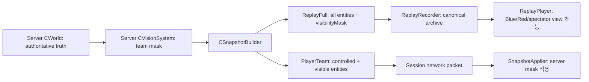

Session - 서버 권위 팀 시야로 수신자별 Snapshot을 필터링하고 canonical full replay를 보존한다
좌표: 신규 좌표 후보 · 축: C7 권위와 정합성 · C8 검증이 병목
관련: .md/plan/sim/10_v2_M3_DELTA_AOI_VISION.md · .md/TODO/05-13/05_FOG_OF_WAR_VISION_REVEAL_PLAN.md

# 1. 결정 기록

① 문제·제약: Release의 render/FX/minimap만 로컬 `VisibilityComponent`를 보지만 Snapshot과 Event는 전량 전송된다. 기존 replay 실측은 Snapshot 평균 10.8~15.4 KB, 평균 9.8~13.8 datagram/틱이다.
② 추진·대안·실패: replay 자체를 팀 시야로 자르면 보이지 않던 서버 진실을 영구 소실하고, render-only는 클라이언트 메모리의 적 좌표를 남긴다. 둘 다 목표가 아니다.
③ 메커니즘: 서버 `CVisionSystem`이 팀 mask를 만들고, 동일 틱을 `ReplayFull`로 먼저 기록한 뒤 `PlayerTeam` view로 세션별 직렬화한다. 현재 `Phase_BroadcastSnapshot`의 2개 Build 경계를 그대로 쓴다.
④ 대조·검증 사례: 현재 replay Build는 `yourNetId=0`, 세션 Build는 제어 NetId/ACK를 각각 받는다. 이 분리를 유지하면 full replay와 제한된 network view를 동시에 만족한다.
⑤ 확장성: Snapshot은 `ReplayFull/PlayerTeam` audience 계약으로 닫고, spectator/team perspective와 Event side-channel 필터는 다음 계약으로 확장한다. Event 전량 방송이 남는 동안 “정보 누수 0” 주장은 금지한다.

## 현재 코드 판정

| 경로 | 현재 상태 | 이번 계획의 판정 |
|---|---|---|
| Client render/FX/minimap | `VisibilityComponent.teamVisibilityMask`로 필터. 단, 기본 Debug는 의도적으로 전부 표시 | Release 동작은 맞지만 서버 권위가 아님 |
| Client network/replay | `CVisionSystem`이 둘 다 다시 시야를 계산 | 서버 mask 수신 후 재계산 금지, FoW texture만 소비 |
| Server visibility | `BuildServerVisibleToAll()`로 Blue/Red 비트를 모두 설정, 서버 `CVisionSystem` 없음 | Snapshot 필터보다 먼저 서버 시야 producer가 필요 |
| Server Snapshot | 모든 net-mapped `TransformComponent`를 정렬 후 전량 직렬화 | `SnapshotBuildView`로 포함 집합을 먼저 확정 |
| Server replay | 세션 loop 전에 별도 full Snapshot을 기록 | 이 경계를 보존하는 것이 정답 |
| Client full snapshot apply | 누락된 기존 엔티티를 제거하고 재등장 시 복원 | 시야 이탈/진입 semantics에 사용, pop/interpolation 회귀 검증 필요 |
| Event | 모든 세션에 동일 payload 방송 | 이번 Snapshot 슬라이스 밖이지만 보안 완료 전 필수 후속 |

## 소유권과 데이터 흐름



- Shared/GameSim과 Engine은 시야 계산 primitive/component를 소유한다. 제품별 수신자, 세션, replay 정책은 Server가 소유한다.
- Client는 Snapshot/Event를 진실로 소비하고 렌더링·보간·FoW 표시만 담당한다. 네트워크/리플레이 모드에서 팀 mask를 다시 판정하지 않는다.
- canonical replay는 관전자 데이터베이스다. 플레이어에게 실제로 보낼 packet을 그대로 녹화하는 파일이 아니다.

# 2. 반영해야 하는 코드

## 2-1. C:/Users/user/Desktop/Winters/Shared/Schemas/Snapshot.fbs

기존 코드:

```text
    projectileTraveledDist:float;
    championDefinitionKey:uint;
}
```

아래로 교체:

```text
    projectileTraveledDist:float;
    championDefinitionKey:uint;
    visibilityMask:ubyte;
}
```

`EntitySnapshot`의 마지막 필드에만 append한다. 기존 replay/schema 호환성을 깨는 중간 삽입·필드 재정렬은 하지 않는다.

기존 코드:

```text
    simPaused:bool = false;
    simSpeedMul:float = 1.0;
    gameplayStates:[GameplayStateSnapshot];
}
```

아래로 교체:

```text
    simPaused:bool = false;
    simSpeedMul:float = 1.0;
    gameplayStates:[GameplayStateSnapshot];
    visibilityContractVersion:ubyte = 0;
}
```

`0`은 구 replay의 visibility mask 부재, `1`은 server-authoritative mask 존재를 뜻한다. replay file format 자체는 v2를 유지하고 Snapshot payload 안에서 semantics를 구분한다.

## 2-2. C:/Users/user/Desktop/Winters/Server/Public/Game/SnapshotBuilder.h

기존 코드:

```cpp
class CWorld;

class CSnapshotBuilder final
```

아래로 교체:

```cpp
class CWorld;

enum class eSnapshotAudience : u8_t
{
    ReplayFull = 0u,
    PlayerTeam = 1u,
};

struct SnapshotBuildView
{
    eSnapshotAudience eAudience = eSnapshotAudience::ReplayFull;
    u8_t iRecipientTeam = 0xFFu;
    bool_t bIncludePrivilegedDebug = true;

    static SnapshotBuildView ReplayFull()
    {
        return {};
    }

    static SnapshotBuildView PlayerTeam(u8_t iTeam)
    {
        SnapshotBuildView View{};
        View.eAudience = eSnapshotAudience::PlayerTeam;
        View.iRecipientTeam = iTeam;
        View.bIncludePrivilegedDebug = false;
        return View;
    }
};

class CSnapshotBuilder final
```

기존 코드:

```cpp
        u64_t toolRevision,
        bool_t simPaused,
        f32_t simSpeedMul);
```

아래로 교체:

```cpp
        u64_t toolRevision,
        bool_t simPaused,
        f32_t simSpeedMul,
        const SnapshotBuildView& View);
```

## 2-3. C:/Users/user/Desktop/Winters/Server/Private/Game/SnapshotBuilder.cpp

기존 코드:

```cpp
#include <algorithm>
#include <cstdio>
#include <vector>
```

아래로 교체:

```cpp
#include <algorithm>
#include <cstdio>
#include <unordered_set>
#include <vector>
```

기존 코드:

```cpp
    bool_t IsMoveLockedBySnapshotAction(CWorld& world, EntityID entity, u64_t serverTick)
    {
        if (!world.HasComponent<ReplicatedActionComponent>(entity))
            return false;

        const auto& action = world.GetComponent<ReplicatedActionComponent>(entity);
        if (serverTick < action.startTick)
            return false;
        return action.movePolicy != eSkillActionMovePolicy::Allow &&
            serverTick < action.lockEndTick;
    }
```

아래에 추가:

```cpp
    bool_t ShouldIncludeSnapshotEntity(
        CWorld& world,
        EntityID entity,
        NetEntityId netId,
        NetEntityId controlledNetId,
        const SnapshotBuildView& View,
        u8_t& outVisibilityMask)
    {
        outVisibilityMask = world.HasComponent<VisibilityComponent>(entity)
            ? world.GetComponent<VisibilityComponent>(entity).teamVisibilityMask
            : 0u;

        if (View.eAudience == eSnapshotAudience::ReplayFull)
            return true;
        if (netId == controlledNetId)
            return true;
        if (View.iRecipientTeam >= 8u)
            return false;
        if (!world.HasComponent<VisibilityComponent>(entity))
            return false;

        const u8_t teamBit = static_cast<u8_t>(1u << View.iRecipientTeam);
        return (outVisibilityMask & teamBit) != 0u;
    }
```

기존 코드:

```cpp
    u64_t toolRevision,
    bool_t simPaused,
    f32_t simSpeedMul)
```

아래로 교체:

```cpp
    u64_t toolRevision,
    bool_t simPaused,
    f32_t simSpeedMul,
    const SnapshotBuildView& View)
```

기존 코드:

```cpp
    struct SnapshotEntity
    {
        NetEntityId netId = NULL_NET_ENTITY;
        EntityID entity = NULL_ENTITY;
    };

    std::vector<SnapshotEntity> sorted;
    sorted.reserve(entities.size());
    for (EntityID entity : entities)
    {
        const NetEntityId netId = entityMap.ToNet(entity);
        if (netId != NULL_NET_ENTITY)
            sorted.push_back({ netId, entity });
    }
```

아래로 교체:

```cpp
    struct SnapshotEntity
    {
        NetEntityId netId = NULL_NET_ENTITY;
        EntityID entity = NULL_ENTITY;
        u8_t visibilityMask = 0u;
    };

    std::vector<SnapshotEntity> sorted;
    sorted.reserve(entities.size());
    for (EntityID entity : entities)
    {
        const NetEntityId netId = entityMap.ToNet(entity);
        if (netId == NULL_NET_ENTITY)
            continue;

        u8_t visibilityMask = 0u;
        if (!ShouldIncludeSnapshotEntity(
            world,
            entity,
            netId,
            yourNetId,
            View,
            visibilityMask))
        {
            continue;
        }

        sorted.push_back({ netId, entity, visibilityMask });
    }
```

기존 코드:

```cpp
    std::vector<flatbuffers::Offset<Shared::Schema::EntitySnapshot>> snapshots;
    snapshots.reserve(sorted.size());
```

아래에 추가:

```cpp
    std::unordered_set<NetEntityId> includedNetIds;
    includedNetIds.reserve(sorted.size());
    for (const SnapshotEntity& item : sorted)
        includedNetIds.emplace(item.netId);

    const auto SanitizeNetReference =
        [&](NetEntityId netId)
        {
            if (View.eAudience == eSnapshotAudience::ReplayFull ||
                netId == NULL_NET_ENTITY ||
                includedNetIds.find(netId) != includedNetIds.end())
            {
                return netId;
            }
            return NULL_NET_ENTITY;
        };
```

기존 코드:

```cpp
        if (world.HasComponent<ChampionAIComponent>(entity))
        {
            const auto& ai = world.GetComponent<ChampionAIComponent>(entity);
            stateFlags |= kChampionAIDebugPresentFlag;
```

아래로 교체:

```cpp
        if (View.bIncludePrivilegedDebug &&
            world.HasComponent<ChampionAIComponent>(entity))
        {
            const auto& ai = world.GetComponent<ChampionAIComponent>(entity);
            stateFlags |= kChampionAIDebugPresentFlag;
```

기존 코드:

```cpp
        std::vector<flatbuffers::Offset<Shared::Schema::AIDebugTraceRow>> aiDebugTraceRows;
        if (world.HasComponent<ChampionAIComponent>(entity))
        {
            const auto& ai = world.GetComponent<ChampionAIComponent>(entity);
```

아래로 교체:

```cpp
        std::vector<flatbuffers::Offset<Shared::Schema::AIDebugTraceRow>> aiDebugTraceRows;
        if (View.bIncludePrivilegedDebug &&
            world.HasComponent<ChampionAIComponent>(entity))
        {
            const auto& ai = world.GetComponent<ChampionAIComponent>(entity);
```

기존 코드:

```cpp
        // Pack the per-entity gameplay and UI fields into the FlatBuffer entity row.
        snapshots.push_back(Shared::Schema::CreateEntitySnapshot(
```

아래로 교체:

```cpp
        ownerNet = SanitizeNetReference(ownerNet);
        projectileOwnerNet = SanitizeNetReference(projectileOwnerNet);
        projectileTargetNet = SanitizeNetReference(projectileTargetNet);
        aiDebugTargetNet = SanitizeNetReference(aiDebugTargetNet);
        aiDebugLowHpEnemyNet = SanitizeNetReference(aiDebugLowHpEnemyNet);
        aiDebugDiveTargetNet = SanitizeNetReference(aiDebugDiveTargetNet);
        aiDebugLastCommandTargetNet =
            SanitizeNetReference(aiDebugLastCommandTargetNet);

        // Pack the per-entity gameplay and UI fields into the FlatBuffer entity row.
        snapshots.push_back(Shared::Schema::CreateEntitySnapshot(
```

기존 코드:

```cpp
            projectileDirection.z,
            projectileTraveledDist,
            ResolveSnapshotChampionDefinitionKey(championId)));
```

아래로 교체:

```cpp
            projectileDirection.z,
            projectileTraveledDist,
            ResolveSnapshotChampionDefinitionKey(championId),
            item.visibilityMask));
```

기존 코드:

```cpp
    gameplayStates.reserve(gameplayStateRows.size());
    for (const GameplayStateRow& row : gameplayStateRows)
    {
        gameplayStates.push_back(Shared::Schema::CreateGameplayStateSnapshot(
```

아래로 교체:

```cpp
    gameplayStates.reserve(gameplayStateRows.size());
    for (const GameplayStateRow& row : gameplayStateRows)
    {
        const bool_t bSourceIncluded =
            row.sourceNet == NULL_NET_ENTITY ||
            includedNetIds.find(row.sourceNet) != includedNetIds.end();
        const bool_t bTargetIncluded =
            row.targetNet == NULL_NET_ENTITY ||
            includedNetIds.find(row.targetNet) != includedNetIds.end();
        if (View.eAudience == eSnapshotAudience::PlayerTeam &&
            (!bSourceIncluded || !bTargetIncluded))
        {
            continue;
        }

        gameplayStates.push_back(Shared::Schema::CreateGameplayStateSnapshot(
```

기존 코드:

```cpp
        simPaused,
        simSpeedMul,
        gameplayStatesOffset);
```

아래로 교체:

```cpp
        simPaused,
        simSpeedMul,
        gameplayStatesOffset,
        1u);
```

위 마지막 인자는 `visibilityContractVersion=1`이다. 정확한 생성 함수 시그니처는 `Snapshot.fbs` codegen 뒤 일치 여부를 확인한다.

하나라도 원본 참조가 남으면 entity row를 숨겨도 식별자가 새므로, buffer parser의 `hidden_reference_leaks=0`을 Snapshot 완료 게이트로 쓴다.

## 2-4. C:/Users/user/Desktop/Winters/Server/Public/Game/GameRoom.h

기존 코드:

```cpp
namespace Engine
{
    class CSpatialHashSystem;
    class CMapSurfaceSampler;
    class CNavGrid;
}
```

아래로 교체:

```cpp
class CConcealmentVolumeIndex;

namespace Engine
{
    class CSpatialHashSystem;
    class CVisionSystem;
    class CMapSurfaceSampler;
    class CNavGrid;
}
```

기존 코드:

```cpp
    void Phase_ServerMinionDepenetration(TickContext& tc);
    void Phase_ServerProjectiles(TickContext& tc);
    void Phase_ServerDeathAndRespawn(TickContext& tc);
```

아래로 교체:

```cpp
    void Phase_ServerMinionDepenetration(TickContext& tc);
    void Phase_ServerProjectiles(TickContext& tc);
    void Phase_ServerVisibility(TickContext& tc);
    void Phase_ServerDeathAndRespawn(TickContext& tc);
```

기존 코드:

```cpp
    std::unique_ptr<Engine::CSpatialHashSystem> m_pSpatialSystem;
    std::unique_ptr<GameplayTurret::CTurretAISystem> m_pTurretAI;
```

아래로 교체:

```cpp
    std::unique_ptr<Engine::CSpatialHashSystem> m_pSpatialSystem;
    std::unique_ptr<CConcealmentVolumeIndex> m_pConcealmentIndex;
    std::unique_ptr<Engine::CVisionSystem> m_pVisionSystem;
    std::unique_ptr<GameplayTurret::CTurretAISystem> m_pTurretAI;
```

## 2-5. C:/Users/user/Desktop/Winters/Server/Private/Game/GameRoom.cpp

기존 코드:

```cpp
#include "ECS/SpatialIndex.h"
#include "ECS/Systems/SpatialHashSystem.h"
#include "Shared/GameSim/Systems/Turret/TurretAISystem.h"
```

아래로 교체:

```cpp
#include "ECS/ConcealmentVolumeIndex.h"
#include "ECS/SpatialIndex.h"
#include "ECS/Systems/SpatialHashSystem.h"
#include "ECS/Systems/VisionSystem.h"
#include "Shared/GameSim/Systems/Turret/TurretAISystem.h"
```

기존 코드:

```cpp
    m_pSpatialSystem = Engine::CSpatialHashSystem::Create();
    m_pTurretAI = GameplayTurret::CTurretAISystem::Create();
```

아래로 교체:

```cpp
    m_pSpatialSystem = Engine::CSpatialHashSystem::Create();
    m_pConcealmentIndex = std::make_unique<CConcealmentVolumeIndex>();
    m_pVisionSystem = Engine::CVisionSystem::Create(
        m_world.Get_SpatialIndex(),
        m_pConcealmentIndex.get());
    m_pTurretAI = GameplayTurret::CTurretAISystem::Create();
```

동일한 `m_pSpatialSystem`/`m_pTurretAI` 재생성 블록이 `ResetMatchStateLocked()`에도 있으므로 위 4줄 블록으로 함께 교체한다. reset 뒤 VisionSystem이 이전 `CWorld`의 spatial pointer를 잡고 있으면 use-after-reset이므로 필수다.

## 2-6. C:/Users/user/Desktop/Winters/Server/Private/Game/GameRoomSpawn.cpp

기존 코드:

```cpp
#include "ECS/Components/VisionComponents.h"
#include "ECS/SpatialIndex.h"
```

아래로 교체:

```cpp
#include "ECS/Components/VisionComponents.h"
#include "ECS/ConcealmentVolumeIndex.h"
#include "ECS/SpatialIndex.h"
```

기존 코드:

```cpp
    if (bLoadedStage)
    {
        CacheServerMinionWaypoints(stage);
        InitializeServerWalkableGrid(&stage, stagePath.c_str());
```

아래로 교체:

```cpp
    if (bLoadedStage)
    {
        if (m_pConcealmentIndex)
        {
            m_pConcealmentIndex->Clear();
            for (const Winters::Map::BushEntry& bush : stage.bushes)
            {
                if (bush.bVisible == 0u || bush.radius <= 0.f)
                    continue;

                const EntityID bushEntity = m_world.CreateEntity();
                ConcealmentVolumeComponent volume{};
                volume.center = { bush.px, bush.py, bush.pz };
                volume.radius = bush.radius;
                volume.volumeId = bush.bushId;
                m_world.AddComponent<ConcealmentVolumeComponent>(
                    bushEntity,
                    volume);
            }
            m_pConcealmentIndex->Build(m_world);
        }

        CacheServerMinionWaypoints(stage);
        InitializeServerWalkableGrid(&stage, stagePath.c_str());
```

기존 코드:

```cpp
    else
    {
        OutputServerAITrace("[GameRoom] Stage1.dat not found for server sim; using fallback objects\n");
        InitializeServerWalkableGrid(nullptr, nullptr);
    }
```

아래로 교체:

```cpp
    else
    {
        if (m_pConcealmentIndex)
            m_pConcealmentIndex->Clear();
        OutputServerAITrace("[GameRoom] Stage1.dat not found for server sim; using fallback objects\n");
        InitializeServerWalkableGrid(nullptr, nullptr);
    }
```

부시 entity는 server-only이며 `EntityIdMap`에 bind하지 않는다. 따라서 canonical replay에 별도 entity row를 만들지 않고 시야 mask 계산에만 참여한다.

## 2-7. C:/Users/user/Desktop/Winters/Server/Private/Game/GameRoomProjectiles.cpp

기존 코드:

```cpp
namespace
{
    void LogSkillProjectileEvent(
```

아래로 교체:

```cpp
namespace
{
    void EnsureServerProjectileVisibilityRuntime(
        CWorld& world,
        EntityID entity,
        u8_t sourceTeam,
        f32_t radius)
    {
        if (!world.HasComponent<SpatialAgentComponent>(entity))
        {
            SpatialAgentComponent spatial{};
            spatial.kind = eSpatialKind::Projectile;
            spatial.team = sourceTeam;
            spatial.radius = (std::max)(radius, 0.05f);
            world.AddComponent<SpatialAgentComponent>(entity, spatial);
        }

        if (!world.HasComponent<VisibilityComponent>(entity))
        {
            world.AddComponent<VisibilityComponent>(
                entity,
                VisibilityComponent{});
        }
        VisibilityComponent& visibility =
            world.GetComponent<VisibilityComponent>(entity);
        if (sourceTeam < 8u)
        {
            visibility.teamVisibilityMask |=
                static_cast<u8_t>(1u << sourceTeam);
        }

    }

    void LogSkillProjectileEvent(
```

기존 코드:

```cpp
        auto& projectile = m_world.GetComponent<StructureProjectileComponent>(entity);
        auto& transform = m_world.GetComponent<TransformComponent>(entity);
        const Vec3 pos = projectile.currentPos;
```

아래로 교체:

```cpp
        auto& projectile = m_world.GetComponent<StructureProjectileComponent>(entity);
        auto& transform = m_world.GetComponent<TransformComponent>(entity);
        const u8_t projectileTeam =
            m_world.HasComponent<SpatialAgentComponent>(entity)
                ? m_world.GetComponent<SpatialAgentComponent>(entity).team
                : 0xFFu;
        EnsureServerProjectileVisibilityRuntime(
            m_world,
            entity,
            projectileTeam,
            projectile.hitRadius);
        const Vec3 pos = projectile.currentPos;
```

기존 코드:

```cpp
        auto& projectile = m_world.GetComponent<SkillProjectileComponent>(entity);
        auto& transform = m_world.GetComponent<TransformComponent>(entity);
        auto EnqueueProjectileContact =
```

아래로 교체:

```cpp
        auto& projectile = m_world.GetComponent<SkillProjectileComponent>(entity);
        auto& transform = m_world.GetComponent<TransformComponent>(entity);
        EnsureServerProjectileVisibilityRuntime(
            m_world,
            entity,
            static_cast<u8_t>(projectile.sourceTeam),
            projectile.hitRadius);
        auto EnqueueProjectileContact =
```

새 projectile는 생성 틱에 source team bit를 seed하고, centralized projectile phase에서 누락된 spatial/visibility runtime을 보완한다. 같은 틱의 최종 visibility phase가 다시 spatial index와 mask를 만들므로 projectile용 별도 시야 경로는 추가하지 않는다.

## 2-8. C:/Users/user/Desktop/Winters/Shared/GameSim/Champions/Viego/ViegoGameSim.cpp

기존 코드:

```cpp
#include "Shared/GameSim/Replication/EntityIdMap.h"
#include "Shared/GameSim/Core/Ecs/SpatialAgentComponent.h"
```

아래로 교체:

```cpp
#include "Shared/GameSim/Replication/EntityIdMap.h"
#include "Shared/GameSim/Core/Ecs/SpatialAgentComponent.h"
#include "Shared/GameSim/Core/Ecs/VisionComponents.h"
```

기존 코드:

```cpp
        spatial.radius = championDef->passiveSoul.radius;
        world.AddComponent<SpatialAgentComponent>(soulEntity, spatial);

        world.AddComponent<TargetableTag>(soulEntity);
```

아래로 교체:

```cpp
        spatial.radius = championDef->passiveSoul.radius;
        world.AddComponent<SpatialAgentComponent>(soulEntity, spatial);
        world.AddComponent<VisibilityComponent>(
            soulEntity,
            VisibilityComponent{});

        world.AddComponent<TargetableTag>(soulEntity);
```

현재 net-mapped non-projectile 중 `VisibilityComponent`가 없는 실체는 Viego soul 1종이다. 기존 `SpatialAgentComponent.team=dead.team` 정책을 유지하고 일반 team vision으로 판정한다. soul을 전역 공개할 게임 규칙이 생기면 Snapshot 예외가 아니라 명시적 visibility policy component로 확장한다.

## 2-9. C:/Users/user/Desktop/Winters/Server/Private/Game/GameRoomTick.cpp

기존 코드:

```cpp
#include "ECS/Components/VisionComponents.h"

#include <chrono>
```

아래로 교체:

```cpp
#include "ECS/Components/VisionComponents.h"
#include "ECS/Systems/SpatialHashSystem.h"
#include "ECS/Systems/VisionSystem.h"

#include <chrono>
```

기존 코드:

```cpp
	CDeathSystem::Execute(m_world, tc);
	Phase_ServerDeathAndRespawn(tc);
}
```

아래로 교체:

```cpp
	CDeathSystem::Execute(m_world, tc);
	Phase_ServerDeathAndRespawn(tc);
	Phase_ServerVisibility(tc);
}

void CGameRoom::Phase_ServerVisibility(TickContext& tc)
{
	if (m_pSpatialSystem)
		m_pSpatialSystem->Execute(m_world, tc.fDt);
	if (m_pVisionSystem)
	{
		m_pVisionSystem->ForceRebuildNextFrame();
		m_pVisionSystem->Execute(m_world, tc.fDt);
	}
}
```

Turret/projectile collision용 기존 spatial refresh는 유지하고, snapshot 직전 최종 transform·spawn·death·respawn을 반영하기 위해 같은 `CSpatialHashSystem`을 한 번 더 실행한다. 새 index/system owner를 만들지는 않으며, 30 Hz 강제 Vision 비용은 §3의 `Vision::Execute`/tick budget으로 판정한다.

## 2-10. C:/Users/user/Desktop/Winters/Server/Private/Game/GameRoomReplication.cpp

기존 코드:

```cpp
#include "Network/ServerSessionHub.h"

#include <Windows.h>
```

아래로 교체:

```cpp
#include "Network/ServerSessionHub.h"

#include "ECS/Components/SpatialAgentComponent.h"

#include <Windows.h>
```

기존 코드:

```cpp
            m_toolRevision,
            m_bSimPaused,
            m_simSpeedMul.load(std::memory_order_relaxed));
```

아래로 교체:

```cpp
            m_toolRevision,
            m_bSimPaused,
            m_simSpeedMul.load(std::memory_order_relaxed),
            SnapshotBuildView::ReplayFull());
```

위 교체는 `RecordSnapshot` 직전의 replay Build에만 적용한다.

기존 코드:

```cpp
        const u32_t lastSimCommandSeq =
            (ackIt != m_lastSimCommandSeqBySession.end()) ? ackIt->second : 0u;

        auto snapshot = m_pSnapBuilder->Build(
```

아래로 교체:

```cpp
        const u32_t lastSimCommandSeq =
            (ackIt != m_lastSimCommandSeqBySession.end()) ? ackIt->second : 0u;

        if (!m_world.HasComponent<SpatialAgentComponent>(controlledEntity))
            continue;
        const u8_t recipientTeam =
            m_world.GetComponent<SpatialAgentComponent>(controlledEntity).team;

        auto snapshot = m_pSnapBuilder->Build(
```

기존 코드:

```cpp
            m_toolRevision,
            m_bSimPaused,
            m_simSpeedMul.load(std::memory_order_relaxed));

        CServerSessionHub::Instance().SendFrame(
```

아래로 교체:

```cpp
            m_toolRevision,
            m_bSimPaused,
            m_simSpeedMul.load(std::memory_order_relaxed),
            SnapshotBuildView::PlayerTeam(recipientTeam));

        CServerSessionHub::Instance().SendFrame(
```

`ReplayFull()` 호출은 반드시 session loop 앞에 남긴다. 기록 순서를 세션별 filtered packet 뒤로 옮기거나 마지막 세션 buffer를 재사용하지 않는다.

## 2-11. C:/Users/user/Desktop/Winters/Engine/Public/ECS/Systems/VisionSystem.h

기존 코드:

```cpp
    void ForceRebuildNextFrame() { m_bForceRebuild = true; }
    void SetFowProjection(const FowProjection& Projection);
```

아래로 교체:

```cpp
    void ForceRebuildNextFrame() { m_bForceRebuild = true; }
    void SetComputesVisibility(bool_t bComputesVisibility)
    {
        m_bComputesVisibility = bComputesVisibility;
        m_bForceRebuild = true;
    }
    void SetFowProjection(const FowProjection& Projection);
```

기존 코드:

```cpp
    f32_t m_fAccumDt = 0.f;
    bool_t m_bForceRebuild = true;
    bool_t m_bFowTextureDirty = false;
```

아래로 교체:

```cpp
    f32_t m_fAccumDt = 0.f;
    bool_t m_bForceRebuild = true;
    bool_t m_bComputesVisibility = true;
    bool_t m_bFowTextureDirty = false;
```

## 2-12. C:/Users/user/Desktop/Winters/Engine/Private/ECS/Systems/VisionSystem.cpp

기존 코드:

```cpp
    UpdateConcealmentOccupancy(world);
    TickVisibility(world);
    UpdateFowTexture(world);
```

아래로 교체:

```cpp
    if (m_bComputesVisibility)
    {
        UpdateConcealmentOccupancy(world);
        TickVisibility(world);
    }
    UpdateFowTexture(world);
```

이 switch는 generic Engine 기능이다. Server는 기본값 `true`, Client의 network/replay mode만 `false`로 설정한다.

## 2-13. C:/Users/user/Desktop/Winters/Client/Private/Scene/Scene_InGameLifecycle.cpp

기존 코드:

```cpp
        auto pVision = Engine::CVisionSystem::Create(m_World.Get_SpatialIndex(), &m_ConcealmentIndex);
        const UI::MinimapProjection& MinimapProjection = UI::GetDefaultMinimapProjection();
```

아래로 교체:

```cpp
        auto pVision = Engine::CVisionSystem::Create(m_World.Get_SpatialIndex(), &m_ConcealmentIndex);
        pVision->SetComputesVisibility(!m_bNetworkAuthoritativeGameplay);
        const UI::MinimapProjection& MinimapProjection = UI::GetDefaultMinimapProjection();
```

로컬 smoke는 기존 client vision을 유지하고, live network와 replay는 서버가 보낸 mask를 소비한다. FoW texture 갱신은 계속 실행한다.

## 2-14. C:/Users/user/Desktop/Winters/Client/Private/Network/Client/SnapshotApplier.cpp

기존 코드:

```cpp
        // Re-establish canonical membership even when an existing local
        // binding is reused across a timeline rebase.
        m_seenNetIds.insert(es->netId());

        if (world.HasComponent<TransformComponent>(e))
```

아래로 교체:

```cpp
        // Re-establish canonical membership even when an existing local
        // binding is reused across a timeline rebase.
        m_seenNetIds.insert(es->netId());

        VisibilityComponent& visibility =
            world.HasComponent<VisibilityComponent>(e)
                ? world.GetComponent<VisibilityComponent>(e)
                : world.AddComponent<VisibilityComponent>(
                    e,
                    VisibilityComponent{});
        visibility.teamVisibilityMask =
            snapshot->visibilityContractVersion() >= 1u
                ? es->visibilityMask()
                : static_cast<u8_t>((1u << 0u) | (1u << 1u));

        if (world.HasComponent<TransformComponent>(e))
```

`CWorld::AddComponent<T>`는 `T&`를 반환하므로 위 분기는 기존 entity와 신규 entity를 같은 reference로 갱신한다. 구 replay는 contract version 기본값 0을 받아 양 팀 visible로 재생하여 종전 full-spectator 동작을 보존한다.

## 2-15. C:/Users/user/Desktop/Winters/Tools/Harness/GameRoomBotMatchSoak.cpp

확인 필요: `Snapshot_generated.h` 재생성 뒤 `CreateEntitySnapshot`/accessor 시그니처와 현재 dirty harness의 `CGameRoomIntegrationProbeAccess` 끝 앵커를 다시 읽고 아래 probe를 기존 class에 추가한다. 아직 생성되지 않은 accessor를 추정해 완성 코드처럼 박제하지 않는다.

- Blue source, Red target을 시야 밖/안/같은 부시 3상태로 배치한다.
- `m_pSpatialSystem`과 `m_pVisionSystem`을 실행한 뒤 `ReplayFull`, `PlayerTeam(Blue)`, `PlayerTeam(Red)` buffer를 각각 검증한다.
- `flatbuffers::Verifier` 통과, full의 양 팀 entity 존재, Blue packet의 hidden Red 부재, controlled entity 항상 존재, visibility mask 일치, AI debug flag/trace 0, GameplayState hidden reference 0건을 assert한다.
- 결과 한 줄은 `VISIBILITY_SNAPSHOT_PROBE full_entities=... blue_entities=... red_entities=... full_bytes=... blue_bytes=... red_bytes=... hidden_reference_leaks=0` 형식으로 고정한다.

# 3. 검증

## 예측

- Debug probe에서도 player-team Snapshot byte 안에는 시야 밖 적 entity가 없어야 한다. Debug render의 전체 표시 bypass와 network payload 보안은 별개다.
- Release 실제 클라이언트에서는 적이 시야를 벗어난 다음 full snapshot 1회 안에 local entity map에서 제거되고, 재진입 시 새 snapshot row로 복원된다.
- canonical replay의 entity 수는 동일 틱 server net-mapped entity 수와 같아야 하며 Blue packet 수보다 크거나 같아야 한다. replay file의 full truth는 줄어들지 않는다.
- `visibilityMask` 1 byte append 때문에 full replay Snapshot 크기는 기존 대비 소폭 증가한다. player packet은 5v5 시야 분리 장면에서 평균 bytes와 datagram이 기존 full 대비 25% 이상 감소하는 것을 목표로 한다.
- 33.33 ms server tick 예산에서 `Vision::Execute` p95 0.50 ms 이하, 10세션 `Phase_BroadcastSnapshot` aggregate p95 4.00 ms 이하를 목표로 한다. 수치가 넘으면 필터를 풀지 않고 per-team buffer 2개 재사용 가능성을 다음 최적화 슬라이스로 측정한다.
- 숨은 적을 참조하는 AI debug, projectile owner/target, GameplayState row가 player-team buffer에 0건이어야 한다.
- Event payload는 여전히 전량 방송이므로 projectile/effect 위치의 side-channel은 남는다. 이 계획 완료 문구는 “시야 기반 Snapshot 필터링 구현”까지이며 “시야 기반 복제 전체 완료”가 아니다.

## 검증 명령

```powershell
git diff --check

powershell -NoProfile -ExecutionPolicy Bypass -File Tools/Harness/Check-SharedBoundary.ps1

& 'C:/Program Files/Microsoft Visual Studio/2022/Community/MSBuild/Current/Bin/MSBuild.exe' Engine/Include/Engine.vcxproj /t:Build /p:Configuration=Debug /p:Platform=x64 /m:1 /nr:false /v:minimal
& .\UpdateLib.bat
& 'C:/Program Files/Microsoft Visual Studio/2022/Community/MSBuild/Current/Bin/MSBuild.exe' Server/Include/Server.vcxproj /t:Build /p:Configuration=Debug /p:Platform=x64 /m:1 /nr:false /v:minimal
& 'C:/Program Files/Microsoft Visual Studio/2022/Community/MSBuild/Current/Bin/MSBuild.exe' Client/Include/Client.vcxproj /t:Build /p:Configuration=Debug /p:Platform=x64 /m:1 /nr:false /v:minimal

powershell -NoProfile -ExecutionPolicy Bypass -File Tools/Harness/RunGameRoomBotMatchSoak.ps1 -TickCount 1800 -Seed 42 -Runs 3 -Configuration Debug

& 'C:/Program Files/Microsoft Visual Studio/2022/Community/MSBuild/Current/Bin/MSBuild.exe' Server/Include/Server.vcxproj /t:Build /p:Configuration=Release /p:Platform=x64 /m:1 /nr:false /v:minimal
& 'C:/Program Files/Microsoft Visual Studio/2022/Community/MSBuild/Current/Bin/MSBuild.exe' Client/Include/Client.vcxproj /t:Build /p:Configuration=Release /p:Platform=x64 /m:1 /nr:false /v:minimal

$replays = Get-ChildItem -LiteralPath Replay -Filter '*.wrpl' | Select-Object -ExpandProperty FullName
python Tools/Harness/MeasureReplayNetworkPayload.py @replays --json-output .md/build/2026-07-17_VISIBILITY_FULL_REPLAY_PAYLOAD_MEASUREMENT.json
```

`/m:1`은 FlatBuffers codegen의 병렬 출력 충돌을 피하기 위해 고정한다. Engine public header 변경 뒤 `UpdateLib.bat`을 실행해 `EngineSDK/inc`를 동기화하되, mirror 파일을 손으로 수정하지 않는다.

## 수동·육안 검증 행렬

| 빌드/경로 | 장면 | 기대 결과 |
|---|---|---|
| Debug probe | Blue/Red가 시야 밖 | packet parser에서 상대 entity 0, render bypass 여부와 무관 |
| Release live | 적이 사거리 밖→안→밖 | 등장→유지→제거, 마지막 숨은 위치에 잔상/HP bar/미니맵 점 없음 |
| Release bush | 서로 다른 부시/같은 부시/true sight | mask와 렌더가 서버 판정과 일치 |
| Release replay | full replay를 Blue 기준 재생 | 파일에는 양 팀이 있고 화면에는 Blue 시야만 표시 |
| Debug replay | 동일 파일 재생 | debug bypass로 전부 보일 수 있으나 Snapshot mask 값은 보존 |
| Soak 3회 | 1,800 tick, seed 42 | determinism/finite/entity map/replay health 전부 PASS |

## 미검증

- 이 문서는 현재 코드 판정과 구현 순서를 고정한 계획서이며 코드 반영·빌드·실행 수치는 아직 없다.
- 기존 `.wrpl`은 `visibilityContractVersion=0`으로 읽고 양 팀 visible fallback을 적용해야 한다. 실제 ReplayPlayer 구버전 호환 표시는 아직 실행하지 않았다.
- full snapshot에서 누락 entity를 즉시 destroy하는 현재 Client 정책이 재등장 interpolation/FX one-shot에 만드는 pop과 중복 cue는 아직 실측하지 않았다.
- server vision 10 Hz와 snapshot 30 Hz 사이 최대 100 ms 가시성 지연, projectile first-frame 누락은 아직 실측하지 않았다.
- Event, command acknowledgement, damage/FX cue의 숨은 source/target side-channel은 이 계획에서 닫지 않는다.

## 확인 필요

- `Snapshot_generated.h` codegen 뒤 생성된 C++/Go 산출물이 append-only schema와 일치하는지 확인한다.
- `CreateSnapshot(..., gameplayStatesOffset, 1u)`가 생성 signature와 일치하고 구 replay default가 0인지 확인한다.
- `SnapshotBuilder.cpp`의 owner/projectile/AI target reference 전부에 `SanitizeNetReference`가 적용됐는지 buffer parser로 확인한다.
- 새 source 파일은 없으므로 `.vcxproj/.filters` 등록 변경은 없어야 한다. 생기면 스코프 이탈로 판정한다.
- Engine public header 변경 후 `UpdateLib.bat` 동기화와 dirty Claude scheduler 변경 보존을 함께 확인한다.

# 4. 단계·예산·중단 조건

## Floor 70%

1. 서버 Vision producer와 server bush concealment를 연결한다.
2. Snapshot audience 계약, visibility mask, hidden reference sanitization을 연결한다.
3. replay full/세션 filtered 분기를 고정하고 Client 재계산을 끈다.
4. Debug probe, Debug/Release build, 1,800 tick × 3 soak, Release 육안 장면을 통과시킨다.

## Ceiling 30% — 이해→환전

1. full/Blue/Red entity count·bytes·datagram 비교를 JSON과 `_RESULT`에 박제한다.
2. Release capture에서 “서버에는 존재하지만 플레이어 packet에는 없음”을 packet row와 화면 한 장으로 연결한다.
3. 이력서에는 수치가 나온 뒤에만 “server-authoritative visibility replication”을 적고, full replay 보존·per-recipient filtering·payload 감소율을 한 문장으로 묶는다.

## 중단 조건

- server mask가 실제로 Blue/Red를 분리하지 못하면 SnapshotBuilder를 더 손대지 않고 Vision producer부터 되돌아간다.
- canonical replay의 full entity count가 감소하면 즉시 실패다. network byte 감소보다 replay truth 보존이 우선이다.
- player packet에서 hidden position/target/AI trace가 1건이라도 발견되면 “Snapshot 필터 완료”로 닫지 않는다.
- 10세션 `Phase_BroadcastSnapshot` p95가 4.00 ms를 넘으면 per-session Build를 유지한 채 수치와 병목을 기록하고, 다음 슬라이스에서 Blue/Red buffer 공유를 설계한다.

# 5. 완료 정의와 후속 경계

이 계획의 완료 문구는 다음 네 조건을 모두 만족할 때만 현재형으로 바꾼다.

1. 서버가 Blue/Red visibility mask를 실제로 계산한다.
2. 플레이어 Snapshot에는 controlled entity와 그 팀에 보이는 entity만 존재한다.
3. canonical replay에는 같은 틱의 전체 entity와 각 entity의 visibility mask가 존재한다.
4. Debug probe·Debug/Release build·soak·Release 육안 검증이 모두 green이다.

후속 슬라이스는 `BroadcastEventPayload`의 Event audience filtering이다. 그것까지 끝나기 전에는 “maphack 방지 완료”, “시야 기반 네트워크 복제 100%”라고 쓰지 않는다. 구현 후에는 같은 이름의 `2026-07-17_SERVER_VISIBILITY_SNAPSHOT_FILTER_AND_FULL_REPLAY_RESULT.md`를 만들고, 예측/실측·판결·갱신을 기록한다.
