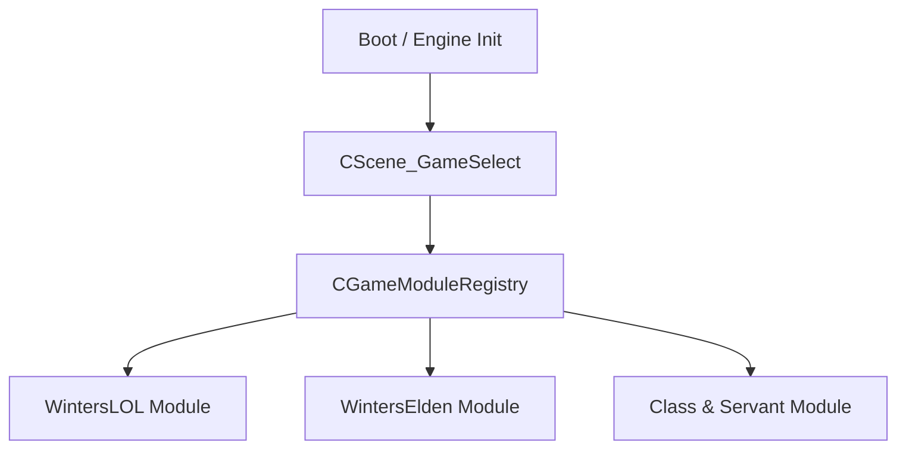
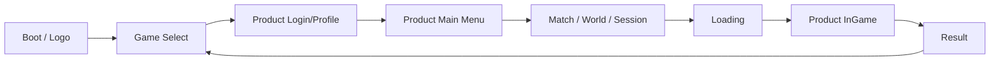
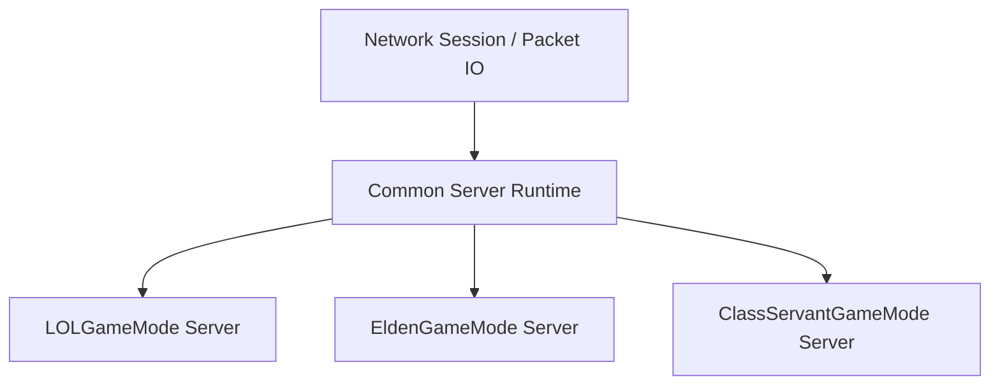

# 2026-05-04 Game Select Multi-Game Product Architecture

> ⚠️ **DEPRECATED 2026-05-04** — 통합본 [`WINTERS_MULTIGAME_ARCHITECTURE.md`](../../architecture/WINTERS_MULTIGAME_ARCHITECTURE.md) 로 대체. 본 문서의 §0~§12 모든 내용 + Vision v1 rev 2 의 Phase 시간표/디자인 후보/공유 매트릭스/PITFALLS GATE 가 통합본에 박제됨. 직접 참조 금지 — 통합본만 권위.

## 0. One-Line Direction

Winters Engine은 `WintersLOL`과 `WintersElden`을 한 클라이언트에서 선택 실행할 수 있는 멀티 게임 런타임으로 확장하고, 최종 제품은 두 게임의 장점을 융합한 `Class & Servant`로 수렴한다.

핵심은 Game Select Scene을 단순 메뉴가 아니라 `GameProductModule` 선택 지점으로 설계하는 것이다.

---

## 1. Current Codebase Reading

### 1.1 현재 시작 플로우

현재 클라이언트는 공통 부트 후 바로 LoL 플로우로 진입한다.

- `Client/Private/CGameApp.cpp`
  - `OnInit()`에서 `CStructure_Manager`, `CJungle_Manager`, `CMinion_Manager`를 초기화한다.
  - 이후 `CScene_Loading::Create(eSceneID::BanPick, [](){ return CScene_BanPick::Create(); })`로 바로 BanPick에 들어간다.

즉 지금은 `WintersLOL.exe`에 가까운 형태이며, `Winters Engine 멀티 게임 클라이언트` 구조는 아직 아니다.

### 1.2 현재 Scene 시스템

- `Engine/Include/IScene.h`
  - `OnEnter / OnExit / OnUpdate / OnLateUpdate / OnRender / OnImGui` 구조가 이미 있음.
- `Engine/Public/Scene/Scene_Manager.h`
  - `Change_Scene(uint32_t, unique_ptr<IScene>)` 지원.
  - 정적 씬 등록도 지원.
- `Client/Public/Defines.h`
  - `eSceneID`는 `MainMenu, BanPick, Shop, MatchLoading, InGame, Editor, Result, SceneLoading, End`.
  - `GameSelect`, `ProductMainMenu`, `EldenInGame`, `ClassServantInGame` 같은 제품 분기 ID가 없음.
- `Client/Private/Scene/Scene_Loading.cpp`
  - 다음 씬 factory를 받아 로딩 후 `Change_Scene` 하는 구조라 Game Select 도입에 바로 활용 가능.

결론: Scene Manager는 충분히 재사용 가능하다. 문제는 Scene ID와 시작 플로우가 LoL 전용으로 굳어져 있다는 점이다.

### 1.3 현재 백엔드/서버 구조

현재 Services는 이미 제품 공통으로 키울 수 있는 기반을 갖고 있다.

- `Services/cmd`
  - `auth`, `leaderboard`, `matchmaking`, `payment`, `profile`, `shop`
- `Services/internal`
  - 서비스별 도메인 로직
- `Services/pkg`
  - `auth`, `cache`, `config`, `database`, `errors`, `messaging`, `middleware`, `response`

현재 Server도 큰 축은 나뉘어 있다.

- `Server/Private/Game`
- `Server/Private/Network`
- `Server/Private/Security`

결론: Backend / Server / Security는 새로 갈아엎기보다 `product_id` 또는 `GameProductID`를 축으로 확장하는 것이 맞다.

---

## 2. Product Vision

### 2.1 세 제품 축

| Product | 목적 | 성격 |
|---|---|---|
| `WintersLOL` | MOBA 시스템 실전 검증 | 챔피언, 라인전, 미니언, 포탑, 정글, 매칭, 상점 |
| `WintersElden` | 액션 RPG 시스템 실전 검증 | 락온, 보스전, 스태미나, 회피, 패링, 월드/던전, 협동/침입 |
| `Class & Servant` | 최종 출시 목표 | MOBA 전략성 + 소울라이크 액션성 + 서번트/클래스 조합 |

`WintersLOL`과 `WintersElden`은 서로 다른 모작이 아니라 최종 제품의 양쪽 실험실이다.

### 2.2 최종 게임: Class & Servant

`Class & Servant`는 다음을 결합한다.

- LoL의 장점
  - 5v5 팀 전략
  - 라인/정글/오브젝트 운영
  - 챔피언별 스킬 정체성
  - 짧은 입력과 높은 판독성
  - 매치 기반 경쟁 구조
- Elden Ring의 장점
  - 정밀한 근접 액션
  - 보스전과 패턴 학습
  - 회피/패링/스태미나/경직
  - 장비와 빌드 커스터마이징
  - 월드 탐험과 던전 감각
- Winters 고유 목표
  - 플레이어는 `Class`, 동반/소환/전술 AI는 `Servant`
  - 전장은 MOBA처럼 운영되지만, 교전은 소울라이크처럼 깊다.
  - 서버 권위 + 고성능 ECS/Fiber/RenderGraph/GPU Driven 기반으로 대규모 PvPvE를 감당한다.

---

## 3. Game Select Scene의 역할

Game Select는 단순 버튼 3개짜리 메뉴가 아니다.



Game Select가 선택해야 하는 것은 다음이다.

- 어떤 콘텐츠 루트를 쓸 것인가
- 어떤 Scene Flow를 쓸 것인가
- 어떤 Client 게임 시스템을 등록할 것인가
- 어떤 Backend namespace를 쓸 것인가
- 어떤 Game Server target에 접속할 것인가
- 어떤 Security validator set을 쓸 것인가
- 어떤 에디터/튜닝 패널을 노출할 것인가

---

## 4. Core Abstractions

### 4.1 GameProductID

신규 공통 타입을 둔다.

```cpp
enum class eGameProduct : u32_t
{
    None = 0,
    WintersLOL,
    WintersElden,
    ClassServant,
};
```

위 타입은 Client, Server, Services, AntiCheat, Data pipeline이 모두 공유해야 한다.

### 4.2 GameLaunchConfig

Game Select에서 만든 선택 결과다.

```cpp
struct GameLaunchConfig
{
    eGameProduct eProduct = eGameProduct::None;
    wstring_t strContentRoot;
    wstring_t strServiceNamespace;
    wstring_t strServerEndpoint;
    bool_t bUseOnlineServices = false;
    bool_t bUseEditorTools = true;
};
```

초기에는 Client 내부 static config로 시작하고, 이후 런처/로그인/환경설정에서 내려받도록 확장한다.

### 4.3 IGameModule

각 게임 제품은 하나의 모듈처럼 등록된다.

```cpp
class IGameModule
{
public:
    virtual ~IGameModule() = default;

    virtual eGameProduct GetProductID() const = 0;
    virtual const char* GetDisplayName() const = 0;

    virtual bool InitializeClient(const GameLaunchConfig& tConfig) = 0;
    virtual void ShutdownClient() = 0;

    virtual std::unique_ptr<IScene> CreateInitialScene() = 0;
    virtual std::unique_ptr<IScene> CreateMainMenuScene() = 0;
    virtual std::unique_ptr<IScene> CreateInGameScene() = 0;
};
```

초기에는 DLL 분리까지 가지 않는다. 하나의 `WintersGame.exe` 안에서 C++ class module registry로 시작한다.

---

## 5. Scene Flow

### 5.1 공통 플로우



처음 구현에서는 `Logo`와 `Login`을 생략하고 `GameSelect -> Loading -> ProductInitialScene`으로 가도 된다.

### 5.2 WintersLOL Flow

```text
GameSelect
  -> LOL MainMenu
  -> Shop / Profile / Matchmaking
  -> BanPick
  -> MatchLoading
  -> LOL InGame
  -> Result
  -> GameSelect
```

현재 코드의 `BanPick`, `MatchLoading`, `InGame`은 이 플로우 아래로 들어간다.

### 5.3 WintersElden Flow

```text
GameSelect
  -> Elden MainMenu
  -> CharacterSelect / ClassSelect
  -> WorldSelect / CoopSession / InvasionQueue
  -> Loading
  -> Elden InGame
  -> Bonfire / Death / BossResult
  -> GameSelect
```

Elden은 LoL의 `BanPick`을 재사용하지 않는다. 별도 씬을 둔다.

### 5.4 Class & Servant Flow

```text
GameSelect
  -> ClassServant MainMenu
  -> ClassSelect + ServantBinding
  -> TeamFormation / DungeonContract / BattlefieldQueue
  -> Loading
  -> Hybrid InGame
  -> Result / Reward / ServantGrowth
  -> GameSelect
```

최종 목표 제품은 이 플로우다.

---

## 6. Directory Direction

### 6.1 당장 적용 가능한 구조

현재 저장소를 크게 흔들지 않고 시작한다.

```text
Client/
  Public/
    GameModule/
      GameProduct.h
      GameLaunchConfig.h
      IGameModule.h
      GameModuleRegistry.h
    Scene/
      Scene_GameSelect.h
  Private/
    GameModule/
      LOL/
        LOLGameModule.cpp
      Elden/
        EldenGameModule.cpp
      ClassServant/
        ClassServantGameModule.cpp
    Scene/
      Scene_GameSelect.cpp
```

현재 LoL 코드는 바로 이동하지 않는다. 먼저 `LOLGameModule`이 기존 `BanPick -> InGame` 플로우를 감싸게 한다.

### 6.2 중기 구조

게임별 코드가 커지면 제품 디렉토리를 분리한다.

```text
Games/
  WintersLOL/
    Client/
    Server/
    Data/
  WintersElden/
    Client/
    Server/
    Data/
  ClassServant/
    Client/
    Server/
    Data/

Engine/
Shared/
Services/
AntiCheat/
Tools/
```

이때 `Client/`는 공통 런처/부트스트랩 클라이언트가 되고, 실제 게임 코드는 `Games/*`로 이동한다.

---

## 7. Backend / Server / Security Architecture

### 7.1 Backend

공통 서비스는 유지하되 모든 핵심 데이터에 `product_id` 축을 추가한다.

| Service | 공통 | Product별 확장 |
|---|---|---|
| Auth | 계정, 토큰 | 제품 권한/접근 가능 여부 |
| Profile | 계정 프로필 | LOL 전적, Elden 캐릭터, ClassServant 성장 |
| Shop | 구매/상품 | 스킨, 장비, 서번트, 배틀패스 |
| Payment | 결제 | 제품별 상품 카탈로그 |
| Matchmaking | 큐 관리 | 5v5 MOBA, Co-op 던전, PvPvE 전장 |
| Leaderboard | 랭킹 | 티어, 보스 타임어택, 시즌 랭킹 |

초기 구현은 URL prefix로 분리한다.

```text
/v1/lol/...
/v1/elden/...
/v1/class-servant/...
```

DB에는 최종적으로 `product_id` 컬럼을 둔다.

### 7.2 Game Server

Server는 `GameRoom` 하나로 모든 게임을 처리하지 않는다. 공통 네트워크/세션 위에 제품별 GameMode를 둔다.



| Server Module | 책임 |
|---|---|
| `LOLGameMode` | 5v5 GameRoom, 라인/정글/포탑/미니언, 스킬/투사체 검증 |
| `EldenGameMode` | 세션/월드 샤드, 보스 AI 권위, 스태미나/회피/패링/피격 검증 |
| `ClassServantGameMode` | PvPvE 전장, 서번트 AI 권위, 보스+라인+오브젝트 통합 |

### 7.3 Security

공통 AntiCheat Core와 제품별 Validator Set을 분리한다.

| Product | Validator |
|---|---|
| LOL | cooldown, range, target, damage, fog-of-war, projectile, movement |
| Elden | stamina, invulnerability frame, hitbox timeline, boss phase, animation lock, movement |
| ClassServant | servant command, summon ownership, hybrid skill collision, objective economy, PvPvE authority |

원칙: 보안도 게임 규칙을 알아야 하므로 공통 엔진 보안만으로는 부족하다.

---

## 8. Codebase Refactor Plan

### GS-0. Plan Freeze

- 이 문서를 기준으로 Game Select 방향성 확정.
- `Class & Servant` 명칭 확정 전까지 코드명은 `ClassServant`.

### GS-1. Minimal Game Select Scene

변경 파일 예상:

- `Client/Public/Defines.h`
  - `eSceneID::GameSelect` 추가.
- `Client/Public/Scene/Scene_GameSelect.h`
- `Client/Private/Scene/Scene_GameSelect.cpp`
- `Client/Private/CGameApp.cpp`
  - 시작 플로우를 `Loading -> BanPick`에서 `GameSelect`로 변경.

초기 UI:

- `Winters League`
- `Winters Elden`
- `Class & Servant`
- `Editor`

선택 시:

- LOL: 기존 `Scene_Loading -> BanPick`.
- Elden: 임시 placeholder scene 또는 MainMenu.
- ClassServant: 임시 placeholder scene 또는 MainMenu.
- Editor: 기존 `Scene_Editor`.

### GS-2. Product Config

신규 파일 예상:

- `Client/Public/GameModule/GameProduct.h`
- `Client/Public/GameModule/GameLaunchConfig.h`

Game Select가 직접 `Change_Scene(BanPick)` 하지 않고 `GameLaunchConfig`를 만든 뒤 module registry에 넘긴다.

### GS-3. LOLGameModule Wrapper

현재 LoL 전용 초기화를 모듈 안으로 이동한다.

현재 `CGameApp::OnInit()`에 있는 다음 항목은 LOL 모듈로 이동해야 한다.

- Structure Manager 초기화
- Jungle Manager 초기화
- Minion Manager 초기화
- Champion legacy registration
- `RegisterAllLegacy()`

이렇게 해야 Elden 선택 시 미니언/정글/챔피언 테이블이 불필요하게 올라오지 않는다.

### GS-4. Elden Placeholder Module

아직 Elden 콘텐츠가 없더라도 모듈은 먼저 만든다.

최소 기능:

- Elden MainMenu placeholder
- Elden InGame placeholder
- 카메라/캐릭터/보스전 시스템 예정 슬롯

중요: Elden을 LoL `Scene_InGame`의 if 분기로 만들지 않는다.

### GS-5. Backend Product Namespace

Services에 product 축을 추가한다.

초기:

- route prefix
- request에 `product_id`
- profile/shop/matchmaking 응답에 product field

중기:

- DB schema에 product_id
- product-specific matchmaking queue
- product-specific inventory/profile

### GS-6. Server GameMode Split

Server에 제품별 GameMode 인터페이스를 둔다.

```cpp
class IServerGameMode
{
public:
    virtual ~IServerGameMode() = default;
    virtual eGameProduct GetProductID() const = 0;
    virtual void Tick(f32_t fDeltaTime) = 0;
    virtual void HandlePacket(SessionID tSession, const PacketView& tPacket) = 0;
};
```

초기에는 기존 LoL GameRoom을 `LOLGameMode`가 감싸는 형태로 시작한다.

### GS-7. Class & Servant Prototype

최종 제품용 시스템을 별도 모듈로 시작한다.

첫 프로토타입:

- 1 player class
- 1 servant AI
- 1 boss
- 1 lane/objective
- 1 PvE wave
- 1 PvP duel zone

목표는 LoL과 Elden 코드가 합쳐지는 것이 아니라, 두 실험실에서 검증된 공통 엔진 시스템을 조합해 새로운 게임 모듈을 만드는 것이다.

---

## 9. Critical Rules

### 9.1 Engine은 게임을 몰라야 한다

Engine은 `LOL`, `Elden`, `ClassServant`를 include하지 않는다.

Engine이 제공할 것:

- Scene Manager
- ECS
- JobSystem/Fiber
- RHI/RenderGraph/GPU Driven
- Resource/Asset
- Physics
- AI Framework
- Network primitives
- Audio
- Profiler/Editor hooks

게임 모듈이 가질 것:

- 챔피언/클래스/서번트 정의
- 스킬/아이템/상태이상
- 서버 룰
- 보안 검증 룰
- 씬 플로우
- 데이터 루트

### 9.2 Game Select는 if 지옥이 되면 안 된다

금지 방향:

```cpp
if (product == LOL) { ... }
else if (product == Elden) { ... }
else if (product == ClassServant) { ... }
```

허용 방향:

```cpp
IGameModule* pModule = CGameModuleRegistry::Get()->Find(eProduct);
pModule->InitializeClient(config);
CGameInstance::Get()->Change_Scene(sceneId, pModule->CreateInitialScene());
```

### 9.3 Scene_InGame을 만능 씬으로 만들지 않는다

현재 `Scene_InGame.cpp`는 LoL 프로토타입의 중심이다. Elden과 ClassServant까지 여기에 넣으면 유지보수 불가능해진다.

방향:

- `CScene_LOLInGame`
- `CScene_EldenInGame`
- `CScene_ClassServantInGame`

단, 파일명 리네임은 나중에 한다. 당장은 기존 `CScene_InGame`을 LOL 전용으로 간주한다.

### 9.4 Manager 초기화는 Product Module로 이동한다

`CGameApp`은 엔진/공통 앱만 초기화해야 한다.

LoL 전용:

- Minion
- Jungle
- Structure
- Champion registry
- Skill tables

Elden 전용:

- Boss registry
- Weapon/armor registry
- Bonfire/world registry
- Lock-on/action combat systems

ClassServant 전용:

- Class registry
- Servant registry
- Contract/match/battlefield registry

---

## 10. Recommended Next Step

가장 작은 안전한 첫 작업:

1. `eSceneID::GameSelect` 추가.
2. `CScene_GameSelect` 추가.
3. `CGameApp::OnInit()` 시작 씬을 GameSelect로 변경.
4. GameSelect에서 LOL 버튼 클릭 시 기존 `Loading -> BanPick` 플로우로 진입.
5. Elden/ClassServant 버튼은 placeholder scene 또는 disabled 상태로 둔다.

이 단계는 게임 구조를 거의 건드리지 않으면서도 Winters Engine의 방향성을 바꾼다.

그 다음에 `GameModuleRegistry`를 붙이면 된다.

---

## 11. Compass for Future AI Work

대형 코드베이스에서 AI에게 필요한 것은 백과사전이 아니라 나침반이다. 이 구조에서 나침반은 다음처럼 작동한다.

```text
Game Select 작업?
  -> Client/Scene/Common
  -> Client/GameModule
  -> Product scene flow only

LOL 챔피언 작업?
  -> Games/WintersLOL or Client/GameObject/Champion
  -> LOLGameModule
  -> LOL Server validators

Elden 보스 작업?
  -> Games/WintersElden
  -> EldenGameMode
  -> ActionCombat / BossAI / HitboxTimeline

Class & Servant 작업?
  -> Games/ClassServant
  -> Class registry
  -> Servant AI
  -> Hybrid PvPvE GameMode

엔진 성능 작업?
  -> Engine/ECS
  -> Engine/JobSystem
  -> Engine/Renderer/RHI
```

AI가 모든 파일을 전수 탐색하지 않고도 “어느 제품의 어느 계층을 만지는지” 먼저 판단하게 만드는 것이 목표다.

---

## 12. Final Architecture Sentence

Winters Engine은 하나의 엔진과 하나의 공통 클라이언트에서 `WintersLOL`, `WintersElden`, `Class & Servant`를 선택 실행하는 멀티 게임 플랫폼으로 성장하고, LoL과 Elden은 최종 제품 `Class & Servant`를 만들기 위한 양쪽 검증장으로 운용한다.
