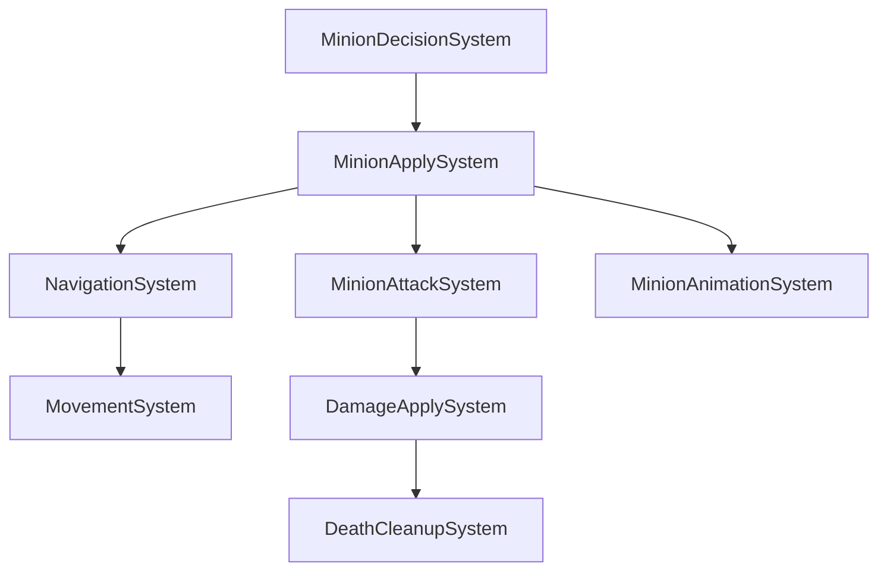

# Minion Combat + Worker-Safety 통합 구현 계획서

> **상태 동기화 (2026-07-11 — HISTORICAL PLAN)**: 아래 `Set_JobSystem` 비활성 코드는 당시 봉쇄 단계다. 현재 local-only `CLocalUnitAISystem`과 Navigation에는 JobSystem이 주입되며 Client ThreadOnly 경로가 활성이다. 최신 Job/Fiber 판정은 [상태 감사](../2026-07-11_JOB_SYSTEM_CHASE_LEV_FIBER_STATE_AUDIT.md)를 따른다.
>
**작성일**: 2026-04-28
**개정**: v1 (사용자 큰 그림 + Codex 1차/2차/3차/4차 검토 = 20건 통합 반영)
**전제**:
- Phase 5-A 완료, NavigationSystem 병렬화 직후 CPUProfiler m_vStack race 로 crash → 사용자가 thread_local 분리 + merge mutex 로 해결
- 기존 `WORKER_SAFETY_PACKAGE.md` v3 가 worker-safety 만 다룸 — 본 계획서는 **사용자 통합 그림 (M0~M7 7단계)** 으로 재구성
- "즉시 안정화 → 미니언 전투 최소 완성 → 병렬화 재개" 순서

**목표**:
> 현재 "숫자 판정만 있는 미니언 AI"를 실제 게임 루프에 맞게 정리하고, 이후 병렬 ECS 로 안전하게 재활성화한다.

**참조**:
- `WORKER_SAFETY_PACKAGE.md` v3 — Codex 1~3차 정정. 본 계획서 §6+§9+§10 의 기반
- `06_POST_B10_INFRA_VS_CHAMPS.md` v4 — B-10c 본체 완료 검증
- `project_phase_5a_complete.md` — race 미결 박제

---

## 0. 결론 — 7단계 권장 순서

| Phase | 내용 | 목적 | 시간 |
|---|---|---|---|
| **M0** | MinionAI 병렬 임시 비활성 + AStar counter 최적화 | crash/race 즉시 봉쇄 | 15분 |
| **M1** | 미니언 상태 모델 정리 (`Idle/LaneMove/Chase/Attack/Dead`) + Moving 전수 교체 | waypoint vs chase 충돌 제거 | 0.5일 |
| **M1.5** | **★ Chase Velocity→Transform 적용 보장** (Codex 4차 P1-1) | NavigationSystem 만으로는 Chase 미니언이 멈춤 | 0.5일 |
| **M2** | 상태 기반 애니메이션 전환 | run 만 계속 도는 문제 해결 | 0.5일 |
| **M3** | 공격 windup/hit/recovery 타이머 도입 | 즉시 HP 감소 제거 | 0.5일 |
| **M4** | death animation + lifetime + hide/destroy | 죽은 미니언 잔존 제거 | 0.5일 |
| **M5** | Decision/Apply 2-pass + EnsureSlotBuffers + slot main=0 | worker-safe 구조 | 1.5일 |
| **M5.5** | CommandBuffer per-slot + Scheduler access contract | 미래 ECS 확장 안전 | 1.5일 |
| **M6** | ranged projectile (별도 Component) | 원거리/공성 미니언 분리 | (다음 사이클로 분리 권장) |
| **M7** | MinionAI 병렬 재활성 + stress 검증 | production-safe 검증 | 0.5일 |

**합계 (M6 제외)**: ~5.5일 (즉시 15분 + 본격 5.25일)

**핵심 원칙** (사용자 박제):
> worker thread 에서는 world 를 읽고 decision 만 만든다.
> component write, damage, animation trigger, destroy 는 main apply phase 에서 처리한다.

---

## 1. 현재 구조 진단

### 1.1 현재 있는 것 ✅

- `MinionStateComponent::Idle / Moving / Attack / Dead` — 4상태
- `attackRange`, `attackDamage`, `attackCooldown`
- 사거리 안 → Attack 상태 전환
- cooldown == 0 → 즉시 HP 감소
- 스폰 시 미니언 타입별 range/damage 세팅
- 에셋: `run / idle / attack / death` 애니메이션 존재
- `CMovementSystem` 클래스 — [CoreSystems.cpp:65](Engine/Private/ECS/Systems/CoreSystems.cpp:65) 에 **구현은 존재**

### 1.2 현재 없는 것 ❌

- 상태 변경에 따른 애니메이션 전환
- attack windup / hit frame / recovery
- ranged projectile
- death animation / corpse lifetime / destroy
- ★ **`CMovementSystem` 이 Scheduler 에 미등록** — Velocity → Transform 적용 끊김 (Codex 4차)
- MinionAI worker-safety
- per-slot buffer 의 main thread slot (main=0 분리)

### 1.3 ★ Codex 4차 발견 — Scheduler 등록 매트릭스

[Scene_InGame.cpp](Client/Private/Scene/Scene_InGame.cpp) 의 `RegisterSystem` 4건만:
```cpp
L95   m_pScheduler->RegisterSystem(std::move(pTx));      // TransformSystem (Phase 0)
L101  m_pScheduler->RegisterSystem(std::move(pStatus));  // StatusEffectSystem
L291  m_pScheduler->RegisterSystem(std::move(pNav));     // NavigationSystem (Phase 1)
L296  m_pScheduler->RegisterSystem(std::move(pAI));      // MinionAISystem (Phase 2)
```

→ **MovementSystem 미등록**. NavigationSystem → Velocity 까지만 갱신. Velocity → Transform 적용 단계 누락. Chase 상태 미니언이 멈추는 직접 원인.

---

## 2. M0 — 즉시 안정화 (15분)

### 2.1 MinionAI 병렬 임시 비활성

[Scene_InGame.cpp:296](Client/Private/Scene/Scene_InGame.cpp:296):
```cpp
auto pAI = CMinionAISystem::Create();
// pAI->Set_JobSystem(pJS);   // ★ M0: worker-safe 재구조화 전까지 비활성
m_pScheduler->RegisterSystem(std::move(pAI));
```

→ `m_pJobSystem == nullptr` 분기로 단일 스레드 fallback. 즉시 crash 봉쇄.

### 2.2 AStar counter scope guard (Codex 2차 P3 + 4차 정확)

[Pathfinder.cpp:68](Engine/Private/Manager/Navigation/Pathfinder.cpp:68) — early return 3개 (L96/L106/L110) 모두 flush 보장:

```cpp
std::vector<CNavGrid::Cell> CPathfinder::Find_Path(...)
{
    WINTERS_PROFILE_SCOPE("AStar::FindPath");

    std::vector<CNavGrid::Cell> emptyPath;
    if (!pGrid) return emptyPath;
    if (!pGrid->IsWalkable(start.x, start.y)) return emptyPath;
    if (!pGrid->IsWalkable(goal.x, goal.y))  return emptyPath;

    // ★ A* 시작 시점 — RAII scope guard 로 모든 return 경로 자동 flush
    u32_t nodesVisited = 0;
    struct CounterFlush
    {
        const u32_t& count;
        ~CounterFlush() {
            WINTERS_PROFILE_COUNT("AStar::NodesVisited",
                static_cast<i32_t>(count));
        }
    } guard{ nodesVisited };

    // ... thread_local 버퍼 초기화 + A* 루프 ...
    while (!open.empty())
    {
        // ... 노드 처리 ...
        ++nodesVisited;   // ★ race 없음, lock 없음
    }
    // L96/L106/L110 모든 return 경로 — guard 의 destructor 가 자동 flush
}
```

---

## 3. M1 — 미니언 상태 모델 정리 (0.5일)

### 3.1 5상태 enum 확장 + Moving 전수 교체 (Codex 4차 P2)

[Engine/Public/ECS/Components/GameplayComponents.h:163](Engine/Public/ECS/Components/GameplayComponents.h:163):
```cpp
struct MinionStateComponent
{
    enum State : uint8_t
    {
        Idle,
        LaneMove,    // ★ 신규 — lane waypoint 따라 이동 (Minion_Manager 처리)
        Chase,       // ★ 신규 — 적 추적 (NavigationSystem 의 NavAgent 처리)
        Attack,      // 사거리 안, 정지 + 공격 모션 (cooldown 무관)
        Dead
    };
    State current      = LaneMove;   // ★ 초기값 = LaneMove (기존 Moving 대체)
    State visualState  = Idle;       // ★ 신규 — anim 마지막 반영 상태

    EntityID attackTargetId = NULL_ENTITY;

    // 기존 필드
    f32_t attackCooldown    = 0.f;
    f32_t attackCooldownMax = 1.f;
    f32_t attackDamage      = 10.f;
    f32_t attackRange       = 2.f;
    f32_t sightRange        = 15.f;
    f32_t moveSpeed         = 5.f;

    // ★ M3 신규 — windup/hit/recovery 타이밍
    f32_t  attackWindup    = 0.35f;
    f32_t  attackRecovery  = 0.35f;
    f32_t  attackTimer     = 0.f;
    bool_t bHitFired       = false;

    // ★ M4 신규 — death lifetime
    f32_t deathTimer = 0.f;

    uint32_t currentWaypoint = 0;
    eTeam    team            = eTeam::Blue;
    uint8_t  type            = 0;
    uint8_t  lane            = 0;
};
```

### 3.2 Moving 전수 교체 매트릭스 (Codex 4차 P2)

| 위치 | before | after |
|---|---|---|
| [Minion_Manager.cpp:245](Client/Private/Manager/Minion_Manager.cpp:245) Spawn_Minion 초기값 | `ms.current = Moving;` | `ms.current = LaneMove;` |
| [Minion_Manager.cpp:132](Client/Private/Manager/Minion_Manager.cpp:132) waypoint 이동 후 | `ms.current = Moving;` | `ms.current = LaneMove;` |
| [MinionAISystem.cpp:144](Engine/Private/ECS/Systems/MinionAISystem.cpp:144) chase 진입 | `ms.current = Moving;` | `ms.current = Chase;` |

### 3.3 waypoint movement 조건 수정 (Codex 3차)

[Minion_Manager.cpp:98](Client/Private/Manager/Minion_Manager.cpp:98):
```cpp
// before
if (ms.current == MinionStateComponent::Attack) return;

// after — Attack/Chase/Dead 모두 skip (Chase 는 NavigationSystem 이 처리)
if (ms.current == MinionStateComponent::Attack ||
    ms.current == MinionStateComponent::Chase ||
    ms.current == MinionStateComponent::Dead)
{
    return;
}
```

→ Chase 상태 미니언은 lane waypoint 무시 → NavAgent.vTarget = enemy 가 살아남음.

---

## 4. M1.5 — ★ Chase Velocity → Transform 적용 보장 (0.5일, Codex 4차 P1-1)

### 4.1 문제 진단

NavigationSystem 은 `vel.vDirection / vel.fSpeed` 만 write. Velocity → Transform 적용은 **CMovementSystem** 의 책임 — 단 Scheduler 미등록 상태.

### 4.2 옵션 A — MovementSystem Scheduler 에 등록 (정석)

[Scene_InGame.cpp:289 근처](Client/Private/Scene/Scene_InGame.cpp:289) NavigationSystem 등록 직후:
```cpp
{
    auto pNav = CNavigationSystem::Create();
    pNav->Set_Grid(m_pNavGrid.get());
    // pNav->Set_JobSystem(pJS);   // M0: 비활성
    m_pScheduler->RegisterSystem(std::move(pNav));   // Phase 1
}

// ★ M1.5 신규 — Velocity → Transform 적용
{
    auto pMove = CMovementSystem::Create();
    m_pScheduler->RegisterSystem(std::move(pMove));   // Phase 1.5
}
```

**위험**: 다른 챔프 Entity (Irelia/Yasuo/등) 에 `VelocityComponent` 있으면 의도치 않게 이동. 체크 필요:
- 챔프 Entity 가 VelocityComponent 보유하면 — 챔프는 legacy CTransform 으로 이동 (m_pPlayerTransform->SetPosition 직접). VelocityComponent 가 0 으로 유지되면 영향 0
- [Scene_InGame.cpp:460](Client/Private/Scene/Scene_InGame.cpp:460) `m_World.AddComponent<VelocityComponent>(e);` — 챔프 Entity 도 추가 중. **확인 필요**: 챔프의 VelocityComponent 가 어떻게 유지되는지

### 4.3 옵션 B — 단기 Chase 만 Velocity→Transform (Codex 권장)

[Minion_Manager.cpp::Tick](Client/Private/Manager/Minion_Manager.cpp:62) 에 Chase 분기 추가:
```cpp
m_pWorld->ForEach<MinionStateComponent, TransformComponent, VelocityComponent>(
    [dt](EntityID, MinionStateComponent& ms, TransformComponent& xform, VelocityComponent& vel)
    {
        if (ms.current != MinionStateComponent::Chase) return;
        if (vel.fSpeed <= 0.f) return;

        const Vec3 vCur = xform.GetLocalPosition();
        xform.SetPosition({
            vCur.x + vel.vDirection.x * vel.fSpeed * dt,
            vCur.y,
            vCur.z + vel.vDirection.z * vel.fSpeed * dt
        });
    });
```

→ Chase 미니언만 Velocity 적용. 챔프 Entity 에 영향 0 (챔프는 LaneMove/Chase 상태가 아님).

**1차 권장 = 옵션 B** (영향 범위 최소). M5 이후 옵션 A 로 정석화.

---

## 5. M2 — 상태 기반 애니메이션 전환 (0.5일)

### 5.1 visualState 기반 anim 전환

[CMinion_Manager::Tick](Client/Private/Manager/Minion_Manager.cpp:62) 의 `Anim::UpdateCalls` 블록 직전 추가:

```cpp
m_pWorld->ForEach<MinionStateComponent, RenderComponent>(
    [](EntityID, MinionStateComponent& ms, RenderComponent& rc)
    {
        if (!rc.pRenderer) return;
        if (ms.visualState == ms.current) return;   // 변경 없으면 skip

        switch (ms.current)
        {
        case MinionStateComponent::Idle:
            rc.pRenderer->PlayAnimationByName("idle", true);
            break;
        case MinionStateComponent::LaneMove:
        case MinionStateComponent::Chase:
            rc.pRenderer->PlayAnimationByName("run", true);
            break;
        case MinionStateComponent::Attack:
            rc.pRenderer->PlayAnimationByName("attack", false);
            break;
        case MinionStateComponent::Dead:
            rc.pRenderer->PlayAnimationByName("death", false);
            break;
        }
        ms.visualState = ms.current;
    });
```

`PlayAnimationByName` 은 substring 매칭 ([Model.cpp:152](Engine/Private/Resource/Model.cpp:152)) — `"attack"` 키워드면 `minion_melee_attack` / `minion_caster_attack` 모두 매칭.

---

## 6. M3 — 공격 windup/hit/recovery (0.5일)

### 6.1 즉시 HP 감소 → 타이머 기반

기존 (cooldown 0 시 즉시 HP 차감) → 사거리 안에서 cooldown 무관 Attack 상태 + 타이머:

```cpp
// MinionAI 또는 별도 MinionAttackSystem 안에서
if (distSq <= rangeSq)
{
    ms.current = MinionStateComponent::Attack;
    StopMovement(world, id);   // NavAgent.bHasGoal = false + Velocity zero

    // ★ 새 attack 시작 조건: cooldown 만료 + attackTimer 진행 안 중
    if (ms.attackCooldown <= 0.f && ms.attackTimer <= 0.f)
    {
        ms.attackTimer    = ms.attackWindup + ms.attackRecovery;
        ms.bHitFired      = false;
        ms.attackCooldown = ms.attackCooldownMax;
    }
}
```

### 6.2 hit timing — recovery 만큼 남았을 때 damage

```cpp
if (ms.current == MinionStateComponent::Attack && ms.attackTimer > 0.f)
{
    const f32_t prev = ms.attackTimer;
    ms.attackTimer  -= dt;

    const f32_t hitTime = ms.attackRecovery;   // recovery 시작점 = windup 끝

    if (!ms.bHitFired && prev > hitTime && ms.attackTimer <= hitTime)
    {
        // ★ M5 이후: ApplyPass 의 DamageEvent 로 처리
        // ★ M3 1차: 직접 적용 (단일 스레드 fallback 상태이므로 safe)
        ApplyDamageOrEmitEvent(id, ms.attackTargetId, ms.attackDamage);
        ms.bHitFired = true;
    }
}
```

→ 공격 anim 시작 후 windup 만큼 지나야 데미지 발생. "즉시 데미지" 제거.

---

## 7. M4 — 죽음 처리 (0.5일)

### 7.1 HP 0 도달 시

```cpp
// DamageApplyPass 또는 HealthSystem
if (hp.fCurrent <= 0.f && !hp.bIsDead)
{
    hp.bIsDead = true;
    if (world.HasComponent<MinionStateComponent>(target))
    {
        auto& ms = world.GetComponent<MinionStateComponent>(target);
        ms.current    = MinionStateComponent::Dead;
        ms.deathTimer = 1.5f;   // death anim 길이
    }
}
```

### 7.2 deathTimer 진행 + hide

[Minion_Manager.cpp::Tick](Client/Private/Manager/Minion_Manager.cpp:62) 끝부분:
```cpp
m_pWorld->ForEach<MinionStateComponent, RenderComponent>(
    [dt](EntityID e, MinionStateComponent& ms, RenderComponent& rc)
    {
        if (ms.current != MinionStateComponent::Dead) return;
        if (ms.deathTimer <= 0.f) return;

        ms.deathTimer -= dt;
        if (ms.deathTimer <= 0.f)
        {
            rc.bVisible = false;
            // ★ M5 이후: CommandBuffer.DeferDestroy(e) — worker-safe per-slot 적용 후
            // 1차: hide 만 — entity 잔존 (다음 프레임 race 위험 0)
        }
    });
```

→ destroy 는 M5 의 CommandBuffer per-slot 도입 후. 1차는 hide 만.

---

## 8. M5 — Decision/Apply 2-pass + EnsureSlotBuffers (1.5일)

### 8.1 ★ Codex 4차 P1-2 — EnsureSlotBuffers 강제 호출

```cpp
class CMinionAISystem : public ISystem
{
private:
    std::vector<std::vector<MinionDecision>> m_vecDecisionsPerSlot;
    std::vector<std::vector<DamageEvent>>    m_vecDamagesPerSlot;
    CJobSystem* m_pJobSystem = nullptr;

    // ★ Codex 4차 — Set_JobSystem 비활성 시에도 안전
    void Ensure_SlotBuffers()
    {
        const uint32_t need = (m_pJobSystem ? m_pJobSystem->Get_WorkerCount() : 0u) + 1;
        if (m_vecDecisionsPerSlot.size() != need)
        {
            m_vecDecisionsPerSlot.resize(need);
            m_vecDamagesPerSlot.resize(need);
        }
    }

public:
    void Execute(CWorld& world, f32_t dt) override
    {
        Ensure_SlotBuffers();   // ★ 매 Execute 시작부 호출 — Set_JobSystem 미호출 시에도 slot 1개 보장
        // ... 이하 DecisionPass + ApplyPass
    }

    void Set_JobSystem(CJobSystem* pJS)
    {
        m_pJobSystem = pJS;
        Ensure_SlotBuffers();
    }
};
```

### 8.2 worker slot API — main=0, worker=idx+1 (Codex 2차)

```cpp
// JobSystem.h
class CJobSystem
{
public:
    static int32_t  Get_WorkerIdx();         // main = -1, worker = [0, N)
    static uint32_t Get_WorkerSlot();        // ★ main = 0, worker = idx+1
    uint32_t        Get_WorkerCount() const  // buffer size 결정용
        { return static_cast<uint32_t>(m_vecDeques.size()); }
};

// JobSystem.cpp
int32_t  CJobSystem::Get_WorkerIdx()  { return t_iWorkerIdx; }
uint32_t CJobSystem::Get_WorkerSlot()
{
    const int32_t idx = t_iWorkerIdx;
    return (idx < 0) ? 0u : static_cast<uint32_t>(idx + 1);
}
```

### 8.3 ★ MinionDecision 위치 — cpp local struct (Codex 4차 P2)

`Engine/Public/ECS/Events/MinionDecision.h` 신규 X. 대신 `MinionAISystem.cpp` 익명 namespace 또는 cpp 내부 struct:

```cpp
// MinionAISystem.cpp 상단 — 익명 namespace
namespace
{
    struct MinionDecision
    {
        EntityID self            = NULL_ENTITY;
        EntityID target          = NULL_ENTITY;
        MinionStateComponent::State desiredState = MinionStateComponent::Idle;
        Vec3     navTarget       {};
        bool_t   bSetNavTarget   = false;
        bool_t   bStopMovement   = false;
        bool_t   bStartAttack    = false;
        bool_t   bClearTarget    = false;
        // ★ Codex 4차 P3 — cooldown one-frame delay 회피
        f32_t    cooldownAfterTick = 0.f;
    };
}
```

→ public header 의존성 0. `DamageEvent` 만 향후 별도 public event 로 분리 (다른 시스템 재사용).

### 8.4 DecisionPass — worker, read-only

★ Codex 4차 P3 — `cooldownAfterTick` 으로 one-frame delay 회피:

```cpp
void CMinionAISystem::DecisionPass(CWorld& world, EntityID id, f32_t dt)
{
    if (!world.HasComponent<MinionStateComponent>(id)) return;
    if (!world.HasComponent<MinionComponent>(id))      return;
    if (!world.HasComponent<TransformComponent>(id))   return;

    const auto& ms     = world.GetComponent<MinionStateComponent>(id);   // const read
    const auto& minion = world.GetComponent<MinionComponent>(id);
    const auto& xform  = world.GetComponent<TransformComponent>(id);

    if (ms.current == MinionStateComponent::Dead) return;

    MinionDecision dec{};
    dec.self = id;

    // ★ Codex 4차 — cooldown 차감 후 값 예측 (one-frame delay 회피)
    dec.cooldownAfterTick = std::max(0.f, ms.attackCooldown - dt);
    const bool bCooldownReadyAfterTick = (dec.cooldownAfterTick <= 0.f);

    // 타겟 유효성 + FindClosestEnemy + 거리 판정 (read-only)
    EntityID curTarget = ms.attackTargetId;
    // ... (v3 와 동일 — 생략)

    if (curTarget == NULL_ENTITY)
    {
        dec.target       = NULL_ENTITY;
        dec.desiredState = MinionStateComponent::Idle;
        Push_Decision(dec);
        return;
    }
    dec.target = curTarget;

    // 거리 판정
    const Vec3 myPos = xform.GetLocalPosition();
    const auto& tgtXform = world.GetComponent<TransformComponent>(curTarget);
    const Vec3 tgtPos = tgtXform.GetLocalPosition();
    const f32_t distSq = ...;

    if (distSq <= ms.attackRange * ms.attackRange)
    {
        dec.desiredState = MinionStateComponent::Attack;
        dec.bStopMovement = true;
        dec.bStartAttack  = bCooldownReadyAfterTick && (ms.attackTimer <= 0.f);
    }
    else if (distSq <= ms.sightRange * ms.sightRange)
    {
        dec.desiredState  = MinionStateComponent::Chase;
        dec.navTarget     = tgtPos;
        dec.bSetNavTarget = true;
    }
    else
    {
        dec.target       = NULL_ENTITY;
        dec.desiredState = MinionStateComponent::Idle;
    }

    Push_Decision(dec);
}

void CMinionAISystem::Push_Decision(const MinionDecision& dec)
{
    const uint32_t slot = CJobSystem::Get_WorkerSlot();   // main=0, worker=idx+1
    m_vecDecisionsPerSlot[slot].push_back(dec);           // ★ Ensure_SlotBuffers 가 보장
}
```

### 8.5 ApplyPass — main thread 단일

```cpp
void CMinionAISystem::ApplyPass(CWorld& world, f32_t dt)
{
    // 1) Cooldown 차감 — 모든 살아있는 미니언
    world.ForEach<MinionStateComponent>(
        [dt](EntityID, MinionStateComponent& ms) {
            if (ms.attackCooldown > 0.f) ms.attackCooldown -= dt;
        });

    // 2) Attack timer 진행 + hit timing damage
    world.ForEach<MinionStateComponent>(
        [&world, this, dt](EntityID id, MinionStateComponent& ms) {
            if (ms.current != MinionStateComponent::Attack) return;
            if (ms.attackTimer <= 0.f) return;

            const f32_t prev = ms.attackTimer;
            ms.attackTimer -= dt;
            const f32_t hitTime = ms.attackRecovery;
            if (!ms.bHitFired && prev > hitTime && ms.attackTimer <= hitTime)
            {
                m_vecDamagesPerSlot[0].push_back(DamageEvent{
                    id, ms.attackTargetId, ms.attackDamage, true });
                ms.bHitFired = true;
            }
        });

    // 3) Decision 적용 — self entity write
    for (auto& vecBuf : m_vecDecisionsPerSlot)
    {
        for (const auto& dec : vecBuf)
        {
            if (!world.IsAlive(dec.self)) continue;
            if (!world.HasComponent<MinionStateComponent>(dec.self)) continue;

            auto& ms = world.GetComponent<MinionStateComponent>(dec.self);
            ms.attackTargetId = dec.target;
            ms.current        = dec.desiredState;

            if (dec.bStopMovement)
            {
                if (world.HasComponent<NavAgentComponent>(dec.self))
                    world.GetComponent<NavAgentComponent>(dec.self).bHasGoal = false;
                if (world.HasComponent<VelocityComponent>(dec.self))
                {
                    auto& v = world.GetComponent<VelocityComponent>(dec.self);
                    v.vDirection = { 0.f, 0.f, 0.f };
                    v.fSpeed = 0.f;
                }
            }
            if (dec.bSetNavTarget)
            {
                if (world.HasComponent<NavAgentComponent>(dec.self))
                {
                    auto& nav = world.GetComponent<NavAgentComponent>(dec.self);
                    nav.vTarget    = dec.navTarget;
                    nav.bHasGoal   = true;
                    nav.bPathDirty = true;
                }
            }
            if (dec.bStartAttack)
            {
                ms.attackTimer    = ms.attackWindup + ms.attackRecovery;
                ms.bHitFired      = false;
                ms.attackCooldown = ms.attackCooldownMax;
            }
        }
        vecBuf.clear();
    }

    // 4) Damage 적용
    for (auto& vecBuf : m_vecDamagesPerSlot)
    {
        for (const auto& evt : vecBuf)
        {
            if (!world.IsAlive(evt.target)) continue;
            if (!world.HasComponent<HealthComponent>(evt.target)) continue;

            auto& hp = world.GetComponent<HealthComponent>(evt.target);
            hp.fCurrent -= evt.amount;
            if (hp.fCurrent <= 0.f && evt.bKill)
            {
                hp.fCurrent = 0.f;
                hp.bIsDead = true;
                if (world.HasComponent<MinionStateComponent>(evt.target))
                {
                    auto& tgtMs = world.GetComponent<MinionStateComponent>(evt.target);
                    tgtMs.current    = MinionStateComponent::Dead;
                    tgtMs.deathTimer = 1.5f;
                }
            }
        }
        vecBuf.clear();
    }
}
```

---

## 9. M5.5 — CommandBuffer per-slot + Scheduler access contract (1.5일)

기존 `WORKER_SAFETY_PACKAGE.md` v3 의 §3 + §4 그대로 흡수. 핵심:
- CommandBuffer per-slot — `Get_WorkerSlot()` 통일 + Resize_Workers
- Scheduler access contract — `std::type_index` + `bExclusive` 기본 true

---

## 10. M6 — ranged projectile (별도 사이클로 분리)

1차는 melee/ranged 모두 hitFrame damage. 2차에서 ranged 만 projectile (KalistaProjectileSystem 패턴 미러).

→ **본 계획서 외부**. M7 통과 후 별도 사이클.

---

## 11. M7 — MinionAI 병렬 재활성 + stress (0.5일)

### 11.1 재활성

[Scene_InGame.cpp:296](Client/Private/Scene/Scene_InGame.cpp:296):
```cpp
auto pAI = CMinionAISystem::Create();
pAI->Set_JobSystem(pJS);   // ★ M0 비활성 해제
m_pScheduler->RegisterSystem(std::move(pAI));
```

### 11.2 검증 매트릭스

| 항목 | 합격 |
|---|---|
| 16 미니언 1 타겟 집중 공격 | 단일 vs 병렬 결과 HP 동일 (deterministic) |
| 공격 anim hit timing | windup 동안 damage 0, hit frame 도달 시 1회만 |
| chase 중 waypoint override 0 | NavAgent.vTarget = enemy 가 매 프레임 유지 |
| death anim → hide | 1.5s 후 bVisible = false |
| EnsureSlotBuffers crash 0 | M0 비활성 + 재활성 토글 시 vector out of range 0 |
| 1000 frame 반복 | crash 0, race 0 |

---

## 12. 더 좋은 최종 구조 (장기 비전)



본 계획서 = 1~3 단계 통합 (DecisionSystem 분리 X — MinionAI 안에 DecisionPass + ApplyPass). 완전 분리는 별도 사이클.

---

## 13. Codex 검토 → 본 계획서 반영 매트릭스 (20건)

### 13.1 Codex 1차 (5건) — 1차 진단

| 지적 | 반영 |
|---|---|
| MinionAI cross-entity write race | §8 Decision/Apply 2-pass |
| FindClosest read while sibling write | §8 read-only DecisionPass |
| CommandBuffer push_back | §9 per-slot |
| Scheduler access contract | §9 std::type_index + bExclusive |
| AStar Counter contention | §2.2 scope guard |

### 13.2 Codex 2차 (5건) — 정밀화

| 지적 | 반영 |
|---|---|
| DamageEvent 만으로 FindClosest race 안 닫힘 | §8 Decision/Apply 전체 분리 |
| main slot 0 충돌 | §8.2 main=0/worker=idx+1 |
| B-10c 본체 완료 | §0/§9 — B-10c 잔여만 흡수 |
| Access contract bExclusive 기본 | §9 |
| AStar early return scope guard | §2.2 |

### 13.3 Codex 3차 (5건) — 구조 검증

| 지적 | 반영 |
|---|---|
| cooldown hold state 손실 | §8.4 desiredState/bStopMovement/bStartAttack 분리 |
| Nav chase가 waypoint 에 묻힘 | §3.3 + §4 (M1.5) |
| ISystem.Initialize 없음 | §8.1 Set_JobSystem 시 Ensure_SlotBuffers |
| SystemAccess/TypeID 미정의 | §9 std::type_index |
| B-10c stale | §0 표 정정 |

### 13.4 Codex 4차 (5건) — 실행 직전 정밀화 ★

| 지적 | 반영 |
|---|---|
| **P1 Chase Transform 이동 주체 없음** | **§4 (M1.5 신규) — Chase Velocity→Transform 임시 적용** |
| **P1 EnsureSlotBuffers Execute 시작부** | **§8.1 — Ensure_SlotBuffers 매 Execute 호출** |
| **P2 Moving 전수 교체** | **§3.2 매트릭스 3건** |
| **P2 MinionDecision header 의존성** | **§8.3 cpp 익명 namespace local struct** |
| **P3 cooldown one-frame delay** | **§8.4 cooldownAfterTick 예측 차감** |

---

## 14. CLAUDE.md gotchas + MEMORY 박제

신규 8건 (worker-safety 5 + minion combat 3):

```
- ★ 병렬 ECS Worker-Safety 정책 5종:
  thread_local / atomic / lock+merge / self-entity / per-worker-slot

- CPUProfiler scope stack thread_local 분리 (2026-04-28)

- ECS cross-entity write 금지. per-worker buffer + main reduce phase

- per-worker buffer slot 규칙: main=0, worker=idx+1, size = WorkerCount+1

- Set_JobSystem 비활성 시에도 Ensure_SlotBuffers 매 Execute 호출

- Scheduler access contract: bExclusive 기본 true (미구현 시 단독 실행)

- Minion 5상태: Idle/LaneMove/Chase/Attack/Dead.
  Moving 단일 상태로는 lane vs chase 충돌 — Chase 분리 필수.

- Chase 상태는 lane waypoint skip + NavAgent.vTarget = enemy.
  Velocity → Transform 적용은 MovementSystem 또는 임시 Minion_Manager 분기.
```

---

## 15. 일정 + 의존성

```
[즉시 15분]
  M0  pAI 비활성 + AStar scope guard
       ↓
[기반 1일]
  M1   5상태 enum + Moving 전수 교체 (3건)
  M1.5 Chase Velocity→Transform (옵션 B 단기 패치)
       ↓
[Combat 1.5일]
  M2  visualState anim 전환
  M3  attack windup/hit/recovery 타이밍
  M4  death anim + hide
       ↓
[Worker-Safety 3일]
  M5  Decision/Apply 2-pass + EnsureSlotBuffers + slot main=0
  M5.5 CommandBuffer per-slot + Scheduler access contract
       ↓
[검증 0.5일]
  M7  병렬 재활성 + stress
       ↓
[다음 사이클]
  M6  ranged projectile (별도)
  Phase 2 RenderGraph 진입
  Riven Pure ECS (06 v4 B-10d)
```

**합계**: ~5.5일 + 즉시 15분

---

## 16. 한 줄

**Worker-safety + Minion combat 통합 (Codex 1+2+3+4차 = 20건 전수 반영). M0 봉쇄 → M1 5상태 → M1.5 Chase Velocity 임시 → M2 anim 전환 → M3 windup/hit → M4 death → M5 Decision/Apply 2-pass + EnsureSlotBuffers + slot main=0 + cooldownAfterTick + cpp local struct → M5.5 CommandBuffer + access contract → M7 병렬 재활성. ~5.5일 + 즉시 15분. 미니언 전투 minimum 완성 + 병렬 안전 production-ready.**
