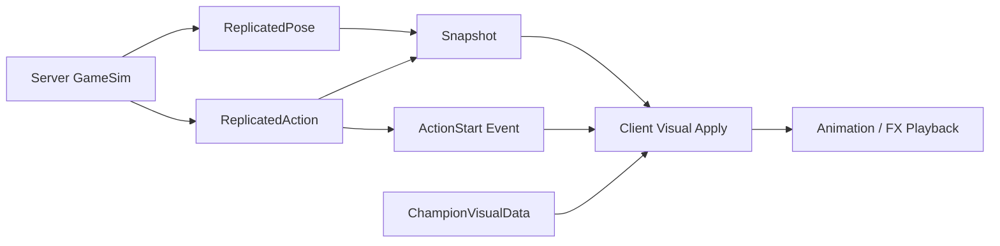

# Codex View - InGame/Champion Core Ownership

이 문서는 `04_INGAME_CHAMPION_CORE_OWNERSHIP_PLAN.md`를 대화 세션에서 읽기 쉽게 정리한 보기용 문서다.
실제 적용 지시, 파일별 코드블록, 삭제 범위는 원본 계획서를 기준으로 한다.

## 제일 위의 개념

가장 위에 있는 개념은 `Champion`이 아니다.
가장 위에 있는 개념은 `source-of-truth ownership`이다.

한 문장으로 줄이면 아래다.

```text
판정 가능한 진실은 Server/GameSim이 만들고, Client는 그 진실을 보이는 방식으로 해석한다.
```

그래서 최상위 질문은 항상 이것이다.

- 이 값은 gameplay 결과를 결정하는가?
- 아니면 이미 결정된 결과를 어떻게 보여줄지 정하는가?
- 누가 이 값을 쓰는가: Server validation, GameSim simulation, Snapshot/Event, Client visual, UI?
- 이 값이 없으면 기능이 사라지는가, 아니면 owner만 바뀌면 되는가?

이 질문을 통과하지 못하는 값은 구조 안에 그대로 두면 안 된다.
이 질문을 통과하지만 owner가 틀린 값은 삭제가 아니라 이동해야 한다.

## 위에서 아래로

최상위 흐름은 기존 서버 권위 파이프라인 그대로다.

```text
Client Input -> GameCommand -> Server GameSim -> Snapshot/Event -> Client Visual
```

이 흐름을 원자 단위로 내리면 아래처럼 쪼개진다.

1. `Client Input`
   플레이어 의도다. 아직 진실이 아니다.

2. `SkillCommand`
   의도를 서버가 읽을 수 있는 payload로 만든다. 본질은 slot, target entity, ground pos, direction이다. `resolvedTargetMode`는 현재 호환 bridge이고 최종 본질은 아니다.

3. `SkillTypes`
   이름표다. `eSkillSlot`은 어떤 스킬인가, `eTargetMode`는 실제 대상 형식인가, `eTargetResolvePolicy`는 문맥 해석 정책인가를 나눈다.

4. `ChampionGameData`
   champion 판정 사실이다. damage, cooldown, range, mana, lock duration, gameplay policy처럼 서버가 판단할 값만 둔다.

5. `SummonerSpellGameData`
   champion 소유가 아닌 spell 판정 사실이다. champion data 안에 있으면 loadout/spell/champion owner가 섞인다.

6. `Server GameSim`
   command와 gameplay data로 실제 진실을 만든다. HP, cooldown, movement, action lock, projectile, hit validation은 여기서 결정된다.

7. `ReplicatedPose`
   계속 유지되는 몸 상태다. Idle, Run, Dead가 여기에 속한다.

8. `ReplicatedAction`
   시작 tick과 sequence가 있는 행위다. BasicAttack, SkillQ/W/E/R, Recall, DeathStart, ViegoConsumeSoul이 여기에 속한다.

9. `Snapshot/Event`
   서버 진실을 Client로 보내는 통로다. Snapshot은 지속 상태를 싣고, Event는 시작 순간을 알린다.

10. `ChampionVisualData`
    Client가 pose/action을 어떤 model, animation key, playback speed, loop로 보여줄지 해석하는 source다.

11. `ChampionActionVisualEventData`
    cast/recovery/key-swap 같은 visual marker다. gameplay 판정 frame이 아니라 visual hook timing이다.

12. `Client Visual`
    받은 fact를 보이는 형태로 재생한다. 여기서 animation, FX, sound, UI 표시가 일어난다.

## 아래에서 위로

가장 작은 원자에서 다시 구조를 끌어올리면 이렇게 된다.

`eSkillSlot`은 단순한 번호다.
이 번호가 `SkillCommand`에 들어가면 "플레이어가 Q를 눌렀다"는 의도가 된다.
하지만 이 의도는 아직 hit, damage, cooldown truth가 아니다.

`ChampionGameData`는 그 slot을 어떻게 판정할지 알려준다.
range, cooldown, mana, lock duration, gameplay policy가 모여 Server GameSim이 검증할 수 있는 규칙이 된다.

Server GameSim은 그 규칙으로 command를 받아들이거나 거절하고, 받아들이면 gameplay truth를 바꾼다.
그리고 Client가 알아야 할 최소 결과만 `ReplicatedPose`, `ReplicatedAction`, Snapshot/Event로 내보낸다.

Client는 이 fact를 그대로 gameplay truth로 쓰지 않는다.
Client는 `ChampionVisualData`를 통해 "이 action id는 이 animation key로, 이 속도로, loop 여부는 이렇게"라고 해석한다.
visual marker가 필요하면 `ChampionActionVisualEventData`로 hook을 호출한다.

이렇게 올라오면 기존 혼합 구조는 자연스럽게 분해된다.

- `SkillDef`는 `SkillTypes`, `SkillCommand`, `ChampionGameData`, `ChampionVisualData`, visual event로 찢어진다.
- `ChampionDef`는 gameplay stat/source와 client model/source로 찢어진다.
- `SkillTable`은 gameplay table과 visual table을 섞었으므로 삭제 대상이 된다.
- `ChampionTable`은 display/model/spawn/gameplay를 섞었으므로 삭제 대상이 된다.
- `NetAnimationComponent`는 `ReplicatedPose`와 `ReplicatedAction`으로 찢어진다.
- `ChampionGameData` 안의 visual field는 `ChampionVisualData`로 이동한다.
- `summonerSpells`는 champion fact가 아니므로 `SummonerSpellGameData`로 이동한다.

## 최상위 도메인 배치

최상위 도메인은 아래 책임으로 나눈다.

```text
Engine
  generic runtime/render/resource/ECS primitive

Shared/GameSim
  deterministic gameplay contract and server-authoritative facts

Server
  GameCommand receiver, GameSim runner, Snapshot/Event sender

Client
  input sender, weak prediction, interpolation, visual/audio/UI presentation

Data/Tools
  gameplay source and visual source authoring/codegen
```

의존 방향은 아래만 허용한다.

```text
Server -> Shared/GameSim
Client -> Shared/GameSim
Client -> Engine
Shared/GameSim -> Engine primitive type only when already allowed by project convention
Engine -> no Client/Server/LoL/GameSim product dependency
Shared/GameSim -> no Client/Renderer/UI/DX/ImGui dependency
```

새 원자의 위치는 아래다.

| 원자 | 위치 | 소유 이유 |
| --- | --- | --- |
| `SkillTypes` | `Shared/GameSim/Definitions` | Client와 Server가 같은 slot/target 이름을 읽어야 한다. |
| `SkillCommand` | `Shared/GameSim/Definitions` | Client가 보내고 Server가 소비하는 command payload다. |
| `ChampionGameData` | `Shared/GameSim/Definitions`, `Shared/GameSim/Registries`, `Data/Gameplay` | 서버 판정에 필요한 champion gameplay fact다. |
| `SummonerSpellGameData` | `Shared/GameSim/Definitions`, `Shared/GameSim/Registries`, `Data/Gameplay` | champion이 아닌 spell gameplay fact다. |
| `ReplicatedPose` | `Shared/GameSim/Components` | Snapshot으로 복제되는 지속 gameplay-visible state다. |
| `ReplicatedAction` | `Shared/GameSim/Components` | Event/Snapshot으로 복제되는 시작 tick 기반 action fact다. |
| `ChampionVisualData` | `Client/Public/GameObject`, `Data/Client` | Shared id를 Client presentation으로 해석하는 visual source다. |
| `ChampionActionVisualEventData` | `Client/Public/GameObject`, `Data/Client` | cast/recovery/key-swap 같은 visual hook timing이다. |
| `spawn/loadout policy` | Server config or explicit smoke config | spawn과 loadout은 champion visual/gameplay definition 자체가 아니다. |

이 배치에서 중요한 금지는 아래다.

- `Shared/GameSim`은 `ChampionVisualData`를 include하지 않는다.
- `Server`는 animation key, model path, texture path, playback speed를 고르지 않는다.
- `Client`는 cooldown, hit, damage, action lock 같은 authoritative truth를 새로 만들지 않는다.
- `Engine`은 LoL champion, Server, GameSim product rule을 알지 않는다.
- `Data/Gameplay`와 `Data/Client`는 서로 값을 복사해도 같은 owner가 되면 안 된다. 같은 이름의 값이 양쪽에 필요해 보이면 먼저 이름과 용도를 다시 의심한다.

## 마지막 검토 결과

계획의 방향은 맞다.
Shared/GameSim에서 model, animation key, playback speed, visual yaw offset, cast/recovery visual frame을 빼고 Client visual source로 옮기는 것이 북극성이다.

하지만 이전 계획을 그대로 구현하면 런타임 회귀 위험이 있다.
현재 코드베이스는 프레임 안에서 아래 값을 직접 읽는다.

- `NetAnimationComponent`의 Idle/Run/Skill/Recall/Death 상태
- `animPhaseFrame`, `playbackRateQ8`, `animFlags`, loop flag
- `castFrame`, `recoveryFrame`, hook id
- `resolvedTargetMode`, `Conditional`
- champion root의 summoner spell lookup

따라서 최종 삭제는 맞지만, 삭제 순서는 더 본질적으로 쪼개야 한다.

## 더 본질적인 분해

이 refactor의 원자는 이제 여덟 개다.

- `SkillTypes`: skill slot, 실제 target mode, target resolve policy
- `SkillCommand`: 입력 의도 payload와 임시 resolved target bridge
- `ChampionGameData`: 서버 판정용 champion gameplay fact
- `SummonerSpellGameData`: champion이 아닌 spell gameplay fact
- `ReplicatedPose`: Idle/Run/Dead 같은 지속 몸 상태
- `ReplicatedAction`: BasicAttack/Skill/Recall/DeathStart/ViegoConsumeSoul 같은 시작 시점이 있는 행위
- `ChampionVisualData`: Client가 pose/action을 model/animation/playback/loop로 해석하는 source
- `ChampionActionVisualEventData`: cast/recovery/key-swap 같은 visual hook marker

핵심은 `animation`이라는 혼합 단어를 없애는 것이다.
서버는 pose/action fact만 보낸다.
Client는 그 fact를 visual data로 해석한다.

## 왜 pose와 action을 나누나

기존 `NetAnimationComponent`는 두 개념이 섞여 있다.

- Idle/Run은 계속 유지되는 몸 상태다.
- SkillQ, Recall, DeathStart, ViegoConsumeSoul은 시작 tick과 sequence가 중요한 action이다.

이 둘을 모두 `ReplicatedAction` 하나로 바꾸면 이동 중 Idle/Run을 Client가 새로 추론해야 한다.
그 순간 minion, jungle, champion movement visual이 기존과 달라질 수 있다.

그래서 더 본질적인 구조는 아래다.



## 왜 loop/playback/frame hook을 완전히 지우지 않나

Shared에서는 지운다.
하지만 기능 자체를 없애면 안 된다.

- `playbackRateQ8`은 Shared/Event/Snapshot에서 제거한다.
- `bLoop`는 Shared action state에서 제거하고 `ChampionActionVisualStageData::bLoop`로 옮긴다.
- `castFrame/recoveryFrame`은 `ChampionGameDataSkillStage`에서 제거하고 `ChampionActionVisualEventData`로 옮긴다.
- hook id는 gameplay data가 아니라 visual event marker가 가진다.

즉 제거가 아니라 owner 이동이다.

## Conditional 처리

`Conditional`은 target mode가 아니다.
더 정확히는 문맥에 따라 실제 target mode를 고르는 policy다.

최종 구조:
- `targetMode`: Self, UnitTarget, GroundTarget, Direction
- `targetPolicy`: Direct, Contextual

다만 현재 `resolvedTargetMode`를 읽는 경로가 있다.
그래서 1차 구현에서는 `resolvedTargetMode`를 삭제하지 않는다.
모든 contextual skill이 서버 `SkillTargetResolver`로 대체된 뒤 제거한다.

## 구현 순서

1. 새 원자 타입을 추가한다.
   `SkillTypes`, `SkillCommand`, `ReplicatedPoseComponent`, `ReplicatedActionComponent`, `ChampionVisualData`.

2. 기존 writer 옆에서 dual-write한다.
   `NetAnimationComponent`를 바로 지우지 않고 같은 tick에 pose/action 값을 같이 기록한다.

3. Snapshot/Event를 migration한다.
   Snapshot은 pose/action을 함께 싣고, Event는 `ActionStart`만 싣는다.

4. Client visual source를 붙인다.
   animation key, playback speed, loop, hook marker를 `ChampionVisualData`에서 읽는다.

5. parity 확인 후 legacy를 삭제한다.
   `SkillDef`, `ChampionDef`, `SkillTable`, `ChampionTable`, `NetAnimationComponent`는 final deletion gate에서 제거한다.

## 회귀 방지 체크

반드시 normal F5 기준으로 확인한다.
roster, map, minion, snapshot, champion, UI, FX를 숨기면 검증이 아니다.

확인할 동작:

- player champion Idle/Run
- lane minion Idle/Run
- jungle Idle/Run
- BasicAttack one-shot
- SkillQ/W/E/R stage
- ViegoConsumeSoul action
- Jax E loop
- Yasuo/Irelia contextual target skill
- Recall
- DeathStart/Dead
- cast/recovery visual hook
- cooldown/UI 표시

## 결론

최종 목표는 더 강하게 유지한다.
다만 삭제 순서는 바꾼다.

바로 지우는 리팩터링이 아니라, 같은 프레임 의미가 유지되는지 확인하면서 owner를 옮기는 리팩터링으로 간다.
이 방식이 더 본질적이고, 기능 회귀를 막는다.
