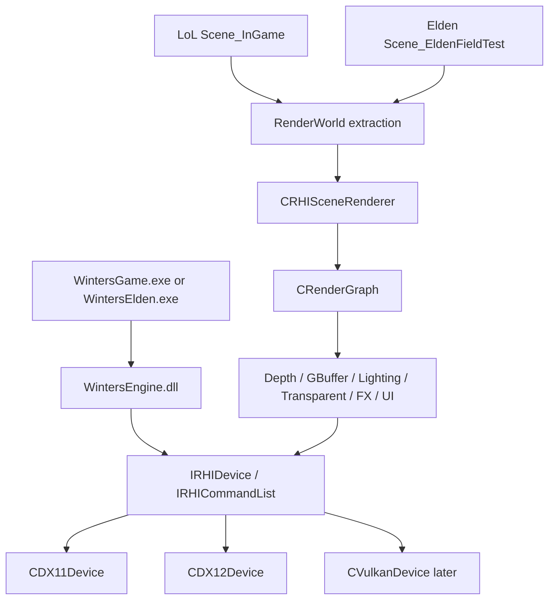

# S13. LoL to Elden Shared RHI Render Pipeline

작성일: 2026-05-25

목표: LoL 클라이언트 렌더링을 먼저 공용 RHI 렌더링 구조로 정리하고, 같은 구조를 Elden 클라이언트가 그대로 사용한다. DX12 smoke exe/project는 만들지 않는다.

## 결론

LoL과 Elden을 따로 렌더러로 갈라 만들면 다시 DX11 레거시가 복제된다.

정답은 다음 순서다.

1. 현재 LoL `Scene_InGame` 렌더 경로를 공용 RHI scene render pipeline으로 만든다.
2. LoL은 이 공용 pipeline의 첫 소비자가 된다.
3. Elden은 `CEldenGameModule` + `Scene_EldenFieldTest`만 추가하고 같은 pipeline을 호출한다.
4. DX11은 첫 backend, DX12는 같은 RHI contract를 구현하는 backend로 유지한다.
5. 검증은 `WintersGame.exe` / Client config / command line에서 한다. `DX12.exe`, `Smoke.vcxproj`, `DX12SmokeHost`는 재생성하지 않는다.

## 현재 코드베이스 기준 사실

### RHI backend selection

- `Engine/Include/EngineConfig.h`
  - `eEngineRHIBackend::{Auto, DX12, DX11, Null, Vulkan, Metal, Xbox, PS5}`가 있다.
  - `EngineConfig::rhiBackend`와 `allowRHIFallback`이 있다.

- `Client/Private/main.cpp`
  - `--rhi=dx11`, `--rhi=dx12`, `--rhi=null`을 파싱한다.
  - 기본값은 현재 DX11이다.

- `Engine/Private/Framework/CEngineApp.cpp`
  - `config.rhiBackend`에 따라 DX12 또는 DX11 device를 만든다.
  - DX12는 `WINTERS_RHI_BACKEND_DX12` config에서만 컴파일된다.
  - 현재 DX12 path는 clear/present 중심이다.

### 가장 큰 frame loop 문제

현재 `CEngineApp::Update()`는 DX12일 때 `SceneManager::Update()`를 건너뛰고 `m_pGameApp->OnUpdate()`만 호출한다.

현재 `CGameApp::OnUpdate()` / `CGameApp::OnRender()`는 비어 있다.

따라서 DX12 Client는 backend device가 떠도 실제 scene update/render가 들어갈 수 없다.

첫 수정은 다음이어야 한다.

- `SceneManager::Update/LateUpdate/Render`는 backend와 무관하게 호출한다.
- ImGui DX11 backend, legacy UI cursor, DX11 shared shader init만 DX11 gate에 남긴다.
- DX12에서 아직 준비 안 된 debug UI는 skip하되 scene render entry는 살아 있어야 한다.

### 현재 RHI interface

- `Engine/Public/RHI/IRHIDevice.h`
  - `BeginFrame`, `EndFrame`
  - `GetFrameCommandList`
  - `CreateBuffer`, `CreateShader`, `CreateTexture`
  - `CreatePipeline`, `CreateRenderPass`, `CreateBindGroupLayout`, `CreateBindGroup`

- `Engine/Public/RHI/IRHICommandList.h`
  - `BeginRenderPass`, `SetPipeline`, `SetBindGroup`
  - `SetVertexBuffer`, `SetIndexBuffer`
  - `Draw`, `DrawIndexed`, `DrawIndexedIndirect`
  - `UpdateBuffer`, `TransitionResource`

### DX12 backend 상태

- `Engine/Private/RHI/DX12/`에 device, swapchain, queue, command list, buffer, texture, shader, pipeline, bind group 파일이 있다.
- `CDX12Device::BeginFrame/EndFrame`는 frame command list를 열고 닫으며 present까지 처리한다.
- `CDX12Device`는 buffer/shader/texture/pipeline/renderpass/bindgroup handle table을 소유한다.
- DX12 path는 공용 RHI renderer가 붙을 기반은 있다.

### DX11 backend 상태

- `Engine/Private/RHI/DX11/CDX11Device`는 `IRHIDevice`를 구현한다.
- 하지만 `CreateBuffer/CreateShader/CreateTexture/CreateCommandList/GetFrameCommandList`는 아직 DX11에서 실질 구현이 없다.
- `CreatePipeline/CreateRenderPass/CreateBindGroup*`는 descriptor 보관 scaffold에 가깝다.
- 기존 LoL 렌더링은 `DX11Shader`, `DX11Pipeline`, `CBlendStateCache`, native DX11 renderer로 돌아간다.

따라서 LoL을 RHI 구조로 만들려면 DX12만 밀면 안 된다. DX11도 RHI resource/command contract를 구현해서 같은 renderer가 DX11과 DX12에서 모두 돌아야 한다.

### LoL renderer 상태

주요 진입점:

- `Client/Private/Scene/Scene_InGame.cpp`
  - `OnRender()`가 `CInGameRenderBridge::Render(*this)`를 호출한다.

- `Client/Private/Scene/InGameRenderBridge.cpp`
  - LoL scene의 실제 render orchestration 중심이다.
  - normal pass, map, champions, contact shadow, combat presentation, debug draw 등을 직접 순서대로 호출한다.

- `Client/Private/Scene/InGameBootstrapBridge.cpp`
  - `CGameInstance::Get_*Shader/Get_*Pipeline/Get_BlendStateCache()`를 넘겨 legacy renderer들을 만든다.

현재 가장 큰 public shim:

- `Engine/Include/GameInstance.h`
- `Engine/Public/Framework/CEngineApp.h`
- `Engine/Public/Renderer/PlaneRenderer.h`
- `Engine/Public/Renderer/ModelRenderer.h`
- `Engine/Public/Renderer/NormalPass.h`
- `Engine/Public/Renderer/FxStaticMeshRenderer.h`
- `Client/Public/GameObject/FX/FxSystem.h`
- `Client/Public/GameObject/FX/FxBeamSystem.h`

여기서 `DX11Shader`, `DX11Pipeline`, `CBlendStateCache`가 API 모양으로 남아 있다.

### Elden client 상태

- `.md/EldenRing/03_ELDEN_CLIENT_RUNTIME_ARCHITECTURE.md`는 별도 `WintersElden.exe`와 `Scene_EldenFieldTest`를 계획한다.
- 현재 실제 코드에서는 `Client/Private/GameModule/GameModuleRegistry.cpp`가 Elden을 placeholder module로 등록한다.
- `Scene_GameSelect`에는 Elden 버튼과 launch config가 있지만, `IsAvailable()`이 false라 실행되지 않는다.

즉 현재 가장 빠른 vertical slice는 별도 exe보다 `Client` shell 안에 `CEldenGameModule`과 `Scene_EldenFieldTest`를 먼저 붙이는 것이다. 이후 필요하면 같은 코드로 `WintersElden.exe`를 분리한다.

## 목표 아키텍처



게임별 코드는 world/gameplay/camera/input만 가진다.

렌더링 코드는 `Engine/Public/Renderer` 아래의 공용 RHI renderer가 가진다.

## 공용 렌더 파이프라인

### 1. Frame

```cpp
pDevice->BeginFrame(clear);
SceneManager->Update(dt);
SceneManager->LateUpdate(dt);
SceneManager->Render();
pDevice->EndFrame();
```

DX11/DX12 여부로 scene update/render를 막지 않는다.

DX11 gate에 남길 것:

- ImGui DX11 backend begin/end
- legacy `CUI_Manager` raw SRV pass
- 아직 RHI화되지 않은 debug overlay

DX11 gate에서 꺼낼 것:

- SceneManager update
- SceneManager render
- `CGameApp` module lifecycle

### 2. Scene extraction

LoL과 Elden scene은 직접 renderer class를 만지지 않고 render snapshot을 만든다.

필요 타입:

```cpp
struct RenderViewDesc
{
    Mat4 matView;
    Mat4 matProjection;
    Mat4 matViewProjection;
    Vec3 vCameraWorld;
    u32_t iWidth;
    u32_t iHeight;
};

struct RenderMeshItem
{
    EntityID entity;
    Mat4 matWorld;
    const CModel* pModel;
    u32_t iSubmeshMask;
    u32_t iMaterialID;
    bool_t bSkinned;
};

struct RenderWorldSnapshot
{
    RenderViewDesc view;
    std::vector<RenderMeshItem> meshes;
    std::vector<RenderFxItem> fx;
    std::vector<RenderDebugItem> debug;
};
```

초기에는 `std::vector` 기반 CPU snapshot으로 충분하다. 이후 `CGPUScene`으로 업로드한다.

### 3. Resource layer

현재 `.wmesh`, `.wskel`, `.wanim` 파이프라인이 있으므로 Elden도 여기에 맞춘다.

공용 RHI asset path:

```text
Source FBX/texture
  -> WintersAssetConverter
  -> .wmesh / .wskel / .wanim / .wmaterial
  -> CAssetRegistry
  -> CRHIMeshResource / CRHIMaterialResource
  -> RenderWorldSnapshot item
  -> CRHISceneRenderer
```

필요 변경:

- `CModel/CMesh`에서 DX11 vertex/index buffer 소유를 분리한다.
- `CRHIMeshResource`를 추가해 `RHIBufferHandle` 기반 vertex/index buffer를 소유한다.
- `CRHIMaterialResource`를 추가해 `RHITextureHandle`과 bind group을 소유한다.
- 기존 DX11 fast path는 RHI resource path의 DX11 backend 구현으로 흡수한다.

### 4. Shader / pipeline registry

현재 `CEngineApp`가 `DX11Shader`, `DX11Pipeline`을 직접 소유한다.

목표:

```text
CEngineApp
  -> CRHIShaderLibrary
  -> CRHIPipelineLibrary
  -> CRHIBindGroupLayoutLibrary
```

필요 shader keys:

- `Mesh.Static.Depth`
- `Mesh.Skinned.Depth`
- `Mesh.Static.GBuffer`
- `Mesh.Skinned.GBuffer`
- `Mesh.Static.Forward`
- `Mesh.Skinned.Forward`
- `FX.Sprite`
- `FX.Beam`
- `FX.StaticMesh`
- `UI.Image`
- `Debug.Line`

`GameInstance::Get_MeshShader()` 같은 DX11 concrete getter는 제거 대상이다.

### 5. RenderGraph pass order

초기 공용 pass:

```text
FrameSetup
DepthPrepass
NormalOrGBuffer
LightingOrForwardMain
Transparent
FXSprite
FXMesh
UI
Debug
Present
```

LoL 초기 목표는 기존 visual을 깨지 않는 것이다.

Elden 초기 목표는 FieldTest에서 다음만 보이면 된다.

- ground/test cell 1개
- player mesh 1체
- idle animation 또는 bind pose
- third-person camera
- debug grid/hitbox

### 6. GPU-driven 확장

현재 `Engine/Public/Renderer/GPUScene.h`와 `GPUDrivenPipeline.h`가 있다.

현재 상태:

- `CGPUScene`은 CPU instance vector만 가진다.
- `CGPUDrivenPipeline::AddCullAndDrawPasses()`는 pass scaffold와 `DrawIndexedIndirect` 호출만 있다.

적용 순서:

1. CPU culling + sorted draw list
2. `CGPUScene` instance upload
3. indirect args buffer 생성
4. DX12 compute culling
5. DX11은 CPU culling fallback 유지
6. Elden world partition cell 단위로 instance range를 묶음

Elden은 오픈월드라 GPU-driven이 더 중요하지만, 먼저 LoL의 챔피언/미니언/오브젝트 draw list로 안전하게 검증한다.

## 코드베이스 수정 사항

### Phase RHI-F0. Frame loop 정리

수정 대상:

- `Engine/Private/Framework/CEngineApp.cpp`
- `Client/Public/CGameApp.h`

작업:

- `CEngineApp::Update()`에서 backend가 DX12여도 `SceneManager::Update/LateUpdate` 호출
- `CEngineApp::Render()`에서 backend가 DX12여도 `SceneManager::Render` 호출
- ImGui begin/end와 profiler ImGui overlay는 `m_bDX11RuntimeEnabled` 안에 유지
- `CGameApp::OnRender()`가 비어 있어도 scene이 렌더되도록 변경

완료 기준:

- Debug DX11 Client 기존 동작 유지
- Debug-DX12 Client에서 적어도 scene render entry가 호출됨
- no standalone smoke

### Phase RHI-F1. DX11 RHI contract 구현

수정 대상:

- `Engine/Private/RHI/DX11/CDX11Device.h/.cpp`
- 신규 가능: `Engine/Private/RHI/DX11/DX11RHICommandList.h/.cpp`
- 신규 가능: `Engine/Private/RHI/DX11/DX11RHIResource.h/.cpp`

작업:

- `CreateBuffer/DestroyBuffer/GetBufferNativeHandle`
- `CreateTexture/DestroyTexture/GetTextureNativeHandle`
- `CreateShader/DestroyShader`
- `GetFrameCommandList`
- `IRHICommandList`의 DX11 immediate 구현
- `SetPipeline/SetBindGroup/SetVertexBuffer/SetIndexBuffer/DrawIndexed`

완료 기준:

- DX11에서도 `CRHIFxSpriteRenderer` 같은 RHI renderer를 생성할 수 있음
- 기존 legacy renderer와 RHI renderer를 같은 frame에서 비교 가능

### Phase RHI-F2. Shared RHI renderer 추가

수정 대상:

- 신규: `Engine/Public/Renderer/RHISceneRenderer.h`
- 신규: `Engine/Private/Renderer/RHISceneRenderer.cpp`
- 신규: `Engine/Public/Renderer/RenderWorldSnapshot.h`
- 신규: `Engine/Public/Renderer/RHIMeshResource.h`
- 신규: `Engine/Private/Renderer/RHIMeshResource.cpp`
- 신규: `Engine/Public/Renderer/RHIMaterialResource.h`
- 신규: `Engine/Private/Renderer/RHIMaterialResource.cpp`

작업:

- CPU snapshot 기반 static mesh draw
- skinned mesh는 첫 단계에서 기존 `CModel` animation data를 참조하고, GPU buffer upload만 RHI로 처리
- `RenderGraph`에 main pass/transparent/fx pass를 붙임

완료 기준:

- LoL map 또는 champion 1체가 RHI renderer로 렌더됨
- DX11 backend와 DX12 backend가 같은 renderer API를 사용

### Phase RHI-F3. LoL InGame 렌더 경로 이관

수정 대상:

- `Client/Private/Scene/InGameRenderBridge.cpp`
- `Client/Private/Scene/InGameBootstrapBridge.cpp`
- `Engine/Public/Renderer/ModelRenderer.h`
- `Engine/Public/Renderer/PlaneRenderer.h`
- `Engine/Public/Renderer/NormalPass.h`
- `Engine/Public/Renderer/FxStaticMeshRenderer.h`
- `Client/Public/GameObject/FX/FxSystem.h`
- `Client/Public/GameObject/FX/FxBeamSystem.h`

작업:

- `InGameRenderBridge`는 `RenderWorldSnapshot` 작성 후 `CRHISceneRenderer::Render(snapshot)` 호출
- `InGameBootstrapBridge`에서 `Get_MeshShader/Get_MeshPipeline/Get_BlendStateCache` 의존 제거
- FX sprite/beam/static mesh를 RHI resource path로 통합
- utility plane, contact shadow, attack range도 RHI sprite/mesh item으로 통합

완료 기준:

- Client/Public에서 `DX11Shader`, `DX11Pipeline`, `CBlendStateCache` hit 감소
- `InGameBootstrapBridge.cpp`의 `Get_*Shader/Get_*Pipeline` 호출 제거
- LoL DX11 visual 유지

### Phase RHI-F4. Elden module 최소 구현

수정 대상:

- 신규: `Client/Public/GameModule/Elden/EldenGameModule.h`
- 신규: `Client/Private/GameModule/Elden/EldenGameModule.cpp`
- 수정: `Client/Private/GameModule/GameModuleRegistry.cpp`
- 신규: `Client/Public/Scene/Elden/Scene_EldenFieldTest.h`
- 신규: `Client/Private/Scene/Elden/Scene_EldenFieldTest.cpp`

작업:

- placeholder Elden module을 실제 module로 교체
- `IsAvailable()` true
- `CreateInitialScene()`이 `Scene_EldenFieldTest` 반환
- scene은 player/test mesh/ground/camera만 구성
- 렌더링은 `CRHISceneRenderer`만 호출

완료 기준:

- GameSelect에서 Winters Elden 진입 가능
- `Scene_EldenFieldTest::OnRender()`가 LoL과 같은 RHI renderer 호출
- 첫 목표는 mesh 1체 + ground 1개 렌더

### Phase RHI-F5. Elden asset runtime 연결

수정 대상:

- `.md/EldenRing/10_ASSET_PIPELINE_TOOLING.md`의 도구 흐름에 맞춰 runtime loader 추가
- `Tools/EldenAssetPipeline/`
- `WintersAssetConverter`
- 신규 `Client/Bin/Resource/Elden/...` staging 규약

작업:

- 첫 캐릭터 후보 `chr3010`을 `.wmesh/.wskel/.wanim`으로 변환
- `Scene_EldenFieldTest`에서 `CRHIMeshResource`로 로드
- idle animation 또는 bind pose 표시

완료 기준:

- Elden asset이 Assimp runtime path가 아니라 Winters binary path로 로드됨
- RHI buffer/texture handle을 통해 렌더됨

### Phase RHI-F6. GPU-driven / draw call 최적화

수정 대상:

- `Engine/Public/Renderer/GPUScene.h`
- `Engine/Public/Renderer/GPUDrivenPipeline.h`
- 신규 private implementation files

작업:

- LoL: champion/minion/turret/object instance를 `CGPUScene`에 업로드
- Elden: world partition cell instance를 `CGPUScene`에 업로드
- DX12: compute culling + indirect draw
- DX11: CPU culling + direct/instanced draw fallback

완료 기준:

- draw count / visible instance count profiler counter 추가
- LoL에서 draw call 감소 확인
- Elden field test에서 cell 단위 culling 확인

## LoL과 Elden의 역할 분리

### LoL이 먼저 맡을 검증

- 현재 자산과 scene이 이미 많다.
- 기존 visual regression을 비교하기 쉽다.
- FX, UI, champion, map, normal pass가 모두 있어 공용 renderer 검증 밀도가 높다.

LoL에서 검증할 것:

- static mesh
- skinned mesh
- sprite/beam FX
- UI image
- contact shadow
- debug draw
- CPU culling

### Elden이 이어받을 것

- third-person camera
- action character
- world partition
- streaming
- large mesh/cell rendering
- GPU-driven culling

Elden은 렌더러를 새로 만들지 않는다. `RenderWorldSnapshot`만 Elden식으로 만든다.

## 금지 사항

- `DX12.exe` 생성 금지
- `DX12.vcxproj` 생성 금지
- `Smoke.vcxproj` 생성 금지
- `Tools/DX12SmokeHost` 재생성 금지
- LoL renderer와 Elden renderer를 별도 class hierarchy로 복제 금지
- Client/Public에 새 `ID3D11*` 노출 금지
- build 통과를 위해 DX12 path를 legacy DX11 concrete type으로 되돌리기 금지

## 검증 명령

```powershell
git diff --check
& 'C:\Program Files\Microsoft Visual Studio\18\Community\MSBuild\Current\Bin\MSBuild.exe' Winters.sln /t:Client /m /p:Configuration=Debug /p:Platform=x64 /v:minimal
& 'C:\Program Files\Microsoft Visual Studio\18\Community\MSBuild\Current\Bin\MSBuild.exe' Winters.sln /t:Client /m /p:Configuration=Debug-DX12 /p:Platform=x64 /v:minimal
```

runtime 검증은 같은 Client executable로 한다.

```powershell
Client/Bin/Debug/WintersGame.exe --rhi=dx11
Client/Bin/Debug-DX12/WintersGame.exe --rhi=dx12
```

향후 Elden module이 붙으면:

```powershell
Client/Bin/Debug-DX12/WintersGame.exe --rhi=dx12 --product=elden --smoke-start
```

## 다음 바로 구현할 세션

1. `CEngineApp` frame loop를 backend-neutral로 정리한다.
2. DX12 Client에서 scene update/render entry가 호출되는지 log/profiler로 확인한다.
3. DX11 RHI command/resource contract를 구현한다.
4. `CRHISceneRenderer` skeleton을 추가한다.
5. LoL에서 map 또는 champion 1체를 RHI renderer로 그린다.
6. Elden module placeholder를 실제 `CEldenGameModule`로 바꾸고 같은 renderer를 호출한다.

이 순서면 LoL도 RHI로 정리되고, Elden은 같은 pipeline 위에 얹힌다.
