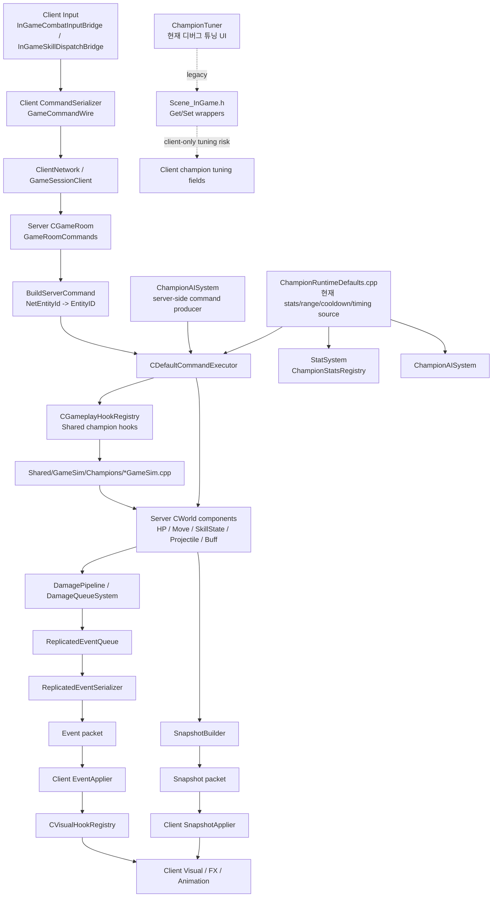
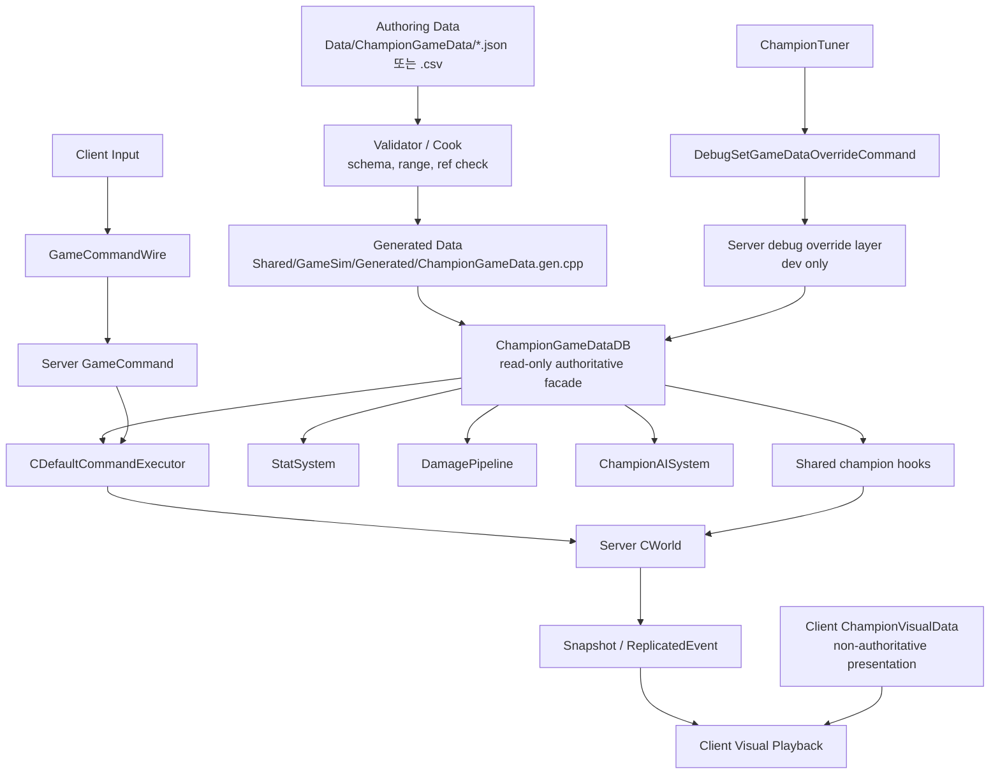

# 챔피언 GameData 서버 권위 파이프라인

작성일: 2026-06-01
상태: 이후 리팩터링 세션에서 참조할 기준 문서

## 목적

이 문서는 챔피언 데이터 리팩터링의 기준 방향을 고정한다.

목표는 기획자 친화적이고, 서버 권위에 맞으며, 데이터 지향적으로 확장 가능한 챔피언 데이터 파이프라인이다. 최종 구조는 150명 이상의 챔피언을 감당해야 하며, `Scene_InGame`, 클라이언트 튜너, 런타임 singleton이 gameplay truth의 원천이 되면 안 된다.

고정 흐름은 아래다.

```text
Client Input -> GameCommand -> Server GameSim -> Snapshot/Event -> Client Visual
```

## 핵심 규칙

gameplay 데이터는 클라이언트 scene이나 클라이언트 visual tuner가 소유하지 않는다.

서버 권위 값은 공유 immutable game data에서 나오고, 서버 GameSim 시스템이 소비한다. 클라이언트는 UI, 입력 preview, debug 표시, 약한 prediction을 위해 shared game data를 읽을 수 있지만 gameplay 결과를 확정하면 안 된다.

## 최종 구조 방향

장기 구조는 아래 흐름을 따른다.

```text
Authoring Data
  -> validator / cook / codegen
  -> generated immutable Shared/GameSim runtime table
  -> ChampionGameDataDB read-only access
  -> Server GameSim systems
  -> Snapshot/Event
  -> Client visual application
```

gameplay 데이터와 visual 데이터는 분리한다.

```text
Shared/GameSim ChampionGameData
  - stat
  - skill target mode
  - range
  - cooldown
  - mana cost
  - cast/recovery timing
  - stage rule
  - scaling id
  - server gameplay policy id

Client ChampionVisualData
  - mesh scale
  - FX color
  - sprite/beam size
  - sound key
  - socket/bone
  - camera shake
  - presentation-only offset
```

## 만들면 안 되는 구조

gameplay 시스템이 수정하는 mutable runtime `DataCenter` singleton은 만들지 않는다. 이름만 바뀐 global tuning이 되기 쉽다.

피해야 할 구조:

```text
normal gameplay 중 CChampionDataCenter::Add()
ImGui에서 CChampionDataCenter::Set*()
Scene_InGame champion Get/Set tuning wrapper
damage/range/cooldown/timing의 client-only mutation
visual preset이 Shared/GameSim gameplay data에 섞이는 구조
```

허용되는 런타임 접근 방식은 read-only다.

```text
ChampionGameDataDB::FindChampion()
ChampionGameDataDB::FindSkill()
ChampionGameDataDB::ResolveStats()
ChampionGameDataDB::ResolveSkillCooldown()
ChampionGameDataDB::ResolveSkillTiming()
```

## 기획자 친화 작업 흐름

일반 작업 흐름:

```text
champion authoring data 수정
-> validator 실행
-> runtime table generate/cook
-> server/client build
-> server와 client가 data schema/hash 비교
```

런타임 튜닝 흐름:

```text
Client ImGui에서 debug value 수정
-> client가 DebugSetGameDataOverrideCommand 전송
-> server debug build가 temporary override 적용
-> server simulation이 Snapshot/Event 송출
-> client에서 결과 관찰
-> 확정된 값은 authoring data에 반영
```

runtime override는 debug-only다. normal gameplay의 데이터 원천이 되면 안 된다.

## 세션 로드맵

### S1. Read-Only ChampionGameData 진입점

`Shared/GameSim`에 `ChampionGameData` 타입과 `ChampionGameDataDB` facade를 추가한다.

S1에서는 DB가 기존 `ChampionRuntimeDefaults`로 위임한다. 따라서 gameplay behavior는 바뀌면 안 된다.

성공 기준:

```text
Server와 Client build 통과
gameplay behavior 변화 없음
ChampionGameDataDB가 이후 read path로 존재
기존 GetDefault* API는 계속 동작
```

리뷰 기준:

```text
mutable runtime singleton 없음
Scene_InGame 의존 없음
client-only gameplay mutation path 없음
Shared/GameSim ChampionGameData에 visual field 없음
```

### S2. Generated-Style Seed Table

`ChampionRuntimeDefaults.cpp`의 anonymous timing/range/cooldown row를 generated-style static table 형태로 옮긴다.

이 세션에서는 아직 C++ 수동 테이블이어도 된다. 다만 나중에 cook/codegen 결과물로 기계적으로 교체할 수 있는 모양이어야 한다.

### S3. Legacy API Wrapper Migration

아래 기존 API가 내부적으로 `ChampionGameDataDB`를 통해 값을 resolve하도록 바꾼다.

```text
BuildDefaultChampionStat
GetDefaultChampionSkillCooldown
GetDefaultChampionSkillRange
GetDefaultChampionSkillTiming
```

기존 함수명은 임시 compatibility wrapper로 남겨도 된다.

### S4. Server Systems Consume DB

서버 gameplay 시스템을 DB 직접 읽기 방향으로 옮긴다.

대상:

```text
CommandExecutor
StatSystem
DamagePipeline
AttackChaseSystem
CombatActionSystem
Champion GameSim hooks
```

서버 시스템은 client registry나 visual tuner에 의존하면 안 된다.

### S5. Authoring Schema

기획자가 직접 다룰 authoring data format을 추가한다.

권장 배치:

```text
Data/ChampionGameData/<Champion>.json
```

150명 로스터에서 merge conflict를 줄이기 위해 champion 하나가 gameplay authoring file 하나를 소유한다.

### S6. Validator And Codegen

validator/cook 단계를 추가한다.

검증 항목:

```text
champion id uniqueness
skill slot completeness
stage count validity
finite non-negative scalar values
server-only field가 visual data에 없는지
visual-only field가 Shared/GameSim data에 없는지
schema version
generated hash
```

출력 대상:

```text
Shared/GameSim/Generated/ChampionGameData.gen.h
Shared/GameSim/Generated/ChampionGameData.gen.cpp
```

### S7. Server Debug Override Command

debug build 전용 command flow를 추가한다.

```text
Client ChampionTuner
-> DebugSetGameDataOverrideCommand
-> Server CommandExecutor 또는 debug service
-> temporary server override layer
```

Release build는 이 command를 무시하거나 거부해야 한다.

### S8. ChampionTuner Conversion

`ChampionTuner`를 scene getter/setter mutation 구조에서 아래 구조로 전환한다.

```text
read-only ChampionGameDataDB display
ClientVisualData에 대한 visual-only local tuning
gameplay 값은 server debug override request
```

### S9. Scene_InGame Cleanup

`Client/Public/Scene/Scene_InGame.h` line 505 근처의 champion-specific getter/setter block을 제거한다.

이 작업은 S8에서 `ChampionTuner.cpp` 의존을 먼저 제거한 뒤에만 안전하다.

### S10. Scale And Collaboration Rules

최종 협업 규칙을 추가한다.

```text
champion gameplay authoring file은 champion별 1개
필요한 경우 champion visual authoring file도 champion별 1개
merge 전 validator 필수
server/client data hash boot log 필수
Scene_InGame에 gameplay number 금지
client visual preset에 gameplay number 금지
```

## 수락 기준

아래가 모두 true이면 리팩터링 방향이 맞다.

```text
Server가 최종 gameplay 결과를 소유한다
Client가 authoritative gameplay 값을 직접 mutate할 수 없다
Shared gameplay data와 client visual data가 분리되어 있다
Server/client가 같은 game data schema/hash를 보고할 수 있다
champion 추가 시 Scene_InGame switch가 계속 커지지 않는다
기획자-facing data를 champion 단위로 리뷰할 수 있다
debug tuning 결과를 committed authoring data로 되돌리는 경로가 명확하다
```

## 현재 첫 단계

S1부터 진행한다.

S1은 작고 behavior-preserving이어야 한다. read-only DB facade를 추가하고 Server/Client build에 연결하되, 기존 gameplay behavior는 그대로 유지한다. S1 반영 후 리뷰는 새 진입점이 장기 구조를 더럽히지 않는지에 집중한다.

## 코드베이스 현재 의존성 그래프



현재 흐름은 서버 권위의 큰 줄기를 이미 갖고 있다. 클라이언트는 입력을 `GameCommandWire`로 보내고, 서버는 `BuildServerCommand`로 서버 엔티티 기준 명령으로 변환한 뒤 `CDefaultCommandExecutor`와 Shared GameSim hook을 통해 월드 컴포넌트를 바꾼다. 이후 서버가 snapshot과 replicated event를 만들고, 클라이언트는 그 결과를 받아 visual hook, FX, animation을 재생한다.

문제는 "게임플레이 데이터의 출처"가 아직 하나의 기획자 친화 데이터 센터로 모이지 않았다는 점이다. 현재 핵심 수치의 많은 부분은 `ChampionRuntimeDefaults.cpp`에 하드코딩되어 있고, 일부 튜닝 진입점은 `Scene_InGame.h`의 getter/setter와 `ChampionTuner`를 통해 클라이언트 런타임 필드에 닿는다. 이 상태에서는 서버 권위 흐름은 존재하지만, 150명 규모의 협업에서 데이터 소유권, 리뷰 단위, 검증 단위, hot tuning 경로를 안정적으로 나누기 어렵다.

## 목표 의존성 그래프



목표 구조에서는 gameplay 결과에 영향을 주는 모든 정보가 `ChampionGameDataDB`를 통해 읽힌다. DB는 처음에는 기존 `ChampionRuntimeDefaults`를 감싸는 read-only facade로 시작하고, 이후 세션에서 generated table, validator, authoring file, dev override layer를 단계적으로 붙인다.

클라이언트는 서버 권위 데이터를 직접 수정하지 않는다. 클라이언트에 남을 수 있는 데이터는 입력 보조, UI 표시, preview, animation/FX playback, interpolation, debug visualization처럼 결과 권위를 갖지 않는 presentation 데이터다. 디버그 튜너가 gameplay 데이터를 바꾸고 싶다면 클라이언트 필드 set이 아니라 서버 debug command를 통해 서버 override layer에 요청해야 한다.

## 데이터 흐름 설명

1. 입력 흐름

클라이언트는 클릭, 스킬 키, 공격 명령을 `CommandSerializer`를 통해 `GameCommandWire`로 보낸다. 이 wire command는 아직 클라이언트 관점의 네트워크 명령이며, 최종 gameplay 판정이 아니다.

2. 서버 명령 변환

서버는 `BuildServerCommand`에서 network entity id를 서버 `EntityID`로 해석하고, 현재 서버 월드 상태 기준으로 명령을 구성한다. 여기서부터 서버 권위 흐름이 시작된다.

3. 서버 시뮬레이션

`CDefaultCommandExecutor`, champion hook, stat/damage/AI system은 authoritative data center에서 range, cooldown, timing, cost, scaling, collision, projectile, buff, reward 정보를 읽고 월드 컴포넌트를 변경한다. S1에서는 이 진입점이 `ChampionGameDataDB`가 되고, 내부 구현은 기존 default 함수를 그대로 호출한다.

4. 결과 복제

서버 월드 변화는 snapshot과 replicated event로 클라이언트에 전달된다. HP, position, state처럼 지속 상태는 snapshot으로, skill cast, projectile spawn, damage, effect trigger처럼 한 번 재생해야 하는 일은 event로 전달한다.

5. 클라이언트 표현

클라이언트는 snapshot/event를 받아 visual hook과 FX/animation을 재생한다. 이때 클라이언트의 visual data는 "어떻게 보여줄지"만 담당하고, "맞았는지", "얼마나 강한지", "쿨다운이 얼마인지" 같은 결과 권위는 서버 GameSim에 남긴다.

## 세션별 큰 방향

- S1: `ChampionGameData` 타입과 `ChampionGameDataDB` read-only facade 추가. 기존 동작은 바꾸지 않고 진입점만 만든다.
- S2: stat/range/cooldown/timing 조회 지점을 DB facade로 단계 이전한다.
- S3: `Scene_InGame.h`의 gameplay getter/setter와 `ChampionTuner` 직접 수정 경로를 제거하고 read-only/debug-command 구조로 바꾼다.
- S4: skill scaling, reward, skin, visual cue 등 registry 경계를 `GameDataDB`와 역할별 DB로 정리한다.
- S5: 기획자 친화 authoring schema를 추가한다.
- S6: validator/cook/generated data pipeline을 붙인다.
- S7: 서버 dev override layer와 튜너 왕복 검증을 붙인다.
- S8: snapshot/event schema version, data hash, mismatch 진단을 강화한다.
- S9: 150명 협업 기준의 ownership, review, test, data diff 정책을 문서화한다.
