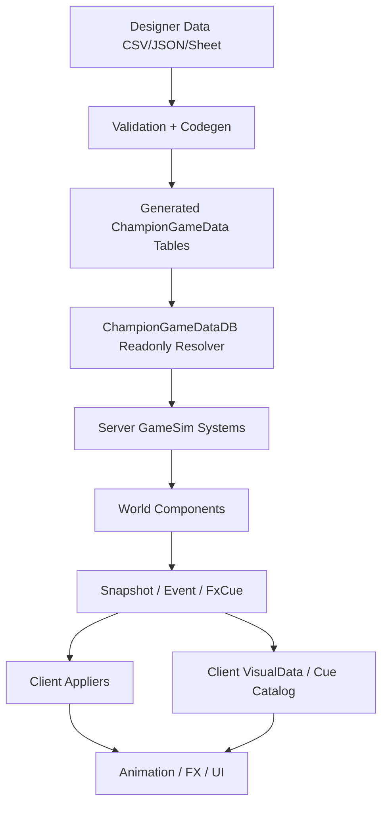

# ChampionGameData 기획 협업 파이프라인 인덱스

작성일: 2026-06-01  
상태: 목표 구조 박제 / 세션별 구현 기준 문서  
기준 흐름: `Client Input -> GameCommand -> Server GameSim -> Snapshot/Event/FxCue -> Client Visual`

## 목표

이 문서는 챔피언 gameplay 데이터를 기획자와 개발자가 함께 다룰 수 있는 서버 권위 데이터 파이프라인으로 고정하기 위한 인덱스다.

최종 목표는 아래 구조다.



## 현재 코드베이스 기준점

이미 반영된 핵심 지점:

- `Shared/GameSim/Definitions/ChampionGameData.h`
- `Shared/GameSim/Registries/ChampionGameData/ChampionGameDataDB.h`
- `Shared/GameSim/Registries/ChampionGameData/ChampionGameDataDB.cpp`
- `Shared/GameSim/Definitions/ChampionRuntimeDefaults.cpp`
- `Shared/GameSim/Systems/CommandExecutor/CommandExecutor.cpp`
- `Shared/GameSim/Systems/Move/MoveSystem.cpp`
- `Shared/GameSim/Systems/ChampionAI/ChampionAISystem.cpp`
- `Client/Private/Scene/Scene_InGame.cpp`
- `Client/Private/Scene/InGameChampionStateBridge.cpp`

현재 상태:

- `ChampionGameDataDB`는 read-only resolver 진입점으로 존재한다.
- `ChampionRuntimeDefaults.cpp`는 대부분 `ChampionGameDataDB` wrapper 역할로 낮아졌다.
- 서버 핵심 시스템 일부는 `ChampionGameDataDB`를 직접 조회한다.
- 칼리스타 passive dash의 거리, 지속시간, 입력 grace는 `ChampionGameDataDB`로 이동했다.
- 아직 `ChampionGameDataDB.cpp` 내부 table은 hand-written C++ row table이다.
- 아직 authoring data, validation, codegen, generated table은 없다.
- 아직 client champion `GetTuning()` 안에 gameplay 성격 값이 남아 있다.

## 금지 방향

아래 구조는 만들지 않는다.

```text
Client Scene_InGame
-> champion gameplay Get/Set
-> client local tuning mutation
-> server result와 다른 gameplay truth
```

아래도 만들지 않는다.

```text
Mutable global DataCenter singleton
ImGui direct SetDamage/SetRange/SetCooldown
Client visual preset이 Shared/GameSim gameplay 값을 소유
```

허용 방향은 read-only resolver와 debug-only server override다.

```text
Designer Data
-> Validation + Codegen
-> Generated ChampionGameData
-> ChampionGameDataDB
-> Server GameSim
```

debug tuning은 아래 흐름만 허용한다.

```text
ChampionTuner UI
-> Debug GameCommand
-> Server GameSim
-> ChampionGameDataDB debug override
-> Snapshot/Event/FxCue
-> Client Visual
```

## 데이터 분류 기준

서버 권위 gameplay data:

- champion base stats
- attack range / attack speed baseline
- skill cooldown
- skill range
- mana/resource cost
- lock duration
- cast frame / recovery frame
- stage count / stage window
- damage / heal / shield / slow / stun 수치
- projectile speed / lifetime / collision radius
- dash distance / duration / input grace
- target mode / gameplay policy id
- scaling table id
- summoner spell range / cooldown
- visual cue id

클라이언트 visual data:

- mesh scale
- particle scale
- trail color
- sprite atlas fps
- effect lifetime
- sound key
- socket/bone attach
- camera shake
- animation-only playback multiplier
- debug draw style

## 세션 인덱스

### S11. Authoring Schema Seed

목표:

- `Data/Gameplay/ChampionGameData/champions.json` 추가
- 현재 `ChampionGameDataDB.cpp` hand-written table을 authoring JSON으로 옮길 준비
- JSON schema의 최소 형태를 고정

성공 기준:

- champion별 stats/skill/timing/stage/summoner/passiveDash를 표현할 수 있다.
- champion별 파일 분리를 추후 도입할 수 있는 형태다.
- generated table과 authoring hash를 만들 수 있는 충분한 입력이 있다.

### S12. Validator + Codegen Tool

목표:

- `Tools/ChampionData/build_champion_game_data.py` 추가
- authoring data 검증
- generated h/cpp 생성

검증 항목:

- schema version 존재
- champion id 중복 금지
- skill slot 중복 금지
- stage index 범위 검증
- finite number 검증
- cooldown/range/duration 음수 금지
- `stageCount`와 stage row 불일치 금지
- generated hash 출력

출력 목표:

- `Shared/GameSim/Generated/ChampionGameData.generated.h`
- `Shared/GameSim/Generated/ChampionGameData.generated.cpp`

### S13. ChampionGameDataDB Generated Table 전환

목표:

- `ChampionGameDataDB.cpp`에서 hand-written row table 제거
- generated table을 통해 `FindChampion`, `FindSkill` 해결
- resolver 함수는 그대로 유지

성공 기준:

- `ChampionGameDataDB.cpp`에는 resolver 로직만 남는다.
- gameplay 값은 generated table에서 온다.
- Server/Client Debug x64 빌드가 통과한다.

### S14. Project Registration

목표:

- generated cpp를 Client/Server vcxproj에 등록
- filters에도 등록

성공 기준:

- clean rebuild에서 generated cpp가 컴파일된다.
- Client/Server 모두 같은 generated gameplay data를 링크한다.

### S15. ChampionRuntimeDefaults 제거 준비

목표:

- gameplay default 함수 제거
- yaw math와 net animation codec을 별도 유틸로 분리

분리 후보:

- `Shared/GameSim/Definitions/ChampionVisualMath.h`
- `Shared/GameSim/Definitions/NetAnimationCodec.h`

성공 기준:

- `GetDefaultChampion*`, `BuildDefaultChampion*`, `IsDefaultChampion*` 직접 호출이 사라진다.
- `ChampionRuntimeDefaults`는 삭제 가능 상태가 된다.

### S16. Client Gameplay Tuning Purge

목표:

- client scene과 champion visual hook에서 gameplay 성격 `GetTuning()` 제거
- Yasuo/Kalista/Irelia의 damage/range/radius/duration/interval 값을 `ChampionGameDataDB` 또는 server event 결과로 이동

남길 수 있는 값:

- animation-only speed
- color
- mesh/particle scale
- trail visual lifetime
- debug-only visual style

성공 기준:

- `Client/Private/Scene`에서 gameplay `GetTuning()`이 없다.
- server 판정에 영향을 주는 값이 client tuning 파일에 없다.

### S17. VisualCueId + Client VisualData 연결

목표:

- `ChampionGameDataSkill::visualCueId`를 server event/fx cue와 연결
- client는 `visualCueId`로 visual catalog를 조회

성공 기준:

- gameplay data는 visual cue id만 가진다.
- client visual catalog가 animation/fx/sound/camera shake를 소유한다.
- legacy local hook과 server cue 중복 재생이 없다.

### S18. Server Debug Override

목표:

- 기획자 튜닝 UI가 server debug override command를 보낸다.
- 서버 debug build에서만 temporary override가 적용된다.

성공 기준:

- release build에서 override path가 비활성이다.
- client UI가 gameplay 값을 직접 mutate하지 않는다.
- override 결과는 snapshot/event/fx cue로 관찰된다.

### S19. Pipeline Guard Script

목표:

- `Tools/ChampionData/validate_champion_pipeline.py` 추가
- 파이프라인 회귀 방지

검증 항목:

- `ChampionGameDataDB.cpp`에 hand-written gameplay row table 금지
- generated hash와 authoring hash 일치
- generated cpp project 등록 확인
- client scene gameplay `GetTuning()` 금지
- `ChampionRuntimeDefaults` 직접 gameplay 의존 금지

### S20. Team Workflow 문서화

목표:

- 기획자/개발자 협업 규칙 문서화
- 데이터 수정 리뷰 규칙 고정

규칙:

- champion gameplay data는 champion 단위 ownership을 둔다.
- visual data와 gameplay data PR을 분리할 수 있어야 한다.
- gameplay data 수정은 validator 통과가 필수다.
- generated 파일은 손으로 수정하지 않는다.
- debug override에서 확정된 값은 authoring data로 되돌려 커밋한다.

## 세션별 /plan-rules 작성 원칙

각 세션을 실제 반영하기 직전에는 `/plan-rules`로 다시 작성한다.

반드시 포함할 것:

- 기존 파일 anchor
- 새 파일 전체 본문
- vcxproj/vcxproj.filters 등록 위치
- 검증 명령
- `CONFIRM_NEEDED`가 필요한 경우 필요한 inspect 대상

반드시 피할 것:

- prose-only 구현 요약
- generated file 본문 생략 후 임의 적용
- client-only gameplay mutation
- `Scene_InGame`에 champion-specific gameplay getter/setter 재도입

## 최종 완료 기준

아래 검색 결과가 목표 상태다.

```powershell
rg "kChampionSkillTimingTable|kChampionSkillStageTable|kChampionSkillValueTable" Shared\GameSim
```

결과:

```text
검색 결과 없음
```

```powershell
rg "GetDefaultChampion|BuildDefaultChampion|IsDefaultChampion" Shared Client Server
```

결과:

```text
검색 결과 없음
```

```powershell
rg "GetTuning\(\)" Client\Private\Scene Client\Public\Scene
```

결과:

```text
gameplay 성격 접근 없음
visual-only 접근만 허용
```

최종 빌드:

```powershell
python .\Tools\ChampionData\build_champion_game_data.py --root .
python .\Tools\ChampionData\validate_champion_pipeline.py --root .
git diff --check
& "C:\Program Files\Microsoft Visual Studio\18\Community\MSBuild\Current\Bin\MSBuild.exe" .\Server\Include\Server.vcxproj /m /p:Configuration=Debug /p:Platform=x64
& "C:\Program Files\Microsoft Visual Studio\18\Community\MSBuild\Current\Bin\MSBuild.exe" .\Client\Include\Client.vcxproj /m /p:Configuration=Debug /p:Platform=x64
```

