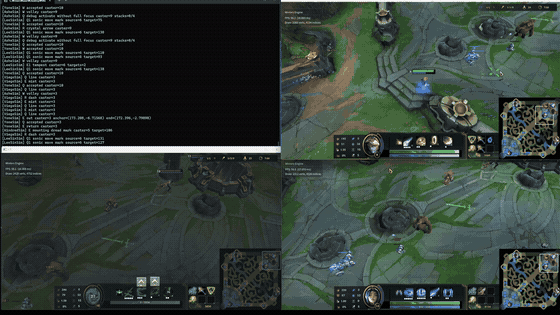

# Winters Engine

Winters는 C++20으로 만든 서버 권위 멀티플레이 게임 엔진 프로젝트입니다. 현재 기본 제품 경로는 DirectX 11 기반 LoL형 5:5 클라이언트이며, 입력은 GameCommand로 서버에 전달되고 30Hz GameSim의 결과만 Snapshot/Event로 클라이언트에 반영됩니다.

[범용 포트폴리오](https://shy-scorpio-3d0.notion.site/39cb8c3c75e280b597c0fd2f7aaacc43) · [플레이 영상 1](https://www.youtube.com/watch?v=cg4Zo1Rj9Ts) · [플레이 영상 2](https://www.youtube.com/watch?v=E9UqNx91d1A)

## 핵심 구조

~~~text
Client Input
→ GameCommand
→ Server GameSim
→ Snapshot / Event
→ Client prediction, interpolation, animation, FX, UI
~~~

- Shared/GameSim: Engine과 렌더러에 의존하지 않는 결정론 gameplay contract
- Server: 이동, 피해, 쿨다운, 투사체, 경제, 승패와 bot command validation의 권위
- Client: 입력, 약한 예측, 보간, 렌더링, 애니메이션, FX, UI와 디버그 도구
- Engine: ECS, RHI, renderer, resource, JobSystem, UI runtime
- Services: 계정·프로필·상점·매치·리플레이를 잇는 Go 로컬 백엔드

## 검증된 범위

- 10개 봇과 미니언·구조물·투사체·Snapshot/Event/Replay를 포함한 GameRoom을 54,000 tick씩 두 번 실행해 replay/world/final-state hash 일치를 확인했습니다.
- 같은 검증에서 p99 tick은 3.440ms와 3.551ms로 30Hz 예산 33.333ms 안이었고, 첫 실행의 deadline miss 6건도 결과에 보존했습니다.
- 성능 수치는 Release 캡처의 구성·시나리오·scope 경계 안에서만 기록하며, 한 scope의 개선을 전체 프레임 개선으로 확대하지 않습니다.

## 현재 한계

- DX11이 기본 경로입니다. DX12는 같은 RHI 경계 뒤의 실험 backend이며 production parity가 아닙니다.
- 기본 전송은 TCP입니다. UDP IOCP는 localhost 수직 슬라이스이며 AEAD·혼잡 제어·WAN soak 전에는 완료로 표현하지 않습니다.
- Client/Bin/Resource의 대용량 렌더링/runtime asset corpus는 저장소에 포함하지 않습니다. Practice용 authored config JSON 2개만 추적하며, source clone만으로 동일 화면을 재현하려면 별도 resource 복원이 필요합니다.
- Go/PostgreSQL/Redis 서비스는 로컬 학습 범위이며 상용 트래픽 운영 경험으로 표현하지 않습니다.

## 문서 지도

- [아키텍처 Compass](.md/architecture/WINTERS_CODEBASE_COMPASS.md)
- [에이전트 작업 규칙](AGENTS.md)

## 에셋 고지

이 저장소는 학습·포트폴리오 목적의 비상업 프로젝트입니다. 서드파티 게임 에셋은 Git에 포함하지 않으며, 공개 미디어는 결과 설명용으로만 제공합니다.
